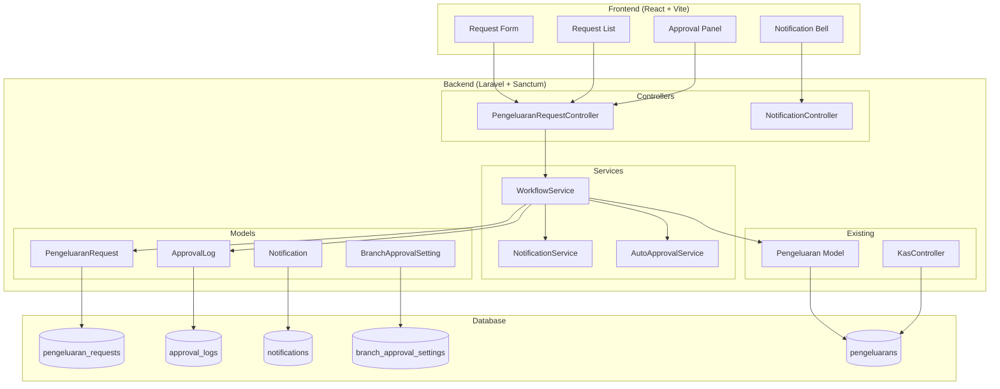
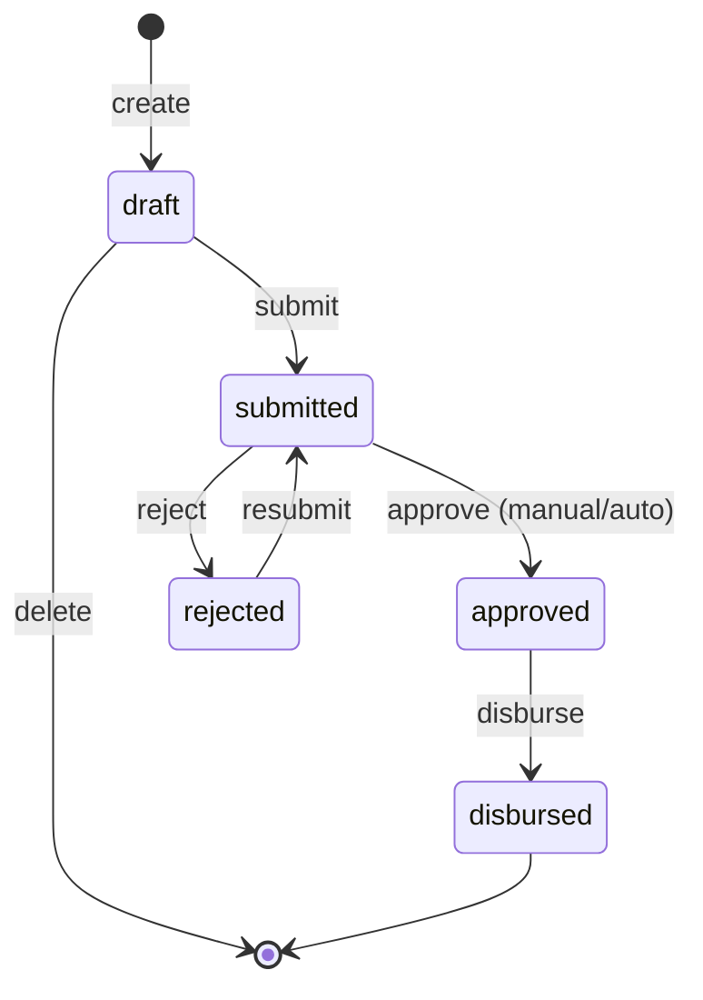

# Design Document: Approval Workflow Pengeluaran

## Overview

Fitur ini menambahkan workflow approval multi-tahap untuk pengeluaran kas sekolah pada sistem manajemen sekolah Handayani. Saat ini, pengeluaran langsung dicatat tanpa proses persetujuan. Dengan desain ini, pengeluaran harus melalui state machine: `draft → submitted → approved/rejected → disbursed`.

Desain ini memperkenalkan:
- Model baru `PengeluaranRequest` dengan state machine yang jelas
- Tabel `approval_logs` untuk audit trail (append-only)
- Tabel `branch_approval_settings` untuk konfigurasi auto-approval per branch
- Tabel `notifications` untuk in-app notification
- 3 permission baru: `create-pengeluaran-request`, `approve-pengeluaran`, `disburse-pengeluaran`
- API endpoints baru yang mengikuti pola RESTful yang sudah ada
- Backward compatibility penuh dengan laporan kas harian dan rekap bulanan

## Architecture

### High-Level Architecture



### State Machine



### Design Decisions

1. **Separate table (`pengeluaran_requests`) instead of adding columns to `pengeluarans`**: Menjaga backward compatibility dengan laporan kas yang sudah ada. Tabel `pengeluarans` tetap menjadi sumber data untuk kas harian/rekap bulanan.

2. **Service layer pattern**: `WorkflowService` menangani semua transisi status, memastikan konsistensi antara status change, audit log, dan notification dalam satu transaction.

3. **Foreign key dari `pengeluarans` ke `pengeluaran_requests`**: Kolom nullable `pengeluaran_request_id` pada tabel `pengeluarans` untuk traceability tanpa breaking existing records.

4. **Notification via database table**: Menggunakan tabel `notifications` sendiri (bukan Laravel Notifications) agar lebih ringan dan sesuai kebutuhan in-app notification sederhana.

5. **Auto-approval sebagai branch setting**: Disimpan di tabel terpisah `branch_approval_settings` agar tidak mencampur dengan `app_settings` yang sudah ada.

## Components and Interfaces

### Backend Components

#### 1. PengeluaranRequestController

```php
// API Endpoints
POST   /api/pengeluaran-request          // Create draft
GET    /api/pengeluaran-request           // List (filtered by branch + status)
GET    /api/pengeluaran-request/{id}      // Detail with approval logs
PUT    /api/pengeluaran-request/{id}      // Update draft/rejected
DELETE /api/pengeluaran-request/{id}      // Delete draft
POST   /api/pengeluaran-request/{id}/submit   // Submit for approval
POST   /api/pengeluaran-request/{id}/approve  // Approve
POST   /api/pengeluaran-request/{id}/reject   // Reject
POST   /api/pengeluaran-request/{id}/disburse // Disburse
```

#### 2. WorkflowService

Handles all state transitions with validation:

```php
class WorkflowService
{
    public function create(array $data, User $user): PengeluaranRequest;
    public function update(PengeluaranRequest $request, array $data): PengeluaranRequest;
    public function submit(PengeluaranRequest $request, User $user): PengeluaranRequest;
    public function approve(PengeluaranRequest $request, User $user, ?string $note): PengeluaranRequest;
    public function reject(PengeluaranRequest $request, User $user, string $reason): PengeluaranRequest;
    public function disburse(PengeluaranRequest $request, User $user): PengeluaranRequest;
}
```

#### 3. AutoApprovalService

```php
class AutoApprovalService
{
    public function shouldAutoApprove(PengeluaranRequest $request): bool;
    public function processAutoApproval(PengeluaranRequest $request): void;
}
```

#### 4. NotificationService

```php
class NotificationService
{
    public function notifyApprovers(PengeluaranRequest $request): void;
    public function notifyRequester(PengeluaranRequest $request, string $event): void;
}
```

#### 5. NotificationController

```php
// API Endpoints
GET    /api/notifications              // List user notifications
POST   /api/notifications/{id}/read    // Mark as read
POST   /api/notifications/read-all     // Mark all as read
GET    /api/notifications/unread-count  // Get unread count
```

#### 6. BranchApprovalSettingController

```php
// API Endpoints
GET    /api/branch-approval-settings          // Get current branch settings
PUT    /api/branch-approval-settings          // Update settings
```

### Frontend Components

#### Pages
- `PengeluaranRequest.jsx` — List view with tabs (draft, submitted, approved, rejected, disbursed)
- `PengeluaranRequestForm.jsx` — Create/edit form
- `PengeluaranRequestDetail.jsx` — Detail view with approval log timeline
- `ApprovalSettings.jsx` — Branch auto-approval configuration

#### Shared Components
- `NotificationBell.jsx` — Header notification icon with unread count badge
- `NotificationDropdown.jsx` — Dropdown list of recent notifications
- `StatusBadge.jsx` — Color-coded status indicator
- `ApprovalTimeline.jsx` — Visual timeline of approval log entries

### Permission Middleware

Mengikuti pola yang sudah ada dengan Spatie Permission middleware:

```php
Route::prefix('/pengeluaran-request')->group(function () {
    Route::get('/', [..., 'index'])->middleware('permission:create-pengeluaran-request|approve-pengeluaran|disburse-pengeluaran');
    Route::post('/', [..., 'create'])->middleware('permission:create-pengeluaran-request');
    Route::post('/{id}/submit', [..., 'submit'])->middleware('permission:create-pengeluaran-request');
    Route::post('/{id}/approve', [..., 'approve'])->middleware('permission:approve-pengeluaran');
    Route::post('/{id}/reject', [..., 'reject'])->middleware('permission:approve-pengeluaran');
    Route::post('/{id}/disburse', [..., 'disburse'])->middleware('permission:disburse-pengeluaran');
});
```

## Data Models

### Entity Relationship Diagram

```mermaid
erDiagram
    users ||--o{ pengeluaran_requests : "creates"
    branches ||--o{ pengeluaran_requests : "belongs to"
    pengeluaran_requests ||--o{ approval_logs : "has"
    pengeluaran_requests ||--o| pengeluarans : "results in"
    branches ||--o| branch_approval_settings : "has"
    users ||--o{ notifications : "receives"

    pengeluaran_requests {
        bigint id PK
        string uraian
        decimal jumlah
        date tanggal_kebutuhan
        string kategori_pengeluaran "nullable"
        string lampiran "nullable"
        enum status "draft|submitted|approved|rejected|disbursed"
        bigint requester_id FK
        bigint branch_id FK
        timestamp created_at
        timestamp updated_at
    }

    approval_logs {
        bigint id PK
        bigint pengeluaran_request_id FK
        string previous_status
        string new_status
        bigint user_id FK
        text note "nullable"
        timestamp created_at
    }

    branch_approval_settings {
        bigint id PK
        bigint branch_id FK "unique"
        boolean auto_approval_enabled "default false"
        decimal auto_approval_threshold "default 0"
        timestamp created_at
        timestamp updated_at
    }

    notifications {
        bigint id PK
        bigint user_id FK
        string type
        string title
        text message
        json data "nullable"
        boolean is_read "default false"
        timestamp created_at
    }

    pengeluarans {
        bigint id PK
        date tanggal
        string uraian
        decimal jumlah
        bigint branch_id FK
        bigint pengeluaran_request_id FK "nullable, new column"
        timestamp created_at
        timestamp updated_at
    }
}
```

### Migration: pengeluaran_requests

```php
Schema::create('pengeluaran_requests', function (Blueprint $table) {
    $table->id();
    $table->string('uraian');
    $table->decimal('jumlah', 13, 2);
    $table->date('tanggal_kebutuhan');
    $table->string('kategori_pengeluaran')->nullable();
    $table->string('lampiran')->nullable();
    $table->enum('status', ['draft', 'submitted', 'approved', 'rejected', 'disbursed'])
          ->default('draft');
    $table->foreignId('requester_id')->constrained('users');
    $table->foreignId('branch_id')->constrained('branches');
    $table->timestamps();

    $table->index(['branch_id', 'status']);
    $table->index(['requester_id']);
});
```

### Migration: approval_logs

```php
Schema::create('approval_logs', function (Blueprint $table) {
    $table->id();
    $table->foreignId('pengeluaran_request_id')->constrained()->onDelete('cascade');
    $table->string('previous_status');
    $table->string('new_status');
    $table->foreignId('user_id')->constrained('users');
    $table->text('note')->nullable();
    $table->timestamp('created_at');

    $table->index(['pengeluaran_request_id', 'created_at']);
});
```

### Migration: branch_approval_settings

```php
Schema::create('branch_approval_settings', function (Blueprint $table) {
    $table->id();
    $table->foreignId('branch_id')->unique()->constrained('branches');
    $table->boolean('auto_approval_enabled')->default(false);
    $table->decimal('auto_approval_threshold', 13, 2)->default(0);
    $table->timestamps();
});
```

### Migration: notifications

```php
Schema::create('notifications', function (Blueprint $table) {
    $table->id();
    $table->foreignId('user_id')->constrained('users')->onDelete('cascade');
    $table->string('type'); // e.g., 'pengeluaran_request_submitted', 'pengeluaran_request_approved'
    $table->string('title');
    $table->text('message');
    $table->json('data')->nullable(); // e.g., { pengeluaran_request_id: 5 }
    $table->boolean('is_read')->default(false);
    $table->timestamp('created_at');

    $table->index(['user_id', 'is_read', 'created_at']);
});
```

### Migration: add pengeluaran_request_id to pengeluarans

```php
Schema::table('pengeluarans', function (Blueprint $table) {
    $table->foreignId('pengeluaran_request_id')->nullable()->constrained()->nullOnDelete();
});
```

### Valid State Transitions

| From Status | To Status | Action | Required Permission |
|---|---|---|---|
| (new) | draft | create | create-pengeluaran-request |
| draft | submitted | submit | create-pengeluaran-request |
| draft | (deleted) | delete | create-pengeluaran-request |
| submitted | approved | approve/auto-approve | approve-pengeluaran |
| submitted | rejected | reject | approve-pengeluaran |
| rejected | submitted | resubmit | create-pengeluaran-request |
| approved | disbursed | disburse | disburse-pengeluaran |


## Correctness Properties

*A property is a characteristic or behavior that should hold true across all valid executions of a system—essentially, a formal statement about what the system should do. Properties serve as the bridge between human-readable specifications and machine-verifiable correctness guarantees.*

### Property 1: Creation Invariant

*For any* valid request payload and any authenticated user with `create-pengeluaran-request` permission, creating a PengeluaranRequest SHALL always result in a record with status `draft` and branch_id equal to the authenticated user's branch_id.

**Validates: Requirements 1.1, 10.1**

### Property 2: Mandatory Field Validation

*For any* PengeluaranRequest payload that is missing one or more mandatory fields (uraian, jumlah, tanggal_kebutuhan), the system SHALL reject the submission and the request status SHALL remain unchanged.

**Validates: Requirements 1.2, 1.7**

### Property 3: Editability by Status

*For any* PengeluaranRequest in status `draft` or `rejected`, and any valid field update by the original Requester, the system SHALL accept the update and persist the new field values. For any PengeluaranRequest in status `submitted`, `approved`, or `disbursed`, the system SHALL reject any field update.

**Validates: Requirements 1.4, 3.1**

### Property 4: Submit Transition

*For any* PengeluaranRequest in status `draft` with all mandatory fields filled, submitting the request SHALL change the status to `submitted` and create an ApprovalLog entry recording the transition.

**Validates: Requirements 1.6**

### Property 5: Branch Data Isolation

*For any* authenticated user, querying the PengeluaranRequest list SHALL return only requests where branch_id matches the user's branch_id. Attempting to access a specific PengeluaranRequest from a different branch SHALL result in a 403 Forbidden response.

**Validates: Requirements 2.2, 10.2, 10.3**

### Property 6: Approve Transition with Metadata

*For any* PengeluaranRequest in status `submitted`, when an Approver approves it, the system SHALL change the status to `approved` and create an ApprovalLog entry containing the approver's user_id, a timestamp, previous_status='submitted', and new_status='approved'.

**Validates: Requirements 2.3**

### Property 7: Reject Requires Reason

*For any* PengeluaranRequest in status `submitted`, rejecting without a reason SHALL fail, and rejecting with a non-empty reason SHALL change the status to `rejected` and create an ApprovalLog entry containing the approver's user_id, timestamp, and the exact rejection reason.

**Validates: Requirements 2.5, 2.6**

### Property 8: Permission Enforcement

*For any* user without the required permission, attempting a workflow action SHALL result in a 403 Forbidden response: `create-pengeluaran-request` for create/submit, `approve-pengeluaran` for approve/reject, `disburse-pengeluaran` for disburse.

**Validates: Requirements 2.7, 4.5, 9.1, 9.2, 9.3**

### Property 9: Resubmit Preserves History

*For any* PengeluaranRequest in status `rejected`, resubmitting SHALL change the status to `submitted`, and the complete history of all previous ApprovalLog entries (including rejection reasons) SHALL be preserved and accessible.

**Validates: Requirements 3.2, 3.3**

### Property 10: Disbursement Creates Correct Pengeluaran Record

*For any* PengeluaranRequest in status `approved`, when a Disburser records the disbursement, the system SHALL create a Pengeluaran record with uraian, jumlah, and branch_id matching the request, tanggal equal to the disbursement date, and pengeluaran_request_id pointing back to the originating request. The PengeluaranRequest status SHALL change to `disbursed`.

**Validates: Requirements 4.2, 4.3, 4.4**

### Property 11: Kas Reports Exclude Non-Disbursed Requests

*For any* set of PengeluaranRequests in statuses other than `disbursed`, the kas harian and rekap bulanan calculations SHALL produce the same totals as if those requests did not exist.

**Validates: Requirements 5.1, 5.2**

### Property 12: Disbursement Date Used in Kas

*For any* disbursed PengeluaranRequest, the corresponding Pengeluaran record SHALL use the disbursement date (not tanggal_kebutuhan) as its tanggal field for kas reporting purposes.

**Validates: Requirements 5.3**

### Property 13: Audit Log Completeness

*For any* status transition on a PengeluaranRequest, the system SHALL create exactly one ApprovalLog entry containing: previous_status, new_status, user_id of the actor, timestamp, and note (if provided).

**Validates: Requirements 6.1**

### Property 14: Auto-Approval Logic

*For any* Branch with auto-approval enabled and threshold > 0, submitting a PengeluaranRequest with jumlah strictly below the threshold SHALL result in automatic approval (status changes directly to `approved` with "auto-approved" recorded in the ApprovalLog). For any Branch with auto-approval disabled or threshold = 0, no request SHALL be auto-approved regardless of amount.

**Validates: Requirements 8.1, 8.2, 8.5**

### Property 15: Notification Targeting on Submit

*For any* PengeluaranRequest that transitions to `submitted` status, the system SHALL create notifications for all (and only) users who have `approve-pengeluaran` permission AND belong to the same branch as the request.

**Validates: Requirements 7.1**

## Error Handling

### API Error Responses

All error responses follow the existing pattern in the codebase:

```json
{
  "errors": {
    "field_name": ["error message"],
    "message": ["general error message"]
  }
}
```

### Error Scenarios

| Scenario | HTTP Status | Error Key |
|---|---|---|
| Missing mandatory fields on create/submit | 400 | Field-specific keys |
| Invalid status transition (e.g., approve a draft) | 422 | `message` |
| Permission denied | 403 | `message` |
| Cross-branch access attempt | 403 | `message` |
| Request not found | 404 | `message` |
| Reject without reason | 400 | `reason` |
| Edit non-editable request (wrong status) | 422 | `message` |
| Delete non-draft request | 422 | `message` |

### Invalid State Transition Handling

The `WorkflowService` validates transitions before executing them. If an invalid transition is attempted (e.g., approving a draft, disbursing a rejected request), the service throws a validation exception with a clear message indicating the current status and the attempted action.

### Database Transaction Safety

All state transitions are wrapped in database transactions to ensure atomicity:
- Status change on `pengeluaran_requests`
- ApprovalLog creation
- Notification creation
- Pengeluaran record creation (on disburse)

If any step fails, the entire transaction rolls back.

### File Upload Error Handling

For the optional `lampiran` (attachment) field:
- Maximum file size: 2MB
- Allowed types: PDF, JPG, PNG
- Storage: Laravel's `storage/app/public/lampiran` directory
- On upload failure: return 422 with specific file validation error

## Testing Strategy

### Property-Based Testing

This feature is suitable for property-based testing because:
- The workflow state machine has clear input/output behavior
- State transitions have universal properties that must hold for all valid inputs
- Permission enforcement and branch isolation are universal rules
- Auto-approval logic is a pure decision function based on amount vs threshold

**Library**: [Pest PHP](https://pestphp.com/) with a custom property testing helper using data providers with randomized inputs (100+ iterations per property).

**Configuration**:
- Minimum 100 iterations per property test
- Each property test tagged with: `Feature: approval-workflow-pengeluaran, Property {N}: {title}`

### Unit Tests (Example-Based)

Focus on specific scenarios and edge cases:
- Creating a request with all optional fields populated
- Deleting a draft request
- Approval with and without note
- Viewing approval log history on detail endpoint
- Notification content includes rejection reason
- Admin configuring auto-approval settings (enable/disable, set threshold)
- User with multiple permissions performing different actions
- Permission seeder registers all 3 new permissions

### Integration Tests

- Full workflow cycle: create → submit → approve → disburse → verify kas report
- Full rejection cycle: create → submit → reject → edit → resubmit → approve → disburse
- Auto-approval flow: configure threshold → submit below threshold → verify auto-approved
- Kas harian calculation with mix of direct pengeluaran and disbursed requests
- Rekap bulanan calculation unaffected by pending requests
- Notification delivery to correct users across branches

### Test Data Strategy

- Use Laravel factories for `PengeluaranRequest`, `ApprovalLog`, `Notification`, `BranchApprovalSetting`
- Seed test database with multiple branches, users with various permission combinations
- Use Faker for generating random uraian, jumlah, dates
- Property tests use randomized inputs within valid ranges (jumlah: 1000 - 100,000,000)
