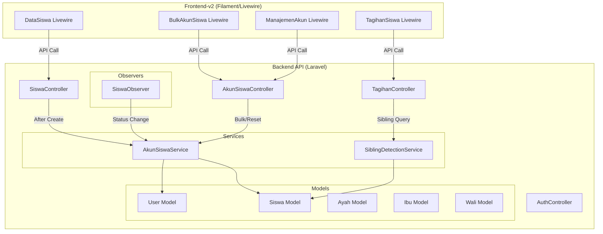
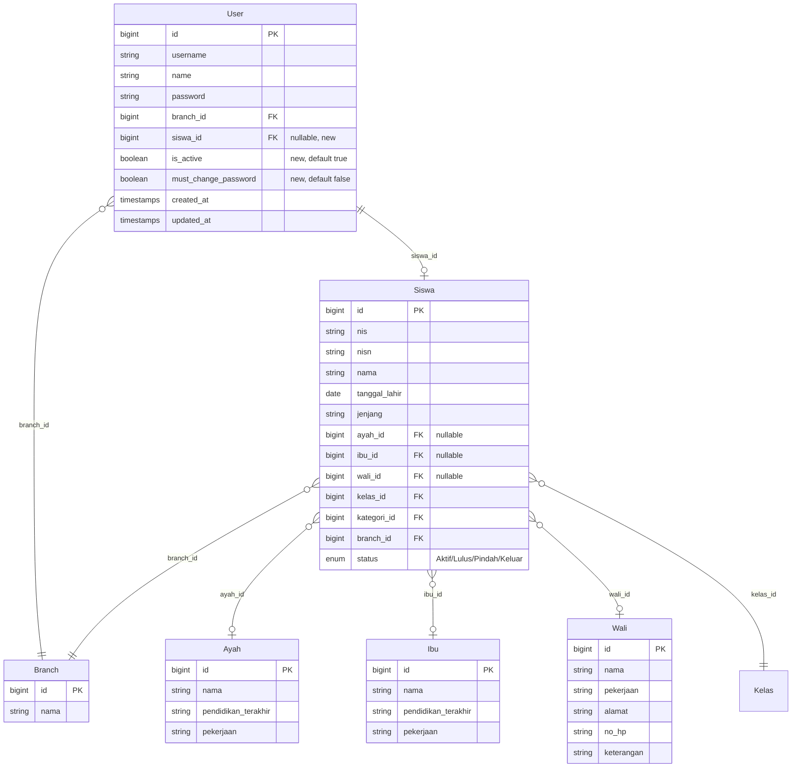

# Design Document: Auto-Create Akun Siswa

## Overview

Fitur ini mengotomasi pembuatan akun user untuk siswa dalam sistem manajemen sekolah Handayani. Saat ini, `SiswaController::create` sudah membuat record `User` dengan username=NIS dan password=tanggal_lahir, namun tanpa role assignment, tanpa field `siswa_id`, tanpa `name`, dan tanpa mekanisme sibling detection.

Design ini memperluas sistem yang ada dengan:
1. **Parent Search & Link** — Menambahkan endpoint pencarian Ayah/Ibu dan memodifikasi form siswa agar bisa memilih orang tua yang sudah ada (sibling linking).
2. **Account Creation Service** — Mengekstrak logika pembuatan akun ke service class yang reusable, menambahkan role "siswa", field `siswa_id`, `is_active`, dan `must_change_password`.
3. **Sibling Tagihan View** — Endpoint baru untuk siswa yang login agar bisa melihat tagihan saudara kandung.
4. **Credential Management** — Reset password, view credentials, dan print PDF.
5. **Bulk Account Creation** — Halaman admin untuk membuat akun massal.
6. **Auto-Deactivation** — Observer pada model Siswa untuk deaktivasi/reaktivasi akun otomatis.
7. **Role & Permission** — Menambahkan role "siswa" tanpa permission admin.

### Arsitektur Saat Ini

```
┌─────────────────┐         ┌──────────────────┐
│  frontend-v2    │  HTTP   │    backend       │
│  (Filament/     │◄───────►│    (Laravel API) │
│   Livewire)     │         │                  │
└─────────────────┘         └──────────────────┘
        │                           │
        │ Session-based             │ Sanctum Token
        │ auth via API              │ + Spatie Roles
        ▼                           ▼
   Filament Panel              MySQL Database
```

## Architecture

### System Architecture Diagram



### Key Design Decisions

1. **Service Class Pattern** — Logika pembuatan akun diekstrak ke `AkunSiswaService` agar reusable antara single creation (saat siswa didaftarkan) dan bulk creation.

2. **Eloquent Observer** — `SiswaObserver` mendengarkan event `updated` pada model Siswa untuk mendeteksi perubahan status dan trigger deaktivasi/reaktivasi otomatis.

3. **Sibling Detection via Query** — Tidak menyimpan relasi sibling secara eksplisit. Sibling dideteksi secara dinamis berdasarkan kesamaan `ayah_id`, `ibu_id`, atau `wali_id` yang non-null.

4. **Branch Scoping** — Semua query di-scope berdasarkan `branch_id` untuk isolasi multi-cabang. Ini konsisten dengan pattern yang sudah ada di codebase.

5. **Password Format DDMMYYYY** — Menggunakan `Carbon::parse($tanggal_lahir)->format('dmY')` untuk konsistensi format.

## Components and Interfaces

### Backend Components

#### 1. AkunSiswaService

Service class utama yang menangani semua operasi terkait akun siswa.

```php
namespace App\Services;

class AkunSiswaService
{
    /**
     * Create account for a single siswa.
     * @param Siswa $siswa
     * @return User|null Returns null if account already exists
     */
    public function createAccount(Siswa $siswa): ?User;

    /**
     * Create accounts in bulk for multiple siswa.
     * @param Collection<Siswa> $siswaList
     * @return array{created: int, errors: array}
     */
    public function bulkCreateAccounts(Collection $siswaList): array;

    /**
     * Reset password to default (tanggal_lahir DDMMYYYY).
     * @param User $user
     * @return void
     */
    public function resetPassword(User $user): void;

    /**
     * Deactivate account for a siswa.
     * @param Siswa $siswa
     * @return void
     */
    public function deactivateAccount(Siswa $siswa): void;

    /**
     * Activate account for a siswa.
     * @param Siswa $siswa
     * @return void
     */
    public function activateAccount(Siswa $siswa): void;

    /**
     * Generate default password from tanggal_lahir.
     * @param string $tanggalLahir (Y-m-d format)
     * @return string Password in DDMMYYYY format
     */
    public function generateDefaultPassword(string $tanggalLahir): string;
}
```

#### 2. SiblingDetectionService

Service untuk mendeteksi sibling berdasarkan kesamaan parent ID.

```php
namespace App\Services;

class SiblingDetectionService
{
    /**
     * Find all siblings of a siswa within the same branch.
     * @param Siswa $siswa
     * @return Collection<Siswa>
     */
    public function findSiblings(Siswa $siswa): Collection;
}
```

#### 3. SiswaObserver

Observer yang mendengarkan perubahan status siswa.

```php
namespace App\Observers;

class SiswaObserver
{
    /**
     * Handle the Siswa "updated" event.
     * Triggers deactivation/activation based on status change.
     */
    public function updated(Siswa $siswa): void;
}
```

#### 4. AkunSiswaController

Controller baru untuk endpoint manajemen akun siswa.

```php
namespace App\Http\Controllers;

class AkunSiswaController extends Controller
{
    // GET /akun-siswa — List akun siswa (admin, branch-scoped)
    public function index(Request $request);

    // GET /akun-siswa/unregistered — List siswa tanpa akun
    public function unregistered(Request $request);

    // POST /akun-siswa/bulk — Bulk create accounts
    public function bulkCreate(Request $request);

    // POST /akun-siswa/{id}/reset-password — Reset password
    public function resetPassword(int $id);

    // PATCH /akun-siswa/{id}/toggle-active — Manual activate/deactivate
    public function toggleActive(int $id);

    // GET /akun-siswa/credentials — Get credentials for selected accounts
    public function credentials(Request $request);

    // GET /akun-siswa/credentials/pdf — Generate PDF
    public function credentialsPdf(Request $request);
}
```

#### 5. Modifikasi pada SiswaController

- Method `create`: Memanggil `AkunSiswaService::createAccount()` setelah siswa disimpan.
- Method `create`: Menerima optional `ayah_id`, `ibu_id`, `wali_id` untuk linking ke existing parent.

#### 6. Modifikasi pada AuthController

- Method `login`: Menambahkan pengecekan `is_active` dan menyertakan `must_change_password` dalam response.

#### 7. Parent Search Endpoints

Endpoint baru untuk pencarian Ayah dan Ibu (Wali sudah ada di `WaliController::index`):

```php
// GET /ayah?search=nama — Search ayah by nama
// GET /ibu?search=nama — Search ibu by nama
```

#### 8. Sibling Tagihan Endpoint

Modifikasi pada `TagihanController` atau endpoint baru:

```php
// GET /tagihan/siswa — Get tagihan for logged-in siswa (with sibling support)
// Query param: ?siswa_id=X (optional, for viewing sibling tagihan)
```

### Frontend Components (Filament/Livewire)

#### 1. Modifikasi DataSiswa Livewire

- Menambahkan search field (Select component dengan `searchable()`) untuk Ayah/Ibu/Wali pada form create/update.
- Menggunakan API endpoint pencarian untuk populate options.

#### 2. BulkAkunSiswa Livewire (Baru)

- Halaman baru untuk bulk account creation.
- Table dengan filter jenjang/kelas.
- Checkbox selection + "Select All".
- Tombol "Buat Akun" yang memanggil bulk endpoint.

#### 3. ManajemenAkunSiswa Livewire (Baru)

- Halaman manajemen akun siswa.
- Tabel akun dengan aksi: reset password, activate/deactivate, view credentials.
- Tombol print PDF untuk credentials.

#### 4. TagihanSiswa Livewire (Baru/Modifikasi)

- View khusus untuk user dengan role "siswa".
- Sibling selector dropdown.
- Card view tagihan (integrasi dengan spec tagihan-card-view).

#### 5. ChangePassword Livewire (Baru)

- Halaman force change password.
- Ditampilkan saat `must_change_password = true`.

### API Routes (New/Modified)

```php
// Parent search (authenticated, permission: view-siswa)
Route::get('/ayah', [AyahController::class, 'index']);
Route::get('/ibu', [IbuController::class, 'index']);

// Akun Siswa management (authenticated, permission: manage-akun-siswa)
Route::prefix('/akun-siswa')->group(function () {
    Route::get('/', [AkunSiswaController::class, 'index']);
    Route::get('/unregistered', [AkunSiswaController::class, 'unregistered']);
    Route::post('/bulk', [AkunSiswaController::class, 'bulkCreate']);
    Route::post('/{id}/reset-password', [AkunSiswaController::class, 'resetPassword']);
    Route::patch('/{id}/toggle-active', [AkunSiswaController::class, 'toggleActive']);
    Route::get('/credentials', [AkunSiswaController::class, 'credentials']);
    Route::get('/credentials/pdf', [AkunSiswaController::class, 'credentialsPdf']);
});

// Siswa tagihan view (authenticated, role: siswa)
Route::get('/tagihan/siswa', [TagihanController::class, 'siswaView']);

// Password change (authenticated)
Route::post('/users/change-password', [UserController::class, 'changePassword']);
```

## Data Models

### Database Schema Changes

#### Migration: Add columns to `users` table

```sql
ALTER TABLE users ADD COLUMN siswa_id BIGINT UNSIGNED NULL;
ALTER TABLE users ADD COLUMN is_active BOOLEAN NOT NULL DEFAULT TRUE;
ALTER TABLE users ADD COLUMN must_change_password BOOLEAN NOT NULL DEFAULT FALSE;

ALTER TABLE users ADD CONSTRAINT fk_users_siswa 
    FOREIGN KEY (siswa_id) REFERENCES siswas(id) ON DELETE SET NULL;
```

#### Entity Relationship Diagram



### Sibling Detection Logic

```
Siblings of Siswa X = All Siswa Y where:
  Y.id != X.id
  AND Y.branch_id == X.branch_id
  AND (
    (X.ayah_id IS NOT NULL AND Y.ayah_id == X.ayah_id)
    OR (X.ibu_id IS NOT NULL AND Y.ibu_id == X.ibu_id)
    OR (X.wali_id IS NOT NULL AND Y.wali_id == X.wali_id)
  )
```

### Default Password Generation

```
Input:  tanggal_lahir = "2015-03-25" (Y-m-d from database)
Output: password = "25032015" (DDMMYYYY)
```

### Role & Permission Structure

| Role | Permissions | Access |
|------|------------|--------|
| superadmin | All | Full admin panel |
| admin | Admin panel permissions | Admin panel (branch-scoped) |
| user | Limited admin permissions | Admin panel (limited) |
| **siswa** (new) | `view-tagihan-siswa` | Tagihan_Card_View only |

## Correctness Properties

*A property is a characteristic or behavior that should hold true across all valid executions of a system — essentially, a formal statement about what the system should do. Properties serve as the bridge between human-readable specifications and machine-verifiable correctness guarantees.*

### Property 1: Account Creation Invariants

*For any* valid Siswa record that is created, the resulting Akun_Siswa SHALL have: username equal to the Siswa NIS, name equal to the Siswa nama, branch_id equal to the Siswa branch_id, siswa_id pointing to the Siswa record, the "siswa" role assigned, is_active set to true, and must_change_password set to true.

**Validates: Requirements 2.1, 2.3, 2.4, 2.5, 2.6, 4.4, 7.1**

### Property 2: Password Generation Round-Trip

*For any* valid date string in Y-m-d format, generating the default password (DDMMYYYY format) and then verifying it with Hash::check against the stored hash SHALL return true.

**Validates: Requirements 2.2, 4.1**

### Property 3: Duplicate NIS Idempotency

*For any* Siswa whose NIS already exists as a username in the User table within the same branch_id, attempting to create an Akun_Siswa SHALL result in no new User record being created and the total User count remaining unchanged.

**Validates: Requirements 2.7**

### Property 4: Parent Record Linking

*For any* existing Wali_Entity (Ayah/Ibu/Wali) record ID provided during siswa creation, the created Siswa SHALL reference that existing record's ID as its foreign key, and no new parent record SHALL be created for that parent type.

**Validates: Requirements 1.4, 1.5**

### Property 5: Sibling Detection Correctness

*For any* Siswa X with at least one non-null parent ID (ayah_id, ibu_id, or wali_id), the sibling detection query SHALL return exactly those other Siswa records that share at least one non-null parent ID with X AND have the same branch_id as X, excluding X itself.

**Validates: Requirements 3.1, 7.3**

### Property 6: Sibling Tagihan Isolation

*For any* sibling selected from the sibling selector, all tagihan records returned SHALL have NIS matching the selected sibling's NIS and no tagihan belonging to other siswa.

**Validates: Requirements 3.3**

### Property 7: Status-Based Account Deactivation

*For any* Siswa with an associated Akun_Siswa, when the Siswa status changes to "Lulus", "Pindah", or "Keluar", the Akun_Siswa is_active field SHALL become false. Conversely, when the status changes to "Aktif", is_active SHALL become true.

**Validates: Requirements 6.1, 6.4**

### Property 8: Inactive Account Login Rejection

*For any* User with is_active equal to false, a login attempt with correct username and password SHALL be rejected and SHALL NOT produce an authentication token.

**Validates: Requirements 6.2**

### Property 9: Branch Isolation for Account Management

*For any* admin user querying the akun-siswa management endpoints, all returned Akun_Siswa records SHALL have branch_id equal to the admin's active branch_id.

**Validates: Requirements 7.2**

### Property 10: Bulk Creation Error Resilience

*For any* batch of siswa submitted for bulk account creation where some siswa have conflicting NIS values, the non-conflicting siswa SHALL still have accounts created successfully, and the total accounts created SHALL equal the number of non-conflicting siswa in the batch.

**Validates: Requirements 5.5**

### Property 11: Siswa Role Access Denial

*For any* admin panel route protected by admin permissions, a request authenticated with a User having only the "siswa" role SHALL receive a 403 Forbidden response.

**Validates: Requirements 8.3**

### Property 12: Bulk Filter Correctness

*For any* jenjang and kelas filter applied to the unregistered siswa list, all returned siswa SHALL match the specified jenjang and kelas values AND shall have no associated Akun_Siswa.

**Validates: Requirements 5.1, 5.2**

### Property 13: Password Change State Transition

*For any* User with must_change_password equal to true, after submitting a valid new password, the must_change_password field SHALL become false and Hash::check with the new password SHALL return true.

**Validates: Requirements 4.6**

## Error Handling

### Account Creation Errors

| Scenario | Handling | User Feedback |
|----------|----------|---------------|
| NIS already exists as username (same branch) | Skip creation, log warning | Bulk: included in error summary |
| Siswa has no tanggal_lahir | Skip creation, log error | "Tanggal lahir tidak tersedia" |
| Database constraint violation | Catch exception, skip | Log error, continue bulk |
| Role "siswa" not found | Throw exception, halt | System error — requires seeder fix |

### Login Errors

| Scenario | Response | Message |
|----------|----------|---------|
| Account inactive (is_active=false) | 401 | "Akun tidak aktif. Hubungi admin sekolah." |
| Wrong credentials | 401 | "username or password is wrong" |
| must_change_password=true | 200 + flag | Response includes `must_change_password: true` |

### Bulk Operation Errors

- Each siswa in a bulk operation is processed independently within a try-catch.
- Failures are collected and returned in the summary response.
- The operation does NOT use a database transaction wrapping all records (partial success is acceptable).

### Parent Search Errors

| Scenario | Handling |
|----------|----------|
| No results found | Return empty array (not an error) |
| Invalid search query | Return empty array |

## Testing Strategy

### Property-Based Testing (PBT)

Library: **Pest PHP** with custom property testing via data providers generating random inputs (100+ iterations per property).

Each property test will:
- Generate random valid Siswa data (NIS, nama, tanggal_lahir, branch_id, parent IDs)
- Execute the operation under test
- Assert the property holds

Tag format: `Feature: auto-create-akun-siswa, Property {number}: {property_text}`

**Properties to implement as PBT:**
- Property 1: Account Creation Invariants
- Property 2: Password Generation Round-Trip
- Property 3: Duplicate NIS Idempotency
- Property 4: Parent Record Linking
- Property 5: Sibling Detection Correctness
- Property 6: Sibling Tagihan Isolation
- Property 7: Status-Based Account Deactivation
- Property 8: Inactive Account Login Rejection
- Property 9: Branch Isolation for Account Management
- Property 10: Bulk Creation Error Resilience
- Property 11: Siswa Role Access Denial
- Property 12: Bulk Filter Correctness
- Property 13: Password Change State Transition

### Unit Tests (Example-Based)

- Parent search returns correct results for specific queries (1.1, 1.2, 1.3)
- Sibling selector shows correct names (3.2)
- Default tagihan shows account owner (3.4)
- Selector hidden when no siblings (3.5)
- Credential view displays correct info (4.2)
- Redirect on must_change_password (4.5)
- Bulk summary response format (5.4)
- Select All behavior (5.6)
- Manual reactivation (6.3)

### Integration Tests

- PDF generation produces valid document (4.3)
- End-to-end siswa creation → account creation → login flow
- Bulk creation with mixed success/failure scenarios

### Smoke Tests

- "siswa" role exists after seeder (8.1)
- "siswa" role has no admin permissions (8.2)

### Test Configuration

- Minimum 100 iterations per property-based test
- Use SQLite in-memory database for fast test execution
- Factory classes for Siswa, User, Ayah, Ibu, Wali with realistic random data
- Branch isolation tested with multiple branch fixtures
