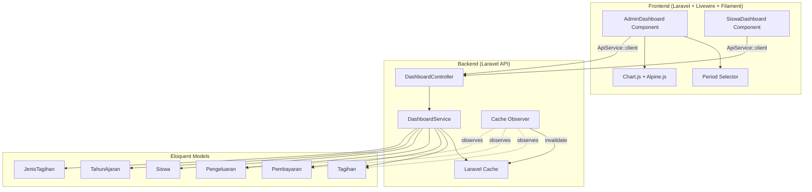
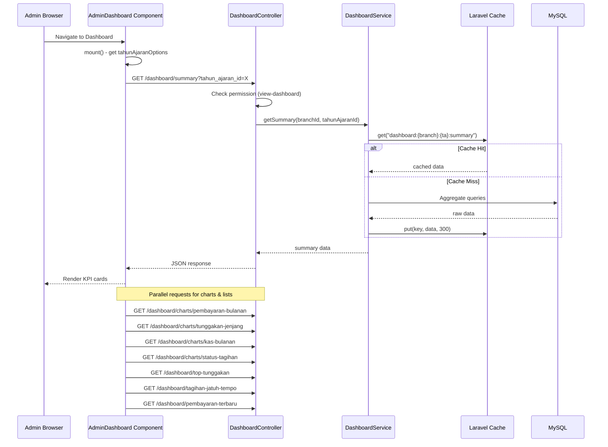
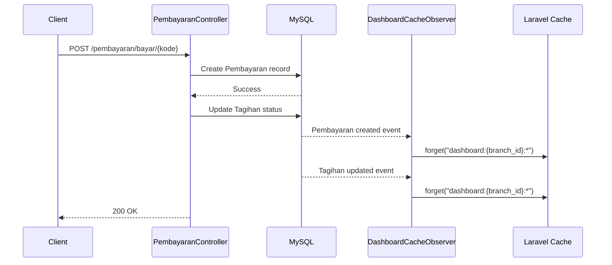
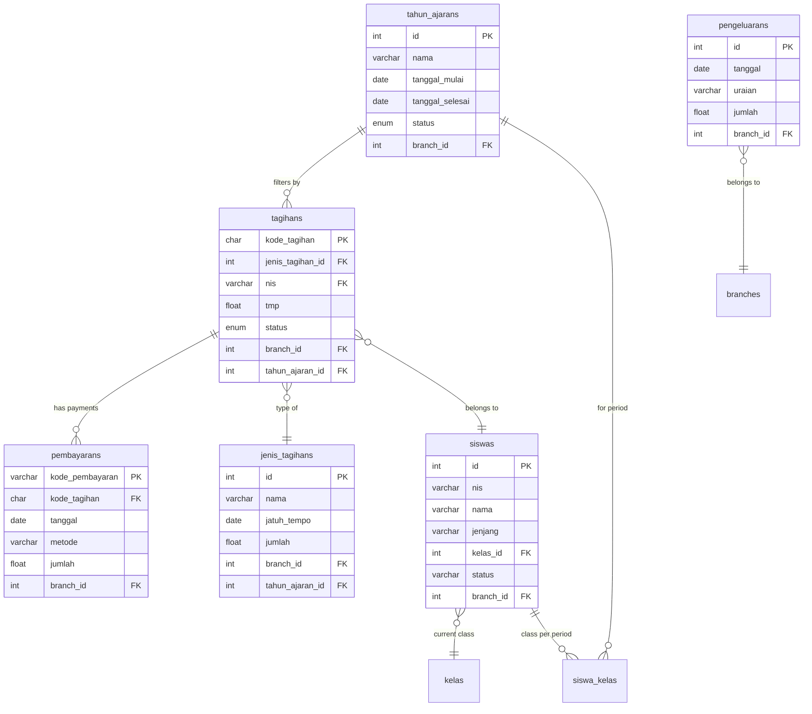

# Design Document: Dashboard

## Overview

Fitur Dashboard menyediakan halaman utama setelah login yang menampilkan ringkasan statistik, grafik, dan daftar cepat terkait tagihan dan pembayaran. Desain ini mencakup:

1. **Backend API Endpoints** — 8 endpoint baru untuk menyediakan data agregat dashboard (summary KPI, 4 chart endpoints, 3 quick list endpoints, dan 1 endpoint siswa/wali)
2. **DashboardService** — Service layer yang mengenkapsulasi logika agregasi data dan caching
3. **Cache Strategy** — Laravel Cache dengan TTL 5 menit dan invalidasi otomatis saat data berubah
4. **Frontend Admin Dashboard** — Livewire component dengan KPI cards, chart (Chart.js via Alpine.js), dan tabel
5. **Frontend Siswa/Wali Dashboard** — Livewire component sederhana dengan ringkasan tagihan pribadi
6. **Permission Integration** — Dua permission baru (`view-dashboard`, `view-own-billing`) terintegrasi dengan spatie/laravel-permission

### Key Design Decisions

1. **Dedicated DashboardController** — Semua endpoint dashboard dikelompokkan dalam satu controller untuk kohesi. Tidak menggunakan resource controller karena endpoint bersifat read-only dengan format response yang berbeda-beda.

2. **Service Layer Pattern** — `DashboardService` memisahkan logika agregasi dari controller. Ini memudahkan testing dan reuse logic antara admin dan siswa dashboard.

3. **Chart.js via Alpine.js** — Menggunakan Chart.js yang di-load via CDN dan diinisialisasi melalui Alpine.js directive. Tidak menambahkan package npm baru karena chart hanya digunakan di dashboard. Alpine.js sudah tersedia sebagai dependency Filament/Livewire.

4. **Cache per branch + tahun_ajaran** — Cache key menggunakan format `dashboard:{branch_id}:{tahun_ajaran_id}:{endpoint}` untuk isolasi data antar branch dan periode. TTL 5 menit memberikan keseimbangan antara freshness dan performance.

5. **Observer-based Cache Invalidation** — Menggunakan Eloquent Model Observer pada Pembayaran, Tagihan, dan Pengeluaran untuk invalidasi cache otomatis. Lebih reliable dibanding event listener manual.

6. **Single Livewire Component per Dashboard Type** — Satu component `AdminDashboard` dan satu `SiswaDashboard`. Menggunakan wire:poll atau manual refresh button, bukan real-time websocket, karena data dashboard tidak memerlukan update real-time.

## Architecture



### Request Flow — Admin Dashboard Load



### Cache Invalidation Flow



## Components and Interfaces

### Backend Components

#### 1. `DashboardController` — New Controller

**File:** `app/Http/Controllers/DashboardController.php`

**Routes:**
| Method | URI | Action | Middleware |
|--------|-----|--------|-----------|
| GET | /api/dashboard/summary | summary | auth:sanctum, permission:view-dashboard |
| GET | /api/dashboard/charts/pembayaran-bulanan | chartPembayaranBulanan | auth:sanctum, permission:view-dashboard |
| GET | /api/dashboard/charts/tunggakan-jenjang | chartTunggakanJenjang | auth:sanctum, permission:view-dashboard |
| GET | /api/dashboard/charts/kas-bulanan | chartKasBulanan | auth:sanctum, permission:view-dashboard |
| GET | /api/dashboard/charts/status-tagihan | chartStatusTagihan | auth:sanctum, permission:view-dashboard |
| GET | /api/dashboard/top-tunggakan | topTunggakan | auth:sanctum, permission:view-dashboard |
| GET | /api/dashboard/tagihan-jatuh-tempo | tagihanJatuhTempo | auth:sanctum, permission:view-dashboard |
| GET | /api/dashboard/pembayaran-terbaru | pembayaranTerbaru | auth:sanctum, permission:view-dashboard |
| GET | /api/dashboard/siswa | siswaDashboard | auth:sanctum, permission:view-own-billing |

**Common Parameters:**
- `tahun_ajaran_id` (optional, integer) — Filter by specific TahunAjaran. Defaults to Periode_Aktif.

**Siswa Endpoint Additional Parameters:**
- `siswa_id` (optional, integer) — For wali users to select specific child.

#### 2. `DashboardService` — New Service

**File:** `app/Services/DashboardService.php`

```php
class DashboardService
{
    public function getSummary(int $branchId, ?int $tahunAjaranId): array
    public function getChartPembayaranBulanan(int $branchId, ?int $tahunAjaranId): array
    public function getChartTunggakanJenjang(int $branchId, ?int $tahunAjaranId): array
    public function getChartKasBulanan(int $branchId, ?int $tahunAjaranId): array
    public function getChartStatusTagihan(int $branchId, ?int $tahunAjaranId): array
    public function getTopTunggakan(int $branchId, ?int $tahunAjaranId): array
    public function getTagihanJatuhTempo(int $branchId, ?int $tahunAjaranId): array
    public function getPembayaranTerbaru(int $branchId, ?int $tahunAjaranId): array
    public function getSiswaDashboard(int $siswaId, int $branchId): array
    
    // Helper methods
    private function resolveTahunAjaranId(?int $tahunAjaranId, int $branchId): ?int
    private function getCacheKey(string $endpoint, int $branchId, ?int $tahunAjaranId): string
    public static function invalidateCache(int $branchId): void
    public static function invalidateKasCache(int $branchId): void
}
```

**Key Implementation Details:**

`getSummary()`:
```php
// Cache key: "dashboard:{branchId}:{tahunAjaranId}:summary"
// Query: 
$totalTagihan = Tagihan::where('branch_id', $branchId)
    ->where('tahun_ajaran_id', $tahunAjaranId)
    ->join('jenis_tagihans', 'tagihans.jenis_tagihan_id', '=', 'jenis_tagihans.id')
    ->sum('jenis_tagihans.jumlah');

$totalTerbayar = Pembayaran::whereHas('tagihan', fn($q) => 
    $q->where('branch_id', $branchId)->where('tahun_ajaran_id', $tahunAjaranId)
)->sum('jumlah');

$totalTunggakan = $totalTagihan - $totalTerbayar;

$jumlahSiswaAktif = Siswa::where('branch_id', $branchId)
    ->where('status', 'Aktif')->count();

$jumlahSiswaMenunggak = Tagihan::where('branch_id', $branchId)
    ->where('tahun_ajaran_id', $tahunAjaranId)
    ->where('status', '!=', 'Lunas')
    ->distinct('nis')->count('nis');

$persentasePelunasan = $totalTagihan > 0 
    ? round(($totalTerbayar / $totalTagihan) * 100, 2) 
    : 0;
```

`getChartPembayaranBulanan()`:
```php
// Returns 12 objects with bulan (1-12), nama_bulan, total
// Groups Pembayaran by MONTH(tanggal) where tagihan.tahun_ajaran_id matches
$namaBulan = ['Januari','Februari','Maret','April','Mei','Juni',
              'Juli','Agustus','September','Oktober','November','Desember'];
```

`getChartTunggakanJenjang()`:
```php
// Groups by siswa.jenjang (TK, MI, KB)
// For each jenjang: sum tagihan nominal, sum pembayaran, calculate tunggakan
```

`getChartKasBulanan()`:
```php
// Returns 12 objects with bulan, nama_bulan, pemasukan, pengeluaran
// Pemasukan = Pembayaran grouped by month (via tagihan.tahun_ajaran_id)
// Pengeluaran = Pengeluaran grouped by month (filtered by TahunAjaran date range)
```

`getChartStatusTagihan()`:
```php
// Groups Tagihan by status (Lunas, Belum Lunas, Belum Dibayar)
// Returns jumlah (count) and persentase for each status
```

`getTopTunggakan()`:
```php
// Subquery: per siswa, calculate total_tagihan - total_terbayar
// Order by tunggakan DESC, limit 10, exclude tunggakan <= 0
// Resolve kelas from SiswaKelas for the selected period
```

`getTagihanJatuhTempo()`:
```php
// Join with JenisTagihan where jatuh_tempo BETWEEN today AND today+7
// Filter status != 'Lunas'
// Order by jatuh_tempo ASC
```

`getPembayaranTerbaru()`:
```php
// Order by tanggal DESC, created_at DESC
// Limit 5
// Join with Tagihan and Siswa for nama_siswa, JenisTagihan for nama
```

`getSiswaDashboard()`:
```php
// No caching (personal data, low volume)
// Aggregate tagihan and pembayaran for specific siswa
// Filter tagihan_list by Periode_Aktif
// Get 5 most recent pembayaran
```

#### 3. `DashboardCacheObserver` — New Observer

**File:** `app/Observers/DashboardCacheObserver.php`

```php
class DashboardCacheObserver
{
    public function created(Model $model): void
    {
        $this->invalidate($model);
    }

    public function updated(Model $model): void
    {
        $this->invalidate($model);
    }

    public function deleted(Model $model): void
    {
        $this->invalidate($model);
    }

    private function invalidate(Model $model): void
    {
        $branchId = $model->branch_id;
        if ($model instanceof Pengeluaran) {
            DashboardService::invalidateKasCache($branchId);
        } else {
            DashboardService::invalidateCache($branchId);
        }
    }
}
```

Registered in `AppServiceProvider::boot()`:
```php
Pembayaran::observe(DashboardCacheObserver::class);
Tagihan::observe(DashboardCacheObserver::class);
Pengeluaran::observe(DashboardCacheObserver::class);
```

#### 4. Permission Seeder Update

Add to existing `RoleAndPermissionSeeder`:
```php
Permission::firstOrCreate(['name' => 'view-dashboard', 'guard_name' => 'web']);
Permission::firstOrCreate(['name' => 'view-own-billing', 'guard_name' => 'web']);
```

Assign `view-dashboard` to Admin and Operator roles.
Assign `view-own-billing` to Siswa and Wali roles.

### Frontend Components

#### 5. `AdminDashboard` — Livewire Component

**File:** `frontend-v2/app/Livewire/AdminDashboard.php`

```php
class AdminDashboard extends Component
{
    use HasPeriodFilter; // Reuse from periode-tahun-ajaran spec

    public array $summary = [];
    public array $chartPembayaranBulanan = [];
    public array $chartTunggakanJenjang = [];
    public array $chartKasBulanan = [];
    public array $chartStatusTagihan = [];
    public array $topTunggakan = [];
    public array $tagihanJatuhTempo = [];
    public array $pembayaranTerbaru = [];
    public bool $loading = true;
    public ?string $error = null;

    public function mount(): void
    {
        $this->loadAllData();
    }

    public function loadAllData(): void
    {
        $this->loading = true;
        $params = $this->selectedTahunAjaranId 
            ? ['tahun_ajaran_id' => $this->selectedTahunAjaranId] 
            : [];
        
        try {
            $this->summary = ApiService::client()
                ->get('/dashboard/summary', $params)->json('data') ?? [];
            $this->chartPembayaranBulanan = ApiService::client()
                ->get('/dashboard/charts/pembayaran-bulanan', $params)->json('data') ?? [];
            // ... similar for other endpoints
        } catch (Exception $e) {
            $this->error = 'Gagal memuat data dashboard.';
        }
        
        $this->loading = false;
    }

    public function updatedSelectedTahunAjaranId($value): void
    {
        session(['selected_tahun_ajaran_id' => $value]);
        $this->loadAllData();
    }

    public function refresh(): void
    {
        $this->loadAllData();
    }

    public function render(): View
    {
        return view('livewire.admin-dashboard');
    }
}
```

**Blade Template:** `frontend-v2/resources/views/livewire/admin-dashboard.blade.php`

Layout structure:
- Period selector dropdown (top-right)
- Refresh button
- 6 KPI cards in responsive grid (3-col desktop, 2-col tablet, 1-col mobile)
- Charts section: 2x2 grid on desktop
  - Bar chart: Pembayaran per Bulan
  - Donut chart: Tunggakan per Jenjang
  - Line chart: Pemasukan vs Pengeluaran
  - Pie chart: Status Tagihan
- Tables section:
  - Top Tunggakan table
  - Tagihan Jatuh Tempo table
  - Pembayaran Terbaru list

**Chart Integration (Alpine.js + Chart.js):**
```html
<div x-data="{ chart: null }" 
     x-init="chart = new Chart($refs.canvas, {
         type: 'bar',
         data: { labels: $wire.chartPembayaranBulanan.map(d => d.nama_bulan), ... }
     })"
     x-effect="if(chart) { chart.data = {...}; chart.update(); }">
    <canvas x-ref="canvas"></canvas>
</div>
```

#### 6. `SiswaDashboard` — Livewire Component

**File:** `frontend-v2/app/Livewire/SiswaDashboard.php`

```php
class SiswaDashboard extends Component
{
    public array $dashboardData = [];
    public ?int $selectedSiswaId = null;
    public array $childOptions = []; // For wali with multiple children
    public bool $loading = true;

    public function mount(): void
    {
        $this->loadData();
    }

    public function loadData(): void
    {
        $params = $this->selectedSiswaId 
            ? ['siswa_id' => $this->selectedSiswaId] 
            : [];
        
        $response = ApiService::client()->get('/dashboard/siswa', $params);
        $this->dashboardData = $response->json('data') ?? [];
        $this->loading = false;
    }

    public function updatedSelectedSiswaId(): void
    {
        $this->loadData();
    }

    public function render(): View
    {
        return view('livewire.siswa-dashboard');
    }
}
```

**Blade Template:** `frontend-v2/resources/views/livewire/siswa-dashboard.blade.php`

Layout structure:
- Child selector (only visible for wali with multiple children)
- 3 KPI cards: Total Tagihan, Total Terbayar, Total Tunggakan
- Tagihan list with status badges (green/yellow/red)
- Pembayaran terbaru list (5 records)

#### 7. Route Registration

**Backend** (`routes/api.php`):
```php
Route::prefix('/dashboard')->group(function () {
    Route::get('/summary', [DashboardController::class, 'summary'])
        ->middleware('permission:view-dashboard');
    Route::get('/charts/pembayaran-bulanan', [DashboardController::class, 'chartPembayaranBulanan'])
        ->middleware('permission:view-dashboard');
    Route::get('/charts/tunggakan-jenjang', [DashboardController::class, 'chartTunggakanJenjang'])
        ->middleware('permission:view-dashboard');
    Route::get('/charts/kas-bulanan', [DashboardController::class, 'chartKasBulanan'])
        ->middleware('permission:view-dashboard');
    Route::get('/charts/status-tagihan', [DashboardController::class, 'chartStatusTagihan'])
        ->middleware('permission:view-dashboard');
    Route::get('/top-tunggakan', [DashboardController::class, 'topTunggakan'])
        ->middleware('permission:view-dashboard');
    Route::get('/tagihan-jatuh-tempo', [DashboardController::class, 'tagihanJatuhTempo'])
        ->middleware('permission:view-dashboard');
    Route::get('/pembayaran-terbaru', [DashboardController::class, 'pembayaranTerbaru'])
        ->middleware('permission:view-dashboard');
    Route::get('/siswa', [DashboardController::class, 'siswaDashboard'])
        ->middleware('permission:view-own-billing');
});
```

**Frontend** (`routes/web.php`):
```php
Route::get('/dashboard', AdminDashboard::class)
    ->name('dashboard')
    ->middleware(['auth', 'permission:view-dashboard']);

Route::get('/my-dashboard', SiswaDashboard::class)
    ->name('siswa-dashboard')
    ->middleware(['auth', 'permission:view-own-billing']);
```

## Data Models

### Existing Tables Used (No Modifications)

Fitur dashboard bersifat read-only dan menggunakan tabel-tabel yang sudah ada:

| Table | Usage |
|-------|-------|
| `tagihans` | Source for tagihan aggregation (status, jumlah via jenis_tagihan) |
| `pembayarans` | Source for pembayaran aggregation (jumlah, tanggal, metode) |
| `pengeluarans` | Source for pengeluaran aggregation (jumlah, tanggal) |
| `siswas` | Source for siswa count, jenjang grouping |
| `jenis_tagihans` | Source for jumlah (nominal tagihan), jatuh_tempo |
| `tahun_ajarans` | Period filtering and Periode_Aktif resolution |
| `siswa_kelas` | Resolve kelas for specific period |
| `kelas` | Kelas name resolution |

### Entity Relationships for Dashboard Queries



### Cache Key Structure

| Cache Key Pattern | TTL | Invalidated By |
|-------------------|-----|----------------|
| `dashboard:{branch_id}:{tahun_ajaran_id}:summary` | 5 min | Pembayaran created/deleted, Tagihan updated |
| `dashboard:{branch_id}:{tahun_ajaran_id}:pembayaran-bulanan` | 5 min | Pembayaran created/deleted |
| `dashboard:{branch_id}:{tahun_ajaran_id}:tunggakan-jenjang` | 5 min | Pembayaran created/deleted, Tagihan updated |
| `dashboard:{branch_id}:{tahun_ajaran_id}:kas-bulanan` | 5 min | Pembayaran created/deleted, Pengeluaran created/updated/deleted |
| `dashboard:{branch_id}:{tahun_ajaran_id}:status-tagihan` | 5 min | Tagihan created/updated/deleted |
| `dashboard:{branch_id}:{tahun_ajaran_id}:top-tunggakan` | 5 min | Pembayaran created/deleted, Tagihan updated |
| `dashboard:{branch_id}:{tahun_ajaran_id}:tagihan-jatuh-tempo` | 5 min | Tagihan created/updated/deleted |
| `dashboard:{branch_id}:{tahun_ajaran_id}:pembayaran-terbaru` | 5 min | Pembayaran created/deleted |

### API Response Formats

**GET /api/dashboard/summary:**
```json
{
    "data": {
        "total_tagihan": 150000000,
        "total_terbayar": 95000000,
        "total_tunggakan": 55000000,
        "jumlah_siswa_aktif": 250,
        "jumlah_siswa_menunggak": 45,
        "persentase_pelunasan": 63.33
    }
}
```

**GET /api/dashboard/charts/pembayaran-bulanan:**
```json
{
    "data": [
        {"bulan": 1, "nama_bulan": "Januari", "total": 12000000},
        {"bulan": 2, "nama_bulan": "Februari", "total": 8500000},
        ...
    ]
}
```

**GET /api/dashboard/charts/tunggakan-jenjang:**
```json
{
    "data": [
        {"jenjang": "TK", "total_tagihan": 50000000, "total_terbayar": 35000000, "total_tunggakan": 15000000},
        {"jenjang": "MI", "total_tagihan": 80000000, "total_terbayar": 50000000, "total_tunggakan": 30000000},
        {"jenjang": "KB", "total_tagihan": 20000000, "total_terbayar": 10000000, "total_tunggakan": 10000000}
    ]
}
```

**GET /api/dashboard/charts/kas-bulanan:**
```json
{
    "data": [
        {"bulan": 1, "nama_bulan": "Januari", "pemasukan": 12000000, "pengeluaran": 5000000},
        ...
    ]
}
```

**GET /api/dashboard/charts/status-tagihan:**
```json
{
    "data": [
        {"status": "Lunas", "jumlah": 150, "persentase": 60.00},
        {"status": "Belum Lunas", "jumlah": 75, "persentase": 30.00},
        {"status": "Belum Dibayar", "jumlah": 25, "persentase": 10.00}
    ]
}
```

**GET /api/dashboard/top-tunggakan:**
```json
{
    "data": [
        {"nis": "12345", "nama": "Ahmad", "kelas": "6A", "jenjang": "MI", "total_tagihan": 5000000, "total_terbayar": 1000000, "total_tunggakan": 4000000},
        ...
    ]
}
```

**GET /api/dashboard/tagihan-jatuh-tempo:**
```json
{
    "data": [
        {"kode_tagihan": "TGH-001", "nama_siswa": "Ahmad", "nama_jenis_tagihan": "SPP Januari", "jatuh_tempo": "2025-01-15", "jumlah": 500000, "status": "Belum Lunas"},
        ...
    ]
}
```

**GET /api/dashboard/pembayaran-terbaru:**
```json
{
    "data": [
        {"kode_pembayaran": "PBY-001", "nama_siswa": "Ahmad", "nama_jenis_tagihan": "SPP Januari", "tanggal": "2025-01-10", "metode": "Transfer", "jumlah": 500000},
        ...
    ]
}
```

**GET /api/dashboard/siswa:**
```json
{
    "data": {
        "total_tagihan": 3000000,
        "total_terbayar": 2000000,
        "total_tunggakan": 1000000,
        "tagihan_list": [
            {"nama_jenis_tagihan": "SPP Januari", "jumlah": 500000, "jatuh_tempo": "2025-01-15", "status": "Lunas"},
            ...
        ],
        "pembayaran_terbaru": [
            {"tanggal": "2025-01-10", "nama_jenis_tagihan": "SPP Januari", "metode": "Transfer", "jumlah": 500000},
            ...
        ]
    }
}
```


## Correctness Properties

*A property is a characteristic or behavior that should hold true across all valid executions of a system — essentially, a formal statement about what the system should do. Properties serve as the bridge between human-readable specifications and machine-verifiable correctness guarantees.*

### Property 1: Summary Aggregation Correctness

*For any* set of Tagihan and Pembayaran records within a branch and period, the summary endpoint SHALL return: total_tagihan equal to the sum of jenis_tagihan.jumlah for all matching tagihan, total_terbayar equal to the sum of pembayaran.jumlah for all matching pembayaran, total_tunggakan equal to total_tagihan minus total_terbayar, and persentase_pelunasan equal to (total_terbayar / total_tagihan) * 100 rounded to 2 decimals (or 0 if total_tagihan is 0).

**Validates: Requirements 1.1, 1.6**

### Property 2: Period Filtering Isolation

*For any* dashboard endpoint called with a specific `tahun_ajaran_id`, all data included in the aggregation SHALL belong exclusively to records associated with that TahunAjaran. No records from other periods SHALL influence the result.

**Validates: Requirements 1.2, 2.2, 3.2, 4.2, 5.2, 6.3, 7.2, 8.2**

### Property 3: Branch Data Isolation

*For any* authenticated user calling any dashboard endpoint, all returned data SHALL be computed exclusively from records where `branch_id` equals the authenticated user's `branch_id`. No data from other branches SHALL ever appear in or influence the response.

**Validates: Requirements 1.5, 2.5, 3.4, 4.5, 5.4, 6.6, 7.6, 8.5, 14.5**

### Property 4: Monthly Chart Structural Invariant

*For any* call to the pembayaran-bulanan or kas-bulanan endpoint, the response SHALL always contain exactly 12 objects with bulan values 1 through 12 (one per month), regardless of whether data exists for each month. Months without data SHALL have their numeric values set to zero.

**Validates: Requirements 2.1, 2.4, 4.1, 4.4**

### Property 5: Tunggakan Per Jenjang Completeness

*For any* data distribution within a branch and period, the tunggakan-jenjang endpoint SHALL return objects for all three jenjang (TK, MI, KB). For each jenjang, total_tunggakan SHALL equal total_tagihan minus total_terbayar. Jenjang with no tagihan SHALL have all values set to zero.

**Validates: Requirements 3.1, 3.5**

### Property 6: Status Tagihan Percentage Correctness

*For any* set of Tagihan records within a branch and period, the status-tagihan endpoint SHALL return exactly three objects (Lunas, Belum Lunas, Belum Dibayar) where each jumlah equals the count of tagihan with that status, and each persentase equals (jumlah / total_count) * 100 rounded to 2 decimals. If no tagihan exist, all values SHALL be zero.

**Validates: Requirements 5.1, 5.5**

### Property 7: Top Tunggakan Ordering and Filtering

*For any* set of siswa with tagihan within a branch and period, the top-tunggakan endpoint SHALL return at most 10 results, all with total_tunggakan strictly greater than zero, ordered by total_tunggakan descending. No siswa with tunggakan less than or equal to zero SHALL appear in the results.

**Validates: Requirements 6.1, 6.2, 6.5**

### Property 8: Tagihan Jatuh Tempo Date and Status Filter

*For any* set of tagihan within a branch and period, the tagihan-jatuh-tempo endpoint SHALL return only tagihan where: (a) the associated jenis_tagihan.jatuh_tempo falls within the next 7 calendar days from the current server date, AND (b) the tagihan status is not "Lunas". Results SHALL be ordered by jatuh_tempo ascending.

**Validates: Requirements 7.1, 7.5**

### Property 9: Pembayaran Terbaru Recency and Limit

*For any* set of pembayaran records within a branch and period, the pembayaran-terbaru endpoint SHALL return at most 5 records ordered by tanggal descending, then by created_at descending. The first record in the response SHALL always be the most recent pembayaran.

**Validates: Requirements 8.1**

### Property 10: Siswa Personal Data Isolation

*For any* authenticated siswa/wali user, the siswa dashboard endpoint SHALL return data computed exclusively from tagihan and pembayaran records belonging to the specified siswa. No data from other siswa SHALL appear in or influence the response.

**Validates: Requirements 11.5, 12.2**

### Property 11: Wali-Child Access Control

*For any* wali user calling the siswa dashboard endpoint with a `siswa_id` parameter, the endpoint SHALL return data only if the specified siswa is associated with the authenticated wali. If the siswa does not belong to the wali, the endpoint SHALL return HTTP 403.

**Validates: Requirements 12.3, 12.5**

### Property 12: Permission Enforcement

*For any* authenticated user without the "view-dashboard" permission, all admin dashboard endpoints SHALL return HTTP 403. For any authenticated user without the "view-own-billing" permission, the siswa dashboard endpoint SHALL return HTTP 403.

**Validates: Requirements 14.1, 14.2, 14.4**

### Property 13: Pengeluaran Date Range Filtering

*For any* call to the kas-bulanan endpoint with a specific tahun_ajaran_id, pengeluaran records SHALL be included only if their `tanggal` falls within the `tanggal_mulai` and `tanggal_selesai` range of the specified TahunAjaran. Pengeluaran records outside this date range SHALL not influence the result.

**Validates: Requirements 4.2**

## Error Handling

### Backend Error Responses

| Scenario | HTTP Status | Response Body |
|----------|-------------|---------------|
| Unauthenticated request | 401 | `{"message": "Unauthenticated."}` |
| Missing permission (view-dashboard) | 403 | `{"message": "Anda tidak memiliki izin untuk mengakses dashboard."}` |
| Missing permission (view-own-billing) | 403 | `{"message": "Anda tidak memiliki izin untuk mengakses data tagihan."}` |
| Wali accessing unrelated siswa | 403 | `{"message": "Anda tidak memiliki akses ke data siswa ini."}` |
| Invalid tahun_ajaran_id (not found or wrong branch) | 422 | `{"errors": {"tahun_ajaran_id": ["Tahun ajaran tidak ditemukan."]}}` |
| Invalid siswa_id format | 422 | `{"errors": {"siswa_id": ["Siswa ID harus berupa angka."]}}` |
| Cache driver failure | — | Fallback to direct DB query, no error returned to client |
| Database query timeout | 500 | `{"message": "Terjadi kesalahan pada server."}` |

### Frontend Error Handling Strategy

1. **API Error (4xx/5xx):**
   - Display error message within the affected component area
   - Use `Filament\Notifications\Notification::make()->danger()` for toast notifications
   - Keep other components functional (partial failure tolerance)

2. **Network Timeout:**
   - Display "Gagal memuat data. Silakan coba lagi." message
   - Show retry button within affected component

3. **Loading States:**
   - Display skeleton/placeholder UI while data is loading
   - Use `wire:loading` directive for Livewire loading indicators
   - Disable period selector during data fetch to prevent race conditions

4. **Empty States:**
   - No Periode_Aktif: Show informational message with link to TahunAjaran management
   - No data for period: Show "Belum ada data untuk periode ini" message
   - No TahunAjaran records: Hide period selector, show setup guidance

5. **Permission-based Routing:**
   - If user lacks `view-dashboard`: redirect to siswa dashboard or default page
   - If user lacks `view-own-billing`: redirect to appropriate fallback page
   - Frontend checks permissions from session data before rendering navigation items

## Testing Strategy

### Property-Based Tests (Pest + Laravel Factories)

**Library:** Pest PHP (already installed in frontend-v2) with Laravel model factories
**Configuration:** Each property test runs minimum 100 iterations with randomized data using `repeat()` or loop-based approach

Since the project uses Pest PHP and Laravel factories, property tests will use loops with factory-generated data to verify universal properties across many inputs.

**Property tests to implement:**

| Property | Test File | Key Generators |
|----------|-----------|----------------|
| 1 | `tests/Feature/Dashboard/SummaryAggregationTest.php` | Random Tagihan/Pembayaran amounts, random counts |
| 2 | `tests/Feature/Dashboard/PeriodFilteringTest.php` | Multiple TahunAjaran with records in each |
| 3 | `tests/Feature/Dashboard/BranchIsolationTest.php` | Multiple branches with overlapping data |
| 4 | `tests/Feature/Dashboard/MonthlyChartStructureTest.php` | Random pembayaran/pengeluaran across months |
| 5 | `tests/Feature/Dashboard/TunggakanJenjangTest.php` | Random siswa across TK/MI/KB with varying amounts |
| 6 | `tests/Feature/Dashboard/StatusTagihanTest.php` | Random tagihan with various statuses |
| 7 | `tests/Feature/Dashboard/TopTunggakanTest.php` | N siswa with random tunggakan amounts |
| 8 | `tests/Feature/Dashboard/TagihanJatuhTempoTest.php` | Tagihan with dates spread across time ranges |
| 9 | `tests/Feature/Dashboard/PembayaranTerbaruTest.php` | Random pembayaran with various dates |
| 10 | `tests/Feature/Dashboard/SiswaDataIsolationTest.php` | Multiple siswa with data, verify isolation |
| 11 | `tests/Feature/Dashboard/WaliAccessControlTest.php` | Wali with children, cross-wali access attempts |
| 12 | `tests/Feature/Dashboard/PermissionEnforcementTest.php` | Users with/without permissions across endpoints |
| 13 | `tests/Feature/Dashboard/PengeluaranDateFilterTest.php` | Pengeluaran inside/outside TahunAjaran range |

**Tag format:** `Feature: dashboard, Property {N}: {title}`

### Unit Tests (Example-Based)

- `DashboardService::resolveTahunAjaranId()` — returns Periode_Aktif when null passed
- `DashboardService::resolveTahunAjaranId()` — returns null when no Periode_Aktif exists
- `DashboardService::getCacheKey()` — correct key format
- `DashboardCacheObserver` — invalidates correct cache keys
- Summary returns all zeros when no data exists
- Persentase_pelunasan returns 0 when total_tagihan is 0
- Wali defaults to first child by NIS ascending
- Indonesian month names are correct (Januari through Desember)

### Integration Tests

- Full dashboard load flow: authenticate → call all endpoints → verify responses
- Cache behavior: first call populates cache, second call uses cache
- Cache invalidation: create pembayaran → verify cache cleared
- Period change: switch tahun_ajaran_id → verify different data returned
- Siswa dashboard: authenticate as siswa → verify personal data only
- Wali with multiple children: switch between children
- Permission denied flow: user without permission → 403 on all admin endpoints
- Concurrent requests: multiple endpoints called simultaneously

### Frontend Tests (Livewire Component Tests)

- `AdminDashboard::mount()` loads all data on initialization
- `AdminDashboard::updatedSelectedTahunAjaranId()` triggers reload
- `AdminDashboard::refresh()` reloads all data
- `SiswaDashboard::mount()` loads personal data
- `SiswaDashboard::updatedSelectedSiswaId()` reloads for different child
- Loading state toggles correctly during API calls
- Error state displays when API fails
- Period selector shows correct options
- Child selector visible only for wali with multiple children

### Performance Tests (Manual)

- Load test with 10,000 tagihan records — verify < 3 second response
- Cache hit performance — verify near-instant response on cached data
- Concurrent user simulation — verify no race conditions on cache invalidation
