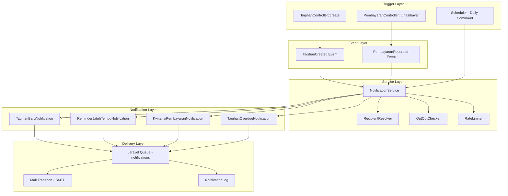
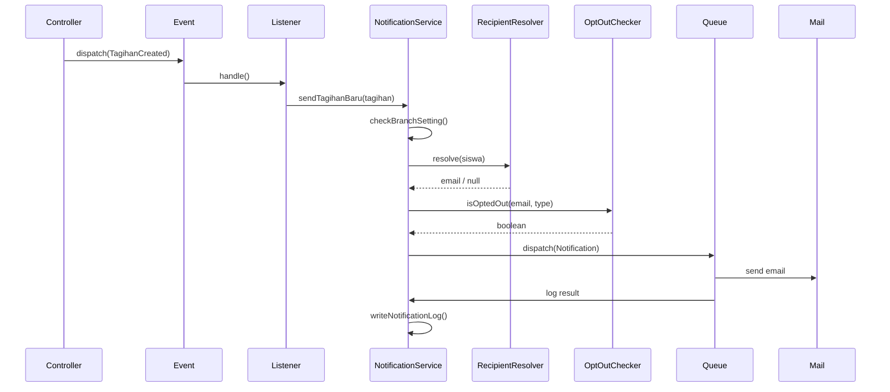
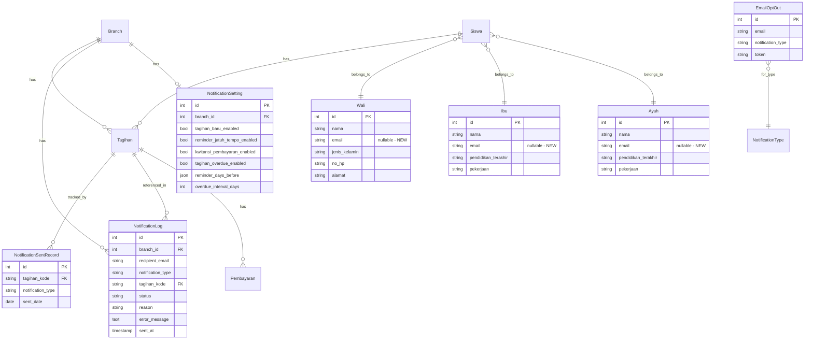

# Design Document: Email Notifications

## Overview

Sistem notifikasi email untuk aplikasi SPP Handayani yang mengirimkan informasi tagihan, reminder, kwitansi, dan overdue kepada orang tua/wali siswa. Sistem dibangun di atas Laravel 12 Notification/Mail framework dengan queue-based async delivery, per-branch configuration, dan opt-out preferences.

### Key Design Decisions

1. **Laravel Notifications over raw Mail**: Menggunakan `Illuminate\Notifications\Notification` karena mendukung multiple channels, queueing built-in, dan database logging.
2. **Database queue driver**: Proyek sudah menggunakan database queue (`config/queue.php`), cocok untuk skala sekolah tanpa perlu Redis/SQS.
3. **Event-driven dispatch**: Menggunakan Laravel Events/Listeners untuk decouple notification logic dari business logic (TagihanController, PembayaranController).
4. **Dedicated service class**: `NotificationService` sebagai single entry point untuk recipient resolution, opt-out checking, dan dispatch orchestration.
5. **Signed URLs untuk unsubscribe**: Menggunakan Laravel signed URLs untuk secure opt-out tanpa authentication.

## Architecture



### Flow Sequence



## Components and Interfaces

### 1. Database Migrations

#### `add_email_to_parent_tables`
Adds nullable `email` column to `ayah`, `ibu`, and `walis` tables.

#### `create_notification_settings_table`
```
notification_settings:
  - id: bigint (PK, auto-increment)
  - branch_id: bigint (FK -> branches.id, unique)
  - tagihan_baru_enabled: boolean (default: false)
  - reminder_jatuh_tempo_enabled: boolean (default: false)
  - kwitansi_pembayaran_enabled: boolean (default: false)
  - tagihan_overdue_enabled: boolean (default: false)
  - reminder_days_before: json (default: [7, 3, 0])
  - overdue_interval_days: integer (default: 7, min: 1)
  - created_at: timestamp
  - updated_at: timestamp
```

#### `create_notification_logs_table`
```
notification_logs:
  - id: bigint (PK, auto-increment)
  - branch_id: bigint (FK -> branches.id)
  - recipient_email: string(255)
  - notification_type: enum(tagihan_baru, reminder_jatuh_tempo, kwitansi_pembayaran, tagihan_overdue)
  - tagihan_kode: string (nullable, FK -> tagihans.kode_tagihan)
  - status: enum(queued, sent, failed, skipped)
  - reason: string(255) nullable (no_email_available, opted_out, invalid_email, disabled)
  - error_message: text nullable
  - sent_at: timestamp nullable
  - created_at: timestamp
  - updated_at: timestamp
```

#### `create_email_opt_outs_table`
```
email_opt_outs:
  - id: bigint (PK, auto-increment)
  - email: string(255)
  - notification_type: enum(tagihan_baru, reminder_jatuh_tempo, kwitansi_pembayaran, tagihan_overdue)
  - token: string(64) unique (for signed URL identification)
  - created_at: timestamp
  - updated_at: timestamp
  - unique constraint: (email, notification_type)
```

#### `create_notification_sent_records_table`
```
notification_sent_records:
  - id: bigint (PK, auto-increment)
  - tagihan_kode: string (FK -> tagihans.kode_tagihan)
  - notification_type: enum(reminder_7d, reminder_3d, reminder_0d, overdue)
  - sent_date: date
  - created_at: timestamp
  - unique constraint: (tagihan_kode, notification_type, sent_date)
```

### 2. Models

#### `NotificationSetting` (App\Models\NotificationSetting)
```php
class NotificationSetting extends Model {
    protected $fillable = [
        'branch_id', 'tagihan_baru_enabled', 'reminder_jatuh_tempo_enabled',
        'kwitansi_pembayaran_enabled', 'tagihan_overdue_enabled',
        'reminder_days_before', 'overdue_interval_days'
    ];
    protected $casts = [
        'tagihan_baru_enabled' => 'boolean',
        'reminder_jatuh_tempo_enabled' => 'boolean',
        'kwitansi_pembayaran_enabled' => 'boolean',
        'tagihan_overdue_enabled' => 'boolean',
        'reminder_days_before' => 'array',
        'overdue_interval_days' => 'integer',
    ];
    public function branch(): BelongsTo;
}
```

#### `NotificationLog` (App\Models\NotificationLog)
```php
class NotificationLog extends Model {
    protected $fillable = [
        'branch_id', 'recipient_email', 'notification_type',
        'tagihan_kode', 'status', 'reason', 'error_message', 'sent_at'
    ];
    public function branch(): BelongsTo;
    public function tagihan(): BelongsTo;
}
```

#### `EmailOptOut` (App\Models\EmailOptOut)
```php
class EmailOptOut extends Model {
    protected $fillable = ['email', 'notification_type', 'token'];
    public static function isOptedOut(string $email, string $type): bool;
}
```

#### `NotificationSentRecord` (App\Models\NotificationSentRecord)
```php
class NotificationSentRecord extends Model {
    protected $fillable = ['tagihan_kode', 'notification_type', 'sent_date'];
    public static function alreadySent(string $kodeTagihan, string $type, string $date): bool;
}
```

### 3. Services

#### `RecipientResolver` (App\Services\Notifications\RecipientResolver)
```php
class RecipientResolver {
    /**
     * Resolve email recipient for a Siswa.
     * Priority: Wali -> Ibu -> Ayah (first non-null email)
     * Returns null if no email found.
     */
    public function resolve(Siswa $siswa): ?string;
}
```

#### `NotificationService` (App\Services\Notifications\NotificationService)
```php
class NotificationService {
    public function __construct(
        RecipientResolver $recipientResolver,
    );

    public function sendTagihanBaru(Collection $tagihans, Siswa $siswa): void;
    public function sendKwitansiPembayaran(Pembayaran $pembayaran): void;
    public function processReminders(): void;
    public function processOverdue(): void;
    public function retryFailed(array $logIds): int;

    // Internal helpers
    private function isEnabled(int $branchId, string $type): bool;
    private function isOptedOut(string $email, string $type): bool;
    private function validateEmail(string $email): bool;
    private function logNotification(array $data): NotificationLog;
    private function checkRateLimit(int $branchId): bool;
}
```

### 4. Events & Listeners

#### Events
```php
// App\Events\TagihanCreated
class TagihanCreated {
    public Collection $tagihans; // grouped by siswa
    public Siswa $siswa;
    public int $branchId;
}

// App\Events\PembayaranRecorded
class PembayaranRecorded {
    public Pembayaran $pembayaran;
    public int $branchId;
}
```

#### Listeners
```php
// App\Listeners\SendTagihanBaruNotification
class SendTagihanBaruNotification {
    public function handle(TagihanCreated $event): void;
    public function failed(TagihanCreated $event, \Throwable $e): void;
}

// App\Listeners\SendKwitansiNotification
class SendKwitansiNotification {
    public function handle(PembayaranRecorded $event): void;
    public function failed(PembayaranRecorded $event, \Throwable $e): void;
}
```

### 5. Notifications (Mailable)

#### `TagihanBaruNotification`
```php
class TagihanBaruNotification extends Notification implements ShouldQueue {
    use Queueable;
    public $queue = 'notifications';
    public $tries = 3;
    public $backoff = [60, 300, 900]; // 1min, 5min, 15min

    public function __construct(
        public Collection $tagihans,
        public Siswa $siswa,
        public string $unsubscribeUrl,
    );

    public function toMail(object $notifiable): MailMessage;
}
```

#### `ReminderJatuhTempoNotification`
```php
class ReminderJatuhTempoNotification extends Notification implements ShouldQueue {
    use Queueable;
    public $queue = 'notifications';
    public $tries = 3;
    public $backoff = [60, 300, 900];

    public function __construct(
        public Tagihan $tagihan,
        public Siswa $siswa,
        public int $daysRemaining,
        public string $unsubscribeUrl,
    );

    public function toMail(object $notifiable): MailMessage;
}
```

#### `KwitansiPembayaranNotification`
```php
class KwitansiPembayaranNotification extends Notification implements ShouldQueue {
    use Queueable;
    public $queue = 'notifications';
    public $tries = 3;
    public $backoff = [60, 300, 900];

    public function __construct(
        public Pembayaran $pembayaran,
        public Siswa $siswa,
        public string $unsubscribeUrl,
    );

    public function toMail(object $notifiable): MailMessage;
}
```

#### `TagihanOverdueNotification`
```php
class TagihanOverdueNotification extends Notification implements ShouldQueue {
    use Queueable;
    public $queue = 'notifications';
    public $tries = 3;
    public $backoff = [60, 300, 900];

    public function __construct(
        public Tagihan $tagihan,
        public Siswa $siswa,
        public int $daysOverdue,
        public string $unsubscribeUrl,
    );

    public function toMail(object $notifiable): MailMessage;
}
```

### 6. Console Command

#### `SendNotificationReminders` (App\Console\Commands\SendNotificationReminders)
```php
class SendNotificationReminders extends Command {
    protected $signature = 'notifications:send-reminders';
    protected $description = 'Process reminder and overdue notifications for all branches';

    public function handle(NotificationService $service): int;
}
```

Registered in `routes/console.php`:
```php
Schedule::command('notifications:send-reminders')->dailyAt('08:00');
```

### 7. Controllers

#### `NotificationSettingController`
```php
class NotificationSettingController extends Controller {
    public function show(): JsonResponse;          // GET /api/notification-settings
    public function update(Request $request): JsonResponse; // PUT /api/notification-settings
}
```

#### `NotificationLogController`
```php
class NotificationLogController extends Controller {
    public function index(Request $request): JsonResponse;  // GET /api/notification-logs
    public function retry(Request $request): JsonResponse;  // POST /api/notification-logs/retry
}
```

#### `EmailOptOutController`
```php
class EmailOptOutController extends Controller {
    public function show(Request $request): View;           // GET /unsubscribe/{token} (signed URL, no auth)
    public function update(Request $request): JsonResponse; // POST /unsubscribe/{token}
}
```

### 8. Rate Limiter

Implemented using Laravel's `RateLimiter` facade:
```php
// In AppServiceProvider::boot()
RateLimiter::for('email-notifications', function ($job) {
    return Limit::perMinute(50)->by($job->branchId);
});
```

### 9. Notifiable Trait (Ad-hoc)

Since recipients are not User models, we use an anonymous notifiable:
```php
use Illuminate\Notifications\AnonymousNotifiable;

Notification::route('mail', $recipientEmail)
    ->notify(new TagihanBaruNotification(...));
```

## Data Models

### Entity Relationship Diagram



### Rupiah Formatting

All monetary values use helper:
```php
function formatRupiah(float $amount): string {
    return 'Rp ' . number_format($amount, 0, ',', '.');
}
```

## Correctness Properties

*A property is a characteristic or behavior that should hold true across all valid executions of a system — essentially, a formal statement about what the system should do. Properties serve as the bridge between human-readable specifications and machine-verifiable correctness guarantees.*

### Property 1: Email Validation Consistency

*For any* string input, the email validation function SHALL accept it if and only if it conforms to RFC 5322 format, and reject all other strings (including empty strings, whitespace-only strings, and malformed addresses).

**Validates: Requirements 1.5, 9.3**

### Property 2: Conditional Dispatch Based on Branch Settings

*For any* notification trigger event (tagihan creation or pembayaran recording) and any branch configuration, the system SHALL dispatch an email notification if and only if the corresponding notification type is enabled for that branch.

**Validates: Requirements 2.1, 4.1, 6.6**

### Property 3: Email Content Completeness

*For any* notification email of any type (tagihan_baru, reminder, kwitansi, overdue), the rendered email body SHALL contain all required fields for that notification type, and SHALL include a unique unsubscribe link.

**Validates: Requirements 2.2, 3.3, 4.2, 5.3, 7.1**

### Property 4: Recipient Resolution Priority

*For any* Siswa with any combination of Wali, Ibu, and Ayah email values (including nulls), the recipient resolver SHALL return the first non-null email in priority order (Wali → Ibu → Ayah), or null if all are absent.

**Validates: Requirements 2.4, 2.5**

### Property 5: Batch Consolidation

*For any* batch of tagihan created for the same Siswa in a single operation, the system SHALL produce exactly one consolidated notification email containing all tagihan details, rather than individual emails per tagihan.

**Validates: Requirements 2.6**

### Property 6: Reminder Scheduling Eligibility

*For any* Tagihan with status "Belum Lunas" and a configured reminder schedule, the system SHALL send a reminder email if and only if the current date matches one of the configured intervals before jatuh_tempo AND the tagihan has not yet been paid.

**Validates: Requirements 3.1, 3.2, 3.4**

### Property 7: Notification Idempotency

*For any* Tagihan and any notification interval (reminder or overdue), running the notification check command multiple times within the same interval period SHALL produce at most one notification email.

**Validates: Requirements 3.6, 5.5**

### Property 8: Overdue Detection and Interval

*For any* Tagihan with status "Belum Lunas" whose jatuh_tempo has passed, the system SHALL send overdue notifications at the configured interval (default 7 days), and SHALL correctly calculate the number of days overdue.

**Validates: Requirements 5.1, 5.2**

### Property 9: Branch Setting Isolation

*For any* two distinct branches with different notification settings, modifying or querying the settings of one branch SHALL NOT affect the settings of the other branch.

**Validates: Requirements 6.5**

### Property 10: Opt-Out Filtering

*For any* Email_Recipient who has opted out of a specific notification type, the system SHALL skip sending that notification type and log the skip with reason "opted_out", while still sending other notification types the recipient has not opted out of.

**Validates: Requirements 7.4**

### Property 11: Notification Logging Completeness

*For any* email dispatch attempt (successful, failed, or skipped), the system SHALL create a NotificationLog entry containing all required fields: recipient_email, notification_type, tagihan_kode, status, and timestamps.

**Validates: Requirements 8.2**

### Property 12: Rate Limiting

*For any* branch, the system SHALL not dispatch more than 50 emails per minute, queuing excess emails for later delivery.

**Validates: Requirements 8.5**

### Property 13: Error Isolation

*For any* error occurring during email notification dispatch, the triggering operation (tagihan creation or pembayaran recording) SHALL complete successfully, and the error SHALL be logged in the NotificationLog.

**Validates: Requirements 9.1**

### Property 14: Kwitansi PDF Content

*For any* Pembayaran record, the generated Kwitansi PDF SHALL contain: header sekolah (nama branch), kode pembayaran, detail pembayaran, and tanda terima digital.

**Validates: Requirements 4.4**

## Error Handling

### Strategy: Fail-Safe with Logging

The notification system is designed as a non-critical subsystem. Failures in email delivery MUST NOT affect core business operations.

### Error Categories

| Category | Handling | Recovery |
|----------|----------|----------|
| Invalid email format | Skip, log with reason "invalid_email" | Admin fixes email in data |
| No email available | Skip, log with reason "no_email_available" | Admin adds email to parent record |
| Opted out | Skip, log with reason "opted_out" | Recipient re-subscribes |
| Branch notifications disabled | Skip, log with reason "disabled" | Admin enables in settings |
| SMTP connection failure | Retry 3x with exponential backoff | Auto-retry via queue |
| All retries exhausted | Mark as "failed", store error | Admin manual retry |
| Queue worker down | Jobs persist in database | Process when worker resumes |
| PDF generation failure | Log error, send email without attachment | Admin manual retry |
| Rate limit exceeded | Delay dispatch, keep in queue | Auto-processed next minute |

### Implementation Pattern

```php
// In Event Listener
public function handle(TagihanCreated $event): void
{
    try {
        $this->notificationService->sendTagihanBaru(
            $event->tagihans,
            $event->siswa
        );
    } catch (\Throwable $e) {
        Log::error('Notification dispatch failed', [
            'event' => 'tagihan_created',
            'siswa_nis' => $event->siswa->nis,
            'error' => $e->getMessage(),
        ]);
        // Do NOT re-throw - allow main operation to complete
    }
}
```

### Retry Configuration

```php
// On each Notification class
public $tries = 3;
public $backoff = [60, 300, 900]; // 1 min, 5 min, 15 min

public function failed(\Throwable $exception): void
{
    NotificationLog::where('id', $this->logId)
        ->update([
            'status' => 'failed',
            'error_message' => $exception->getMessage(),
        ]);
}
```

## Testing Strategy

### Property-Based Testing

This feature is suitable for property-based testing because it contains:
- Pure logic functions (recipient resolution, email validation, date calculations)
- Universal properties that hold across wide input spaces
- Business rules that vary meaningfully with input

**Library**: [PHPUnit](https://phpunit.de/) with custom data providers generating randomized inputs (PHP lacks a mature PBT library, so we simulate PBT using data providers with Faker-generated inputs across 100+ iterations).

**Configuration**:
- Minimum 100 iterations per property test
- Each test tagged with: `Feature: email-notifications, Property {N}: {description}`
- Tests use in-memory SQLite and `Notification::fake()` / `Mail::fake()` for isolation

### Test Categories

#### Property Tests (100+ iterations each)
| Property | Test Focus |
|----------|-----------|
| P1: Email Validation | Random strings → validate accepts/rejects correctly |
| P2: Conditional Dispatch | Random branch settings → dispatch only when enabled |
| P3: Email Content | Random tagihan/pembayaran data → all fields present |
| P4: Recipient Resolution | Random Wali/Ibu/Ayah email combos → correct priority |
| P5: Batch Consolidation | Random batch sizes → exactly one email per siswa |
| P6: Reminder Eligibility | Random dates/statuses → correct reminder decisions |
| P7: Idempotency | Run check twice → no duplicates |
| P8: Overdue Detection | Random overdue dates → correct interval calculation |
| P9: Branch Isolation | Multiple branches → no cross-contamination |
| P10: Opt-Out Filtering | Random preferences → correct skip/send decisions |
| P11: Logging Completeness | Random dispatch events → all fields logged |
| P12: Rate Limiting | Large batches → max 50/min enforced |
| P13: Error Isolation | Simulated failures → main operation succeeds |
| P14: Kwitansi PDF | Random pembayaran → all sections in PDF |

#### Unit Tests (Example-Based)
- NotificationSetting CRUD operations
- NotificationLog filtering and pagination
- Manual retry functionality
- Unsubscribe page rendering
- Opt-out toggle operations
- Admin permission checks

#### Integration Tests
- Queue dispatch verification (jobs land on "notifications" queue)
- Scheduled command registration
- End-to-end email delivery with Mailtrap/log driver
- PDF attachment generation and inclusion
- Retry behavior with simulated SMTP failures

### Test Environment

- `Notification::fake()` for unit/property tests
- `Mail::fake()` for verifying mail content
- `Queue::fake()` for verifying queue dispatch
- In-memory SQLite for database isolation
- `Carbon::setTestNow()` for date-dependent tests
