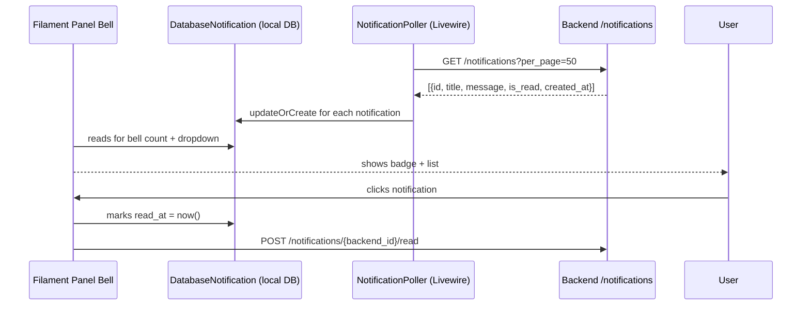

# Design Document: Frontend Polish Phase 3 & 4

## Overview

This document describes the technical design for completing Phase 3 (API synchronization, error handling, and dark mode) and Phase 4 (UI polish using Filament v4 native components) of the Handayani school management frontend (`frontend-v2/`). All work is frontend-only inside the `frontend-v2/` directory. The backend REST API is treated as an immutable external service.

### Goals

- Uniformly propagate the existing `HandlesApiErrors` trait across all 13 Table components that currently lack it
- Standardize Dashboard Widget error handling to graceful fallback data on any API failure
- Fix Portal page error handling to use `HandlesApiErrors` methods instead of ad-hoc `$this->error` strings
- Apply complete Tailwind `dark:` class coverage to every custom Blade view
- Replace deprecated `->form([...])` with the Filament v4 `->schema([...])` pattern everywhere it still exists
- Refactor `ChangePassword` to use Filament's `HasForms` / `InteractsWithForms` contracts
- Improve Settings page with Section grouping and safe `mount()` error handling
- Fix the `Login` page's misuse of `__construct()` for session-redirect logic
- Integrate database notifications via a custom Livewire polling bridge
- Apply native Filament table features (emptyState, paginated, toggleable, SelectFilter) uniformly
- Remove dead code and unused imports to keep the codebase clean

---

## Architecture

The application follows a single-panel Filament v4 setup. All Livewire components are embedded within Filament pages via Blade views. There is no database ORM layer on the frontend — data arrives exclusively via `ApiService::client()` (an `Http` client wrapping the backend REST API).

```mermaid
graph TD
    subgraph "Filament Panel"
        P[Filament Page] --> L[Livewire Component]
        P --> W[Filament Widget]
        L --> T[Filament Table / Actions / Form]
    end

    subgraph "Error Handling Layer"
        HAE[HandlesApiErrors Trait]
        L -- uses --> HAE
        W -- own try/catch --> FD[Fallback Data]
    end

    subgraph "Notification Bridge"
        NB[NotificationBridge Livewire]
        NB -->|polls /notifications| API
        NB -->|writes| DN[DatabaseNotification model]
        FP[Filament Panel ->databaseNotifications()] --> DN
    end

    T -->|->records() / getData()| API[Backend REST API]
    L -->|ApiService| API
    W -->|ApiService| API
```

### Key Design Decisions

1. **HandlesApiErrors is not extended to Widgets** — Widgets extend `StatsOverviewWidget`, `ChartWidget`, or `TableWidget` (Filament base classes that do not use Livewire traits). Each widget keeps its own inline `try/catch` block. This avoids introducing a trait dependency on classes that Filament controls.

2. **Database Notifications use a Livewire polling bridge** — Filament's `->databaseNotifications()` reads from the standard Laravel `DatabaseNotification` model (table `notifications`, columns `data JSON`, `read_at TIMESTAMP`). The backend's custom `Notification` model uses a different schema (`is_read BOOLEAN`, separate `title`/`message` columns). Rather than changing the backend, a new Livewire component `NotificationBridge` will poll the backend `/notifications` API and write/sync records into the `notifications` table that Filament reads natively.

3. **TagihanCardView `payAction()` uses `->form([...])` not `->schema([...])` ** — In Filament v4, `Action::make()->form([])` has been superseded by `->schema([])`. The `payAction()` in `TagihanCardView` still uses the old pattern and must be updated.

4. **Login `__construct()` redirect is a Livewire anti-pattern** — Livewire components are instantiated as PHP objects before the HTTP response cycle is established. The `__construct()` return redirect does not work reliably. The check must move to `mount()`.

---

## Components and Interfaces

### 1. `HandlesApiErrors` Trait Rollout

**Target components:** `DataCategory`, `DataKelas`, `DataSiswa`, `DataWali`, `BranchManagement`, `JenisTagihan`, `UserManagement`, `RoleManagement`, `TahunAjaranManagement`, `EmailPopulation`, `KasHarian`, `RekapBulanan`, `PengeluaranRequest`, and `Setting`.

Each component must:

```php
use \App\Livewire\Concerns\HandlesApiErrors;

// Inside records() closure:
function() {
    try {
        $response = ApiService::client()->get('/endpoint', $params);
        if (!$response->ok()) {
            $this->handleApiError($response);
            return [];
        }
        return $response->json('data') ?? [];
    } catch (\Illuminate\Http\Client\ConnectionException $e) {
        $this->notifyConnectionError();
        return [];
    } catch (\Throwable $e) {
        $this->notifyUnexpectedError();
        return [];
    }
}
```

For components that currently do client-side sorting (e.g., `DataCategory` uses `->collect()->sortBy()`), the sort logic stays inside the `try` block wrapping the API call — the structure does not change, only the wrapping.

### 2. Dashboard Widget Error Handling

**Target widgets:** `DashboardStatsWidget`, `KasBulananChart`, `PembayaranBulananChart`, `PembayaranTerbaruWidget`, `StatusTagihanChart`, `TagihanJatuhTempoWidget`, `TopTunggakanWidget`, `TunggakanJenjangChart`.

`DashboardStatsWidget` already has a `try/catch (\Throwable $e)` block. The pattern to apply uniformly to all 8 widgets adds explicit HTTP error detection:

```php
// StatsOverviewWidget pattern
protected function getStats(): array
{
    try {
        $response = ApiService::client()->get('/endpoint', $params);
        if (!$response->ok()) { return $this->fallbackStats(); }
        $data = $response->json('data') ?? [];
    } catch (\Throwable $e) {
        $data = [];
    }
    return $this->buildStats($data);
}

// ChartWidget pattern
protected function getData(): array
{
    try {
        $response = ApiService::client()->get('/endpoint', $params);
        if (!$response->ok()) { return ['datasets' => [], 'labels' => []]; }
        $data = $response->json('data') ?? [];
    } catch (\Throwable $e) {
        $data = [];
    }
    return $this->buildChartData($data);
}

// TableWidget pattern — already wraps inside records() closure
// Ensure emptyStateHeading is set for PembayaranTerbaruWidget,
// TagihanJatuhTempoWidget, TopTunggakanWidget
```

### 3. Portal Page Error Handling

**`SiswaDashboard` component** currently catches `Exception $e` and assigns `$this->error` (a string shown in Blade). It must be updated to:

- Add `use HandlesApiErrors;`
- On HTTP error: call `$this->handleApiError($response)`
- On `ConnectionException`: call `$this->notifyConnectionError()`
- Remove the `$this->error` string pattern in favour of Filament notifications

**`PortalProfilPage`** — read and verify that `/users/current` calls are wrapped with the same try/catch pattern. If not, apply the same treatment.

**`SiswaDashboard.loadData()` loading indicator** — the `$loading` property is already defined and used in the Blade view. The existing pattern is correct; no change required.

### 4. Dark Mode for Blade Views

All files in `resources/views/livewire/` and `resources/views/filament/pages/` that contain raw HTML elements (not Filament components) must have `dark:` variants added.

**Rule matrix:**

| Light class | Required dark companion |
|---|---|
| `bg-white` | `dark:bg-gray-900` |
| `bg-gray-50` | `dark:bg-gray-800` |
| `bg-{color}-100` | `dark:bg-{color}-900/30` |
| `text-gray-900` / `text-gray-800` | `dark:text-white` / `dark:text-gray-100` |
| `text-gray-600` / `text-gray-700` | `dark:text-gray-300` / `dark:text-gray-400` |
| `text-{color}-800` / `text-{color}-700` | `dark:text-{color}-300` / `dark:text-{color}-400` |
| `border-gray-200` | `dark:border-gray-700` |
| `ring-gray-950/5` | `dark:ring-white/10` |
| Hover `hover:bg-gray-100` | `dark:hover:bg-gray-700` |
| Focus ring `focus:ring-primary-500` | `dark:focus:ring-primary-500` (same) |
| Disabled `disabled:bg-gray-100` | `dark:disabled:bg-gray-800 dark:disabled:text-gray-500` |

**Container pattern** for any custom section-like div:
```html
<div class="bg-white dark:bg-gray-900 ring-1 ring-gray-950/5 dark:ring-white/10 rounded-xl shadow-sm">
```

Views already using `<x-filament::section>` throughout (like `siswa-dashboard.blade.php`, `tagihan-card-view.blade.php`) are already partially dark-mode compatible. The remaining work is on specific raw HTML elements inside those sections (table headers, badges, buttons, inputs).

### 5. Form Actions Schema Pattern

**Only file requiring a code change:** `TagihanCardView::payAction()` — change `->form([...])` to `->schema([...])`.

All other listed components (`DataCategory`, `BranchManagement`, etc.) already use `->schema([...])`.

`ChangePassword` is addressed separately in §10.

### 6. Dashboard Widget Base Classes (Verification)

All 8 widgets already extend the correct Filament base classes. No class-level changes are needed. The only work is ensuring none set a `protected static string $view` property and confirming no `render()`/`getView()` override exists.

### 7. Card Views — Filament Blade Components

**Files:** `resources/views/livewire/tagihan-card-view.blade.php`, `resources/views/livewire/pembayaran-card-view.blade.php`.

Elements requiring replacement:

| Current | Replacement |
|---|---|
| `<input type="text" wire:model...>` (search) | `<x-filament::input.wrapper><x-filament::input wire:model.../></x-filament::input.wrapper>` |
| `<select wire:model...>` (jenjang/status filter) | `<x-filament::input.wrapper><x-filament::input.select wire:model...>...</x-filament::input.select></x-filament::input.wrapper>` |
| `<button @click="openPayment()">Bayar</button>` | `<x-filament::button wire:click="..." color="primary">Bayar</x-filament::button>` |
| `<span class="bg-red-100 text-red-800 dark:...">` (status badge) | `<x-filament::badge color="danger">{{ $status }}</x-filament::badge>` |
| Raw pagination `<button>Prev</button>` / `<button>{{ $i }}</button>` | `<x-filament::button outlined wire:click="previousPage">« Prev</x-filament::button>` and similar |
| `<button wire:click="deleteTagihan(...)"><svg .../></button>` | `<x-filament::icon-button icon="heroicon-o-trash" color="danger" tooltip="Hapus" wire:click="..."/>` |
| `<button wire:click="downloadKwitansi(...)"><svg .../></button>` | `<x-filament::icon-button icon="heroicon-o-arrow-down-tray" color="primary" tooltip="Download Kwitansi" wire:click="..."/>` |

Status badge color mapping:
- `Lunas` → `color="success"`
- `Belum Lunas` → `color="warning"`
- `Belum Dibayar` → `color="danger"`
- Payment methods (e.g., `Tunai`, `Non-Tunai`) → `color="info"` / `color="gray"`

### 8. Settings Page Refactoring

**`Settings.php`** changes:

1. **Add `HandlesApiErrors` trait** — update `mount()`:

```php
use \App\Livewire\Concerns\HandlesApiErrors;

public function mount(): void
{
    try {
        $response = ApiService::client()->get('/setting');
        if ($response->ok()) {
            $this->setting = $response->json('data');
        } else {
            $this->handleApiError($response);
            $this->setting = null;
        }
    } catch (\Illuminate\Http\Client\ConnectionException $e) {
        $this->notifyConnectionError();
        $this->setting = null;
    }
}
```

2. **Null guard on fillForm** — wrap `fillForm()` and the action with `if ($this->setting === null) return;`.

3. **Refresh after successful update** — after a successful `$response`, re-fetch and assign `$this->setting`.

4. **Section grouping in `getHeaderActions()`** — wrap the edit action `->schema([...])` in three `Section::make()` components:
   - "Informasi Sekolah" → `nama_sekolah`, `alamat`, `lokasi`, `kode_pos`, `logo`
   - "Kontak" → `email`, `telepon`
   - "Kepemimpinan" → `kepala_sekolah`, `bendahara`

### 9. Login Page Fix

**Change:** Replace `__construct()` with `mount()` for the redirect check.

```php
// Remove:
public function __construct()
{
    $token = session()->get('data.token');
    if (!is_null($token)) { ... return redirect()... }
}

// Add:
public function mount(): void
{
    $token = session()->get('data.token');
    if (!is_null($token)) {
        $roles = session()->get('data.roles', []);
        $target = in_array('siswa', $roles) ? '/tagihan-siswa' : '/data-master-siswa';
        $this->redirect(filament()->getUrl() . $target);
    }
}
```

The `mount()` method is the correct Livewire lifecycle hook for initialization logic including redirects.

### 10. ChangePassword Page — Filament Forms

**`ChangePassword.php`** refactored interface:

```php
class ChangePassword extends Page implements HasForms
{
    use InteractsWithForms;

    // Replace public string properties with a single form state container
    public ?array $data = [];

    public function mount(): void { ... $this->form->fill(); }

    public function form(Schema $schema): Schema
    {
        return $schema
            ->components([
                Section::make('Ubah Password')
                    ->description('Masukkan password lama dan password baru Anda.')
                    ->schema([
                        TextInput::make('current_password')
                            ->label('Password Saat Ini')
                            ->password()
                            ->required(),
                        TextInput::make('new_password')
                            ->label('Password Baru')
                            ->password()
                            ->required()
                            ->minLength(8)
                            ->confirmed(),
                        TextInput::make('new_password_confirmation')
                            ->label('Konfirmasi Password Baru')
                            ->password()
                            ->required(),
                    ])
            ])
            ->statePath('data');
    }

    public function submit(): void
    {
        $state = $this->form->getState(); // triggers Filament validation
        // ... API call using $state['current_password'], $state['new_password'] ...
    }
}
```

**`change-password.blade.php`** replaces all custom HTML form with:
```html
<form wire:submit.prevent="submit">
    {{ $this->form }}
    <x-filament::button type="submit">Ubah Password</x-filament::button>
</form>
```

### 11. Database Notifications — Bridge Architecture

Since Filament's `->databaseNotifications()` reads from the standard `notifications` table (Laravel DatabaseNotification model), and the backend uses its own `Notification` model with a different schema, the bridge approach works as follows:

#### Frontend `notifications` Table Migration (if not already present)

Laravel's default `notifications` table:
```
id (UUID), type, notifiable_type, notifiable_id, data (JSON), read_at (TIMESTAMP nullable), created_at, updated_at
```

#### `NotificationSyncService` (new class)

```php
// app/Services/NotificationSyncService.php
class NotificationSyncService
{
    public static function syncFromApi(array $apiNotifications, int $userId): void
    {
        foreach ($apiNotifications as $n) {
            DatabaseNotification::updateOrCreate(
                ['id' => 'backend-' . $n['id']], // stable UUID-like key
                [
                    'type'             => 'App\Notifications\BackendNotification',
                    'notifiable_type'  => 'App\Models\User',
                    'notifiable_id'    => $userId,
                    'data'             => [
                        'title'   => $n['title'],
                        'message' => $n['message'],
                        'backend_id' => $n['id'],
                    ],
                    'read_at'          => $n['is_read'] ? ($n['created_at'] ?? now()) : null,
                    'created_at'       => $n['created_at'] ?? now(),
                ]
            );
        }
    }
}
```

#### Polling via Livewire component on panel boot

Add a render hook in `AdminPanelProvider` that embeds a lightweight polling component:

```php
->renderHook(
    PanelsRenderHook::BODY_START,
    fn() => Blade::render('<livewire:notification-poller />')
)
```

`NotificationPoller` is a minimal Livewire component using `wire:poll.30s` that calls `NotificationSyncService::syncFromApi(...)` in a `$wire.refresh()` cycle.

#### Mark-as-Read Passthrough

Override Filament's notification mark-as-read behavior by listening to the `Filament\Notifications\Events\DatabaseNotificationOpened` event (or by customizing the panel's notification component) to also POST to `/notifications/{backend_id}/read` via `ApiService`.



#### `AdminPanelProvider` change

```php
->databaseNotifications()
->databaseNotificationsPolling('30s')
```

### 12. Table Features — Native Filament Capabilities

**emptyState** — Components that are missing any of the three: add the following to their `table()` method:

```php
->emptyStateHeading('Tidak Ada Data')
->emptyStateDescription('Belum ada data yang tersedia.')
->emptyStateIcon('heroicon-o-document-text')
```

**Pagination** — All tables must have:

```php
->paginated([5, 10, 25, 50])
->defaultPaginationPageOption(10)
```

**Toggleable columns** — For tables with 5+ columns, add `->toggleable(isToggledHiddenByDefault: true)` to columns after the 4th:

```php
TextColumn::make('created_at')->toggleable(isToggledHiddenByDefault: true),
```

**SelectFilter** — Replace any custom Blade-based categorical filters with:

```php
->filters([
    SelectFilter::make('status')
        ->options(['Aktif' => 'Aktif', 'Nonaktif' => 'Nonaktif']),
    SelectFilter::make('jenjang')
        ->options(['KB' => 'KB', 'TK' => 'TK', 'MI' => 'MI']),
])
```

### 13. Dead Code and Unused Import Cleanup

**Strategy:**
1. Run `php artisan ide-helper:generate` (if available) or manual grep for unused imports
2. Check each `use` statement against usages in the same file
3. Remove commented-out code blocks (any PHP or HTML that is commented out, not docblocks or TODO markers)
4. Verify with `php artisan view:clear && php artisan config:clear && php artisan route:clear`
5. Verify with `npm run build`

---

## Data Models

### `DatabaseNotification` (Laravel standard model — read by Filament)

| Column | Type | Notes |
|---|---|---|
| `id` | UUID | Primary key. For synced backend notifications, use `"backend-" . $backendId` as a stable prefix |
| `type` | string | Set to `'App\Notifications\BackendNotification'` for all synced records |
| `notifiable_type` | string | `'App\Models\User'` |
| `notifiable_id` | int | Frontend User ID from session |
| `data` | JSON | `{title, message, backend_id}` |
| `read_at` | timestamp\|null | `null` = unread; populated from `is_read=true` with the notification's `created_at` |
| `created_at` | timestamp | From backend `created_at` |

### Backend Notification API response shape

```json
{
  "data": [
    {
      "id": 42,
      "title": "Tagihan Baru",
      "message": "Tagihan SPP bulan Juli telah diterbitkan.",
      "is_read": false,
      "created_at": "2025-07-01T10:00:00.000000Z"
    }
  ],
  "current_page": 1,
  "last_page": 2,
  "total": 38
}
```

---

## Correctness Properties

*A property is a characteristic or behavior that should hold true across all valid executions of a system — essentially, a formal statement about what the system should do. Properties serve as the bridge between human-readable specifications and machine-verifiable correctness guarantees.*

This feature primarily involves wiring, configuration, and UI composition changes — most acceptance criteria are static code checks (SMOKE) or specific example-based behaviors. However, three areas have clear universal properties amenable to property-based testing:

1. Table component error handling — the same behavior must hold for **any** combination of API failure type and component state
2. Dashboard widget fallback — the same behavior must hold for **any** widget and **any** API failure
3. The notification field mapping — a pure data transformation with a clearly defined universal contract

---

### Property 1: Table Component Error Handling is Unconditional

*For any* Table_Component that uses the `HandlesApiErrors` trait, and for any API failure (whether a `ConnectionException`, any HTTP 4xx/5xx response, or any other `Throwable`), the `records()` closure SHALL return an empty array and the appropriate `HandlesApiErrors` notification method SHALL be invoked within the same request cycle, regardless of the component's current filter state, search string, pagination page, or sort column.

**Validates: Requirements 1.1, 1.2, 1.4, 1.5**

---

### Property 2: Dashboard Widget API Failure Produces Safe Fallback Data

*For any* of the 8 Dashboard Widgets, and for any API failure (whether a `ConnectionException` or any HTTP error response), the widget's data-fetching method (`getStats()`, `getData()`, or the `records()` closure inside `table()`) SHALL return a safe, non-throwing fallback: zero-valued `Stat` objects for `StatsOverviewWidget`, an array with empty `datasets` and `labels` keys for `ChartWidget`, and an empty `Collection` for `TableWidget`, regardless of the widget's current `$selectedTahunAjaranId` or any other reactive property.

**Validates: Requirements 2.1, 2.2, 2.4, 2.5**

---

### Property 3: Notification Field Mapping Preserves Required Fields and Correctly Converts `is_read`

*For any* backend notification object with fields `{id, title, message, is_read, created_at}`, the `NotificationSyncService::syncFromApi()` mapping function SHALL produce a `DatabaseNotification`-compatible record where:
- The `data` JSON contains both a non-empty `title` key equal to the source `title` and a `message` key equal to the source `message`
- When `is_read` is `true`, the resulting `read_at` SHALL be a non-null timestamp
- When `is_read` is `false`, the resulting `read_at` SHALL be `null`
- These conditions hold for any string value of `title` and `message` (including empty strings, Unicode, and very long strings)

**Validates: Requirements 11.2, 11.3**

---

## Error Handling

### Layered Error Strategy

```
┌─────────────────────────────────────────────────────────┐
│  User-visible layer (Filament Notification)             │
│  notifyConnectionError() / handleApiError() /          │
│  notifyUnexpectedError()                                │
├─────────────────────────────────────────────────────────┤
│  Component layer (Livewire / Widget)                   │
│  try/catch with empty fallback return                  │
├─────────────────────────────────────────────────────────┤
│  HTTP layer (ApiService)                               │
│  Connection timeout, DNS failure → ConnectionException │
│  4xx/5xx → response object with !$response->ok()      │
└─────────────────────────────────────────────────────────┘
```

### Error Scenario Matrix

| Scenario | Component Type | Catch Target | User Feedback | Fallback |
|---|---|---|---|---|
| Backend down / timeout | Table Component | `ConnectionException` | `notifyConnectionError()` persistent | `[]` |
| Backend returns 4xx/5xx | Table Component | `!$response->ok()` | `handleApiError($response)` | `[]` |
| Unexpected PHP error | Table Component | `\Throwable` | `notifyUnexpectedError()` | `[]` |
| Backend down / timeout | Dashboard Widget | `\Throwable` | Silent (no notification, fallback data) | empty dataset |
| Backend returns 4xx/5xx | Dashboard Widget | `!$response->ok()` | Silent (fallback data) | empty dataset |
| Backend down / timeout | Portal Page | `ConnectionException` | `notifyConnectionError()` persistent | empty state |
| Backend returns 4xx/5xx | Portal Page | `!$response->ok()` | `handleApiError($response)` | empty state |
| Settings mount fails | Settings Page | both | `notifyConnectionError()` / `handleApiError()` | `$this->setting = null` (no infolist rendered) |
| Notification sync fails | NotificationPoller | `\Throwable` | silent (stale data shown) | no sync attempt |

**Note on Dashboard Widget silence:** Widgets render in a grid. Surfacing a Filament notification for each failing widget would flood the UI on a complete backend outage (8 simultaneous notifications). The chosen approach is silent fallback with zero/empty data, consistent with how `DashboardStatsWidget` already behaves.

### `HandlesApiErrors` trait reference

```
notifyConnectionError()   → persistent danger notification: "Server tidak dapat dihubungi"
handleApiError($response) → extracts message from JSON errors/message field, persistent danger
notifyUnexpectedError()   → persistent danger notification: "Terjadi kesalahan yang tidak terduga"
```

---

## Testing Strategy

### Unit Tests (Example-Based)

These cover specific scenarios and interaction points:

1. **`HandlesApiErrors` trait methods** — verify each notification method dispatches the correct Filament Notification (title, body, danger, persistent)
2. **`NotificationSyncService::syncFromApi()`** — verify with 2–3 concrete notification arrays that `read_at` is null for `is_read=false` and non-null for `is_read=true`; verify `data` JSON contains `title` and `message`
3. **`Settings::mount()`** — mock `ApiService` to return a 500 error; verify `$this->setting` is null and `handleApiError` was called; mock a successful response and verify `$this->setting` is populated
4. **`ChangePassword::form()`** — verify the schema contains `current_password`, `new_password`, `new_password_confirmation` TextInput components with correct validation rules
5. **`Login::mount()`** — verify the component redirects when a valid token is in session; verify no redirect when session is empty

### Property-Based Tests (PBT)

Uses **Pest PHP** with the `pestphp/pest` test runner (already present in the project) and **[Eris](https://github.com/giorgiosironi/eris)** or **[fast-check-php](https://github.com/nicmart/php-generics)** for property generation. Given the backend-only PHP stack, the recommended library is **[Eris](https://github.com/giorgiosironi/eris)** — a mature PHP PBT library.

**Minimum 100 iterations per property test.**

#### Property Test 1: Table Component Error Handling is Unconditional

```
Feature: frontend-polish-phase3-4, Property 1: Table component records() always returns [] on any API failure
```

Generator: produce arbitrary combinations of:
- Component class (from the 13 listed components)
- Failure type: `ConnectionException`, HTTP 400, HTTP 500, generic `RuntimeException`
- Component state: random `$search`, `$filterJenjang`, `$perPage`, `$page`

Assert: `records()` closure returns an empty array (or empty Collection) for every generated combination.

#### Property Test 2: Dashboard Widget Fallback Data is Safe

```
Feature: frontend-polish-phase3-4, Property 2: Dashboard widget returns safe fallback data for any API failure
```

Generator: produce combinations of:
- Widget class (from the 8 widgets)
- Failure type: `ConnectionException`, HTTP 4xx, HTTP 5xx
- Widget state: random `$selectedTahunAjaranId` (null, 0, positive int)

Assert:
- For `StatsOverviewWidget`: `getStats()` returns an array of `Stat` objects (no exceptions thrown)
- For `ChartWidget`: `getData()` returns an array with `datasets` and `labels` keys
- For `TableWidget`: the `records()` closure returns an empty `Collection`

#### Property Test 3: Notification Field Mapping

```
Feature: frontend-polish-phase3-4, Property 3: Notification mapping preserves fields and converts is_read correctly
```

Generator: produce arbitrary `{id: int, title: string, message: string, is_read: bool, created_at: string}` arrays.

Assert:
- Mapped `data->title` equals input `title`
- Mapped `data->message` equals input `message`
- `is_read = true` ⟹ `read_at` is non-null
- `is_read = false` ⟹ `read_at` is null

### Integration / Smoke Tests

1. **Build validation** — `npm run build` must exit 0 (CI check)
2. **PHP syntax validation** — `php artisan view:clear && route:clear && config:clear` must exit 0
3. **Widget base class verification** — all 8 widgets extend the correct Filament base class (reflection-based assertion)
4. **Schema pattern verification** — no occurrence of `->form([` in action definitions (grep/regex test)
5. **Notification sync integration** — with a test backend that returns 3 notifications, verify `DatabaseNotification` table contains 3 matching rows after `syncFromApi()` is called
