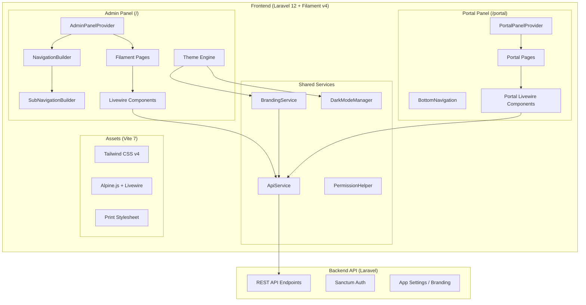
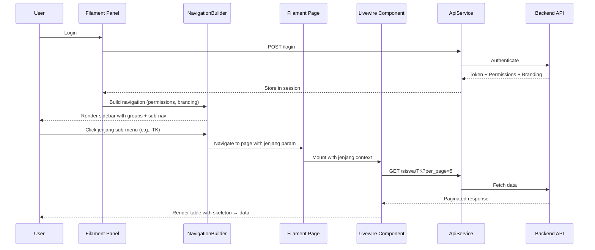

# Design Document: Frontend Redesign

## Overview

This design document describes the technical architecture for the Handayani school billing management system frontend redesign. The redesign optimizes the existing Filament v4 + Laravel 12 frontend by reorganizing navigation, adding jenjang-based sub-navigation, implementing responsive layouts, dark mode, loading states, accessibility improvements, performance optimizations, a dedicated Siswa/Wali portal, branch branding, and print styles — all deployed incrementally.

The system retains its current architecture: a Laravel frontend that communicates with a separate Laravel backend API via `ApiService::client()`. Filament v4 provides the admin panel framework, Livewire handles interactivity, and Tailwind CSS v4 (via Vite 7) handles styling.

### Key Design Decisions

1. **Filament-native approach**: Leverage Filament v4's built-in features (dark mode, navigation builder, sub-navigation, SPA mode) rather than custom implementations where possible.
2. **Single configuration point**: Navigation reorganization happens entirely in `AdminPanelProvider` — no individual page file changes needed.
3. **Separate panel for portal**: The Siswa/Wali portal is a new `PortalPanelProvider` at `/portal`, completely independent of the admin panel.
4. **CSS-first theming**: Dark mode, responsive layouts, and print styles are handled via Tailwind CSS utilities and custom theme CSS, minimizing JavaScript.
5. **API-driven branding**: Branch branding configuration is stored in the backend and fetched at panel boot time, cached in session.

## Architecture



### Component Interaction Flow



## Components and Interfaces

### 1. AdminPanelProvider (Modified)

**File**: `app/Providers/Filament/AdminPanelProvider.php`

Responsibilities:
- Configure 4 navigation groups: Akademik, Keuangan, Laporan, Pengaturan
- Register sub-navigation for jenjang-aware pages
- Enable dark mode with persistence
- Load branch branding at boot
- Configure SPA transitions with progress bar

```php
interface AdminPanelConfiguration
{
    // Navigation groups with permission-based visibility
    public function buildNavigation(NavigationBuilder $builder): NavigationBuilder;
    
    // Dark mode configuration
    public function configureDarkMode(Panel $panel): Panel;
    
    // Branch branding loader
    public function loadBranding(Panel $panel): Panel;
}
```

### 2. PortalPanelProvider (New)

**File**: `app/Providers/Filament/PortalPanelProvider.php`

Responsibilities:
- Separate panel at `/portal` path
- Mobile-first layout with bottom navigation
- Limited navigation: Beranda, Tagihan, Riwayat Pembayaran, Profil
- Child selector for multi-child wali
- Same theming as admin panel

```php
interface PortalPanelConfiguration
{
    public function panel(Panel $panel): Panel;
    // Returns panel configured with:
    // - path('/portal')
    // - mobile-first layout
    // - bottom navigation on mobile
    // - child selector widget
}
```

### 3. BrandingService (New)

**File**: `app/Services/BrandingService.php`

Responsibilities:
- Fetch and cache branch branding from backend API
- Provide logo URL, primary color, favicon URL
- Fallback to defaults when no custom branding configured

```php
interface BrandingServiceInterface
{
    public static function get(): BrandingConfig;
    public static function refresh(): void;
    public static function logoUrl(): ?string;
    public static function primaryColor(): ?string;
    public static function faviconUrl(): ?string;
}

class BrandingConfig
{
    public ?string $logoUrl;
    public ?string $primaryColor;  // hex color e.g. '#1e40af'
    public ?string $faviconUrl;
    public string $branchName;
}
```

### 4. DarkModeManager (New)

**File**: `app/Services/DarkModeManager.php`

Responsibilities:
- Manage theme preference (light/dark/system)
- Persist preference to backend via API
- Provide current theme state to Blade/Alpine

```php
interface DarkModeManagerInterface
{
    public static function getPreference(): string; // 'light' | 'dark' | 'system'
    public static function setPreference(string $mode): void;
    public static function resolvedTheme(): string; // 'light' | 'dark'
}
```

### 5. PermissionHelper (New)

**File**: `app/Helpers/PermissionHelper.php`

Responsibilities:
- Centralize permission checks
- Determine group visibility based on item permissions
- Determine jenjang visibility per user

```php
interface PermissionHelperInterface
{
    public static function hasAnyInGroup(string $group): bool;
    public static function canViewJenjang(string $jenjang): bool;
    public static function visibleJenjang(): array; // ['KB', 'TK', 'MI'] filtered
    public static function has(string $permission): bool;
}
```

### 6. SubNavigationTrait (New)

**File**: `app/Filament/Concerns/HasJenjangSubNavigation.php`

Responsibilities:
- Provide jenjang sub-navigation to applicable pages
- Handle jenjang parameter from URL
- Pass jenjang context to Livewire components

```php
trait HasJenjangSubNavigation
{
    public string $activeJenjang = 'KB'; // default first available
    
    public function getSubNavigation(): array;
    public function getJenjangRecordCount(string $jenjang): int;
    public function mountWithJenjang(?string $jenjang): void;
}
```

### 7. Skeleton Loader Component (New)

**File**: `resources/views/components/skeleton-loader.blade.php`

Responsibilities:
- Render shimmer-animated placeholder matching table/card layout
- Accept configuration for rows, columns, card mode

```php
// Usage in Blade:
// <x-skeleton-loader :rows="5" :columns="4" />
// <x-skeleton-loader type="card" :count="3" />
```

### 8. Print Layout Component (New)

**File**: `resources/views/components/print-layout.blade.php`

Responsibilities:
- Wrap printable content with branch header
- Hide navigation and interactive elements
- Apply page-break rules for tables

```php
// Usage:
// <x-print-layout>
//     <x-slot:header>Kwitansi</x-slot:header>
//     {{-- content --}}
// </x-print-layout>
```

## Data Models

### BrandingConfig (Value Object)

```php
class BrandingConfig
{
    public function __construct(
        public ?string $logoUrl = null,
        public ?string $primaryColor = null,
        public ?string $faviconUrl = null,
        public string $branchName = 'Handayani',
        public ?string $logoBase64 = null, // for print
    ) {}
    
    public static function fromApiResponse(array $data): self;
    public static function default(): self;
    public function hasBranding(): bool;
    public function primaryColorRgb(): ?string; // Convert hex to RGB for Filament
}
```

### NavigationConfig (Value Object)

```php
class NavigationConfig
{
    public const GROUPS = [
        'akademik' => [
            'label' => 'Akademik',
            'icon' => 'heroicon-o-academic-cap',
            'items' => ['siswa', 'kelas', 'kenaikan-kelas', 'tahun-ajaran'],
        ],
        'keuangan' => [
            'label' => 'Keuangan',
            'icon' => 'heroicon-o-banknotes',
            'items' => ['tagihan', 'pembayaran', 'pengeluaran', 'kas', 'jenis-tagihan'],
        ],
        'laporan' => [
            'label' => 'Laporan',
            'icon' => 'heroicon-o-chart-bar',
            'items' => ['dashboard', 'import-export', 'kas-harian', 'rekap-bulanan'],
        ],
        'pengaturan' => [
            'label' => 'Pengaturan',
            'icon' => 'heroicon-o-cog-6-tooth',
            'items' => ['user-management', 'role-management', 'app-settings', 'notification-settings'],
        ],
    ];
    
    public const JENJANG_PAGES = [
        'siswa', 'kelas', 'tagihan', 'pembayaran', 'kenaikan-kelas',
    ];
    
    public const JENJANG_OPTIONS = ['KB', 'TK', 'MI'];
}
```

### ThemePreference (Stored in session + backend)

```php
// Session key: 'data.theme_preference'
// Values: 'light' | 'dark' | 'system'
// Backend endpoint: PUT /user/preferences { theme: 'dark' }
```

### Portal Data Structures

```php
class PortalTagihanSummary
{
    public int $totalOutstanding;    // Total Rp outstanding
    public int $countBelumLunas;     // Count of unpaid bills
    public int $countCicilan;        // Count of partially paid
    public int $countLunas;          // Count of fully paid
    
    public static function fromApiResponse(array $data): self;
}

class PortalChildSelector
{
    public array $children; // [{id, nama, kelas, jenjang}]
    public int $activeChildId;
    
    public static function fromApiResponse(array $data): self;
}
```

## Component Migration Design (Requirement 12)

### Migration Strategy

Components are migrated from custom HTML/Alpine.js to Filament native components to gain automatic dark mode, consistent theming, and reduced maintenance. Each migration preserves existing functionality (permissions, API calls, data flow).

### 12a. BulkAkunSiswa → Filament Table

**Current**: Custom HTML table with manual checkbox selection, custom pagination, and manual filter dropdowns.

**Target**: Filament Table with `InteractsWithTable` trait.

```php
// app/Filament/Pages/ManajemenAkunSiswaPage.php (modified)
use Filament\Tables\Concerns\InteractsWithTable;
use Filament\Tables\Contracts\HasTable;

class ManajemenAkunSiswaPage extends Page implements HasTable
{
    use InteractsWithTable;

    protected function getTableQuery(): Builder
    {
        // Uses ApiService to fetch, mapped to Eloquent-like collection
        return AkunSiswaQueryBuilder::make($this->apiData);
    }

    protected function getTableColumns(): array
    {
        return [
            TextColumn::make('nama')->sortable()->searchable(),
            TextColumn::make('email')->sortable()->searchable(),
            TextColumn::make('kelas')->sortable(),
            TextColumn::make('jenjang')->sortable(),
            IconColumn::make('is_active')->boolean(),
        ];
    }

    protected function getTableFilters(): array
    {
        return [
            SelectFilter::make('jenjang')
                ->options(['KB' => 'KB', 'TK' => 'TK', 'MI' => 'MI']),
            SelectFilter::make('kelas')
                ->options(fn () => $this->getKelasOptions()),
        ];
    }

    protected function getTableBulkActions(): array
    {
        return [
            BulkAction::make('toggleActive')
                ->label('Toggle Status Aktif')
                ->action(fn (Collection $records) => $this->bulkToggleActive($records)),
            BulkAction::make('resetPassword')
                ->label('Reset Password')
                ->requiresConfirmation()
                ->action(fn (Collection $records) => $this->bulkResetPassword($records)),
        ];
    }
}
```

### 12b. DetailWali → Filament Infolist

**Current**: Custom HTML display with hardcoded layout.

**Target**: Filament Infolist matching `DetailSiswa` pattern.

```php
// In DetailWaliPage or as a modal action
use Filament\Infolists\Infolist;
use Filament\Infolists\Components\{Section, TextEntry, Grid};

public function waliInfolist(Infolist $infolist): Infolist
{
    return $infolist
        ->state($this->waliData)
        ->schema([
            Section::make('Data Wali')
                ->schema([
                    Grid::make(2)->schema([
                        TextEntry::make('nama')->label('Nama Wali'),
                        TextEntry::make('hubungan')->label('Hubungan'),
                        TextEntry::make('telepon')->label('No. Telepon'),
                        TextEntry::make('email')->label('Email'),
                        TextEntry::make('alamat')->label('Alamat')->columnSpanFull(),
                    ]),
                ]),
            Section::make('Anak yang Terdaftar')
                ->schema([
                    RepeatableEntry::make('children')
                        ->schema([
                            TextEntry::make('nama'),
                            TextEntry::make('kelas'),
                            TextEntry::make('jenjang'),
                        ])->columns(3),
                ]),
        ]);
}
```

### 12c. EmailPopulation → Filament Table

**Current**: Custom HTML table with manual inline editing.

**Target**: Filament Table with inline edit actions.

```php
// app/Filament/Pages/EmailPopulationPage.php (modified)
protected function getTableColumns(): array
{
    return [
        TextColumn::make('nama')->sortable()->searchable(),
        TextColumn::make('kelas')->sortable(),
        TextColumn::make('email')
            ->sortable()
            ->searchable()
            ->placeholder('Belum diisi'),
    ];
}

protected function getTableActions(): array
{
    return [
        Action::make('editEmail')
            ->label('Edit Email')
            ->icon('heroicon-o-pencil')
            ->form([
                TextInput::make('email')
                    ->email()
                    ->required()
                    ->label('Email Wali'),
            ])
            ->action(function (array $data, $record) {
                $this->updateEmail($record['id'], $data['email']);
            }),
    ];
}
```

### 12d. TagihanCardView Payment Modal → Filament Action Modal

**Current**: Alpine.js `x-data` modal with custom form handling.

**Target**: Filament Action with Form components.

```php
// In TagihanCardView Livewire component
use Filament\Actions\Action;
use Filament\Forms\Components\{Select, TextInput, DatePicker};

public function payAction(): Action
{
    return Action::make('pay')
        ->label('Bayar')
        ->icon('heroicon-o-banknotes')
        ->form([
            Select::make('metode_pembayaran')
                ->label('Metode Pembayaran')
                ->options([
                    'tunai' => 'Tunai',
                    'transfer' => 'Transfer Bank',
                ])
                ->required(),
            TextInput::make('pembayar')
                ->label('Nama Pembayar')
                ->required(),
            TextInput::make('jumlah')
                ->label('Jumlah Bayar')
                ->numeric()
                ->prefix('Rp')
                ->required(),
            DatePicker::make('tanggal')
                ->label('Tanggal')
                ->default(now())
                ->required(),
        ])
        ->action(function (array $data) {
            $this->processPayment($data);
        })
        ->modalHeading('Pembayaran Tagihan')
        ->modalWidth('md');
}
```

### 12e. Custom Select Dropdowns → Filament Select

All period/filter `<select>` elements within Filament page contexts are replaced with:

```php
// Example: period selector in a Filament page header
Select::make('tahun_ajaran')
    ->label('Tahun Ajaran')
    ->options(fn () => $this->getTahunAjaranOptions())
    ->default($this->activeTahunAjaran)
    ->live()
    ->afterStateUpdated(fn ($state) => $this->filterByTahunAjaran($state));
```

---

## Table Consistency Design (Requirement 13)

### Sorting Strategy

All Filament Tables will have `->sortable()` added to primary columns. Sorting is delegated to the backend API via query parameters.

```php
// Standard sortable columns per table type:
// Data tables: nama, tanggal_dibuat, status
// Financial tables: tanggal, jumlah, status
// User tables: nama, email, role

// API query parameter format:
// GET /siswa?sort=nama&direction=asc
// GET /pembayaran?sort=tanggal&direction=desc
```

**Backend API Changes Required:**

| Endpoint | Current Sort Support | Action |
|----------|---------------------|--------|
| `/siswa` | None | Add `sort` + `direction` params |
| `/pembayaran` | None | Add `sort` + `direction` params |
| `/users` | None | Add `sort` + `direction` params |
| `/pengeluaran` | None | Add `sort` + `direction` params |
| `/tagihan` | Already supported | No change |
| `/kas` | Already supported | No change |

### Filter Strategy

```php
// Standard filters added to tables lacking them:
// DataSiswa: SelectFilter::make('jenjang')
// Pembayaran: SelectFilter::make('metode')
// UserManagement: SelectFilter::make('role')
```

### Search Consistency

All tables will use server-side search via `->searchable()` on columns, which triggers API calls with `?search=` parameter. Client-side filtering is removed.

```php
// Standardized search implementation in ApiTableQueryBuilder:
protected function applySearchToApiRequest(string $search): void
{
    $this->queryParams['search'] = $search;
}
```

### Pagination Standard

```php
// Applied to ALL table pages:
protected function getTableRecordsPerPageSelectOptions(): array
{
    return [5, 10, 25];
}

protected function getDefaultTableRecordsPerPageSelectOption(): int
{
    return 10; // Changed from 5 to 10
}
```

### Bulk Actions for ManajemenAkunSiswa

Replaces custom checkbox approach with Filament's built-in bulk action system (see 12a above).

---

## Dark Mode Compatibility Design (Requirement 14)

### Strategy

Two approaches based on migration status:

1. **Views being migrated to Filament native (Req 12)**: `bulk-akun-siswa.blade.php` and `detail-wali.blade.php` — dark mode comes for free via Filament components.
2. **Views staying as custom Blade**: `tagihan-card-view.blade.php` and `tagihan-siswa.blade.php` — require manual `dark:` class additions.

### Dark Mode Class Mapping

| Light Class | Dark Equivalent |
|-------------|----------------|
| `bg-white` | `dark:bg-gray-800` |
| `bg-gray-50` | `dark:bg-gray-900` |
| `bg-gray-100` | `dark:bg-gray-800` |
| `text-gray-900` | `dark:text-gray-100` |
| `text-gray-700` | `dark:text-gray-300` |
| `text-gray-500` | `dark:text-gray-400` |
| `border-gray-200` | `dark:border-gray-700` |
| `border-gray-300` | `dark:border-gray-600` |
| `ring-gray-300` | `dark:ring-gray-600` |

### Badge Colors (Dark Mode)

```blade
{{-- Status badges --}}
<span class="bg-green-100 text-green-800 dark:bg-green-900/30 dark:text-green-400">Lunas</span>
<span class="bg-yellow-100 text-yellow-800 dark:bg-yellow-900/30 dark:text-yellow-400">Cicilan</span>
<span class="bg-red-100 text-red-800 dark:bg-red-900/30 dark:text-red-400">Belum Lunas</span>
```

### Implementation Checklist

- `tagihan-card-view.blade.php`: Add `dark:` to card container, amount text, status badges, action buttons, dividers
- `tagihan-siswa.blade.php`: Add `dark:` to summary cards, list items, empty state, sibling selector
- `bulk-akun-siswa.blade.php`: Migrate to Filament Table (automatic dark mode)
- `detail-wali.blade.php`: Migrate to Filament Infolist (automatic dark mode)

---

## Profile Page Migration Design (Requirement 15)

### Architecture

Replace custom `ProfilePage` with Filament's built-in `EditProfile` mechanism.

```php
// Option: Custom EditProfile page extending Filament's base
// app/Filament/Pages/Auth/EditProfile.php

namespace App\Filament\Pages\Auth;

use Filament\Pages\Auth\EditProfile as BaseEditProfile;
use Filament\Forms\Components\{TextInput, Section};
use Filament\Forms\Form;

class EditProfile extends BaseEditProfile
{
    public function form(Form $form): Form
    {
        return $form->schema([
            Section::make('Informasi Profil')
                ->schema([
                    TextInput::make('name')
                        ->label('Nama')
                        ->required()
                        ->maxLength(255),
                    TextInput::make('email')
                        ->label('Email')
                        ->email()
                        ->unique(ignoreRecord: true)
                        ->required(),
                ]),
            Section::make('Ubah Password')
                ->schema([
                    TextInput::make('current_password')
                        ->label('Password Saat Ini')
                        ->password()
                        ->requiredWith('email')
                        ->currentPassword(),
                    TextInput::make('password')
                        ->label('Password Baru')
                        ->password()
                        ->confirmed()
                        ->minLength(8),
                    TextInput::make('password_confirmation')
                        ->label('Konfirmasi Password Baru')
                        ->password(),
                ]),
        ]);
    }

    protected function handleRecordUpdate(Model $record, array $data): Model
    {
        // Call backend API to update profile
        $response = ApiService::client()->put('/user/profile', [
            'name' => $data['name'],
            'email' => $data['email'],
            'current_password' => $data['current_password'] ?? null,
            'password' => $data['password'] ?? null,
        ]);

        if ($response->failed()) {
            // Map API validation errors to form field errors
            throw ValidationException::withMessages(
                $response->json('errors', [])
            );
        }

        return $record;
    }
}
```

### Panel Configuration

```php
// In AdminPanelProvider:
$panel->profile(EditProfile::class);

// This automatically:
// - Adds "Profile" link to user menu dropdown
// - Routes to the profile page
// - No manual NavigationItem needed
```

### Cleanup

After migration:
- Remove `app/Filament/Pages/ProfilePage.php`
- Remove `resources/views/filament/pages/profile-page.blade.php` (if exists)
- Remove any custom routes for the old profile page

---

## Correctness Properties

*A property is a characteristic or behavior that should hold true across all valid executions of a system — essentially, a formal statement about what the system should do. Properties serve as the bridge between human-readable specifications and machine-verifiable correctness guarantees.*

### Property 1: Navigation group visibility respects permissions

*For any* set of user permissions, if none of the permissions required to view items in a navigation group are present in the user's permission set, then that entire navigation group SHALL NOT appear in the rendered sidebar.

**Validates: Requirements 1.8**

### Property 2: Jenjang filter returns only matching data

*For any* jenjang selection (KB, TK, or MI) on a jenjang-aware page, all records displayed in the data table SHALL belong exclusively to the selected jenjang.

**Validates: Requirements 2.3**

### Property 3: Jenjang record count accuracy

*For any* jenjang sub-menu item displayed in the sidebar, the record count shown next to it SHALL equal the actual total number of records for that jenjang as returned by the API.

**Validates: Requirements 2.5**

### Property 4: Jenjang sub-navigation respects permissions

*For any* user permission set, only jenjang values that the user has explicit access to SHALL be visible in the sub-navigation menu. Jenjang values without corresponding permissions SHALL be hidden.

**Validates: Requirements 2.7**

### Property 5: Theme preference round-trip persistence

*For any* valid theme preference value (light, dark, or system), setting the preference and then reading it back (after page reload or session restore) SHALL return the same value that was set.

**Validates: Requirements 4.2**

### Property 6: Form submit button disabled during submission

*For any* form submission action, the submit button SHALL be in a disabled state from the moment the submission begins until the async operation completes (success or error).

**Validates: Requirements 5.4**

### Property 7: Icon-only buttons have accessible labels

*For any* button element that contains only an icon (no visible text), that button SHALL have a non-empty `aria-label` attribute or `aria-labelledby` reference providing a text description.

**Validates: Requirements 6.4**

### Property 8: Form inputs have associated labels

*For any* form input element rendered in the application, that input SHALL have an associated label via either a `<label>` element with matching `for` attribute, or an `aria-labelledby` attribute referencing a visible label.

**Validates: Requirements 6.5**

### Property 9: Heading hierarchy is logical

*For any* page rendered in the application, the heading elements (h1–h6) SHALL follow a logical hierarchy without skipping levels (e.g., an h3 SHALL NOT appear without a preceding h2).

**Validates: Requirements 6.6**

### Property 10: Images specify dimensions

*For any* `` element rendered in the application, that element SHALL have explicit `width` and `height` attributes (or equivalent CSS) to prevent layout shifts during loading.

**Validates: Requirements 7.4**

### Property 11: Portal tagihan summary total accuracy

*For any* set of tagihan records belonging to a siswa, the summary card total outstanding amount SHALL equal the sum of (jumlah - amount_paid) for all tagihan with status not equal to "Lunas".

**Validates: Requirements 8.3**

### Property 12: Portal tagihan grouping correctness

*For any* set of tagihan records, when displayed in the portal list view, every tagihan SHALL appear in exactly one group matching its status (belum lunas, cicilan, or lunas), and no tagihan SHALL be missing or duplicated across groups.

**Validates: Requirements 8.4**

### Property 13: Branch primary color application

*For any* valid hex color value configured as a branch's primary color, the Filament panel SHALL apply that color as the CSS custom property `--primary` (converted to RGB format) across all themed components.

**Validates: Requirements 9.3**

### Property 14: Table filter returns only matching records

*For any* SelectFilter value applied to a Filament Table (jenjang, kelas, metode, role), all records displayed in the table SHALL have a matching value in the filtered column — no non-matching records SHALL appear.

**Validates: Requirements 13.1, 13.2**

### Property 15: Sort parameter produces correctly ordered results

*For any* sortable column and sort direction (asc/desc), the records displayed in the table SHALL be ordered according to that column's values in the specified direction — i.e., for ascending, each row's value SHALL be ≤ the next row's value.

**Validates: Requirements 13.1, 13.6**

### Property 16: Server-side search returns matching results

*For any* non-empty search query entered in a Filament Table search box, all returned results SHALL contain the search term (case-insensitive) in at least one of the table's searchable columns.

**Validates: Requirements 13.3**

### Property 17: Dark mode class coverage for custom Blade views

*For any* Tailwind color utility class (bg-*, text-*, border-*) used in a custom Blade view that is not migrated to Filament native, there SHALL exist a corresponding `dark:` variant class on the same element.

**Validates: Requirements 14.1, 14.2, 14.6**

### Property 18: Email validation correctness

*For any* string submitted as an email value in the profile form, the system SHALL accept it if and only if it matches a valid email format (RFC 5322 simplified) and is unique within the branch.

**Validates: Requirements 15.2**

### Property 19: Password confirmation gate for email changes

*For any* profile update request that changes the email field, if the provided current password does not match the user's actual password, the system SHALL reject the entire update and preserve the original email value.

**Validates: Requirements 15.3**

## Error Handling

### API Communication Errors

| Scenario | Handling |
|----------|----------|
| API timeout | Show toast notification "Koneksi timeout, silakan coba lagi" with retry button |
| 401 Unauthorized | Redirect to login page, clear session |
| 403 Forbidden | Show "Akses ditolak" notification, hide unauthorized elements |
| 404 Not Found | Show empty state with appropriate message |
| 500 Server Error | Show "Terjadi kesalahan server" notification with retry option |
| Network offline | Show persistent banner "Tidak ada koneksi internet" |

### Branding Fallback

- If branding API fails: use cached session data
- If no cached data: use default Filament branding
- If logo URL is broken: show text brand name as fallback

### Dark Mode Errors

- If preference save fails: apply theme locally, retry save on next interaction
- If system preference detection fails: default to light mode

### Portal Errors

- If child data fetch fails: show error state with retry
- If wali has no children linked: show informational message with contact admin instruction

### Sub-Navigation Errors

- If jenjang count API fails: show "—" instead of count, don't block navigation
- If jenjang data is empty: show empty state for that jenjang

### Component Migration Errors

- If Filament Table data fetch fails: show Filament's built-in empty state with retry action
- If bulk action partially fails: show notification with count of successful/failed operations, don't roll back successful ones
- If inline edit (EmailPopulation) fails: show validation error inline, keep edit form open
- If payment modal submission fails: show error notification, keep modal open with data preserved

### Table Sorting/Filtering Errors

- If sort parameter is not supported by backend: log warning, fall back to default order
- If filter returns empty results: show Filament's empty state with "reset filters" action
- If search request times out: show "Pencarian gagal, coba lagi" notification

### Profile Page Errors

- If email uniqueness check fails: show "Email sudah digunakan" inline error on email field
- If current password is wrong: show "Password salah" inline error on password field
- If API update fails (network): show toast "Gagal menyimpan profil, silakan coba lagi"

## Testing Strategy

### Unit Tests (Pest PHP)

Focus on specific examples and edge cases:

- **NavigationConfig**: Verify exact group composition, item ordering
- **BrandingService**: Test fallback behavior, color conversion (hex → RGB)
- **PermissionHelper**: Test specific permission scenarios
- **DarkModeManager**: Test preference storage and retrieval
- **PortalTagihanSummary**: Test calculation with specific data sets
- **EditProfile**: Test email pre-fill, validation error display, old page removal
- **DetailWali Infolist**: Verify all wali fields render correctly
- **EmailPopulation inline edit**: Verify edit action updates correct record
- **Pagination defaults**: Verify all tables use [5, 10, 25] with default 10

### Property-Based Tests (Pest PHP with `pestphp/pest`)

Property-based testing is applicable to this feature for the logic-heavy components (permission filtering, data grouping, color conversion, theme persistence, table sorting/filtering, email validation). Use Pest's built-in dataset generation or a dedicated PBT library.

**Configuration**: Minimum 100 iterations per property test.

**Tag format**: `Feature: frontend-redesign, Property {number}: {property_text}`

Properties to implement:
1. Navigation group visibility (Property 1)
2. Jenjang filter correctness (Property 2)
3. Jenjang record count (Property 3)
4. Jenjang permission filtering (Property 4)
5. Theme preference round-trip (Property 5)
6. Portal summary calculation (Property 11)
7. Portal tagihan grouping (Property 12)
8. Branch color application (Property 13)
9. Table filter matching (Property 14)
10. Sort order correctness (Property 15)
11. Server-side search matching (Property 16)
12. Dark mode class coverage (Property 17)
13. Email validation (Property 18)
14. Password confirmation gate (Property 19)

Properties 6–10 (UI/DOM properties) are better tested via browser-based integration tests (Laravel Dusk) rather than PBT, as they require rendered HTML output.

### Integration Tests (Laravel Dusk)

- Keyboard navigation flow
- Dark mode toggle and persistence
- Responsive layout breakpoints
- Print stylesheet rendering
- Portal login and navigation flow
- Sub-navigation interaction
- **Filament Table bulk action flow** (ManajemenAkunSiswa toggle active, reset password)
- **Filament Action modal** (TagihanCardView payment submission)
- **Profile page email change with password confirmation**
- **Inline edit action** (EmailPopulation email update)

### Visual Regression Tests

- Skeleton loader appearance
- Dark mode color consistency
- Responsive breakpoint transitions
- Print layout output
- **Dark mode on tagihan-card-view and tagihan-siswa views**
- **Filament Infolist rendering for DetailWali**

### Smoke Tests

- Portal panel accessible at `/portal`
- Admin panel navigation renders 4 groups
- Vite build produces optimized output
- Print stylesheet is loaded
- Central config file exists
- **All tables have pagination [5, 10, 25] with default 10**
- **Profile page accessible from user menu dropdown**
- **Old ProfilePage.php removed after migration**
- **All migrated components (BulkAkunSiswa, DetailWali, EmailPopulation) render without errors**

### Accessibility Audit

- axe-core automated checks in Dusk tests
- Manual screen reader testing (NVDA/VoiceOver)
- Keyboard-only navigation walkthrough
- Color contrast verification in both themes
