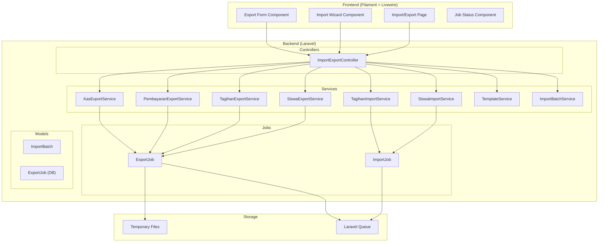
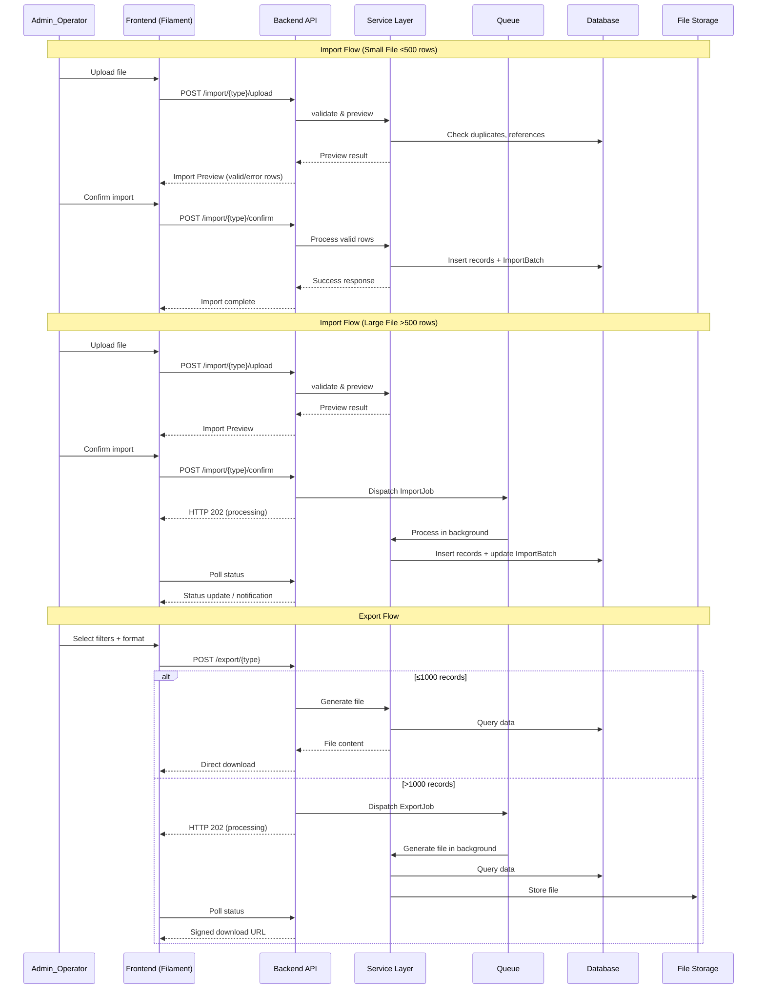
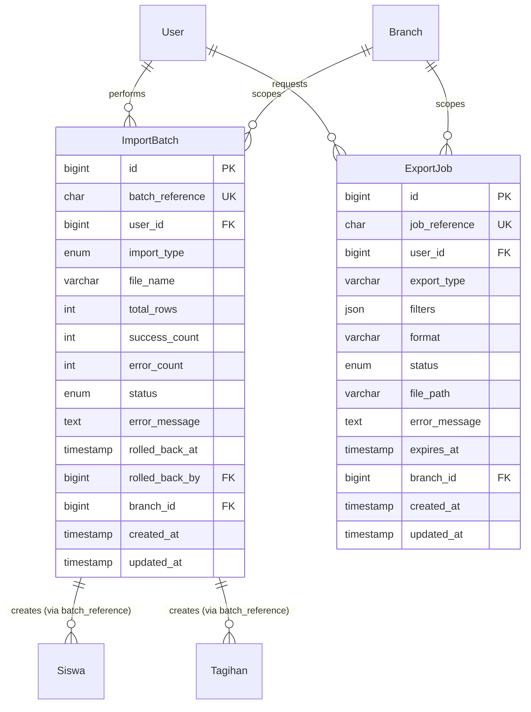

# Design Document: Import & Export Data

## Overview

Fitur Import & Export Data menyediakan kemampuan operasi bulk data melalui file Excel (.xlsx) dan CSV (.csv) pada sistem manajemen tagihan sekolah. Fitur ini mencakup export data siswa, tagihan, dan pembayaran dengan filter; import data siswa dan tagihan dengan validasi dan preview; manajemen template import; riwayat dan rollback import; serta pemrosesan file besar via queue.

### Design Goals

1. **Reliability**: Validasi ketat sebelum commit data, rollback capability untuk import yang salah
2. **Performance**: File besar (>500 rows import, >1000 rows export) diproses via queue untuk menghindari timeout
3. **Security**: Semua operasi di-scope ke branch_id user dan dilindungi permission
4. **Usability**: Step-by-step import flow dengan preview, template dengan dropdown validation, notifikasi real-time

### Key Design Decisions

- **Library**: Menggunakan `maatwebsite/excel` (Laravel Excel) untuk operasi import/export karena sudah mature, mendukung queue, chunk processing, dan Excel data validation
- **Queue**: Menggunakan Laravel Queue yang sudah ada (terlihat di composer scripts `queue:listen`)
- **Storage**: File export temporary disimpan di `storage/app/exports` dengan signed URL valid 24 jam
- **Batch Tracking**: Setiap import menghasilkan `ImportBatch` record dengan UUID `batch_reference` untuk rollback
- **Frontend**: Menggunakan Filament custom pages dengan Livewire components untuk step-by-step flow

## Architecture

### High-Level Architecture



### Request Flow



## Components and Interfaces

### 1. Controllers

#### ImportExportController

Handles all import/export HTTP requests. Single controller with method-based routing.

```php
namespace App\Http\Controllers;

class ImportExportController extends Controller
{
    // Export endpoints
    public function exportSiswa(ExportSiswaRequest $request): JsonResponse|BinaryFileResponse;
    public function exportTagihan(ExportTagihanRequest $request): JsonResponse|BinaryFileResponse;
    public function exportPembayaran(ExportPembayaranRequest $request): JsonResponse|BinaryFileResponse;
    public function exportKasHarian(ExportKasRequest $request): JsonResponse|BinaryFileResponse;
    public function exportRekapBulanan(ExportRekapRequest $request): JsonResponse|BinaryFileResponse;
    
    // Import endpoints
    public function uploadSiswa(ImportUploadRequest $request): JsonResponse;
    public function confirmSiswa(ImportConfirmRequest $request): JsonResponse;
    public function uploadTagihan(ImportUploadRequest $request): JsonResponse;
    public function confirmTagihan(ImportConfirmRequest $request): JsonResponse;
    
    // Template endpoints
    public function templateSiswa(): BinaryFileResponse;
    public function templateTagihan(): BinaryFileResponse;
    
    // Import history & rollback
    public function importHistory(Request $request): JsonResponse;
    public function rollbackImport(string $batchId): JsonResponse;
    
    // Job status
    public function jobStatus(string $jobId): JsonResponse;
}
```

### 2. Service Layer

#### SiswaExportService

```php
namespace App\Services\ImportExport;

class SiswaExportService
{
    public function export(array $filters, string $format, int $branchId): string|BinaryFileResponse;
    public function getRecordCount(array $filters, int $branchId): int;
    public function buildQuery(array $filters, int $branchId): Builder;
}
```

#### TagihanExportService

```php
namespace App\Services\ImportExport;

class TagihanExportService
{
    public function export(array $filters, string $format, int $branchId): string|BinaryFileResponse;
    public function getRecordCount(array $filters, int $branchId): int;
    public function buildQuery(array $filters, int $branchId): Builder;
}
```

#### PembayaranExportService

```php
namespace App\Services\ImportExport;

class PembayaranExportService
{
    public function export(array $filters, string $format, int $branchId): string|BinaryFileResponse;
    public function getRecordCount(array $filters, int $branchId): int;
    public function buildQuery(array $filters, int $branchId): Builder;
}
```

#### KasExportService

```php
namespace App\Services\ImportExport;

class KasExportService
{
    public function exportKasHarian(int $bulan, int $tahun, string $format, int $branchId): string|BinaryFileResponse;
    public function exportRekapBulanan(int $tahun, string $format, int $branchId): string|BinaryFileResponse;
    public function getRecordCount(int $bulan, int $tahun, int $branchId): int;
}
```

#### SiswaImportService

```php
namespace App\Services\ImportExport;

class SiswaImportService
{
    public function validate(UploadedFile $file, int $branchId): ImportPreviewDTO;
    public function confirm(string $previewId, int $branchId, int $userId): ImportBatch;
    public function processInBackground(string $previewId, int $branchId, int $userId): ImportBatch;
}
```

#### TagihanImportService

```php
namespace App\Services\ImportExport;

class TagihanImportService
{
    public function validate(UploadedFile $file, int $branchId): ImportPreviewDTO;
    public function confirm(string $previewId, int $branchId, int $userId): ImportBatch;
    public function processInBackground(string $previewId, int $branchId, int $userId): ImportBatch;
}
```

#### TemplateService

```php
namespace App\Services\ImportExport;

class TemplateService
{
    public function generateSiswaTemplate(int $branchId): BinaryFileResponse;
    public function generateTagihanTemplate(int $branchId): BinaryFileResponse;
}
```

#### ImportBatchService

```php
namespace App\Services\ImportExport;

class ImportBatchService
{
    public function getHistory(int $branchId, int $perPage = 15): LengthAwarePaginator;
    public function rollback(string $batchId, int $branchId, int $userId): bool;
    public function canRollback(ImportBatch $batch): array; // ['allowed' => bool, 'reason' => string]
    public function updateStatus(string $batchId, string $status, ?string $errorMessage = null): void;
}
```

### 3. Data Transfer Objects (DTOs)

```php
namespace App\DTOs\ImportExport;

class ImportPreviewDTO
{
    public string $previewId;       // UUID untuk referensi session
    public int $totalRows;
    public int $validRows;
    public int $errorRows;
    public array $errors;           // [{row: int, column: string, message: string}]
    public array $validData;        // Parsed valid rows (stored in cache)
    public bool $requiresQueue;     // true if >500 rows
}

class ExportFilterDTO
{
    public ?string $jenjang;
    public ?int $kelasId;
    public ?string $status;
    public ?int $tahunAjaranId;
    public ?string $tanggalMulai;
    public ?string $tanggalSelesai;
    public ?int $bulan;
    public ?int $tahun;
    public string $format;          // 'xlsx' or 'csv'
}
```

### 4. Queue Jobs

#### ProcessImportJob

```php
namespace App\Jobs;

class ProcessImportJob implements ShouldQueue
{
    use Dispatchable, InteractsWithQueue, Queueable, SerializesModels;
    
    public int $tries = 3;
    public int $timeout = 300; // 5 minutes
    
    public function __construct(
        private string $previewId,
        private string $importType,  // 'siswa' or 'tagihan'
        private int $branchId,
        private int $userId,
        private string $batchId,
    ) {}
    
    public function handle(): void;
    public function failed(\Throwable $exception): void;
}
```

#### ProcessExportJob

```php
namespace App\Jobs;

class ProcessExportJob implements ShouldQueue
{
    use Dispatchable, InteractsWithQueue, Queueable, SerializesModels;
    
    public int $tries = 3;
    public int $timeout = 600; // 10 minutes
    
    public function __construct(
        private string $exportType,  // 'siswa', 'tagihan', 'pembayaran', 'kas_harian', 'rekap_bulanan'
        private array $filters,
        private string $format,
        private int $branchId,
        private string $jobReferenceId,
    ) {}
    
    public function handle(): void;
    public function failed(\Throwable $exception): void;
}
```

### 5. Laravel Excel Classes

#### Exports

```php
namespace App\Exports;

class SiswaExport implements FromQuery, WithHeadings, WithMapping, WithChunkReading
{
    public function __construct(private Builder $query) {}
    public function query(): Builder;
    public function headings(): array;
    public function map($siswa): array;
    public function chunkSize(): int; // 500
}

class TagihanExport implements FromQuery, WithHeadings, WithMapping, WithChunkReading
{
    public function __construct(private Builder $query) {}
    public function query(): Builder;
    public function headings(): array;
    public function map($tagihan): array;
    public function chunkSize(): int; // 500
}

class PembayaranExport implements FromQuery, WithHeadings, WithMapping, WithChunkReading
{
    public function __construct(private Builder $query) {}
    public function query(): Builder;
    public function headings(): array;
    public function map($pembayaran): array;
    public function chunkSize(): int; // 500
}

class KasHarianExport implements WithMultipleSheets
{
    public function sheets(): array; // [RingkasanSheet, PemasukanSheet, PengeluaranSheet]
}

class RekapBulananExport implements WithMultipleSheets
{
    public function sheets(): array; // [RingkasanSheet, PemasukanSheet, PengeluaranSheet]
}
```

#### Imports (Validation)

```php
namespace App\Imports;

class SiswaImportValidator implements ToCollection, WithHeadingRow, WithValidation
{
    private array $validRows = [];
    private array $errors = [];
    
    public function collection(Collection $rows): void;
    public function rules(): array;
    public function getValidRows(): array;
    public function getErrors(): array;
}

class TagihanImportValidator implements ToCollection, WithHeadingRow, WithValidation
{
    private array $validRows = [];
    private array $errors = [];
    
    public function collection(Collection $rows): void;
    public function rules(): array;
    public function getValidRows(): array;
    public function getErrors(): array;
}
```

#### Templates

```php
namespace App\Exports;

class SiswaImportTemplate implements FromArray, WithHeadings, WithDataValidation, WithStyles
{
    public function __construct(private int $branchId) {}
    public function array(): array;           // Example row
    public function headings(): array;
    public function dataValidation(): array;  // Dropdown validations
    public function styles(Worksheet $sheet): array;
}

class TagihanImportTemplate implements FromArray, WithHeadings, WithDataValidation, WithMultipleSheets
{
    public function __construct(private int $branchId) {}
    public function sheets(): array; // [MainSheet, ReferenceSheet]
}
```

### 6. Form Requests

```php
namespace App\Http\Requests;

class ImportUploadRequest extends FormRequest
{
    public function rules(): array
    {
        return [
            'file' => ['required', 'file', 'mimes:xlsx,csv', 'max:5120'], // 5MB
        ];
    }
}

class ImportConfirmRequest extends FormRequest
{
    public function rules(): array
    {
        return [
            'preview_id' => ['required', 'string', 'uuid'],
        ];
    }
}

class ExportSiswaRequest extends FormRequest
{
    public function rules(): array
    {
        return [
            'format' => ['required', 'in:xlsx,csv'],
            'jenjang' => ['nullable', 'in:TK,MI,KB'],
            'kelas_id' => ['nullable', 'integer', 'exists:kelas,id'],
            'status' => ['nullable', 'in:Aktif,Lulus,Pindah,Keluar'],
            'tahun_ajaran_id' => ['nullable', 'integer'],
        ];
    }
}

class ExportTagihanRequest extends FormRequest
{
    public function rules(): array
    {
        return [
            'format' => ['required', 'in:xlsx,csv'],
            'tahun_ajaran_id' => ['nullable', 'integer'],
            'jenjang' => ['nullable', 'in:TK,MI,KB'],
            'kelas_id' => ['nullable', 'integer', 'exists:kelas,id'],
            'status' => ['nullable', 'in:Lunas,Belum Lunas,Belum Dibayar'],
        ];
    }
}

class ExportPembayaranRequest extends FormRequest
{
    public function rules(): array
    {
        return [
            'format' => ['required', 'in:xlsx,csv'],
            'tahun_ajaran_id' => ['nullable', 'integer'],
            'tanggal_mulai' => ['nullable', 'date', 'date_format:Y-m-d'],
            'tanggal_selesai' => ['nullable', 'date', 'date_format:Y-m-d', 'after_or_equal:tanggal_mulai'],
        ];
    }
}

class ExportKasRequest extends FormRequest
{
    public function rules(): array
    {
        return [
            'format' => ['required', 'in:xlsx,csv'],
            'bulan' => ['required', 'integer', 'between:1,12'],
            'tahun' => ['required', 'integer', 'digits:4'],
        ];
    }
}

class ExportRekapRequest extends FormRequest
{
    public function rules(): array
    {
        return [
            'format' => ['required', 'in:xlsx,csv'],
            'tahun' => ['required', 'integer', 'digits:4'],
        ];
    }
}
```

### 7. Middleware & Permission

```php
// New permissions to register
'import-data'  // For all import operations
'export-data'  // For all export operations

// Route middleware
Route::middleware(['auth:sanctum'])->prefix('import-export')->group(function () {
    // Export routes - require 'export-data' permission
    Route::middleware(['permission:export-data'])->group(function () {
        Route::post('/export/siswa', [ImportExportController::class, 'exportSiswa']);
        Route::post('/export/tagihan', [ImportExportController::class, 'exportTagihan']);
        Route::post('/export/pembayaran', [ImportExportController::class, 'exportPembayaran']);
        Route::post('/export/kas-harian', [ImportExportController::class, 'exportKasHarian']);
        Route::post('/export/rekap-bulanan', [ImportExportController::class, 'exportRekapBulanan']);
    });
    
    // Import routes - require 'import-data' permission
    Route::middleware(['permission:import-data'])->group(function () {
        Route::post('/import/siswa/upload', [ImportExportController::class, 'uploadSiswa']);
        Route::post('/import/siswa/confirm', [ImportExportController::class, 'confirmSiswa']);
        Route::post('/import/tagihan/upload', [ImportExportController::class, 'uploadTagihan']);
        Route::post('/import/tagihan/confirm', [ImportExportController::class, 'confirmTagihan']);
        Route::get('/import/template/siswa', [ImportExportController::class, 'templateSiswa']);
        Route::get('/import/template/tagihan', [ImportExportController::class, 'templateTagihan']);
        Route::get('/import/history', [ImportExportController::class, 'importHistory']);
        Route::post('/import/{batchId}/rollback', [ImportExportController::class, 'rollbackImport']);
    });
    
    // Job status - either permission
    Route::get('/job/{jobId}/status', [ImportExportController::class, 'jobStatus']);
});
```

## Data Models

### New Database Tables

#### import_batches

```sql
CREATE TABLE import_batches (
    id BIGINT UNSIGNED AUTO_INCREMENT PRIMARY KEY,
    batch_reference CHAR(36) NOT NULL UNIQUE,  -- UUID
    user_id BIGINT UNSIGNED NOT NULL,
    import_type ENUM('siswa', 'tagihan') NOT NULL,
    file_name VARCHAR(255) NOT NULL,
    total_rows INT UNSIGNED NOT NULL DEFAULT 0,
    success_count INT UNSIGNED NOT NULL DEFAULT 0,
    error_count INT UNSIGNED NOT NULL DEFAULT 0,
    status ENUM('processing', 'completed', 'failed', 'rolled_back') NOT NULL DEFAULT 'processing',
    error_message TEXT NULL,
    rolled_back_at TIMESTAMP NULL,
    rolled_back_by BIGINT UNSIGNED NULL,
    branch_id BIGINT UNSIGNED NOT NULL,
    created_at TIMESTAMP NULL,
    updated_at TIMESTAMP NULL,
    
    FOREIGN KEY (user_id) REFERENCES users(id) ON UPDATE CASCADE,
    FOREIGN KEY (rolled_back_by) REFERENCES users(id) ON UPDATE CASCADE,
    FOREIGN KEY (branch_id) REFERENCES branches(id) ON UPDATE CASCADE,
    INDEX idx_branch_created (branch_id, created_at)
);
```

#### export_jobs

```sql
CREATE TABLE export_jobs (
    id BIGINT UNSIGNED AUTO_INCREMENT PRIMARY KEY,
    job_reference CHAR(36) NOT NULL UNIQUE,  -- UUID
    user_id BIGINT UNSIGNED NOT NULL,
    export_type VARCHAR(50) NOT NULL,  -- 'siswa', 'tagihan', 'pembayaran', 'kas_harian', 'rekap_bulanan'
    filters JSON NULL,
    format VARCHAR(10) NOT NULL,  -- 'xlsx' or 'csv'
    status ENUM('processing', 'completed', 'failed') NOT NULL DEFAULT 'processing',
    file_path VARCHAR(500) NULL,
    error_message TEXT NULL,
    expires_at TIMESTAMP NULL,  -- signed URL expiry (24h)
    branch_id BIGINT UNSIGNED NOT NULL,
    created_at TIMESTAMP NULL,
    updated_at TIMESTAMP NULL,
    
    FOREIGN KEY (user_id) REFERENCES users(id) ON UPDATE CASCADE,
    FOREIGN KEY (branch_id) REFERENCES branches(id) ON UPDATE CASCADE,
    INDEX idx_branch_status (branch_id, status)
);
```

### Modified Tables

#### siswas (add batch_reference column)

```sql
ALTER TABLE siswas ADD COLUMN batch_reference CHAR(36) NULL AFTER branch_id;
ALTER TABLE siswas ADD INDEX idx_batch_reference (batch_reference);
```

#### tagihans (add batch_reference column)

```sql
ALTER TABLE tagihans ADD COLUMN batch_reference CHAR(36) NULL;
ALTER TABLE tagihans ADD INDEX idx_batch_reference (batch_reference);
```

### New Models

```php
namespace App\Models;

class ImportBatch extends Model
{
    protected $table = 'import_batches';
    protected $fillable = [
        'batch_reference', 'user_id', 'import_type', 'file_name',
        'total_rows', 'success_count', 'error_count', 'status',
        'error_message', 'rolled_back_at', 'rolled_back_by', 'branch_id',
    ];
    protected $casts = [
        'total_rows' => 'integer',
        'success_count' => 'integer',
        'error_count' => 'integer',
        'rolled_back_at' => 'datetime',
    ];
    
    public function user() { return $this->belongsTo(User::class); }
    public function rolledBackByUser() { return $this->belongsTo(User::class, 'rolled_back_by'); }
    public function branch() { return $this->belongsTo(Branch::class); }
    
    public function isRollbackEligible(): bool
    {
        return $this->status === 'completed' 
            && $this->created_at->diffInHours(now()) <= 48;
    }
}

class ExportJob extends Model
{
    protected $table = 'export_jobs';
    protected $fillable = [
        'job_reference', 'user_id', 'export_type', 'filters',
        'format', 'status', 'file_path', 'error_message',
        'expires_at', 'branch_id',
    ];
    protected $casts = [
        'filters' => 'array',
        'expires_at' => 'datetime',
    ];
    
    public function user() { return $this->belongsTo(User::class); }
    public function branch() { return $this->belongsTo(Branch::class); }
    
    public function getSignedUrl(): ?string
    {
        if (!$this->file_path || $this->status !== 'completed') return null;
        return URL::temporarySignedRoute('export.download', $this->expires_at, ['path' => $this->file_path]);
    }
}
```

### Entity Relationship Diagram




## Correctness Properties

*A property is a characteristic or behavior that should hold true across all valid executions of a system—essentially, a formal statement about what the system should do. Properties serve as the bridge between human-readable specifications and machine-verifiable correctness guarantees.*

### Property 1: Branch Isolation

*For any* import or export operation performed by a user with branch_id B, all records in the output (export) or created records (import) SHALL belong exclusively to branch_id B, and no records from other branches shall be included or affected.

**Validates: Requirements 1.4, 4.4, 7.5, 8.7, 12.5, 12.6**

### Property 2: Export Filter Correctness

*For any* export request with a set of filter parameters (including the empty set), every record in the exported file SHALL match ALL specified filter criteria, and no record matching all criteria shall be excluded from the output.

**Validates: Requirements 1.2, 1.3, 4.2, 7.2**

### Property 3: Export Data Mapping Integrity

*For any* exported record, the values in each column SHALL exactly correspond to the source database record's field values (with proper relationship resolution for joined fields like nama_siswa, jenis_tagihan nama, kelas nama), and all required columns SHALL be present in the output.

**Validates: Requirements 1.1, 4.1, 7.1**

### Property 4: Import File Validation

*For any* uploaded file, the Import_Service SHALL accept the file if and only if its extension is .xlsx or .csv AND its size is ≤5MB. Files failing either condition SHALL be rejected with an appropriate error message.

**Validates: Requirements 2.1, 2.2, 5.1, 5.2**

### Property 5: Import Row Validation Correctness

*For any* row in an import file, the Import_Service SHALL mark the row as invalid if and only if it violates at least one validation rule (missing required fields, invalid format, non-existent reference, or duplicate key), and the error detail SHALL correctly identify the row number, column, and specific violation.

**Validates: Requirements 2.3, 2.4, 2.5, 5.3, 5.4**

### Property 6: Import Preview Count Invariant

*For any* import preview result, the equation `total_rows = valid_rows + error_rows` SHALL always hold, and the count of items in the error details list SHALL equal error_rows.

**Validates: Requirements 2.8, 5.5**

### Property 7: Import Confirm Inserts Only Valid Rows

*For any* confirmed import operation, the number of records created in the database SHALL equal the valid_rows count from the preview, each created record SHALL have the correct branch_id from the authenticated user, and no invalid row data shall be persisted.

**Validates: Requirements 2.9, 5.6**

### Property 8: Import Batch Metadata Accuracy

*For any* completed import operation, the ImportBatch record SHALL accurately reflect: the actual number of rows processed (total_rows), the actual number of successfully created records (success_count), the actual number of rejected rows (error_count), and success_count + error_count SHALL equal total_rows.

**Validates: Requirements 2.11, 5.8, 9.1**

### Property 9: Rollback Completeness

*For any* rollback operation on an eligible ImportBatch, ALL records with the matching batch_reference SHALL be deleted, and NO records with a different batch_reference or null batch_reference shall be affected. After rollback, the count of records with that batch_reference SHALL be zero.

**Validates: Requirements 10.1, 10.6**

### Property 10: Rollback Eligibility

*For any* ImportBatch, rollback SHALL be allowed if and only if: status is "completed" AND created_at is within 48 hours of the current time AND no dependent records exist (no tagihan for imported siswa, no pembayaran for imported tagihan).

**Validates: Requirements 10.2, 10.3, 10.4, 10.5**

### Property 11: Permission Enforcement

*For any* API request to an import or export endpoint, the request SHALL succeed only if the authenticated user possesses the corresponding permission ("import-data" for import operations, "export-data" for export operations). Requests without the required permission SHALL receive an HTTP 403 response.

**Validates: Requirements 12.2, 12.3, 12.7**

### Property 12: Queue Threshold Correctness

*For any* import operation with more than 500 rows, the system SHALL dispatch a queue job (returning HTTP 202). For any export operation with more than 1000 records, the system SHALL dispatch a queue job (returning HTTP 202). Operations at or below the threshold SHALL be processed synchronously.

**Validates: Requirements 1.9, 1.10, 4.7, 7.8, 8.10, 11.1, 11.2**

### Property 13: Kas Export Aggregation Consistency

*For any* kas harian or rekap bulanan export, the summary totals (total_pemasukan, total_pengeluaran) SHALL equal the sum of individual records in the detail sections, and every detail record SHALL fall within the specified date/month filter range.

**Validates: Requirements 8.5, 8.6**

### Property 14: Import History Branch Scoping and Ordering

*For any* import history query by a user with branch_id B, all returned ImportBatch records SHALL belong to branch_id B, and records SHALL be sorted by created_at in descending order (newest first).

**Validates: Requirements 9.2**

## Error Handling

### Import Errors

| Error Scenario | HTTP Code | Response | Recovery |
|---|---|---|---|
| Invalid file extension | 422 | `{"errors": {"file": ["Format file harus .xlsx atau .csv"]}}` | Upload file dengan format yang benar |
| File too large (>5MB) | 422 | `{"errors": {"file": ["Ukuran file maksimal 5MB"]}}` | Kompres atau pecah file |
| No Periode_Aktif | 422 | `{"errors": {"message": ["Periode aktif belum diatur untuk cabang ini"]}}` | Set periode aktif terlebih dahulu |
| Validation errors in rows | 200 | Import Preview with error details | Perbaiki file dan upload ulang |
| Queue job failure (after 3 retries) | - | ImportBatch status → "failed", error_message stored | Retry manual atau hubungi admin |
| Preview session expired | 422 | `{"errors": {"preview_id": ["Sesi preview telah kedaluwarsa"]}}` | Upload ulang file |

### Export Errors

| Error Scenario | HTTP Code | Response | Recovery |
|---|---|---|---|
| No data matching filters | 200 | Empty file with headers only | Ubah filter |
| Queue job failure | - | ExportJob status → "failed", error_message stored | Retry export |
| Signed URL expired (>24h) | 403 | `{"errors": {"message": ["Link download telah kedaluwarsa"]}}` | Request export ulang |

### Rollback Errors

| Error Scenario | HTTP Code | Response | Recovery |
|---|---|---|---|
| Batch not found | 404 | `{"errors": {"message": ["Import batch tidak ditemukan"]}}` | Periksa batch ID |
| Batch older than 48 hours | 422 | `{"errors": {"message": ["Batas waktu rollback (48 jam) telah terlewati"]}}` | Hapus manual |
| Siswa has subsequent tagihan | 422 | `{"errors": {"message": ["Tidak dapat rollback: siswa dengan NIS berikut memiliki tagihan: ..."]}}` | Hapus tagihan terlebih dahulu |
| Tagihan has pembayaran | 422 | `{"errors": {"message": ["Tidak dapat rollback: tagihan berikut memiliki pembayaran: ..."]}}` | Hapus pembayaran terlebih dahulu |
| Batch not in "completed" status | 422 | `{"errors": {"message": ["Hanya import dengan status 'completed' yang dapat di-rollback"]}}` | - |

### Permission Errors

| Error Scenario | HTTP Code | Response |
|---|---|---|
| Missing import-data permission | 403 | `{"errors": {"message": ["Anda tidak memiliki izin untuk melakukan operasi import"]}}` |
| Missing export-data permission | 403 | `{"errors": {"message": ["Anda tidak memiliki izin untuk melakukan operasi export"]}}` |

### Transient Error Handling

- **Database deadlocks**: Import confirm uses database transactions; on deadlock, retry up to 3 times with exponential backoff
- **File system errors**: Export jobs retry 3 times; on final failure, mark job as failed
- **Memory limits**: Chunk processing (500 rows per chunk for import, 500 rows per chunk for export) prevents memory exhaustion
- **Cache expiry**: Import preview data cached for 1 hour; expired previews require re-upload

## Testing Strategy

### Testing Approach

This feature uses a **dual testing approach**:
- **Property-based tests**: Verify universal correctness properties across randomized inputs (14 properties)
- **Unit tests**: Verify specific examples, edge cases, and integration points
- **Integration tests**: Verify queue processing, file I/O, and external service interactions

### Property-Based Testing

**Library**: [phpunit/phpunit](https://phpunit.de/) with custom data providers generating randomized inputs (PHP does not have a mature PBT library like QuickCheck, so we use parameterized tests with Faker-generated data at 100+ iterations).

**Alternative**: Use `innmind/black-box` for true property-based testing in PHP if available, otherwise implement custom property test harness using PHPUnit data providers with `fakerphp/faker`.

**Configuration**:
- Minimum 100 iterations per property test
- Each test tagged with property reference comment
- Tag format: `/** Feature: import-export-data, Property {number}: {title} */`

### Test Categories

#### Property Tests (100+ iterations each)

| Property | Test Class | Focus |
|---|---|---|
| P1: Branch Isolation | `BranchIsolationPropertyTest` | Multi-branch data generation, verify no cross-branch leaks |
| P2: Export Filter Correctness | `ExportFilterPropertyTest` | Random filter combinations, verify all results match |
| P3: Export Data Mapping | `ExportMappingPropertyTest` | Random records, verify column values match source |
| P4: Import File Validation | `ImportFileValidationPropertyTest` | Random extensions and sizes, verify accept/reject |
| P5: Import Row Validation | `ImportRowValidationPropertyTest` | Random row data, verify correct error detection |
| P6: Preview Count Invariant | `PreviewCountPropertyTest` | Random import files, verify count equation |
| P7: Confirm Valid Rows Only | `ImportConfirmPropertyTest` | Mixed valid/invalid rows, verify DB state |
| P8: Batch Metadata Accuracy | `BatchMetadataPropertyTest` | Random imports, verify counts match reality |
| P9: Rollback Completeness | `RollbackCompletenessPropertyTest` | Create batch, rollback, verify deletion |
| P10: Rollback Eligibility | `RollbackEligibilityPropertyTest` | Various batch states/ages, verify eligibility |
| P11: Permission Enforcement | `PermissionPropertyTest` | Random users with/without permissions, verify access |
| P12: Queue Threshold | `QueueThresholdPropertyTest` | Random row counts around thresholds |
| P13: Kas Aggregation | `KasAggregationPropertyTest` | Random financial data, verify sum consistency |
| P14: History Ordering | `ImportHistoryPropertyTest` | Random batches, verify sort and branch scope |

#### Unit Tests (Example-Based)

- Template generation (correct headers, dropdowns, example data)
- File format validation (xlsx structure, csv encoding)
- Specific error message formatting
- Kode_tagihan auto-generation logic
- Date range boundary handling

#### Integration Tests

- Queue job dispatch and completion flow
- File storage and signed URL generation
- Periode_Aktif resolution
- Full import flow (upload → preview → confirm)
- Full export flow (request → queue → download)

#### Edge Case Tests

- Exactly 500/501 rows for import threshold
- Exactly 1000/1001 records for export threshold
- File exactly at 5MB boundary
- Import with all rows invalid
- Import with all rows valid
- Rollback at exactly 48 hours boundary
- Empty export (no matching records)
- Unicode/special characters in data
