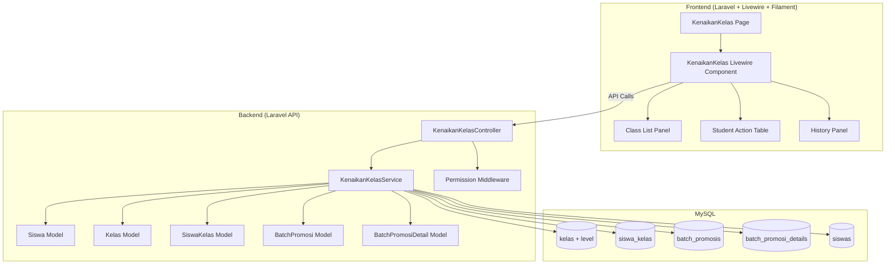
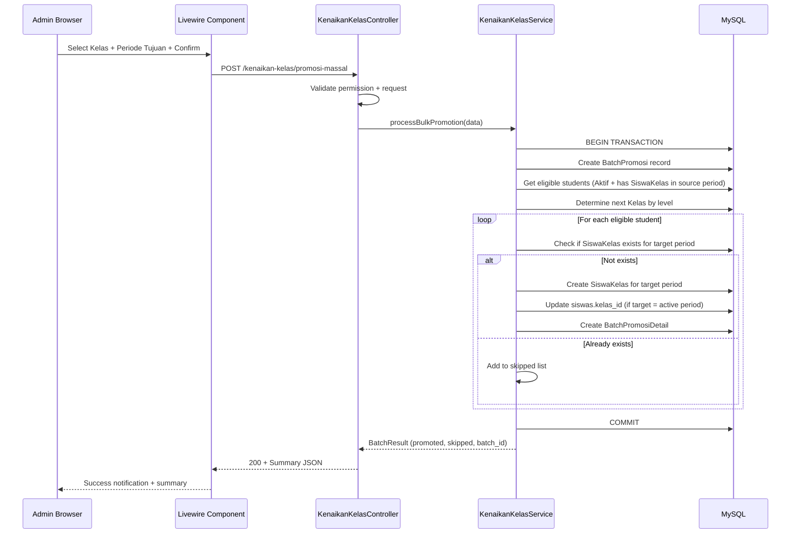
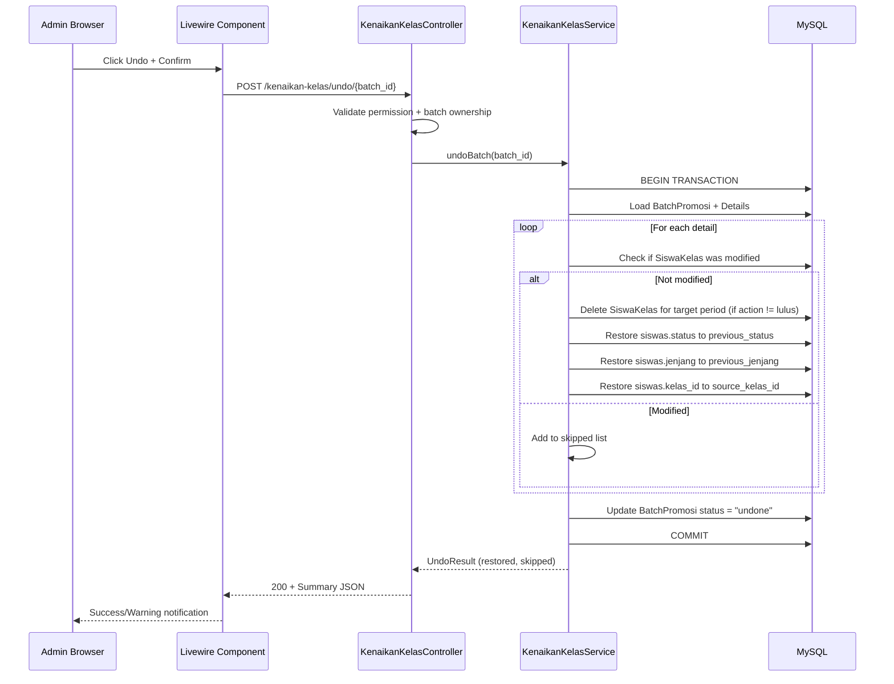
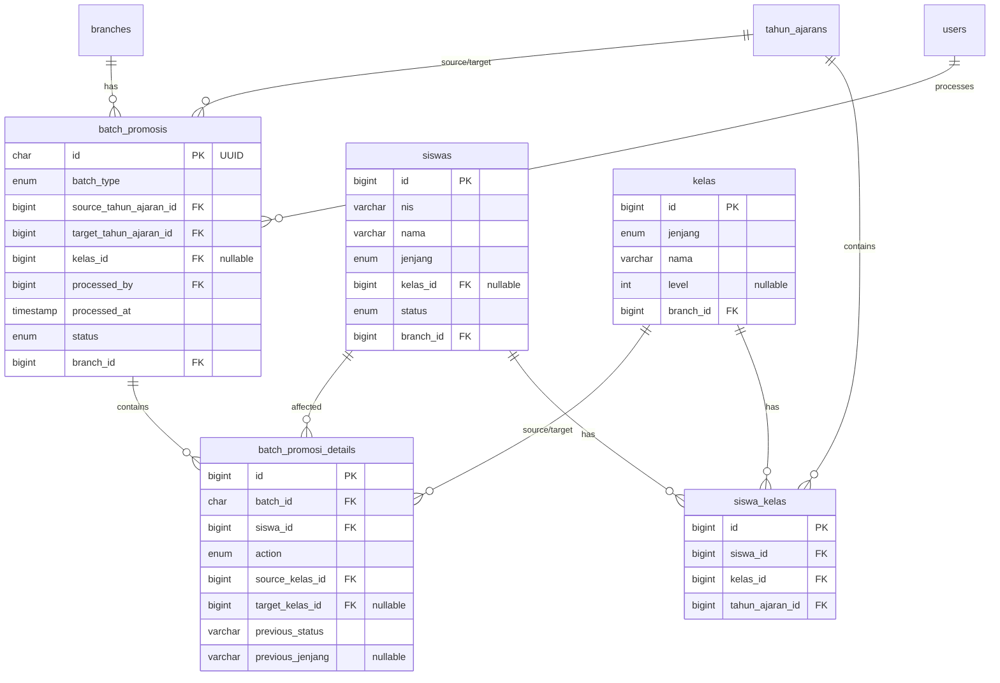

# Design Document: Kenaikan Kelas & Kelulusan

## Overview

Fitur ini mengimplementasikan proses **Kenaikan Kelas** (promosi siswa ke kelas berikutnya) dan **Kelulusan** (siswa menyelesaikan jenjang pendidikan) pada akhir setiap periode tahun ajaran. Desain ini mencakup:

1. **Konfigurasi Hierarki Kelas** — Menambahkan atribut `level` pada tabel `kelas` untuk menentukan urutan kelas dalam jenjang
2. **Promosi Massal (Bulk)** — Memindahkan seluruh siswa aktif dalam satu kelas ke kelas berikutnya
3. **Promosi Individual** — Memindahkan siswa tertentu ke kelas custom (akselerasi, pindahan)
4. **Kelulusan** — Mengubah status siswa di kelas tertinggi menjadi "Lulus"
5. **Tinggal Kelas** — Mempertahankan siswa di kelas yang sama pada periode baru
6. **Pindah Jenjang** — Memindahkan siswa lulusan ke jenjang berikutnya (KB→TK, TK→MI)
7. **Undo/Rollback** — Membatalkan batch operasi yang sudah dijalankan
8. **Audit Trail** — Mencatat setiap batch operasi beserta detailnya untuk traceability

### Key Design Decisions

1. **Single batch endpoint per operation type** — Setiap tipe operasi (promosi, kelulusan, tinggal kelas, pindah jenjang) memiliki endpoint terpisah. Ini menyederhanakan validasi dan error handling per tipe.

2. **Unified Batch_Promosi tracking** — Semua operasi (termasuk individual) dicatat dalam satu tabel `batch_promosis` dengan detail di `batch_promosi_details`. Ini memungkinkan undo yang konsisten untuk semua tipe operasi.

3. **Level-based hierarchy** — Menggunakan integer `level` pada tabel `kelas` untuk menentukan urutan, bukan relasi parent-child. Ini lebih fleksibel dan mudah dikonfigurasi oleh admin.

4. **Skip-on-conflict strategy** — Saat bulk operation menemukan siswa yang sudah memiliki penempatan di periode tujuan atau data yang sudah dimodifikasi manual, sistem akan skip siswa tersebut dan melanjutkan proses. Ini mencegah satu konflik menggagalkan seluruh batch.

5. **Denormalized kelas_id sync** — `siswas.kelas_id` tetap di-sync saat operasi menargetkan Periode_Aktif, menjaga backward compatibility dengan fitur lain yang membaca `kelas_id` langsung.

6. **UUID for batch identification** — Menggunakan UUID untuk `batch_promosis.id` agar mudah di-reference di frontend dan tidak predictable.

7. **Frontend sebagai orchestrator** — Frontend mengirim satu request batch ke backend yang berisi semua aksi per kelas. Backend memproses dalam satu transaksi.

## Architecture



### Request Flow — Bulk Promotion



### Request Flow — Undo Batch



## Components and Interfaces

### Backend Components

#### 1. `KenaikanKelasController` — New Controller

**Routes:**
| Method | URI | Action | Middleware |
|--------|-----|--------|-----------|
| POST | /kenaikan-kelas/promosi-massal | bulkPromotion | auth:sanctum, permission:manage-kenaikan-kelas |
| POST | /kenaikan-kelas/promosi-individual | individualPromotion | auth:sanctum, permission:manage-kenaikan-kelas |
| POST | /kenaikan-kelas/kelulusan | graduation | auth:sanctum, permission:manage-kenaikan-kelas |
| POST | /kenaikan-kelas/tinggal-kelas | retention | auth:sanctum, permission:manage-kenaikan-kelas |
| POST | /kenaikan-kelas/pindah-jenjang | crossLevelTransfer | auth:sanctum, permission:manage-kenaikan-kelas |
| POST | /kenaikan-kelas/undo/{batchId} | undo | auth:sanctum, permission:manage-kenaikan-kelas |
| GET | /kenaikan-kelas/batches | listBatches | auth:sanctum, permission:manage-kenaikan-kelas |
| GET | /kenaikan-kelas/batches/{batchId} | showBatch | auth:sanctum, permission:manage-kenaikan-kelas |
| GET | /kenaikan-kelas/eligible-students | eligibleStudents | auth:sanctum, permission:manage-kenaikan-kelas |
| GET | /kenaikan-kelas/hierarki-kelas | classHierarchy | auth:sanctum, permission:manage-kenaikan-kelas |

**bulkPromotion(BulkPromotionRequest $request):**
- Validate: `kelas_id`, `tahun_ajaran_id` (target period)
- Delegate to `KenaikanKelasService::processBulkPromotion()`
- Return 200 with summary

**individualPromotion(IndividualPromotionRequest $request):**
- Validate: `siswa_id`, `target_kelas_id`, `tahun_ajaran_id`
- Optional: `is_pindah_jenjang` flag (default false)
- Delegate to `KenaikanKelasService::processIndividualPromotion()`
- Return 200 with summary

**graduation(GraduationRequest $request):**
- Validate: `siswa_ids` (array), `tahun_ajaran_id`
- Delegate to `KenaikanKelasService::processGraduation()`
- Return 200 with summary

**retention(RetentionRequest $request):**
- Validate: `siswa_ids` (array), `tahun_ajaran_id`
- Delegate to `KenaikanKelasService::processRetention()`
- Return 200 with summary

**crossLevelTransfer(CrossLevelTransferRequest $request):**
- Validate: `siswa_id`, `target_kelas_id`, `tahun_ajaran_id`
- Delegate to `KenaikanKelasService::processCrossLevelTransfer()`
- Return 200 with summary

**undo($batchId):**
- Validate batch exists, belongs to user's branch, status = "completed"
- Delegate to `KenaikanKelasService::undoBatch()`
- Return 200 with undo summary

#### 2. `KenaikanKelasService` — Service Class

**File:** `app/Services/KenaikanKelasService.php`

Core business logic class that handles all promotion operations.

```php
class KenaikanKelasService
{
    public function processBulkPromotion(int $kelasId, int $tahunAjaranId, int $branchId, int $userId): array;
    public function processIndividualPromotion(int $siswaId, int $targetKelasId, int $tahunAjaranId, int $branchId, int $userId): array;
    public function processGraduation(array $siswaIds, int $tahunAjaranId, int $branchId, int $userId): array;
    public function processRetention(array $siswaIds, int $tahunAjaranId, int $branchId, int $userId): array;
    public function processCrossLevelTransfer(int $siswaId, int $targetKelasId, int $tahunAjaranId, int $branchId, int $userId): array;
    public function undoBatch(string $batchId, int $branchId): array;
    
    // Helper methods
    public function getNextKelas(Kelas $currentKelas): ?Kelas;
    public function isKelastertinggi(Kelas $kelas): bool;
    public function getEligibleStudents(int $kelasId, int $sourceTahunAjaranId): Collection;
    public function validateAllowedTransition(string $fromJenjang, string $toJenjang): bool;
}
```

**Key implementation details:**

- All mutation methods wrap operations in `DB::transaction()`
- Each method creates a `BatchPromosi` record first, then processes individual operations
- Skip logic: students with existing target-period records are added to `$skipped` array
- Sync logic: if target `tahun_ajaran_id` equals the branch's active period, update `siswas.kelas_id`

#### 3. Form Requests

**BulkPromotionRequest:**
```php
public function rules(): array
{
    return [
        'kelas_id' => ['required', 'integer', 'exists:kelas,id'],
        'tahun_ajaran_id' => ['required', 'integer', 'exists:tahun_ajarans,id'],
    ];
}
```

**IndividualPromotionRequest:**
```php
public function rules(): array
{
    return [
        'siswa_id' => ['required', 'integer', 'exists:siswas,id'],
        'target_kelas_id' => ['required', 'integer', 'exists:kelas,id'],
        'tahun_ajaran_id' => ['required', 'integer', 'exists:tahun_ajarans,id'],
        'is_pindah_jenjang' => ['sometimes', 'boolean'],
    ];
}
```

**GraduationRequest:**
```php
public function rules(): array
{
    return [
        'siswa_ids' => ['required', 'array', 'min:1'],
        'siswa_ids.*' => ['integer', 'exists:siswas,id'],
        'tahun_ajaran_id' => ['required', 'integer', 'exists:tahun_ajarans,id'],
    ];
}
```

**RetentionRequest:**
```php
public function rules(): array
{
    return [
        'siswa_ids' => ['required', 'array', 'min:1'],
        'siswa_ids.*' => ['integer', 'exists:siswas,id'],
        'tahun_ajaran_id' => ['required', 'integer', 'exists:tahun_ajarans,id'],
    ];
}
```

**CrossLevelTransferRequest:**
```php
public function rules(): array
{
    return [
        'siswa_id' => ['required', 'integer', 'exists:siswas,id'],
        'target_kelas_id' => ['required', 'integer', 'exists:kelas,id'],
        'tahun_ajaran_id' => ['required', 'integer', 'exists:tahun_ajarans,id'],
    ];
}
```

#### 4. Modified `KelasController`

**Changes:**
- Add `level` field to create/update validation rules
- Add unique validation: `level` must be unique within same `jenjang` + `branch_id`
- Return `level` in `KelasResource`

**Updated KelasRequest rules:**
```php
'level' => ['nullable', 'integer', 'min:1'],
```

Custom validation in controller:
```php
// Validate unique level within jenjang + branch_id
if ($request->level !== null) {
    $exists = Kelas::where('jenjang', $jenjang)
        ->where('branch_id', $branchId)
        ->where('level', $request->level)
        ->where('id', '!=', $kelasId) // exclude self on update
        ->exists();
    if ($exists) {
        return response()->json(['errors' => ['level' => ['Level sudah digunakan oleh kelas lain dalam jenjang ini.']]], 422);
    }
}
```

#### 5. API Response Format

**Success Response (all operations):**
```json
{
    "data": {
        "batch_id": "uuid-string",
        "batch_type": "promosi",
        "total_processed": 25,
        "total_success": 23,
        "total_skipped": 2,
        "skipped": [
            {
                "siswa_id": 5,
                "nama": "Ahmad",
                "nis": "12345",
                "reason": "Sudah memiliki penempatan kelas untuk periode tujuan"
            }
        ]
    }
}
```

**Undo Response:**
```json
{
    "data": {
        "batch_id": "uuid-string",
        "total_restored": 20,
        "total_skipped": 3,
        "skipped": [
            {
                "siswa_id": 8,
                "nama": "Budi",
                "nis": "12346",
                "reason": "Data kelas siswa telah dimodifikasi setelah batch diproses"
            }
        ]
    }
}
```

### Frontend Components

#### 6. `KenaikanKelas` — Livewire Component

**File:** `frontend-v2/app/Livewire/KenaikanKelas.php`

Implements `HasActions`, `HasSchemas`, `HasTable` (Filament traits).

**Properties:**
```php
public ?int $selectedSourcePeriodId = null;  // defaults to Periode_Aktif
public ?int $selectedTargetPeriodId = null;
public ?int $selectedKelasId = null;
public string $activeJenjangTab = 'TK';
public array $studentActions = [];  // [siswa_id => ['action' => 'naik_kelas', 'target_kelas_id' => X]]
public array $kelasList = [];
public array $tahunAjaranOptions = [];
```

**Key Methods:**
- `mount()` — Load tahun ajaran options, set defaults
- `loadKelasList()` — Fetch classes grouped by jenjang with student counts
- `loadStudents()` — Fetch students for selected class with default actions
- `updateStudentAction($siswaId, $action, $targetKelasId)` — Update individual action
- `getSummary()` — Computed property showing counts per action type
- `processAll()` — Send batch request to API, handle response
- `loadHistory()` — Fetch batch history
- `undoBatch($batchId)` — Send undo request

**View sections:**
1. Period selector (source + target dropdowns)
2. Class list panel (grouped by jenjang tabs, showing student counts)
3. Student action table (NIS, Nama, Aksi dropdown, Target Kelas)
4. Summary panel (counts per action type)
5. Process button with confirmation
6. History table with undo buttons

#### 7. Frontend Routing

**File:** `frontend-v2/routes/web.php`

```php
Route::get('/kenaikan-kelas', KenaikanKelas::class)
    ->name('kenaikan-kelas')
    ->middleware(['auth', 'permission:manage-kenaikan-kelas']);
```

**Navigation:** Add menu item in sidebar, visible only when user has `manage-kenaikan-kelas` permission.

## Data Models

### New Tables

#### `batch_promosis`

| Column | Type | Constraints |
|--------|------|-------------|
| id | char(36) | PK, UUID |
| batch_type | enum('promosi','kelulusan','tinggal_kelas','pindah_jenjang') | NOT NULL |
| source_tahun_ajaran_id | bigint unsigned | FK → tahun_ajarans.id, NOT NULL |
| target_tahun_ajaran_id | bigint unsigned | FK → tahun_ajarans.id, NOT NULL |
| kelas_id | bigint unsigned | FK → kelas.id, NULLABLE (null for individual/graduation) |
| processed_by | bigint unsigned | FK → users.id, NOT NULL |
| processed_at | timestamp | NOT NULL |
| status | enum('completed','undone') | NOT NULL, default 'completed' |
| branch_id | bigint unsigned | FK → branches.id, NOT NULL |
| created_at | timestamp | nullable |
| updated_at | timestamp | nullable |

**Indexes:**
- INDEX(branch_id, status) — for listing batches per branch
- INDEX(branch_id, processed_at) — for sorting history

#### `batch_promosi_details`

| Column | Type | Constraints |
|--------|------|-------------|
| id | bigint unsigned | PK, auto-increment |
| batch_id | char(36) | FK → batch_promosis.id, NOT NULL |
| siswa_id | bigint unsigned | FK → siswas.id, NOT NULL |
| action | enum('naik_kelas','lulus','tinggal_kelas','pindah_jenjang') | NOT NULL |
| source_kelas_id | bigint unsigned | FK → kelas.id, NOT NULL |
| target_kelas_id | bigint unsigned | FK → kelas.id, NULLABLE (null for graduation) |
| previous_status | varchar(20) | NOT NULL (siswa status before operation) |
| previous_jenjang | varchar(5) | NULLABLE (siswa jenjang before, for pindah_jenjang) |
| created_at | timestamp | nullable |
| updated_at | timestamp | nullable |

**Indexes:**
- INDEX(batch_id) — for loading batch details
- INDEX(siswa_id) — for looking up student history

### Modified Tables

#### `kelas` — Add Column

| Column | Type | Constraints |
|--------|------|-------------|
| level | integer unsigned | NULLABLE, default NULL |

**New Index:**
- UNIQUE(jenjang, branch_id, level) WHERE level IS NOT NULL — prevents duplicate levels within same jenjang+branch

### Entity Relationship Diagram



### Hierarchy Resolution Logic

```
Jenjang KB: KB (level 1)
Jenjang TK: TK A (level 1) → TK B (level 2)
Jenjang MI: Kelas 1 (level 1) → Kelas 2 (level 2) → ... → Kelas 6 (level 6)
```

**Next class resolution:**
```sql
SELECT * FROM kelas 
WHERE jenjang = :current_jenjang 
  AND branch_id = :branch_id 
  AND level > :current_level 
  AND level IS NOT NULL
ORDER BY level ASC 
LIMIT 1
```

**Highest class identification:**
```sql
SELECT * FROM kelas 
WHERE jenjang = :jenjang 
  AND branch_id = :branch_id 
  AND level IS NOT NULL
ORDER BY level DESC 
LIMIT 1
```

## Correctness Properties

*A property is a characteristic or behavior that should hold true across all valid executions of a system — essentially, a formal statement about what the system should do. Properties serve as the bridge between human-readable specifications and machine-verifiable correctness guarantees.*

### Property 1: Next Class Resolution Correctness

*For any* Kelas with a non-null level that is not the highest level in its jenjang and branch, the `getNextKelas()` function SHALL return the Kelas with the smallest level value that is strictly greater than the current Kelas's level, within the same jenjang and branch_id.

**Validates: Requirements 1.3**

### Property 2: Highest Class Identification

*For any* set of Kelas records within the same jenjang and branch_id (all with non-null levels), the `isKelasTertinggi()` function SHALL return true if and only if the Kelas has the maximum level value among all Kelas in that jenjang and branch_id.

**Validates: Requirements 1.4**

### Property 3: Promotion Rejection for Highest Class

*For any* Siswa assigned to a Kelas_Tertinggi, a bulk or individual promotion attempt (non-pindah-jenjang) SHALL be rejected or the student SHALL be flagged for graduation instead.

**Validates: Requirements 1.5**

### Property 4: Level Uniqueness Within Jenjang and Branch

*For any* two Kelas records with the same jenjang and branch_id, if both have non-null level values, their level values SHALL be different. Attempting to create or update a Kelas with a duplicate level within the same jenjang and branch_id SHALL be rejected with HTTP 422.

**Validates: Requirements 1.6**

### Property 5: Bulk Promotion Creates Correct SiswaKelas Records

*For any* Kelas with N eligible active students (having SiswaKelas in the source period and no SiswaKelas in the target period), after a successful bulk promotion, exactly N new SiswaKelas records SHALL exist for the target period, each pointing to the correct next Kelas in the hierarchy.

**Validates: Requirements 2.1, 2.5**

### Property 6: Kelas ID Synchronization on Active Period Operations

*For any* promotion, retention, or pindah jenjang operation where the target tahun_ajaran_id equals the branch's Periode_Aktif, the `siswas.kelas_id` column SHALL be updated to match the target Kelas. For graduation targeting the active period, `siswas.kelas_id` SHALL be set to NULL.

**Validates: Requirements 2.2, 3.5, 4.4, 5.1, 6.6**

### Property 7: Branch Data Isolation

*For any* kenaikan kelas operation (promotion, graduation, retention, pindah jenjang, undo), all affected Siswa, Kelas, and SiswaKelas records SHALL belong to the same branch_id as the authenticated user. No records from other branches SHALL be read or modified.

**Validates: Requirements 2.6, 3.2, 6.4, 7.8, 8.1, 8.6, 11.5, 11.6**

### Property 8: Skip Students With Existing Target Period Placement

*For any* Siswa who already has a SiswaKelas record for the Periode_Tujuan during a bulk promotion, that Siswa SHALL be skipped (not promoted) and included in the skipped list. The existing SiswaKelas record SHALL remain unchanged.

**Validates: Requirements 2.5**

### Property 9: Individual Promotion Upsert Behavior

*For any* individual promotion or retention request where the Siswa already has a SiswaKelas record for the Periode_Tujuan, the system SHALL update the existing record's kelas_id rather than creating a duplicate. The unique constraint (siswa_id, tahun_ajaran_id) SHALL always be maintained.

**Validates: Requirements 3.4, 5.3**

### Property 10: Graduation State Invariant

*For any* Siswa successfully graduated, the following conditions SHALL all hold: (a) siswas.status = "Lulus", (b) siswas.kelas_id = NULL, (c) no SiswaKelas record exists for that Siswa in the Periode_Tujuan.

**Validates: Requirements 4.1, 4.3, 4.4**

### Property 11: Graduation Eligibility Validation

*For any* Siswa specified for graduation, if the Siswa does not have status "Aktif" OR is not in a Kelas_Tertinggi in the source period, the Siswa SHALL be skipped and included in the skipped list with an appropriate reason.

**Validates: Requirements 4.2, 4.7, 4.8**

### Property 12: Retention Preserves Same Class

*For any* Siswa marked as Tinggal_Kelas, the SiswaKelas record created for the Periode_Tujuan SHALL have the same kelas_id as the Siswa's SiswaKelas record in the source period.

**Validates: Requirements 5.1**

### Property 13: Pindah Jenjang Allowed Transitions Only

*For any* Pindah_Jenjang request, the system SHALL accept the transition if and only if it follows KB→TK or TK→MI. All other jenjang transitions SHALL be rejected with an error.

**Validates: Requirements 6.2, 6.5**

### Property 14: Pindah Jenjang Requires Lulus Status

*For any* Pindah_Jenjang request, the system SHALL validate that the Siswa's current status is "Lulus". If the status is not "Lulus", the request SHALL be rejected.

**Validates: Requirements 6.3**

### Property 15: Undo Restores Original State (Round-Trip)

*For any* Batch_Promosi with status "completed" where no detail records have been manually modified, executing an undo SHALL restore all affected Siswa to their pre-operation state: siswas.status = previous_status, siswas.jenjang = previous_jenjang, siswas.kelas_id = source_kelas_id, and the SiswaKelas records for the target period SHALL be deleted.

**Validates: Requirements 7.3**

### Property 16: Undo Idempotence Guard

*For any* Batch_Promosi with status "undone", attempting to undo it again SHALL be rejected with an error. The batch status and all related data SHALL remain unchanged.

**Validates: Requirements 7.6**

### Property 17: Undo Conflict Detection

*For any* BatchPromosiDetail where the Siswa's current SiswaKelas record for the target period has a kelas_id different from the detail's target_kelas_id, the undo operation SHALL skip that Siswa and include it in the skipped list, while continuing to process remaining details.

**Validates: Requirements 7.7**

### Property 18: Source and Target Period Must Differ

*For any* promotion, graduation, retention, or pindah jenjang request, if the source tahun_ajaran_id equals the target tahun_ajaran_id, the request SHALL be rejected with an error.

**Validates: Requirements 8.2, 8.3**

### Property 19: Permission Enforcement

*For any* request to kenaikan kelas endpoints (promotion, graduation, retention, pindah jenjang, undo, history) from a user without the "manage-kenaikan-kelas" permission, the Backend_API SHALL return HTTP 403 and SHALL NOT modify any data.

**Validates: Requirements 11.2, 11.3**

## Error Handling

### Backend Error Responses

| Scenario | HTTP Status | Response Body |
|----------|-------------|---------------|
| Missing permission | 403 | `{"errors": {"message": ["Anda tidak memiliki izin untuk melakukan operasi ini."]}}` |
| Cross-branch access | 403 | `{"errors": {"message": ["Anda tidak memiliki izin untuk melakukan operasi ini."]}}` |
| Invalid tahun_ajaran_id | 422 | `{"errors": {"tahun_ajaran_id": ["Tahun ajaran tidak ditemukan atau bukan milik branch Anda."]}}` |
| Source = Target period | 422 | `{"errors": {"tahun_ajaran_id": ["Periode tujuan harus berbeda dari periode sumber."]}}` |
| No eligible students | 422 | `{"errors": {"kelas_id": ["Tidak ada siswa yang memenuhi syarat untuk promosi di kelas ini."]}}` |
| Student in highest class (promotion) | 422 | `{"errors": {"siswa_id": ["Siswa berada di kelas tertinggi. Gunakan kelulusan atau pindah jenjang."]}}` |
| Jenjang mismatch (non-pindah) | 422 | `{"errors": {"target_kelas_id": ["Jenjang kelas tujuan harus sama dengan jenjang siswa."]}}` |
| Invalid jenjang transition | 422 | `{"errors": {"target_kelas_id": ["Transisi jenjang tidak valid. Hanya KB→TK dan TK→MI yang diperbolehkan."]}}` |
| Student not Lulus (pindah jenjang) | 422 | `{"errors": {"siswa_id": ["Siswa harus berstatus Lulus untuk pindah jenjang."]}}` |
| Duplicate level in jenjang+branch | 422 | `{"errors": {"level": ["Level sudah digunakan oleh kelas lain dalam jenjang ini."]}}` |
| Batch already undone | 422 | `{"errors": {"batch_id": ["Batch ini sudah dibatalkan sebelumnya."]}}` |
| Batch not found | 404 | `{"errors": {"message": ["Batch tidak ditemukan."]}}` |
| No SiswaKelas in source period | 422 | `{"errors": {"siswa_ids": ["Satu atau lebih siswa tidak memiliki penempatan kelas di periode sumber."]}}` |
| Student not Aktif (graduation) | — | Included in skipped list (not a hard error) |
| Student not in highest class (graduation) | — | Included in skipped list (not a hard error) |
| Server error | 500 | `{"errors": {"message": ["Terjadi kesalahan pada server."]}}` |

### Frontend Error Handling Strategy

1. **Validation errors (422):**
   - Extract error messages from response JSON
   - Display via `Filament\Notifications\Notification::make()->danger()->title($message)->send()`
   - Preserve form state for retry

2. **Permission errors (403):**
   - Display "Anda tidak memiliki izin" notification
   - Should rarely occur since UI hides unauthorized actions via permission check

3. **Partial success (200 with skipped students):**
   - Display success notification with summary
   - If skipped list is non-empty, display additional warning notification listing skipped students and reasons

4. **Network/Server errors (500, timeout):**
   - Display generic "Terjadi kesalahan pada server" notification
   - Preserve form state

5. **Undo conflicts:**
   - Display warning notification listing skipped students
   - Show which students were successfully restored vs skipped

## Testing Strategy

### Property-Based Tests (PHPUnit + Laravel Factories)

**Library:** PHPUnit with Laravel model factories + `Faker` for randomized inputs
**Configuration:** Each property test runs minimum 100 iterations with randomized data

Property-based tests will use loops with factory-generated data to verify universal properties across many inputs. Each test creates randomized class hierarchies, student populations, and operation scenarios.

**Property tests to implement:**

| Property | Test Focus | Key Generators |
|----------|-----------|----------------|
| 1 | Next class resolution | Random class hierarchies with varying levels and gaps |
| 2 | Highest class identification | Random sets of classes per jenjang with varying levels |
| 3 | Promotion rejection for highest class | Random students in highest class, attempt promotion |
| 4 | Level uniqueness validation | Random level assignments, attempt duplicates |
| 5 | Bulk promotion correctness | Random class sizes (1-50 students), verify all get correct placement |
| 6 | Kelas_id sync on active period | Random operations targeting active vs non-active periods |
| 7 | Branch isolation | Multi-branch setups, verify no cross-branch leakage |
| 8 | Skip existing placement | Mix of students with/without target period records |
| 9 | Upsert behavior | Students with existing target records, verify update not duplicate |
| 10 | Graduation state invariant | Random graduation batches, verify all three conditions |
| 11 | Graduation eligibility | Mix of eligible/ineligible students |
| 12 | Retention same class | Random retention batches, verify class preserved |
| 13 | Allowed jenjang transitions | All 9 possible jenjang combinations (3×3) |
| 14 | Pindah jenjang requires Lulus | Students with various statuses |
| 15 | Undo round-trip | Random batches, execute then undo, verify state restored |
| 16 | Undo idempotence guard | Attempt double-undo |
| 17 | Undo conflict detection | Modify records between execute and undo |
| 18 | Source ≠ target period | Same period attempts |
| 19 | Permission enforcement | Requests without permission |

**Tag format:** `Feature: kenaikan-kelas-kelulusan, Property {N}: {title}`

### Unit Tests (Example-Based)

- `KenaikanKelasService::getNextKelas()` — specific hierarchy examples
- `KenaikanKelasService::isKelasTertinggi()` — specific examples
- `KenaikanKelasService::validateAllowedTransition()` — all 9 combinations
- Batch response format validation
- BatchPromosi model: UUID generation, fillable fields, relationships
- BatchPromosiDetail model: fillable fields, relationships
- Form request validation rules (specific valid/invalid inputs)
- Kelas level validation (specific duplicate scenarios)

### Integration Tests

- Full bulk promotion flow: setup → execute → verify DB state
- Full graduation flow: setup → execute → verify status changes
- Full undo flow: execute batch → undo → verify restoration
- Transaction rollback: simulate failure mid-batch, verify no partial data
- Multi-branch isolation: two branches, operations don't cross
- Kelas level migration: verify existing data unaffected
- API endpoint authentication and authorization

### Frontend Tests (Manual/Browser)

- KenaikanKelas page renders correctly with all panels
- Period selector populates and filters correctly
- Class list shows correct student counts per jenjang
- Student action table displays with correct default actions
- Action dropdown changes update summary panel
- Process confirmation dialog shows correct counts
- Success/error notifications display correctly
- History table shows batches sorted by date
- Undo button triggers confirmation and processes correctly
- Permission-based visibility of page and actions
