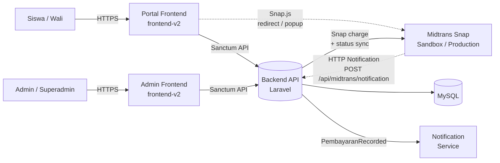
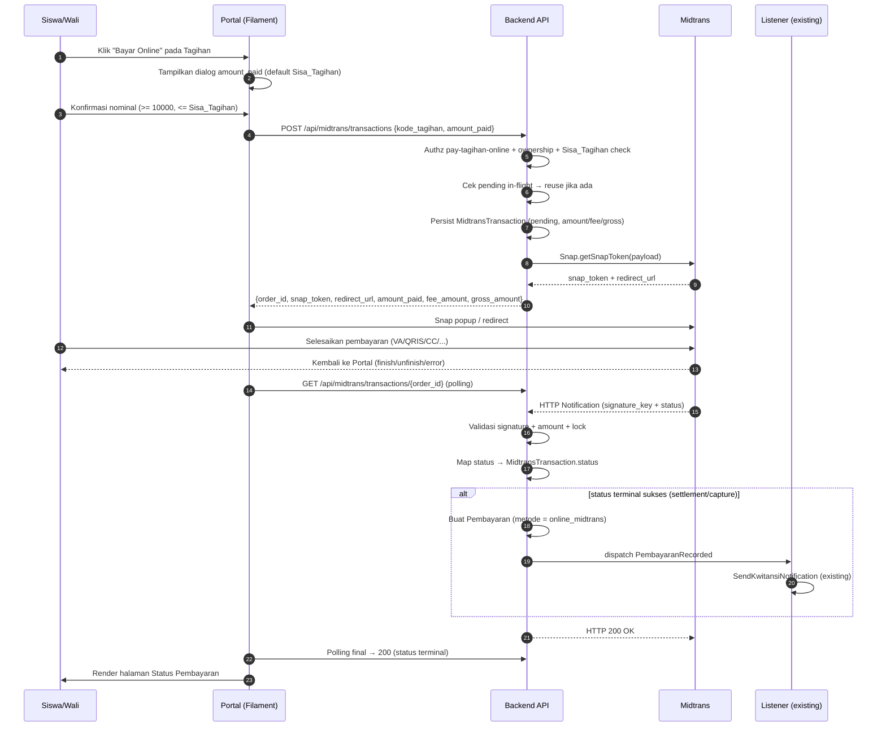
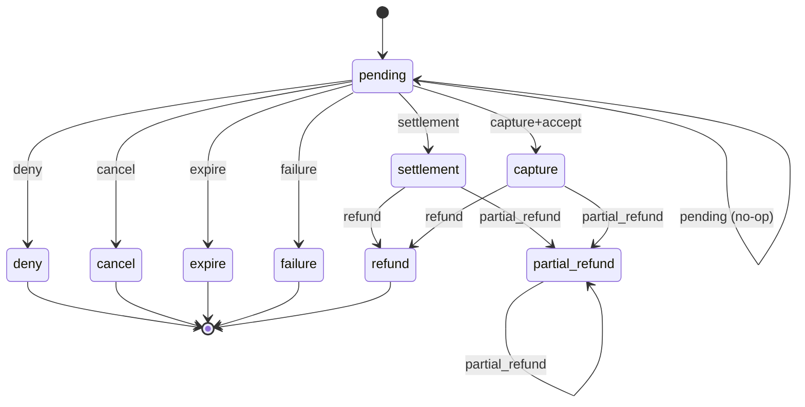

# Design Document — Midtrans Payment Gateway

## Overview

Fitur **Midtrans Payment Gateway** menambahkan jalur pembayaran online ke sistem Handayani dengan mengintegrasikan **Midtrans Snap** sebagai penyedia kanal pembayaran. Desain ini membungkus integrasi di belakang **service layer** terisolasi pada `Backend_API`, menambahkan **entitas baru `MidtransTransaction`** sebagai jembatan antara `Tagihan` dan `Pembayaran`, dan menghadirkan **dua surface UI** di `frontend-v2`:

- Tombol "Bayar Online" + dialog pemilihan nominal di `PortalTagihanPage`, halaman Status Pembayaran, serta penanda di `PortalRiwayatPembayaranPage` (Portal Siswa/Wali).
- Halaman `TransaksiMidtransPage` di Admin Panel untuk monitoring, filtering, dan sinkronisasi manual.

Prinsip desain inti:

1. **Tidak ada breaking change** pada alur Pembayaran offline existing. `Pembayaran` tetap dibuat dengan signature `PembayaranController` saat ini; jalur online hanya menambah satu pencipta (creator) baru di belakang `MidtransNotificationService`.
2. **Idempotent by design.** Setiap operasi yang berkomunikasi dengan Midtrans dirancang aman terhadap duplikasi: webhook bersifat at-least-once, sinkronisasi manual bersifat retry-safe, dan inisiasi yang berulang mengembalikan transaksi pending yang sama.
3. **Feature flag dual-layer.** `HANDAYANI_MIDTRANS_ENABLED` (toggle utama) dan `HANDAYANI_MIDTRANS_WEBHOOK_ENABLED` (toggle webhook independen) dibaca di backend dan frontend-v2, sehingga rollout dan mitigasi insiden tidak memerlukan redeploy.
4. **Snapshot finansial.** `amount_paid`, `fee_amount`, dan `gross_amount` di-persist saat inisiasi sehingga perubahan config setelahnya tidak mengubah transaksi yang sudah berjalan.
5. **Reuse listener existing.** Saat `settlement`/`capture`, sistem men-dispatch `PembayaranRecorded` yang sama, sehingga `SendKwitansiNotification` listener berjalan tanpa modifikasi dan kwitansi PDF tetap terbit dari satu sumber kebenaran.

### Ringkasan Riset

- **Midtrans Snap (sandbox vs production).** Snap memerlukan dua endpoint berbeda: `https://app.sandbox.midtrans.com/snap/v1/transactions` (sandbox) dan `https://app.midtrans.com/snap/v1/transactions` (production). Webhook Notification HTTP POST dikirim Midtrans ke endpoint kita dengan `signature_key = sha512(order_id + status_code + gross_amount + server_key)`. Status API: `GET https://api.{sandbox.}midtrans.com/v2/{order_id}/status` dengan Basic Auth `base64(server_key + ':')`. Sumber: dokumentasi resmi Midtrans Snap & HTTP Notification (https://docs.midtrans.com/docs/snap-overview, https://docs.midtrans.com/docs/https-based-notification).
- **Library client.** `midtrans/midtrans-php` (resmi) menyediakan `Midtrans\Snap::getSnapToken()` dan `Midtrans\Transaction::status()`. Kita tidak perlu membangun klien dari nol; kita membungkusnya dalam `MidtransClient` agar mudah di-mock pada test.
- **Mapping transaction_status × fraud_status.** Untuk kartu kredit, `transaction_status = capture` membutuhkan `fraud_status = accept` agar dianggap sukses. `settlement` selalu sukses (non-CC). `pending` saat menunggu pembayaran di kanal seperti VA/QRIS. Mapping di Requirement 5 AC 5 sudah lengkap; status terminal final yaitu `settlement`, `capture` (accept), `deny`, `cancel`, `expire`, `failure`, `refund`.
- **Idempotency Midtrans.** Midtrans mengirim notifikasi at-least-once dan dapat me-retry hingga beberapa kali jika tidak menerima HTTP 200 dalam timeout. Sistem harus menghasilkan response 200 secepat mungkin untuk notifikasi yang sudah pernah diproses (no-op idempotent).
- **`order_id` constraints.** Maksimal 50 karakter, alfanumerik + `-`, `_`, `.`, harus unik per merchant. Format `HDY-{kode_tagihan}-{epoch_ms}` aman karena `kode_tagihan` di Handayani sudah short string + epoch_ms 13 digit + `HDY-` prefix < 50 char.

## Architecture

### Konteks Sistem (System Context)



### Alur Tinggi (High-Level Flow)



### Komponen Utama

```mermaid
flowchart TB
    subgraph "Backend API (backend/)"
        direction TB
        MTC[MidtransTransactionController]
        MNC[MidtransNotificationController]
        MAC[MidtransAdminController]
        MAS[MidtransAuthorizationService]
        MIS[MidtransInitiationService]
        MNS[MidtransNotificationService]
        MSS[MidtransStatusSyncService]
        MCL[MidtransClient<br/>(Snap, Status)]
        MLS[MidtransLogService]
        MFS[MidtransFeeService]
        MidConf[(config/midtrans.php)]
        Models[(MidtransTransaction<br/>MidtransTransactionLog<br/>Pembayaran)]

        MTC --> MAS
        MTC --> MIS
        MIS --> MFS
        MIS --> MCL
        MIS --> Models
        MIS --> MLS
        MNC --> MNS
        MAC --> MSS
        MAC --> Models
        MNS --> MCL
        MNS --> Models
        MNS --> MLS
        MSS --> MCL
        MSS --> MNS
        MNS -. dispatch .-> Pembayaran[Pembayaran<br/>+ PembayaranRecorded]
        MCL --> MidConf
    end

    subgraph "Frontend (frontend-v2/)"
        PT[PortalTagihanPage]
        PSP[PortalStatusPembayaranPage]
        PRP[PortalRiwayatPembayaranPage]
        TMP[TransaksiMidtransPage]
        TMD[TransaksiMidtransDetailPage]
        MidApi[MidtransApi service]

        PT --> MidApi
        PSP --> MidApi
        TMP --> MidApi
        TMD --> MidApi
    end

    MidApi -->|Sanctum| MTC
    MidApi -->|Sanctum| MAC
    Midtrans[Midtrans Snap] -->|webhook| MNC
```

### Pemilihan Pola

| Concern | Keputusan | Rasional |
|---|---|---|
| Integrasi Snap | Wrapper `MidtransClient` di service layer + `midtrans/midtrans-php` | Library resmi, mudah di-mock untuk PBT, tetap reusable di sync manual. |
| Idempotency notifikasi | Database lock (`Tagihan` + `MidtransTransaction` row lock) + `unique(order_id)` | Mencegah race antar webhook duplikat & paralel; ringan dan portable di MySQL. |
| Idempotency Pembayaran | `unique(midtrans_order_id)` di tabel `pembayarans` + cek `count(...) <= 1` | Mengangkat invariant Requirement 7 AC 4 ke level DB. |
| Webhook auth | Tidak pakai Sanctum; verifikasi `signature_key` (SHA-512) + IP whitelist optional | Sesuai protokol Midtrans HTTP Notification. |
| Dispatch event Pembayaran | Re-dispatch `PembayaranRecorded` existing | Reuse `SendKwitansiNotification`; tidak ada cabang baru di pipeline notifikasi. |
| Fee handling | Snapshot `fee_amount` saat inisiasi, line item terpisah ke Snap | Jejak audit jelas, tidak mempengaruhi `Sisa_Tagihan`. |
| Polling status di Portal | Polling endpoint internal Backend, BUKAN Midtrans | Backend = source of truth; menghindari kebocoran client_key/server_key dan rate limit. |
| Status transition guard | State machine eksplisit di service | Memenuhi Requirement 14 AC 6, mudah diuji property-based. |

## Components and Interfaces

### Backend Components

#### 1. Configuration

**`backend/config/midtrans.php`** (file baru)

```php
return [
    'enabled'         => env('HANDAYANI_MIDTRANS_ENABLED', false),
    'webhook_enabled' => env('HANDAYANI_MIDTRANS_WEBHOOK_ENABLED', true),
    'environment'     => env('MIDTRANS_ENVIRONMENT', 'sandbox'), // 'sandbox' | 'production'
    'server_key'      => env('MIDTRANS_SERVER_KEY'),
    'client_key'      => env('MIDTRANS_CLIENT_KEY'),
    'merchant_id'     => env('MIDTRANS_MERCHANT_ID'),
    'fee_flat'        => (int) env('HANDAYANI_MIDTRANS_FEE_FLAT', 4000),
    'min_amount'      => 10_000, // sesuai asumsi A2
    'expiry_hours'    => 24,     // sesuai asumsi A3
    'order_prefix'    => 'HDY',
    'log_retention_days' => 180,
];
```

`AppServiceProvider::boot()` memvalidasi `environment ∈ {sandbox, production}`. Jika tidak valid, throw `InvalidMidtransConfigException` saat boot (AC 1.4) — pesan menyebut nama variabel `MIDTRANS_ENVIRONMENT` dan nilai yang diterima.

**`frontend-v2/config/handayani.php`** ditambahi:

```php
'features' => [
    // ...existing toggles...
    'midtrans_enabled' => env('HANDAYANI_MIDTRANS_ENABLED', false),
],
'midtrans' => [
    'fee_flat'   => (int) env('HANDAYANI_MIDTRANS_FEE_FLAT', 4000),
    'min_amount' => 10_000,
    'snap_url'   => env('MIDTRANS_SNAP_URL', 'https://app.sandbox.midtrans.com/snap/snap.js'),
    'client_key' => env('MIDTRANS_CLIENT_KEY'), // hanya client key, tidak server key
],
```

#### 2. Permissions (Requirement 3)

Tambahan di `app/Enum/Permission.php`:

```php
case PAY_TAGIHAN_ONLINE       = 'pay-tagihan-online';
case VIEW_MIDTRANS_TRX        = 'view-midtrans-transactions';
case SYNC_MIDTRANS_TRX        = 'sync-midtrans-transactions';
case MANAGE_MIDTRANS_CONFIG   = 'manage-midtrans-config';
```

Konstanta agregat di `app/Constant/Permissions.php`:

```php
public const MIDTRANS_PERMISSIONS = [
    'pay'    => Permission::PAY_TAGIHAN_ONLINE,
    'view'   => Permission::VIEW_MIDTRANS_TRX,
    'sync'   => Permission::SYNC_MIDTRANS_TRX,
    'manage' => Permission::MANAGE_MIDTRANS_CONFIG,
];
```

Seeder `RolesAndPermissionsSeeder` (atau migration data) menambahkan:

| Role | Permissions baru |
|---|---|
| `siswa` | `pay-tagihan-online` |
| `admin` | `view-midtrans-transactions`, `sync-midtrans-transactions` |
| `superadmin` | semua di atas + `manage-midtrans-config` |

#### 3. `MidtransClient` (Wrapper)

```php
namespace App\Services\Midtrans;

interface MidtransClient
{
    /** @return array{token:string, redirect_url:string} */
    public function createSnapTransaction(SnapPayload $payload): array;

    public function getStatus(string $orderId): MidtransStatusResponse;

    public function isConfigured(): bool;
}
```

Implementasi default `MidtransSnapClient` membungkus `Midtrans\Config` + `Midtrans\Snap` + `Midtrans\Transaction`. Semua HTTP error → `MidtransUnavailableException`. Untuk test: `FakeMidtransClient` yang dapat di-stub via `App::bind(MidtransClient::class, ...)`.

`isConfigured()` mengembalikan true hanya jika `server_key`, `client_key`, dan `merchant_id` semua non-empty (Requirement 1.9).

#### 4. `MidtransInitiationService` (Requirement 4, 7, 13)

```php
public function initiate(Siswa $siswa, string $kodeTagihan, int $amountPaid): InitiationResult;
```

Algoritma (di-wrap dalam transaksi DB dengan row lock pada `Tagihan`):

1. Pre-check feature flag global (`config('midtrans.enabled')`). Jika false → throw `MidtransDisabledException` (controller → HTTP 404).
2. Pre-check kredensial via `MidtransClient::isConfigured()`. Jika false → `MidtransNotConfiguredException` (HTTP 503, kode `MIDTRANS_NOT_CONFIGURED`).
3. Load `Tagihan` by `kode_tagihan` `FOR UPDATE` → `TagihanNotFoundException` (404).
4. Verifikasi ownership (`tagihan.nis == siswa.nis`) → `TagihanForbiddenException` (403).
5. Hitung `Sisa_Tagihan = tmp - SUM(pembayarans.jumlah)`. Jika 0 → `TagihanSudahLunasException` (422).
6. Validasi nominal: `>= min_amount` else `AMOUNT_BELOW_MINIMUM` (422); `<= Sisa_Tagihan` else `AMOUNT_EXCEEDS_SISA` (422).
7. **Cek pending in-flight**: `MidtransTransaction` dengan `kode_tagihan` ini, `status = pending`, dan `expired_at > now()`. Jika ada → throw `TagihanHasPendingTransactionException` membawa data transaksi pending → controller mengubah ke HTTP 409 dengan body berisi `order_id`, `snap_token`, `redirect_url`, dst (Requirement 4 AC 16, 7 AC 5, 9 AC 8).
8. Hitung `fee_amount = config('midtrans.fee_flat')`, `gross_amount = amount_paid + fee_amount`.
9. Persist `MidtransTransaction` (status `pending`, `expired_at = now()+24h`, `order_id = HDY-{kode_tagihan}-{epoch_ms}`).
10. Bangun `SnapPayload` (line items + customer details). `currency` IDR implisit (Requirement 13.1).
11. `client.createSnapTransaction(payload)` → simpan `snap_token`, `snap_redirect_url`. Tulis log `outbound_charge`.
12. Jika gagal → set transaksi ke `failure`, log error, throw `MidtransUnavailableException` (HTTP 502, kode `MIDTRANS_UNAVAILABLE`, Requirement 4 AC 15).
13. Return `InitiationResult` (DTO).

#### 5. `MidtransNotificationService` (Requirement 5, 6, 7, 13)

```php
public function handle(array $rawPayload, string $rawBody, ?string $remoteIp): NotificationResult;
```

Algoritma:

1. Cek `config('midtrans.webhook_enabled')`. Jika false → throw `WebhookDisabledException` (HTTP 503, `WEBHOOK_DISABLED`).
2. Tulis raw log inbound (sebelum apa pun) via `MidtransLogService::recordInbound($rawBody, $remoteIp)`. Masking server_key/signature_key (Requirement 11.2-11.3).
3. Verifikasi `signature_key`: `sha512($order_id . $status_code . $gross_amount . config('midtrans.server_key'))`. Jika mismatch → log warning + return `NotificationResult::rejected(403, 'INVALID_SIGNATURE')`. **Tidak ada perubahan state.**
4. Buka transaksi DB. Lock `MidtransTransaction` `WHERE order_id = ? FOR UPDATE`.
5. Jika tidak ditemukan → return rejected(404, `ORDER_NOT_FOUND`).
6. Verifikasi `gross_amount` payload == DB. Mismatch → log error, return rejected(422, `AMOUNT_MISMATCH`). Penulisan log error tidak menggagalkan rejection (Requirement 13.5).
7. Map `(transaction_status, fraud_status) → Status_Transaksi internal` lewat `StatusMapper`.
8. Cek transisi sah via `StatusTransitionGuard::isAllowed($current, $next)`:
   - Jika `next == current` → no-op: hanya tulis log, kembalikan 200 (Requirement 5.7, 5.9).
   - Jika tidak sah → return rejected(409, `INVALID_STATUS_TRANSITION`).
9. Update `MidtransTransaction` (`status`, `payment_type`, `paid_at` jika `settlement_time` tersedia, `raw_response` snapshot terakhir).
10. Jika `next ∈ {settlement, capture}` → panggil `recordPembayaran($trx, $payload)` (lihat di bawah).
11. Commit. Return `NotificationResult::ok()`.

`recordPembayaran` (transactional, sudah dalam lock):

1. Cek `Pembayaran` existing dengan `midtrans_order_id = $orderId`. Jika ada → no-op (Requirement 6.9, 7.4).
2. Hitung `Sisa_Tagihan` (recalc). Jika `Sisa_Tagihan < amount_paid` → log `OVERPAYMENT_BLOCKED` + throw → return rejected(409). Mempertahankan invariant (Requirement 6.10).
3. Build `Pembayaran`:
   - `kode_pembayaran = generate()` (mengikuti konvensi existing, e.g., `BYR-{epoch}`)
   - `kode_tagihan = trx.kode_tagihan`
   - `tanggal = settlement_time ?? now()`
   - `metode = 'online_midtrans'`
   - `jumlah = trx.amount_paid` (NOT gross_amount, Requirement 6.3 & 14.5)
   - `pembayar = nama Siswa atau Wali yang menginisiasi`
   - `branch_id = tagihan.branch_id`
   - `midtrans_order_id = trx.order_id`
4. Persist + dispatch `PembayaranRecorded($pembayaran)` (Requirement 6.8).

#### 6. `MidtransStatusSyncService` (Requirement 8)

```php
public function syncManual(MidtransTransaction $trx): NotificationResult;
```

1. Cek `trx.status` ∈ status terminal → throw `TransactionAlreadyFinalException` (HTTP 409, `TRANSACTION_ALREADY_FINAL`). **Tidak memanggil Midtrans.**
2. `client.getStatus(trx.order_id)` → response.
3. Bila gagal HTTP/network → log + throw `MidtransStatusUnavailableException` (HTTP 502, `MIDTRANS_STATUS_UNAVAILABLE`).
4. Reuse jalur `MidtransNotificationService::handle()` dengan synthesizing payload yang sama bentuknya seperti webhook + signature kalkulasi internal yang valid (Requirement 8.3 — "jalur penanganan yang sama"). Implementasi: `handle()` di-refactor dengan public method `processVerifiedPayload()` agar status sync bisa skip signature check tetapi tetap pakai mapping + idempotency yang sama.

#### 7. `MidtransLogService` (Requirement 11)

- `recordInbound(string $rawBody, ?string $ip)`
- `recordOutbound(string $direction, string $orderId, int $httpStatus, string $rawPayload)`
- Internal: `mask($payload)` — selalu masking field `server_key`, `signature_key`, dan substring yang persis cocok dengan current `config('midtrans.server_key')` (safety net Requirement 11.3). Jika substring server_key terdeteksi pada payload setelah mask attempt → tolak penulisan, catat incident di Laravel `Log::critical()`, dan TIDAK menggagalkan request utama (logging non-blocking).
- Pruning command: `php artisan midtrans:prune-logs --days=180`.

#### 8. Controllers & Routes

**`backend/routes/api.php`** (additive):

```php
// Public webhook (no Sanctum)
Route::post('/midtrans/notification', [MidtransNotificationController::class, 'handle']);

Route::middleware(['auth:sanctum'])->group(function () {
    // Siswa portal
    Route::middleware('permission:pay-tagihan-online')->group(function () {
        Route::post('/midtrans/transactions', [MidtransTransactionController::class, 'initiate']);
        Route::get('/midtrans/transactions/{order_id}', [MidtransTransactionController::class, 'show']);
    });
    // Admin
    Route::middleware('permission:view-midtrans-transactions')->group(function () {
        Route::get('/midtrans/admin/transactions', [MidtransAdminController::class, 'index']);
        Route::get('/midtrans/admin/transactions/{order_id}', [MidtransAdminController::class, 'show']);
        Route::get('/midtrans/admin/transactions/{order_id}/logs', [MidtransAdminController::class, 'logs']);
    });
    Route::middleware('permission:sync-midtrans-transactions')->group(function () {
        Route::post('/midtrans/admin/transactions/{order_id}/sync', [MidtransAdminController::class, 'sync']);
    });
});
```

`MidtransNotificationController::handle()` cek `config('midtrans.webhook_enabled')` dahulu (AC 2.7-2.8) lalu delegasi ke service. **Tidak** mengecek `enabled` (Requirement 2.5: webhook tetap diterima untuk transaksi yang sudah dibuat).

`MidtransTransactionController::initiate()` mengecek `config('midtrans.enabled')` di awal; bila false → return 404 (Requirement 2.4).

#### 9. Exception → HTTP Mapping (Handler)

Tabel mapping exception domain → HTTP yang dipusatkan di `App\Exceptions\Handler`:

| Exception | HTTP | Error code |
|---|---|---|
| `MidtransDisabledException` | 404 | `NOT_FOUND` |
| `MidtransNotConfiguredException` | 503 | `MIDTRANS_NOT_CONFIGURED` |
| `WebhookDisabledException` | 503 | `WEBHOOK_DISABLED` |
| `TagihanNotFoundException` | 404 | `TAGIHAN_NOT_FOUND` |
| `TagihanForbiddenException` | 403 | `TAGIHAN_FORBIDDEN` |
| `TagihanSudahLunasException` | 422 | `TAGIHAN_SUDAH_LUNAS` |
| `AmountBelowMinimumException` | 422 | `AMOUNT_BELOW_MINIMUM` |
| `AmountExceedsSisaException` | 422 | `AMOUNT_EXCEEDS_SISA` |
| `TagihanHasPendingTransactionException` | 409 | `TAGIHAN_HAS_PENDING_TRANSACTION` (body memuat snap data) |
| `MidtransUnavailableException` | 502 | `MIDTRANS_UNAVAILABLE` |
| `MidtransStatusUnavailableException` | 502 | `MIDTRANS_STATUS_UNAVAILABLE` |
| `TransactionAlreadyFinalException` | 409 | `TRANSACTION_ALREADY_FINAL` |
| `InvalidStatusTransitionException` | 409 | `INVALID_STATUS_TRANSITION` |
| `OrderNotFoundException` | 404 | `ORDER_NOT_FOUND` |
| `AmountMismatchException` | 422 | `AMOUNT_MISMATCH` |
| `OverpaymentBlockedException` | 409 | `OVERPAYMENT_BLOCKED` |
| `AmountInternalInconsistentException` | 422 | `AMOUNT_INTERNAL_INCONSISTENT` |
| `CannotDeleteOnlinePembayaranException` | 409 | `CANNOT_DELETE_ONLINE_PEMBAYARAN` |
| `InvalidSignatureException` | 403 | `INVALID_SIGNATURE` |

### Frontend Components (`frontend-v2/`)

#### Portal (Siswa/Wali)

- **`PortalTagihanPage` (modifikasi)**
  - Tambah action button "Bayar Online" pada tabel Tagihan, terlihat hanya jika `config('handayani.features.midtrans_enabled')` true DAN `Sisa_Tagihan >= 10000` (Requirement 9.1, 4.1).
  - Action membuka **Filament Modal** dengan input `amount_paid` (TextInput numeric), default `Sisa_Tagihan`, validasi min `10000` & max `Sisa_Tagihan`. Menampilkan preview `Fee_Flat` dan `Gross_Amount` reaktif (Requirement 9.2).
  - On submit: panggil `MidtransApi::initiate(kodeTagihan, amountPaid)` melalui service kelas `app/Services/MidtransApi.php`.
  - Sukses → buka Snap (popup `snap.js`) atau redirect ke `redirect_url`. Setelah `onSuccess`/`onPending`/`onError`/`onClose` → navigasi ke `PortalStatusPembayaranPage?order_id={...}`.
  - Error 409 `TAGIHAN_HAS_PENDING_TRANSACTION` → modal khusus dengan tombol "Lanjutkan Pembayaran" (Requirement 9.8) yang langsung membuka Snap dengan `snap_token` dari error body.

- **`PortalStatusPembayaranPage` (baru, `app/Filament/Portal/Pages/PortalStatusPembayaranPage.php`)**
  - Param URL: `order_id`.
  - Polling Livewire interval 5 detik selama maksimal 2 menit jika status `pending` (Requirement 9.5). Implementasi: `wire:poll.5s` dengan counter; menghentikan polling segera saat status terminal (`success`/`failed`/`expired`/`cancelled`) atau setelah 24 polls (= 120 detik). Setelah berhenti karena timeout, tampilkan instruksi mengecek `PortalRiwayatPembayaranPage`.
  - Menampilkan: `order_id`, status, `amount_paid`, `fee_amount`, `gross_amount`, `payment_type`, jika sukses → tombol unduh kwitansi (mengarah ke endpoint existing `/api/pembayaran/kwitansi/{kode_pembayaran}`).

- **`PortalRiwayatPembayaranPage` (modifikasi)**
  - Tambahkan kolom badge `Online`/`Offline` berdasarkan `metode` (Requirement 9.6).
  - Tautan unduh kwitansi tetap memakai endpoint existing.

#### Admin Panel

- **`TransaksiMidtransPage` (baru, `app/Filament/Pages/TransaksiMidtransPage.php`)**
  - Permission gate: `view-midtrans-transactions` (Requirement 10.1).
  - Hidden dari navigasi & throw 404 jika `!config('handayani.features.midtrans_enabled')` (Requirement 2.6) — implementasi via `static::canAccess()` dan `shouldRegisterNavigation()`.
  - Table: `order_id`, `kode_tagihan`, `nama_siswa`, `amount_paid`, `fee_amount`, `gross_amount`, `status`, `payment_type`, `created_at`, `updated_at` (Requirement 10.2).
  - Filters: status, range `created_at`, `branch_id` (Requirement 10.3).

- **`TransaksiMidtransDetailPage` (baru)**
  - Action "Sinkronisasi Status" hanya tampil jika `status === 'pending'` (Requirement 8.1, 10.4).
  - Section log audit per transaksi (data dari endpoint `/midtrans/admin/transactions/{order_id}/logs`).
  - Field sensitif `signature_key` dan `server_key` selalu di-render `***` di UI (Requirement 10.5).

#### Service Layer Frontend

`frontend-v2/app/Services/MidtransApi.php` — wrapper HTTP client (Sanctum bearer dari session) yang memetakan endpoint backend ke method PHP, parsing error code untuk pesan i18n (Bahasa Indonesia).

## Data Models

### Tabel Baru: `midtrans_transactions`

| Column | Type | Constraints | Notes |
|---|---|---|---|
| `id` | `BIGINT UNSIGNED` | PK auto | Surrogate. |
| `order_id` | `VARCHAR(64)` | UNIQUE NOT NULL | Format `HDY-{kode_tagihan}-{epoch_ms}`. |
| `kode_tagihan` | `VARCHAR(64)` | FK → `tagihans.kode_tagihan`, NOT NULL, INDEX | |
| `nis` | `VARCHAR(32)` | NOT NULL, INDEX | Snapshot pemilik (denormalized untuk audit). |
| `amount_paid` | `BIGINT UNSIGNED` | NOT NULL | Integer Rupiah. |
| `fee_amount` | `BIGINT UNSIGNED` | NOT NULL | Integer Rupiah. Snapshot fee saat inisiasi. |
| `gross_amount` | `BIGINT UNSIGNED` | NOT NULL, CHECK `gross_amount = amount_paid + fee_amount` | Diverifikasi di service & DB. |
| `currency` | `CHAR(3)` | NOT NULL DEFAULT `'IDR'` | |
| `status` | `ENUM('pending','settlement','capture','deny','cancel','expire','failure','refund','partial_refund')` | NOT NULL DEFAULT `'pending'`, INDEX | |
| `payment_type` | `VARCHAR(64)` | NULL | E.g., `bank_transfer`, `qris`. |
| `snap_token` | `VARCHAR(128)` | NULL | |
| `snap_redirect_url` | `VARCHAR(255)` | NULL | |
| `expired_at` | `DATETIME` | NOT NULL, INDEX | now()+24h. |
| `paid_at` | `DATETIME` | NULL | `settlement_time` saat sukses. |
| `initiator_user_id` | `BIGINT UNSIGNED` | NULL, FK → users.id | Untuk field `pembayar`. |
| `branch_id` | `INT` | NULL | Snapshot dari Tagihan. |
| `last_raw_response` | `JSON` | NULL | Payload Midtrans terakhir (masked). |
| `created_at`, `updated_at` | `TIMESTAMP` | | |

**Index tambahan:** composite `(kode_tagihan, status)` untuk cepat mendeteksi pending in-flight; composite `(status, expired_at)` untuk job pembersih (jika dibutuhkan kemudian).

**Relasi Eloquent (`App\Models\MidtransTransaction`):**

```php
public function tagihan() { return $this->belongsTo(Tagihan::class, 'kode_tagihan', 'kode_tagihan'); }
public function pembayaran() { return $this->hasOne(Pembayaran::class, 'midtrans_order_id', 'order_id'); }
public function logs() { return $this->hasMany(MidtransTransactionLog::class, 'order_id', 'order_id'); }
public function initiator() { return $this->belongsTo(User::class, 'initiator_user_id'); }
```

### Tabel Baru: `midtrans_transaction_logs`

| Column | Type | Constraints |
|---|---|---|
| `id` | `BIGINT UNSIGNED` | PK |
| `order_id` | `VARCHAR(64)` | NOT NULL, INDEX (nullable saat order tidak ditemukan) |
| `direction` | `ENUM('outbound_charge','outbound_status','inbound_notification')` | NOT NULL |
| `http_status` | `INT` | NULL |
| `raw_payload` | `LONGTEXT` | NULL — sudah di-mask |
| `remote_ip` | `VARCHAR(45)` | NULL |
| `created_at` | `TIMESTAMP` | NOT NULL, INDEX |

### Modifikasi Tabel Existing: `pembayarans`

Migration baru:

```sql
ALTER TABLE pembayarans
  MODIFY COLUMN metode ENUM('offline','online_midtrans') NOT NULL DEFAULT 'offline',
  ADD COLUMN midtrans_order_id VARCHAR(64) NULL UNIQUE,
  ADD INDEX idx_pembayarans_metode (metode);
```

Backfill: semua row existing → `metode = 'offline'` (Requirement 12.1). `Pembayaran::$fillable` tambahkan `midtrans_order_id`.

### Status Transition State Machine



Himpunan transisi sah `T = { (s, s) | s ∈ Status } ∪ T_pending ∪ T_terminal_refund`:

- `T_pending = { (pending, x) | x ∈ {settlement, capture, deny, cancel, expire, failure} }`
- `T_terminal_refund = { (settlement, refund), (capture, refund), (settlement, partial_refund), (capture, partial_refund), (partial_refund, partial_refund) }`

Transisi di luar `T` ditolak dengan `INVALID_STATUS_TRANSITION` (Requirement 5.8 & 14.6).

### DTO

```php
final class SnapPayload {
    public string $orderId;
    public int $grossAmount;
    public array $itemDetails;       // 2 items: tagihan + fee
    public array $customerDetails;   // first_name, last_name, email
    public array $expiry;            // {start_time, unit:'hour', duration:24}
}

final class InitiationResult {
    public string $orderId;
    public string $snapToken;
    public string $redirectUrl;
    public int $amountPaid;
    public int $feeAmount;
    public int $grossAmount;
    public CarbonImmutable $expiredAt;
}

enum MidtransInternalStatus: string {
    case Pending = 'pending';
    case Settlement = 'settlement';
    case Capture = 'capture';
    case Deny = 'deny';
    case Cancel = 'cancel';
    case Expire = 'expire';
    case Failure = 'failure';
    case Refund = 'refund';
    case PartialRefund = 'partial_refund';
}
```


## Correctness Properties

*A property is a characteristic or behavior that should hold true across all valid executions of a system — essentially, a formal statement about what the system should do. Properties serve as the bridge between human-readable specifications and machine-verifiable correctness guarantees.*

Bagian ini merangkum sifat-sifat yang harus dijaga oleh implementasi Midtrans Payment Gateway. Tiap properti dipetakan ke acceptance criteria pada `requirements.md`. Properti yang dapat dikombinasikan tanpa kehilangan kekuatan validasi telah digabungkan agar setiap properti memberikan nilai validasi yang unik.

### Property 1: Inisiasi transaksi mempertahankan kontrak amount

*For any* `Tagihan` valid milik Siswa yang sah dan `amount_paid ∈ [10_000, Sisa_Tagihan]`, panggilan inisiasi harus mempersist tepat satu `MidtransTransaction` dengan `status='pending'`, `amount_paid = input.amount_paid`, `fee_amount = config('midtrans.fee_flat')` saat inisiasi (snapshot), `gross_amount = amount_paid + fee_amount`, `expired_at - created_at == 24 jam` (toleransi <1s), payload Snap memiliki tepat 2 line items (kode_tagihan + `FEE_MIDTRANS`) yang `sum(price * quantity) == gross_amount`, dan response berisi `snap_token` non-empty serta `redirect_url` valid; perubahan `config('midtrans.fee_flat')` setelah inisiasi tidak boleh mengubah `fee_amount` transaksi tersebut.

**Validates: Requirements 4.5, 4.6, 4.7, 4.8, 4.9, 13.2, 13.3, 13.6**

### Property 2: Inisiasi idempoten saat ada pending in-flight

*For any* `Tagihan` yang memiliki `MidtransTransaction` berstatus `pending` dengan `expired_at > now()`, semua inisiasi tambahan untuk Tagihan tersebut (untuk parameter `amount_paid` apa pun yang valid) harus mengembalikan HTTP 409 dengan kode `TAGIHAN_HAS_PENDING_TRANSACTION`, body memuat `order_id`, `snap_token`, `redirect_url`, `amount_paid`, `fee_amount`, `gross_amount` yang **identik** dengan transaksi pending yang sudah ada, dan **tidak boleh** membuat record `MidtransTransaction` baru.

**Validates: Requirements 4.16, 6.11, 7.5, 9.8**

### Property 3: Pemetaan error inisiasi konsisten

*For any* request inisiasi yang melanggar tepat satu kondisi domain, Backend_API harus mengembalikan kombinasi (HTTP status, error_code) yang sesuai tabel: Tagihan tidak ditemukan ↔ (404, `TAGIHAN_NOT_FOUND`); bukan milik Siswa ↔ (403, `TAGIHAN_FORBIDDEN`); `Sisa_Tagihan = 0` ↔ (422, `TAGIHAN_SUDAH_LUNAS`); `amount_paid < 10000` ↔ (422, `AMOUNT_BELOW_MINIMUM`); `amount_paid > Sisa_Tagihan` ↔ (422, `AMOUNT_EXCEEDS_SISA`); panggilan ke Snap gagal ↔ (502, `MIDTRANS_UNAVAILABLE`) **dan** `MidtransTransaction` yang baru dibuat memiliki `status='failure'`; `gross_amount ≠ amount_paid + fee_amount` (invariant violation) ↔ (422, `AMOUNT_INTERNAL_INCONSISTENT`).

**Validates: Requirements 4.10, 4.11, 4.12, 4.13, 4.14, 4.15, 13.3**

### Property 4: Signature invalid tidak memodifikasi state

*For any* payload webhook yang dikirim ke `POST /api/midtrans/notification` dengan `signature_key` yang **tidak** sama dengan `sha512(order_id + status_code + gross_amount + server_key)`, snapshot database (`MidtransTransaction.*`, `pembayarans.*`) sebelum dan sesudah request harus identik, response HTTP harus 403, dan log audit harus mencatat entry warning yang berisi `order_id` (jika ada) serta IP pengirim.

**Validates: Requirements 5.2, 5.3, 11.5, 14.4**

### Property 5: Webhook handler idempoten dan deterministik

*For any* webhook payload `P` dengan signature valid dan `gross_amount` cocok dengan DB yang merepresentasikan transisi sah `current → next` pada state machine yang didefinisikan di section Data Models, memproses `P` sebanyak `N ≥ 1` kali secara berurutan menghasilkan state database yang **identik** dengan memprosesnya 1 kali: tepat satu update `MidtransTransaction.status = next` (jika `next ≠ current`) atau no-op (jika `next == current`); tepat satu `Pembayaran` baru jika `next ∈ {settlement, capture}` dan belum ada Pembayaran untuk `order_id` tersebut, atau nol jika sudah ada; `PembayaranRecorded` di-dispatch tepat satu kali secara total bila Pembayaran terbentuk; semua N invocation mengembalikan HTTP 200.

**Validates: Requirements 5.5, 5.6, 5.7, 5.9, 6.1, 6.8, 6.9, 7.4, 14.3**

### Property 6: Pembayaran online merefleksikan transaksi dengan tepat

*For any* `MidtransTransaction` `X` yang bertransisi ke `settlement` atau `capture` dengan `amount_paid = A`, `fee_amount = F`, `kode_tagihan = K`, dan inisiator `U`, terdapat tepat satu record `Pembayaran` `Y` dengan `Y.kode_tagihan = K`, `Y.metode = 'online_midtrans'`, `Y.jumlah = A` (BUKAN `A + F`), `Y.tanggal = X.paid_at` (atau timestamp pemrosesan jika `settlement_time` absen), `Y.pembayar = nama(U)`, `Y.branch_id = Tagihan(K).branch_id`, `Y.midtrans_order_id = X.order_id`; tidak ada `Pembayaran` terpisah yang merefleksikan `fee_amount`.

**Validates: Requirements 6.1, 6.2, 6.3, 6.4, 6.5, 6.6, 6.7, 6.12, 14.5**

### Property 7: Status transition guard

*For any* pasangan status `(current, next)`, panggilan `StatusTransitionGuard::isAllowed(current, next)` mengembalikan `true` jika dan hanya jika `(current, next) ∈ T_allowed` (himpunan transisi sah yang didefinisikan di section Data Models); webhook atau status sync yang menghasilkan `(current, next) ∉ T_allowed` dengan `next ≠ current` ditolak dengan HTTP 409 dan kode `INVALID_STATUS_TRANSITION` tanpa mengubah `MidtransTransaction.status`.

**Validates: Requirements 5.8, 14.6**

### Property 8: Invariant keuangan lintas siklus operasi

*For all* urutan operasi acak yang sah `(initiate*, webhook*, sync*, deletePembayaran*)` pada satu `Tagihan` dengan `tmp = T`, setelah setiap operasi:

- `sum(Pembayaran.jumlah where kode_tagihan = K) ≤ T` (no overpayment).
- Untuk setiap `MidtransTransaction X` yang sudah dalam status terminal: `count(Pembayaran where midtrans_order_id = X.order_id) = 1` jika `X.status ∈ {settlement, capture}`, dan `= 0` jika `X.status ∈ {deny, cancel, expire, failure}`.
- Untuk setiap subset `S ⊆ {MidtransTransaction.order_id}` dengan `status ∈ {settlement, capture}`: `sum(Pembayaran.jumlah where midtrans_order_id ∈ S) = sum(MidtransTransaction.amount_paid where order_id ∈ S)`.

Operasi yang akan menyebabkan invariant pertama dilanggar (mis. overpayment race) ditolak dengan HTTP 409 `OVERPAYMENT_BLOCKED` dan tidak menulis Pembayaran apa pun.

**Validates: Requirements 6.10, 7.4, 7.6, 14.1, 14.2**

### Property 9: Uniqueness order_id dan midtrans_order_id

*For all* urutan operasi inisiasi dan webhook (sekuensial maupun paralel), tidak pernah ada dua row `MidtransTransaction` dengan `order_id` yang sama, dan tidak pernah ada dua row `Pembayaran` dengan `midtrans_order_id` non-null yang sama.

**Validates: Requirements 7.1, 7.2, 7.3**

### Property 10: Sinkronisasi manual setara dengan webhook

*For any* `MidtransTransaction X` dengan status non-terminal dan setiap response Midtrans Status API valid `R`, panggilan `MidtransStatusSyncService::syncManual(X)` menghasilkan perubahan state DB yang **identik** dengan menerima webhook valid yang membawa payload setara `R`; *for any* `X` yang sudah dalam status terminal, panggilan sync mengembalikan HTTP 409 `TRANSACTION_ALREADY_FINAL` dan **tidak** memanggil `MidtransClient::getStatus()`.

**Validates: Requirements 8.1, 8.3, 8.5**

### Property 11: Logging dan masking konsisten

*For any* operasi yang berinteraksi dengan Midtrans (`outbound_charge`, `outbound_status`, `inbound_notification`), tepat satu row di `midtrans_transaction_logs` ditulis dengan `direction`, `http_status`, `raw_payload` (selama signature/order ditemukan, juga `order_id`); *for any* nilai field `server_key` atau `signature_key` di payload, raw_payload yang tersimpan tidak boleh mengandung nilai literal tersebut (di-mask `***`); *for any* nilai non-empty saat ini dari `config('midtrans.server_key')`, raw_payload yang tersimpan tidak boleh mengandung substring tersebut, dan jika ditemukan setelah masking, log entry di-reject dan incident dicatat ke Laravel log tanpa menggagalkan request utama.

**Validates: Requirements 5.10, 10.5, 11.1, 11.2, 11.3, 11.5**

### Property 12: Feature flag mempengaruhi inisiasi tetapi bukan eksekusi webhook untuk transaksi yang sudah dibuat

*For any* request inisiasi (terotentikasi dengan permission yang benar), jika `config('midtrans.enabled') == false` maka response selalu HTTP 404 dan tidak ada `MidtransTransaction` yang dibuat; jika `config('midtrans.webhook_enabled') == false` maka response webhook selalu HTTP 503 `WEBHOOK_DISABLED` tanpa mengubah state; jika `enabled == false` namun `webhook_enabled == true`, webhook valid untuk `MidtransTransaction` yang sudah ada tetap diproses normal sesuai Property 5; akses ke admin Midtrans page saat `enabled == false` selalu menghasilkan 404, baik dari navigasi maupun via URL langsung.

**Validates: Requirements 2.3, 2.4, 2.5, 2.6, 2.8**

### Property 13: Permission gate menutup semua endpoint dan halaman Midtrans

*For any* user `U` dan endpoint Midtrans `E ∈ { initiate, list-admin-trx, sync-trx, manage-config }`, akses ke `E` mengembalikan HTTP 403 jika dan hanya jika `U` tidak memiliki permission yang dibutuhkan oleh `E` (`pay-tagihan-online`, `view-midtrans-transactions`, `sync-midtrans-transactions`, `manage-midtrans-config` masing-masing).

**Validates: Requirements 3.5, 3.6, 3.7**

### Property 14: Coexistence dengan jalur Pembayaran offline

*For any* panggilan ke endpoint `PembayaranController` existing (`POST /pembayaran/bayar/{kode_tagihan}`, `POST /pembayaran/lunas/{kode_tagihan}`, `POST /pembayaran/batch`), Pembayaran yang dihasilkan memiliki `metode = 'offline'` dan `midtrans_order_id = NULL`, dan tidak ada `MidtransTransaction` yang dibuat atau dimodifikasi oleh panggilan tersebut; *for any* request DELETE pada Pembayaran dengan `metode = 'online_midtrans'`, response adalah HTTP 409 `CANNOT_DELETE_ONLINE_PEMBAYARAN` jika user tidak memiliki kombinasi (`delete-pembayaran` AND `manage-midtrans-config`), dan record tetap ada.

**Validates: Requirements 12.3, 12.4**

### Property 15: UI portal merepresentasikan state dengan benar

*For any* `Tagihan` Siswa yang sedang login dan setiap nilai `(midtrans_enabled_flag, Sisa_Tagihan)`, tombol "Bayar Online" pada `PortalTagihanPage` ditampilkan jika dan hanya jika `midtrans_enabled_flag == true ∧ Sisa_Tagihan ≥ 10000`; *for any* `Pembayaran` pada `PortalRiwayatPembayaranPage`, badge yang dirender adalah `Online` jika `metode == 'online_midtrans'` dan `Offline` selainnya; *for any* halaman `PortalStatusPembayaranPage` yang dibuka dengan `MidtransTransaction.status` masih `pending`, polling berjalan setiap 5 detik dan dihentikan **segera** saat status berubah ke status terminal (`success`/`failed`/`expired`/`cancelled`) atau pada batas 120 detik (24 polls), tidak melanjutkan polling setelah waktu berhenti.

**Validates: Requirements 4.1, 9.1, 9.5, 9.6**

## Error Handling

### Strategi umum

- **Domain exception → HTTP**: semua error path dimodelkan sebagai exception kelas `App\Exceptions\Midtrans\*` dengan property `errorCode` dan `httpStatus`. `App\Exceptions\Handler::register()` mendaftarkan renderer tunggal yang mengubah exception ini menjadi `JsonResponse` dengan body `{"error_code": "<CODE>", "message": "<i18n msg>", "data": {...optional...}}`.
- **Idempotent error responses**: untuk webhook, response 4xx/5xx tetap menulis log audit (Property 11). 2xx hanya dikembalikan untuk hasil yang dapat di-retry-safe oleh Midtrans.
- **No silent state mutation**: jalur exception path harus dibungkus `DB::transaction()`; setiap throw setelah persist parsial menghasilkan rollback otomatis. Pengecualian: penulisan log audit non-blocking dilakukan **di luar** transaksi utama.

### Klasifikasi error

| Kategori | Contoh | Penanganan |
|---|---|---|
| Konfigurasi | `MidtransNotConfiguredException`, `InvalidMidtransConfigException` | Boot-time fail-fast untuk env invalid; runtime → 503 dengan kode jelas. |
| Otorisasi | `TagihanForbiddenException`, permission middleware Spatie | 403 + i18n message. |
| Validasi domain | `AmountBelowMinimumException`, `AmountExceedsSisaException`, `TagihanSudahLunasException` | 422, FE menampilkan pesan terjemahan ID. |
| Konflik state | `TagihanHasPendingTransactionException`, `TransactionAlreadyFinalException`, `InvalidStatusTransitionException`, `OverpaymentBlockedException`, `CannotDeleteOnlinePembayaranException` | 409 + body memuat data context (mis. snap_token saat pending). |
| Integritas amount | `AmountMismatchException`, `AmountInternalInconsistentException` | 422; log error severity sebelum throw (Requirement 13.5). |
| Integrasi eksternal | `MidtransUnavailableException`, `MidtransStatusUnavailableException` | 502; transaksi yang baru di-create di-set `failure`; Frontend menampilkan retry hint. |
| Webhook integrity | `InvalidSignatureException`, `OrderNotFoundException` | 403/404 + log warning + IP. **Tidak** ada perubahan state. |
| Disabled feature | `MidtransDisabledException`, `WebhookDisabledException` | 404 / 503 sesuai Requirement 2.4 dan 2.8. |

### Penanganan kegagalan parsial

- **Logging gagal saat reject 422 amount mismatch (Requirement 13.5)**: `try/catch` membungkus `MidtransLogService::logError(...)` agar kegagalan tulis log tidak menghapus respons error. Test memastikan property: response tetap 422 walau log writer melempar exception.
- **Snap API gagal setelah persist `MidtransTransaction`**: dalam transaksi DB yang sama, `update($trx, ['status' => 'failure'])` lalu commit (transaksi tetap terlihat oleh admin sebagai gagal), kemudian throw `MidtransUnavailableException`. Hal ini menjamin tidak ada transaksi `pending` yang bocor ke DB padahal Snap belum dibuat.
- **Deadlock / lock timeout MySQL**: retry strategy di `MidtransNotificationService::handle()` — wrap dengan retry 2x untuk `Illuminate\Database\QueryException` dengan SQL state `40001`. Lebih dari itu → 500 ke caller (Midtrans akan retry).

### Frontend error UX

- Pesan error dipusatkan di `frontend-v2/lang/id/midtrans.php` (mis. `AMOUNT_EXCEEDS_SISA` → "Nominal melebihi sisa tagihan."). `MidtransApi::initiate()` melempar `MidtransApiException` yang membawa `errorCode`, sehingga modal & dialog merender pesan i18n konsisten.
- 409 `TAGIHAN_HAS_PENDING_TRANSACTION` mendapat handling spesial: data dari error body langsung dipakai untuk membuka Snap.

## Testing Strategy

### Library dan toolchain

- **Backend (`backend/`)**: PHPUnit `^11.5` (existing). Untuk PBT, gunakan **`pholser/phpunit-properties`** atau alternatif sederhana via custom `dataProviders` + `Eris`. Karena workspace `frontend-v2/` sudah memakai `giorgiosironi/eris ^0.13`, kita standardisasi ke **Eris** juga di backend (tambah dependency `giorgiosironi/eris` sebagai `require-dev`). Eris diintegrasikan ke PHPUnit via trait `Eris\TestTrait`. Setiap property test dijalankan minimal **100 iterations** (default Eris 100; eksplisit `->limitTo(100)`).
- **Frontend (`frontend-v2/`)**: Pest `^3.8` (existing) + `eris` (sudah ada). Property tests untuk Filament pages dijalankan via Pest dataset + Eris generators.
- **Mocking Midtrans**: `App::bind(MidtransClient::class, FakeMidtransClient::class)` di `tests/TestCase::setUp()`. `FakeMidtransClient` deterministik dengan API: `->shouldReturnSnap(...)`, `->shouldFail(...)`, `->shouldReturnStatus($status, $fraudStatus)`. Tidak ada panggilan jaringan riil di unit/property tests.
- **Time control**: `Carbon::setTestNow()` agar polling, expiry, dan `paid_at` deterministik.
- **Event spying**: `Event::fake([PembayaranRecorded::class])` untuk assert dispatch counts (Property 5).

### Pendekatan ganda (dual testing)

| Layer | Tipe | Fokus |
|---|---|---|
| Unit / Pure logic | Example + Property | `StatusMapper`, `StatusTransitionGuard`, `SignatureVerifier`, `OrderIdGenerator`, `MidtransLogService::mask()`, DTO invariants. |
| Service / Application | Property (with DB) | `MidtransInitiationService`, `MidtransNotificationService`, `MidtransStatusSyncService` end-to-end di-database (in-memory SQLite atau MySQL via RefreshDatabase). |
| HTTP / API | Property + Example | Controllers + permission middleware + exception renderer. |
| Frontend (Pest) | Property + Snapshot | `PortalTagihanPage`, `PortalStatusPembayaranPage`, `TransaksiMidtransPage`, badge mapping, polling rules. |

### Property test layout

- Lokasi: `backend/tests/Feature/Midtrans/Properties/*` (PBT) dan `backend/tests/Feature/Midtrans/Examples/*` (example/integration). Mirror di `frontend-v2/tests/Feature/Midtrans/`.
- Tag setiap property test dengan komentar:
  ```php
  /**
   * Feature: midtrans-payment-gateway, Property 5: Webhook handler idempoten dan deterministik
   */
  ```
- Konfigurasi minimum **100 iterations**:
  ```php
  $this->forAll(Generator\associative([...]))
       ->withMaxSize(50)
       ->then(function ($input) { /* ... */ })
       ->limitTo(100);
  ```

### Generator strategy

| Generator | Untuk |
|---|---|
| `tagihanGen()` | `Tagihan` dengan `tmp ∈ [10_000, 50_000_000]`, status acak. |
| `siswaGen()` | `Siswa` valid dengan/tanpa email Wali. |
| `amountPaidGen($sisa)` | Integer ∈ `[10_000, $sisa]`. Edge cases: minimum, maximum, mid. |
| `invalidAmountGen($sisa)` | Integer di luar range; mencakup negatif, 0, `< 10_000`, `> $sisa`. |
| `webhookPayloadGen($trx)` | Builder payload Midtrans dengan `transaction_status × fraud_status` valid; menghasilkan `signature_key` valid via helper `signFor($payload)`. Variant `tampered` mengubah `signature_key`. |
| `statusPairGen()` | Semua kombinasi `(current, next)`; akan menyaring transisi sah/tidak sah berdasarkan `T_allowed`. |
| `opSequenceGen()` | Sekuens operasi acak `(initiate | webhook | sync | deletePembayaran)`. Digunakan untuk Property 8 (invariant lintas siklus). |
| `concurrentNotifGen()` | Dua salinan payload identik untuk simulasi paralel (via DB transaction interleaving). |

### Cakupan integration / smoke tests

- **Smoke**: boot config `midtrans.environment = 'sandbox'` & `'production'` → asserts base URL & client config (Requirements 1.5, 1.6).
- **Integration**: 1 happy-path E2E menggunakan `MidtransSnapClient` riil terhadap **sandbox** (di-skip di CI normal, dijalankan via `composer test:midtrans-sandbox` dengan env credentials terpisah). Mencakup: inisiasi → simulate webhook via Midtrans test tool → verifikasi Pembayaran muncul.
- **Migration tests**: backfill `metode = 'offline'` untuk record existing (Requirement 12.1) — dataset existing dengan random rows.

### Frontend testing

- **Pest + Livewire test**: render `PortalTagihanPage` dengan `Tagihan` factory + flag on/off untuk Property 15.
- **Pest + Eris**: generator `(flag, sisa)` × visibility expectation untuk tombol "Bayar Online".
- **Polling property test**: gunakan `Livewire::test(PortalStatusPembayaranPage::class, ['orderId' => ...])->assertSet('status', 'pending')->call('poll')` dalam loop dengan stub backend response, asserting bahwa `poll` tidak dipanggil setelah hit terminal status atau setelah 24 iterasi.
- **Filament page access**: assert `mount` melempar 404 saat flag off (Requirement 2.6).

### Testing yang TIDAK menggunakan PBT

| Area | Alasan | Pendekatan |
|---|---|---|
| Database migration up/down | Schema check, satu jalur deterministik. | PHPUnit example test + `RefreshDatabase`. |
| Permission seeding | Smoke. | Single test verifikasi seeder. |
| `php artisan midtrans:prune-logs` | CLI command tunggal dengan input minimal. | Example test dengan dataset spesifik (Requirement 11.4). |
| Snap.js integration di browser | Bergantung pada layanan eksternal. | Manual smoke + integration test sandbox. |
| Email kwitansi | Sudah dicakup test existing `SendKwitansiNotification`. | Re-run existing test suite. |
| UI styling/layout | Bukan logika. | Snapshot manual + visual review. |

### Performance & ops checks

- **Webhook latency budget**: handler harus respons 200/4xx/5xx < 2 detik untuk menghindari Midtrans retry storm. Property test mengukur tidak diatur (cost tinggi) — sebagai gantinya, tambahkan pengecekan `select` plan via assertion bahwa hanya dua query DB yang berjalan dalam path happy (`trx lookup FOR UPDATE` + `pembayaran insert`).
- **Pruning**: `php artisan midtrans:prune-logs --days=180` dijalankan harian via `app/Console/Kernel.php` schedule, dengan example test untuk batas hari.
