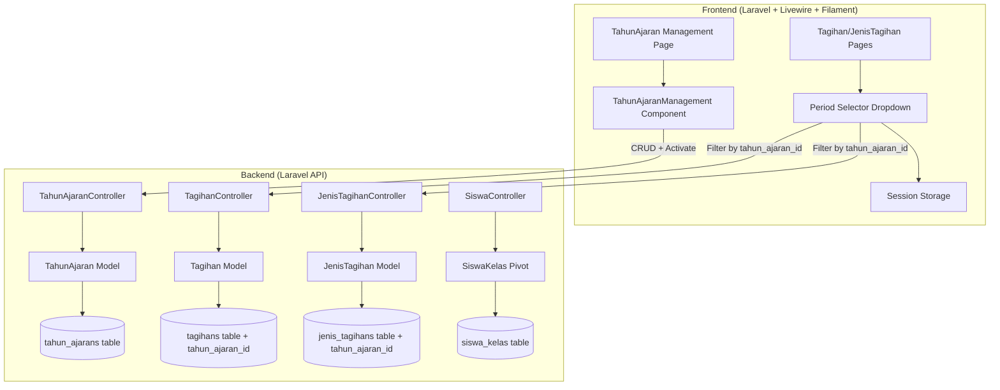
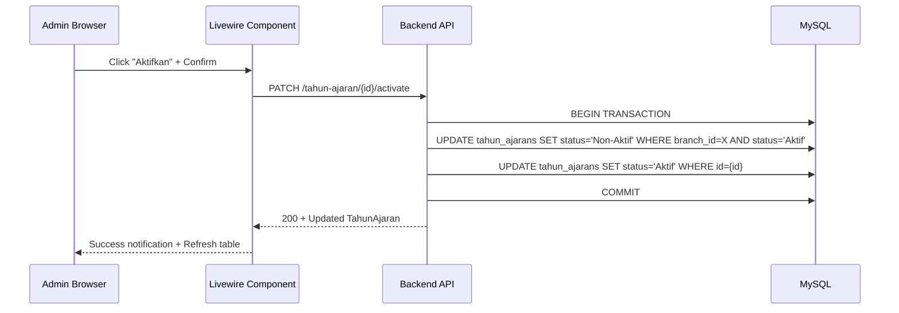
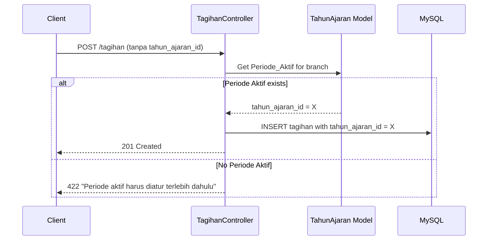
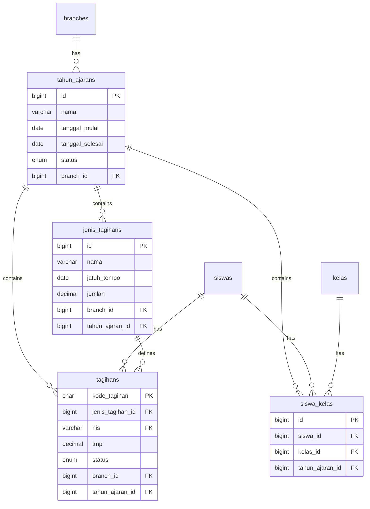

# Design Document: Periode Tahun Ajaran

## Overview

Fitur ini memperkenalkan entitas **TahunAjaran** sebagai fondasi temporal untuk sistem manajemen tagihan sekolah. Desain ini mencakup:

1. **Model & Migration TahunAjaran** — Entitas baru dengan mekanisme aktivasi per branch (hanya satu aktif per branch)
2. **Tabel Pivot SiswaKelas** — Mencatat penempatan kelas siswa per periode, menggantikan relasi langsung `siswas.kelas_id` sebagai sumber utama
3. **Modifikasi Tagihan & JenisTagihan** — Menambahkan foreign key `tahun_ajaran_id` untuk mengaitkan data ke periode
4. **CRUD API & Frontend** — Endpoint RESTful baru dan halaman Livewire/Filament untuk manajemen TahunAjaran
5. **Period Filter** — Dropdown selector pada halaman Tagihan dan JenisTagihan dengan session persistence
6. **Migration Strategy** — Migrasi data existing ke Legacy_Period tanpa kehilangan data

### Key Design Decisions

1. **Single permission "manage-tahun-ajaran"** — Satu permission untuk semua operasi mutasi (create/update/delete/activate). Read tetap terbuka untuk semua authenticated user. Ini menyederhanakan role management.

2. **Nullable FK pada tagihans, NOT NULL pada jenis_tagihans** — Tagihan menggunakan nullable FK karena data legacy mungkin belum ter-assign saat migrasi berjalan bertahap. JenisTagihan menggunakan NOT NULL karena setiap template tagihan harus jelas terikat ke periode.

3. **Denormalized kelas_id tetap dipertahankan** — `siswas.kelas_id` tetap ada untuk backward compatibility. Sinkronisasi otomatis dilakukan saat SiswaKelas untuk Periode_Aktif diubah.

4. **Activation via dedicated endpoint** — Aktivasi menggunakan endpoint terpisah (`PATCH /tahun-ajaran/{id}/activate`) bukan field update biasa, karena melibatkan logic deaktivasi record lain dalam satu transaksi.

5. **Session-based period filter** — Filter periode disimpan di server-side session frontend, bukan di URL query parameter, agar navigasi antar halaman tetap konsisten.

## Architecture



### Request Flow — Aktivasi TahunAjaran



### Request Flow — Auto-assign Periode Aktif pada Tagihan Creation



## Components and Interfaces

### Backend Components

#### 1. `TahunAjaranController` — New Controller

**Routes:**
| Method | URI | Action | Middleware |
|--------|-----|--------|-----------|
| GET | /tahun-ajaran | index | auth:sanctum |
| POST | /tahun-ajaran | store | auth:sanctum, permission:manage-tahun-ajaran |
| GET | /tahun-ajaran/{id} | show | auth:sanctum |
| PUT | /tahun-ajaran/{id} | update | auth:sanctum, permission:manage-tahun-ajaran |
| DELETE | /tahun-ajaran/{id} | destroy | auth:sanctum, permission:manage-tahun-ajaran |
| PATCH | /tahun-ajaran/{id}/activate | activate | auth:sanctum, permission:manage-tahun-ajaran |
| PATCH | /tahun-ajaran/{id}/deactivate | deactivate | auth:sanctum, permission:manage-tahun-ajaran |

**index():**
- Query all TahunAjaran where `branch_id = Auth::user()->branch_id`
- Order by `tanggal_mulai` descending
- Return `TahunAjaranResource::collection()`

**store(TahunAjaranRequest $request):**
- Validate nama format (YYYY/YYYY, second year = first + 1)
- Validate tanggal_mulai < tanggal_selesai
- Validate uniqueness of nama within branch (case-insensitive)
- Set status = "Non-Aktif", branch_id = auth user's branch
- Return 201 with TahunAjaranResource

**update(TahunAjaranRequest $request, $id):**
- Find TahunAjaran by id, verify branch ownership
- Validate same rules as store (excluding self for uniqueness)
- Return 200 with TahunAjaranResource

**destroy($id):**
- Find TahunAjaran by id, verify branch ownership
- Check for associated Tagihan, JenisTagihan, or SiswaKelas records
- If associations exist, return 409 with error message
- Otherwise delete and return `{"data": true}`

**activate($id):**
- Find TahunAjaran by id, verify branch ownership
- If already "Aktif", return current record without changes
- Within DB::transaction:
  - Set all other TahunAjaran in same branch to "Non-Aktif"
  - Set target to "Aktif"
- Return 200 with TahunAjaranResource

**deactivate($id):**
- Find TahunAjaran by id, verify branch ownership
- Set status to "Non-Aktif"
- Return 200 with TahunAjaranResource

#### 2. `TahunAjaranRequest` — Form Request

```php
public function rules(): array
{
    return [
        'nama' => ['required', 'string', 'max:9', 'regex:/^\d{4}\/\d{4}$/'],
        'tanggal_mulai' => ['required', 'date'],
        'tanggal_selesai' => ['required', 'date', 'after:tanggal_mulai'],
    ];
}
```

Custom validation in controller:
- Verify second year = first year + 1
- Verify uniqueness per branch (case-insensitive)

#### 3. `TahunAjaranResource` — API Resource

```php
return [
    'id' => $this->id,
    'nama' => $this->nama,
    'tanggal_mulai' => $this->tanggal_mulai,
    'tanggal_selesai' => $this->tanggal_selesai,
    'status' => $this->status,
    'branch_id' => $this->branch_id,
];
```

#### 4. Modified `TagihanController`

**Changes to `index()`:**
- Add optional `tahun_ajaran_id` query parameter
- If provided: filter by that tahun_ajaran_id (validate branch ownership)
- If not provided and Periode_Aktif exists: filter by Periode_Aktif
- If not provided and no Periode_Aktif: return empty collection

**Changes to `create()`:**
- If `tahun_ajaran_id` not in request: auto-assign Periode_Aktif
- If no Periode_Aktif: return 422 error
- If `tahun_ajaran_id` provided: validate branch ownership

#### 5. Modified `JenisTagihanController`

**Changes to `index()`:**
- Add optional `tahun_ajaran_id` query parameter
- If provided: filter by that tahun_ajaran_id (validate branch ownership)
- If not provided and Periode_Aktif exists: filter by Periode_Aktif
- If not provided and no Periode_Aktif: return empty collection

**Changes to `create()`:**
- If `tahun_ajaran_id` not in request: auto-assign Periode_Aktif
- If no Periode_Aktif: return 422 error
- If `tahun_ajaran_id` provided: validate branch ownership

#### 6. Modified `SiswaController`

**Changes to class assignment logic:**
- When `kelas_id` is provided in create/update:
  - Get Periode_Aktif for user's branch (reject if none)
  - Create/update SiswaKelas record for that period
  - Sync `siswas.kelas_id` to match

**New query parameter:**
- `tahun_ajaran_id` on index/get endpoints to resolve class from SiswaKelas

#### 7. `TahunAjaran` Model — Helper Method

```php
public static function getAktif(int $branchId): ?self
{
    return static::where('branch_id', $branchId)
        ->where('status', 'Aktif')
        ->first();
}
```

### Frontend Components

#### 8. `TahunAjaranManagement` — Livewire Component

**File:** `app/Livewire/TahunAjaranManagement.php`

Implements `HasActions`, `HasSchemas`, `HasTable` (Filament traits).

**Table columns:**
- `nama` — Searchable
- `tanggal_mulai` — Date formatted
- `tanggal_selesai` — Date formatted
- `status` — Badge (green "Aktif", gray "Non-Aktif")

**Actions:**
- Header: "Tambah" button → modal form (nama, tanggal_mulai, tanggal_selesai)
- Row: "Aktifkan" button (visible when status = "Non-Aktif") → confirmation dialog
- Row: "Edit" button → modal form pre-filled
- Row: "Hapus" button → confirmation dialog

**Data source:** `ApiService::client()->get('/tahun-ajaran')`

#### 9. Period Selector Trait — `HasPeriodFilter`

**File:** `app/Livewire/Concerns/HasPeriodFilter.php`

Reusable Livewire trait for pages that need period filtering:

```php
trait HasPeriodFilter
{
    public ?int $selectedTahunAjaranId = null;
    public array $tahunAjaranOptions = [];

    public function mountHasPeriodFilter(): void
    {
        $this->loadTahunAjaranOptions();
        $this->selectedTahunAjaranId = session('selected_tahun_ajaran_id', $this->getAktifId());
        // Validate session value still exists
        if (!collect($this->tahunAjaranOptions)->contains('id', $this->selectedTahunAjaranId)) {
            $this->selectedTahunAjaranId = $this->getAktifId();
            session()->forget('selected_tahun_ajaran_id');
        }
    }

    public function updatedSelectedTahunAjaranId($value): void
    {
        session(['selected_tahun_ajaran_id' => $value]);
        $this->resetTable(); // or equivalent refresh
    }
}
```

#### 10. Modified `JenisTagihan` Livewire Component

- Add `use HasPeriodFilter` trait
- Pass `tahun_ajaran_id` query parameter to API call
- Display period selector dropdown above table
- Show `tahun_ajaran.nama` column in table

#### 11. Modified `TagihanCardView` Livewire Component

- Add `use HasPeriodFilter` trait
- Pass `tahun_ajaran_id` query parameter to grouped endpoint
- Display period selector dropdown in header area

## Data Models

### New Tables

#### `tahun_ajarans`

| Column | Type | Constraints |
|--------|------|-------------|
| id | bigint unsigned | PK, auto-increment |
| nama | varchar(9) | NOT NULL |
| tanggal_mulai | date | NOT NULL |
| tanggal_selesai | date | NOT NULL |
| status | enum('Aktif','Non-Aktif') | NOT NULL, default 'Non-Aktif' |
| branch_id | bigint unsigned | FK → branches.id, NOT NULL |
| created_at | timestamp | nullable |
| updated_at | timestamp | nullable |

**Indexes:**
- UNIQUE(nama, branch_id)
- INDEX(branch_id, status) — for fast lookup of active period per branch

#### `siswa_kelas`

| Column | Type | Constraints |
|--------|------|-------------|
| id | bigint unsigned | PK, auto-increment |
| siswa_id | bigint unsigned | FK → siswas.id, NOT NULL |
| kelas_id | bigint unsigned | FK → kelas.id, NOT NULL |
| tahun_ajaran_id | bigint unsigned | FK → tahun_ajarans.id, NOT NULL |
| created_at | timestamp | nullable |
| updated_at | timestamp | nullable |

**Indexes:**
- UNIQUE(siswa_id, tahun_ajaran_id) — one class per student per period

### Modified Tables

#### `tagihans` — Add Column

| Column | Type | Constraints |
|--------|------|-------------|
| tahun_ajaran_id | bigint unsigned | FK → tahun_ajarans.id, NULLABLE, INDEX |

#### `jenis_tagihans` — Add Column

| Column | Type | Constraints |
|--------|------|-------------|
| tahun_ajaran_id | bigint unsigned | FK → tahun_ajarans.id, NOT NULL (after migration fills existing) |

### Entity Relationship Diagram



### Migration Strategy

Migration akan dijalankan dalam 3 file terpisah:

1. **`create_tahun_ajarans_table`** — Buat tabel tahun_ajarans
2. **`add_tahun_ajaran_id_to_tagihans_and_jenis_tagihans`** — Tambah kolom FK (nullable dulu untuk jenis_tagihans)
3. **`create_siswa_kelas_table_and_migrate_data`** — Buat tabel siswa_kelas + migrasi data legacy

Data migration logic (dalam migration ke-3):
```php
// Per branch:
DB::transaction(function () use ($branch) {
    // 1. Create Legacy_Period
    $tahunAjaran = TahunAjaran::firstOrCreate(
        ['nama' => '2024/2025', 'branch_id' => $branch->id],
        ['tanggal_mulai' => '2024-07-01', 'tanggal_selesai' => '2025-06-30', 'status' => 'Aktif']
    );
    
    // 2. Assign to existing tagihans
    Tagihan::where('branch_id', $branch->id)->whereNull('tahun_ajaran_id')
        ->update(['tahun_ajaran_id' => $tahunAjaran->id]);
    
    // 3. Assign to existing jenis_tagihans
    JenisTagihan::where('branch_id', $branch->id)->whereNull('tahun_ajaran_id')
        ->update(['tahun_ajaran_id' => $tahunAjaran->id]);
    
    // 4. Create SiswaKelas for active students
    $siswas = Siswa::where('branch_id', $branch->id)
        ->where('status', 'Aktif')->whereNotNull('kelas_id')->get();
    foreach ($siswas as $siswa) {
        SiswaKelas::create([...]);
    }
    
    // 5. Skip siswa with null kelas_id (log warning)
});
```

Setelah data migration selesai, migration ke-4 mengubah `jenis_tagihans.tahun_ajaran_id` menjadi NOT NULL.

## Correctness Properties

*A property is a characteristic or behavior that should hold true across all valid executions of a system — essentially, a formal statement about what the system should do. Properties serve as the bridge between human-readable specifications and machine-verifiable correctness guarantees.*

### Property 1: Nama Format Validation

*For any* string input as `nama`, the Backend_API SHALL accept it if and only if it matches the pattern `YYYY/YYYY` where both parts are valid 4-digit years and the second year equals the first year plus one. All other inputs SHALL be rejected with HTTP 422.

**Validates: Requirements 1.2**

### Property 2: Date Range Validation

*For any* pair of dates (tanggal_mulai, tanggal_selesai) provided when creating or updating a TahunAjaran, the Backend_API SHALL accept the pair if and only if tanggal_mulai is strictly earlier than tanggal_selesai. Pairs where tanggal_mulai >= tanggal_selesai SHALL be rejected with HTTP 422.

**Validates: Requirements 1.3**

### Property 3: Branch Data Isolation on Reads

*For any* authenticated user querying TahunAjaran (list or view), all returned records SHALL have `branch_id` equal to the authenticated user's `branch_id`. No records from other branches SHALL ever appear in the response.

**Validates: Requirements 1.6, 10.7**

### Property 4: At Most One Active Per Branch

*For any* branch, after any activation or deactivation operation completes successfully, the count of TahunAjaran records with status "Aktif" for that branch SHALL be at most one. Specifically, after activating a TahunAjaran, exactly one record SHALL be "Aktif" and all others in the same branch SHALL be "Non-Aktif".

**Validates: Requirements 2.1, 2.2**

### Property 5: Deletion Protection

*For any* TahunAjaran that has at least one associated Tagihan, JenisTagihan, or SiswaKelas record, a delete request SHALL be rejected with an error response, and the TahunAjaran record SHALL remain unchanged in the database.

**Validates: Requirements 2.5**

### Property 6: Auto-Assign Periode Aktif on Creation

*For any* Tagihan or JenisTagihan creation request that does not include a `tahun_ajaran_id` (absent or null), when a Periode_Aktif exists for the authenticated user's branch, the system SHALL assign that Periode_Aktif's id as the `tahun_ajaran_id` of the newly created record.

**Validates: Requirements 4.2, 5.2**

### Property 7: Reject Creation Without Periode Aktif

*For any* Tagihan or JenisTagihan creation request that does not include a `tahun_ajaran_id`, when no Periode_Aktif exists for the authenticated user's branch, the Backend_API SHALL reject the request with HTTP 422 and the record SHALL NOT be persisted.

**Validates: Requirements 4.3, 5.3, 9.7**

### Property 8: Branch Validation on Provided TahunAjaran ID

*For any* creation request (Tagihan or JenisTagihan) that explicitly provides a `tahun_ajaran_id`, if the referenced TahunAjaran record's `branch_id` does not match the authenticated user's `branch_id`, the Backend_API SHALL reject the request with HTTP 422 and the record SHALL NOT be persisted.

**Validates: Requirements 4.4, 5.4**

### Property 9: Filter Correctness by TahunAjaran

*For any* query to the Tagihan or JenisTagihan endpoints with a `tahun_ajaran_id` filter parameter, all records in the response SHALL have their `tahun_ajaran_id` equal to the provided filter value. No records from other periods SHALL appear in the response.

**Validates: Requirements 4.5, 5.5**

### Property 10: Unique Class Per Student Per Period

*For any* student (siswa_id) and period (tahun_ajaran_id) combination, the siswa_kelas table SHALL contain at most one record. Attempting to create a second record with the same combination SHALL be rejected with HTTP 422.

**Validates: Requirements 6.2, 6.8**

### Property 11: Class Resolution by Period

*For any* siswa query with a specified tahun_ajaran_id, the returned class information SHALL be resolved from the siswa_kelas record matching that siswa_id and tahun_ajaran_id. If no such record exists, the class SHALL be returned as null.

**Validates: Requirements 6.3, 6.6, 6.9**

### Property 12: Kelas ID Synchronization

*For any* SiswaKelas record that is created or updated where the `tahun_ajaran_id` references the Periode_Aktif of the student's branch, the corresponding `siswas.kelas_id` column SHALL be updated to match the `kelas_id` in the SiswaKelas record within the same database transaction.

**Validates: Requirements 6.5**

### Property 13: Cross-Period Batch Payment

*For any* valid batch payment request containing tagihan from different tahun_ajaran_id values, the Backend_API SHALL process all payments successfully provided all tagihan belong to the authenticated user's branch and none have status "Lunas".

**Validates: Requirements 9.2**

### Property 14: Siswa CRUD Backward Compatibility

*For any* Siswa create or update request that includes a `kelas_id` when a Periode_Aktif exists, the Backend_API SHALL create or update the corresponding SiswaKelas record for the Periode_Aktif, and SHALL synchronize `siswas.kelas_id` to match.

**Validates: Requirements 9.6**

### Property 15: Permission Enforcement on Mutations

*For any* authenticated user without the "manage-tahun-ajaran" permission, all mutation requests (create, update, delete, activate, deactivate) to TahunAjaran endpoints SHALL be rejected with HTTP 403.

**Validates: Requirements 10.2, 10.3**

### Property 16: Read Access Without Manage Permission

*For any* authenticated user (regardless of whether they have "manage-tahun-ajaran" permission), read requests (list and view) to TahunAjaran endpoints SHALL succeed with HTTP 200, returning records scoped to the user's branch.

**Validates: Requirements 10.4**

## Error Handling

### Backend Error Responses

| Scenario | HTTP Status | Response Body |
|----------|-------------|---------------|
| Nama format invalid | 422 | `{"errors": {"nama": ["Format nama harus YYYY/YYYY dengan tahun kedua = tahun pertama + 1."]}}` |
| tanggal_mulai >= tanggal_selesai | 422 | `{"errors": {"tanggal_selesai": ["Tanggal selesai harus setelah tanggal mulai."]}}` |
| Duplicate nama in branch | 422 | `{"errors": {"nama": ["Nama tahun ajaran sudah ada untuk branch ini."]}}` |
| TahunAjaran not found | 404 | `{"errors": {"message": ["Tahun ajaran tidak ditemukan."]}}` |
| Delete with associated data | 409 | `{"errors": {"message": ["Tahun ajaran tidak dapat dihapus karena memiliki data terkait."]}}` |
| No Periode_Aktif on creation | 422 | `{"errors": {"tahun_ajaran_id": ["Periode aktif harus diatur terlebih dahulu."]}}` |
| tahun_ajaran_id branch mismatch | 422 | `{"errors": {"tahun_ajaran_id": ["Tahun ajaran tidak ditemukan atau bukan milik branch Anda."]}}` |
| Duplicate SiswaKelas | 422 | `{"errors": {"siswa_id": ["Siswa sudah memiliki penempatan kelas untuk periode ini."]}}` |
| Permission denied | 403 | `{"errors": {"message": ["Anda tidak memiliki izin untuk melakukan operasi ini."]}}` |
| Branch mismatch on mutation | 403 | `{"errors": {"message": ["Anda tidak memiliki izin untuk melakukan operasi ini."]}}` |
| Server error | 500 | `{"errors": {"message": ["Terjadi kesalahan pada server."]}}` |

### Frontend Error Handling Strategy

1. **Validation errors (422):**
   - Extract first error message from response JSON
   - Display via `Filament\Notifications\Notification::make()->danger()->title($message)->send()`

2. **Conflict errors (409):**
   - Display specific error message about associated data

3. **Permission errors (403):**
   - Display "Anda tidak memiliki izin" notification
   - Should rarely occur since UI hides unauthorized actions

4. **Network/Server errors (500, timeout):**
   - Display generic "Terjadi kesalahan pada server" notification

5. **No active period warning:**
   - Display persistent warning banner at top of relevant pages
   - Banner includes link to TahunAjaran management page

## Testing Strategy

### Property-Based Tests (PHPUnit + Laravel Factories)

**Library:** PHPUnit with Laravel model factories + `Faker` for randomized inputs
**Configuration:** Each property test runs minimum 100 iterations with randomized data

Since the project uses Laravel's built-in PHPUnit and model factories, property tests will use loops with factory-generated data to verify universal properties across many inputs.

**Property tests to implement:**

| Property | Test Focus | Key Generators |
|----------|-----------|----------------|
| 1 | Nama format validation | Random strings, valid/invalid YYYY/YYYY patterns |
| 2 | Date range validation | Random date pairs (valid and invalid) |
| 3 | Branch isolation reads | Multiple branches with TahunAjaran records |
| 4 | One active per branch | Random number of TahunAjaran per branch, random activation sequences |
| 5 | Deletion protection | TahunAjaran with/without associated records |
| 6 | Auto-assign on creation | Tagihan/JenisTagihan without tahun_ajaran_id |
| 7 | Reject without active period | Creation attempts with no active period |
| 8 | Branch validation on FK | Cross-branch tahun_ajaran_id references |
| 9 | Filter correctness | Multiple periods with records, filter by each |
| 10 | Unique student-period | Duplicate siswa_id + tahun_ajaran_id attempts |
| 11 | Class resolution | Siswa with multiple period assignments |
| 12 | Kelas sync | SiswaKelas changes for active period |
| 13 | Cross-period payment | Tagihan from different periods in batch |
| 14 | Siswa CRUD compat | Siswa updates with kelas_id |
| 15 | Permission enforcement | Mutation requests without permission |
| 16 | Read without permission | Read requests from unprivileged users |

**Tag format:** `Feature: periode-tahun-ajaran, Property {N}: {title}`

### Unit Tests (Example-Based)

- TahunAjaran model: fillable fields, casts, relationships
- TahunAjaranRequest: validation rules for nama, dates
- TahunAjaranResource: correct JSON structure
- Activation idempotence: activating already-active returns same record
- Default status: new TahunAjaran has "Non-Aktif"
- Legacy_Period creation logic in migration
- Session filter persistence and invalidation

### Integration Tests

- Full CRUD flow: create → list → update → activate → delete
- Migration: run migration, verify data integrity per branch
- Migration rollback: verify clean removal of all new structures
- Tagihan creation flow with auto-assign
- JenisTagihan creation flow with auto-assign
- SiswaKelas creation and kelas_id sync
- Backward compatibility: existing endpoints unchanged
- Card view integration with period filter

### Frontend Tests (Manual/Browser)

- TahunAjaran management page renders correctly
- Period selector dropdown populates and filters
- Session persistence across page navigation
- Warning banner when no active period
- Permission-based visibility of management page and actions

