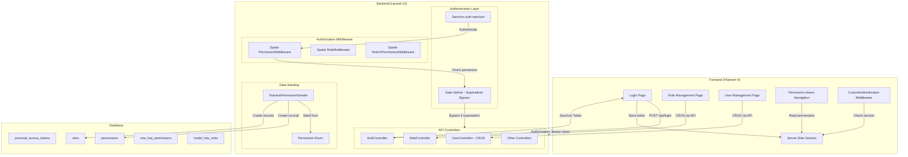
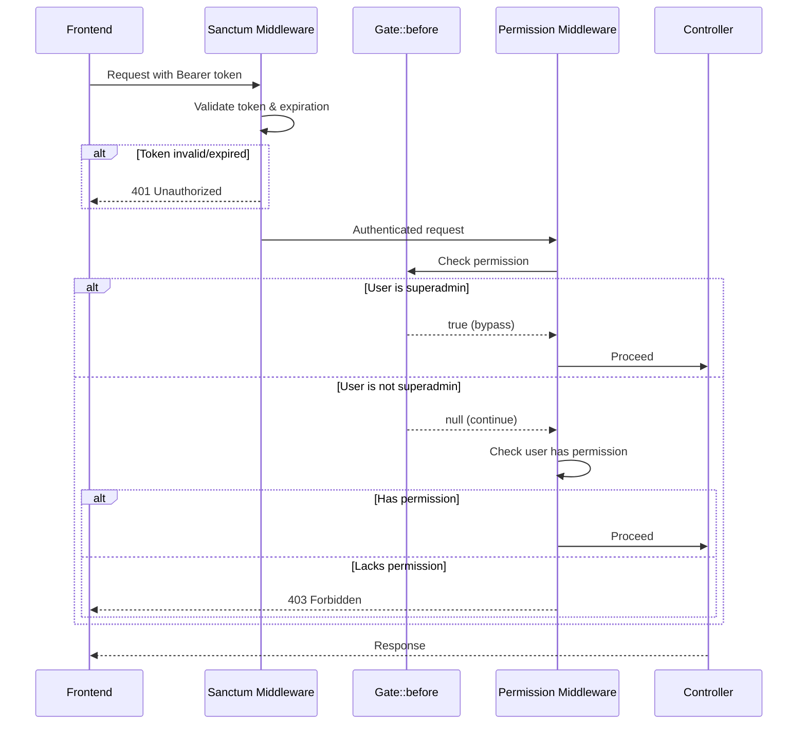

# Design Document: RBAC Improvement

## Overview

This design addresses the comprehensive improvement of the Role-Based Access Control (RBAC) system in the Handayani school management application. The system consists of a Laravel 12 backend API and a Filament 4 frontend panel that communicate via HTTP.

The current implementation has several architectural gaps:
- Permissions are defined in an enum (`App\Enum\Permission`) but never seeded to the database
- Authentication uses insecure plain-text tokens stored in a `token` column on the users table
- Custom middleware (`ApiAuthMiddleware`, `ApiRoleMiddleware`) duplicates spatie's built-in functionality
- Route authorization is role-based only (superadmin/admin), not permission-based
- The frontend has no permission-aware UI rendering
- The `RoleRequest` validation does not verify permissions exist in the database

The improved system will:
1. Seed all permissions from the enum into the database
2. Implement superadmin gate bypass via `Gate::before`
3. Replace custom middleware with spatie's built-in middleware
4. Apply granular permission-based middleware to each route
5. Migrate authentication to Laravel Sanctum tokens with expiration and abilities
6. Strengthen `RoleRequest` validation
7. Add a Filament Role Management page
8. Implement permission-aware UI rendering in the frontend
9. Integrate frontend authentication with Sanctum
10. Provide full CRUD API endpoints for user management with filtering and role sync
11. Add a Filament User Management page with permission-aware UI

## Architecture

### High-Level Architecture



### Request Flow



## Components and Interfaces

### Backend Components

#### 1. RoleAndPermissionSeeder

**Location:** `backend/database/seeders/RoleAndPermissionSeeder.php`

**Responsibility:** Seeds all permissions from the `Permission` enum and creates default roles with their permission assignments.

```php
<?php

namespace Database\Seeders;

use App\Constant\PermissionBinding;
use App\Enum\DefaultRoles;
use App\Enum\Permission;
use Illuminate\Database\Seeder;
use Spatie\Permission\Models\Permission as SpatiePermission;
use Spatie\Permission\Models\Role;
use Spatie\Permission\PermissionRegistrar;

class RoleAndPermissionSeeder extends Seeder
{
    public function run(): void
    {
        // Clear cache before seeding
        app()[PermissionRegistrar::class]->forgetCachedPermissions();

        // Create all permissions from enum
        foreach (Permission::cases() as $permission) {
            SpatiePermission::firstOrCreate(['name' => $permission->value]);
        }

        // Create default roles
        $superadmin = Role::firstOrCreate(['name' => DefaultRoles::SUPERADMIN->value]);
        $admin = Role::firstOrCreate(['name' => DefaultRoles::ADMIN->value]);
        Role::firstOrCreate(['name' => DefaultRoles::USER->value]);

        // Assign all permissions to superadmin
        $superadmin->syncPermissions(
            collect(Permission::cases())->map(fn($p) => $p->value)->toArray()
        );

        // Assign admin permissions from PermissionBinding
        $adminPermissions = collect(PermissionBinding::ADMIN_PERMISSIONS)
            ->flatten()
            ->map(fn($p) => $p->value)
            ->toArray();
        $admin->syncPermissions($adminPermissions);

        // Clear cache after seeding
        app()[PermissionRegistrar::class]->forgetCachedPermissions();
    }
}
```

#### 2. Gate::before Superadmin Bypass

**Location:** `backend/app/Providers/AppServiceProvider.php` (boot method)

**Responsibility:** Registers a `Gate::before` callback that returns `true` for superadmin users, bypassing all permission checks.

```php
use App\Enum\DefaultRoles;
use Illuminate\Support\Facades\Gate;

public function boot(): void
{
    Gate::before(function ($user, $ability) {
        if ($user === null) {
            return null;
        }
        return $user->hasRole(DefaultRoles::SUPERADMIN->value) ? true : null;
    });
}
```

#### 3. Middleware Registration

**Location:** `backend/bootstrap/app.php`

**Responsibility:** Registers spatie middleware aliases and removes custom middleware.

```php
use Spatie\Permission\Middleware\PermissionMiddleware;
use Spatie\Permission\Middleware\RoleMiddleware;
use Spatie\Permission\Middleware\RoleOrPermissionMiddleware;

->withMiddleware(function (Middleware $middleware) {
    $middleware->alias([
        'role' => RoleMiddleware::class,
        'permission' => PermissionMiddleware::class,
        'role_or_permission' => RoleOrPermissionMiddleware::class,
    ]);
})
```

#### 4. AuthController (Sanctum Integration)

**Location:** `backend/app/Http/Controllers/AuthController.php`

**Responsibility:** Issues Sanctum tokens on login with abilities matching user permissions, and revokes tokens on logout.

```php
public function login(UserLoginRequest $request): JsonResponse
{
    $data = $request->validated();
    $user = User::where('username', $data['username'])->first();

    if (!$user || !Hash::check($data['password'], $user->password)) {
        throw new HttpResponseException(response()->json([
            'errors' => ['message' => ['username or password is wrong']]
        ], 401));
    }

    // Check if user already has an active token
    if ($user->tokens()->count() > 0) {
        throw new HttpResponseException(response()->json([
            'errors' => ['message' => ['Akun kamu sedang login di perangkat lain.']]
        ], 401));
    }

    // Gather all permission strings from user's roles
    $abilities = $user->getAllPermissions()->pluck('name')->toArray();

    // Create Sanctum token with abilities and expiration
    $expiration = config('sanctum.expiration', 480);
    $token = $user->createToken(
        'api-token',
        $abilities,
        now()->addMinutes($expiration)
    );

    return response()->json([
        'data' => [
            'id' => $user->id,
            'username' => $user->username,
            'token' => $token->plainTextToken,
            'expires_at' => $token->accessToken->expires_at->toISOString(),
            'permissions' => $abilities,
            'roles' => $user->getRoleNames()->toArray(),
        ]
    ]);
}

public function logout(Request $request): JsonResponse
{
    $request->user()->currentAccessToken()->delete();

    return response()->json(['data' => true]);
}
```

#### 5. Route Definitions with Permission Middleware

**Location:** `backend/routes/api.php`

**Responsibility:** Applies granular permission middleware to each route group.

```php
Route::post("/login", [AuthController::class, "login"]);

Route::middleware('auth:sanctum')->group(function () {
    Route::delete('/logout', [AuthController::class, "logout"]);
    Route::get("/users/current", [UserController::class, "get"]);
    Route::patch('/users/current', [UserController::class, "update"]);

    // Role management — permission-based
    Route::prefix('/roles')->group(function () {
        Route::get('/', [RoleController::class, 'index'])
            ->middleware('permission:view-roles');
        Route::post('/', [RoleController::class, 'store'])
            ->middleware('permission:create-role');
        Route::post('/attach', [RoleController::class, 'attach'])
            ->middleware('permission:attach-role');
        Route::post('/detach', [RoleController::class, 'detach'])
            ->middleware('permission:detach-role');
        Route::get('/permissions', [RoleController::class, 'permissions'])
            ->middleware('permission:view-permissions');
        Route::get('/{id}', [RoleController::class, 'show'])
            ->middleware('permission:view-roles');
        Route::put('/{id}', [RoleController::class, 'update'])
            ->middleware('permission:update-role');
        Route::delete('/{id}', [RoleController::class, 'destroy'])
            ->middleware('permission:delete-role');
    });

    // Siswa routes
    Route::prefix('/siswa')->group(function () {
        Route::get('/{jenjang}', [SiswaController::class, 'index'])
            ->middleware('permission:view-siswa');
        Route::post('/{jenjang}', [SiswaController::class, 'create'])
            ->middleware('permission:create-siswa');
        Route::get('/{jenjang}/{id}', [SiswaController::class, 'get'])
            ->middleware('permission:read-siswa');
        Route::put('/{jenjang}/{id}', [SiswaController::class, 'update'])
            ->middleware('permission:update-siswa');
        Route::delete('/{jenjang}/{id}', [SiswaController::class, 'delete'])
            ->middleware('permission:delete-siswa');
    });

    // Similar pattern for kelas, kategori, pembayaran, pengeluaran, laporan...
});
```

#### 6. UserController (Full CRUD)

**Location:** `backend/app/Http/Controllers/UserController.php`

**Responsibility:** Provides full CRUD operations for user management with pagination, filtering by branch and role, role syncing, and cleanup on deletion.

```php
<?php

namespace App\Http\Controllers;

use App\Http\Requests\UserRequest;
use App\Http\Resources\UserResource;
use App\Models\User;
use Illuminate\Http\Exceptions\HttpResponseException;
use Illuminate\Http\JsonResponse;
use Illuminate\Http\Request;
use Illuminate\Support\Facades\Hash;

class UserController extends Controller
{
    public function index(Request $request)
    {
        $perPage = min((int) $request->query('per_page', 10), 100);

        $query = User::with(['branch', 'roles']);

        if ($request->has('branch_id')) {
            $query->where('branch_id', $request->query('branch_id'));
        }

        if ($request->has('role')) {
            $query->whereHas('roles', function ($q) use ($request) {
                $q->where('name', $request->query('role'));
            });
        }

        $users = $query->paginate($perPage);

        return UserResource::collection($users);
    }

    public function store(UserRequest $request): JsonResponse
    {
        $data = $request->validated();

        $user = User::create([
            'username' => $data['username'],
            'password' => Hash::make($data['password']),
            'branch_id' => $data['branch_id'],
        ]);

        $user->syncRoles($data['roles']);
        $user->load(['branch', 'roles']);

        return response()->json([
            'data' => new UserResource($user)
        ], 201);
    }

    public function show(int $id): UserResource
    {
        $user = User::with(['branch', 'roles'])->find($id);

        if (!$user) {
            throw new HttpResponseException(response()->json([
                'errors' => ['message' => ['User tidak ditemukan.']]
            ], 404));
        }

        return new UserResource($user);
    }

    public function update(UserRequest $request, int $id): UserResource
    {
        $user = User::find($id);

        if (!$user) {
            throw new HttpResponseException(response()->json([
                'errors' => ['message' => ['User tidak ditemukan.']]
            ], 404));
        }

        $data = $request->validated();

        if (isset($data['username'])) {
            $user->username = $data['username'];
        }

        if (isset($data['password'])) {
            $user->password = Hash::make($data['password']);
        }

        if (isset($data['branch_id'])) {
            $user->branch_id = $data['branch_id'];
        }

        $user->save();

        if (isset($data['roles'])) {
            $user->syncRoles($data['roles']);
        }

        $user->load(['branch', 'roles']);

        return new UserResource($user);
    }

    public function destroy(int $id): JsonResponse
    {
        $user = User::find($id);

        if (!$user) {
            throw new HttpResponseException(response()->json([
                'errors' => ['message' => ['User tidak ditemukan.']]
            ], 404));
        }

        // Revoke all Sanctum tokens
        $user->tokens()->delete();

        // Remove all role assignments
        $user->syncRoles([]);

        // Delete user record
        $user->delete();

        return response()->json([
            'data' => true,
            'message' => 'User berhasil dihapus.'
        ]);
    }
}
```

#### 7. UserRequest Validation

**Location:** `backend/app/Http/Requests/UserRequest.php`

**Responsibility:** Validates user creation and update requests with conditional rules based on HTTP method.

```php
<?php

namespace App\Http\Requests;

use Illuminate\Foundation\Http\FormRequest;
use Illuminate\Validation\Rule;

class UserRequest extends FormRequest
{
    public function authorize(): bool
    {
        return true;
    }

    public function rules(): array
    {
        $userId = $this->route('id');

        if ($this->isMethod('POST')) {
            return [
                'username' => 'required|string|max:100|unique:users,username',
                'password' => 'required|string|min:8|max:100',
                'branch_id' => 'required|integer|exists:branches,id',
                'roles' => 'required|array|min:1',
                'roles.*' => 'required|string|exists:roles,name',
            ];
        }

        // PUT/PATCH — all fields optional
        return [
            'username' => [
                'sometimes', 'string', 'max:100',
                Rule::unique('users', 'username')->ignore($userId),
            ],
            'password' => 'sometimes|string|min:8|max:100',
            'branch_id' => 'sometimes|integer|exists:branches,id',
            'roles' => 'sometimes|array|min:1',
            'roles.*' => 'required|string|exists:roles,name',
        ];
    }
}
```

#### 8. User Management Routes

**Location:** `backend/routes/api.php` (within the `auth:sanctum` middleware group)

**Responsibility:** Defines user CRUD routes with granular permission middleware.

```php
// User management routes
Route::prefix('/users')->group(function () {
    Route::get('/', [UserController::class, 'index'])
        ->middleware('permission:view-user');
    Route::post('/', [UserController::class, 'store'])
        ->middleware('permission:create-user');
    Route::get('/{id}', [UserController::class, 'show'])
        ->middleware('permission:read-user')
        ->where('id', '[0-9]+');
    Route::put('/{id}', [UserController::class, 'update'])
        ->middleware('permission:update-user')
        ->where('id', '[0-9]+');
    Route::delete('/{id}', [UserController::class, 'destroy'])
        ->middleware('permission:delete-user')
        ->where('id', '[0-9]+');
});
```

> **Note:** The existing `GET /users/current` and `PATCH /users/current` routes for the authenticated user's own profile remain unchanged and are placed before this group to avoid route conflicts.

#### 9. Improved RoleRequest

**Location:** `backend/app/Http/Requests/RoleRequest.php`

```php
<?php

namespace App\Http\Requests;

use Illuminate\Foundation\Http\FormRequest;

class RoleRequest extends FormRequest
{
    public function authorize(): bool
    {
        return true;
    }

    public function rules(): array
    {
        return [
            'name' => 'required|string|min:1|max:255',
            'permissions' => 'required|array|min:1',
            'permissions.*' => 'required|string|exists:permissions,name',
        ];
    }
}
```

### Frontend Components

#### 10. Role Management Page

**Location:** `frontend-v2/app/Filament/Pages/RoleManagement.php`

**Responsibility:** Provides CRUD interface for roles with permission checkboxes grouped by domain.

The page will:
- Display a table of roles with their assigned permissions
- Provide create/edit forms with permission checkboxes grouped by domain
- Send API requests to the backend for CRUD operations
- Handle error responses (duplicate name, not found)

#### 11. User Management Page

**Location:** `frontend-v2/app/Filament/Pages/UserManagement.php`

**Responsibility:** Provides CRUD interface for users with branch selection and role assignment, placed in the same navigation group as Role Management.

The page will:
- Display a table of users with username, branch location, and assigned role names
- Provide create form with username, password, branch dropdown, and role checkboxes
- Provide edit form with username, optional password, branch dropdown, and role checkboxes
- Send API requests to the backend for CRUD operations
- Handle error responses (duplicate username, user not found, server errors)
- Conditionally show/hide create, edit, and delete buttons based on session permissions
- Hide the navigation item if the user lacks `view-user` permission
- Redirect to 403 if accessed directly without `view-user` permission

```php
<?php

namespace App\Filament\Pages;

use Filament\Pages\Page;

class UserManagement extends Page
{
    protected static ?string $navigationIcon = 'heroicon-o-users';
    protected static ?string $navigationGroup = 'Manajemen Akses';
    protected static ?int $navigationSort = 2;
    protected static ?string $title = 'Manajemen User';
    protected static string $view = 'filament.pages.user-management';

    public static function shouldRegisterNavigation(): bool
    {
        return in_array('view-user', session()->get('data.permissions', []));
    }

    public function mount(): void
    {
        if (!in_array('view-user', session()->get('data.permissions', []))) {
            abort(403);
        }
    }

    public function canCreate(): bool
    {
        return in_array('create-user', session()->get('data.permissions', []));
    }

    public function canEdit(): bool
    {
        return in_array('update-user', session()->get('data.permissions', []));
    }

    public function canDelete(): bool
    {
        return in_array('delete-user', session()->get('data.permissions', []));
    }
}
```

#### 12. Permission-Aware Navigation (AdminPanelProvider)

**Location:** `frontend-v2/app/Providers/Filament/AdminPanelProvider.php`

**Responsibility:** Conditionally renders navigation items based on permissions stored in the session.

```php
NavigationItem::make()
    ->label('Siswa')
    ->visible(fn(): bool => in_array('view-siswa', session()->get('data.permissions', [])))
    ->url(fn(): string => DataMasterSiswa::getUrl()),
```

#### 13. Frontend Auth Integration

**Location:** `frontend-v2/app/Filament/Pages/Auth/Login.php`

**Responsibility:** Authenticates against the backend API, stores the Sanctum token and permissions in the server-side session.

The login flow stores:
- `data.token` — the Sanctum bearer token
- `data.permissions` — array of permission strings
- `data.roles` — array of role names
- `data.id` — user ID
- `data.username` — username

The `CustomAuthentication` middleware checks for a valid session token before allowing access to panel pages.

### API Contracts

#### Login

```
POST /api/login
Request:  { "username": string, "password": string }
Response: {
  "data": {
    "id": int,
    "username": string,
    "token": string,
    "expires_at": string (ISO 8601),
    "permissions": string[],
    "roles": string[]
  }
}
Error 401: { "errors": { "message": [string] } }
```

#### Logout

```
DELETE /api/logout
Headers: Authorization: Bearer {token}
Response: { "data": true }
Error 401: { "errors": { "message": ["unauthorized."] } }
```

#### Roles CRUD

```
GET    /api/roles                → List roles (requires: view-roles)
POST   /api/roles                → Create role (requires: create-role)
GET    /api/roles/{id}           → Show role (requires: view-roles)
PUT    /api/roles/{id}           → Update role (requires: update-role)
DELETE /api/roles/{id}           → Delete role (requires: delete-role)
POST   /api/roles/attach         → Attach role to user (requires: attach-role)
POST   /api/roles/detach         → Detach role from user (requires: detach-role)
GET    /api/roles/permissions    → List all permissions (requires: view-permissions)
```

#### Users CRUD

```
GET    /api/users                → List users, paginated (requires: view-user)
POST   /api/users                → Create user (requires: create-user)
GET    /api/users/{id}           → Show user (requires: read-user)
PUT    /api/users/{id}           → Update user (requires: update-user)
DELETE /api/users/{id}           → Delete user (requires: delete-user)
```

**List Users — GET /api/users**

```
Query Parameters:
  per_page: int (default: 10, max: 100)
  branch_id: int (optional — filter by branch)
  role: string (optional — filter by role name)

Response 200:
{
  "data": [
    {
      "id": int,
      "username": string,
      "branch": { "id": int, "location": string },
      "roles": [string]
    }
  ],
  "links": { "first": string, "last": string, "prev": string|null, "next": string|null },
  "meta": { "current_page": int, "last_page": int, "per_page": int, "total": int }
}
```

**Create User — POST /api/users**

```
Request:
{
  "username": string (max 100),
  "password": string (min 8, max 100),
  "branch_id": int (must exist in branches table),
  "roles": [string] (min 1, each must exist in roles table)
}

Response 201:
{
  "data": {
    "id": int,
    "username": string,
    "branch": { "id": int, "location": string },
    "roles": [string]
  }
}

Error 422: { "errors": { "username": ["The username has already been taken."], ... } }
```

**Show User — GET /api/users/{id}**

```
Response 200:
{
  "data": {
    "id": int,
    "username": string,
    "branch": { "id": int, "location": string },
    "roles": [string]
  }
}

Error 404: { "errors": { "message": ["User tidak ditemukan."] } }
```

**Update User — PUT /api/users/{id}**

```
Request (all fields optional):
{
  "username": string (max 100, unique except self),
  "password": string (min 8, max 100),
  "branch_id": int (must exist in branches table),
  "roles": [string] (min 1, each must exist in roles table)
}

Response 200:
{
  "data": {
    "id": int,
    "username": string,
    "branch": { "id": int, "location": string },
    "roles": [string]
  }
}

Error 404: { "errors": { "message": ["User tidak ditemukan."] } }
Error 422: { "errors": { "username": ["The username has already been taken."], ... } }
```

**Delete User — DELETE /api/users/{id}**

```
Response 200:
{
  "data": true,
  "message": "User berhasil dihapus."
}

Error 404: { "errors": { "message": ["User tidak ditemukan."] } }
```

#### Error Responses

```
403 Forbidden:
{ "errors": { "message": ["Akses ditolak. Permission yang dibutuhkan: {permission}"] } }

401 Unauthorized:
{ "errors": { "message": ["unauthorized."] } }

422 Validation Error:
{ "errors": { "permissions.0": ["The selected permissions.0 is invalid."] } }
```

## Data Models

### Database Schema

#### personal_access_tokens (Sanctum — replaces plain-text token column)

| Column | Type | Description |
|--------|------|-------------|
| id | bigint (PK) | Auto-increment |
| tokenable_type | string | Model class (App\Models\User) |
| tokenable_id | bigint | User ID |
| name | string | Token name (e.g., "api-token") |
| token | string(64) | SHA-256 hash of the token |
| abilities | text (JSON) | Array of permission strings |
| expires_at | timestamp | Token expiration time |
| last_used_at | timestamp | Last usage timestamp |
| created_at | timestamp | Creation timestamp |
| updated_at | timestamp | Update timestamp |

#### permissions (Spatie)

| Column | Type | Description |
|--------|------|-------------|
| id | bigint (PK) | Auto-increment |
| name | string | Permission name (e.g., "view-siswa") |
| guard_name | string | Guard name ("web") |
| created_at | timestamp | Creation timestamp |
| updated_at | timestamp | Update timestamp |

#### roles (Spatie)

| Column | Type | Description |
|--------|------|-------------|
| id | bigint (PK) | Auto-increment |
| name | string | Role name (e.g., "superadmin") |
| guard_name | string | Guard name ("web") |
| created_at | timestamp | Creation timestamp |
| updated_at | timestamp | Update timestamp |

#### role_has_permissions (Spatie pivot)

| Column | Type | Description |
|--------|------|-------------|
| permission_id | bigint (FK) | References permissions.id |
| role_id | bigint (FK) | References roles.id |

#### model_has_roles (Spatie pivot)

| Column | Type | Description |
|--------|------|-------------|
| role_id | bigint (FK) | References roles.id |
| model_type | string | Model class |
| model_id | bigint | Model ID |

### User Model Changes

The `User` model must:
1. Use `Laravel\Sanctum\HasApiTokens` trait
2. Remove the `token` column from `$fillable`
3. Implement `HasApiTokens` for Sanctum token management

```php
use Illuminate\Database\Eloquent\Factories\HasFactory;
use Illuminate\Foundation\Auth\User as Authenticatable;
use Laravel\Sanctum\HasApiTokens;
use Spatie\Permission\Traits\HasRoles;

class User extends Authenticatable
{
    use HasFactory, HasRoles, HasApiTokens;

    protected $fillable = ['username', 'password', 'branch_id'];
    protected $hidden = ['password'];
    // ...
}
```

### Migration: Remove token column

```php
Schema::table('users', function (Blueprint $table) {
    $table->dropColumn('token');
});
```

### Updated UserResource

The `UserResource` must be updated to include branch information and role names for the user management endpoints:

```php
<?php

namespace App\Http\Resources;

use Illuminate\Http\Request;
use Illuminate\Http\Resources\Json\JsonResource;

class UserResource extends JsonResource
{
    public function toArray(Request $request): array
    {
        return [
            'id' => $this->id,
            'username' => $this->username,
            'branch' => $this->whenLoaded('branch', fn() => [
                'id' => $this->branch->id,
                'location' => $this->branch->location,
            ]),
            'roles' => $this->whenLoaded('roles', fn() => $this->getRoleNames()->toArray()),
        ];
    }
}
```

### Permission Domain Grouping (for UI)

Permissions are grouped by domain for the Filament Role Management page:

| Domain | Permissions |
|--------|------------|
| Users | view-user, create-user, read-user, update-user, delete-user |
| Siswa | view-siswa, create-siswa, read-siswa, update-siswa, delete-siswa |
| Kelas | view-kelas, create-kelas, read-kelas, update-kelas, delete-kelas |
| Kategori | view-kategori, create-kategori, read-kategori, update-kategori, delete-kategori |
| Pembayaran | view-pembayaran, delete-pembayaran, print-kwitansi |
| Pengeluaran | view-pengeluaran, create-pengeluaran, read-pengeluaran, update-pengeluaran, delete-pengeluaran |
| Laporan | view-kas-harian, view-rekap-bulanan, export-laporan |
| Roles | view-roles, create-role, update-role, delete-role, attach-role, detach-role, view-permissions, attach-permissions, detach-permissions |


## Correctness Properties

*A property is a characteristic or behavior that should hold true across all valid executions of a system — essentially, a formal statement about what the system should do. Properties serve as the bridge between human-readable specifications and machine-verifiable correctness guarantees.*

### Property 1: Seeder Idempotency

*For any* number of executions N ≥ 1, running the RoleAndPermissionSeeder N times SHALL produce the same database state (same number of permissions, same number of roles, same role-permission assignments) as running it exactly once.

**Validates: Requirements 1.5**

### Property 2: Superadmin Gate Bypass

*For any* user and *any* ability string, the Gate::before callback SHALL return `true` if and only if the user has the superadmin role; otherwise it SHALL return `null`.

**Validates: Requirements 2.1, 2.2**

### Property 3: Route Authorization Permission Enforcement

*For any* API route protected by a permission middleware and *any* authenticated user, the request SHALL be allowed (2xx response) if and only if the user possesses the required permission for that route; otherwise the request SHALL be rejected with a 403 status code.

**Validates: Requirements 3.5, 4.1, 4.2, 4.3, 4.4, 4.5, 4.6, 4.7, 4.8, 5.8**

### Property 4: Invalid Token Rejection

*For any* string that is not a valid, non-expired Sanctum token, a request to any authenticated endpoint using that string as the Authorization header SHALL receive a 401 HTTP response.

**Validates: Requirements 5.5**

### Property 5: Token Abilities Match User Permissions

*For any* user with any set of roles and permissions, when a Sanctum token is issued at login, the token's abilities array SHALL contain exactly the same set of permission strings as the user's combined role and direct permissions at the time of token creation.

**Validates: Requirements 5.7**

### Property 6: RoleRequest Validation Rejects Invalid Permissions

*For any* array of permission strings submitted in a role creation/update request, the request SHALL pass validation if and only if every string in the array exists as a permission name in the permissions database table, the array is non-empty, and each element is a non-empty string.

**Validates: Requirements 6.1, 6.2, 6.3, 6.4**

### Property 7: UI Element Visibility Matches Session Permissions

*For any* Filament page navigation item or action button with a required permission, the element SHALL be visible if and only if the user's session permissions array contains that required permission string.

**Validates: Requirements 8.2, 8.3, 8.4, 8.5**

### Property 8: Direct URL Access Denied Without Permission

*For any* Filament page URL that requires a specific view permission, if a user navigates directly to that URL without the required permission in their session, the system SHALL redirect to a 403 Forbidden page.

**Validates: Requirements 8.6**

### Property 9: Frontend API Requests Include Authorization Header

*For any* API request made by the Frontend to the Backend after successful login, the request SHALL include an `Authorization: Bearer {token}` header where `{token}` is the Sanctum token stored in the server-side session.

**Validates: Requirements 9.4**

### Property 10: User List Pagination

*For any* valid per_page value between 1 and 100, the user list endpoint SHALL return at most per_page users per page, and the default page size SHALL be 10 when per_page is not specified.

**Validates: Requirements 10.1**

### Property 11: Branch Filter Returns Only Matching Users

*For any* set of users across multiple branches and *any* valid branch_id filter, the user list endpoint SHALL return only users whose branch_id matches the filter parameter — no user in the response SHALL belong to a different branch.

**Validates: Requirements 10.2**

### Property 12: Role Filter Returns Only Matching Users

*For any* set of users with various role assignments and *any* valid role name filter, the user list endpoint SHALL return only users who have that role assigned — no user in the response SHALL lack the specified role.

**Validates: Requirements 10.3**

### Property 13: User CRUD Round-Trip

*For any* valid user creation payload (username, password, branch_id, roles), creating the user and then retrieving it via the show endpoint SHALL return the same username, branch, and role assignments that were provided at creation time.

**Validates: Requirements 10.4, 10.8**

### Property 14: Username Uniqueness Enforcement

*For any* existing username in the system, attempting to create a new user with that same username SHALL return a 422 validation error, and attempting to update a different user's username to that value SHALL also return a 422 validation error.

**Validates: Requirements 10.5, 10.11**

### Property 15: Role Sync Matches Provided Array

*For any* user and *any* valid roles array provided in an update request, after the update completes, the user's assigned roles SHALL be exactly the set of roles in the provided array — no more, no less.

**Validates: Requirements 10.12**

### Property 16: User Deletion Cleanup

*For any* user with Sanctum tokens and role assignments, after deletion the system SHALL have zero tokens associated with that user, zero role assignments for that user, and the user record SHALL no longer exist in the database.

**Validates: Requirements 10.13**

## Error Handling

### Backend Error Handling

| Scenario | HTTP Status | Response Body |
|----------|-------------|---------------|
| Missing/invalid/expired token | 401 | `{"errors": {"message": ["unauthorized."]}}` |
| User lacks required permission | 403 | `{"errors": {"message": ["Akses ditolak. Permission yang dibutuhkan: {permission}"]}}` |
| User lacks required role | 403 | `{"errors": {"message": ["Akses ditolak. Role yang dibutuhkan: {role}"]}}` |
| Invalid credentials | 401 | `{"errors": {"message": ["username or password is wrong"]}}` |
| Account logged in elsewhere | 401 | `{"errors": {"message": ["Akun kamu sedang login di perangkat lain."]}}` |
| Validation failure | 422 | `{"errors": {"field": ["validation message"]}}` |
| Role name already exists | 400 | `{"errors": {"message": ["Role dengan nama tersebut sudah ada."]}}` |
| Role not found | 400 | `{"errors": {"message": ["Role tidak ditemukan."]}}` |
| User not found | 404 | `{"errors": {"message": ["User tidak ditemukan."]}}` |
| Duplicate username | 422 | `{"errors": {"username": ["The username has already been taken."]}}` |
| Invalid branch_id | 422 | `{"errors": {"branch_id": ["The selected branch id is invalid."]}}` |
| Invalid role name | 422 | `{"errors": {"roles.0": ["The selected roles.0 is invalid."]}}` |

### Frontend Error Handling

| Scenario | Behavior |
|----------|----------|
| Backend API unreachable during login | Display error notification, deny access |
| Backend returns 401 on login | Display error message from API response |
| Rate limit exceeded (5 attempts) | Display rate-limit notification with wait time |
| Backend returns error on role CRUD | Display error notification, preserve form state |
| Backend returns error on user CRUD | Display error notification, preserve form state |
| Backend returns 404 on user edit/delete | Display error notification, close form/modal |
| Backend returns 422 (duplicate username) | Display validation error notification, preserve form |
| Session token missing/null | Redirect to login page |
| Permission check fails for direct URL | Redirect to 403 Forbidden page |

### Sanctum Token Expiration Handling

When a token expires mid-session:
1. The next API request from the frontend receives a 401 response
2. The frontend's HTTP client detects the 401
3. The frontend clears the session and redirects to the login page
4. The user must re-authenticate to obtain a new token

### Seeder Error Handling

The seeder uses `firstOrCreate` for both permissions and roles, which:
- Returns the existing record if it already exists (no duplicate creation)
- Creates a new record only if it doesn't exist
- Never throws an exception for duplicate entries
- Cache is cleared both before and after to ensure consistency

## Testing Strategy

### Unit Tests (PHPUnit — Backend)

Unit tests cover specific examples and edge cases:

1. **Seeder Tests**
   - Verify all Permission enum values are seeded
   - Verify default roles are created
   - Verify admin role has correct permissions
   - Verify superadmin role has all permissions

2. **Gate Bypass Tests**
   - Superadmin user passes any gate check
   - Non-superadmin user falls through to normal evaluation
   - Null user returns null

3. **AuthController Tests**
   - Successful login returns token and expiration
   - Invalid credentials return 401
   - Already-logged-in user returns 401
   - Logout revokes token
   - Expired token returns 401

4. **RoleRequest Validation Tests**
   - Valid request passes
   - Empty permissions array fails
   - Non-existent permission name fails
   - Missing name field fails

5. **Route Authorization Tests**
   - Unauthenticated request returns 401
   - Authenticated user with permission gets 200
   - Authenticated user without permission gets 403

6. **UserController Tests**
   - List users returns paginated results with correct fields
   - List users with branch_id filter returns only matching users
   - List users with role filter returns only matching users
   - Create user with valid data returns 201 and correct resource
   - Create user with duplicate username returns 422
   - Create user with invalid branch_id returns 422
   - Create user with invalid role name returns 422
   - Show user returns correct data
   - Show non-existent user returns 404
   - Update user with partial fields updates only those fields
   - Update user with duplicate username returns 422
   - Update user with roles array syncs roles correctly
   - Delete user revokes tokens, removes roles, deletes record
   - Delete non-existent user returns 404

7. **UserRequest Validation Tests**
   - Valid create request passes
   - Missing username fails
   - Username exceeding 100 chars fails
   - Password below 8 chars fails
   - Missing branch_id fails
   - Empty roles array fails
   - Non-existent role name fails
   - Update request with no fields passes (all optional)

### Property-Based Tests (PHPUnit with custom generators — Backend)

Property-based tests verify universal properties across many generated inputs. Each test runs a minimum of 100 iterations.

**Library:** Custom property test helpers using PHPUnit with randomized data generation via Laravel's `fake()` and custom generators.

1. **Seeder Idempotency Property**
   - Tag: `Feature: rbac-improvement, Property 1: Seeder idempotency`
   - Generate random N (1-5), run seeder N times, verify DB state matches single-run state

2. **Gate Bypass Property**
   - Tag: `Feature: rbac-improvement, Property 2: Superadmin gate bypass`
   - Generate random ability strings, verify gate returns true for superadmin, null for others

3. **Route Authorization Property**
   - Tag: `Feature: rbac-improvement, Property 3: Route authorization permission enforcement`
   - Generate random permission subsets for users, verify access matches permission presence

4. **Token Abilities Property**
   - Tag: `Feature: rbac-improvement, Property 5: Token abilities match user permissions`
   - Create users with random role/permission combinations, verify token abilities match

5. **RoleRequest Validation Property**
   - Tag: `Feature: rbac-improvement, Property 6: RoleRequest validation rejects invalid permissions`
   - Generate random permission arrays (mix of valid DB names and random strings), verify validation outcome matches expectation

6. **User List Pagination Property**
   - Tag: `Feature: rbac-improvement, Property 10: User list pagination`
   - Generate random per_page values (1-100), verify response contains at most per_page items

7. **Branch Filter Property**
   - Tag: `Feature: rbac-improvement, Property 11: Branch filter returns only matching users`
   - Create users across multiple branches, filter by random branch_id, verify all returned users match

8. **Role Filter Property**
   - Tag: `Feature: rbac-improvement, Property 12: Role filter returns only matching users`
   - Create users with various roles, filter by random role name, verify all returned users have that role

9. **User CRUD Round-Trip Property**
   - Tag: `Feature: rbac-improvement, Property 13: User CRUD round-trip`
   - Generate random valid user data, create user, retrieve via show, verify data matches

10. **Username Uniqueness Property**
    - Tag: `Feature: rbac-improvement, Property 14: Username uniqueness enforcement`
    - Generate random usernames, create user, attempt duplicate create/update, verify 422

11. **Role Sync Property**
    - Tag: `Feature: rbac-improvement, Property 15: Role sync matches provided array`
    - Create user with random roles, update with different random roles, verify exact match

12. **User Deletion Cleanup Property**
    - Tag: `Feature: rbac-improvement, Property 16: User deletion cleanup`
    - Create users with tokens and roles, delete, verify all associated data is removed

### Frontend Tests (Pest — Frontend)

1. **Login Flow Tests**
   - Successful login stores token and permissions in session
   - Failed login displays error without session
   - Rate limiting after 5 attempts

2. **Permission-Aware UI Tests**
   - Navigation visibility matches session permissions
   - Action button visibility matches session permissions
   - Direct URL access without permission redirects to 403

3. **Logout Flow Tests**
   - Logout sends DELETE to backend
   - Session is cleared after logout
   - User is redirected to login

4. **User Management Page Tests**
   - Table displays users with username, branch, and roles
   - Create form sends correct POST payload
   - Edit form sends PUT with updated fields, omits empty password
   - Delete action sends DELETE request
   - Duplicate username error displays notification and preserves form
   - User not found error displays notification
   - Navigation item hidden without view-user permission
   - Create button hidden without create-user permission
   - Edit button hidden without update-user permission
   - Delete button hidden without delete-user permission
   - Direct URL access without view-user redirects to 403
   - Server error displays error notification and preserves form

### Integration Tests

1. **End-to-End Auth Flow**
   - Login → access protected route → logout → verify token revoked

2. **Permission Change Propagation**
   - Assign permission → verify access → remove permission → verify denial

3. **Frontend-Backend Integration**
   - Frontend login → store token → make API calls with token → verify responses

4. **User Management End-to-End**
   - Create user → list users (verify appears) → update user → show user (verify changes) → delete user → show user (verify 404)
   - Create user → assign roles → verify role filter works → delete user → verify tokens revoked
