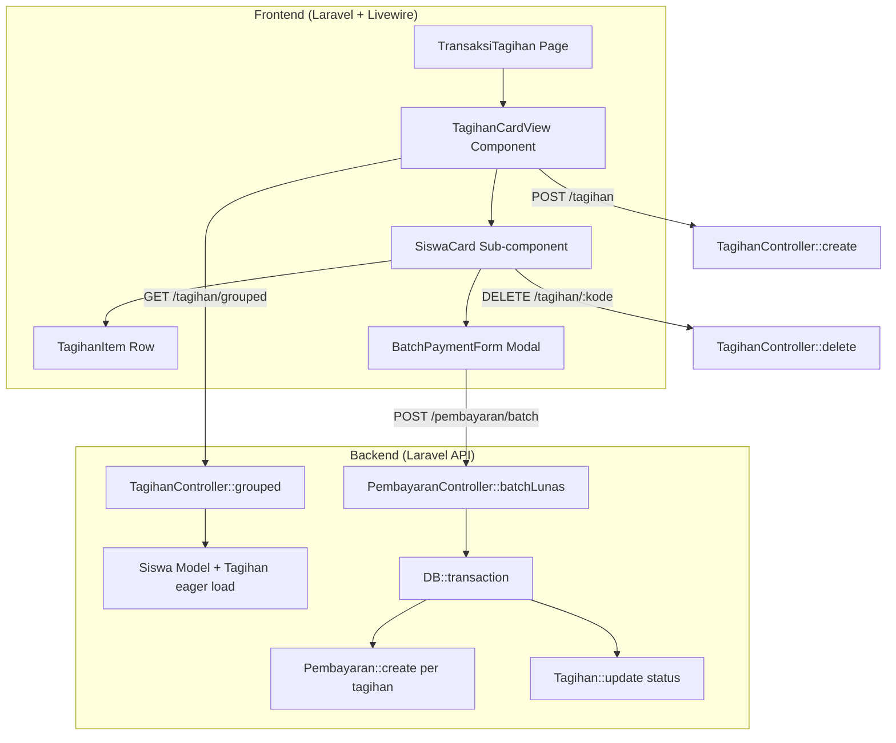
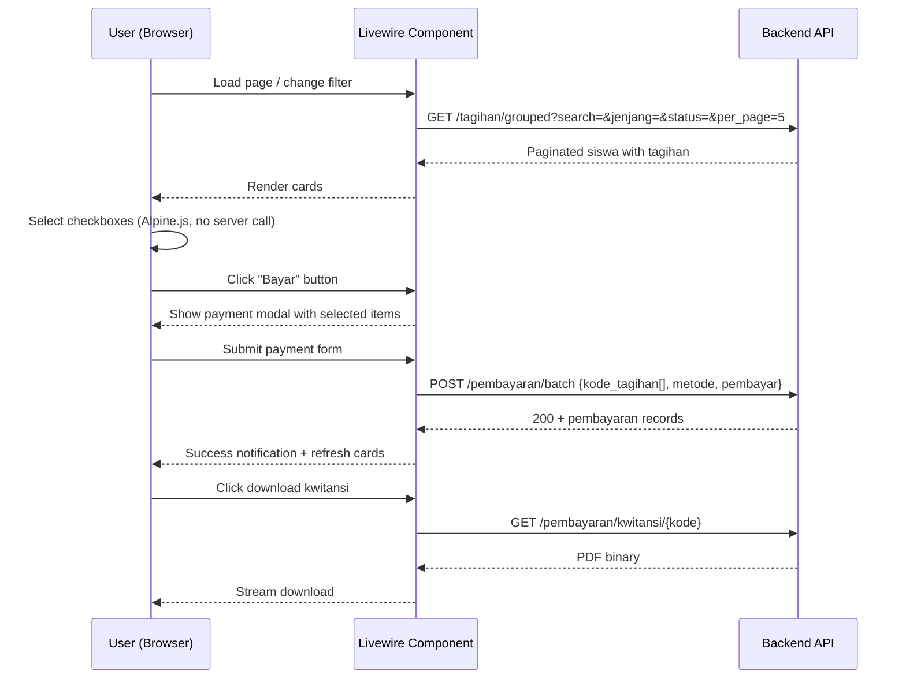

# Design Document: Tagihan Card View

## Overview

This design transforms the tagihan (billing) page from a flat Filament table into a card-based layout grouped by student. The architecture introduces:

1. **New backend endpoint** (`GET /tagihan/grouped`) that returns tagihan data pre-grouped by siswa with pagination at the siswa level
2. **New backend endpoint** (`POST /pembayaran/batch`) that processes multiple full payments in a single database transaction
3. **New Livewire component** (`TagihanCardView`) replacing the existing table-based `Tagihan` component with a card-based UI
4. **Role-based view switching** — admin/operator users see all students with batch payment controls; siswa/wali users see only their own bills in read-only mode

The existing single-payment endpoints remain unchanged for backward compatibility.

## Architecture



### Key Design Decisions

1. **Grouping at the API level** — The backend returns data already grouped by siswa rather than having the frontend group flat tagihan records. This reduces frontend complexity and enables proper pagination by siswa count.

2. **Livewire component without Filament Table** — The card view cannot use Filament's `InteractsWithTable` trait since it's not a table. Instead, we use a standard Livewire component with Alpine.js for client-side interactivity (checkbox selection, total calculation).

3. **Batch payment is always "lunas"** — The batch endpoint pays each selected tagihan in full (remaining balance). Partial batch payments add complexity without clear user value. Individual partial payments remain available via the existing `/pembayaran/bayar/{kode}` endpoint.

4. **Single Livewire component with role-based rendering** — Rather than two separate components, `TagihanCardView` detects the user role and conditionally renders admin controls or read-only student view.

## Components and Interfaces

### Backend Components

#### 1. `TagihanController::grouped()` — New Endpoint

**Route:** `GET /tagihan/grouped`  
**Middleware:** `auth:sanctum`, `permission:view-tagihan`

**Query Parameters:**
| Parameter | Type | Required | Description |
|-----------|------|----------|-------------|
| search | string | No | Partial match on siswa nama or NIS |
| jenjang | string | No | Exact match: "TK", "KB", "MI" |
| status | string | No | Exact match: "Lunas", "Belum Lunas", "Belum Dibayar" |
| per_page | int | No | Items per page (default: 10, max: 100) |
| page | int | No | Page number (default: 1) |

**Response Structure:**
```json
{
  "data": [
    {
      "nis": "12345",
      "nama": "Ahmad Fauzi",
      "jenjang": "MI",
      "kelas": { "id": 1, "nama": "6A" },
      "tagihan": [
        {
          "kode_tagihan": "TAG-2501-0001",
          "jenis_tagihan": {
            "id": 1,
            "nama": "SPP Januari",
            "jumlah": 500000,
            "jatuh_tempo": "2025-01-15"
          },
          "tmp": 200000,
          "status": "Belum Lunas"
        }
      ]
    }
  ],
  "meta": {
    "current_page": 1,
    "last_page": 3,
    "per_page": 10,
    "total": 25
  }
}
```

**Logic:**
1. Query `Siswa` model with `whereHas('tagihan')` to only include students with bills
2. Apply search filter on `nama` and `nis`
3. Apply jenjang filter on `siswa.jenjang`
4. Apply status filter via `whereHas('tagihan', fn($q) => $q->where('status', $status))`
5. For non-admin users, filter by `nis = auth()->user()->username`
6. Scope to `branch_id = auth()->user()->branch_id`
7. Paginate at siswa level
8. Eager load `tagihan.jenis_tagihan` and `kelas` for each siswa
9. Sort siswa alphabetically by `nama`

#### 2. `PembayaranController::batchLunas()` — New Endpoint

**Route:** `POST /pembayaran/batch`  
**Middleware:** `auth:sanctum`, `permission:view-pembayaran`

**Request Body:**
```json
{
  "kode_tagihan": ["TAG-2501-0001", "TAG-2501-0002"],
  "metode": "Tunai",
  "pembayar": "Bapak Ahmad"
}
```

**Validation Rules:**
| Field | Rules |
|-------|-------|
| kode_tagihan | required, array, min:1, max:50 |
| kode_tagihan.* | required, string, exists:tagihans,kode_tagihan |
| metode | required, in:Tunai,Non-Tunai |
| pembayar | required, string, max:100 |

**Logic:**
1. Validate request
2. Verify all tagihan belong to user's `branch_id`
3. Verify none of the tagihan have status "Lunas"
4. Wrap in `DB::transaction`:
   - For each `kode_tagihan`:
     - Load tagihan with `jenis_tagihan`
     - Calculate `jumlah = jenis_tagihan.jumlah - tagihan.tmp`
     - Create `Pembayaran` record with generated `kode_pembayaran`
     - Update tagihan: `status = 'Lunas'`, `tmp = jenis_tagihan.jumlah`
5. Return created pembayaran records with `PembayaranResource`

**Response (200):**
```json
{
  "data": [
    {
      "kode_pembayaran": "PAY-2501-0001",
      "kode_tagihan": { ... },
      "tanggal": "2025-01-20",
      "metode": "Tunai",
      "jumlah": 300000,
      "pembayar": "Bapak Ahmad"
    }
  ]
}
```

#### 3. `BatchPaymentRequest` — Form Request

New form request class for validating batch payment input with custom error messages in Indonesian.

### Frontend Components

#### 4. `TagihanCardView` — Livewire Component

**File:** `app/Livewire/TagihanCardView.php`

**Properties:**
```php
public string $search = '';
public string $filterJenjang = '';
public string $filterStatus = '';
public int $perPage = 5;
public int $page = 1;
```

**Methods:**
- `loadData()`: Calls `GET /tagihan/grouped` with current filters, returns paginated siswa data
- `addTagihan(array $data)`: Calls `POST /tagihan` to create new tagihan
- `deleteTagihan(string $kodeTagihan)`: Calls `DELETE /tagihan/{kode}`
- `batchPay(array $data)`: Calls `POST /pembayaran/batch`
- `downloadKwitansi(array $kodePembayaran)`: Calls `GET /pembayaran/kwitansi/{kode}` for each and merges PDFs
- `isAdmin()`: Returns true if user role is admin (has create/delete permissions)
- `updatedSearch()`: Resets page to 1 when search changes
- `updatedFilterJenjang()` / `updatedFilterStatus()`: Reset page to 1

#### 5. Blade Views

**Main view:** `resources/views/livewire/tagihan-card-view.blade.php`

Structure:
```
┌─────────────────────────────────────────────────┐
│ Header: Search bar + Filters + Add button       │
├─────────────────────────────────────────────────┤
│ [Student View: Summary cards]                   │
├─────────────────────────────────────────────────┤
│ ┌─────────────────────────────────────────────┐ │
│ │ Siswa Card: Ahmad Fauzi | NIS: 123 | MI-6A │ │
│ │ ┌─────────────────────────────────────────┐ │ │
│ │ │ ☐ SPP Jan | Rp.500.000 | Sisa: 300.000 │ │ │
│ │ │ ☐ SPP Feb | Rp.500.000 | Sisa: 500.000 │ │ │
│ │ ├─────────────────────────────────────────┤ │ │
│ │ │ ✓ SPP Des | Rp.500.000 | Lunas         │ │ │
│ │ ├─────────────────────────────────────────┤ │ │
│ │ │ Rekap: Rp.800.000 | [Bayar]            │ │ │
│ │ └─────────────────────────────────────────┘ │ │
│ └─────────────────────────────────────────────┘ │
│                                                 │
│ ┌─────────────────────────────────────────────┐ │
│ │ Siswa Card: Budi Santoso | NIS: 456 | TK-A │ │
│ │ ...                                         │ │
│ └─────────────────────────────────────────────┘ │
├─────────────────────────────────────────────────┤
│ Pagination: < 1 2 3 > | Per page: [5|10|25]    │
└─────────────────────────────────────────────────┘
```

**Client-side interactivity (Alpine.js):**
- Checkbox selection state managed per-card via `x-data`
- Real-time total calculation using Alpine's reactive properties
- "Pilih Semua" toggle syncs with individual checkboxes
- No Livewire round-trip needed for selection changes (pure client-side)

#### 6. Payment Modal

Uses Filament's `Action` component for the batch payment modal:
- Shows list of selected tagihan with amounts
- Input fields: metode (Select), pembayar (TextInput)
- Submit button disabled until form is valid
- On success: refresh card data + offer kwitansi download

## Data Models

### Existing Models (No Changes Required)

The existing database schema supports all requirements without migration:

| Model | Key Fields | Notes |
|-------|-----------|-------|
| Siswa | nis, nama, jenjang, kelas_id, kategori_id, branch_id | Grouped by in card view |
| Tagihan | kode_tagihan (PK), jenis_tagihan_id, nis, tmp, status, branch_id | Core billing record |
| JenisTagihan | id, nama, jatuh_tempo, jumlah, branch_id | Bill type metadata |
| Pembayaran | kode_pembayaran (PK), kode_tagihan, tanggal, metode, jumlah, pembayar, branch_id | Payment record |
| Kelas | id, nama | Student class |

### New API Resource

#### `TagihanGroupedResource`

A new JSON resource for the grouped endpoint response:

```php
// Returns siswa with nested tagihan array
[
    'nis' => $this->nis,
    'nama' => $this->nama,
    'jenjang' => $this->jenjang,
    'kelas' => new KelasResource($this->whenLoaded('kelas')),
    'tagihan' => TagihanResource::collection($this->whenLoaded('tagihan')),
]
```

### Data Flow



## Correctness Properties

*A property is a characteristic or behavior that should hold true across all valid executions of a system — essentially, a formal statement about what the system should do. Properties serve as the bridge between human-readable specifications and machine-verifiable correctness guarantees.*

### Property 1: Grouped Response Alphabetical Sorting

*For any* set of siswa returned by the grouped endpoint, the siswa array SHALL be sorted in ascending alphabetical order by the `nama` field.

**Validates: Requirements 1.1**

### Property 2: Grouped Response Completeness

*For any* siswa in the grouped endpoint response, the response SHALL include the siswa's `nama`, `nis`, `jenjang`, `kelas` (with nama), and a `tagihan` array where each tagihan contains `kode_tagihan`, `jenis_tagihan` (with `nama`, `jumlah`, `jatuh_tempo`), `tmp`, and `status`.

**Validates: Requirements 1.2, 1.3, 2.1, 7.2**

### Property 3: Only Siswa With Tagihan Included

*For any* response from the grouped endpoint, every siswa in the result SHALL have at least one tagihan in their `tagihan` array (the array is never empty).

**Validates: Requirements 1.5**

### Property 4: Branch Data Isolation

*For any* authenticated user calling the grouped endpoint, all returned siswa and their tagihan SHALL belong to the same `branch_id` as the authenticated user.

**Validates: Requirements 1.6, 7.6**

### Property 5: Sisa Calculation Invariant

*For any* tagihan record, the `sisa` (remaining balance) SHALL equal `jenis_tagihan.jumlah - tmp`, and this value SHALL always be greater than or equal to zero.

**Validates: Requirements 2.2, 2.5, 6.3**

### Property 6: Overdue Detection

*For any* tagihan where `jatuh_tempo` is earlier than the current date AND `status` is not "Lunas", the system SHALL flag that tagihan as overdue.

**Validates: Requirements 2.6**

### Property 7: Search Filter Correctness

*For any* search query string applied to the grouped endpoint, every siswa in the response SHALL have either their `nama` or `nis` containing the search string as a case-insensitive substring.

**Validates: Requirements 3.1**

### Property 8: Jenjang and Status Filter Correctness

*For any* combination of jenjang filter and status filter applied to the grouped endpoint: (a) every returned siswa SHALL match the jenjang filter exactly, and (b) every returned siswa SHALL have at least one tagihan matching the status filter.

**Validates: Requirements 3.2, 3.3, 3.4**

### Property 9: Pagination Limit

*For any* `per_page` value provided to the grouped endpoint, the response SHALL contain at most `min(per_page, 100)` siswa records in the data array.

**Validates: Requirements 7.4**

### Property 10: Rekap Calculation

*For any* subset of selected tagihan within a siswa card, the displayed Rekap_Pembayaran total SHALL equal the sum of `(jenis_tagihan.jumlah - tmp)` for each selected tagihan.

**Validates: Requirements 4.2**

### Property 11: Batch Payment Record Creation

*For any* valid batch payment request containing N kode_tagihan, the system SHALL create exactly N Pembayaran records, where each record has `jumlah` equal to `(jenis_tagihan.jumlah - tagihan.tmp)` of the corresponding tagihan, and after processing, each tagihan SHALL have `status = "Lunas"` and `tmp = jenis_tagihan.jumlah`.

**Validates: Requirements 5.4, 5.5, 8.5**

### Property 12: Batch Payment Transaction Atomicity

*For any* batch payment request where processing fails for any single tagihan (e.g., concurrent modification), the system SHALL rollback all changes — no Pembayaran records SHALL be persisted and no tagihan statuses SHALL be modified.

**Validates: Requirements 5.6, 8.4**

### Property 13: Non-Admin Data Isolation

*For any* non-admin user (siswa/wali) calling the grouped endpoint, all returned tagihan SHALL belong exclusively to the siswa whose NIS matches the authenticated user's username.

**Validates: Requirements 6.1, 7.5**

### Property 14: Student View Sorting

*For any* siswa/wali user viewing their tagihan, the tagihan list SHALL be sorted by `jatuh_tempo` in ascending order (nearest due date first).

**Validates: Requirements 6.5**

### Property 15: Batch Validation Rejects Invalid Tagihan

*For any* batch payment request, if any `kode_tagihan` does not exist, does not belong to the user's branch, or already has status "Lunas", the system SHALL reject the entire request with HTTP 400 and the error response SHALL identify which `kode_tagihan` caused the failure.

**Validates: Requirements 8.2, 8.3, 8.6**

### Property 16: Deletion Prevention For Paid Tagihan

*For any* tagihan that has one or more associated Pembayaran records, a delete request SHALL be rejected and the tagihan SHALL remain unchanged.

**Validates: Requirements 10.3**

## Error Handling

### Backend Error Responses

| Scenario | HTTP Status | Response Body |
|----------|-------------|---------------|
| Tagihan not found | 404 | `{"errors": {"message": ["tagihan tidak ditemukan."]}}` |
| Tagihan already Lunas (batch) | 400 | `{"errors": {"message": ["tagihan {kode} sudah berstatus Lunas."]}}` |
| Tagihan not in user's branch | 400 | `{"errors": {"message": ["tagihan {kode} tidak ditemukan atau bukan milik branch Anda."]}}` |
| Empty kode_tagihan array | 400 | `{"errors": {"kode_tagihan": ["field kode_tagihan wajib diisi."]}}` |
| Pembayar exceeds 100 chars | 400 | `{"errors": {"pembayar": ["pembayar maksimal 100 karakter."]}}` |
| Invalid metode value | 400 | `{"errors": {"metode": ["metode harus Tunai atau Non-Tunai."]}}` |
| Tagihan has pembayaran (delete) | 409 | `{"errors": {"message": ["tagihan sudah dibayar dan tidak dapat dihapus."]}}` |
| Transaction failure | 500 | `{"errors": {"message": ["terjadi kesalahan saat memproses pembayaran."]}}` |

### Frontend Error Handling Strategy

1. **API error responses (4xx/5xx with JSON body):**
   - Extract message from `errors.message[0]` or first value in `errors` object
   - Display via `Filament\Notifications\Notification::make()->danger()`

2. **Network errors (timeout, DNS failure):**
   - Catch `ConnectionException` from Laravel HTTP client
   - Display generic "Server tidak dapat dihubungi" notification

3. **Non-JSON error responses:**
   - Display generic "Terjadi kesalahan yang tidak terduga. Silakan coba lagi atau hubungi support."

4. **Client-side validation:**
   - Filament form components handle inline validation natively
   - Required fields show error below input on submit attempt

5. **Duplicate submission prevention:**
   - Livewire's `wire:loading.attr="disabled"` on submit buttons
   - Alpine.js `x-bind:disabled="submitting"` for batch payment form

6. **Notification persistence:**
   - All error notifications use `->persistent()` to remain until dismissed

## Testing Strategy

### Property-Based Tests (PHPUnit + Custom Generators)

Since the project uses Laravel's built-in PHPUnit and there's no existing PBT library, we'll use **PHPUnit with model factories** to generate randomized test data across multiple iterations. Each property test will run with at least 100 generated data sets.

**Library:** PHPUnit with Laravel model factories + `Faker` for randomized inputs  
**Configuration:** Each property test loops 100 iterations with randomized data

**Property tests to implement:**
- Property 1-4, 7-9: Test the `GET /tagihan/grouped` endpoint with randomized siswa/tagihan data
- Property 5: Test sisa calculation with random jumlah and tmp values
- Property 10: Test rekap calculation with random tagihan selections
- Property 11-12: Test `POST /pembayaran/batch` with randomized valid/invalid payloads
- Property 13-14: Test non-admin access with randomized user/siswa data
- Property 15: Test batch validation with mixed valid/invalid kode_tagihan
- Property 16: Test deletion with/without associated pembayaran

**Tag format:** `Feature: tagihan-card-view, Property {N}: {title}`

### Unit Tests (Example-Based)

- Payment form validation (metode required, pembayar required and max 100)
- Status badge color mapping (Lunas→success, Belum Lunas→warning, Belum Dibayar→danger)
- Pagination options (5, 10, 25 per page)
- Permission-based action visibility
- Empty state rendering
- Kwitansi download after batch payment

### Integration Tests

- Full flow: load grouped data → select tagihan → batch pay → verify state
- Backward compatibility: existing `/pembayaran/lunas/{kode}` and `/pembayaran/bayar/{kode}` still work
- Non-admin user can only see own data end-to-end
- Add tagihan flow still works through card view

### Browser Tests (Optional, Dusk)

- Alpine.js checkbox selection and total calculation
- "Pilih Semua" toggle behavior
- Responsive layout below 768px
- Modal form interaction

