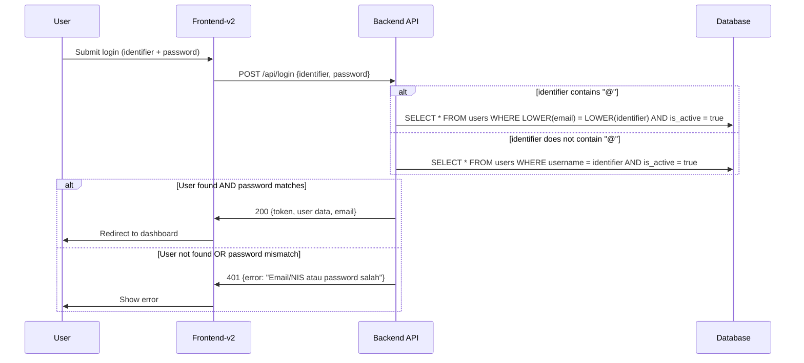

# Design Document: Ubah Username ke Email

## Overview

Fitur ini memigrasikan identifier login untuk user admin/operator dari username ke email. Arsitektur saat ini menggunakan satu field `username` untuk semua tipe user. Setelah migrasi:

- **Admin/Operator**: Login menggunakan email (dengan fallback ke username selama masa transisi jika email belum diisi)
- **Siswa**: Tetap login menggunakan NIS (disimpan di field `username`)

Sistem menggunakan pendekatan **single login form** dengan routing otomatis berdasarkan format input — jika mengandung `@` maka autentikasi via email, jika tidak maka via username/NIS.

### Keputusan Desain Utama

1. **Additive migration**: Kolom `email` ditambahkan tanpa mengubah/menghapus kolom `username` yang existing
2. **Gradual transition**: Admin/operator tanpa email masih bisa login via username (fallback)
3. **Single endpoint**: Satu endpoint login menerima field `identifier` yang di-route otomatis
4. **Branch-scoped uniqueness**: Email unik per branch, bukan global (memungkinkan multi-branch)
5. **Password reset via backend**: Reset password dihandle oleh backend API dengan token-based flow

## Architecture

```mermaid
graph TB
    subgraph "Frontend-v2 (Filament)"
        LP[Login Page]
        FP[Forgot Password Page]
        RP[Reset Password Page]
        PP[Profile Page]
        EPT[Email Population Tool]
    end

    subgraph "Backend API (Laravel)"
        AC[AuthController]
        UC[UserController]
        EPC[EmailPopulationController]
        PRC[PasswordResetController]
    end

    subgraph "Services"
        IS[IdentifierService]
        EVS[EmailValidationService]
        PRS[PasswordResetService]
    end

    subgraph "Database"
        UT[(Users Table)]
        PRT[(Password Reset Tokens)]
    end

    subgraph "External"
        MS[Mail Service]
    end

    LP -->|POST /login| AC
    FP -->|POST /forgot-password| PRC
    RP -->|POST /reset-password| PRC
    PP -->|PATCH /users/current/email| UC
    EPT -->|GET /users/email-population| EPC
    EPT -->|PATCH /users/{id}/email| EPC

    AC --> IS
    IS --> EVS
    IS --> UT
    PRC --> PRS
    PRS --> MS
    PRS --> PRT
    EPC --> EVS
    EPC --> UT
    UC --> EVS
    UC --> UT
```

### Alur Autentikasi



## Components and Interfaces

### 1. IdentifierService (Backend)

Service baru yang menangani routing autentikasi berdasarkan format identifier.

```php
<?php

namespace App\Services;

class IdentifierService
{
    /**
     * Determine if the identifier is an email (contains @).
     */
    public function isEmail(string $identifier): bool;

    /**
     * Find user by identifier with automatic routing.
     * - If contains "@": query by email (case-insensitive, active only)
     * - If not: query by username (active only)
     * - Special: if admin/operator has email set, username login is disabled
     */
    public function findUserByIdentifier(string $identifier): ?User;
}
```

### 2. EmailValidationService (Backend)

Service untuk validasi email yang digunakan di berbagai tempat.

```php
<?php

namespace App\Services;

class EmailValidationService
{
    /**
     * Validate email format (RFC 5322).
     */
    public function isValidFormat(string $email): bool;

    /**
     * Check if email is unique within a branch.
     * Excludes the given user ID (for updates).
     */
    public function isUniqueInBranch(string $email, int $branchId, ?int $excludeUserId = null): bool;

    /**
     * Normalize email to lowercase.
     */
    public function normalize(string $email): string;
}
```

### 3. PasswordResetService (Backend)

Service untuk mengelola alur reset password.

```php
<?php

namespace App\Services;

class PasswordResetService
{
    /**
     * Create a password reset token and send email.
     * Returns same response regardless of email existence (anti-enumeration).
     */
    public function sendResetLink(string $email): void;

    /**
     * Validate a reset token (not expired, not used).
     */
    public function validateToken(string $token): ?PasswordResetToken;

    /**
     * Reset password using token and invalidate the token.
     */
    public function resetPassword(string $token, string $newPassword): bool;
}
```

### 4. Updated AuthController (Backend)

```php
// POST /api/login
public function login(LoginRequest $request): JsonResponse
{
    // Accepts "identifier" field (or "username" for backward compat)
    // Routes to email or username lookup via IdentifierService
    // Returns user data including email field
}
```

### 5. EmailPopulationController (Backend)

```php
<?php

namespace App\Http\Controllers;

class EmailPopulationController extends Controller
{
    /**
     * GET /api/users/email-population
     * List admin/operator accounts without email in active branch.
     */
    public function index(Request $request): JsonResponse;

    /**
     * GET /api/users/email-population/progress
     * Get progress: {populated: int, total: int, complete: bool}
     */
    public function progress(Request $request): JsonResponse;

    /**
     * PATCH /api/users/{id}/email
     * Set email for a specific user (validation + uniqueness check).
     */
    public function update(Request $request, int $id): JsonResponse;
}
```

### 6. PasswordResetController (Backend)

```php
<?php

namespace App\Http\Controllers;

class PasswordResetController extends Controller
{
    /**
     * POST /api/forgot-password
     * Send reset link to email (anti-enumeration: same response always).
     */
    public function sendResetLink(Request $request): JsonResponse;

    /**
     * GET /api/reset-password/{token}
     * Validate token and return status.
     */
    public function validateToken(string $token): JsonResponse;

    /**
     * POST /api/reset-password
     * Reset password with token.
     */
    public function resetPassword(Request $request): JsonResponse;
}
```

### 7. Frontend-v2 Login Page (Updated)

- Label input diubah dari "Username" menjadi "Email / NIS"
- Field name dikirim sebagai `identifier` ke backend API
- Tambah link "Lupa Password?" yang mengarah ke halaman forgot password

### 8. Frontend-v2 Forgot Password Page (New)

- Form input email
- Submit ke `POST /api/forgot-password`
- Tampilkan pesan sukses yang sama untuk semua kasus

### 9. Frontend-v2 Reset Password Page (New)

- Menerima token dari URL
- Form input password baru + konfirmasi
- Submit ke `POST /api/reset-password`

### 10. Frontend-v2 Email Population Tool Page (New)

- Tabel daftar akun admin/operator tanpa email
- Inline edit untuk mengisi email per baris
- Progress bar (populated/total)
- Pesan konfirmasi saat semua sudah terisi

## Data Models

### Users Table (Updated)

```sql
-- Migration: add email column to users table
ALTER TABLE users ADD COLUMN email VARCHAR(255) NULL AFTER username;
ALTER TABLE users ADD COLUMN is_active BOOLEAN NOT NULL DEFAULT true AFTER branch_id;

-- Partial unique index: email unique per branch, allowing nulls
CREATE UNIQUE INDEX users_email_branch_unique 
    ON users (email, branch_id) 
    WHERE email IS NOT NULL;
```

**Updated User Model:**

```php
protected $fillable = [
    'username',
    'email',
    'password',
    'branch_id',
    'is_active',
];

protected $casts = [
    'id' => 'int',
    'branch_id' => 'int',
    'is_active' => 'boolean',
];

// Mutator: always store email in lowercase
public function setEmailAttribute(?string $value): void
{
    $this->attributes['email'] = $value ? strtolower(trim($value)) : null;
}
```

### Password Reset Tokens Table (New)

```sql
CREATE TABLE password_reset_tokens (
    id BIGINT UNSIGNED AUTO_INCREMENT PRIMARY KEY,
    email VARCHAR(255) NOT NULL,
    token VARCHAR(255) NOT NULL UNIQUE,
    used BOOLEAN NOT NULL DEFAULT false,
    created_at TIMESTAMP NOT NULL DEFAULT CURRENT_TIMESTAMP,
    expires_at TIMESTAMP NOT NULL,
    INDEX password_reset_tokens_email_index (email)
);
```

### API Request/Response Contracts

**Login Request (Updated):**
```json
{
    "identifier": "admin@school.com",  // or "12345" for NIS
    "password": "secret123"
}
// Backward compat: "username" field also accepted if "identifier" absent
```

**Login Response (Updated):**
```json
{
    "data": {
        "id": 1,
        "username": "admin1",
        "email": "admin@school.com",
        "token": "1|abc...",
        "expires_at": "2025-01-01T12:00:00Z",
        "permissions": ["view-user", "create-user"],
        "roles": ["admin"]
    }
}
```

**Forgot Password Request:**
```json
{
    "email": "admin@school.com"
}
```

**Reset Password Request:**
```json
{
    "token": "abc123...",
    "password": "newpassword123",
    "password_confirmation": "newpassword123"
}
```

**Email Population Progress Response:**
```json
{
    "data": {
        "populated": 8,
        "total": 10,
        "complete": false,
        "message": null
    }
}
```

## Correctness Properties

*A property is a characteristic or behavior that should hold true across all valid executions of a system — essentially, a formal statement about what the system should do. Properties serve as the bridge between human-readable specifications and machine-verifiable correctness guarantees.*

### Property 1: Role-based Email Requirement

*For any* user creation request, the email field SHALL be required if and only if the assigned role is "admin" or "operator". For role "siswa", email SHALL be optional (nullable).

**Validates: Requirements 1.1, 1.4, 7.6**

### Property 2: Email Uniqueness per Branch

*For any* two users in the same branch, if both have non-null email values, their emails (after lowercase normalization) SHALL be different. The same email SHALL be allowed to exist in different branches.

**Validates: Requirements 1.2, 7.2, 7.3**

### Property 3: Identifier Routing

*For any* login identifier string, if the string contains the "@" character, the authentication system SHALL query the User table by the `email` field; if the string does not contain "@", the system SHALL query by the `username` field.

**Validates: Requirements 3.2, 3.3, 3.4, 3.5, 6.2, 6.3**

### Property 4: Active User Scoping

*For any* authentication lookup (whether by email or username), the system SHALL only return users where `is_active` equals true. Inactive users SHALL never be authenticated.

**Validates: Requirements 3.7, 3.8**

### Property 5: Case-insensitive Email Storage and Matching

*For any* email value, the system SHALL store it in lowercase. *For any* login attempt with an email identifier, the matching SHALL be case-insensitive (i.e., "Admin@School.COM" matches stored "admin@school.com").

**Validates: Requirements 7.4, 7.5**

### Property 6: Email Population Filter

*For any* set of users in a branch, the Email Population Tool SHALL return exactly those users who have role "admin" or "operator" AND have a null or empty email field. No siswa accounts and no accounts with populated email SHALL appear in the list.

**Validates: Requirements 2.1**

### Property 7: Progress Calculation

*For any* branch, the progress indicator SHALL report `populated` as the count of admin/operator accounts with non-null email, and `total` as the count of all admin/operator accounts. The `complete` flag SHALL be true if and only if `populated` equals `total`.

**Validates: Requirements 2.4, 2.5**

### Property 8: Anti-enumeration Response

*For any* email submitted to the forgot-password endpoint, the HTTP response status code and body structure SHALL be identical regardless of whether the email exists in the database or not.

**Validates: Requirements 4.3**

### Property 9: Reset Token Single-use Invalidation

*For any* valid password reset token, after it is used to successfully reset a password, any subsequent attempt to use the same token SHALL be rejected.

**Validates: Requirements 4.5**

### Property 10: Email Update with Password Confirmation

*For any* email change request, the system SHALL reject the change if the provided current password does not match the user's actual password. The system SHALL accept the change only when the password is correct AND the new email is unique within the branch.

**Validates: Requirements 5.2, 5.4, 5.5**

### Property 11: Backward Compatibility — Username Field

*For any* login request that contains a "username" field but no "identifier" field, the system SHALL treat the "username" value as the identifier and apply the same routing logic (@ → email, no @ → username).

**Validates: Requirements 6.6**

### Property 12: Email-based Auth Transition

*For any* admin/operator account with a non-null email, the system SHALL authenticate that account by email only (username login disabled). *For any* admin/operator account with null email, the system SHALL allow authentication by username as fallback.

**Validates: Requirements 8.3, 8.4**

### Property 13: Login Response Includes Email

*For any* successful login, the response data SHALL include the `email` field (which may be null for siswa accounts or admin/operator accounts that haven't set email yet).

**Validates: Requirements 6.4**

## Error Handling

### Authentication Errors

| Condition | HTTP Status | Message |
|-----------|-------------|---------|
| Invalid credentials (email/username not found or password wrong) | 401 | "Email/NIS atau password salah" |
| Account inactive | 401 | "Email/NIS atau password salah" (same message, no info leak) |
| Already logged in on another device | 401 | "Akun kamu sedang login di perangkat lain." |
| Missing identifier field | 422 | "Identifier wajib diisi" |

### Email Validation Errors

| Condition | HTTP Status | Message |
|-----------|-------------|---------|
| Invalid email format | 422 | "Format email tidak valid" |
| Duplicate email in same branch | 422 | "Email sudah digunakan di cabang ini" |
| Email required but missing (admin/operator) | 422 | "Email wajib diisi untuk akun admin/operator" |

### Password Reset Errors

| Condition | HTTP Status | Message |
|-----------|-------------|---------|
| Expired or used token | 422 | "Link reset password sudah kadaluarsa atau sudah digunakan" |
| Invalid token format | 422 | "Token tidak valid" |
| Password too short | 422 | "Password minimal 8 karakter" |

### Profile Update Errors

| Condition | HTTP Status | Message |
|-----------|-------------|---------|
| Incorrect current password | 422 | "Password salah" |
| Duplicate email in branch | 422 | "Email sudah digunakan di cabang ini" |

### Error Handling Strategy

- **Anti-enumeration**: Forgot password endpoint always returns 200 with same message
- **Consistent error format**: All errors follow `{"errors": {"field": ["message"]}}` format
- **No information leakage**: Authentication failures don't reveal whether email/username exists
- **Graceful degradation**: If mail service is down, log the error and still return success to user (queue retry)

## Testing Strategy

### Property-Based Testing (PBT)

Library: **PHPUnit** with custom data providers generating randomized inputs (100+ iterations per property).

Setiap property dari Correctness Properties section di atas akan diimplementasikan sebagai property-based test dengan minimum 100 iterasi menggunakan random data generators.

**Tag format**: `Feature: ubah-username-ke-email, Property {number}: {property_text}`

**Key property tests:**

1. **IdentifierService routing** — Generate random strings with/without "@", verify correct routing
2. **EmailValidationService uniqueness** — Generate random email/branch combinations, verify constraint enforcement
3. **Case normalization round-trip** — For any email, `normalize(email)` stored then matched case-insensitively
4. **Role-based validation** — Generate user payloads with random roles, verify email requirement logic
5. **Auth transition logic** — Generate admin/operator users with/without email, verify correct auth path
6. **Progress calculation** — Generate random user sets, verify count accuracy
7. **Anti-enumeration** — Generate existing/non-existing emails, verify identical responses
8. **Token invalidation** — Generate tokens, use them, verify single-use enforcement

### Unit Tests (Example-based)

- Login form label displays "Email / NIS"
- "Lupa Password?" link present on login page
- Specific error messages match requirements
- Reset token expiration at exactly 60 minutes
- Backward compatibility: old "username" field still works
- Email population confirmation message when all populated

### Integration Tests

- Full login flow: submit identifier → get token → access protected route
- Password reset flow: request → email sent → click link → reset → login with new password
- Email population flow: list accounts → fill email → verify progress → confirmation
- Database migration: verify column added, index created, existing data intact

### Migration Safety Tests (Smoke)

- Username column still exists after migration
- Existing username values unchanged
- Email column is nullable
- Partial unique index allows multiple NULL emails
- `is_active` column defaults to true for existing records
