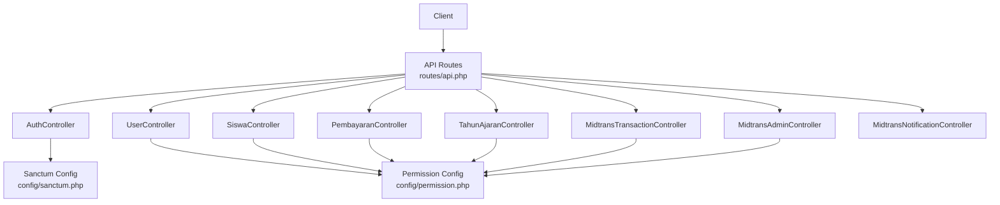
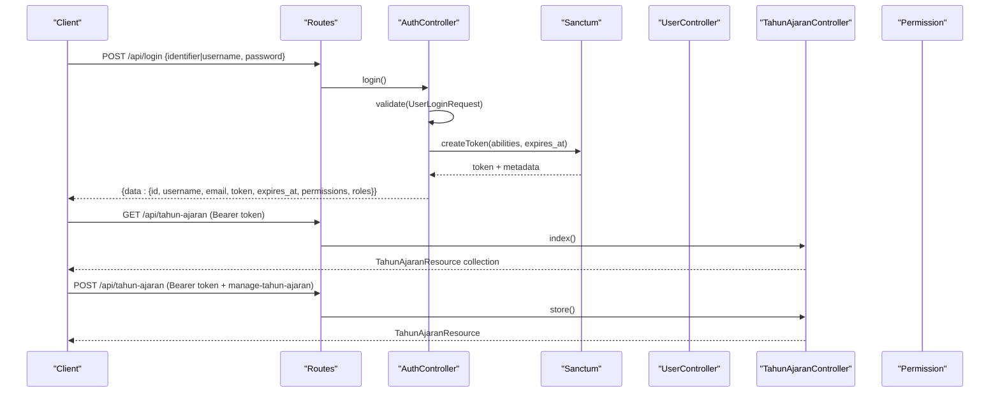

# API Documentation

<cite>
**Referenced Files in This Document**
- [api.php](file://backend/routes/api.php)
- [sanctum.php](file://backend/config/sanctum.php)
- [AuthController.php](file://backend/app/Http/Controllers/AuthController.php)
- [UserController.php](file://backend/app/Http/Controllers/UserController.php)
- [SiswaController.php](file://backend/app/Http/Controllers/SiswaController.php)
- [PembayaranController.php](file://backend/app/Http/Controllers/PembayaranController.php)
- [MidtransTransactionController.php](file://backend/app/Http/Controllers/MidtransTransactionController.php)
- [MidtransAdminController.php](file://backend/app/Http/Controllers/MidtransAdminController.php)
- [MidtransNotificationController.php](file://backend/app/Http/Controllers/MidtransNotificationController.php)
- [TahunAjaranController.php](file://backend/app/Http/Controllers/TahunAjaranController.php)
- [UserLoginRequest.php](file://backend/app/Http/Requests/UserLoginRequest.php)
- [UserResource.php](file://backend/app/Http/Resources/UserResource.php)
- [SiswaResource.php](file://backend/app/Http/Resources/SiswaResource.php)
- [PembayaranResource.php](file://backend/app/Http/Resources/PembayaranResource.php)
- [TahunAjaranResource.php](file://backend/app/Http/Resources/TahunAjaranResource.php)
- [DenySiswaRole.php](file://backend/app/Http/Middleware/DenySiswaRole.php)
- [permission.php](file://backend/config/permission.php)
</cite>

## Update Summary
**Changes Made**
- Added comprehensive documentation for Tahun Ajaran (Academic Year) API endpoints
- Updated route structure to reflect the new accessible location for academic year operations
- Enhanced authentication and authorization details for academic year management
- Added new section covering academic year filtering and dropdown functionality

## Table of Contents
1. [Introduction](#introduction)
2. [Project Structure](#project-structure)
3. [Core Components](#core-components)
4. [Architecture Overview](#architecture-overview)
5. [Detailed Component Analysis](#detailed-component-analysis)
6. [Dependency Analysis](#dependency-analysis)
7. [Performance Considerations](#performance-considerations)
8. [Troubleshooting Guide](#troubleshooting-guide)
9. [Conclusion](#conclusion)
10. [Appendices](#appendices)

## Introduction
This document provides comprehensive API documentation for the Handayani RESTful endpoints exposed by the backend application. It covers authentication via Laravel Sanctum, user management, student data operations, financial transactions (offline and online via Midtrans), academic year management, error handling strategies, pagination patterns, and client integration guidelines. The API is organized under a single base path with no explicit version prefix; backward compatibility considerations are addressed where applicable.

## Project Structure
The API routes are centralized in the routes file and grouped by feature domains. Controllers implement request validation using FormRequest classes and return structured JSON responses via Resource classes. Authentication and authorization are enforced through Sanctum middleware and Spatie Permission middleware. Academic year routes have been restructured to be accessible to all authenticated roles for dropdown filters while maintaining proper permission controls for administrative operations.

**Diagram sources**
- [api.php:1-350](file://backend/routes/api.php#L1-L350)
- [sanctum.php:1-85](file://backend/config/sanctum.php#L1-L85)
- [permission.php:1-220](file://backend/config/permission.php#L1-L220)

**Section sources**
- [api.php:1-350](file://backend/routes/api.php#L1-L350)
- [sanctum.php:1-85](file://backend/config/sanctum.php#L1-L85)
- [permission.php:1-220](file://backend/config/permission.php#L1-L220)

## Core Components
- Authentication: Login, logout, password reset, unsubscribe flows.
- Authorization: Sanctum bearer tokens with abilities; role-based permissions via Spatie Permission.
- Resources: Standardized JSON structures for users, students, payments, and academic years.
- Validation: Request classes enforce input rules and produce consistent error payloads.
- Middleware: Sanctum auth, permission checks, and denial of siswa-only access to admin routes.
- Academic Year Management: Accessible academic year operations for dropdown filters and administrative controls.

Key implementation references:
- Authentication controller and login flow
- User profile and management endpoints
- Student CRUD and filtering
- Payment recording and listing
- Academic year management for dropdown filters and administration
- Midtrans transaction initiation and status polling
- Webhook handler for payment notifications

**Section sources**
- [AuthController.php:1-103](file://backend/app/Http/Controllers/AuthController.php#L1-L103)
- [UserLoginRequest.php:1-51](file://backend/app/Http/Requests/UserLoginRequest.php#L1-L51)
- [UserResource.php:1-33](file://backend/app/Http/Resources/UserResource.php#L1-L33)
- [UserController.php:1-317](file://backend/app/Http/Controllers/UserController.php#L1-L317)
- [SiswaController.php:1-321](file://backend/app/Http/Controllers/SiswaController.php#L1-L321)
- [SiswaResource.php:1-42](file://backend/app/Http/Resources/SiswaResource.php#L1-L42)
- [PembayaranController.php:1-496](file://backend/app/Http/Controllers/PembayaranController.php#L1-L496)
- [PembayaranResource.php:1-28](file://backend/app/Http/Resources/PembayaranResource.php#L1-L28)
- [TahunAjaranController.php:1-215](file://backend/app/Http/Controllers/TahunAjaranController.php#L1-L215)
- [TahunAjaranResource.php:1-27](file://backend/app/Http/Resources/TahunAjaranResource.php#L1-L27)
- [MidtransTransactionController.php:1-127](file://backend/app/Http/Controllers/MidtransTransactionController.php#L1-L127)
- [MidtransAdminController.php:1-176](file://backend/app/Http/Controllers/MidtransAdminController.php#L1-L176)
- [MidtransNotificationController.php:1-35](file://backend/app/Http/Controllers/MidtransNotificationController.php#L1-L35)
- [DenySiswaRole.php:1-45](file://backend/app/Http/Middleware/DenySiswaRole.php#L1-L45)

## Architecture Overview
The API uses a layered approach:
- Routing layer groups endpoints by domain and applies middleware for authentication and authorization.
- Controller layer validates requests, enforces business rules, and returns resources.
- Service layer encapsulates complex logic (e.g., Midtrans initiation, notification processing).
- Data layer persists entities and relationships.

**Diagram sources**
- [api.php:36-52](file://backend/routes/api.php#L36-L52)
- [api.php:84-93](file://backend/routes/api.php#L84-L93)
- [AuthController.php:41-94](file://backend/app/Http/Controllers/AuthController.php#L41-L94)
- [UserLoginRequest.php:24-31](file://backend/app/Http/Requests/UserLoginRequest.php#L24-L31)
- [sanctum.php:49-50](file://backend/config/sanctum.php#L49-L50)
- [UserController.php:23-35](file://backend/app/Http/Controllers/UserController.php#L23-L35)
- [TahunAjaranController.php:19-27](file://backend/app/Http/Controllers/TahunAjaranController.php#L19-L27)

## Detailed Component Analysis

### Authentication Endpoints
- POST /api/login
  - Purpose: Authenticate user and issue Sanctum token with abilities derived from roles.
  - Request schema: identifier or username (mutually required), password (min length).
  - Response schema: data object containing id, username, email, token, expires_at, permissions, roles, must_change_password.
  - Error handling: 400 for validation errors; 401 for invalid credentials or inactive account.
  - Notes: Backward compatible identifier field supports both username and alternative identifiers.

- DELETE /api/logout
  - Purpose: Revoke current token.
  - Requires: Bearer token.
  - Response: boolean success payload.

- Password Reset (public):
  - POST /api/forgot-password
  - GET /api/reset-password/{token}
  - POST /api/reset-password

- Unsubscribe (public):
  - GET /api/unsubscribe/{token}
  - POST /api/unsubscribe/{token}

Authentication method:
- Bearer token issued by Sanctum with expiration configured.
- Token includes abilities (permissions) for fine-grained authorization.

**Section sources**
- [api.php:36-52](file://backend/routes/api.php#L36-L52)
- [AuthController.php:21-101](file://backend/app/Http/Controllers/AuthController.php#L21-L101)
- [UserLoginRequest.php:24-49](file://backend/app/Http/Requests/UserLoginRequest.php#L24-L49)
- [sanctum.php:49-50](file://backend/config/sanctum.php#L49-L50)

### Academic Year Management APIs
**Updated** Academic year routes have been moved from admin-only middleware to a more accessible location within the authenticated routes group, making them available to all authenticated roles for dropdown filters while maintaining proper permission controls for administrative operations.

- GET /api/tahun-ajaran
  - Purpose: List all academic years for the authenticated user's branch.
  - Requires: Bearer token (accessible to all authenticated roles).
  - Response: Collection of TahunAjaranResource objects filtered by user's branch_id.
  - Use case: Dropdown filters for academic year selection across the application.

- POST /api/tahun-ajaran
  - Purpose: Create a new academic year.
  - Requires: Bearer token + manage-tahun-ajaran permission.
  - Request schema: nama (YYYY/YYYY format), tanggal_mulai, tanggal_selesai.
  - Response: Created TahunAjaranResource with 201 status code.
  - Business rules: Validates name format (second year = first year + 1), uniqueness per branch.

- GET /api/tahun-ajaran/{id}
  - Purpose: Get specific academic year details.
  - Requires: Bearer token (accessible to all authenticated roles).
  - Response: Single TahunAjaranResource object.
  - Security: Verifies academic year belongs to user's branch.

- PUT /api/tahun-ajaran/{id}
  - Purpose: Update academic year details.
  - Requires: Bearer token + manage-tahun-ajaran permission.
  - Request schema: nama, tanggal_mulai, tanggal_selesai.
  - Response: Updated TahunAjaranResource.
  - Business rules: Same validation as creation, excludes self from uniqueness check.

- DELETE /api/tahun-ajaran/{id}
  - Purpose: Delete academic year.
  - Requires: Bearer token + manage-tahun-ajaran permission.
  - Response: Success boolean.
  - Business rules: Prevents deletion if associated records exist (tagihan, jenis_tagihan, siswa_kelas).

- PATCH /api/tahun-ajaran/{id}/activate
  - Purpose: Activate academic year (deactivates others in same branch).
  - Requires: Bearer token + manage-tahun-ajaran permission.
  - Response: Activated TahunAjaranResource.
  - Business rules: Ensures only one active academic year per branch.

- PATCH /api/tahun-ajaran/{id}/deactivate
  - Purpose: Deactivate academic year.
  - Requires: Bearer token + manage-tahun-ajaran permission.
  - Response: Deactivated TahunAjaranResource.

Response schema:
- TahunAjaranResource includes id, nama, tanggal_mulai, tanggal_selesai, status, branch_id.

Authorization:
- Read operations (GET): Available to all authenticated users for dropdown filters.
- Write operations (POST, PUT, DELETE, PATCH): Require manage-tahun-ajaran permission.
- Branch isolation: All operations restricted to user's branch_id.

**Section sources**
- [api.php:84-93](file://backend/routes/api.php#L84-L93)
- [TahunAjaranController.php:19-215](file://backend/app/Http/Controllers/TahunAjaranController.php#L19-L215)
- [TahunAjaranResource.php:15-26](file://backend/app/Http/Resources/TahunAjaranResource.php#L15-L26)

### User Management APIs
- GET /api/users/current
  - Returns authenticated user profile resource.
- PATCH /api/users/current
  - Updates profile fields including optional password change.
- PATCH /api/users/current/email
  - Securely updates email requiring current password confirmation.
- POST /api/users/change-password
  - Changes password after verifying current password.

Admin-only (deny_siswa + permission):
- GET /api/users
  - Paginated list with filters: branch_id, role, search, is_active; supports sort and direction.
- POST /api/users
  - Create user with roles assignment.
- GET /api/users/{id}
  - Retrieve user details.
- PUT /api/users/{id}
  - Update user fields and roles.
- DELETE /api/users/{id}
  - Delete user and revoke all tokens.
- PATCH /api/users/{id}/toggle-active
  - Toggle active flag; revokes tokens when deactivated.

Response schemas:
- UserResource includes id, username, name, email, is_active, must_change_password, branch (when loaded), roles (when loaded), created_at.

Pagination:
- Default per_page values and maximums are enforced at controller level.

Authorization:
- Permission-based guards applied per route (e.g., view-user, create-user, read-user, update-user, delete-user).

**Section sources**
- [api.php:47-99](file://backend/routes/api.php#L47-L99)
- [UserController.php:23-316](file://backend/app/Http/Controllers/UserController.php#L23-L316)
- [UserResource.php:15-31](file://backend/app/Http/Resources/UserResource.php#L15-L31)
- [DenySiswaRole.php:22-43](file://backend/app/Http/Middleware/DenySiswaRole.php#L22-L43)

### Student Data Operations
- GET /api/siswa/{jenjang}
  - List students filtered by jenjang (TK/MI/KB), with search, kelas_id, jenis_kelamin, agama, status, sorting, and pagination.
- POST /api/siswa/{jenjang}
  - Create student with optional parent/wali records; creates linked akun siswa asynchronously.
- GET /api/siswa/{jenjang}/{id}
  - Get student detail with related parents/wali and class info.
- PUT /api/siswa/{jenjang}/{id}
  - Update student and related parent/wali records; sync current period class enrollment.
- DELETE /api/siswa/{jenjang}/{id}
  - Delete student and associated accounts/parents/wali based on jenjang.

Data models and relations:
- SiswaResource includes core student fields and nested ayah/ibu/wali/kelas/kategori when loaded.
- MI tracks ayah and ibu; TK/KB track wali.

Class synchronization:
- When kelas_id is provided, the system synchronizes current academic year enrollment and keeps legacy kelas_id in sync.

Permissions:
- Admin-only with specific permissions per operation (view-siswa, create-siswa, read-siswa, update-siswa, delete-siswa).

**Section sources**
- [api.php:114-120](file://backend/routes/api.php#L114-L120)
- [SiswaController.php:42-319](file://backend/app/Http/Controllers/SiswaController.php#L42-L319)
- [SiswaResource.php:15-39](file://backend/app/Http/Resources/SiswaResource.php#L15-L39)

### Financial Transaction Endpoints (Offline Payments)
- GET /api/pembayaran/grouped
  - Grouped view of students with their payments; supports search, jenjang, kelas_id, metode, tahun_ajaran_id, sorting, pagination.
- GET /api/pembayaran
  - Paginated list of payments with search across kode_pembayaran, nis, nama; supports sorting and pagination.
- POST /api/pembayaran/batch
  - Batch mark multiple tagihan as fully paid within a transaction; generates payment records and updates tagihan status.
- POST /api/pembayaran/bayar/{kode_tagihan}
  - Record partial or full payment against a tagihan; validates accumulation vs total cost.
- POST /api/pembayaran/lunas/{kode_tagihan}
  - Mark a tagihan as fully paid directly; ensures not already fully paid.
- DELETE /api/pembayaran/{kode_pembayaran}
  - Delete a payment record; online Midtrans payments require additional permissions.
- GET /api/pembayaran/kwitansi/{kode_pembayaran}
  - Generate receipt data for a payment.

Response schemas:
- PembayaranResource includes kode_pembayaran, tagihan reference, tanggal, metode, jumlah, pembayar, branch_id.
- Grouped view enriches each student with aggregated payment items.

Business rules:
- Accumulation checks prevent overpayment.
- Status transitions ensure consistency between tmp and final status.
- Notifications are dispatched upon successful payment recording.

Permissions:
- Admin-only with view-pembayaran, delete-pembayaran, manage-midtrans-config for online deletion.

**Section sources**
- [api.php:167-176](file://backend/routes/api.php#L167-L176)
- [PembayaranController.php:36-495](file://backend/app/Http/Controllers/PembayaranController.php#L36-L495)
- [PembayaranResource.php:15-26](file://backend/app/Http/Resources/PembayaranResource.php#L15-L26)

### Online Payments (Midtrans Integration)
Portal Siswa:
- GET /api/midtrans/fee-channels
  - Lists available channels and default channel; optional amount preview to compute fees.
- POST /api/midtrans/transactions
  - Initiate Snap payment for a single tagihan; returns order_id, snap_token, redirect_url, amounts, client_key.
- POST /api/midtrans/transactions/batch
  - Initiate batch Snap payment for multiple tagihan; returns consolidated order details.
- GET /api/midtrans/transactions/{order_id}
  - Poll transaction status; ownership check ensures only the owning siswa can view.

Admin:
- GET /api/midtrans/admin/transactions
  - Paginated list with filters: status, branch_id, date range; includes student name.
- GET /api/midtrans/admin/transactions/{order_id}
  - Detail view with initiator and timestamps.
- GET /api/midtrans/admin/transactions/{order_id}/logs
  - Logs with sensitive fields masked.
- POST /api/midtrans/admin/transactions/{order_id}/sync
  - Manual status sync via Midtrans Status API.

Webhook:
- POST /api/midtrans/notification
  - Public webhook endpoint protected by signature verification handled in service layer; returns ok or error code/status.

Security:
- Portal endpoints require Sanctum auth and pay-tagihan-online permission.
- Admin endpoints require view-midtrans-transactions and sync-midtrans-transactions permissions.

**Section sources**
- [api.php:326-344](file://backend/routes/api.php#L326-L344)
- [api.php:322-324](file://backend/routes/api.php#L322-L324)
- [MidtransTransactionController.php:17-126](file://backend/app/Http/Controllers/MidtransTransactionController.php#L17-L126)
- [MidtransAdminController.php:18-175](file://backend/app/Http/Controllers/MidtransAdminController.php#L18-L175)
- [MidtransNotificationController.php:20-33](file://backend/app/Http/Controllers/MidtransNotificationController.php#L20-L33)

### API Versioning, Backward Compatibility, Deprecation Policies
- No explicit version prefix in routes; all endpoints are under /api without version segments.
- Backward compatibility:
  - Login accepts either identifier or username for flexibility.
  - Student creation and updates maintain legacy kelas_id while syncing current period enrollment.
  - Academic year routes provide read access to all authenticated users while maintaining write permissions for administrators.
- Deprecation policy:
  - Not explicitly defined in code; recommended practice is to introduce new versions with prefixes and deprecate old endpoints gradually.

[No sources needed since this section summarizes general policies]

### Error Handling Strategies
- Validation errors:
  - FormRequest classes throw standardized error payloads with field-specific messages.
- Business rule violations:
  - Controllers throw HttpResponseException with structured error objects and appropriate HTTP codes (400, 401, 403, 404, 422, 500).
- Permission denials:
  - deny_siswa middleware blocks siswa-only users from admin routes with 403.
  - Permission middleware blocks unauthorized access to protected endpoints.
- Midtrans exceptions:
  - Custom exception hierarchy defines errorCode and httpStatus for consistent error mapping.

Example error shape:
- { "errors": { "field": ["message"], ... } } or { "errors": { "message": ["..."] } }

**Section sources**
- [UserLoginRequest.php:44-49](file://backend/app/Http/Requests/UserLoginRequest.php#L44-L49)
- [DenySiswaRole.php:26-33](file://backend/app/Http/Middleware/DenySiswaRole.php#L26-L33)
- [PembayaranController.php:236-240](file://backend/app/Http/Controllers/PembayaranController.php#L236-L240)
- [TahunAjaranController.php:47-50](file://backend/app/Http/Controllers/TahunAjaranController.php#L47-L50)

### Rate Limiting Considerations
- No explicit rate limiting configuration found in referenced files.
- Recommended practices:
  - Apply global or route-level throttling in middleware or reverse proxy.
  - Use Sanctum token expiration to limit long-lived sessions.
  - Monitor webhook endpoints and apply IP allowlists for Midtrans notifications.

[No sources needed since this section provides general guidance]

### Pagination Patterns
- Consistent use of Laravel paginator with per_page parameter.
- Defaults and caps:
  - Users index: min(per_page, 100).
  - Students index: default 30.
  - Payments index: default 30.
  - Midtrans admin transactions: min(per_page, 100).
- Sorting:
  - Many endpoints support sort and direction parameters.

**Section sources**
- [UserController.php:66-98](file://backend/app/Http/Controllers/UserController.php#L66-L98)
- [SiswaController.php:42-81](file://backend/app/Http/Controllers/SiswaController.php#L42-L81)
- [PembayaranController.php:124-165](file://backend/app/Http/Controllers/PembayaranController.php#L124-L165)
- [MidtransAdminController.php:57-68](file://backend/app/Http/Controllers/MidtransAdminController.php#L57-L68)

### Client Implementation Guidelines
- Authentication:
  - Obtain token via login; include Authorization: Bearer <token> in subsequent requests.
  - Handle token expiration and refresh by re-authenticating.
- Permissions:
  - Respect returned permissions array; gate UI actions accordingly.
- Requests:
  - Follow validation rules; handle 400/422 responses gracefully.
  - Use query parameters for filtering and sorting; respect per_page limits.
- Academic Year Filtering:
  - Use GET /api/tahun-ajaran to populate dropdown filters for all authenticated users.
  - Only users with manage-tahun-ajaran permission can create/update/delete academic years.
- Errors:
  - Parse structured error payloads; display user-friendly messages.
- Midtrans:
  - Use snap_token and redirect_url to open payment modal; poll status via order_id.
  - Implement webhook receiver if hosting server-side; verify signatures.

[No sources needed since this section provides general guidance]

### Testing Approaches
- Unit tests:
  - Validate services and business logic (e.g., Midtrans fee calculation, status transitions).
- Feature tests:
  - Simulate end-to-end flows: login, create/update students, record payments, initiate Midtrans transactions.
- Stubs:
  - Use fake clients for external integrations (e.g., Midtrans) to isolate tests.

**Section sources**
- [Stubs/FakeMidtransClient.php](file://backend/tests/Stubs/FakeMidtransClient.php)

## Dependency Analysis
The API depends on:
- Laravel Sanctum for token-based authentication.
- Spatie Permission for role/permission enforcement.
- Midtrans services for online payment initiation and status synchronization.
- Eloquent models and resources for data shaping.

```mermaid
classDiagram
class AuthController {
+login(request) JsonResponse
+logout(request) JsonResponse
}
class UserController {
+get(request) UserResource
+updateCurrent(request) UserResource
+changePassword(request) JsonResponse
+index(request) mixed
+store(request) JsonResponse
+show(id) UserResource
+update(request,id) UserResource
+destroy(id) JsonResponse
+toggleActive(id) JsonResponse
+updateEmail(request) JsonResponse
}
class SiswaController {
+index(jenjang) mixed
+create(jenjang,request) SiswaResource
+update(jenjang,id,request) SiswaResource
+get(jenjang,id) SiswaResource
+delete(jenjang,id) JsonResponse
}
class TahunAjaranController {
+index() TahunAjaranResource
+store(request) TahunAjaranResource
+show(id) TahunAjaranResource
+update(request,id) TahunAjaranResource
+destroy(id) JsonResponse
+activate(id) TahunAjaranResource
+deactivate(id) TahunAjaranResource
}
class PembayaranController {
+grouped() mixed
+index() mixed
+batchLunas(request) mixed
+lunas(request,kode_tagihan) PembayaranResource
+bayar(request,kode_tagihan) PembayaranResource
+delete(kode_pembayaran) JsonResponse
+kwitansi(kode_pembayaran) KwitansiResource
+siswaView(request) mixed
}
class MidtransTransactionController {
+initiate(request,service) JsonResponse
+initiateBatch(request,service) JsonResponse
+show(request,orderId) JsonResponse
+feeChannels(feeService) JsonResponse
}
class MidtransAdminController {
+index(request) JsonResponse
+show(orderId) JsonResponse
+logs(orderId) JsonResponse
+sync(orderId,service) JsonResponse
}
class MidtransNotificationController {
+handle(request,service) JsonResponse
}
class SanctumConfig {
+expiration : int
+guard : array
}
class PermissionConfig {
+models : array
+table_names : array
}
AuthController --> SanctumConfig : "uses"
UserController --> PermissionConfig : "uses"
SiswaController --> PermissionConfig : "uses"
TahunAjaranController --> PermissionConfig : "uses"
PembayaranController --> PermissionConfig : "uses"
MidtransTransactionController --> PermissionConfig : "uses"
MidtransAdminController --> PermissionConfig : "uses"
```

**Diagram sources**
- [AuthController.php:1-103](file://backend/app/Http/Controllers/AuthController.php#L1-L103)
- [UserController.php:1-317](file://backend/app/Http/Controllers/UserController.php#L1-L317)
- [SiswaController.php:1-321](file://backend/app/Http/Controllers/SiswaController.php#L1-L321)
- [TahunAjaranController.php:1-215](file://backend/app/Http/Controllers/TahunAjaranController.php#L1-L215)
- [PembayaranController.php:1-496](file://backend/app/Http/Controllers/PembayaranController.php#L1-L496)
- [MidtransTransactionController.php:1-127](file://backend/app/Http/Controllers/MidtransTransactionController.php#L1-L127)
- [MidtransAdminController.php:1-176](file://backend/app/Http/Controllers/MidtransAdminController.php#L1-L176)
- [MidtransNotificationController.php:1-35](file://backend/app/Http/Controllers/MidtransNotificationController.php#L1-L35)
- [sanctum.php:1-85](file://backend/config/sanctum.php#L1-L85)
- [permission.php:1-220](file://backend/config/permission.php#L1-L220)

**Section sources**
- [api.php:1-350](file://backend/routes/api.php#L1-L350)
- [sanctum.php:1-85](file://backend/config/sanctum.php#L1-L85)
- [permission.php:1-220](file://backend/config/permission.php#L1-L220)

## Performance Considerations
- Use selective loading of relationships in resources to reduce payload size.
- Leverage database indexes for frequently filtered columns (e.g., branch_id, nis, status).
- Cache permission checks where appropriate; Spatie Permission config allows caching.
- Avoid N+1 queries by eager loading necessary relations.
- For large exports/imports, consider background jobs and job queues.
- Academic year queries are optimized with branch_id filtering and ordering by start date.

[No sources needed since this section provides general guidance]

## Troubleshooting Guide
Common issues:
- Authentication failures:
  - Ensure Bearer token is present and valid; check expiration and permissions.
- Permission denied:
  - Verify user has required roles/permissions; siswa-only users cannot access admin routes.
  - Check manage-tahun-ajaran permission for academic year administrative operations.
- Validation errors:
  - Inspect error payloads for field-specific messages; adjust request body accordingly.
- Academic year validation:
  - Ensure nama follows YYYY/YYYY format where second year equals first year + 1.
  - Check for duplicate names within the same branch.
- Payment inconsistencies:
  - Check accumulation logic and status transitions; ensure correct methods and amounts.
- Midtrans webhooks:
  - Confirm signature verification; review logs with masked sensitive fields.

**Section sources**
- [DenySiswaRole.php:26-33](file://backend/app/Http/Middleware/DenySiswaRole.php#L26-L33)
- [UserLoginRequest.php:44-49](file://backend/app/Http/Requests/UserLoginRequest.php#L44-L49)
- [PembayaranController.php:236-240](file://backend/app/Http/Controllers/PembayaranController.php#L236-L240)
- [TahunAjaranController.php:196-213](file://backend/app/Http/Controllers/TahunAjaranController.php#L196-L213)
- [MidtransAdminController.php:149-174](file://backend/app/Http/Controllers/MidtransAdminController.php#L149-L174)

## Conclusion
The Handayani API provides a robust set of endpoints for authentication, user management, student operations, academic year management, and financial transactions, secured by Sanctum and Spatie Permission. Responses are consistently shaped via resources, and error handling follows predictable patterns. The recent restructuring of academic year routes makes them accessible to all authenticated users for dropdown filtering while maintaining proper administrative controls. Clients should adhere to validation rules, handle pagination and sorting, and implement proper error and token lifecycle management. For online payments, integrate Midtrans Snap flows and handle webhooks securely.

[No sources needed since this section summarizes without analyzing specific files]

## Appendices

### API Endpoints Summary
- Authentication:
  - POST /api/login
  - DELETE /api/logout
  - Password reset and unsubscribe public routes
- Academic Year Management:
  - GET /api/tahun-ajaran (all authenticated users)
  - POST /api/tahun-ajaran (manage-tahun-ajaran permission)
  - GET /api/tahun-ajaran/{id} (all authenticated users)
  - PUT /api/tahun-ajaran/{id} (manage-tahun-ajaran permission)
  - DELETE /api/tahun-ajaran/{id} (manage-tahun-ajaran permission)
  - PATCH /api/tahun-ajaran/{id}/activate (manage-tahun-ajaran permission)
  - PATCH /api/tahun-ajaran/{id}/deactivate (manage-tahun-ajaran permission)
- User Management:
  - Profile endpoints and admin CRUD with permissions
- Students:
  - CRUD and filtering by jenjang with related parent/wali data
- Payments:
  - Offline payment recording, listing, grouping, receipts
  - Online Midtrans initiation, status polling, admin oversight, webhook handling

**Section sources**
- [api.php:36-350](file://backend/routes/api.php#L36-L350)