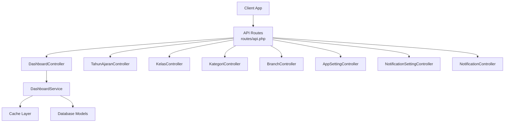
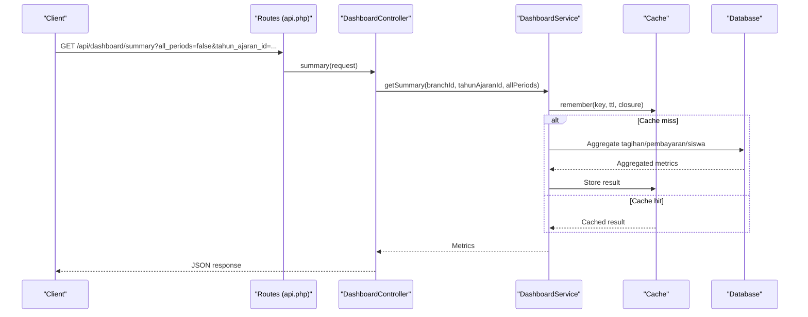
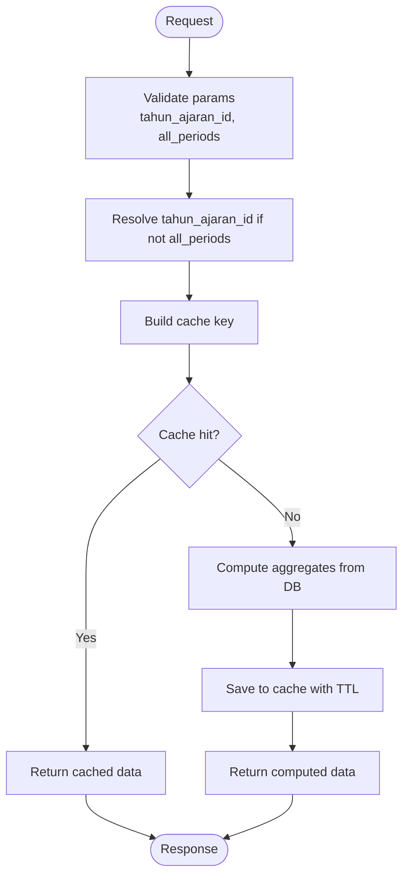
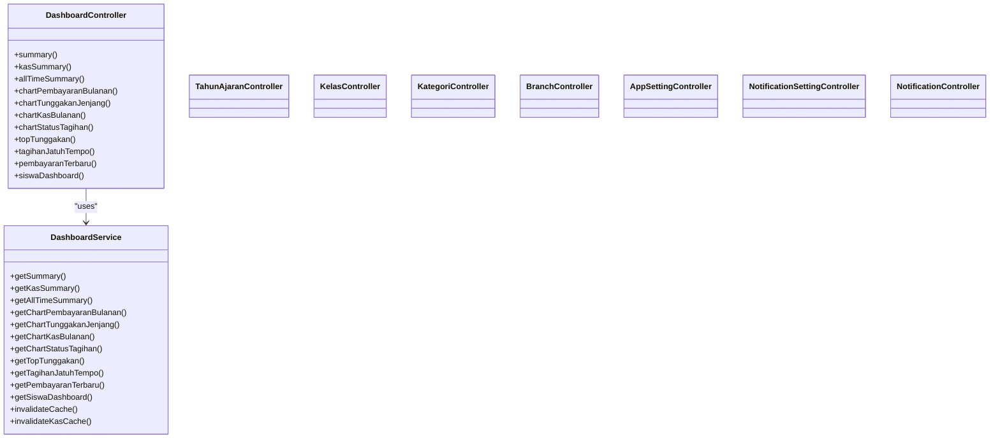

# Administrative Operations API

<cite>
**Referenced Files in This Document**
- [api.php](file://backend/routes/api.php)
- [DashboardController.php](file://backend/app/Http/Controllers/DashboardController.php)
- [DashboardService.php](file://backend/app/Services/DashboardService.php)
- [TahunAjaranController.php](file://backend/app/Http/Controllers/TahunAjaranController.php)
- [KelasController.php](file://backend/app/Http/Controllers/KelasController.php)
- [KategoriController.php](file://backend/app/Http/Controllers/KategoriController.php)
- [BranchController.php](file://backend/app/Http/Controllers/BranchController.php)
- [AppSettingController.php](file://backend/app/Http/Controllers/AppSettingController.php)
- [NotificationController.php](file://backend/app/Http/Controllers/NotificationController.php)
- [NotificationSettingController.php](file://backend/app/Http/Controllers/NotificationSettingController.php)
- [Branch.php](file://backend/app/Models/Branch.php)
- [TahunAjaran.php](file://backend/app/Models/TahunAjaran.php)
- [Kelas.php](file://backend/app/Models/Kelas.php)
- [Kategori.php](file://backend/app/Models/Kategori.php)
- [AppSetting.php](file://backend/app/Models/AppSetting.php)
</cite>

## Table of Contents
1. Introduction
2. Project Structure
3. Core Components
4. Architecture Overview
5. Detailed Component Analysis
6. Dependency Analysis
7. Performance Considerations
8. Troubleshooting Guide
9. Conclusion

## Introduction
This document provides comprehensive API documentation for administrative operation endpoints, focusing on:
- Dashboard analytics APIs for real-time statistics, charts, and KPIs
- Academic year (Tahun Ajaran) management
- Class (Kelas) organization
- Category (Kategori) administration
- Branch management for multi-location support
- System settings configuration
- Notification management for in-app messaging and notification preferences

It includes practical examples of dashboard data queries, administrative workflows, system configuration operations, caching strategies, performance considerations, and best practices.

## Project Structure
The backend exposes RESTful routes under a Sanctum-protected group with permission-based middleware. Key administrative areas are grouped by feature:
- /dashboard: Analytics and KPIs
- /tahun-ajaran: Academic year lifecycle
- /kelas: Class organization per jenjang
- /kategori: Category management
- /branches: Multi-location management
- /setting: System settings
- /notification-settings: Notification preferences
- /notifications: In-app notifications

**Diagram sources**
- [api.php:59-77](file://backend/routes/api.php#L59-L77)
- [DashboardController.php:11-303](file://backend/app/Http/Controllers/DashboardController.php#L11-L303)
- [DashboardService.php:14-711](file://backend/app/Services/DashboardService.php#L14-L711)

**Section sources**
- [api.php:47-318](file://backend/routes/api.php#L47-L318)

## Core Components
- DashboardController: Exposes analytics endpoints; delegates heavy aggregation to DashboardService.
- DashboardService: Implements cached analytics, period filtering, and cache invalidation helpers.
- TahunAjaranController: CRUD and activation/deactivation of academic years scoped to branch.
- KelasController: Class management per jenjang with uniqueness constraints.
- KategoriController: Category management with uniqueness checks.
- BranchController: Multi-location management with referential integrity checks.
- AppSettingController: Read/update school settings including logo upload.
- NotificationSettingController: Branch-level notification preferences.
- NotificationController: User-specific in-app notifications.

**Section sources**
- [DashboardController.php:11-303](file://backend/app/Http/Controllers/DashboardController.php#L11-L303)
- [DashboardService.php:14-711](file://backend/app/Services/DashboardService.php#L14-L711)
- [TahunAjaranController.php:13-215](file://backend/app/Http/Controllers/TahunAjaranController.php#L13-L215)
- [KelasController.php:12-220](file://backend/app/Http/Controllers/KelasController.php#L12-L220)
- [KategoriController.php:12-121](file://backend/app/Http/Controllers/KategoriController.php#L12-L121)
- [BranchController.php:11-124](file://backend/app/Http/Controllers/BranchController.php#L11-L124)
- [AppSettingController.php:14-72](file://backend/app/Http/Controllers/AppSettingController.php#L14-L72)
- [NotificationSettingController.php:10-47](file://backend/app/Http/Controllers/NotificationSettingController.php#L10-L47)
- [NotificationController.php:9-52](file://backend/app/Http/Controllers/NotificationController.php#L9-L52)

## Architecture Overview
The admin API follows a controller-service pattern with caching at the service layer. All endpoints require authentication via Sanctum and are protected by permissions where applicable.

**Diagram sources**
- [api.php:59-72](file://backend/routes/api.php#L59-L72)
- [DashboardController.php:20-34](file://backend/app/Http/Controllers/DashboardController.php#L20-L34)
- [DashboardService.php:112-164](file://backend/app/Services/DashboardService.php#L112-L164)

## Detailed Component Analysis

### Dashboard Analytics APIs
Endpoints:
- GET /api/dashboard/summary
- GET /api/dashboard/all-time-summary
- GET /api/dashboard/kas-summary
- GET /api/dashboard/charts/pembayaran-bulanan
- GET /api/dashboard/charts/tunggakan-jenjang
- GET /api/dashboard/charts/kas-bulanan
- GET /api/dashboard/charts/status-tagihan
- GET /api/dashboard/top-tunggakan
- GET /api/dashboard/tagihan-jatuh-tempo
- GET /api/dashboard/pembayaran-terbaru
- GET /api/dashboard/siswa

Common query parameters:
- tahun_ajaran_id: integer, optional; filters by academic year
- all_periods: boolean, optional; when true, aggregates across all periods
- siswa_id: integer, optional; personal dashboard target (for /siswa)

Permissions:
- view-dashboard for admin analytics
- view-own-billing for /siswa

Example requests:
- Summary for active period: GET /api/dashboard/summary
- Summary across all periods: GET /api/dashboard/summary?all_periods=true
- Monthly payments chart: GET /api/dashboard/charts/pembayaran-bulanan?tahun_ajaran_id=123
- Personal dashboard: GET /api/dashboard/siswa?siswa_id=456&all_periods=false

Response structure highlights:
- summary: total_tagihan, total_terbayar, total_tunggakan, jumlah_siswa_aktif, jumlah_siswa_punya_tagihan, jumlah_siswa_menunggak, persentase_pelunasan
- kas-summary: total_pemasukan, total_pengeluaran, saldo, is_all_time
- charts: arrays with monthly breakdowns or status distributions
- top-tunggakan: list of students with highest outstanding balances
- tagihan-jatuh-tempo: upcoming due items within next 7 days
- pembayaran-terbaru: last 5 payments
- siswa: totals, tagihan_list, pembayaran_terbaru

Caching strategy:
- 5-minute TTL keys per endpoint, branch, and tahun_ajaran_id
- Specialized invalidators for summary and kas-bulanan

**Diagram sources**
- [DashboardService.php:112-164](file://backend/app/Services/DashboardService.php#L112-L164)
- [DashboardService.php:60-94](file://backend/app/Services/DashboardService.php#L60-L94)

**Section sources**
- [api.php:59-77](file://backend/routes/api.php#L59-L77)
- [DashboardController.php:20-303](file://backend/app/Http/Controllers/DashboardController.php#L20-L303)
- [DashboardService.php:14-711](file://backend/app/Services/DashboardService.php#L14-L711)

### Academic Year (Tahun Ajaran) Management
Endpoints:
- GET /api/tahun-ajaran
- POST /api/tahun-ajaran
- GET /api/tahun-ajaran/{id}
- PUT /api/tahun-ajaran/{id}
- DELETE /api/tahun-ajaran/{id}
- PATCH /api/tahun-ajaran/{id}/activate
- PATCH /api/tahun-ajaran/{id}/deactivate

Business rules:
- Nama format must be YYYY/YYYY with second year = first year + 1
- Unique per branch (case-insensitive)
- Deletion blocked if related tagihan/jenis_tagihan/siswa_kelas exist
- Activate deactivates other active years in same branch

Example workflow:
- Create a new academic year with valid nama and dates
- Activate it to become the current period
- Use tahun_ajaran_id in dashboard queries to filter analytics

**Section sources**
- [api.php:196-205](file://backend/routes/api.php#L196-L205)
- [TahunAjaranController.php:13-215](file://backend/app/Http/Controllers/TahunAjaranController.php#L13-L215)
- [TahunAjaran.php:8-65](file://backend/app/Models/TahunAjaran.php#L8-L65)

### Class (Kelas) Organization
Endpoints:
- GET /api/kelas/
- GET /api/kelas/{jenjang}
- POST /api/kelas/{jenjang}
- GET /api/kelas/{jenjang}/{id}
- PUT /api/kelas/{jenjang}/{id}
- DELETE /api/kelas/{jenjang}/{id}

Constraints:
- jenjang must be MI, TK, or KB
- Unique class name per branch and jenjang
- Unique level per jenjang and branch
- Delete blocked if kelas is used by siswa

Example workflow:
- List classes by jenjang
- Create a new class with unique name and level
- Update or delete after validation

**Section sources**
- [api.php:122-130](file://backend/routes/api.php#L122-L130)
- [KelasController.php:12-220](file://backend/app/Http/Controllers/KelasController.php#L12-L220)
- [Kelas.php:8-41](file://backend/app/Models/Kelas.php#L8-L41)

### Category (Kategori) Administration
Endpoints:
- GET /api/kategori/
- POST /api/kategori/
- GET /api/kategori/{id}
- PUT /api/kategori/{id}
- DELETE /api/kategori/{id}

Constraints:
- Unique category name per branch (case-insensitive)
- Delete blocked if kategori is used by siswa

Example workflow:
- Create categories for student classification
- Update names as needed
- Remove unused categories

**Section sources**
- [api.php:132-139](file://backend/routes/api.php#L132-L139)
- [KategoriController.php:12-121](file://backend/app/Http/Controllers/KategoriController.php#L12-L121)
- [Kategori.php:8-34](file://backend/app/Models/Kategori.php#L8-L34)

### Branch Management (Multi-location)
Endpoints:
- GET /api/branches/
- POST /api/branches/
- GET /api/branches/{id}
- PUT /api/branches/{id}
- DELETE /api/branches/{id}

Constraints:
- Unique location name (case-insensitive)
- Delete blocked if branch has users, siswas, or kelas

Example workflow:
- Add a new branch location
- Update location details
- Remove branches only when no dependent data exists

**Section sources**
- [api.php:283-290](file://backend/routes/api.php#L283-L290)
- [BranchController.php:11-124](file://backend/app/Http/Controllers/BranchController.php#L11-L124)
- [Branch.php:8-64](file://backend/app/Models/Branch.php#L8-L64)

### System Settings Configuration
Endpoints:
- GET /api/setting
- POST /api/setting/{id}

Behavior:
- Returns branch-scoped app settings
- Update supports non-file fields and optional logo file upload
- Logo stored under public disk path and persisted relative path

Example workflow:
- Retrieve current settings
- Update text fields and optionally replace logo

**Section sources**
- [api.php:207-209](file://backend/routes/api.php#L207-L209)
- [AppSettingController.php:14-72](file://backend/app/Http/Controllers/AppSettingController.php#L14-L72)
- [AppSetting.php:8-37](file://backend/app/Models/AppSetting.php#L8-L37)

### Notification Management
In-app notifications:
- GET /api/notifications/
- GET /api/notifications/unread-count
- PATCH /api/notifications/{id}/read
- POST /api/notifications/mark-all-read

Notification preferences:
- GET /api/notification-settings
- PUT /api/notification-settings

Behavior:
- Notifications are user-scoped and paginated
- Preferences are branch-scoped with defaults created on first access

Example workflow:
- Fetch unread count and list
- Mark individual or all as read
- Configure reminder schedules and toggles

**Section sources**
- [api.php:256-262](file://backend/routes/api.php#L256-L262)
- [api.php:211-213](file://backend/routes/api.php#L211-L213)
- [NotificationController.php:9-52](file://backend/app/Http/Controllers/NotificationController.php#L9-L52)
- [NotificationSettingController.php:10-47](file://backend/app/Http/Controllers/NotificationSettingController.php#L10-L47)

## Dependency Analysis
Administrative controllers depend on models and services:
- DashboardController depends on DashboardService for aggregated analytics and caching
- TahunAjaranController uses TahunAjaran model and enforces business rules
- KelasController and KategoriController enforce uniqueness and referential integrity
- BranchController ensures deletion safety against related entities
- AppSettingController handles file storage and persistence
- Notification controllers manage user and branch-scoped resources

**Diagram sources**
- [DashboardController.php:11-303](file://backend/app/Http/Controllers/DashboardController.php#L11-L303)
- [DashboardService.php:14-711](file://backend/app/Services/DashboardService.php#L14-L711)

**Section sources**
- [DashboardController.php:11-303](file://backend/app/Http/Controllers/DashboardController.php#L11-L303)
- [DashboardService.php:14-711](file://backend/app/Services/DashboardService.php#L14-L711)
- [TahunAjaranController.php:13-215](file://backend/app/Http/Controllers/TahunAjaranController.php#L13-L215)
- [KelasController.php:12-220](file://backend/app/Http/Controllers/KelasController.php#L12-L220)
- [KategoriController.php:12-121](file://backend/app/Http/Controllers/KategoriController.php#L12-L121)
- [BranchController.php:11-124](file://backend/app/Http/Controllers/BranchController.php#L11-L124)
- [AppSettingController.php:14-72](file://backend/app/Http/Controllers/AppSettingController.php#L14-L72)
- [NotificationSettingController.php:10-47](file://backend/app/Http/Controllers/NotificationSettingController.php#L10-L47)
- [NotificationController.php:9-52](file://backend/app/Http/Controllers/NotificationController.php#L9-L52)

## Performance Considerations
- Caching:
  - DashboardService caches results with 5-minute TTL keyed by branch, tahun_ajaran_id, and endpoint
  - Invalidate specific caches when underlying data changes (e.g., kas-bulanan on pengeluaran updates)
- Query optimization:
  - Use aggregated SQL and joins efficiently
  - Apply period filters only when necessary
- Pagination:
  - Notifications use pagination to limit payload size
- File uploads:
  - Logo replacement deletes old files to avoid storage bloat

Best practices:
- Prefer all_periods=false with explicit tahun_ajaran_id for predictable cache hits
- Batch operations where possible (e.g., mark-all-read)
- Monitor cache hit rates and adjust TTL based on update frequency

[No sources needed since this section provides general guidance]

## Troubleshooting Guide
Common issues and resolutions:
- 404 Not Found:
  - Ensure resource IDs exist and belong to the authenticated user’s branch
- 403 Forbidden:
  - Verify required permissions (e.g., view-dashboard, manage-tahun-ajaran)
  - For /siswa, ensure user has access to the specified siswa
- 409 Conflict:
  - Cannot delete records with dependencies (branch, tahun ajaran, kelas, kategori)
- 422 Validation Errors:
  - Check nama format for tahun ajaran (YYYY/YYYY)
  - Ensure unique names for kelas/kategori per branch
- Cache staleness:
  - After bulk updates, consider invalidating dashboard caches

Operational tips:
- Use activate/deactivate endpoints to switch active academic year safely
- Confirm deletion prerequisites before destructive operations
- Log permission denials for auditability

**Section sources**
- [TahunAjaranController.php:174-215](file://backend/app/Http/Controllers/TahunAjaranController.php#L174-L215)
- [KelasController.php:182-220](file://backend/app/Http/Controllers/KelasController.php#L182-L220)
- [KategoriController.php:94-121](file://backend/app/Http/Controllers/KategoriController.php#L94-L121)
- [BranchController.php:98-124](file://backend/app/Http/Controllers/BranchController.php#L98-L124)
- [DashboardService.php:68-107](file://backend/app/Services/DashboardService.php#L68-L107)

## Conclusion
The administrative API provides robust endpoints for analytics, academic year management, class and category administration, branch management, system settings, and notifications. The design emphasizes security through authentication and permissions, performance via caching, and data integrity through validation and referential checks. Following the documented workflows and best practices will ensure reliable and efficient administration across multiple locations and academic periods.

[No sources needed since this section summarizes without analyzing specific files]