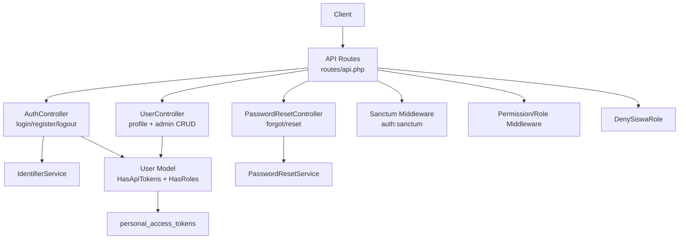
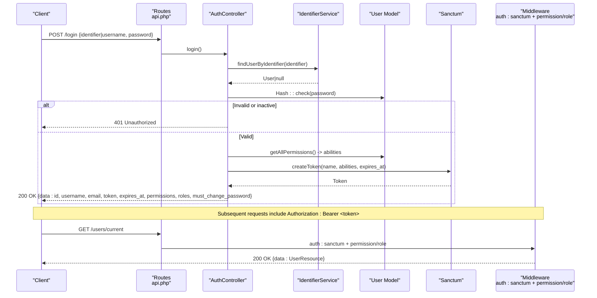
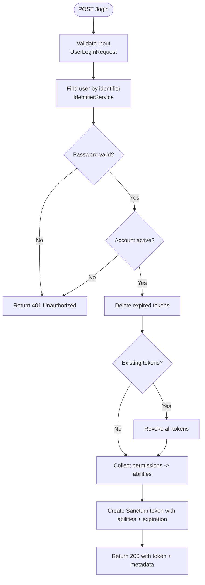
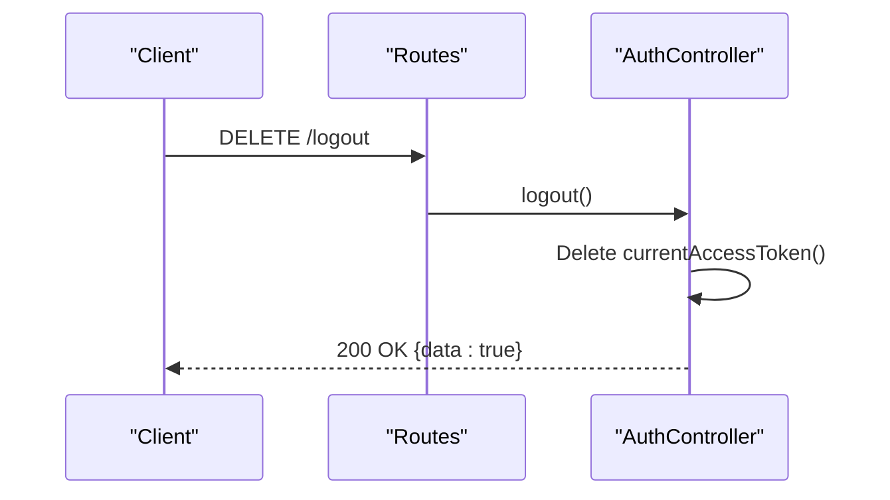
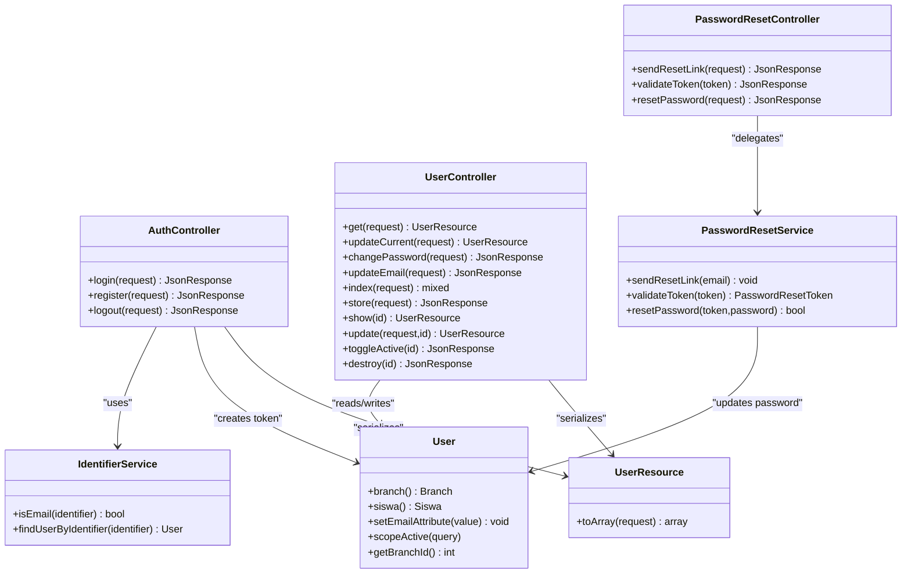

# Authentication & User Management API

<cite>
**Referenced Files in This Document**
- [api.php](file://backend/routes/api.php)
- [AuthController.php](file://backend/app/Http/Controllers/AuthController.php)
- [UserController.php](file://backend/app/Http/Controllers/UserController.php)
- [PasswordResetController.php](file://backend/app/Http/Controllers/PasswordResetController.php)
- [UserLoginRequest.php](file://backend/app/Http/Requests/UserLoginRequest.php)
- [UserRegisterRequest.php](file://backend/app/Http/Requests/UserRegisterRequest.php)
- [UserResource.php](file://backend/app/Http/Resources/UserResource.php)
- [User.php](file://backend/app/Models/User.php)
- [PasswordResetService.php](file://backend/app/Services/PasswordResetService.php)
- [IdentifierService.php](file://backend/app/Services/IdentifierService.php)
- [sanctum.php](file://backend/config/sanctum.php)
- [auth.php](file://backend/config/auth.php)
- [DenySiswaRole.php](file://backend/app/Http/Middleware/DenySiswaRole.php)
- [app.php](file://backend/bootstrap/app.php)
- [2026_05_02_000000_create_personal_access_tokens_table.php](file://backend/database/migrations/2026_05_02_000000_create_personal_access_tokens_table.php)
</cite>

## Table of Contents
1. Introduction
2. Project Structure
3. Core Components
4. Architecture Overview
5. Detailed Component Analysis
6. Dependency Analysis
7. Performance Considerations
8. Troubleshooting Guide
9. Conclusion

## Introduction
This document provides comprehensive API documentation for authentication and user management endpoints implemented with Laravel Sanctum. It covers login/logout, password reset, and user profile management APIs, including request/response schemas, token lifecycle, security considerations, role-based access control (RBAC), permission validation, session behavior, concurrent sessions, and logout semantics. Practical examples are included to guide clients on how to authenticate, handle tokens, and manage user profiles securely.

## Project Structure
The authentication and user management features are organized under the following areas:
- Routes: Public and protected endpoints are defined in the API routes file.
- Controllers: AuthController handles login/register/logout; UserController manages user profiles and admin CRUD; PasswordResetController implements password reset flows.
- Services: IdentifierService resolves users by username or email; PasswordResetService orchestrates token generation, validation, and password updates.
- Models: User model integrates Sanctum tokens and Spatie roles.
- Resources: UserResource standardizes user data serialization.
- Config: Sanctum and auth configuration define guards, expiration, and stateful domains.
- Middleware: DenySiswaRole restricts admin panel access for siswa-only accounts.

**Diagram sources**
- [api.php:36-319](file://backend/routes/api.php#L36-L319)
- [AuthController.php:15-103](file://backend/app/Http/Controllers/AuthController.php#L15-L103)
- [UserController.php:16-317](file://backend/app/Http/Controllers/UserController.php#L16-L317)
- [PasswordResetController.php:9-78](file://backend/app/Http/Controllers/PasswordResetController.php#L9-L78)
- [IdentifierService.php:7-49](file://backend/app/Services/IdentifierService.php#L7-L49)
- [PasswordResetService.php:11-100](file://backend/app/Services/PasswordResetService.php#L11-L100)
- [User.php:10-74](file://backend/app/Models/User.php#L10-L74)
- [2026_05_02_000000_create_personal_access_tokens_table.php:12-33](file://backend/database/migrations/2026_05_02_000000_create_personal_access_tokens_table.php#L12-L33)
- [DenySiswaRole.php:15-45](file://backend/app/Http/Middleware/DenySiswaRole.php#L15-L45)

**Section sources**
- [api.php:36-319](file://backend/routes/api.php#L36-L319)
- [AppServiceProvider:21-28](file://backend/bootstrap/app.php#L21-L28)

## Core Components
- Authentication Controller: Handles login, registration, and logout. Login supports identifier (username or email) and returns a Sanctum token with abilities derived from user permissions. Logout revokes the current token.
- User Controller: Provides current user profile retrieval/update, password change, email update, and admin-level user CRUD with RBAC enforcement.
- Password Reset Controller: Implements forgot-password, token validation, and reset-password flows using a custom service.
- Services:
  - IdentifierService: Resolves users by email or username with active checks and constraints for admin/operator accounts.
  - PasswordResetService: Generates secure tokens, sends emails, validates tokens, resets passwords, and revokes existing tokens upon successful reset.
- Models and Resources:
  - User: Integrates Sanctum tokens and Spatie roles; includes casts and helpers.
  - UserResource: Normalizes user responses.
- Configuration:
  - Sanctum: Token expiration, guard, stateful domains, middleware.
  - Auth: Default guard and password broker settings.
- Middleware:
  - Sanctum auth:sanctum protects routes via bearer tokens.
  - Permission/Role middleware enforce RBAC.
  - DenySiswaRole prevents siswa-only users from accessing admin routes.

**Section sources**
- [AuthController.php:15-103](file://backend/app/Http/Controllers/AuthController.php#L15-L103)
- [UserController.php:16-317](file://backend/app/Http/Controllers/UserController.php#L16-L317)
- [PasswordResetController.php:9-78](file://backend/app/Http/Controllers/PasswordResetController.php#L9-L78)
- [IdentifierService.php:7-49](file://backend/app/Services/IdentifierService.php#L7-L49)
- [PasswordResetService.php:11-100](file://backend/app/Services/PasswordResetService.php#L11-L100)
- [User.php:10-74](file://backend/app/Models/User.php#L10-L74)
- [UserResource.php:8-33](file://backend/app/Http/Resources/UserResource.php#L8-L33)
- [sanctum.php:1-85](file://backend/config/sanctum.php#L1-L85)
- [auth.php:1-116](file://backend/config/auth.php#L1-L116)
- [DenySiswaRole.php:15-45](file://backend/app/Http/Middleware/DenySiswaRole.php#L15-L45)
- [app.php:21-28](file://backend/bootstrap/app.php#L21-L28)

## Architecture Overview
Authentication uses Laravel Sanctum with bearer tokens. The login flow issues a token with abilities equal to the user’s permissions at creation time. Protected routes use auth:sanctum and optional permission/role middleware. Admin routes additionally apply deny_siswa to block siswa-only accounts.

**Diagram sources**
- [api.php:36-52](file://backend/routes/api.php#L36-L52)
- [AuthController.php:41-94](file://backend/app/Http/Controllers/AuthController.php#L41-L94)
- [IdentifierService.php:24-47](file://backend/app/Services/IdentifierService.php#L24-L47)
- [User.php:10-74](file://backend/app/Models/User.php#L10-L74)
- [sanctum.php:37-50](file://backend/config/sanctum.php#L37-L50)
- [app.php:21-28](file://backend/bootstrap/app.php#L21-L28)

## Detailed Component Analysis

### Authentication Endpoints

#### Login
- Endpoint: POST /login
- Description: Authenticates a user by identifier (email or username) and password. Returns a Sanctum token with abilities based on user permissions.
- Request Body:
  - identifier OR username: string (required depending on presence)
  - password: string (min 8, max 100)
- Response (200):
  - data.id: integer
  - data.username: string
  - data.email: string
  - data.token: string (plain-text Sanctum token)
  - data.expires_at: ISO timestamp
  - data.permissions: array<string>
  - data.roles: array<string>
  - data.must_change_password: boolean
- Errors:
  - 400: Validation errors
  - 401: Invalid credentials or inactive account

**Diagram sources**
- [AuthController.php:41-94](file://backend/app/Http/Controllers/AuthController.php#L41-L94)
- [UserLoginRequest.php:24-49](file://backend/app/Http/Requests/UserLoginRequest.php#L24-L49)
- [IdentifierService.php:24-47](file://backend/app/Services/IdentifierService.php#L24-L47)
- [sanctum.php:50-50](file://backend/config/sanctum.php#L50-L50)

**Section sources**
- [api.php:36-36](file://backend/routes/api.php#L36-L36)
- [AuthController.php:41-94](file://backend/app/Http/Controllers/AuthController.php#L41-L94)
- [UserLoginRequest.php:24-49](file://backend/app/Http/Requests/UserLoginRequest.php#L24-L49)
- [IdentifierService.php:24-47](file://backend/app/Services/IdentifierService.php#L24-L47)
- [sanctum.php:50-50](file://backend/config/sanctum.php#L50-L50)

#### Logout
- Endpoint: DELETE /logout
- Description: Revokes the current access token for the authenticated user.
- Authentication: Required (Bearer token)
- Response (200):
  - data: true
- Errors:
  - 401: Unauthorized if token missing/expired

**Diagram sources**
- [api.php:47-48](file://backend/routes/api.php#L47-L48)
- [AuthController.php:96-101](file://backend/app/Http/Controllers/AuthController.php#L96-L101)

**Section sources**
- [api.php:47-48](file://backend/routes/api.php#L47-L48)
- [AuthController.php:96-101](file://backend/app/Http/Controllers/AuthController.php#L96-L101)

### Password Reset Endpoints

#### Forgot Password
- Endpoint: POST /forgot-password
- Description: Sends a password reset link to the provided email if the account exists and is active. Anti-enumeration: always returns the same response.
- Request Body:
  - email: string (required, valid email)
- Response (200):
  - message: string (generic success message)

**Section sources**
- [api.php:39-39](file://backend/routes/api.php#L39-L39)
- [PasswordResetController.php:18-30](file://backend/app/Http/Controllers/PasswordResetController.php#L18-L30)
- [PasswordResetService.php:16-51](file://backend/app/Services/PasswordResetService.php#L16-L51)

#### Validate Reset Token
- Endpoint: GET /reset-password/{token}
- Description: Validates whether the reset token is present and not expired.
- Path Parameter:
  - token: string (64 characters)
- Response (200):
  - valid: boolean
  - email: string (only when valid)
- Response (422):
  - valid: false
  - message: string (invalid or expired)

**Section sources**
- [api.php:40-40](file://backend/routes/api.php#L40-L40)
- [PasswordResetController.php:35-50](file://backend/app/Http/Controllers/PasswordResetController.php#L35-L50)
- [PasswordResetService.php:56-65](file://backend/app/Services/PasswordResetService.php#L56-L65)

#### Reset Password
- Endpoint: POST /reset-password
- Description: Resets the password using a valid token. On success, marks the token used and revokes all existing tokens.
- Request Body:
  - token: string (required, size 64)
  - password: string (required, min 8, max 100)
  - password_confirmation: string (required, must match password)
- Response (200):
  - message: string (success)
- Response (422):
  - message: string (invalid or expired token)

**Section sources**
- [api.php:41-41](file://backend/routes/api.php#L41-L41)
- [PasswordResetController.php:55-76](file://backend/app/Http/Controllers/PasswordResetController.php#L55-L76)
- [PasswordResetService.php:70-98](file://backend/app/Services/PasswordResetService.php#L70-L98)

### User Profile Management

#### Get Current User
- Endpoint: GET /users/current
- Description: Retrieves the authenticated user's profile.
- Authentication: Required (Bearer token)
- Response (200):
  - data: UserResource object

**Section sources**
- [api.php:49-49](file://backend/routes/api.php#L49-L49)
- [UserController.php:23-35](file://backend/app/Http/Controllers/UserController.php#L23-L35)
- [UserResource.php:15-31](file://backend/app/Http/Resources/UserResource.php#L15-L31)

#### Update Current User
- Endpoint: PATCH /users/current
- Description: Updates the authenticated user's profile fields. If password is provided, it will be hashed and saved.
- Request Body:
  - name?: string
  - email?: string
  - password?: string (min 8, max 100)
- Authentication: Required (Bearer token)
- Response (200):
  - data: UserResource object

**Section sources**
- [api.php:50-50](file://backend/routes/api.php#L50-L50)
- [UserController.php:40-58](file://backend/app/Http/Controllers/UserController.php#L40-L58)

#### Change Password
- Endpoint: POST /users/change-password
- Description: Changes the authenticated user's password after verifying the current password. Sets must_change_password to false.
- Request Body:
  - current_password: string (required)
  - new_password: string (required, min 8, confirmed)
  - new_password_confirmation: string (required)
- Authentication: Required (Bearer token)
- Response (200):
  - data: true
  - message: string (success)
- Response (422):
  - errors.current_password: ["Password saat ini tidak sesuai."]

**Section sources**
- [api.php:52-52](file://backend/routes/api.php#L52-L52)
- [UserController.php:194-219](file://backend/app/Http/Controllers/UserController.php#L194-L219)

#### Update Email
- Endpoint: PATCH /users/current/email
- Description: Updates the authenticated user's email after verifying the current password. Enforces branch-level uniqueness.
- Request Body:
  - email: string (required, valid email)
  - current_password: string (required)
- Authentication: Required (Bearer token)
- Response (200):
  - message: string (success)
  - data.email: string
- Response (422):
  - errors.current_password: ["Password saat ini tidak sesuai."]
  - errors.email: ["Email sudah digunakan oleh user lain di cabang ini."]

**Section sources**
- [api.php:51-51](file://backend/routes/api.php#L51-L51)
- [UserController.php:281-315](file://backend/app/Http/Controllers/UserController.php#L281-L315)

### Admin User Management (RBAC Protected)

These endpoints are protected by auth:sanctum and additional permission middleware. They also require deny_siswa to prevent siswa-only users from accessing admin functionality.

- List Users: GET /users
  - Query params: per_page (default 10, max 100), branch_id?, role?, search?, is_active?
  - Permissions: view-user
  - Response: Collection of UserResource

- Create User: POST /users
  - Body: username, password, name?, email?, branch_id, is_active?, roles[]
  - Permissions: create-user
  - Response: 201 {data: UserResource}

- Show User: GET /users/{id}
  - Permissions: read-user
  - Response: UserResource

- Update User: PUT /users/{id}
  - Body: username?, email?, name?, password?, branch_id?, is_active?, roles[]
  - Permissions: update-user
  - Response: UserResource

- Toggle Active: PATCH /users/{id}/toggle-active
  - Permissions: update-user
  - Behavior: When deactivated, revokes all active tokens for that user
  - Response: {data: {id, is_active}}

- Delete User: DELETE /users/{id}
  - Permissions: delete-user
  - Behavior: Revokes all tokens and removes roles before deletion
  - Response: {data: true, message: string}

**Section sources**
- [api.php:82-99](file://backend/routes/api.php#L82-L99)
- [UserController.php:66-276](file://backend/app/Http/Controllers/UserController.php#L66-L276)
- [DenySiswaRole.php:22-43](file://backend/app/Http/Middleware/DenySiswaRole.php#L22-L43)
- [app.php:21-28](file://backend/bootstrap/app.php#L21-L28)

### Data Models and Resources

#### User Resource Schema
- Fields:
  - id: integer
  - username: string
  - name: string
  - email: string
  - is_active: boolean
  - must_change_password: boolean
  - branch: object (when loaded)
    - id: integer
    - location: string
  - roles: array<string> (when loaded)
  - created_at: timestamp

**Section sources**
- [UserResource.php:15-31](file://backend/app/Http/Resources/UserResource.php#L15-L31)

#### Sanctum Token Storage
- Table: personal_access_tokens
- Columns: id, tokenable_type, tokenable_id, name, token (unique), abilities (text), expires_at (nullable), last_used_at (nullable), timestamps

**Section sources**
- [2026_05_02_000000_create_personal_access_tokens_table.php:14-23](file://backend/database/migrations/2026_05_02_000000_create_personal_access_tokens_table.php#L14-L23)

## Dependency Analysis

**Diagram sources**
- [AuthController.php:15-103](file://backend/app/Http/Controllers/AuthController.php#L15-L103)
- [UserController.php:16-317](file://backend/app/Http/Controllers/UserController.php#L16-L317)
- [PasswordResetController.php:9-78](file://backend/app/Http/Controllers/PasswordResetController.php#L9-L78)
- [IdentifierService.php:7-49](file://backend/app/Services/IdentifierService.php#L7-L49)
- [PasswordResetService.php:11-100](file://backend/app/Services/PasswordResetService.php#L11-L100)
- [User.php:10-74](file://backend/app/Models/User.php#L10-L74)
- [UserResource.php:8-33](file://backend/app/Http/Resources/UserResource.php#L8-L33)

**Section sources**
- [AuthController.php:15-103](file://backend/app/Http/Controllers/AuthController.php#L15-L103)
- [UserController.php:16-317](file://backend/app/Http/Controllers/UserController.php#L16-L317)
- [PasswordResetController.php:9-78](file://backend/app/Http/Controllers/PasswordResetController.php#L9-L78)
- [IdentifierService.php:7-49](file://backend/app/Services/IdentifierService.php#L7-L49)
- [PasswordResetService.php:11-100](file://backend/app/Services/PasswordResetService.php#L11-L100)
- [User.php:10-74](file://backend/app/Models/User.php#L10-L74)
- [UserResource.php:8-33](file://backend/app/Http/Resources/UserResource.php#L8-L33)

## Performance Considerations
- Token creation collects all permissions into abilities; ensure the number of permissions remains reasonable to avoid large token payloads.
- Pagination defaults to 10 with a maximum of 100; tune per_page limits according to client needs.
- Avoid unnecessary eager loading; only load relationships when needed (e.g., branch, roles).
- Use database indexes on frequently queried columns (username, email, is_active) to improve lookup performance.

[No sources needed since this section provides general guidance]

## Troubleshooting Guide
Common issues and resolutions:
- 401 Unauthorized:
  - Missing or invalid Bearer token. Ensure Authorization header is set correctly.
  - Expired token: Refresh by logging in again.
  - Inactive account: Contact administrator to activate the account.
- 403 Forbidden:
  - Insufficient permissions: Verify user has required permission.
  - Siswa-only restriction: deny_siswa blocks siswa-only users from admin routes.
- 422 Unprocessable Entity:
  - Validation errors: Check request body against schema requirements.
  - Password mismatch or weak password: Ensure new_password matches confirmation and meets length requirements.
- Concurrent Sessions:
  - Login revokes existing tokens; subsequent requests using old tokens will fail with 401.
  - Deactivating a user revokes all their tokens immediately.
- Password Reset:
  - Token invalid/expired: Generate a new reset link.
  - Anti-enumeration: Always receive a generic success message even if the email does not exist.

**Section sources**
- [AuthController.php:50-70](file://backend/app/Http/Controllers/AuthController.php#L50-L70)
- [UserController.php:225-248](file://backend/app/Http/Controllers/UserController.php#L225-L248)
- [PasswordResetController.php:18-30](file://backend/app/Http/Controllers/PasswordResetController.php#L18-L30)
- [PasswordResetService.php:16-51](file://backend/app/Services/PasswordResetService.php#L16-L51)
- [DenySiswaRole.php:22-43](file://backend/app/Http/Middleware/DenySiswaRole.php#L22-L43)

## Conclusion
The authentication and user management system leverages Laravel Sanctum for secure token-based access, integrates Spatie RBAC for fine-grained permissions, and enforces safety measures such as anti-enumeration in password reset flows and denial of admin access for siswa-only accounts. Clients should store and send the plain-text token securely, handle token expiration gracefully, and respect permission requirements for each endpoint.

[No sources needed since this section summarizes without analyzing specific files]