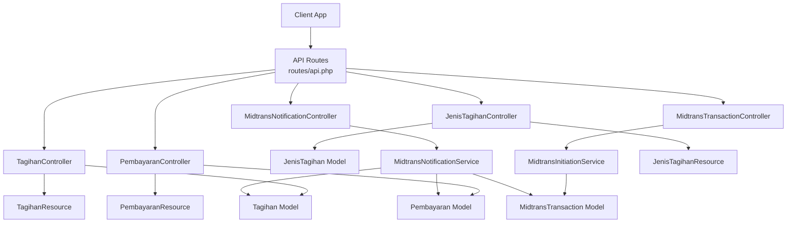
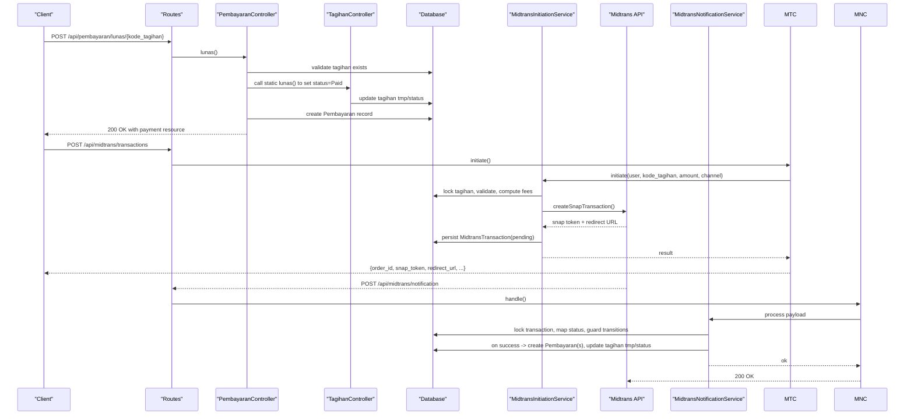
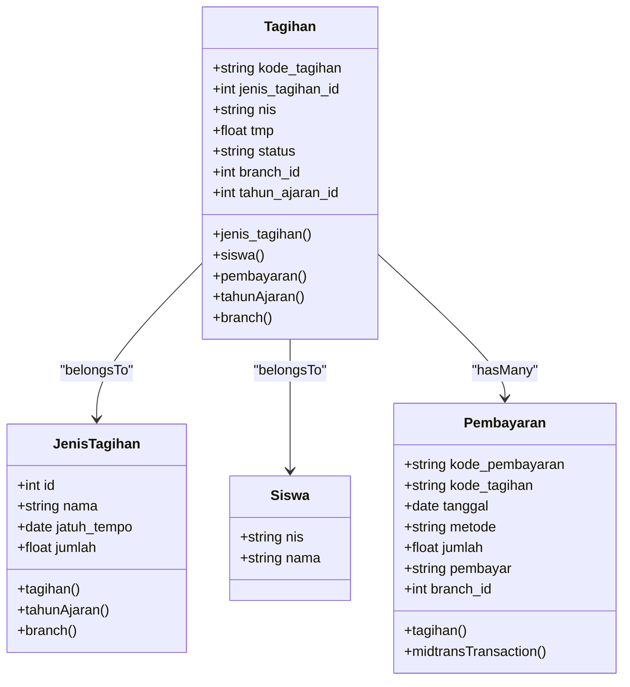
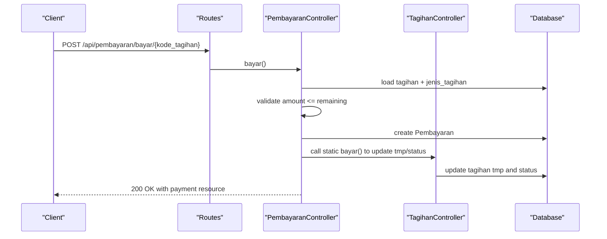
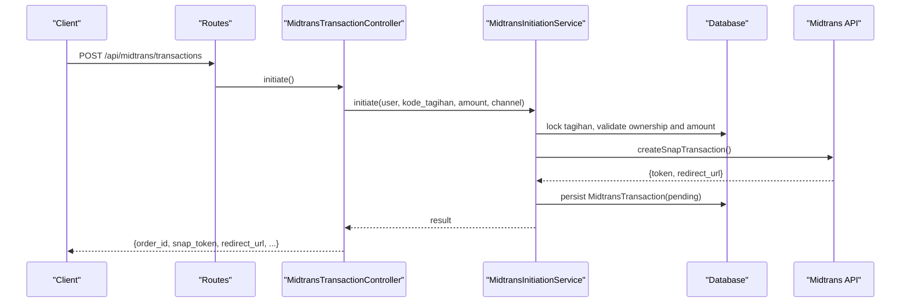
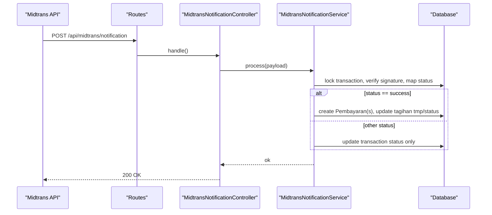
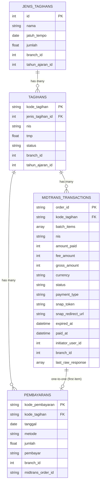
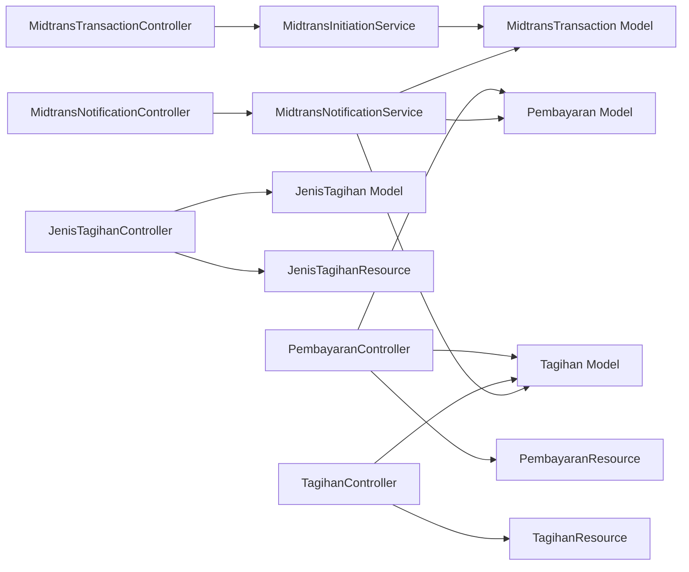

# Billing & Payment API

<cite>
**Referenced Files in This Document**
- [api.php](file://backend/routes/api.php)
- [TagihanController.php](file://backend/app/Http/Controllers/TagihanController.php)
- [PembayaranController.php](file://backend/app/Http/Controllers/PembayaranController.php)
- [JenisTagihanController.php](file://backend/app/Http/Controllers/JenisTagihanController.php)
- [MidtransTransactionController.php](file://backend/app/Http/Controllers/MidtransTransactionController.php)
- [MidtransNotificationController.php](file://backend/app/Http/Controllers/MidtransNotificationController.php)
- [Tagihan.php](file://backend/app/Models/Tagihan.php)
- [Pembayaran.php](file://backend/app/Models/Pembayaran.php)
- [JenisTagihan.php](file://backend/app/Models/JenisTagihan.php)
- [MidtransTransaction.php](file://backend/app/Models/MidtransTransaction.php)
- [PembayaranResource.php](file://backend/app/Http/Resources/PembayaranResource.php)
- [TagihanResource.php](file://backend/app/Http/Resources/TagihanResource.php)
- [JenisTagihanResource.php](file://backend/app/Http/Resources/JenisTagihanResource.php)
- [MidtransInitiationService.php](file://backend/app/Services/Midtrans/MidtransInitiationService.php)
- [MidtransNotificationService.php](file://backend/app/Services/Midtrans/MidtransNotificationService.php)
</cite>

## Table of Contents
1. Introduction
2. Project Structure
3. Core Components
4. Architecture Overview
5. Detailed Component Analysis
6. Dependency Analysis
7. Performance Considerations
8. Troubleshooting Guide
9. Conclusion
10. Appendices

## Introduction
This document provides comprehensive API documentation for billing and payment management endpoints, covering:
- Invoice (Tagihan) lifecycle: creation, updates, status changes, grouped views, and PDF export
- Payment processing: offline payments, online Midtrans payments, batch operations, refund handling via deletion, and status tracking
- Jenis Tagihan (payment type) configuration
- Grouped views for invoices and payments
- Export functionality and PDF generation for receipts
- Practical workflows, reconciliation, auditing, and data integrity considerations

## Project Structure
The billing and payment features are implemented as RESTful endpoints under the authenticated API group with permission-based access control. Key controllers handle business logic, while services encapsulate Midtrans integration and notification processing. Resources standardize JSON responses.

**Diagram sources**
- [api.php:156-194](file://backend/routes/api.php#L156-L194)
- [TagihanController.php:26-567](file://backend/app/Http/Controllers/TagihanController.php#L26-L567)
- [PembayaranController.php:24-496](file://backend/app/Http/Controllers/PembayaranController.php#L24-L496)
- [JenisTagihanController.php:15-179](file://backend/app/Http/Controllers/JenisTagihanController.php#L15-L179)
- [MidtransTransactionController.php:10-127](file://backend/app/Http/Controllers/MidtransTransactionController.php#L10-L127)
- [MidtransNotificationController.php:9-35](file://backend/app/Http/Controllers/MidtransNotificationController.php#L9-L35)
- [Tagihan.php:8-60](file://backend/app/Models/Tagihan.php#L8-L60)
- [Pembayaran.php:8-53](file://backend/app/Models/Pembayaran.php#L8-L53)
- [JenisTagihan.php:8-48](file://backend/app/Models/JenisTagihan.php#L8-L48)
- [MidtransTransaction.php:7-85](file://backend/app/Models/MidtransTransaction.php#L7-L85)
- [PembayaranResource.php:8-28](file://backend/app/Http/Resources/PembayaranResource.php#L8-L28)
- [TagihanResource.php:8-42](file://backend/app/Http/Resources/TagihanResource.php#L8-L42)
- [JenisTagihanResource.php:8-26](file://backend/app/Http/Resources/JenisTagihanResource.php#L8-L26)
- [MidtransInitiationService.php:22-473](file://backend/app/Services/Midtrans/MidtransInitiationService.php#L22-L473)
- [MidtransNotificationService.php:16-284](file://backend/app/Services/Midtrans/MidtransNotificationService.php#L16-L284)

**Section sources**
- [api.php:47-345](file://backend/routes/api.php#L47-L345)

## Core Components
- Invoices (Tagihan): CRUD, grouped listing, student view, PDF export, partial/full payment updates
- Payments (Pembayaran): Offline recording, batch full payment, deletion (refund), grouped listing, student view including pending Midtrans transactions
- Payment Types (Jenis Tagihan): CRUD with period scoping
- Online Payments (Midtrans): Initiate single/batch Snap sessions, fee channels preview, transaction status polling; webhook handler to finalize payments
- Data Models: Tagihan, Pembayaran, JenisTagihan, MidtransTransaction
- Resources: Standardized JSON payloads for Tagihan, Pembayaran, JenisTagihan

Key responsibilities:
- Controllers orchestrate requests, validations, permissions, and resource formatting
- Services implement domain rules and external integrations (Midtrans)
- Models define relationships and casts
- Resources normalize response shapes

**Section sources**
- [TagihanController.php:26-567](file://backend/app/Http/Controllers/TagihanController.php#L26-L567)
- [PembayaranController.php:24-496](file://backend/app/Http/Controllers/PembayaranController.php#L24-L496)
- [JenisTagihanController.php:15-179](file://backend/app/Http/Controllers/JenisTagihanController.php#L15-L179)
- [MidtransTransactionController.php:10-127](file://backend/app/Http/Controllers/MidtransTransactionController.php#L10-L127)
- [MidtransNotificationController.php:9-35](file://backend/app/Http/Controllers/MidtransNotificationController.php#L9-L35)
- [Tagihan.php:8-60](file://backend/app/Models/Tagihan.php#L8-L60)
- [Pembayaran.php:8-53](file://backend/app/Models/Pembayaran.php#L8-L53)
- [JenisTagihan.php:8-48](file://backend/app/Models/JenisTagihan.php#L8-L48)
- [MidtransTransaction.php:7-85](file://backend/app/Models/MidtransTransaction.php#L7-L85)
- [PembayaranResource.php:8-28](file://backend/app/Http/Resources/PembayaranResource.php#L8-L28)
- [TagihanResource.php:8-42](file://backend/app/Http/Resources/TagihanResource.php#L8-L42)
- [JenisTagihanResource.php:8-26](file://backend/app/Http/Resources/JenisTagihanResource.php#L8-L26)

## Architecture Overview
End-to-end flows for invoice and payment operations, including online payment initiation and webhook-driven settlement.

**Diagram sources**
- [api.php:167-176](file://backend/routes/api.php#L167-L176)
- [PembayaranController.php:302-340](file://backend/app/Http/Controllers/PembayaranController.php#L302-L340)
- [TagihanController.php:322-334](file://backend/app/Http/Controllers/TagihanController.php#L322-L334)
- [MidtransTransactionController.php:17-41](file://backend/app/Http/Controllers/MidtransTransactionController.php#L17-L41)
- [MidtransInitiationService.php:44-237](file://backend/app/Services/Midtrans/MidtransInitiationService.php#L44-L237)
- [MidtransNotificationController.php:20-33](file://backend/app/Http/Controllers/MidtransNotificationController.php#L20-L33)
- [MidtransNotificationService.php:31-150](file://backend/app/Services/Midtrans/MidtransNotificationService.php#L31-L150)

## Detailed Component Analysis

### Invoice (Tagihan) Management
- Endpoints
  - GET /api/tagihan/grouped — Paginated list grouped by siswa with filters (search, jenjang, kelas_id, status, jatuh_tempo range, per_page)
  - GET /api/tagihan — Paginated flat list with search, jenjang, status, sort, direction, per_page
  - GET /api/tagihan/{kode_tagihan} — Get a single invoice
  - POST /api/tagihan — Create invoices for matching students (auto tahun_ajaran if not provided)
  - PATCH /api/tagihan/{kode_tagihan} — Update jenis_tagihan
  - DELETE /api/tagihan/{kode_tagihan} — Delete if no associated payments
  - GET /api/tagihan/siswa — Student portal view with sibling support
  - GET /api/tagihan/export-pdf — Export filtered invoices to PDF
- Business rules
  - Year period scoping via tahun_ajaran_id or all_periods
  - Branch-scoped visibility; non-admin limited to own siswa
  - Status transitions handled by payment endpoints
  - PDF export supports multiple filters and formats dates
- Responses
  - Uses TagihanResource and TagihanGroupedResource for consistent payloads

**Section sources**
- [api.php:156-165](file://backend/routes/api.php#L156-L165)
- [TagihanController.php:36-527](file://backend/app/Http/Controllers/TagihanController.php#L36-L527)
- [TagihanResource.php:8-42](file://backend/app/Http/Resources/TagihanResource.php#L8-L42)

#### Class Diagram: Tagihan Model Relationships

**Diagram sources**
- [Tagihan.php:8-60](file://backend/app/Models/Tagihan.php#L8-L60)
- [JenisTagihan.php:8-48](file://backend/app/Models/JenisTagihan.php#L8-L48)
- [Pembayaran.php:8-53](file://backend/app/Models/Pembayaran.php#L8-L53)

### Payment Processing (Offline and Online)
- Offline payments
  - POST /api/pembayaran/bayar/{kode_tagihan} — Record partial payment; validates against remaining balance; updates tagihan tmp/status
  - POST /api/pembayaran/lunas/{kode_tagihan} — Mark invoice fully paid; creates a payment record; sets status to Lunas
  - POST /api/pembayaran/batch — Batch full payment for multiple invoices within a transaction
  - DELETE /api/pembayaran/{kode_pembayaran} — Refund/delete payment; recalculates tagihan tmp/status; online_midtrans deletions require additional permissions
  - GET /api/pembayaran/grouped — Paginated grouped by siswa with filters (search, jenjang, kelas_id, metode, tahun_ajaran_id, sort latest/oldest)
  - GET /api/pembayaran — Paginated flat list with search and sorting
  - GET /api/pembayaran/siswa — Student portal view including pending Midtrans transactions when include_pending=true
  - GET /api/pembayaran/kwitansi/{kode_pembayaran} — Receipt data resource
- Online payments (Midtrans)
  - GET /api/midtrans/fee-channels — Available channels and optional fee preview
  - POST /api/midtrans/transactions — Initiate single Snap session
  - POST /api/midtrans/transactions/batch — Initiate batch Snap session settling multiple invoices
  - GET /api/midtrans/transactions/{order_id} — Poll transaction status
  - POST /api/midtrans/notification — Webhook endpoint (public, signature-verified) to finalize payments
- Business rules
  - Amount validation vs sisa (remaining balance)
  - Minimum amount and gross amount invariant checks
  - Pending transaction guards prevent duplicate checkout
  - Idempotent payment recording for webhooks
  - Overpayment blocking and transition guards

**Section sources**
- [api.php:167-176](file://backend/routes/api.php#L167-L176)
- [api.php:326-344](file://backend/routes/api.php#L326-L344)
- [PembayaranController.php:119-496](file://backend/app/Http/Controllers/PembayaranController.php#L119-L496)
- [MidtransTransactionController.php:10-127](file://backend/app/Http/Controllers/MidtransTransactionController.php#L10-L127)
- [MidtransNotificationController.php:9-35](file://backend/app/Http/Controllers/MidtransNotificationController.php#L9-L35)
- [PembayaranResource.php:8-28](file://backend/app/Http/Resources/PembayaranResource.php#L8-L28)

#### Sequence Diagram: Offline Partial Payment Flow

**Diagram sources**
- [PembayaranController.php:343-397](file://backend/app/Http/Controllers/PembayaranController.php#L343-L397)
- [TagihanController.php:337-357](file://backend/app/Http/Controllers/TagihanController.php#L337-L357)

#### Sequence Diagram: Online Single Payment Flow

**Diagram sources**
- [MidtransTransactionController.php:17-41](file://backend/app/Http/Controllers/MidtransTransactionController.php#L17-L41)
- [MidtransInitiationService.php:44-237](file://backend/app/Services/Midtrans/MidtransInitiationService.php#L44-L237)

#### Sequence Diagram: Webhook Settlement Flow

**Diagram sources**
- [MidtransNotificationController.php:20-33](file://backend/app/Http/Controllers/MidtransNotificationController.php#L20-L33)
- [MidtransNotificationService.php:31-150](file://backend/app/Services/Midtrans/MidtransNotificationService.php#L31-L150)

### Payment Type (Jenis Tagihan) Management
- Endpoints
  - GET /api/jenis-tagihan — List types scoped by year period
  - POST /api/jenis-tagihan — Create type (auto assign active period if missing)
  - GET /api/jenis-tagihan/{id} — Get type
  - PUT /api/jenis-tagihan/{id} — Update type
  - DELETE /api/jenis-tagihan/{id} — Delete if unused
- Business rules
  - Year period scoping and ownership validation
  - Prevent deletion if referenced by invoices

**Section sources**
- [api.php:187-194](file://backend/routes/api.php#L187-L194)
- [JenisTagihanController.php:15-179](file://backend/app/Http/Controllers/JenisTagihanController.php#L15-L179)
- [JenisTagihanResource.php:8-26](file://backend/app/Http/Resources/JenisTagihanResource.php#L8-L26)

### Grouped Views and Exports
- Grouped invoice view: GET /api/tagihan/grouped
- Grouped payment view: GET /api/pembayaran/grouped
- Invoice PDF export: GET /api/tagihan/export-pdf
- Receipt data: GET /api/pembayaran/kwitansi/{kode_pembayaran}

**Section sources**
- [api.php:156-176](file://backend/routes/api.php#L156-L176)
- [TagihanController.php:438-527](file://backend/app/Http/Controllers/TagihanController.php#L438-L527)
- [PembayaranController.php:36-117](file://backend/app/Http/Controllers/PembayaranController.php#L36-L117)

### Data Models and Relationships

**Diagram sources**
- [Tagihan.php:8-60](file://backend/app/Models/Tagihan.php#L8-L60)
- [Pembayaran.php:8-53](file://backend/app/Models/Pembayaran.php#L8-L53)
- [JenisTagihan.php:8-48](file://backend/app/Models/JenisTagihan.php#L8-L48)
- [MidtransTransaction.php:7-85](file://backend/app/Models/MidtransTransaction.php#L7-L85)

## Dependency Analysis
- Controllers depend on models and resources
- Midtrans controllers depend on initiation and notification services
- Notification service depends on signature verification, status mapping, transition guards, logging, and fee computation
- All financial mutations use database transactions and locks to ensure consistency

**Diagram sources**
- [PembayaranController.php:24-496](file://backend/app/Http/Controllers/PembayaranController.php#L24-L496)
- [TagihanController.php:26-567](file://backend/app/Http/Controllers/TagihanController.php#L26-L567)
- [JenisTagihanController.php:15-179](file://backend/app/Http/Controllers/JenisTagihanController.php#L15-L179)
- [MidtransTransactionController.php:10-127](file://backend/app/Http/Controllers/MidtransTransactionController.php#L10-L127)
- [MidtransNotificationController.php:9-35](file://backend/app/Http/Controllers/MidtransNotificationController.php#L9-L35)
- [MidtransInitiationService.php:22-473](file://backend/app/Services/Midtrans/MidtransInitiationService.php#L22-L473)
- [MidtransNotificationService.php:16-284](file://backend/app/Services/Midtrans/MidtransNotificationService.php#L16-L284)

**Section sources**
- [api.php:47-345](file://backend/routes/api.php#L47-L345)

## Performance Considerations
- Use pagination and selective field loading in queries to reduce payload size
- Prefer grouped endpoints to minimize N+1 queries
- Leverage database transactions and row-level locks for concurrency safety during payment processing
- Avoid unnecessary eager loads; only include required relationships
- For large exports, consider background jobs and streaming responses where applicable

## Troubleshooting Guide
Common issues and resolutions:
- Invalid signature on webhook: Ensure server key is configured and request body is intact
- Amount mismatch: Verify gross_amount matches expected value before accepting settlement
- Overpayment blocked: Check sisa calculation and ensure amount does not exceed remaining balance
- Forbidden access: Confirm user’s siswa NIS matches target tagihan.nis for online payments
- Duplicate pending transaction: If a pending transaction exists, complete or cancel it before initiating a new one
- Deletion restrictions: Online_midtrans payments require specific permissions to delete; offline payments can be deleted if they exist

Operational checks:
- Validate feature flags (midtrans.enabled, webhook_enabled)
- Inspect logs for outbound/inbound events and error codes
- Review transaction state transitions using admin endpoints

**Section sources**
- [MidtransNotificationService.php:31-150](file://backend/app/Services/Midtrans/MidtransNotificationService.php#L31-L150)
- [MidtransInitiationService.php:44-237](file://backend/app/Services/Midtrans/MidtransInitiationService.php#L44-L237)
- [PembayaranController.php:244-299](file://backend/app/Http/Controllers/PembayaranController.php#L244-L299)

## Conclusion
The billing and payment system provides robust APIs for managing invoices, recording payments (offline and online), configuring payment types, and exporting reports. It enforces strong data integrity through transactions, locks, and validation, while offering practical tools for reconciliation and auditing via detailed transaction records and webhook processing.

## Appendices

### Practical Workflows

- Create an invoice and record a partial offline payment
  - Create invoice: POST /api/tagihan
  - Record partial payment: POST /api/pembayaran/bayar/{kode_tagihan}
  - Verify status: GET /api/tagihan/{kode_tagihan}

- Full offline payment (single)
  - POST /api/pembayaran/lunas/{kode_tagihan}
  - Retrieve receipt data: GET /api/pembayaran/kwitansi/{kode_pembayaran}

- Batch full offline payment
  - POST /api/pembayaran/batch with list of kode_tagihan

- Online payment (single)
  - GET /api/midtrans/fee-channels?amount=...
  - POST /api/midtrans/transactions
  - Poll status: GET /api/midtrans/transactions/{order_id}
  - Finalization occurs automatically via webhook

- Online payment (batch)
  - POST /api/midtrans/transactions/batch with kode_tagihan_list
  - Poll status and await webhook settlement

- Refund (delete payment)
  - DELETE /api/pembayaran/{kode_pembayaran}
  - Note: online_midtrans deletions require additional permissions

### Financial Reporting Queries
- Filter invoices by status, jatuh_tempo range, jenjang, kelas_id, and year period
- Group payments by siswa with method and period filters
- Export invoice report to PDF with selected filters
- Generate receipt data for audit trails

[No sources needed since this section provides general guidance]