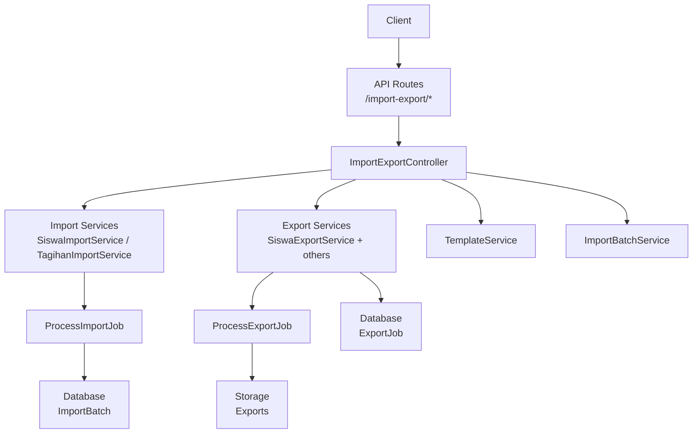
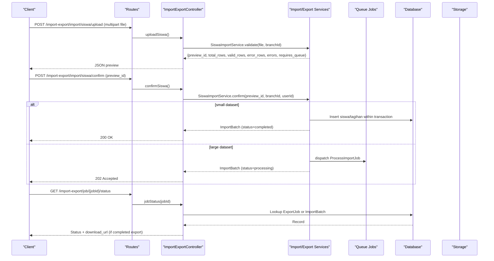
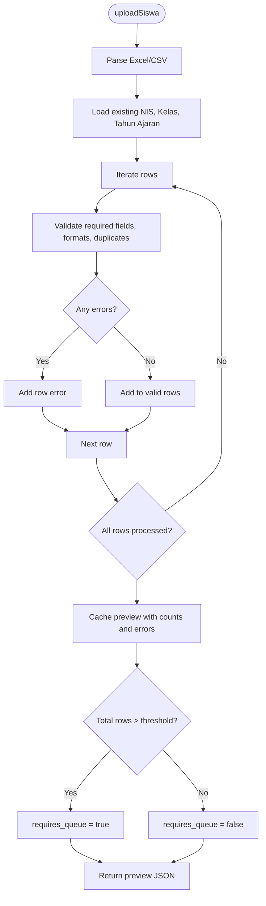
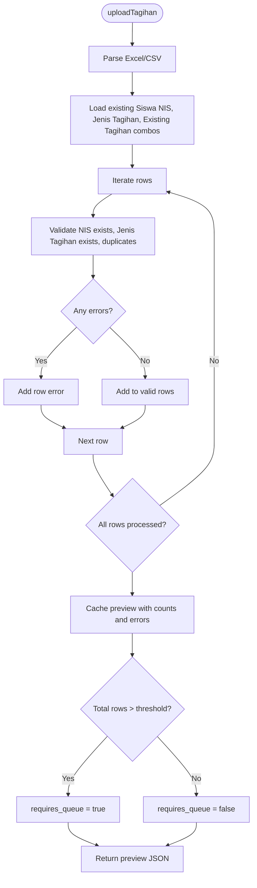
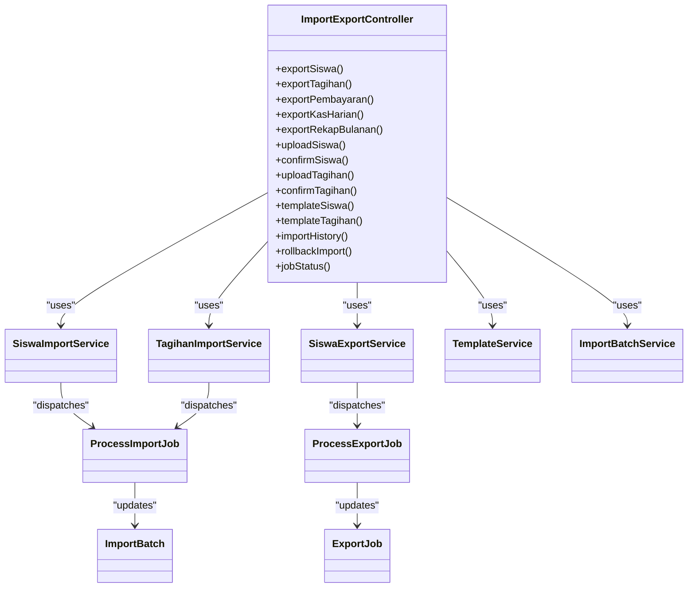

# Data Import & Export API

<cite>
**Referenced Files in This Document**
- [api.php](file://backend/routes/api.php)
- [ImportExportController.php](file://backend/app/Http/Controllers/ImportExportController.php)
- [SiswaImportService.php](file://backend/app/Services/ImportExport/SiswaImportService.php)
- [TagihanImportService.php](file://backend/app/Services/ImportExport/TagihanImportService.php)
- [TemplateService.php](file://backend/app/Services/ImportExport/TemplateService.php)
- [ImportBatchService.php](file://backend/app/Services/ImportExport/ImportBatchService.php)
- [ProcessImportJob.php](file://backend/app/Jobs/ProcessImportJob.php)
- [ProcessExportJob.php](file://backend/app/Jobs/ProcessExportJob.php)
- [SiswaExportService.php](file://backend/app/Services/ImportExport/SiswaExportService.php)
- [ImportUploadRequest.php](file://backend/app/Http/Requests/ImportUploadRequest.php)
- [ImportConfirmRequest.php](file://backend/app/Http/Requests/ImportConfirmRequest.php)
- [ImportBatch.php](file://backend/app/Models/ImportBatch.php)
- [ExportJob.php](file://backend/app/Models/ExportJob.php)
</cite>

## Table of Contents
1. [Introduction](#introduction)
2. [Project Structure](#project-structure)
3. [Core Components](#core-components)
4. [Architecture Overview](#architecture-overview)
5. [Detailed Component Analysis](#detailed-component-analysis)
6. [Dependency Analysis](#dependency-analysis)
7. [Performance Considerations](#performance-considerations)
8. [Troubleshooting Guide](#troubleshooting-guide)
9. [Conclusion](#conclusion)
10. [Appendices](#appendices)

## Introduction
This document provides comprehensive API documentation for data import and export functionality, focusing on:
- Bulk student (siswa) and invoice (tagihan) imports with validation and preview
- Export endpoints for students, invoices, payments, and financial reports (Excel and CSV)
- Template management for standardized data formats
- Import history tracking and rollback capabilities
- Job status monitoring for asynchronous operations
- Practical examples, error handling strategies, and data validation workflows
- File size limitations, performance optimization for large datasets, and data integrity checks

## Project Structure
The import/export feature is implemented under the backend application using a layered architecture:
- HTTP layer: Controller and Request classes handle routing, authorization, and request/response formatting
- Service layer: Business logic for validation, processing, and orchestration
- Jobs layer: Asynchronous processing for large imports and exports
- Models layer: Persistence for import batches and export jobs
- Templates and Exports: Excel templates and export definitions

**Diagram sources**
- [api.php:292-317](file://backend/routes/api.php#L292-L317)
- [ImportExportController.php:26-315](file://backend/app/Http/Controllers/ImportExportController.php#L26-L315)
- [SiswaImportService.php:20-399](file://backend/app/Services/ImportExport/SiswaImportService.php#L20-L399)
- [TagihanImportService.php:18-330](file://backend/app/Services/ImportExport/TagihanImportService.php#L18-L330)
- [TemplateService.php:10-34](file://backend/app/Services/ImportExport/TemplateService.php#L10-L34)
- [ImportBatchService.php:11-137](file://backend/app/Services/ImportExport/ImportBatchService.php#L11-L137)
- [ProcessImportJob.php:16-91](file://backend/app/Jobs/ProcessImportJob.php#L16-L91)
- [ProcessExportJob.php:18-137](file://backend/app/Jobs/ProcessExportJob.php#L18-L137)
- [SiswaExportService.php:14-160](file://backend/app/Services/ImportExport/SiswaExportService.php#L14-L160)
- [ImportBatch.php:9-62](file://backend/app/Models/ImportBatch.php#L9-L62)
- [ExportJob.php:8-58](file://backend/app/Models/ExportJob.php#L8-L58)

**Section sources**
- [api.php:292-317](file://backend/routes/api.php#L292-L317)
- [ImportExportController.php:26-315](file://backend/app/Http/Controllers/ImportExportController.php#L26-L315)

## Core Components
- ImportExportController: Orchestrates import, export, template, history, rollback, and job status endpoints
- SiswaImportService and TagihanImportService: Validate uploaded files, generate previews, process rows, and dispatch background jobs when needed
- SiswaExportService and related services: Build queries, generate files synchronously or dispatch background jobs for large datasets
- TemplateService: Generates standardized Excel templates for imports
- ImportBatchService: Tracks import history, eligibility checks, and rollback execution
- ProcessImportJob and ProcessExportJob: Handle long-running tasks asynchronously
- Models ImportBatch and ExportJob: Persist batch/job metadata and statuses

Key behaviors:
- Preview-first import workflow with two-step confirmation
- Automatic queueing for large datasets based on thresholds
- Signed URL-based downloads for completed exports
- Rollback limited to recent completed batches without dependent records

**Section sources**
- [ImportExportController.php:26-315](file://backend/app/Http/Controllers/ImportExportController.php#L26-L315)
- [SiswaImportService.php:20-399](file://backend/app/Services/ImportExport/SiswaImportService.php#L20-L399)
- [TagihanImportService.php:18-330](file://backend/app/Services/ImportExport/TagihanImportService.php#L18-L330)
- [SiswaExportService.php:14-160](file://backend/app/Services/ImportExport/SiswaExportService.php#L14-L160)
- [TemplateService.php:10-34](file://backend/app/Services/ImportExport/TemplateService.php#L10-L34)
- [ImportBatchService.php:11-137](file://backend/app/Services/ImportExport/ImportBatchService.php#L11-L137)
- [ProcessImportJob.php:16-91](file://backend/app/Jobs/ProcessImportJob.php#L16-L91)
- [ProcessExportJob.php:18-137](file://backend/app/Jobs/ProcessExportJob.php#L18-L137)
- [ImportBatch.php:9-62](file://backend/app/Models/ImportBatch.php#L9-L62)
- [ExportJob.php:8-58](file://backend/app/Models/ExportJob.php#L8-L58)

## Architecture Overview
The system supports both synchronous and asynchronous flows depending on dataset size.

**Diagram sources**
- [api.php:292-317](file://backend/routes/api.php#L292-L317)
- [ImportExportController.php:128-230](file://backend/app/Http/Controllers/ImportExportController.php#L128-L230)
- [SiswaImportService.php:40-199](file://backend/app/Services/ImportExport/SiswaImportService.php#L40-L199)
- [TagihanImportService.php:33-220](file://backend/app/Services/ImportExport/TagihanImportService.php#L33-L220)
- [ProcessImportJob.php:31-91](file://backend/app/Jobs/ProcessImportJob.php#L31-L91)
- [ImportExportController.php:278-314](file://backend/app/Http/Controllers/ImportExportController.php#L278-L314)
- [ExportJob.php:45-56](file://backend/app/Models/ExportJob.php#L45-L56)

## Detailed Component Analysis

### Import Endpoints
- Upload Student Data
  - Method: POST
  - Path: /api/import-export/import/siswa/upload
  - Auth: Sanctum + permission: import-data
  - Content-Type: multipart/form-data
  - Body: file (xlsx/csv, max 5MB)
  - Response: JSON preview with preview_id, counts, errors, requires_queue flag
- Confirm Student Import
  - Method: POST
  - Path: /api/import-export/import/siswa/confirm
  - Body: preview_id (UUID)
  - Response: JSON with batch_reference, status, success/error counts; 202 if queued
- Upload Invoice Data
  - Method: POST
  - Path: /api/import-export/import/tagihan/upload
  - Body: file (xlsx/csv, max 5MB)
  - Response: JSON preview similar to student upload
- Confirm Invoice Import
  - Method: POST
  - Path: /api/import-export/import/tagihan/confirm
  - Body: preview_id (UUID)
  - Response: JSON with batch info and status

Validation and preview behavior:
- Row-level validation returns per-row errors with row number, column, and message
- Duplicate detection across existing database and within the file
- Requires active academic period (Periode Aktif) for tagihan imports
- Large imports (>500 rows) are automatically queued

**Section sources**
- [api.php:304-313](file://backend/routes/api.php#L304-L313)
- [ImportUploadRequest.php:14-28](file://backend/app/Http/Requests/ImportUploadRequest.php#L14-L28)
- [ImportConfirmRequest.php:14-27](file://backend/app/Http/Requests/ImportConfirmRequest.php#L14-L27)
- [ImportExportController.php:128-230](file://backend/app/Http/Controllers/ImportExportController.php#L128-L230)
- [SiswaImportService.php:40-199](file://backend/app/Services/ImportExport/SiswaImportService.php#L40-L199)
- [TagihanImportService.php:33-220](file://backend/app/Services/ImportExport/TagihanImportService.php#L33-L220)

#### Student Import Validation Flow

**Diagram sources**
- [SiswaImportService.php:40-101](file://backend/app/Services/ImportExport/SiswaImportService.php#L40-L101)
- [SiswaImportService.php:313-397](file://backend/app/Services/ImportExport/SiswaImportService.php#L313-L397)

#### Invoice Import Validation Flow

**Diagram sources**
- [TagihanImportService.php:33-122](file://backend/app/Services/ImportExport/TagihanImportService.php#L33-L122)
- [TagihanImportService.php:278-328](file://backend/app/Services/ImportExport/TagihanImportService.php#L278-L328)

### Export Endpoints
- Export Students
  - Method: POST
  - Path: /api/import-export/export/siswa
  - Auth: Sanctum + permission: export-data
  - Body: { format: 'xlsx'|'csv', filters... }
  - Behavior: If record count > 1000, returns async job reference; otherwise returns file download
- Export Invoices
  - Method: POST
  - Path: /api/import-export/export/tagihan
  - Body: { format: 'xlsx'|'csv', filters... }
  - Behavior: Same sync/async decision as students
- Export Payments
  - Method: POST
  - Path: /api/import-export/export/pembayaran
  - Body: { format: 'xlsx'|'csv', filters... }
  - Behavior: Same sync/async decision
- Export Daily Cash Report
  - Method: POST
  - Path: /api/import-export/export/kas-harian
  - Body: { bulan, tahun, format }
  - Behavior: Returns file or async job reference
- Export Monthly Summary Report
  - Method: POST
  - Path: /api/import-export/export/rekap-bulanan
  - Body: { tahun, format }
  - Behavior: Returns file or async job reference

Notes:
- For async exports, response includes job_reference; use job status endpoint to poll completion and obtain signed download URL
- Filters include jenjang, kelas_id, status, tahun_ajaran_id where applicable

**Section sources**
- [api.php:295-301](file://backend/routes/api.php#L295-L301)
- [ImportExportController.php:41-124](file://backend/app/Http/Controllers/ImportExportController.php#L41-L124)
- [SiswaExportService.php:29-158](file://backend/app/Services/ImportExport/SiswaExportService.php#L29-L158)
- [ProcessExportJob.php:33-124](file://backend/app/Jobs/ProcessExportJob.php#L33-L124)

### Template Management
- Download Student Import Template
  - Method: GET
  - Path: /api/import-export/import/template/siswa
  - Response: Excel file with standardized columns and example values
- Download Invoice Import Template
  - Method: GET
  - Path: /api/import-export/import/template/tagihan
  - Response: Excel file with standardized columns and example values

**Section sources**
- [api.php:309-310](file://backend/routes/api.php#L309-L310)
- [ImportExportController.php:234-244](file://backend/app/Http/Controllers/ImportExportController.php#L234-L244)
- [TemplateService.php:15-32](file://backend/app/Services/ImportExport/TemplateService.php#L15-L32)

### Import History and Rollback
- Get Import History
  - Method: GET
  - Path: /api/import-export/import/history?per_page=15
  - Response: Paginated list of import batches with user and status details
- Rollback Import
  - Method: POST
  - Path: /api/import-export/import/{batchId}/rollback
  - Behavior: Deletes imported records created by the batch if eligible (completed within 48 hours and no dependents)

Eligibility rules:
- Only completed batches within 48 hours can be rolled back
- Siswa rollback blocked if any imported siswa has associated tagihan
- Tagihan rollback blocked if any imported tagihan has associated pembayaran

**Section sources**
- [api.php:311-312](file://backend/routes/api.php#L311-L312)
- [ImportExportController.php:248-274](file://backend/app/Http/Controllers/ImportExportController.php#L248-L274)
- [ImportBatchService.php:16-119](file://backend/app/Services/ImportExport/ImportBatchService.php#L16-L119)
- [ImportBatch.php:9-62](file://backend/app/Models/ImportBatch.php#L9-L62)

### Job Status Monitoring
- Check Job Status
  - Method: GET
  - Path: /api/import-export/job/{jobId}/status
  - Behavior:
    - If jobId matches an ExportJob: returns type, status, export_type, and signed download_url when completed
    - If jobId matches an ImportBatch: returns type, status, import_type, success/error counts, and error_message if failed

**Section sources**
- [api.php:316](file://backend/routes/api.php#L316)
- [ImportExportController.php:278-314](file://backend/app/Http/Controllers/ImportExportController.php#L278-L314)
- [ExportJob.php:45-56](file://backend/app/Models/ExportJob.php#L45-L56)

## Dependency Analysis

**Diagram sources**
- [ImportExportController.php:26-315](file://backend/app/Http/Controllers/ImportExportController.php#L26-L315)
- [SiswaImportService.php:20-399](file://backend/app/Services/ImportExport/SiswaImportService.php#L20-L399)
- [TagihanImportService.php:18-330](file://backend/app/Services/ImportExport/TagihanImportService.php#L18-L330)
- [SiswaExportService.php:14-160](file://backend/app/Services/ImportExport/SiswaExportService.php#L14-L160)
- [TemplateService.php:10-34](file://backend/app/Services/ImportExport/TemplateService.php#L10-L34)
- [ImportBatchService.php:11-137](file://backend/app/Services/ImportExport/ImportBatchService.php#L11-L137)
- [ProcessImportJob.php:16-91](file://backend/app/Jobs/ProcessImportJob.php#L16-L91)
- [ProcessExportJob.php:18-137](file://backend/app/Jobs/ProcessExportJob.php#L18-L137)
- [ImportBatch.php:9-62](file://backend/app/Models/ImportBatch.php#L9-L62)
- [ExportJob.php:8-58](file://backend/app/Models/ExportJob.php#L8-L58)

**Section sources**
- [ImportExportController.php:26-315](file://backend/app/Http/Controllers/ImportExportController.php#L26-L315)
- [SiswaImportService.php:20-399](file://backend/app/Services/ImportExport/SiswaImportService.php#L20-L399)
- [TagihanImportService.php:18-330](file://backend/app/Services/ImportExport/TagihanImportService.php#L18-L330)
- [SiswaExportService.php:14-160](file://backend/app/Services/ImportExport/SiswaExportService.php#L14-L160)
- [TemplateService.php:10-34](file://backend/app/Services/ImportExport/TemplateService.php#L10-L34)
- [ImportBatchService.php:11-137](file://backend/app/Services/ImportExport/ImportBatchService.php#L11-L137)
- [ProcessImportJob.php:16-91](file://backend/app/Jobs/ProcessImportJob.php#L16-L91)
- [ProcessExportJob.php:18-137](file://backend/app/Jobs/ProcessExportJob.php#L18-L137)
- [ImportBatch.php:9-62](file://backend/app/Models/ImportBatch.php#L9-L62)
- [ExportJob.php:8-58](file://backend/app/Models/ExportJob.php#L8-L58)

## Performance Considerations
- Thresholds:
  - Imports: >500 rows triggers background processing via ProcessImportJob
  - Exports: >1000 records triggers background processing via ProcessExportJob
- Queuing:
  - Use a robust queue driver (e.g., Redis) to ensure reliable processing
  - Increase worker concurrency and timeouts as needed
- Storage:
  - Ensure local storage path for exports is writable and monitored
  - Clean up expired export files periodically
- Database:
  - Indexes on frequently filtered fields (branch_id, nis, jenis_tagihan combinations) improve validation and query performance
- Memory:
  - Streaming Excel generation reduces memory footprint for large exports

[No sources needed since this section provides general guidance]

## Troubleshooting Guide
Common issues and resolutions:
- Invalid file format or size
  - Ensure .xlsx or .csv and ≤5MB
  - Check server upload limits and PHP settings
- Missing preview session
  - Re-upload file if preview cache expires (TTL ~1 hour)
- Active academic period not set
  - Configure Periode Aktif before importing tagihan
- Duplicate entries
  - Resolve duplicate NIS or NIS+Jenis Tagihan combinations
- Rollback blocked
  - Wait until dependencies are removed or perform manual cleanup
- Job not completing
  - Verify queue workers are running and check job logs
  - Inspect error messages in ImportBatch or ExportJob records

**Section sources**
- [ImportUploadRequest.php:14-28](file://backend/app/Http/Requests/ImportUploadRequest.php#L14-L28)
- [SiswaImportService.php:106-163](file://backend/app/Services/ImportExport/SiswaImportService.php#L106-L163)
- [TagihanImportService.php:127-184](file://backend/app/Services/ImportExport/TagihanImportService.php#L127-L184)
- [ImportBatchService.php:29-119](file://backend/app/Services/ImportExport/ImportBatchService.php#L29-L119)
- [ProcessImportJob.php:75-91](file://backend/app/Jobs/ProcessImportJob.php#L75-L91)
- [ProcessExportJob.php:56-137](file://backend/app/Jobs/ProcessExportJob.php#L56-L137)

## Conclusion
The Data Import & Export API provides a robust, scalable solution for bulk data operations with clear separation of concerns, strong validation, and asynchronous processing for large datasets. The preview-first import workflow ensures data quality, while job status monitoring and rollback capabilities support operational reliability.

[No sources needed since this section summarizes without analyzing specific files]

## Appendices

### API Reference Summary

- Import
  - POST /api/import-export/import/siswa/upload
  - POST /api/import-export/import/siswa/confirm
  - POST /api/import-export/import/tagihan/upload
  - POST /api/import-export/import/tagihan/confirm
  - GET /api/import-export/import/template/siswa
  - GET /api/import-export/import/template/tagihan
  - GET /api/import-export/import/history
  - POST /api/import-export/import/{batchId}/rollback

- Export
  - POST /api/import-export/export/siswa
  - POST /api/import-export/export/tagihan
  - POST /api/import-export/export/pembayaran
  - POST /api/import-export/export/kas-harian
  - POST /api/import-export/export/rekap-bulanan

- Job Status
  - GET /api/import-export/job/{jobId}/status

**Section sources**
- [api.php:292-317](file://backend/routes/api.php#L292-L317)
- [ImportExportController.php:41-314](file://backend/app/Http/Controllers/ImportExportController.php#L41-L314)