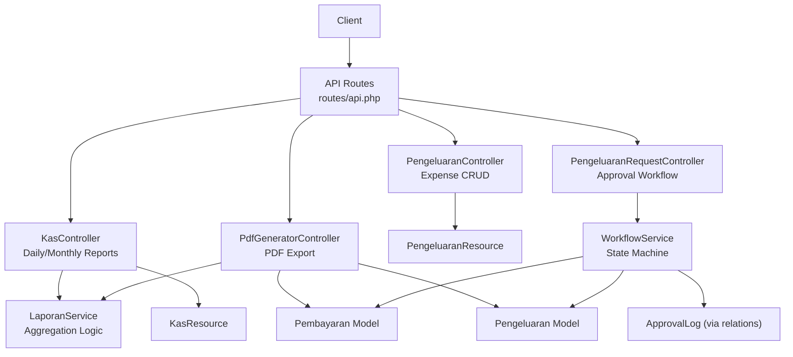
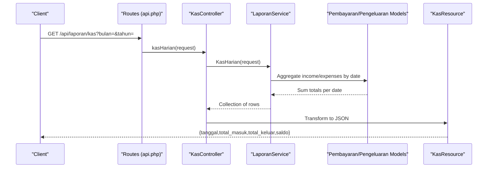
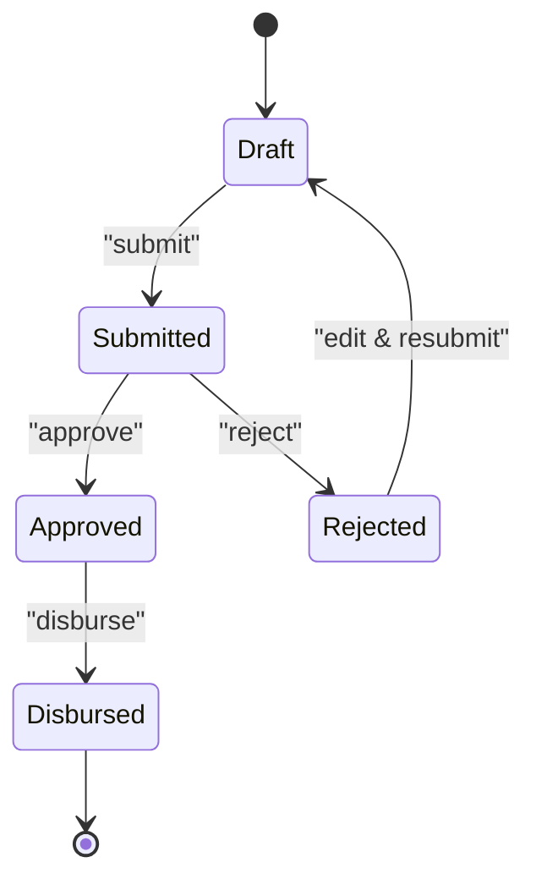
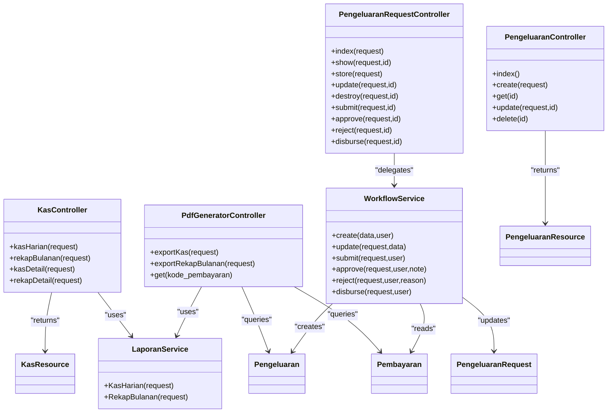

# Financial Reporting & Cash Management API

<cite>
**Referenced Files in This Document**
- [api.php](file://backend/routes/api.php)
- [KasController.php](file://backend/app/Http/Controllers/KasController.php)
- [LaporanService.php](file://backend/app/Services/LaporanService.php)
- [PdfGeneratorController.php](file://backend/app/Http/Controllers/PdfGeneratorController.php)
- [PengeluaranController.php](file://backend/app/Http/Controllers/PengeluaranController.php)
- [PengeluaranRequestController.php](file://backend/app/Http/Controllers/PengeluaranRequestController.php)
- [WorkflowService.php](file://backend/app/Services/WorkflowService.php)
- [Pembayaran.php](file://backend/app/Models/Pembayaran.php)
- [Pengeluaran.php](file://backend/app/Models/Pengeluaran.php)
- [PengeluaranRequest.php](file://backend/app/Models/PengeluaranRequest.php)
- [KasResource.php](file://backend/app/Http/Resources/KasResource.php)
- [PengeluaranResource.php](file://backend/app/Http/Resources/PengeluaranResource.php)
- [KasHarianExport.php](file://backend/app/Exports/KasHarianExport.php)
- [RekapBulananExport.php](file://backend/app/Exports/RekapBulananExport.php)
- [KasHarianRingkasanSheet.php](file://backend/app/Exports/Sheets/KasHarianRingkasanSheet.php)
- [RekapBulananRingkasanSheet.php](file://backend/app/Exports/Sheets/RekapBulananRingkasanSheet.php)
</cite>

## Table of Contents
1. [Introduction](#introduction)
2. [Project Structure](#project-structure)
3. [Core Components](#core-components)
4. [Architecture Overview](#architecture-overview)
5. [Detailed Component Analysis](#detailed-component-analysis)
6. [Dependency Analysis](#dependency-analysis)
7. [Performance Considerations](#performance-considerations)
8. [Troubleshooting Guide](#troubleshooting-guide)
9. [Conclusion](#conclusion)
10. [Appendices](#appendices)

## Introduction
This document provides detailed API documentation for financial reporting and cash management endpoints, including:
- Daily cash report (Kas Harian) with income and expense aggregation by date
- Monthly recap reports (Rekap Bulanan) with summary statistics and detail breakdowns
- Expense management (Pengeluaran) CRUD operations
- Approval workflow for expenses (Pengeluaran Request)
- PDF export functionality for financial reports
- Practical examples for queries, customization, and export formats
- Data aggregation logic, performance considerations for large datasets, and audit trail requirements

## Project Structure
The financial reporting and cash management features are implemented under the backend module using a layered architecture:
- Routes define public and protected endpoints
- Controllers handle HTTP requests and orchestrate services/resources
- Services encapsulate business logic and data aggregation
- Models represent domain entities and relationships
- Resources normalize response payloads
- Exports provide Excel and PDF generation capabilities

**Diagram sources**
- [api.php:219-229](file://backend/routes/api.php#L219-L229)
- [KasController.php:15-127](file://backend/app/Http/Controllers/KasController.php#L15-L127)
- [LaporanService.php:12-130](file://backend/app/Services/LaporanService.php#L12-L130)
- [PdfGeneratorController.php:17-109](file://backend/app/Http/Controllers/PdfGeneratorController.php#L17-L109)
- [PengeluaranController.php:14-65](file://backend/app/Http/Controllers/PengeluaranController.php#L14-L65)
- [PengeluaranRequestController.php:11-64](file://backend/app/Http/Controllers/PengeluaranRequestController.php#L11-L64)
- [WorkflowService.php:12-79](file://backend/app/Services/WorkflowService.php#L12-L79)
- [Pembayaran.php:8-52](file://backend/app/Models/Pembayaran.php#L8-L52)
- [Pengeluaran.php:8-80](file://backend/app/Models/Pengeluaran.php#L8-L80)
- [KasResource.php:8-24](file://backend/app/Http/Resources/KasResource.php#L8-L24)
- [PengeluaranResource.php:9-31](file://backend/app/Http/Resources/PengeluaranResource.php#L9-L31)

**Section sources**
- [api.php:219-229](file://backend/routes/api.php#L219-L229)
- [KasController.php:15-127](file://backend/app/Http/Controllers/KasController.php#L15-L127)
- [LaporanService.php:12-130](file://backend/app/Services/LaporanService.php#L12-L130)
- [PdfGeneratorController.php:17-109](file://backend/app/Http/Controllers/PdfGeneratorController.php#L17-L109)
- [PengeluaranController.php:14-65](file://backend/app/Http/Controllers/PengeluaranController.php#L14-L65)
- [PengeluaranRequestController.php:11-64](file://backend/app/Http/Controllers/PengeluaranRequestController.php#L11-L64)
- [WorkflowService.php:12-79](file://backend/app/Services/WorkflowService.php#L12-L79)
- [Pembayaran.php:8-52](file://backend/app/Models/Pembayaran.php#L8-L52)
- [Pengeluaran.php:8-80](file://backend/app/Models/Pengeluaran.php#L8-L80)
- [KasResource.php:8-24](file://backend/app/Http/Resources/KasResource.php#L8-L24)
- [PengeluaranResource.php:9-31](file://backend/app/Http/Resources/PengeluaranResource.php#L9-L31)

## Core Components
- KasController: Provides daily and monthly cash report summaries and details
- LaporanService: Encapsulates aggregation logic for Kas Harian and Rekap Bulanan
- PdfGeneratorController: Generates PDF exports for kas harian and rekap bulanan
- PengeluaranController: CRUD for expenses with filtering and sorting
- PengeluaranRequestController + WorkflowService: Approval workflow from draft to disbursed, with audit logs
- Models: Pembayaran (income), Pengeluaran (expense), PengeluaranRequest (workflow entity)
- Resources: KasResource, PengeluaranResource for normalized responses
- Exports: Multi-sheet Excel exports for daily and monthly reports

Key responsibilities:
- Branch-scoped data access via authenticated user’s branch_id
- Aggregation of income and expenses into running balances
- Detail views per day/month with transaction-level breakdowns
- Approval workflow state transitions with validation and notifications
- PDF and Excel export with human-readable notes and totals

**Section sources**
- [KasController.php:15-127](file://backend/app/Http/Controllers/KasController.php#L15-L127)
- [LaporanService.php:12-130](file://backend/app/Services/LaporanService.php#L12-L130)
- [PdfGeneratorController.php:17-109](file://backend/app/Http/Controllers/PdfGeneratorController.php#L17-L109)
- [PengeluaranController.php:14-65](file://backend/app/Http/Controllers/PengeluaranController.php#L14-L65)
- [PengeluaranRequestController.php:11-64](file://backend/app/Http/Controllers/PengeluaranRequestController.php#L11-L64)
- [WorkflowService.php:12-79](file://backend/app/Services/WorkflowService.php#L12-L79)
- [Pembayaran.php:8-52](file://backend/app/Models/Pembayaran.php#L8-L52)
- [Pengeluaran.php:8-80](file://backend/app/Models/Pengeluaran.php#L8-L80)
- [KasResource.php:8-24](file://backend/app/Http/Resources/KasResource.php#L8-L24)
- [PengeluaranResource.php:9-31](file://backend/app/Http/Resources/PengeluaranResource.php#L9-L31)

## Architecture Overview
The system uses a controller-service-model pattern with resource normalization and export utilities. Authentication and permissions are enforced at the route level.

**Diagram sources**
- [api.php:221-222](file://backend/routes/api.php#L221-L222)
- [KasController.php:15-127](file://backend/app/Http/Controllers/KasController.php#L15-L127)
- [LaporanService.php:14-130](file://backend/app/Services/LaporanService.php#L14-L130)
- [Pembayaran.php:8-52](file://backend/app/Models/Pembayaran.php#L8-L52)
- [Pengeluaran.php:8-80](file://backend/app/Models/Pengeluaran.php#L8-L80)
- [KasResource.php:8-24](file://backend/app/Http/Resources/KasResource.php#L8-L24)

## Detailed Component Analysis

### Daily Cash Report (Kas Harian)
- Endpoint: GET /api/laporan/kas
- Query parameters:
  - bulan (required): Month number 1–12
  - tahun (required): Year as 4-digit integer
- Behavior:
  - Validates month/year
  - Computes total income and total expense per day within the month
  - Calculates global balance up to each date (sum of all payments minus sum of all expenses up to that date)
  - Returns collection formatted by KasResource
- Response fields:
  - tanggal: Localized date string
  - total_masuk: Income total for the day
  - total_keluar: Expense total for the day
  - saldo: Running global balance up to the day

Detail endpoint:
- Endpoint: GET /api/laporan/kas/detail
- Query parameter:
  - tanggal (required): YYYY-MM-DD
- Response:
  - data.tanggal
  - data.pemasukan: list of payment transactions for the date
  - data.pengeluaran: list of expense transactions for the date

Example usage:
- Get daily cash for November 2025:
  - GET /api/laporan/kas?bulan=11&tahun=2025
- Get detail for 2025-11-15:
  - GET /api/laporan/kas/detail?tanggal=2025-11-15

**Section sources**
- [api.php:221-222](file://backend/routes/api.php#L221-L222)
- [KasController.php:15-127](file://backend/app/Http/Controllers/KasController.php#L15-L127)
- [KasController.php:228-256](file://backend/app/Http/Controllers/KasController.php#L228-L256)
- [KasResource.php:8-24](file://backend/app/Http/Resources/KasResource.php#L8-L24)

### Monthly Recap Report (Rekap Bulanan)
- Endpoint: GET /api/laporan/rekap
- Query parameters:
  - tahun (required): Year as 4-digit integer
- Behavior:
  - Validates year
  - Aggregates income and expense per month within the year
  - Calculates global balance up to the end of each month
  - Returns collection formatted by KasResource
- Response fields:
  - tanggal: Localized month name
  - total_masuk: Income total for the month
  - total_keluar: Expense total for the month
  - saldo: Running global balance up to the end of the month

Detail endpoint:
- Endpoint: GET /api/laporan/rekap/detail
- Query parameters:
  - bulan (required): Month number 1–12
  - tahun (required): Year as 4-digit integer
- Response:
  - data.bulan
  - data.tahun
  - data.pemasukan: list of payment transactions for the month
  - data.pengeluaran: list of expense transactions for the month

Example usage:
- Get monthly recap for 2025:
  - GET /api/laporan/rekap?tahun=2025
- Get detail for November 2025:
  - GET /api/laporan/rekap/detail?bulan=11&tahun=2025

**Section sources**
- [api.php:223-224](file://backend/routes/api.php#L223-L224)
- [KasController.php:129-222](file://backend/app/Http/Controllers/KasController.php#L129-L222)
- [KasController.php:258-296](file://backend/app/Http/Controllers/KasController.php#L258-L296)
- [KasResource.php:8-24](file://backend/app/Http/Resources/KasResource.php#L8-L24)

### Expense Management (Pengeluaran) CRUD
- Endpoints:
  - GET /api/pengeluaran
  - POST /api/pengeluaran
  - GET /api/pengeluaran/{id}
  - PUT /api/pengeluaran/{id}
  - DELETE /api/pengeluaran/{id}
- Filtering and sorting (GET):
  - start_date (optional): YYYY-MM-DD
  - end_date (optional): YYYY-MM-DD
  - tahun_ajaran_id (optional): Filter by academic period; send 0 or use all_periods=true to include all periods
  - per_page (optional): Pagination size
  - sort (optional): Column to sort by (tanggal, jumlah, keterangan, created_at)
  - direction (optional): asc or desc
- Create payload (POST):
  - tanggal (optional): Date
  - uraian (optional): Description
  - jumlah (optional): Amount (numeric, max 11 digits before decimal, up to 2 decimals)
  - tahun_ajaran_id (optional): Academic period ID
- Update payload (PUT):
  - Same fields as create, but optional
- Response format:
  - PengeluaranResource fields: id, tanggal (localized), uraian, jumlah, branch_id, tahun_ajaran_id, tahun_ajaran (when loaded)

Example usage:
- List expenses for November 2025 with default active period:
  - GET /api/pengeluaran?start_date=2025-11-01&end_date=2025-11-30
- Create an expense:
  - POST /api/pengeluaran with body { "tanggal": "2025-11-15", "uraian": "Office supplies", "jumlah": 150000 }
- Update an expense:
  - PUT /api/pengeluaran/123 with body { "jumlah": 160000 }
- Delete an expense:
  - DELETE /api/pengeluaran/123

**Section sources**
- [api.php:179-185](file://backend/routes/api.php#L179-L185)
- [PengeluaranController.php:14-65](file://backend/app/Http/Controllers/PengeluaranController.php#L14-L65)
- [PengeluaranController.php:67-88](file://backend/app/Http/Controllers/PengeluaranController.php#L67-L88)
- [PengeluaranController.php:90-108](file://backend/app/Http/Controllers/PengeluaranController.php#L90-L108)
- [PengeluaranController.php:110-132](file://backend/app/Http/Controllers/PengeluaranController.php#L110-L132)
- [PengeluaranController.php:134-154](file://backend/app/Http/Controllers/PengeluaranController.php#L134-L154)
- [PengeluaranResource.php:9-31](file://backend/app/Http/Resources/PengeluaranResource.php#L9-L31)

### Approval Workflow (Pengeluaran Request)
- Endpoints:
  - GET /api/pengeluaran-request
  - GET /api/pengeluaran-request/{id}
  - POST /api/pengeluaran-request
  - PUT /api/pengeluaran-request/{id}
  - DELETE /api/pengeluaran-request/{id}
  - POST /api/pengeluaran-request/{id}/submit
  - POST /api/pengeluaran-request/{id}/approve
  - POST /api/pengeluaran-request/{id}/reject
  - POST /api/pengeluaran-request/{id}/disburse
- State machine:
  - draft → submitted → approved → disbursed
  - submitted → rejected (re-editable)
- Key behaviors:
  - Submit validates sufficient branch balance considering realized expenses and outstanding requests
  - Approve requires permission and records approval log
  - Reject requires reason and records rejection log
  - Disburse creates a Pengeluaran record linked to the request and updates status
  - Audit trail stored via ApprovalLog entries
- Example usage:
  - Create a request:
    - POST /api/pengeluaran-request with { "uraian": "Travel", "jumlah": 500000, "tanggal_kebutuhan": "2025-12-01" }
  - Submit for approval:
    - POST /api/pengeluaran-request/1/submit
  - Approve:
    - POST /api/pengeluaran-request/1/approve with optional note
  - Reject:
    - POST /api/pengeluaran-request/1/reject with { "reason": "Insufficient budget" }
  - Disburse:
    - POST /api/pengeluaran-request/1/disburse

**Diagram sources**
- [PengeluaranRequestController.php:147-210](file://backend/app/Http/Controllers/PengeluaranRequestController.php#L147-L210)
- [WorkflowService.php:52-160](file://backend/app/Services/WorkflowService.php#L52-L160)

**Section sources**
- [api.php:264-275](file://backend/routes/api.php#L264-L275)
- [PengeluaranRequestController.php:11-64](file://backend/app/Http/Controllers/PengeluaranRequestController.php#L11-L64)
- [PengeluaranRequestController.php:82-99](file://backend/app/Http/Controllers/PengeluaranRequestController.php#L82-L99)
- [PengeluaranRequestController.php:101-128](file://backend/app/Http/Controllers/PengeluaranRequestController.php#L101-L128)
- [PengeluaranRequestController.php:130-145](file://backend/app/Http/Controllers/PengeluaranRequestController.php#L130-L145)
- [PengeluaranRequestController.php:147-163](file://backend/app/Http/Controllers/PengeluaranRequestController.php#L147-L163)
- [PengeluaranRequestController.php:165-177](file://backend/app/Http/Controllers/PengeluaranRequestController.php#L165-L177)
- [PengeluaranRequestController.php:179-192](file://backend/app/Http/Controllers/PengeluaranRequestController.php#L179-L192)
- [PengeluaranRequestController.php:194-210](file://backend/app/Http/Controllers/PengeluaranRequestController.php#L194-L210)
- [WorkflowService.php:12-79](file://backend/app/Services/WorkflowService.php#L12-L79)
- [WorkflowService.php:81-123](file://backend/app/Services/WorkflowService.php#L81-L123)
- [WorkflowService.php:125-160](file://backend/app/Services/WorkflowService.php#L125-L160)
- [PengeluaranRequest.php:8-62](file://backend/app/Models/PengeluaranRequest.php#L8-L62)
- [Pengeluaran.php:8-80](file://backend/app/Models/Pengeluaran.php#L8-L80)

### PDF Export Functionality
- Endpoints:
  - GET /api/laporan/export/kas
    - Query: bulan, tahun
    - Output: PDF stream named “Kas harian {month}.pdf”
  - GET /api/laporan/export/rekap
    - Query: tahun
    - Output: PDF stream named “Rekap Bulanan {year}.pdf”
- Behavior:
  - Uses LaporanService to compute rows
  - Builds per-day/per-month notes listing transactions
  - Renders Blade templates for kas-harian and rekap-bulanan
- Receipt PDF:
  - GET /api/pembayaran/kwitansi/{kode_pembayaran}
  - Streams receipt PDF based on payment data and school settings

Example usage:
- Export daily cash PDF for November 2025:
  - GET /api/laporan/export/kas?bulan=11&tahun=2025
- Export monthly recap PDF for 2025:
  - GET /api/laporan/export/rekap?tahun=2025
- Print receipt:
  - GET /api/pembayaran/kwitansi/PAY-12345

**Section sources**
- [api.php:225-228](file://backend/routes/api.php#L225-L228)
- [PdfGeneratorController.php:64-109](file://backend/app/Http/Controllers/PdfGeneratorController.php#L64-L109)
- [PdfGeneratorController.php:111-203](file://backend/app/Http/Controllers/PdfGeneratorController.php#L111-L203)
- [LaporanService.php:14-130](file://backend/app/Services/LaporanService.php#L14-L130)

### Excel Export Functionality
- Endpoints:
  - POST /api/import-export/export/kas-harian
  - POST /api/import-export/export/rekap-bulanan
- Structure:
  - Multi-sheet files with Ringkasan, Pemasukan, and Pengeluaran sheets
  - Ringkasan includes totals and per-day/per-month notes
- Sheets:
  - KasHarianRingkasanSheet: daily summary with notes
  - RekapBulananRingkasanSheet: monthly summary with notes

Example usage:
- Export daily cash Excel:
  - POST /api/import-export/export/kas-harian with filters (e.g., bulan, tahun)
- Export monthly recap Excel:
  - POST /api/import-export/export/rekap-bulanan with filters (e.g., tahun)

**Section sources**
- [api.php:299-300](file://backend/routes/api.php#L299-L300)
- [KasHarianExport.php:11-28](file://backend/app/Exports/KasHarianExport.php#L11-L28)
- [RekapBulananExport.php:11-28](file://backend/app/Exports/RekapBulananExport.php#L11-L28)
- [KasHarianRingkasanSheet.php:12-124](file://backend/app/Exports/Sheets/KasHarianRingkasanSheet.php#L12-L124)
- [RekapBulananRingkasanSheet.php:14-152](file://backend/app/Exports/Sheets/RekapBulananRingkasanSheet.php#L14-L152)

## Dependency Analysis
The following diagram shows key dependencies among controllers, services, models, and resources involved in financial reporting and cash management.

**Diagram sources**
- [KasController.php:15-127](file://backend/app/Http/Controllers/KasController.php#L15-L127)
- [LaporanService.php:12-130](file://backend/app/Services/LaporanService.php#L12-L130)
- [PdfGeneratorController.php:17-109](file://backend/app/Http/Controllers/PdfGeneratorController.php#L17-L109)
- [PengeluaranController.php:14-65](file://backend/app/Http/Controllers/PengeluaranController.php#L14-L65)
- [PengeluaranRequestController.php:11-64](file://backend/app/Http/Controllers/PengeluaranRequestController.php#L11-L64)
- [WorkflowService.php:12-79](file://backend/app/Services/WorkflowService.php#L12-L79)
- [Pembayaran.php:8-52](file://backend/app/Models/Pembayaran.php#L8-L52)
- [Pengeluaran.php:8-80](file://backend/app/Models/Pengeluaran.php#L8-L80)
- [PengeluaranRequest.php:8-62](file://backend/app/Models/PengeluaranRequest.php#L8-L62)
- [KasResource.php:8-24](file://backend/app/Http/Resources/KasResource.php#L8-L24)
- [PengeluaranResource.php:9-31](file://backend/app/Http/Resources/PengeluaranResource.php#L9-L31)

**Section sources**
- [KasController.php:15-127](file://backend/app/Http/Controllers/KasController.php#L15-L127)
- [LaporanService.php:12-130](file://backend/app/Services/LaporanService.php#L12-L130)
- [PdfGeneratorController.php:17-109](file://backend/app/Http/Controllers/PdfGeneratorController.php#L17-L109)
- [PengeluaranController.php:14-65](file://backend/app/Http/Controllers/PengeluaranController.php#L14-L65)
- [PengeluaranRequestController.php:11-64](file://backend/app/Http/Controllers/PengeluaranRequestController.php#L11-L64)
- [WorkflowService.php:12-79](file://backend/app/Services/WorkflowService.php#L12-L79)
- [Pembayaran.php:8-52](file://backend/app/Models/Pembayaran.php#L8-L52)
- [Pengeluaran.php:8-80](file://backend/app/Models/Pengeluaran.php#L8-L80)
- [PengeluaranRequest.php:8-62](file://backend/app/Models/PengeluaranRequest.php#L8-L62)
- [KasResource.php:8-24](file://backend/app/Http/Resources/KasResource.php#L8-L24)
- [PengeluaranResource.php:9-31](file://backend/app/Http/Resources/PengeluaranResource.php#L9-L31)

## Performance Considerations
- Aggregation queries:
  - Use GROUP BY and SUM in SQL for daily/monthly totals to minimize application-side processing
  - Avoid N+1 queries by leveraging eager loading where needed (e.g., tagihan.siswa, jenis_tagihan)
- Balance calculations:
  - Global balance is computed by summing historical transactions up to a given date; consider indexing tanggal and branch_id for faster range scans
- Large datasets:
  - For exports, prefer database-driven aggregation and streaming to memory-efficient collections
  - Limit result sets with pagination and filters (date ranges, academic periods)
- Concurrency:
  - Approval workflow uses DB transactions to prevent race conditions when checking available balance and creating expenses
- Caching:
  - Consider caching aggregated summaries for frequently accessed months/years if appropriate

[No sources needed since this section provides general guidance]

## Troubleshooting Guide
Common issues and resolutions:
- Missing required parameters:
  - Kas Harian requires bulan and tahun; Rekap Bulanan requires tahun; detail endpoints require specific date or month/year params
- Validation errors:
  - Jumlah must be numeric and within allowed precision; dates must match expected formats
- Permission denied:
  - Ensure the authenticated user has the required permissions (e.g., view-kas-harian, export-laporan, approve-pengeluaran)
- Insufficient balance:
  - Submitting or disbursing may fail if the branch balance is insufficient due to realized expenses and outstanding requests
- Not found:
  - Requests or expenditures not found return 404; verify IDs and branch scoping

**Section sources**
- [KasController.php:25-46](file://backend/app/Http/Controllers/KasController.php#L25-L46)
- [KasController.php:135-148](file://backend/app/Http/Controllers/KasController.php#L135-L148)
- [PengeluaranController.php:95-103](file://backend/app/Http/Controllers/PengeluaranController.php#L95-L103)
- [WorkflowService.php:186-220](file://backend/app/Services/WorkflowService.php#L186-L220)

## Conclusion
The financial reporting and cash management APIs provide robust tools for tracking income and expenses, generating daily and monthly reports, managing expense approvals, and exporting data in PDF and Excel formats. The design emphasizes branch-scoped data integrity, clear aggregation logic, and comprehensive audit trails through approval workflows.

[No sources needed since this section summarizes without analyzing specific files]

## Appendices

### API Reference Summary

- Daily Cash Report
  - GET /api/laporan/kas
    - Query: bulan, tahun
    - Response: array of { tanggal, total_masuk, total_keluar, saldo }
  - GET /api/laporan/kas/detail
    - Query: tanggal
    - Response: { data: { tanggal, pemasukan[], pengeluaran[] } }

- Monthly Recap Report
  - GET /api/laporan/rekap
    - Query: tahun
    - Response: array of { tanggal, total_masuk, total_keluar, saldo }
  - GET /api/laporan/rekap/detail
    - Query: bulan, tahun
    - Response: { data: { bulan, tahun, pemasukan[], pengeluaran[] } }

- Expense Management
  - GET /api/pengeluaran
    - Query: start_date, end_date, tahun_ajaran_id, all_periods, per_page, sort, direction
  - POST /api/pengeluaran
    - Body: tanggal, uraian, jumlah, tahun_ajaran_id
  - GET /api/pengeluaran/{id}
  - PUT /api/pengeluaran/{id}
    - Body: same fields as create
  - DELETE /api/pengeluaran/{id}

- Approval Workflow
  - GET /api/pengeluaran-request
    - Query: status, tahun_ajaran_id, all_periods, sort, direction, per_page
  - GET /api/pengeluaran-request/{id}
  - POST /api/pengeluaran-request
    - Body: uraian, jumlah, tanggal_kebutuhan, kategori_pengeluaran, lampiran
  - PUT /api/pengeluaran-request/{id}
    - Body: same fields as create (partial update)
  - DELETE /api/pengeluaran-request/{id}
  - POST /api/pengeluaran-request/{id}/submit
  - POST /api/pengeluaran-request/{id}/approve
    - Body: note (optional)
  - POST /api/pengeluaran-request/{id}/reject
    - Body: reason (required)
  - POST /api/pengeluaran-request/{id}/disburse

- PDF Export
  - GET /api/laporan/export/kas
    - Query: bulan, tahun
  - GET /api/laporan/export/rekap
    - Query: tahun
  - GET /api/pembayaran/kwitansi/{kode_pembayaran}

- Excel Export
  - POST /api/import-export/export/kas-harian
  - POST /api/import-export/export/rekap-bulanan

**Section sources**
- [api.php:219-229](file://backend/routes/api.php#L219-L229)
- [api.php:179-185](file://backend/routes/api.php#L179-L185)
- [api.php:264-275](file://backend/routes/api.php#L264-L275)
- [api.php:299-300](file://backend/routes/api.php#L299-L300)
- [KasController.php:15-127](file://backend/app/Http/Controllers/KasController.php#L15-L127)
- [KasController.php:228-296](file://backend/app/Http/Controllers/KasController.php#L228-L296)
- [PengeluaranController.php:14-65](file://backend/app/Http/Controllers/PengeluaranController.php#L14-L65)
- [PengeluaranRequestController.php:11-64](file://backend/app/Http/Controllers/PengeluaranRequestController.php#L11-L64)
- [PdfGeneratorController.php:64-109](file://backend/app/Http/Controllers/PdfGeneratorController.php#L64-L109)