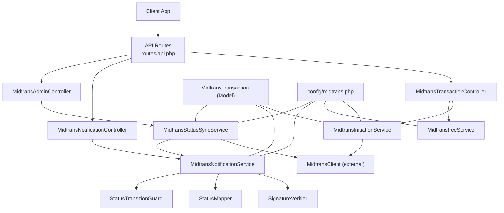
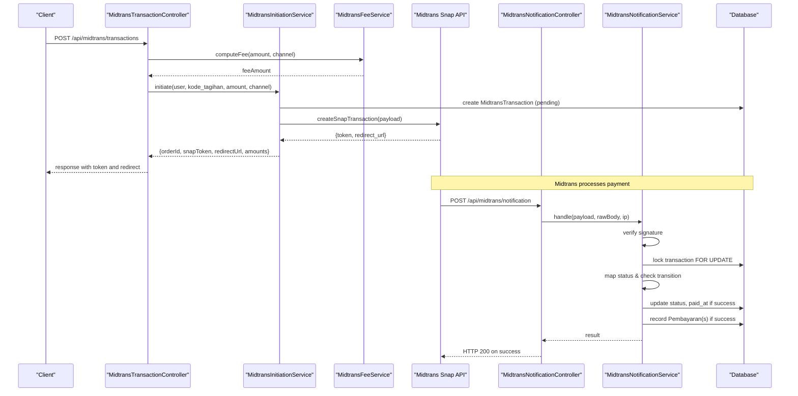
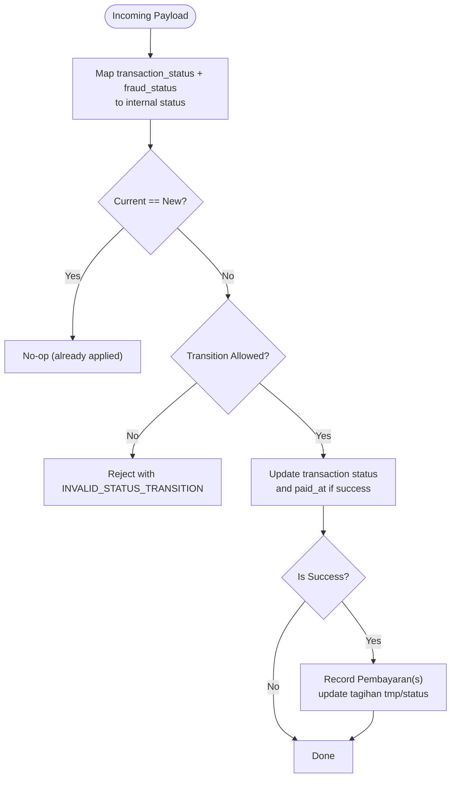
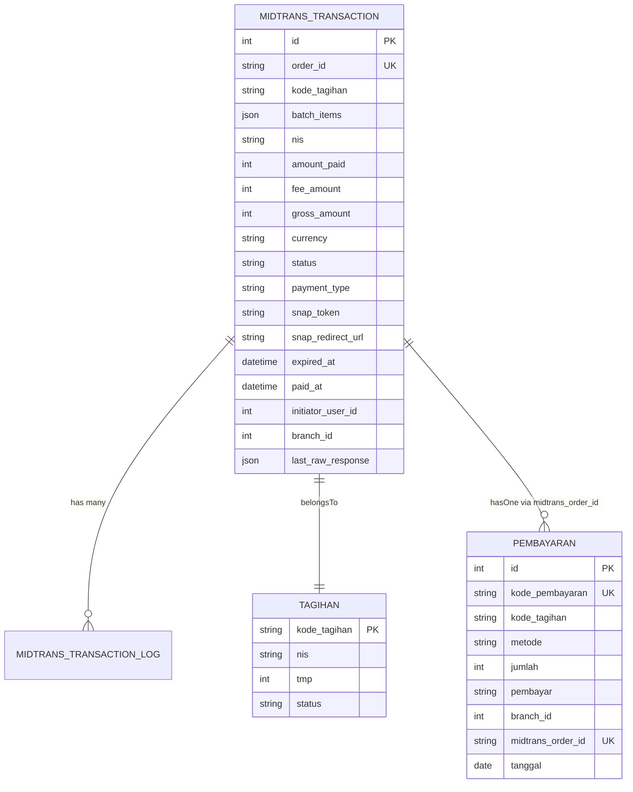
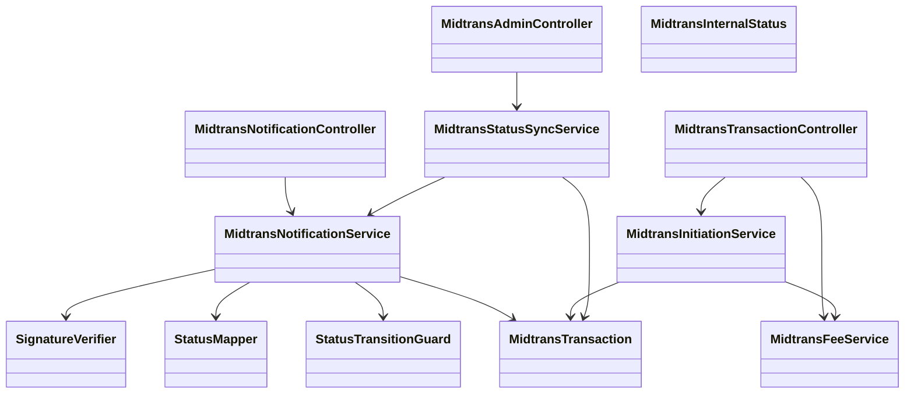

# Midtrans Payment Gateway Integration API

<cite>
**Referenced Files in This Document**
- [api.php](file://backend/routes/api.php)
- [MidtransTransactionController.php](file://backend/app/Http/Controllers/MidtransTransactionController.php)
- [MidtransNotificationController.php](file://backend/app/Http/Controllers/MidtransNotificationController.php)
- [MidtransAdminController.php](file://backend/app/Http/Controllers/MidtransAdminController.php)
- [MidtransInitiationService.php](file://backend/app/Services/Midtrans/MidtransInitiationService.php)
- [MidtransFeeService.php](file://backend/app/Services/Midtrans/MidtransFeeService.php)
- [MidtransNotificationService.php](file://backend/app/Services/Midtrans/MidtransNotificationService.php)
- [MidtransStatusSyncService.php](file://backend/app/Services/Midtrans/MidtransStatusSyncService.php)
- [SignatureVerifier.php](file://backend/app/Services/Midtrans/SignatureVerifier.php)
- [StatusMapper.php](file://backend/app/Services/Midtrans/StatusMapper.php)
- [StatusTransitionGuard.php](file://backend/app/Services/Midtrans/StatusTransitionGuard.php)
- [MidtransInternalStatus.php](file://backend/app/Services/Midtrans/MidtransInternalStatus.php)
- [MidtransTransaction.php](file://backend/app/Models/MidtransTransaction.php)
- [midtrans.php](file://backend/config/midtrans.php)
</cite>

## Table of Contents
1. Introduction
2. Project Structure
3. Core Components
4. Architecture Overview
5. Detailed Component Analysis
6. Dependency Analysis
7. Performance Considerations
8. Troubleshooting Guide
9. Conclusion

## Introduction
This document provides comprehensive API documentation for the Midtrans payment gateway integration. It covers transaction initiation (single and batch), fee channel calculation, admin monitoring endpoints, webhook processing with signature verification, status mapping, error handling strategies, security considerations, retry mechanisms, and reconciliation practices. The goal is to enable developers and administrators to integrate, operate, and troubleshoot payments reliably.

## Project Structure
The Midtrans integration spans controllers, services, models, configuration, and routes:
- Controllers expose REST endpoints for clients and admins, and handle webhooks.
- Services encapsulate business logic: initiation, fees, notifications, status sync, signature verification, and state transitions.
- Models persist transactions and logs.
- Configuration centralizes feature flags, credentials, fee rules, and behavior.

**Diagram sources**
- [api.php:321-344](file://backend/routes/api.php#L321-L344)
- [MidtransTransactionController.php:10-127](file://backend/app/Http/Controllers/MidtransTransactionController.php#L10-L127)
- [MidtransNotificationController.php:9-35](file://backend/app/Http/Controllers/MidtransNotificationController.php#L9-L35)
- [MidtransAdminController.php:11-176](file://backend/app/Http/Controllers/MidtransAdminController.php#L11-L176)
- [MidtransInitiationService.php:22-473](file://backend/app/Services/Midtrans/MidtransInitiationService.php#L22-L473)
- [MidtransFeeService.php:7-144](file://backend/app/Services/Midtrans/MidtransFeeService.php#L7-L144)
- [MidtransNotificationService.php:16-284](file://backend/app/Services/Midtrans/MidtransNotificationService.php#L16-L284)
- [MidtransStatusSyncService.php:10-73](file://backend/app/Services/Midtrans/MidtransStatusSyncService.php#L10-L73)
- [SignatureVerifier.php:5-34](file://backend/app/Services/Midtrans/SignatureVerifier.php#L5-L34)
- [StatusMapper.php:5-41](file://backend/app/Services/Midtrans/StatusMapper.php#L5-L41)
- [StatusTransitionGuard.php:5-77](file://backend/app/Services/Midtrans/StatusTransitionGuard.php#L5-L77)
- [MidtransTransaction.php:7-85](file://backend/app/Models/MidtransTransaction.php#L7-L85)
- [midtrans.php:1-130](file://backend/config/midtrans.php#L1-L130)

**Section sources**
- [api.php:321-344](file://backend/routes/api.php#L321-L344)
- [midtrans.php:1-130](file://backend/config/midtrans.php#L1-L130)

## Core Components
- Transaction Initiation Service: Orchestrates validation, fee computation, order creation, Snap payload assembly, and external Snap API calls.
- Fee Service: Computes per-channel admin fees and exposes available channels with previews.
- Notification Service: Processes inbound webhooks, verifies signatures, maps statuses, enforces transitions, records payments, and updates tagihan balances.
- Status Sync Service: Manually queries Midtrans status and applies it via shared notification processing.
- Signature Verifier: Validates webhook signatures using SHA-512 over order_id + status_code + gross_amount + server_key.
- Status Mapper and Transition Guard: Map Midtrans statuses to internal states and enforce allowed transitions.
- Admin Controller: Provides paginated transaction listing, details, masked logs, and manual sync.
- Transaction Model: Persists transaction data, supports batch items, and provides scopes/relations.

**Section sources**
- [MidtransInitiationService.php:22-473](file://backend/app/Services/Midtrans/MidtransInitiationService.php#L22-L473)
- [MidtransFeeService.php:7-144](file://backend/app/Services/Midtrans/MidtransFeeService.php#L7-L144)
- [MidtransNotificationService.php:16-284](file://backend/app/Services/Midtrans/MidtransNotificationService.php#L16-L284)
- [MidtransStatusSyncService.php:10-73](file://backend/app/Services/Midtrans/MidtransStatusSyncService.php#L10-L73)
- [SignatureVerifier.php:5-34](file://backend/app/Services/Midtrans/SignatureVerifier.php#L5-L34)
- [StatusMapper.php:5-41](file://backend/app/Services/Midtrans/StatusMapper.php#L5-L41)
- [StatusTransitionGuard.php:5-77](file://backend/app/Services/Midtrans/StatusTransitionGuard.php#L5-L77)
- [MidtransAdminController.php:11-176](file://backend/app/Http/Controllers/MidtransAdminController.php#L11-L176)
- [MidtransTransaction.php:7-85](file://backend/app/Models/MidtransTransaction.php#L7-L85)

## Architecture Overview
High-level flows:
- Client initiates a payment (single or batch).
- System computes fees, creates a transaction record, and requests a Snap session from Midtrans.
- Midtrans sends webhooks; system verifies signatures, maps statuses, enforces transitions, and records payments.
- Admins can monitor transactions, view logs, and manually sync status.

**Diagram sources**
- [MidtransTransactionController.php:17-41](file://backend/app/Http/Controllers/MidtransTransactionController.php#L17-L41)
- [MidtransInitiationService.php:44-237](file://backend/app/Services/Midtrans/MidtransInitiationService.php#L44-L237)
- [MidtransFeeService.php:28-37](file://backend/app/Services/Midtrans/MidtransFeeService.php#L28-L37)
- [MidtransNotificationController.php:20-33](file://backend/app/Http/Controllers/MidtransNotificationController.php#L20-L33)
- [MidtransNotificationService.php:31-150](file://backend/app/Services/Midtrans/MidtransNotificationService.php#L31-L150)

## Detailed Component Analysis

### API Endpoints

#### Transaction Initiation (Portal)
- POST /api/midtrans/transactions
  - Auth: Sanctum with permission pay-tagihan-online
  - Request body:
    - kode_tagihan: string, required
    - amount_paid: integer, min 1
    - payment_channel: string, optional
  - Response:
    - order_id, snap_token, redirect_url, amount_paid, fee_amount, gross_amount, client_key
  - Behavior:
    - Validates ownership, checks pending transactions, computes fee, persists transaction, calls Snap, returns token and redirect URL.

- GET /api/midtrans/fee-channels
  - Auth: Sanctum with permission pay-tagihan-online
  - Query: amount (optional preview)
  - Response:
    - data: list of channels with label, type, percent/amount, description, and optional fee/gross preview
    - default: configured default channel key

- POST /api/midtrans/transactions/batch
  - Auth: Sanctum with permission pay-tagihan-online
  - Request body:
    - kode_tagihan_list: array of strings, min 1, max 50
    - payment_channel: string, optional
  - Response:
    - order_id, snap_token, redirect_url, amount_paid, fee_amount, gross_amount, client_key
  - Behavior:
    - Locks all selected tagihan, validates ownership and unpaid status, aggregates amounts, computes single fee, persists batch transaction, calls Snap.

- GET /api/midtrans/transactions/{order_id}
  - Auth: Sanctum with permission pay-tagihan-online
  - Response:
    - order_id, kode_tagihan, status, amounts, payment_type, snap_token, redirect_url, expired_at, paid_at, created_at
  - Security:
    - Ownership check: user’s siswa NIS must match transaction NIS.

**Section sources**
- [api.php:326-333](file://backend/routes/api.php#L326-L333)
- [MidtransTransactionController.php:17-127](file://backend/app/Http/Controllers/MidtransTransactionController.php#L17-L127)
- [MidtransInitiationService.php:44-237](file://backend/app/Services/Midtrans/MidtransInitiationService.php#L44-L237)
- [MidtransFeeService.php:44-76](file://backend/app/Services/Midtrans/MidtransFeeService.php#L44-L76)

#### Webhook Endpoint
- POST /api/midtrans/notification
  - Public (no Sanctum); protected by signature verification
  - Request: JSON payload from Midtrans
  - Response:
    - 200 with {"status":"ok"} on success
    - 4xx with error_code on rejection (e.g., INVALID_SIGNATURE, ORDER_NOT_FOUND, AMOUNT_MISMATCH, INVALID_STATUS_TRANSITION)
  - Behavior:
    - Records inbound log, verifies signature, locks transaction, maps status, enforces transitions, updates transaction, records pembayaran(s) on success.

**Section sources**
- [api.php:321-324](file://backend/routes/api.php#L321-L324)
- [MidtransNotificationController.php:20-33](file://backend/app/Http/Controllers/MidtransNotificationController.php#L20-L33)
- [MidtransNotificationService.php:31-150](file://backend/app/Services/Midtrans/MidtransNotificationService.php#L31-L150)
- [SignatureVerifier.php:22-32](file://backend/app/Services/Midtrans/SignatureVerifier.php#L22-L32)

#### Admin Monitoring and Sync
- GET /api/midtrans/admin/transactions
  - Auth: Sanctum with permission view-midtrans-transactions
  - Filters: status, branch_id, date_from, date_to, per_page
  - Response: Paginated list with nama_siswa appended

- GET /api/midtrans/admin/transactions/{order_id}
  - Auth: Sanctum with permission view-midtrans-transactions
  - Response: Full transaction detail including initiator name and timestamps

- GET /api/midtrans/admin/transactions/{order_id}/logs
  - Auth: Sanctum with permission view-midtrans-transactions
  - Response: List of logs with sensitive fields masked (server_key, signature_key)

- POST /api/midtrans/admin/transactions/{order_id}/sync
  - Auth: Sanctum with permission sync-midtrans-transactions
  - Behavior: Calls Midtrans Status API, logs outbound, delegates to notification service to apply changes

**Section sources**
- [api.php:336-343](file://backend/routes/api.php#L336-L343)
- [MidtransAdminController.php:18-144](file://backend/app/Http/Controllers/MidtransAdminController.php#L18-L144)
- [MidtransStatusSyncService.php:25-71](file://backend/app/Services/Midtrans/MidtransStatusSyncService.php#L25-L71)

### Fee Calculation Service
- computeFee(amountPaid, channel):
  - Supports flat and percent+flat types
  - Falls back to global fee_flat when channel unknown
- availableChannels(previewAmount?):
  - Returns channel metadata and optional fee/gross previews
- isValidChannel(channel):
  - Validates channel against configured fee_channels
- assertGrossInvariant(amountPaid, feeAmount, grossAmount):
  - Ensures gross equals sum of paid and fee

Configuration-driven via config/midtrans.php:
- fee_flat, fee_channels, default_channel, min_amount, expiry_hours

**Section sources**
- [MidtransFeeService.php:28-97](file://backend/app/Services/Midtrans/MidtransFeeService.php#L28-L97)
- [midtrans.php:58-97](file://backend/config/midtrans.php#L58-L97)

### Status Mapping and Transitions
- StatusMapper.map(transaction_status, fraud_status):
  - Maps Midtrans statuses to internal states
  - capture without fraud accept → Deny
- StatusTransitionGuard.isAllowed(current, next):
  - Enforces allowed transitions based on current state
- MidtransInternalStatus:
  - Defines internal states and helpers (isTerminal, isSuccess)

**Diagram sources**
- [StatusMapper.php:23-39](file://backend/app/Services/Midtrans/StatusMapper.php#L23-L39)
- [StatusTransitionGuard.php:62-67](file://backend/app/Services/Midtrans/StatusTransitionGuard.php#L62-L67)
- [MidtransInternalStatus.php:5-44](file://backend/app/Services/Midtrans/MidtransInternalStatus.php#L5-L44)
- [MidtransNotificationService.php:96-150](file://backend/app/Services/Midtrans/MidtransNotificationService.php#L96-L150)

### Data Model Relationships

**Diagram sources**
- [MidtransTransaction.php:7-85](file://backend/app/Models/MidtransTransaction.php#L7-L85)

## Dependency Analysis
Key dependencies and interactions:
- Controllers depend on services for business logic.
- InitiationService depends on FeeService, LogService, OrderIdGenerator, and MidtransClient.
- NotificationService depends on SignatureVerifier, StatusMapper, StatusTransitionGuard, LogService, FeeService.
- StatusSyncService depends on MidtransClient, NotificationService, LogService, SignatureVerifier.
- All components read configuration from config/midtrans.php.

**Diagram sources**
- [MidtransTransactionController.php:10-127](file://backend/app/Http/Controllers/MidtransTransactionController.php#L10-L127)
- [MidtransNotificationController.php:9-35](file://backend/app/Http/Controllers/MidtransNotificationController.php#L9-L35)
- [MidtransAdminController.php:11-176](file://backend/app/Http/Controllers/MidtransAdminController.php#L11-L176)
- [MidtransInitiationService.php:22-473](file://backend/app/Services/Midtrans/MidtransInitiationService.php#L22-L473)
- [MidtransFeeService.php:7-144](file://backend/app/Services/Midtrans/MidtransFeeService.php#L7-L144)
- [MidtransNotificationService.php:16-284](file://backend/app/Services/Midtrans/MidtransNotificationService.php#L16-L284)
- [MidtransStatusSyncService.php:10-73](file://backend/app/Services/Midtrans/MidtransStatusSyncService.php#L10-L73)
- [SignatureVerifier.php:5-34](file://backend/app/Services/Midtrans/SignatureVerifier.php#L5-L34)
- [StatusMapper.php:5-41](file://backend/app/Services/Midtrans/StatusMapper.php#L5-L41)
- [StatusTransitionGuard.php:5-77](file://backend/app/Services/Midtrans/StatusTransitionGuard.php#L5-L77)
- [MidtransInternalStatus.php:5-44](file://backend/app/Services/Midtrans/MidtransInternalStatus.php#L5-L44)
- [MidtransTransaction.php:7-85](file://backend/app/Models/MidtransTransaction.php#L7-L85)

**Section sources**
- [api.php:321-344](file://backend/routes/api.php#L321-L344)
- [MidtransTransactionController.php:10-127](file://backend/app/Http/Controllers/MidtransTransactionController.php#L10-L127)
- [MidtransNotificationController.php:9-35](file://backend/app/Http/Controllers/MidtransNotificationController.php#L9-L35)
- [MidtransAdminController.php:11-176](file://backend/app/Http/Controllers/MidtransAdminController.php#L11-L176)
- [MidtransInitiationService.php:22-473](file://backend/app/Services/Midtrans/MidtransInitiationService.php#L22-L473)
- [MidtransFeeService.php:7-144](file://backend/app/Services/Midtrans/MidtransFeeService.php#L7-L144)
- [MidtransNotificationService.php:16-284](file://backend/app/Services/Midtrans/MidtransNotificationService.php#L16-L284)
- [MidtransStatusSyncService.php:10-73](file://backend/app/Services/Midtrans/MidtransStatusSyncService.php#L10-L73)
- [SignatureVerifier.php:5-34](file://backend/app/Services/Midtrans/SignatureVerifier.php#L5-L34)
- [StatusMapper.php:5-41](file://backend/app/Services/Midtrans/StatusMapper.php#L5-L41)
- [StatusTransitionGuard.php:5-77](file://backend/app/Services/Midtrans/StatusTransitionGuard.php#L5-L77)
- [MidtransInternalStatus.php:5-44](file://backend/app/Services/Midtrans/MidtransInternalStatus.php#L5-L44)
- [MidtransTransaction.php:7-85](file://backend/app/Models/MidtransTransaction.php#L7-L85)

## Performance Considerations
- Use database transactions with row-level locking (FOR UPDATE) to prevent race conditions during concurrent operations.
- Batch initiation locks multiple tagihan deterministically to avoid deadlocks.
- Webhook processing retries DB transactions up to two times on deadlock.
- Admin logs mask sensitive fields to reduce exposure while preserving auditability.
- Fee calculations are pure functions driven by configuration; keep configs updated to reflect real-time pricing.

[No sources needed since this section provides general guidance]

## Troubleshooting Guide
Common issues and resolutions:
- Invalid signature: Ensure server_key matches and payload includes correct order_id, status_code, gross_amount, signature_key.
- Amount mismatch: Verify gross_amount in payload matches stored transaction gross_amount.
- Forbidden access: For portal endpoints, ensure the authenticated user’s siswa NIS matches the transaction NIS.
- Pending transaction exists: Prevent duplicate initiation while an in-flight pending transaction exists.
- Overpayment blocked: When recording payments, ensure amount does not exceed remaining balance (sisa_tagihan).
- Terminal status sync: Manual sync is disallowed for terminal statuses; use appropriate recovery steps.

Operational tips:
- Use admin logs endpoint to inspect inbound/outbound payloads with sensitive fields masked.
- Use manual sync endpoint to reconcile discrepancies after network failures or missed webhooks.
- Monitor webhook_enabled and enabled flags to control features at runtime.

**Section sources**
- [MidtransNotificationController.php:20-33](file://backend/app/Http/Controllers/MidtransNotificationController.php#L20-L33)
- [MidtransNotificationService.php:31-150](file://backend/app/Services/Midtrans/MidtransNotificationService.php#L31-L150)
- [MidtransAdminController.php:109-175](file://backend/app/Http/Controllers/MidtransAdminController.php#L109-L175)
- [MidtransStatusSyncService.php:25-71](file://backend/app/Services/Midtrans/MidtransStatusSyncService.php#L25-L71)
- [MidtransTransactionController.php:97-125](file://backend/app/Http/Controllers/MidtransTransactionController.php#L97-L125)
- [MidtransInitiationService.php:93-107](file://backend/app/Services/Midtrans/MidtransInitiationService.php#L93-L107)

## Conclusion
The Midtrans integration provides robust APIs for initiating payments (single and batch), computing fees, processing secure webhooks, and administering transactions. With strong state management, signature verification, and detailed logging, it ensures reliability and auditability. Administrators can monitor and reconcile transactions effectively, while clients benefit from clear responses and predictable flows.