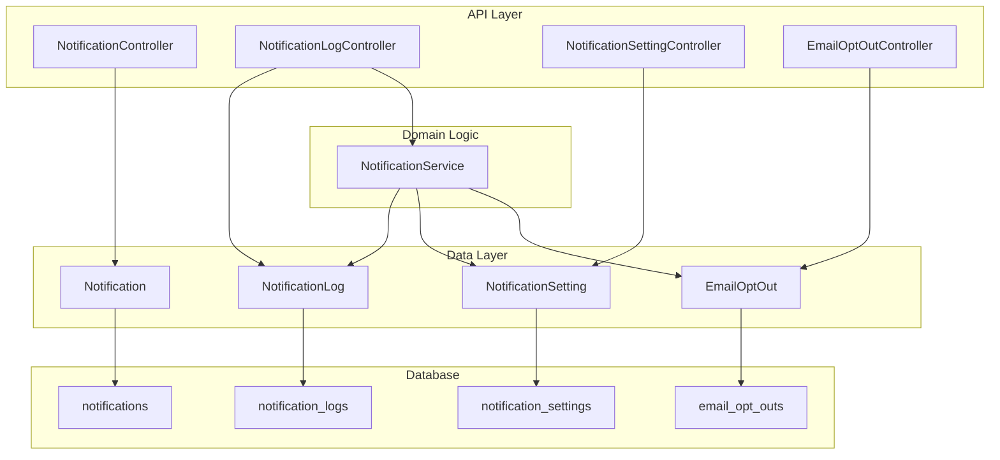
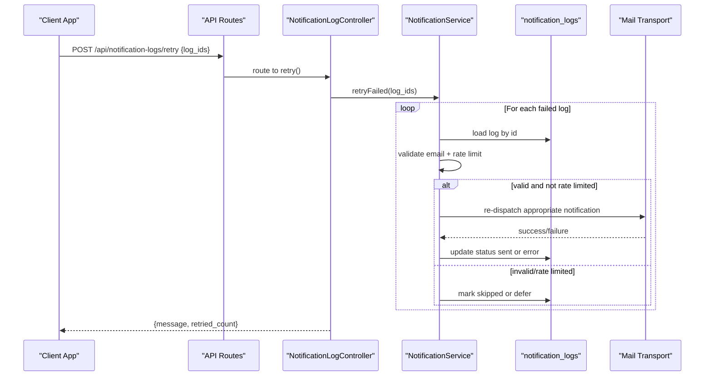
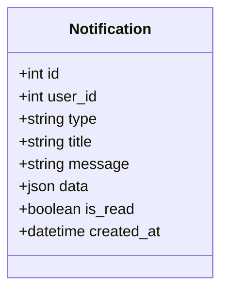
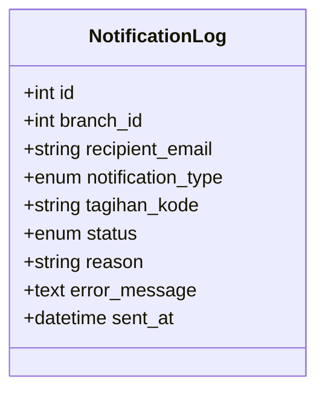
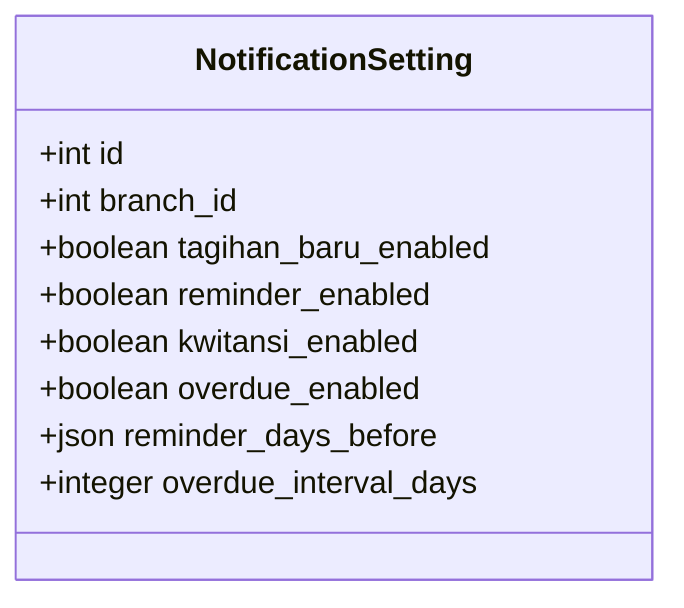
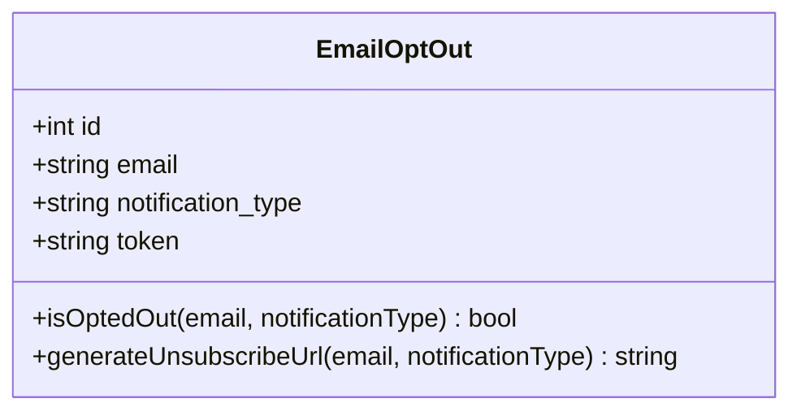
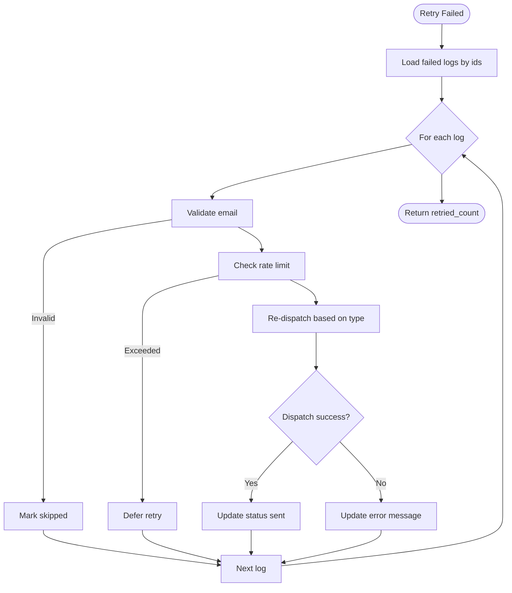
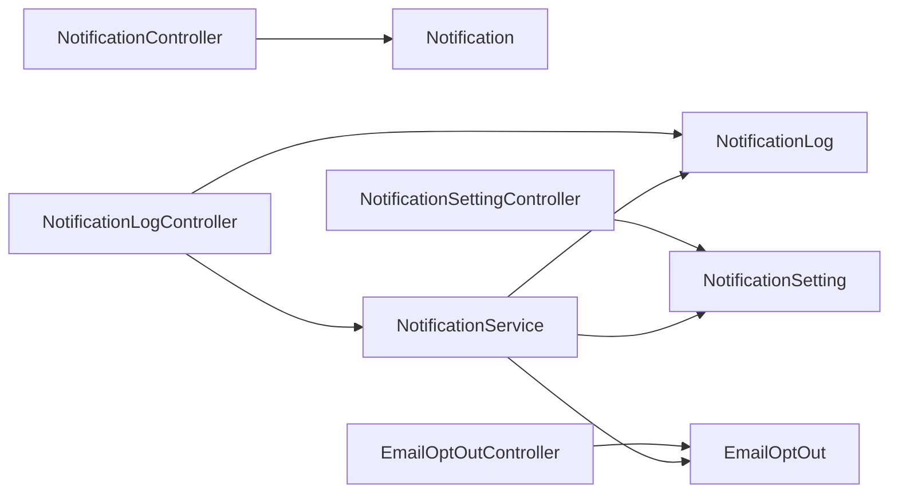

# Notification System API

<cite>
**Referenced Files in This Document**
- [api.php](file://backend/routes/api.php)
- [NotificationController.php](file://backend/app/Http/Controllers/NotificationController.php)
- [NotificationLogController.php](file://backend/app/Http/Controllers/NotificationLogController.php)
- [NotificationSettingController.php](file://backend/app/Http/Controllers/NotificationSettingController.php)
- [EmailOptOutController.php](file://backend/app/Http/Controllers/EmailOptOutController.php)
- [NotificationService.php](file://backend/app/Services/Notifications/NotificationService.php)
- [Notification.php](file://backend/app/Models/Notification.php)
- [NotificationLog.php](file://backend/app/Models/NotificationLog.php)
- [NotificationSetting.php](file://backend/app/Models/NotificationSetting.php)
- [EmailOptOut.php](file://backend/app/Models/EmailOptOut.php)
- [2026_05_26_220003_create_notifications_table.php](file://backend/database/migrations/2026_05_26_220003_create_notifications_table.php)
- [2026_05_27_100100_create_notification_settings_table.php](file://backend/database/migrations/2026_05_27_100100_create_notification_settings_table.php)
- [2026_05_27_100200_create_notification_logs_table.php](file://backend/database/migrations/2026_05_27_100200_create_notification_logs_table.php)
- [2026_05_27_100400_create_notification_sent_records_table.php](file://backend/database/migrations/2026_05_27_100400_create_notification_sent_records_table.php)
</cite>

## Table of Contents
1. Introduction
2. Project Structure
3. Core Components
4. Architecture Overview
5. Detailed Component Analysis
6. Dependency Analysis
7. Performance Considerations
8. Troubleshooting Guide
9. Conclusion

## Introduction
This document provides comprehensive API documentation for the notification system, covering:
- In-app notifications: listing, unread count, marking as read, and bulk mark-as-read
- Notification logs: filtering delivery status and retrying failed notifications
- Notification settings: configuring branch-level email preferences and scheduling parameters
- Public unsubscribe endpoints: managing email opt-outs via secure tokens
It also includes practical workflows, real-time polling patterns, delivery tracking strategies, and best practices for queuing, delivery guarantees, and user preference management.

## Project Structure
The notification system is implemented with a clear separation between HTTP controllers, services, models, and database schema:
- Controllers expose REST endpoints for in-app notifications, logs, settings, and public unsubscribe flows
- Services encapsulate business logic for sending emails, rate limiting, deduplication, and retries
- Models represent persistent entities and relationships
- Migrations define the data structures used by the system

**Diagram sources**
- [api.php:211-262](file://backend/routes/api.php#L211-L262)
- [NotificationController.php:1-52](file://backend/app/Http/Controllers/NotificationController.php#L1-L52)
- [NotificationLogController.php:1-50](file://backend/app/Http/Controllers/NotificationLogController.php#L1-L50)
- [NotificationSettingController.php:1-47](file://backend/app/Http/Controllers/NotificationSettingController.php#L1-L47)
- [EmailOptOutController.php:1-48](file://backend/app/Http/Controllers/EmailOptOutController.php#L1-L48)
- [NotificationService.php:1-713](file://backend/app/Services/Notifications/NotificationService.php#L1-L713)
- [Notification.php:1-35](file://backend/app/Models/Notification.php#L1-L35)
- [NotificationLog.php:1-32](file://backend/app/Models/NotificationLog.php#L1-L32)
- [NotificationSetting.php:1-36](file://backend/app/Models/NotificationSetting.php#L1-L36)
- [EmailOptOut.php:1-42](file://backend/app/Models/EmailOptOut.php#L1-L42)
- [2026_05_26_220003_create_notifications_table.php:1-30](file://backend/database/migrations/2026_05_26_220003_create_notifications_table.php#L1-L30)
- [2026_05_27_100100_create_notification_settings_table.php:1-35](file://backend/database/migrations/2026_05_27_100100_create_notification_settings_table.php#L1-L35)
- [2026_05_27_100200_create_notification_logs_table.php:1-38](file://backend/database/migrations/2026_05_27_100200_create_notification_logs_table.php#L1-L38)
- [2026_05_27_100400_create_notification_sent_records_table.php:1-33](file://backend/database/migrations/2026_05_27_100400_create_notification_sent_records_table.php#L1-L33)

**Section sources**
- [api.php:211-262](file://backend/routes/api.php#L211-L262)

## Core Components
- In-app Notifications (read-only list, unread count, mark single/bulk as read)
- Notification Logs (list with filters, retry failed entries)
- Notification Settings (branch-scoped toggles and schedule parameters)
- Email Opt-Out (public token-based unsubscribe flow)
- Notification Service (delivery orchestration, rate limiting, deduplication, retry)

Key responsibilities:
- Controllers handle request validation, authorization, and response formatting
- Service enforces business rules: enabled flags, opt-out checks, email validation, rate limits, logging, and dispatch
- Models provide persistence and helper methods (e.g., unsubscribe URL generation)

**Section sources**
- [NotificationController.php:1-52](file://backend/app/Http/Controllers/NotificationController.php#L1-L52)
- [NotificationLogController.php:1-50](file://backend/app/Http/Controllers/NotificationLogController.php#L1-L50)
- [NotificationSettingController.php:1-47](file://backend/app/Http/Controllers/NotificationSettingController.php#L1-L47)
- [EmailOptOutController.php:1-48](file://backend/app/Http/Controllers/EmailOptOutController.php#L1-L48)
- [NotificationService.php:1-713](file://backend/app/Services/Notifications/NotificationService.php#L1-L713)

## Architecture Overview
The API layer exposes REST endpoints protected by Sanctum authentication where applicable. The NotificationService centralizes delivery logic, including:
- Branch-level enablement checks
- Recipient resolution and email validation
- Opt-out enforcement
- Rate limiting per branch
- Delivery attempts with detailed logging
- Retry mechanism for failed deliveries

**Diagram sources**
- [api.php:215-217](file://backend/routes/api.php#L215-L217)
- [NotificationLogController.php:35-48](file://backend/app/Http/Controllers/NotificationLogController.php#L35-L48)
- [NotificationService.php:592-711](file://backend/app/Services/Notifications/NotificationService.php#L592-L711)
- [2026_05_27_100200_create_notification_logs_table.php:14-27](file://backend/database/migrations/2026_05_27_100200_create_notification_logs_table.php#L14-L27)

## Detailed Component Analysis

### In-App Notifications API
Endpoints:
- GET /api/notifications
  - Purpose: List current user’s in-app notifications with pagination
  - Query params: per_page (default 20)
  - Response: paginated collection
- GET /api/notifications/unread-count
  - Purpose: Return unread count for current user
  - Response: { data: { count } }
- PATCH /api/notifications/{id}/read
  - Purpose: Mark a specific notification as read
  - Path param: id
  - Response: message
- POST /api/notifications/mark-all-read
  - Purpose: Mark all unread notifications for current user as read
  - Response: message

Notes:
- All endpoints are under auth:sanctum middleware
- Pagination uses standard Laravel paginator format

**Section sources**
- [api.php:256-262](file://backend/routes/api.php#L256-L262)
- [NotificationController.php:11-50](file://backend/app/Http/Controllers/NotificationController.php#L11-L50)
- [Notification.php:11-28](file://backend/app/Models/Notification.php#L11-L28)
- [2026_05_26_220003_create_notifications_table.php:11-22](file://backend/database/migrations/2026_05_26_220003_create_notifications_table.php#L11-L22)

#### Data Model: Notification

**Diagram sources**
- [Notification.php:11-28](file://backend/app/Models/Notification.php#L11-L28)
- [2026_05_26_220003_create_notifications_table.php:11-22](file://backend/database/migrations/2026_05_26_220003_create_notifications_table.php#L11-L22)

### Notification Logs API
Endpoints:
- GET /api/notification-logs
  - Purpose: List delivery logs filtered by branch context
  - Query params:
    - type: filter by notification_type
    - status: filter by status (sent, failed, skipped)
    - per_page: default 15
  - Response: paginated collection
- POST /api/notification-logs/retry
  - Purpose: Retry failed notifications by IDs
  - Body: { log_ids: [int, ...] }
  - Validation: array, min 1, integers existing in table
  - Response: { message, retried_count }

Notes:
- Branch scoping uses authenticated user’s branch_id
- Retry validates email and respects rate limits; updates log status accordingly

**Section sources**
- [api.php:215-217](file://backend/routes/api.php#L215-L217)
- [NotificationLogController.php:15-48](file://backend/app/Http/Controllers/NotificationLogController.php#L15-L48)
- [NotificationService.php:592-711](file://backend/app/Services/Notifications/NotificationService.php#L592-L711)
- [2026_05_27_100200_create_notification_logs_table.php:14-27](file://backend/database/migrations/2026_05_27_100200_create_notification_logs_table.php#L14-L27)

#### Data Model: NotificationLog

**Diagram sources**
- [NotificationLog.php:12-25](file://backend/app/Models/NotificationLog.php#L12-L25)
- [2026_05_27_100200_create_notification_logs_table.php:14-27](file://backend/database/migrations/2026_05_27_100200_create_notification_logs_table.php#L14-L27)

### Notification Settings API
Endpoints:
- GET /api/notification-settings
  - Purpose: Retrieve branch notification settings (creates defaults if missing)
  - Response: { data: setting }
- PUT /api/notification-settings
  - Purpose: Update branch notification settings
  - Request body fields:
    - tagihan_baru_enabled: boolean
    - reminder_enabled: boolean
    - kwitansi_enabled: boolean
    - overdue_enabled: boolean
    - reminder_days_before: array of integers (1..30), min 1 item
    - overdue_interval_days: integer >= 1
  - Response: { data: setting }

Notes:
- Settings are scoped by branch_id from authenticated user
- Defaults are auto-created on first access

**Section sources**
- [api.php:211-213](file://backend/routes/api.php#L211-L213)
- [NotificationSettingController.php:12-45](file://backend/app/Http/Controllers/NotificationSettingController.php#L12-L45)
- [NotificationSettingRequest.php:16-26](file://backend/app/Http/Requests/NotificationSettingRequest.php#L16-L26)
- [NotificationSetting.php:12-29](file://backend/app/Models/NotificationSetting.php#L12-L29)
- [2026_05_27_100100_create_notification_settings_table.php:14-24](file://backend/database/migrations/2026_05_27_100100_create_notification_settings_table.php#L14-L24)

#### Data Model: NotificationSetting

**Diagram sources**
- [NotificationSetting.php:12-29](file://backend/app/Models/NotificationSetting.php#L12-L29)
- [2026_05_27_100100_create_notification_settings_table.php:14-24](file://backend/database/migrations/2026_05_27_100100_create_notification_settings_table.php#L14-L24)

### Public Unsubscribe Endpoints
Endpoints:
- GET /api/unsubscribe/{token}
  - Purpose: Render unsubscribe page for the given token
  - Behavior: Returns view with token, email, and current type
- POST /api/unsubscribe/{token}
  - Purpose: Update opt-out preference for the token
  - Body: { type: "tagihan_baru" | "reminder" | "kwitansi" | "overdue" | "all" }
  - Behavior: Updates notification_type and returns confirmation view

Notes:
- No authentication required
- Invalid/expired token results in 404
- Type normalization ensures only allowed values are accepted

**Section sources**
- [api.php:43-45](file://backend/routes/api.php#L43-L45)
- [EmailOptOutController.php:10-46](file://backend/app/Http/Controllers/EmailOptOutController.php#L10-L46)
- [EmailOptOut.php:22-40](file://backend/app/Models/EmailOptOut.php#L22-L40)

#### Data Model: EmailOptOut

**Diagram sources**
- [EmailOptOut.php:12-40](file://backend/app/Models/EmailOptOut.php#L12-L40)

### Delivery Orchestration and Retry Flow
The service handles:
- Enabling/disabling per branch
- Opt-out checks
- Email validation
- Rate limiting per branch (max 100 per hour)
- Logging every attempt with status and reasons
- Deduplication for reminders and overdue using sent records

**Diagram sources**
- [NotificationService.php:592-711](file://backend/app/Services/Notifications/NotificationService.php#L592-L711)
- [NotificationLogController.php:35-48](file://backend/app/Http/Controllers/NotificationLogController.php#L35-L48)

## Dependency Analysis
- Controllers depend on models and services for business logic
- NotificationService depends on:
  - NotificationSetting for feature flags and schedules
  - EmailOptOut for opt-out checks and tokenized URLs
  - NotificationLog for audit trails
  - Rate limiter for throttling
- Database tables are referenced by migrations and models

**Diagram sources**
- [NotificationController.php:1-52](file://backend/app/Http/Controllers/NotificationController.php#L1-L52)
- [NotificationLogController.php:1-50](file://backend/app/Http/Controllers/NotificationLogController.php#L1-L50)
- [NotificationSettingController.php:1-47](file://backend/app/Http/Controllers/NotificationSettingController.php#L1-L47)
- [EmailOptOutController.php:1-48](file://backend/app/Http/Controllers/EmailOptOutController.php#L1-L48)
- [NotificationService.php:1-104](file://backend/app/Services/Notifications/NotificationService.php#L1-L104)
- [Notification.php:1-35](file://backend/app/Models/Notification.php#L1-L35)
- [NotificationLog.php:1-32](file://backend/app/Models/NotificationLog.php#L1-L32)
- [NotificationSetting.php:1-36](file://backend/app/Models/NotificationSetting.php#L1-L36)
- [EmailOptOut.php:1-42](file://backend/app/Models/EmailOptOut.php#L1-L42)

**Section sources**
- [api.php:211-262](file://backend/routes/api.php#L211-L262)

## Performance Considerations
- Use pagination for large lists (notifications and logs)
- Filter logs by type/status to reduce payload size
- Implement client-side caching for settings and unread counts
- Prefer batch operations where possible (mark-all-read)
- Respect rate limits to avoid throttling downstream mail providers
- Indexes exist on frequently queried columns (user_id, is_read, created_at; branch_id, notification_type, status)

[No sources needed since this section provides general guidance]

## Troubleshooting Guide
Common issues and resolutions:
- 404 on unsubscribe links: ensure token exists and has not expired
- Retry returns zero retried: check that provided log_ids are valid and in failed state
- Skipped due to invalid email: correct recipient addresses before retry
- Skipped due to rate limit: wait for window to reset or scale queue workers
- Missing settings: use GET /api/notification-settings to initialize defaults

Operational tips:
- Inspect notification_logs for reason and error_message
- Verify branch_id scoping when querying logs
- Confirm feature flags in notification_settings before expecting deliveries

**Section sources**
- [EmailOptOutController.php:10-31](file://backend/app/Http/Controllers/EmailOptOutController.php#L10-L31)
- [NotificationLogController.php:35-48](file://backend/app/Http/Controllers/NotificationLogController.php#L35-L48)
- [NotificationService.php:86-96](file://backend/app/Services/Notifications/NotificationService.php#L86-L96)

## Conclusion
The notification system provides a robust set of APIs for in-app notifications, delivery tracking, configuration, and public unsubscribe management. With centralized orchestration in the service layer, consistent logging, and strong safeguards (opt-out checks, rate limiting, deduplication), it supports reliable delivery and operational visibility. Follow the recommended workflows and best practices to achieve responsive UIs and dependable email delivery at scale.