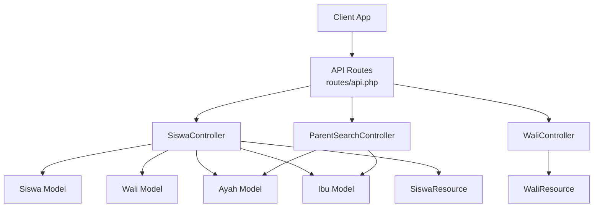
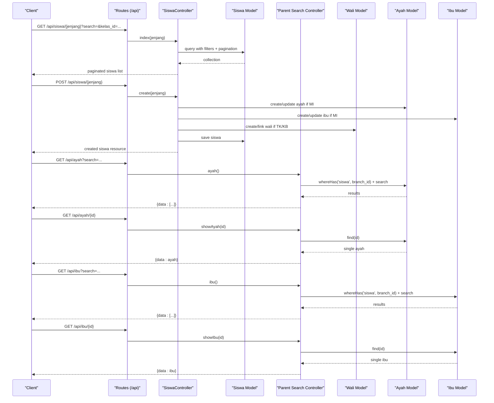
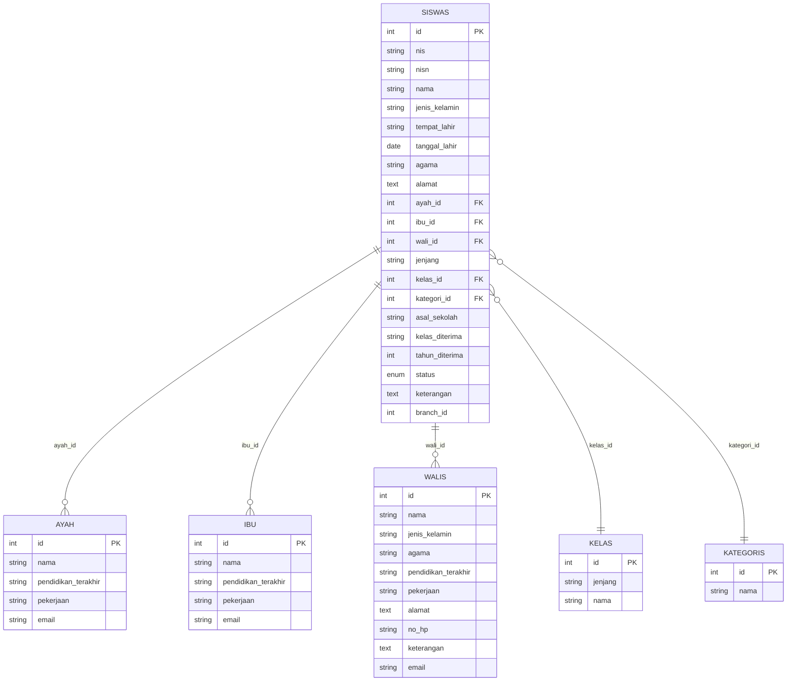
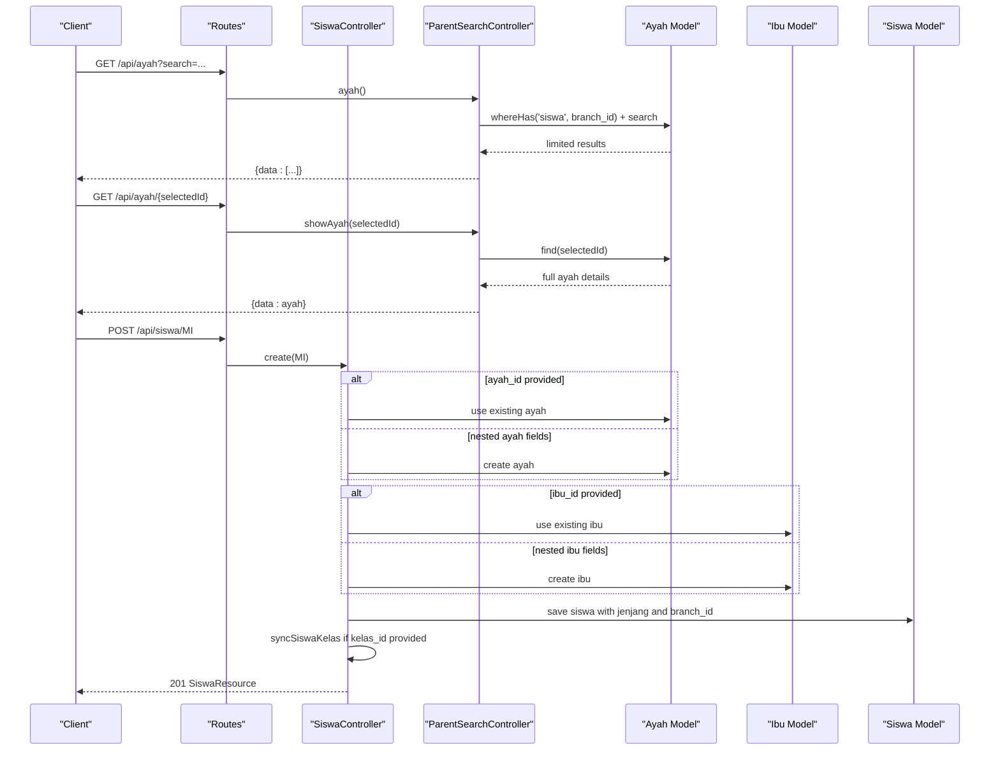
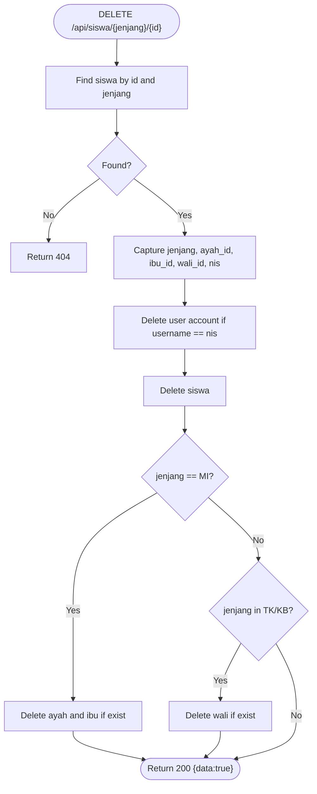
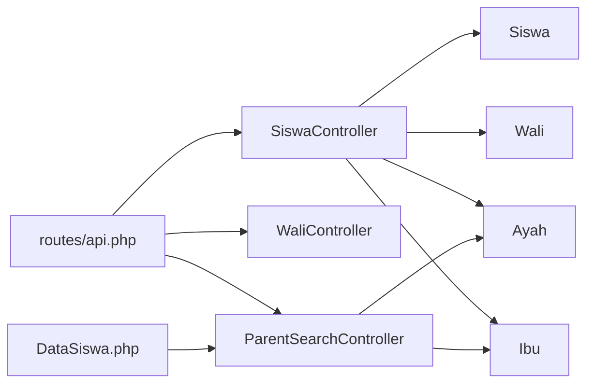

# Student & Family Data API

<cite>
**Referenced Files in This Document**
- [api.php](file://backend/routes/api.php)
- [SiswaController.php](file://backend/app/Http/Controllers/SiswaController.php)
- [WaliController.php](file://backend/app/Http/Controllers/WaliController.php)
- [ParentSearchController.php](file://backend/app/Http/Controllers/ParentSearchController.php)
- [DataSiswa.php](file://frontend-v2/app/Livewire/DataSiswa.php)
- [SiswaRequest.php](file://backend/app/Http/Requests/SiswaRequest.php)
- [SiswaTKRequest.php](file://backend/app/Http/Requests/SiswaTKRequest.php)
- [SiswaKBRequest.php](file://backend/app/Http/Requests/SiswaKBRequest.php)
- [SiswaMIRequest.php](file://backend/app/Http/Requests/SiswaMIRequest.php)
- [SiswaResource.php](file://backend/app/Http/Resources/SiswaResource.php)
- [WaliResource.php](file://backend/app/Http/Resources/WaliResource.php)
- [Siswa.php](file://backend/app/Models/Siswa.php)
- [Wali.php](file://backend/app/Models/Wali.php)
- [Ayah.php](file://backend/app/Models/Ayah.php)
- [Ibu.php](file://backend/app/Models/Ibu.php)
</cite>

## Update Summary
**Changes Made**
- Added documentation for new individual parent lookup endpoints (GET /api/ayah/{id} and GET /api/ibu/{id})
- Updated Parent Search section with enhanced functionality
- Added practical examples showing usage of individual lookup endpoints
- Updated authorization requirements for new endpoints
- Enhanced workflow examples to demonstrate improved parent selection UX

## Table of Contents
1. [Introduction](#introduction)
2. [Project Structure](#project-structure)
3. [Core Components](#core-components)
4. [Architecture Overview](#architecture-overview)
5. [Detailed Component Analysis](#detailed-component-analysis)
6. [Dependency Analysis](#dependency-analysis)
7. [Performance Considerations](#performance-considerations)
8. [Troubleshooting Guide](#troubleshooting-guide)
9. [Conclusion](#conclusion)
10. [Appendices](#appendices)

## Introduction
This document provides detailed API documentation for student (Siswa) and family data management endpoints. It covers CRUD operations for students across school levels (TK, MI, KB), parent/guardian management APIs (Wali, Ayah, Ibu), enhanced parent search functionality with individual lookup capabilities used during student enrollment workflows, data validation rules, relationship mappings, filtering options, practical workflow examples, bulk operations, and privacy/access considerations.

## Project Structure
The student and family data features are implemented under the backend Laravel application:
- Routes define public and authenticated endpoints with permission-based access control.
- Controllers implement business logic for listing, creating, updating, retrieving, and deleting records.
- Request classes enforce validation rules per jenjang (school level).
- Resources shape JSON responses.
- Models define database relationships and attributes.

**Diagram sources**
- [api.php:114-154](file://backend/routes/api.php#L114-L154)
- [SiswaController.php:25-321](file://backend/app/Http/Controllers/SiswaController.php#L25-L321)
- [WaliController.php:15-116](file://backend/app/Http/Controllers/WaliController.php#L15-L116)
- [ParentSearchController.php:19-90](file://backend/app/Http/Controllers/ParentSearchController.php#L19-L90)
- [SiswaResource.php:8-42](file://backend/app/Http/Resources/SiswaResource.php#L8-L42)
- [WaliResource.php:8-30](file://backend/app/Http/Resources/WaliResource.php#L8-L30)
- [Siswa.php:8-117](file://backend/app/Models/Siswa.php#L8-L117)
- [Wali.php:8-37](file://backend/app/Models/Wali.php#L8-L37)
- [Ayah.php:8-33](file://backend/app/Models/Ayah.php#L8-L33)
- [Ibu.php:8-33](file://backend/app/Models/Ibu.php#L8-L33)

**Section sources**
- [api.php:114-154](file://backend/routes/api.php#L114-L154)

## Core Components
- SiswaController: Handles student CRUD by jenjang (TK, MI, KB), including nested parent/guardian creation or linking, class synchronization, and account creation side-effects.
- WaliController: Manages guardian (Wali) entities with list, create, get, update, delete.
- ParentSearchController: Provides unified search for Ayah and Ibu with enhanced individual lookup capabilities to support student creation workflows.
- Request classes: Validate inputs per jenjang and handle conditional requirements for parent fields.
- Resources: Standardize response payloads for Siswa and Wali.
- Models: Define Eloquent relationships between Siswa and parents/guardians, plus class/category associations.

Key responsibilities:
- Authorization via Sanctum and permissions.
- Branch-scoped queries for multi-branch safety.
- Conditional validation based on jenjang.
- Class period synchronization for active academic year.
- Enhanced parent lookup with individual record retrieval.

**Section sources**
- [SiswaController.php:25-321](file://backend/app/Http/Controllers/SiswaController.php#L25-L321)
- [WaliController.php:15-116](file://backend/app/Http/Controllers/WaliController.php#L15-L116)
- [ParentSearchController.php:19-90](file://backend/app/Http/Controllers/ParentSearchController.php#L19-L90)
- [SiswaRequest.php:25-176](file://backend/app/Http/Requests/SiswaRequest.php#L25-L176)
- [SiswaTKRequest.php:24-106](file://backend/app/Http/Requests/SiswaTKRequest.php#L24-L106)
- [SiswaKBRequest.php:24-106](file://backend/app/Http/Requests/SiswaKBRequest.php#L24-L106)
- [SiswaMIRequest.php:24-143](file://backend/app/Http/Requests/SiswaMIRequest.php#L24-L143)
- [SiswaResource.php:15-40](file://backend/app/Http/Resources/SiswaResource.php#L15-L40)
- [WaliResource.php:15-28](file://backend/app/Http/Resources/WaliResource.php#L15-L28)
- [Siswa.php:50-86](file://backend/app/Models/Siswa.php#L50-L86)
- [Wali.php:31-35](file://backend/app/Models/Wali.php#L31-L35)
- [Ayah.php:28-31](file://backend/app/Models/Ayah.php#L28-L31)
- [Ibu.php:28-31](file://backend/app/Models/Ibu.php#L28-L31)

## Architecture Overview
The API is protected by Sanctum authentication and fine-grained permissions. Endpoints are grouped under /api with route prefixes for domain areas. Student endpoints require specific permissions; parent search endpoints are scoped to the current user's branch with enhanced individual lookup capabilities.

**Diagram sources**
- [api.php:114-154](file://backend/routes/api.php#L114-L154)
- [SiswaController.php:42-174](file://backend/app/Http/Controllers/SiswaController.php#L42-L174)
- [ParentSearchController.php:29-90](file://backend/app/Http/Controllers/ParentSearchController.php#L29-L90)
- [Siswa.php:50-86](file://backend/app/Models/Siswa.php#L50-L86)
- [Wali.php:31-35](file://backend/app/Models/Wali.php#L31-L35)
- [Ayah.php:28-31](file://backend/app/Models/Ayah.php#L28-L31)
- [Ibu.php:28-31](file://backend/app/Models/Ibu.php#L28-L31)

## Detailed Component Analysis

### Student (Siswa) Endpoints
Base path: /api/siswa/{jenjang}
- jenjang values: TK, MI, KB

Authentication and authorization:
- Requires Sanctum token.
- Permissions:
  - GET list: view-siswa
  - POST create: create-siswa
  - GET detail: read-siswa
  - PUT update: update-siswa
  - DELETE: delete-siswa

Endpoints:
- GET /api/siswa/{jenjang}
  - Query parameters:
    - search or q: substring match on nama and nis (nisn for MI)
    - kelas_id: filter by class
    - jenis_kelamin: Laki-laki | Perempuan
    - agama: string
    - status: Aktif | Lulus | Pindah | Keluar
    - sort: nama | nis | kelas_id | created_at
    - direction: asc | desc
    - per_page: integer (default 30)
  - Response: paginated collection of SiswaResource
- POST /api/siswa/{jenjang}
  - Body validated by jenjang-specific request class:
    - TK/KB: SiswaTKRequest or SiswaKBRequest
    - MI: SiswaMIRequest
  - Behavior:
    - For MI: link existing ayah_id/ibu_id or create nested ayah/ibu from provided fields
    - For TK/KB: link existing wali_id or create nested wali from provided fields
    - Sets jenjang and branch_id from authenticated user
    - Syncs current active academic year class record when kelas_id is provided
    - Attempts to create a student account asynchronously (non-blocking)
    - Returns 201 with SiswaResource
- GET /api/siswa/{jenjang}/{id}
  - Returns SiswaResource with loaded relations
- PUT /api/siswa/{jenjang}/{id}
  - Updates main fields and related parent/guardian records depending on jenjang
  - Syncs class record if kelas_id changed
  - Returns 200 with SiswaResource
- DELETE /api/siswa/{jenjang}/{id}
  - Deletes linked user account (username = NIS)
  - Deletes siswa, then deletes related parent/guardian records based on jenjang
  - Returns 200 with boolean success

Validation highlights:
- Common fields:
  - nis: required, numeric, length constraints
  - nama: required, alphabetic with accents/spaces
  - jenis_kelamin: required enum
  - tempat_lahir: required
  - tanggal_lahir: required date, before today, after cutoff
  - agama: required
  - alamat: required
  - kelas_id: required, exists kelas
  - kategori_id: required, exists kategoris
  - status: optional enum
- Jenjang-specific:
  - MI:
    - nisn: required, numeric
    - ayah_id or nested ayah fields (conditional)
    - ibu_id or nested ibu fields (conditional)
    - Optional asal_sekolah, kelas_diterima, tahun_diterima
  - TK/KB:
    - wali_id or nested wali fields (conditional)
    - wali_alamat and wali_no_hp required when wali not linked

Relationship mapping:
- Siswa belongsTo Ayah, Ibu, Wali
- Siswa belongsTo Kelas, Kategori
- Siswa hasMany Tagihan (by nis)
- Siswa hasMany SiswaKelas (for period tracking)
- Siswa hasOne User (account)

Response shaping:
- SiswaResource includes id, personal info, jenjang, kelas, kategori, and nested ayah/ibu/wali when loaded.

Example requests and responses:
- See OpenAPI example payloads and responses in the referenced docs file paths below.

Error handling:
- Validation errors return 400 with field messages
- Duplicate NIS returns 400 with message
- Not found returns 404
- Unauthorized returns 401

Practical enrollment workflow (MI):
1. GET /api/ayah?search=... and GET /api/ibu?search=... to find existing parents
2. GET /api/ayah/{id} or GET /api/ibu/{id} to retrieve full parent details for display
3. POST /api/siswa/MI with either ayah_id/ibu_id or nested ayah/ibu fields
4. System creates siswa, links parents, syncs class, attempts account creation

Practical enrollment workflow (TK/KB):
1. GET /api/wali?search=... to find guardian
2. POST /api/siswa/TK or /api/siswa/KB with wali_id or nested wali fields
3. System creates siswa, links wali, syncs class, attempts account creation

Bulk operations:
- No direct bulk student endpoints are exposed here. Bulk import/export is available under /api/import-export routes (separate feature set).

**Section sources**
- [api.php:114-120](file://backend/routes/api.php#L114-L120)
- [SiswaController.php:42-321](file://backend/app/Http/Controllers/SiswaController.php#L42-L321)
- [SiswaRequest.php:25-176](file://backend/app/Http/Requests/SiswaRequest.php#L25-L176)
- [SiswaTKRequest.php:24-106](file://backend/app/Http/Requests/SiswaTKRequest.php#L24-L106)
- [SiswaKBRequest.php:24-106](file://backend/app/Http/Requests/SiswaKBRequest.php#L24-L106)
- [SiswaMIRequest.php:24-143](file://backend/app/Http/Requests/SiswaMIRequest.php#L24-L143)
- [SiswaResource.php:15-40](file://backend/app/Http/Resources/SiswaResource.php#L15-L40)
- [Siswa.php:50-86](file://backend/app/Models/Siswa.php#L50-L86)

### Guardian (Wali) Endpoints
Base path: /api/wali

Authentication and authorization:
- Requires Sanctum token.
- Permissions:
  - GET list: view-siswa
  - POST create: create-siswa
  - GET detail: read-siswa
  - PUT update: update-siswa
  - DELETE: delete-siswa

Endpoints:
- GET /api/wali
  - Query parameters:
    - search: substring match on nama
    - per_page: integer (default 30)
    - sort and direction supported via trait
  - Response: paginated WaliResource collection
- POST /api/wali
  - Body validated by WaliRequest
  - Creates new wali
  - Returns 201 with WaliResource
- GET /api/wali/{id}
  - Returns WaliResource
- PUT /api/wali/{id}
  - Updates wali fields
  - Returns 200 with WaliResource
- DELETE /api/wali/{id}
  - Prevents deletion if wali is linked to any siswa
  - Returns 200 with boolean success on delete

Validation highlights:
- Required fields include name, gender, religion, education, job, address, phone number
- Email optional and validated if present

Relationship mapping:
- Wali hasMany Siswa (via wali_id)

**Section sources**
- [api.php:142-148](file://backend/routes/api.php#L142-L148)
- [WaliController.php:23-115](file://backend/app/Http/Controllers/WaliController.php#L23-L115)
- [WaliResource.php:15-28](file://backend/app/Http/Resources/WaliResource.php#L15-L28)
- [Wali.php:31-35](file://backend/app/Models/Wali.php#L31-L35)

### Parent Search Endpoints (Enhanced)
Base paths:
- GET /api/ayah?search=...
- GET /api/ayah/{id}
- GET /api/ibu?search=...
- GET /api/ibu/{id}

Authentication and authorization:
- Requires Sanctum token.
- Permission: create-siswa

Behavior:
- List endpoints filter parents whose students belong to the current user's branch
- List endpoints limit results to 20
- Individual lookup endpoints retrieve complete parent records by ID
- All endpoints return { data: [...] } format

Use cases:
- Pre-populate parent selection during student creation
- Display full parent details in dropdown selections
- Enhance user experience with real-time parent information

**Updated** Enhanced with individual lookup endpoints for better user experience

**Section sources**
- [api.php:165-171](file://backend/routes/api.php#L165-L171)
- [ParentSearchController.php:29-90](file://backend/app/Http/Controllers/ParentSearchController.php#L29-L90)
- [Ayah.php:28-31](file://backend/app/Models/Ayah.php#L28-L31)
- [Ibu.php:28-31](file://backend/app/Models/Ibu.php#L28-L31)

### Data Validation Rules Summary
- Common student fields:
  - nis: required, numeric, min/max length
  - nama: required, alphabetic with accents/spaces
  - jenis_kelamin: required enum
  - tempat_lahir: required
  - tanggal_lahir: required date constraints
  - agama: required
  - alamat: required
  - kelas_id: required, exists kelas
  - kategori_id: required, exists kategoris
  - status: optional enum
- MI-specific:
  - nisn: required, numeric
  - ayah_id or nested ayah fields (conditional)
  - ibu_id or nested ibu fields (conditional)
  - Optional asal_sekolah, kelas_diterima, tahun_diterima
- TK/KB-specific:
  - wali_id or nested wali fields (conditional)
  - wali_alamat and wali_no_hp required when wali not linked

Notes:
- When an existing parent ID is provided, nested fields become optional.
- Email fields are optional but validated if present.

**Section sources**
- [SiswaRequest.php:25-176](file://backend/app/Http/Requests/SiswaRequest.php#L25-L176)
- [SiswaTKRequest.php:24-106](file://backend/app/Http/Requests/SiswaTKRequest.php#L24-L106)
- [SiswaKBRequest.php:24-106](file://backend/app/Http/Requests/SiswaKBRequest.php#L24-L106)
- [SiswaMIRequest.php:24-143](file://backend/app/Http/Requests/SiswaMIRequest.php#L24-L143)

### Relationship Mapping Diagram

**Diagram sources**
- [Siswa.php:50-86](file://backend/app/Models/Siswa.php#L50-L86)
- [Wali.php:31-35](file://backend/app/Models/Wali.php#L31-L35)
- [Ayah.php:28-31](file://backend/app/Models/Ayah.php#L28-L31)
- [Ibu.php:28-31](file://backend/app/Models/Ibu.php#L28-L31)

### Sequence Diagrams for Key Workflows

#### Create Student (MI) with Enhanced Parent Selection

**Diagram sources**
- [SiswaController.php:84-174](file://backend/app/Http/Controllers/SiswaController.php#L84-L174)
- [ParentSearchController.php:29-90](file://backend/app/Http/Controllers/ParentSearchController.php#L29-L90)
- [Siswa.php:50-86](file://backend/app/Models/Siswa.php#L50-L86)
- [Ayah.php:28-31](file://backend/app/Models/Ayah.php#L28-L31)
- [Ibu.php:28-31](file://backend/app/Models/Ibu.php#L28-L31)

#### Delete Student (Cascade Parents/Guardians)

**Diagram sources**
- [SiswaController.php:259-291](file://backend/app/Http/Controllers/SiswaController.php#L259-L291)

## Dependency Analysis
- Route-level dependencies:
  - Siswa endpoints depend on SiswaController and its service/model interactions.
  - Wali endpoints depend on WaliController.
  - Parent search endpoints depend on ParentSearchController and Ayah/Ibu models.
- Permission middleware:
  - All student and wali endpoints are protected by Sanctum and specific permissions.
  - New individual parent lookup endpoints require create-siswa permission.
- Branch scoping:
  - Student listing filters by Auth::user()->branch_id.
  - Parent search filters by students belonging to the same branch.
- Frontend integration:
  - Enhanced parent selection uses both list and individual lookup endpoints for better UX.

**Diagram sources**
- [api.php:114-171](file://backend/routes/api.php#L114-L171)
- [SiswaController.php:25-321](file://backend/app/Http/Controllers/SiswaController.php#L25-L321)
- [WaliController.php:15-116](file://backend/app/Http/Controllers/WaliController.php#L15-L116)
- [ParentSearchController.php:19-90](file://backend/app/Http/Controllers/ParentSearchController.php#L19-L90)
- [DataSiswa.php:896-948](file://frontend-v2/app/Livewire/DataSiswa.php#L896-L948)
- [Siswa.php:50-86](file://backend/app/Models/Siswa.php#L50-L86)
- [Wali.php:31-35](file://backend/app/Models/Wali.php#L31-L35)
- [Ayah.php:28-31](file://backend/app/Models/Ayah.php#L28-L31)
- [Ibu.php:28-31](file://backend/app/Models/Ibu.php#L28-L31)

**Section sources**
- [api.php:114-171](file://backend/routes/api.php#L114-L171)

## Performance Considerations
- Pagination:
  - Student and wali listings are paginated; tune per_page appropriately.
- Eager loading:
  - Student listing loads ayah, ibu, wali, kelas, kategori; ensure indexes on foreign keys and commonly filtered columns (jenjang, branch_id, kelas_id).
- Sorting:
  - Use supported sort columns to avoid expensive computations.
- Parent search optimization:
  - List endpoints cap at 20 results to reduce payload size.
  - Individual lookup endpoints provide direct ID-based access without search overhead.
- Transactions:
  - Class synchronization uses DB transactions to maintain consistency.
- Frontend efficiency:
  - Individual lookup reduces unnecessary data transfer by fetching only needed parent details.

## Troubleshooting Guide
Common issues and resolutions:
- 401 Unauthorized:
  - Ensure valid Sanctum token in Authorization header.
- 403 Forbidden:
  - Verify user has required permission (e.g., view-siswa, create-siswa).
  - New individual parent lookup endpoints require create-siswa permission.
- 400 Validation Error:
  - Check field formats and required conditions (especially jenjang-specific parent fields).
- 404 Not Found:
  - Confirm student or wali IDs exist and jenjang matches.
  - Individual parent lookup returns 404 if parent ID doesn't exist.
- Duplicate NIS:
  - Choose a unique NIS value.
- Cannot delete wali:
  - Wali is linked to a student; unlink or delete the student first.
- Parent selection issues:
  - Ensure parent exists in the same branch as the authenticated user.
  - Verify parent has associated students in the system.

**Section sources**
- [SiswaController.php:90-97](file://backend/app/Http/Controllers/SiswaController.php#L90-L97)
- [SiswaController.php:259-291](file://backend/app/Http/Controllers/SiswaController.php#L259-L291)
- [WaliController.php:89-115](file://backend/app/Http/Controllers/WaliController.php#L89-L115)
- [ParentSearchController.php:70-89](file://backend/app/Http/Controllers/ParentSearchController.php#L70-L89)

## Conclusion
The Student & Family Data API provides robust CRUD capabilities for students across school levels, comprehensive parent/guardian management, and enhanced search utilities with individual lookup capabilities for enrollment workflows. The new individual parent lookup endpoints significantly improve user experience by providing direct access to complete parent details. Strong validation, permission controls, and branch scoping ensure data integrity and security. Follow the documented endpoints, validation rules, and workflows to integrate effectively.

## Appendices

### API Reference Tables

#### Students (Siswa)
- Base path: /api/siswa/{jenjang}
- Methods:
  - GET /api/siswa/{jenjang}
    - Query params: search/q, kelas_id, jenis_kelamin, agama, status, sort, direction, per_page
    - Responses: 200 (paginated), 401, 400 (validation)
  - POST /api/siswa/{jenjang}
    - Body: jenjang-specific request schema
    - Responses: 201, 400 (validation/duplicate NIS), 401
  - GET /api/siswa/{jenjang}/{id}
    - Responses: 200, 404, 401
  - PUT /api/siswa/{jenjang}/{id}
    - Body: jenjang-specific request schema
    - Responses: 200, 404, 401
  - DELETE /api/siswa/{jenjang}/{id}
    - Responses: 200, 404, 401

**Section sources**
- [api.php:114-120](file://backend/routes/api.php#L114-L120)
- [SiswaController.php:42-321](file://backend/app/Http/Controllers/SiswaController.php#L42-L321)

#### Guardians (Wali)
- Base path: /api/wali
- Methods:
  - GET /api/wali
    - Query params: search, per_page, sort, direction
    - Responses: 200, 401
  - POST /api/wali
    - Body: WaliRequest schema
    - Responses: 201, 400, 401
  - GET /api/wali/{id}
    - Responses: 200, 404, 401
  - PUT /api/wali/{id}
    - Body: WaliRequest schema
    - Responses: 200, 404, 400, 401
  - DELETE /api/wali/{id}
    - Responses: 200, 404, 400, 401

**Section sources**
- [api.php:142-148](file://backend/routes/api.php#L142-L148)
- [WaliController.php:23-115](file://backend/app/Http/Controllers/WaliController.php#L23-L115)

#### Parent Search (Enhanced)
- Base paths:
  - GET /api/ayah?search=...
  - GET /api/ayah/{id}
  - GET /api/ibu?search=...
  - GET /api/ibu/{id}
- Authentication: Requires Sanctum token with create-siswa permission
- Responses: 
  - List endpoints: 200 with { data: [...] }, limited to 20 results
  - Individual lookup: 200 with { data: parent_object }, 404 if not found
- Use cases: Parent selection during student enrollment with enhanced UX

**Updated** Added individual lookup endpoints for better user experience

**Section sources**
- [api.php:165-171](file://backend/routes/api.php#L165-L171)
- [ParentSearchController.php:29-90](file://backend/app/Http/Controllers/ParentSearchController.php#L29-L90)

### Practical Workflow Examples

#### Enhanced Parent Selection Workflow
1. **Search for existing parents:**
   - GET /api/ayah?search=nama_ayah
   - GET /api/ibu?search=nama_ibu
   - Receive limited results (max 20) for quick selection

2. **Get full parent details:**
   - GET /api/ayah/{selected_parent_id}
   - GET /api/ibu/{selected_parent_id}
   - Receive complete parent information for display

3. **Create student with selected parent:**
   - POST /api/siswa/MI with ayah_id/ibu_id
   - System creates siswa, links parents, syncs class, attempts account creation

#### Traditional Enrollment Workflow (MI)
1. GET /api/ayah?search=... and GET /api/ibu?search=...
2. POST /api/siswa/MI with either ayah_id/ibu_id or nested ayah/ibu fields
3. Receive 201 with full siswa resource including parents and class

#### TK/KB Enrollment Workflow
1. GET /api/wali?search=...
2. POST /api/siswa/TK or /api/siswa/KB with wali_id or nested wali fields
3. Receive 201 with full siswa resource including wali and class

#### Update and Management Operations
- Update student class: PUT /api/siswa/{jenjang}/{id} with kelas_id
- Delete student: DELETE /api/siswa/{jenjang}/{id} with cascade cleanup

**Section sources**
- [SiswaController.php:84-174](file://backend/app/Http/Controllers/SiswaController.php#L84-L174)
- [SiswaController.php:259-291](file://backend/app/Http/Controllers/SiswaController.php#L259-L291)
- [ParentSearchController.php:29-90](file://backend/app/Http/Controllers/ParentSearchController.php#L29-L90)
- [DataSiswa.php:896-948](file://frontend-v2/app/Livewire/DataSiswa.php#L896-L948)

### Data Privacy and Access Controls
- Authentication:
  - All endpoints require Sanctum tokens.
- Authorization:
  - Fine-grained permissions protect each endpoint (e.g., view-siswa, create-siswa).
  - New individual parent lookup endpoints require create-siswa permission.
- Branch isolation:
  - Student listings are scoped to the authenticated user's branch.
  - Parent search is limited to parents whose students belong to the same branch.
  - Individual parent lookup respects branch boundaries through model relationships.
- Sensitive data:
  - Avoid exposing unnecessary sensitive fields in resources; currently, resources expose standard identifiers and contact details.
  - Individual parent lookup provides complete parent information for authorized users.
- Auditability:
  - Consider logging critical mutations (create/update/delete) for compliance.

**Section sources**
- [api.php:165-171](file://backend/routes/api.php#L165-L171)
- [ParentSearchController.php:37-42](file://backend/app/Http/Controllers/ParentSearchController.php#L37-L42)
- [ParentSearchController.php:70-89](file://backend/app/Http/Controllers/ParentSearchController.php#L70-L89)