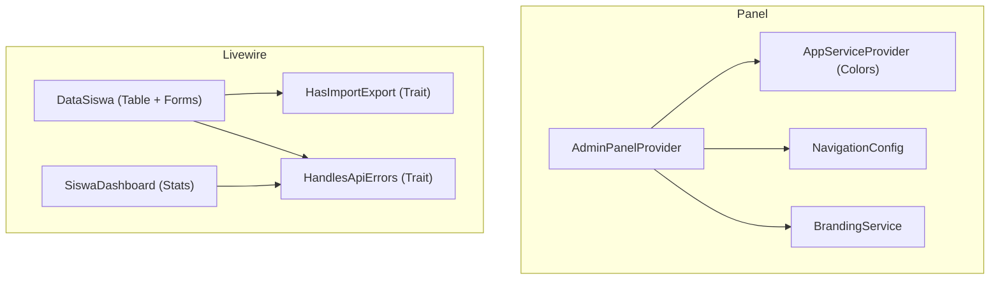
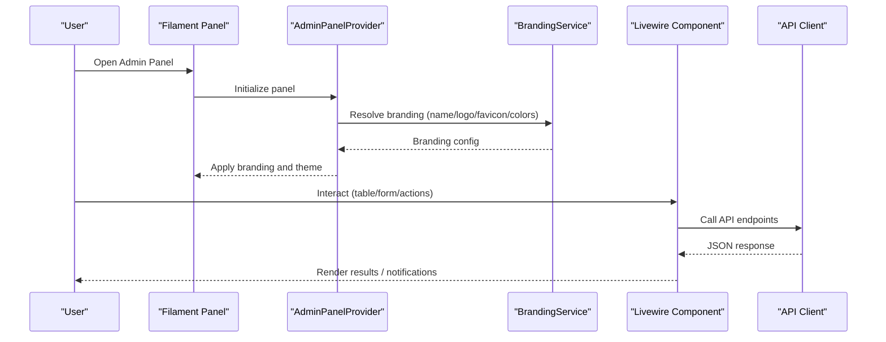
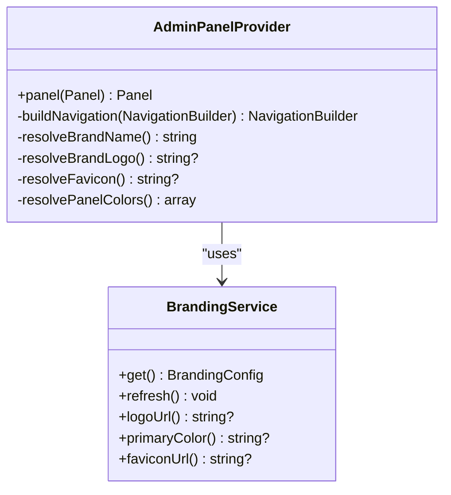
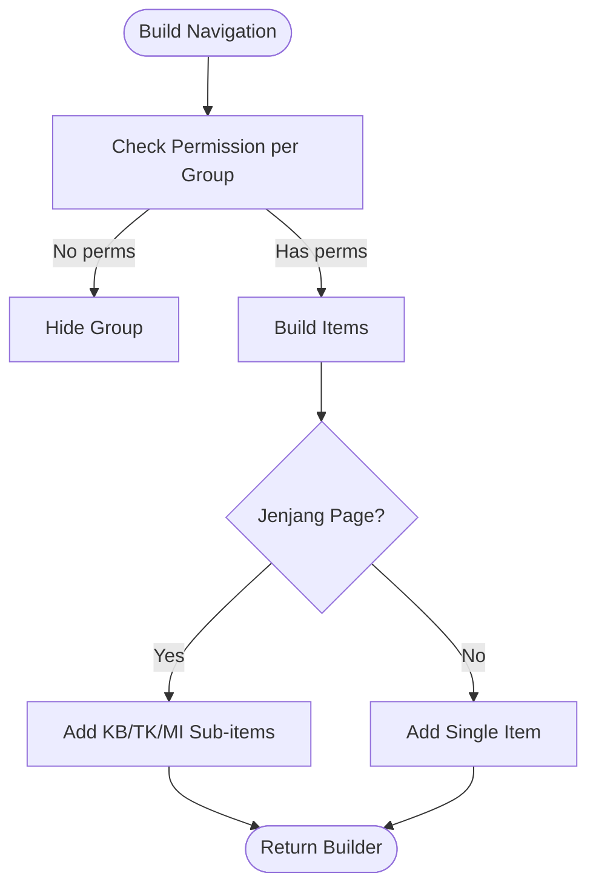
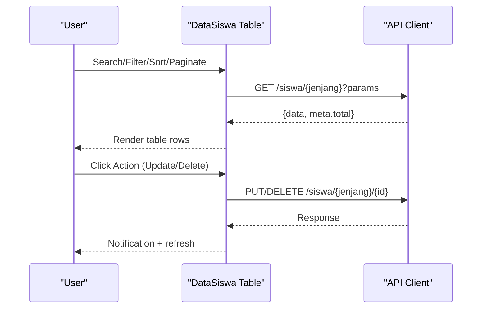
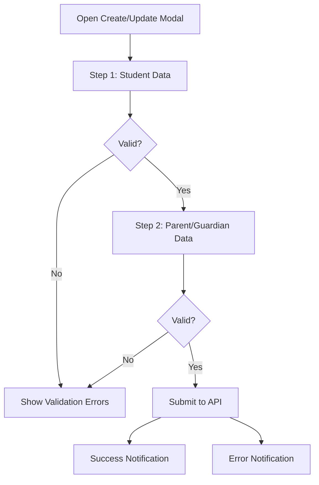
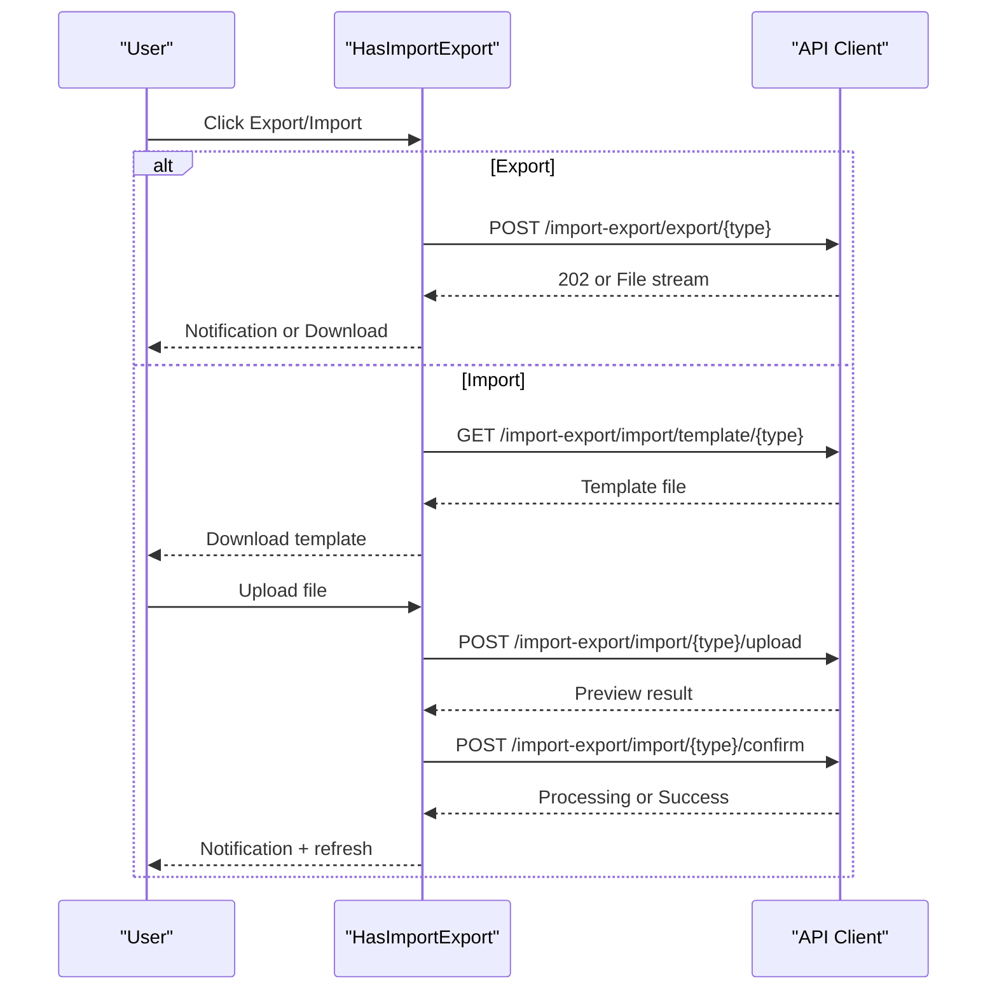
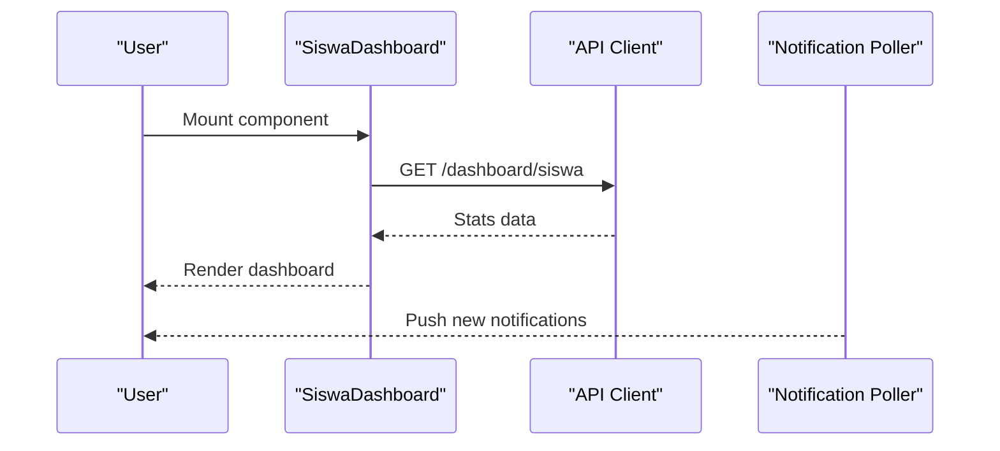
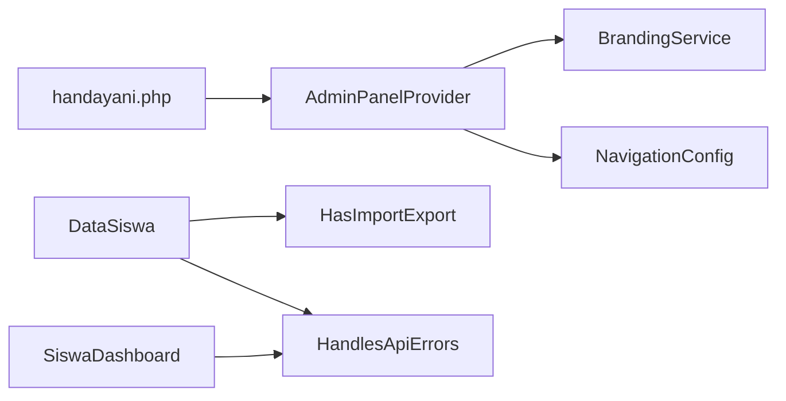

# Admin Panel (Filament)

<cite>
**Referenced Files in This Document**
- [AdminPanelProvider.php](file://frontend-v2/app/Providers/Filament/AdminPanelProvider.php)
- [AppServiceProvider.php](file://frontend-v2/app/Providers/AppServiceProvider.php)
- [BrandingService.php](file://frontend-v2/app/Services/BrandingService.php)
- [NavigationConfig.php](file://frontend-v2/app/Config/NavigationConfig.php)
- [handayani.php](file://frontend-v2/config/handayani.php)
- [DataSiswa.php](file://frontend-v2/app/Livewire/DataSiswa.php)
- [HandlesApiErrors.php](file://frontend-v2/app/Livewire/Concerns/HandlesApiErrors.php)
- [HasImportExport.php](file://frontend-v2/app/Livewire/Concerns/HasImportExport.php)
- [SiswaDashboard.php](file://frontend-v2/app/Livewire/SiswaDashboard.php)
</cite>

## Table of Contents
1. [Introduction](#introduction)
2. [Project Structure](#project-structure)
3. [Core Components](#core-components)
4. [Architecture Overview](#architecture-overview)
5. [Detailed Component Analysis](#detailed-component-analysis)
6. [Dependency Analysis](#dependency-analysis)
7. [Performance Considerations](#performance-considerations)
8. [Troubleshooting Guide](#troubleshooting-guide)
9. [Conclusion](#conclusion)
10. [Appendices](#appendices)

## Introduction
This document provides comprehensive admin panel documentation for the Filament-powered administrative interface. It explains the panel architecture, branding customization, navigation structure, dashboard widgets, Livewire component patterns, data tables with filtering/sorting/bulk operations, form components and validation, role-based access controls, real-time notifications, UI customization, responsive considerations, and performance optimization strategies for large datasets.

## Project Structure
The admin panel is implemented as a Filament panel within the frontend-v2 application. Key areas include:
- Panel provider: central configuration for authentication, navigation, widgets, theme, and render hooks
- Branding service: dynamic brand assets and colors from backend API
- Navigation configuration: group definitions and jenjang-based sub-navigation
- Feature flags: toggles for SPA loading, custom navigation, portal path, and Midtrans integration
- Livewire components: data tables, forms, dashboards, and import/export utilities

**Diagram sources**
- [AdminPanelProvider.php:51-135](file://frontend-v2/app/Providers/Filament/AdminPanelProvider.php#L51-L135)
- [AppServiceProvider.php:18-49](file://frontend-v2/app/Providers/AppServiceProvider.php#L18-L49)
- [NavigationConfig.php:11-48](file://frontend-v2/app/Config/NavigationConfig.php#L11-L48)
- [BrandingService.php:15-90](file://frontend-v2/app/Services/BrandingService.php#L15-L90)
- [DataSiswa.php:37-39](file://frontend-v2/app/Livewire/DataSiswa.php#L37-L39)
- [HasImportExport.php:11-92](file://frontend-v2/app/Livewire/Concerns/HasImportExport.php#L11-L92)
- [HandlesApiErrors.php:7-66](file://frontend-v2/app/Livewire/Concerns/HandlesApiErrors.php#L7-L66)
- [SiswaDashboard.php:10-17](file://frontend-v2/app/Livewire/SiswaDashboard.php#L10-L17)

**Section sources**
- [AdminPanelProvider.php:51-135](file://frontend-v2/app/Providers/Filament/AdminPanelProvider.php#L51-L135)
- [AppServiceProvider.php:18-49](file://frontend-v2/app/Providers/AppServiceProvider.php#L18-L49)
- [NavigationConfig.php:11-48](file://frontend-v2/app/Config/NavigationConfig.php#L11-L48)
- [BrandingService.php:15-90](file://frontend-v2/app/Services/BrandingService.php#L15-L90)
- [handayani.php:14-29](file://frontend-v2/config/handayani.php#L14-L29)

## Core Components
- AdminPanelProvider: Registers the default Filament panel, login/password reset pages, user menu items, navigation builder, widget discovery, Vite theme, branding, favicon, colors, database notifications, render hooks, and middleware stack.
- AppServiceProvider: Binds custom login/logout responses and registers a global color palette for the Filament UI.
- BrandingService: Resolves branch branding (name, logo, favicon, primary color) from session cache or backend API; used by the panel to apply dynamic branding.
- NavigationConfig: Defines navigation groups and jenjang options that drive sidebar organization and visibility.
- Livewire DataSiswa: Implements a full-featured table with remote pagination, search, filters, sorting, record actions, bulk actions, and wizard-based forms for create/update flows.
- HasImportExport trait: Provides reusable export/import template download, upload preview, confirm import, and import history actions.
- HandlesApiErrors trait: Centralized error handling for API failures and connection issues, surfaced via Filament notifications.
- SiswaDashboard: A dashboard component that loads stats from the backend and supports child selection for wali users.

**Section sources**
- [AdminPanelProvider.php:51-135](file://frontend-v2/app/Providers/Filament/AdminPanelProvider.php#L51-L135)
- [AppServiceProvider.php:18-49](file://frontend-v2/app/Providers/AppServiceProvider.php#L18-L49)
- [BrandingService.php:15-90](file://frontend-v2/app/Services/BrandingService.php#L15-L90)
- [NavigationConfig.php:11-48](file://frontend-v2/app/Config/NavigationConfig.php#L11-L48)
- [DataSiswa.php:37-39](file://frontend-v2/app/Livewire/DataSiswa.php#L37-L39)
- [HasImportExport.php:11-92](file://frontend-v2/app/Livewire/Concerns/HasImportExport.php#L11-L92)
- [HandlesApiErrors.php:7-66](file://frontend-v2/app/Livewire/Concerns/HandlesApiErrors.php#L7-L66)
- [SiswaDashboard.php:10-17](file://frontend-v2/app/Livewire/SiswaDashboard.php#L10-L17)

## Architecture Overview
The admin panel follows a layered approach:
- Presentation layer: Filament panels, Livewire components, Blade render hooks, and Vite theme
- Service layer: BrandingService and ApiService (used across components)
- Configuration layer: handayani feature flags and NavigationConfig
- Authentication and authorization: Custom auth middleware, permission checks via session-scoped permissions, and visibility rules on navigation and actions

**Diagram sources**
- [AdminPanelProvider.php:51-135](file://frontend-v2/app/Providers/Filament/AdminPanelProvider.php#L51-L135)
- [BrandingService.php:15-90](file://frontend-v2/app/Services/BrandingService.php#L15-L90)
- [DataSiswa.php:51-129](file://frontend-v2/app/Livewire/DataSiswa.php#L51-L129)

## Detailed Component Analysis

### Panel Provider and Branding
- Panel registration: default panel, home URL, login/password reset pages, breadcrumbs, SPA mode, widget discovery, Vite theme, database notifications, and render hooks for notification polling and pagination loading.
- Branding resolution: brand name, logo, favicon, and primary color are resolved dynamically using BrandingService and applied to the panel.
- Middleware: includes encryption, session start, CSRF verification, binding substitution, and Filament-specific middleware.

**Diagram sources**
- [AdminPanelProvider.php:51-135](file://frontend-v2/app/Providers/Filament/AdminPanelProvider.php#L51-L135)
- [BrandingService.php:15-90](file://frontend-v2/app/Services/BrandingService.php#L15-L90)

**Section sources**
- [AdminPanelProvider.php:51-135](file://frontend-v2/app/Providers/Filament/AdminPanelProvider.php#L51-L135)
- [BrandingService.php:15-90](file://frontend-v2/app/Services/BrandingService.php#L15-L90)

### Navigation and Role-Based Access Control
- Navigation groups: Akademik, Keuangan, Laporan, Pengaturan defined in NavigationConfig.
- Dynamic visibility: Groups and items are hidden if the user lacks any permission within the group; item-level visibility uses permission checks.
- Jenjang-based sub-items: Pages like Siswa, Kelas, Tagihan show KB/TK/MI sub-items based on configured options.
- Special cases: Dashboard appears as a top-level item when permitted; siswa/wali users see portal links instead of duplicated admin pages.

**Diagram sources**
- [AdminPanelProvider.php:141-191](file://frontend-v2/app/Providers/Filament/AdminPanelProvider.php#L141-L191)
- [NavigationConfig.php:11-48](file://frontend-v2/app/Config/NavigationConfig.php#L11-L48)

**Section sources**
- [AdminPanelProvider.php:141-191](file://frontend-v2/app/Providers/Filament/AdminPanelProvider.php#L141-L191)
- [NavigationConfig.php:11-48](file://frontend-v2/app/Config/NavigationConfig.php#L11-L48)

### Data Tables: Students (Siswa)
- Remote pagination and deferred loading: records are fetched via API with search, filters, sort parameters.
- Columns: NIS, NISN (conditional), Name, Class, Gender, Birth Date, Religion, Parent info (conditional).
- Filters: Class (dynamic options), Status, Gender, Religion.
- Sorting: Enabled on key columns.
- Record actions: View detail, Update (wizard-based forms), Delete with confirmation.
- Bulk actions: Bulk delete with success/failure feedback.
- Header actions: Import/Export via HasImportExport trait.

**Diagram sources**
- [DataSiswa.php:51-129](file://frontend-v2/app/Livewire/DataSiswa.php#L51-L129)
- [DataSiswa.php:201-679](file://frontend-v2/app/Livewire/DataSiswa.php#L201-L679)

**Section sources**
- [DataSiswa.php:51-129](file://frontend-v2/app/Livewire/DataSiswa.php#L51-L129)
- [DataSiswa.php:201-679](file://frontend-v2/app/Livewire/DataSiswa.php#L201-L679)

### Form Components and Validation
- Wizard-based forms: Multi-step schemas for complex data entry (student details, parent/guardian info).
- Field types: TextInput, DatePicker, Select, Textarea, Grid layout.
- Validation: Required fields with custom messages; server-side updates via API calls.
- UX: Modal dialogs with next/previous actions and submit buttons styled consistently.

**Diagram sources**
- [DataSiswa.php:692-430](file://frontend-v2/app/Livewire/DataSiswa.php#L692-L430)

**Section sources**
- [DataSiswa.php:692-430](file://frontend-v2/app/Livewire/DataSiswa.php#L692-L430)

### Import and Export Utilities
- Export: Supports XLSX/CSV with optional filters; background processing returns 202 with message; immediate download when available.
- Import: Template download, file upload with validation, preview, auto-confirm for valid rows, rollback support.
- Permissions: Actions visible only when user has import/export permissions.

**Diagram sources**
- [HasImportExport.php:145-351](file://frontend-v2/app/Livewire/Concerns/HasImportExport.php#L145-L351)

**Section sources**
- [HasImportExport.php:145-351](file://frontend-v2/app/Livewire/Concerns/HasImportExport.php#L145-L351)

### Dashboard Statistics and Real-Time Updates
- SiswaDashboard: Loads stats from backend, supports child selection for wali users, handles API errors and connection issues.
- Notifications: Database notifications enabled at panel level; a Livewire poller is injected via render hooks for real-time updates.

**Diagram sources**
- [SiswaDashboard.php:19-70](file://frontend-v2/app/Livewire/SiswaDashboard.php#L19-L70)
- [AdminPanelProvider.php:110-123](file://frontend-v2/app/Providers/Filament/AdminPanelProvider.php#L110-L123)

**Section sources**
- [SiswaDashboard.php:19-70](file://frontend-v2/app/Livewire/SiswaDashboard.php#L19-L70)
- [AdminPanelProvider.php:110-123](file://frontend-v2/app/Providers/Filament/AdminPanelProvider.php#L110-L123)

### UI Customization and Responsive Design
- Global color palette registered via AppServiceProvider for consistent theming.
- Vite theme path configured in panel provider for CSS overrides.
- Dark mode enabled; breadcrumbs and SPA transitions configurable via feature flags.
- Responsive behavior leverages Filament’s built-in responsive components and grid layouts.

**Section sources**
- [AppServiceProvider.php:24-49](file://frontend-v2/app/Providers/AppServiceProvider.php#L24-L49)
- [AdminPanelProvider.php:63-65](file://frontend-v2/app/Providers/Filament/AdminPanelProvider.php#L63-L65)
- [AdminPanelProvider.php:102-106](file://frontend-v2/app/Providers/Filament/AdminPanelProvider.php#L102-L106)
- [handayani.php:14-29](file://frontend-v2/config/handayani.php#L14-L29)

## Dependency Analysis
Key dependencies and relationships:
- AdminPanelProvider depends on BrandingService for dynamic branding and on NavigationConfig for sidebar organization.
- Livewire components use traits for shared behaviors: HasImportExport for import/export workflows and HandlesApiErrors for consistent error notifications.
- Feature flags in handayani.php control SPA loading, custom navigation, profile migration, and Midtrans integration.

**Diagram sources**
- [AdminPanelProvider.php:51-135](file://frontend-v2/app/Providers/Filament/AdminPanelProvider.php#L51-L135)
- [BrandingService.php:15-90](file://frontend-v2/app/Services/BrandingService.php#L15-L90)
- [NavigationConfig.php:11-48](file://frontend-v2/app/Config/NavigationConfig.php#L11-L48)
- [DataSiswa.php:37-39](file://frontend-v2/app/Livewire/DataSiswa.php#L37-L39)
- [HasImportExport.php:11-92](file://frontend-v2/app/Livewire/Concerns/HasImportExport.php#L11-L92)
- [HandlesApiErrors.php:7-66](file://frontend-v2/app/Livewire/Concerns/HandlesApiErrors.php#L7-L66)
- [handayani.php:14-29](file://frontend-v2/config/handayani.php#L14-L29)

**Section sources**
- [AdminPanelProvider.php:51-135](file://frontend-v2/app/Providers/Filament/AdminPanelProvider.php#L51-L135)
- [BrandingService.php:15-90](file://frontend-v2/app/Services/BrandingService.php#L15-L90)
- [NavigationConfig.php:11-48](file://frontend-v2/app/Config/NavigationConfig.php#L11-L48)
- [DataSiswa.php:37-39](file://frontend-v2/app/Livewire/DataSiswa.php#L37-L39)
- [HasImportExport.php:11-92](file://frontend-v2/app/Livewire/Concerns/HasImportExport.php#L11-L92)
- [HandlesApiErrors.php:7-66](file://frontend-v2/app/Livewire/Concerns/HandlesApiErrors.php#L7-L66)
- [handayani.php:14-29](file://frontend-v2/config/handayani.php#L14-L29)

## Performance Considerations
- Deferred loading and remote pagination: The student table uses deferred loading and remote pagination to minimize initial payload and improve responsiveness.
- Conditional column visibility: Reduces DOM size by hiding unnecessary columns per jenjang.
- Background processing: Export/import operations can return async status codes to avoid blocking requests.
- Caching branding: BrandingService caches results in session to reduce repeated API calls.
- SPA transitions: Enable smooth client-side navigation while keeping payloads small.

[No sources needed since this section provides general guidance]

## Troubleshooting Guide
Common issues and resolutions:
- API errors: Use HandlesApiErrors to extract messages and display persistent notifications.
- Connection failures: Dedicated notification guides users to verify backend availability.
- Unexpected errors: Generic fallback ensures users receive actionable messages.
- Import/export failures: Review notifications for detailed error messages; check import history modal for batch statuses.

**Section sources**
- [HandlesApiErrors.php:12-66](file://frontend-v2/app/Livewire/Concerns/HandlesApiErrors.php#L12-L66)
- [HasImportExport.php:145-351](file://frontend-v2/app/Livewire/Concerns/HasImportExport.php#L145-L351)

## Conclusion
The Filament admin panel integrates dynamic branding, role-aware navigation, robust data tables, wizard-based forms, and import/export utilities. With centralized error handling, real-time notifications, and configurable features, it provides a scalable foundation for managing students, invoices, payments, and other entities. Following the patterns outlined here will help extend the panel effectively while maintaining performance and usability.

[No sources needed since this section summarizes without analyzing specific files]

## Appendices

### Practical Examples

#### Creating a Custom Page
- Define a new Filament page under the pages directory and register it in the panel provider’s discoverPages or explicit pages list.
- Add navigation item in AdminPanelProvider’s buildNavigation with appropriate permission checks and isActiveWhen route matching.

**Section sources**
- [AdminPanelProvider.php:66-68](file://frontend-v2/app/Providers/Filament/AdminPanelProvider.php#L66-L68)
- [AdminPanelProvider.php:141-191](file://frontend-v2/app/Providers/Filament/AdminPanelProvider.php#L141-L191)

#### Extending Existing Components
- Reuse traits like HasImportExport and HandlesApiErrors in new Livewire components to gain import/export capabilities and consistent error handling.
- Follow the DataSiswa pattern for table setup: define records callback, columns, filters, sorting, record actions, and bulk actions.

**Section sources**
- [HasImportExport.php:11-92](file://frontend-v2/app/Livewire/Concerns/HasImportExport.php#L11-L92)
- [HandlesApiErrors.php:7-66](file://frontend-v2/app/Livewire/Concerns/HandlesApiErrors.php#L7-L66)
- [DataSiswa.php:51-129](file://frontend-v2/app/Livewire/DataSiswa.php#L51-L129)

#### Implementing Role-Based Access Controls
- Use permission checks in navigation items and action visibility closures.
- Leverage session-scoped permissions to conditionally show features and restrict operations.

**Section sources**
- [AdminPanelProvider.php:154-188](file://frontend-v2/app/Providers/Filament/AdminPanelProvider.php#L154-L188)
- [DataSiswa.php:213-213](file://frontend-v2/app/Livewire/DataSiswa.php#L213-L213)

#### Dashboard Widgets and Charts
- Register custom widgets via discoverWidgets in the panel provider.
- Use Livewire components for chart rendering and real-time updates; leverage database notifications for live indicators.

**Section sources**
- [AdminPanelProvider.php:98-101](file://frontend-v2/app/Providers/Filament/AdminPanelProvider.php#L98-L101)
- [AdminPanelProvider.php:110-123](file://frontend-v2/app/Providers/Filament/AdminPanelProvider.php#L110-L123)