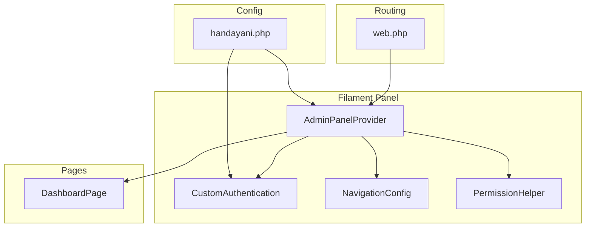
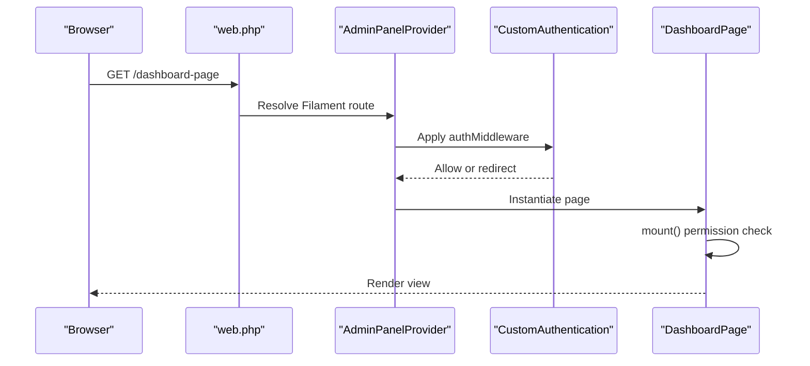
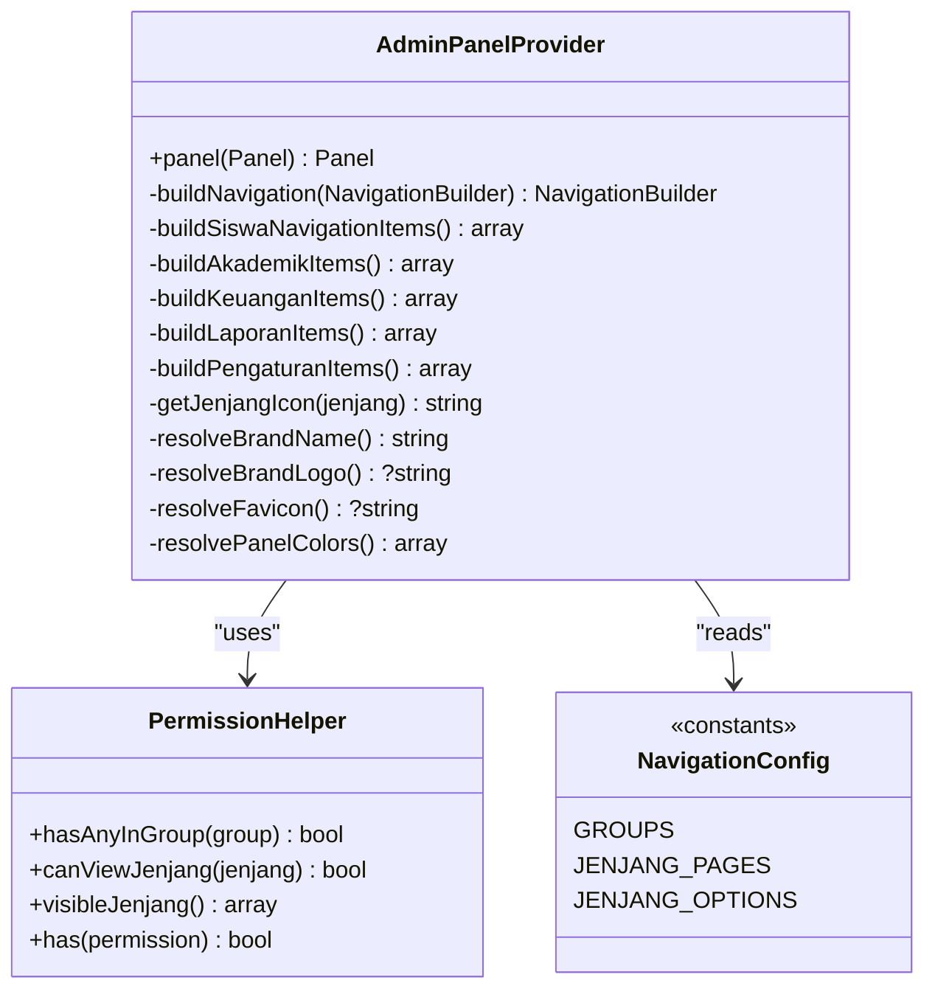
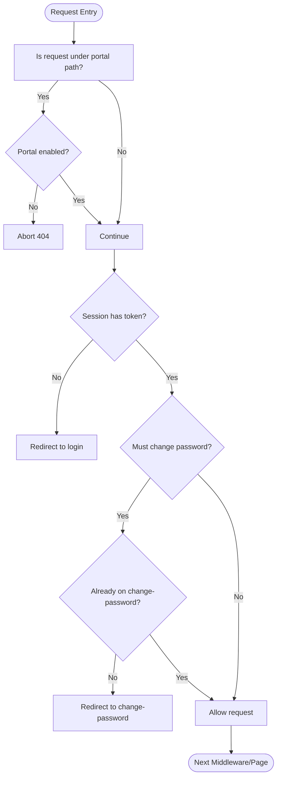
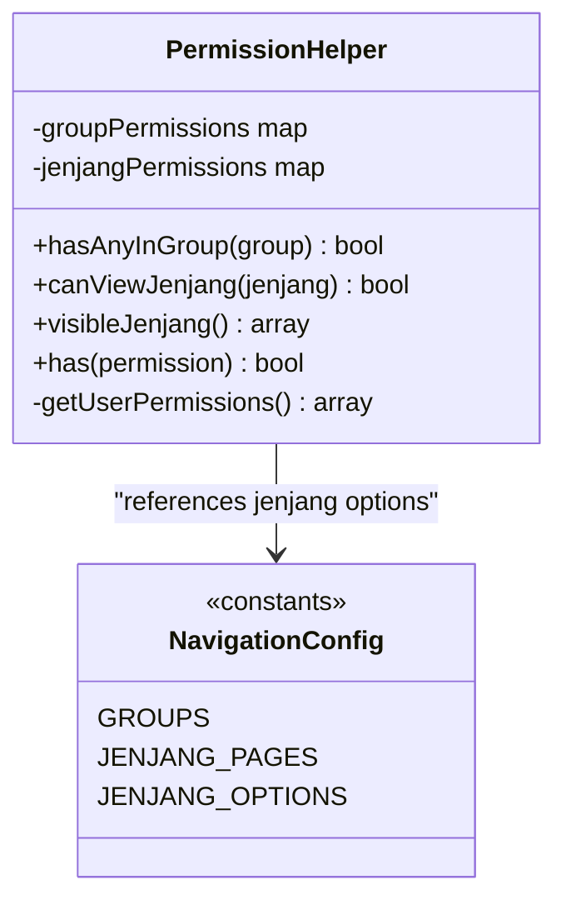
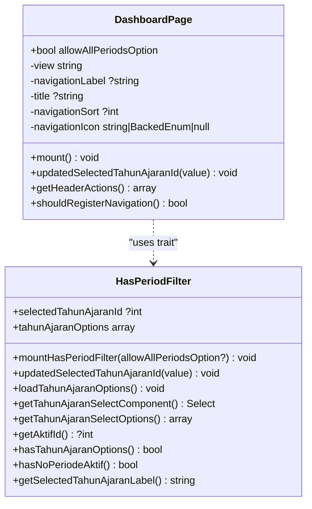
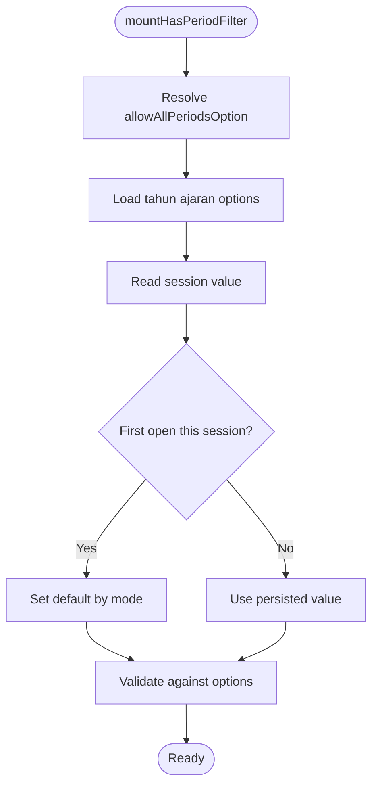
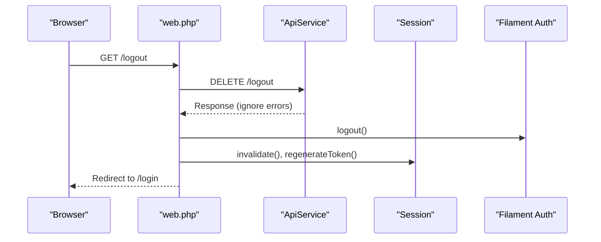
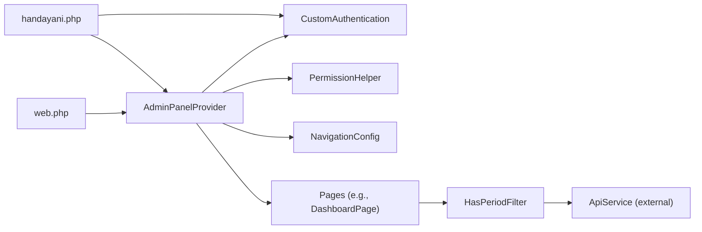

# Custom Page Development

<cite>
**Referenced Files in This Document**
- [AdminPanelProvider.php](file://frontend-v2/app/Providers/Filament/AdminPanelProvider.php)
- [CustomAuthentication.php](file://frontend-v2/app/Http/Middleware/CustomAuthentication.php)
- [DashboardPage.php](file://frontend-v2/app/Filament/Pages/DashboardPage.php)
- [PermissionHelper.php](file://frontend-v2/app/Helpers/PermissionHelper.php)
- [NavigationConfig.php](file://frontend-v2/app/Config/NavigationConfig.php)
- [handayani.php](file://frontend-v2/config/handayani.php)
- [web.php](file://frontend-v2/routes/web.php)
- [HasPeriodFilter.php](file://frontend-v2/app/Livewire/Concerns/HasPeriodFilter.php)
</cite>

## Table of Contents
1. Introduction
2. Project Structure
3. Core Components
4. Architecture Overview
5. Detailed Component Analysis
6. Dependency Analysis
7. Performance Considerations
8. Troubleshooting Guide
9. Conclusion

## Introduction
This document explains how to develop custom pages within the Filament admin panel for this project. It covers page structure, layout composition, component integration patterns, authentication middleware, role-based access controls and permissions, multi-step workflows, tabs/wizard interfaces, external API integrations, routing configuration, URL parameters handling, browser history management, testing strategies, debugging techniques, and performance optimization.

The implementation is based on a Filament Panel configured via a provider, a custom authentication middleware, permission helpers, navigation configuration, and reusable Livewire concerns.

## Project Structure
At a high level:
- The Filament Admin Panel is registered and configured in a single provider that sets up discovery, middleware, branding, user menu, and navigation groups.
- Authentication and authorization are enforced by a custom middleware and helper utilities.
- Pages extend Filament’s base Page class and can use traits/concerns for shared behavior (e.g., period filters).
- Navigation visibility and labels are driven by configuration and permission checks.
- Global routes handle password reset flows and logout.

**Diagram sources**
- [AdminPanelProvider.php:51-135](file://frontend-v2/app/Providers/Filament/AdminPanelProvider.php#L51-L135)
- [CustomAuthentication.php:9-40](file://frontend-v2/app/Http/Middleware/CustomAuthentication.php#L9-L40)
- [NavigationConfig.php:5-49](file://frontend-v2/app/Config/NavigationConfig.php#L5-L49)
- [PermissionHelper.php:5-124](file://frontend-v2/app/Helpers/PermissionHelper.php#L5-L124)
- [DashboardPage.php:10-62](file://frontend-v2/app/Filament/Pages/DashboardPage.php#L10-L62)
- [web.php:7-23](file://frontend-v2/routes/web.php#L7-L23)
- [handayani.php:13-52](file://frontend-v2/config/handayani.php#L13-L52)

**Section sources**
- [AdminPanelProvider.php:51-135](file://frontend-v2/app/Providers/Filament/AdminPanelProvider.php#L51-L135)
- [handayani.php:13-52](file://frontend-v2/config/handayani.php#L13-L52)
- [web.php:7-23](file://frontend-v2/routes/web.php#L7-L23)

## Core Components
- AdminPanelProvider: Registers the default Filament panel, discovers resources/pages/widgets, configures auth middleware, user menu items, render hooks, SPA mode, breadcrumbs, branding, and dynamic navigation groups.
- CustomAuthentication: Enforces session-based token presence, redirects unauthenticated users, and enforces mandatory password change flow. Also gates portal paths when disabled.
- PermissionHelper: Centralized permission checks for navigation group visibility and jenjang-level visibility.
- NavigationConfig: Declares navigation groups, labels, icons, and jenjang-related options.
- DashboardPage: Example Filament Page with mount-time permission check and header actions.
- HasPeriodFilter: Reusable trait providing period selection UI and logic for pages that need a “tahun ajaran” filter.

Key responsibilities:
- Panel registration and global settings live in the provider.
- Access control is split between middleware (auth state) and helpers (permissions).
- Navigation is dynamic and permission-aware.
- Pages compose views and behaviors using traits and Livewire components.

**Section sources**
- [AdminPanelProvider.php:51-135](file://frontend-v2/app/Providers/Filament/AdminPanelProvider.php#L51-L135)
- [CustomAuthentication.php:9-40](file://frontend-v2/app/Http/Middleware/CustomAuthentication.php#L9-L40)
- [PermissionHelper.php:5-124](file://frontend-v2/app/Helpers/PermissionHelper.php#L5-L124)
- [NavigationConfig.php:5-49](file://frontend-v2/app/Config/NavigationConfig.php#L5-L49)
- [DashboardPage.php:10-62](file://frontend-v2/app/Filament/Pages/DashboardPage.php#L10-L62)
- [HasPeriodFilter.php:8-166](file://frontend-v2/app/Livewire/Concerns/HasPeriodFilter.php#L8-L166)

## Architecture Overview
The Filament Admin Panel is bootstrapped through a provider that wires together authentication, navigation, and rendering. Requests pass through the custom authentication middleware before reaching any page or resource. Permissions determine what navigation items are visible and whether a page can be accessed.

**Diagram sources**
- [AdminPanelProvider.php:51-135](file://frontend-v2/app/Providers/Filament/AdminPanelProvider.php#L51-L135)
- [CustomAuthentication.php:9-40](file://frontend-v2/app/Http/Middleware/CustomAuthentication.php#L9-L40)
- [DashboardPage.php:36-44](file://frontend-v2/app/Filament/Pages/DashboardPage.php#L36-L44)
- [web.php:7-23](file://frontend-v2/routes/web.php#L7-L23)

## Detailed Component Analysis

### Admin Panel Provider
Responsibilities:
- Defines the default panel, home URL, login/password reset pages, profile toggle, dark mode, SPA loading, breadcrumbs.
- Discovers Resources, Pages, and Widgets from app directories.
- Configures user menu items (profile link and logout action).
- Builds dynamic navigation grouped by feature areas, with visibility controlled by permissions.
- Applies global middleware stack including CSRF, session, binding substitution, and Filament-specific middleware.
- Integrates database notifications and render hooks for UI enhancements.

Key integration points:
- Uses PermissionHelper to decide group/item visibility.
- Reads feature flags and portal path from handayani.php.
- Sets brand name/logo/favicon/colors via BrandingService.

**Diagram sources**
- [AdminPanelProvider.php:51-135](file://frontend-v2/app/Providers/Filament/AdminPanelProvider.php#L51-L135)
- [PermissionHelper.php:5-124](file://frontend-v2/app/Helpers/PermissionHelper.php#L5-L124)
- [NavigationConfig.php:5-49](file://frontend-v2/app/Config/NavigationConfig.php#L5-L49)

**Section sources**
- [AdminPanelProvider.php:51-135](file://frontend-v2/app/Providers/Filament/AdminPanelProvider.php#L51-L135)
- [handayani.php:13-52](file://frontend-v2/config/handayani.php#L13-L52)

### Authentication Middleware
Responsibilities:
- Blocks portal routes when the portal feature is disabled.
- Requires a session token; otherwise redirects to the Filament login URL.
- Forces a password change if required by session data.

**Diagram sources**
- [CustomAuthentication.php:9-40](file://frontend-v2/app/Http/Middleware/CustomAuthentication.php#L9-L40)

**Section sources**
- [CustomAuthentication.php:9-40](file://frontend-v2/app/Http/Middleware/CustomAuthentication.php#L9-L40)

### Permission Helper and Navigation Visibility
Responsibilities:
- Provides methods to check group-level permissions and jenjang-level visibility.
- Supplies a list of visible jenjang values based on current session permissions.
- Used by the provider to conditionally show navigation groups and items.

**Diagram sources**
- [PermissionHelper.php:5-124](file://frontend-v2/app/Helpers/PermissionHelper.php#L5-L124)
- [NavigationConfig.php:5-49](file://frontend-v2/app/Config/NavigationConfig.php#L5-L49)

**Section sources**
- [PermissionHelper.php:5-124](file://frontend-v2/app/Helpers/PermissionHelper.php#L5-L124)
- [NavigationConfig.php:5-49](file://frontend-v2/app/Config/NavigationConfig.php#L5-L49)

### Example Page: DashboardPage
Responsibilities:
- Extends Filament Page and uses a period filter concern.
- Mount-time permission enforcement for dashboard access.
- Exposes header actions (e.g., refresh).

**Diagram sources**
- [DashboardPage.php:10-62](file://frontend-v2/app/Filament/Pages/DashboardPage.php#L10-L62)
- [HasPeriodFilter.php:8-166](file://frontend-v2/app/Livewire/Concerns/HasPeriodFilter.php#L8-L166)

**Section sources**
- [DashboardPage.php:10-62](file://frontend-v2/app/Filament/Pages/DashboardPage.php#L10-L62)
- [HasPeriodFilter.php:8-166](file://frontend-v2/app/Livewire/Concerns/HasPeriodFilter.php#L8-L166)

### Period Filter Trait: HasPeriodFilter
Responsibilities:
- Loads available academic years from an API endpoint.
- Persists selected period in session and normalizes input values.
- Provides a Filament Select component for period filtering.
- Offers helpers to detect active period and format labels.

**Diagram sources**
- [HasPeriodFilter.php:26-61](file://frontend-v2/app/Livewire/Concerns/HasPeriodFilter.php#L26-L61)

**Section sources**
- [HasPeriodFilter.php:8-166](file://frontend-v2/app/Livewire/Concerns/HasPeriodFilter.php#L8-L166)

### Routing Configuration and Logout Flow
Responsibilities:
- Defines password reset routes mapped to Filament pages.
- Implements a custom logout route that calls backend API, clears session, and redirects to login.

**Diagram sources**
- [web.php:10-22](file://frontend-v2/routes/web.php#L10-L22)

**Section sources**
- [web.php:7-23](file://frontend-v2/routes/web.php#L7-L23)

### Creating Custom Pages
Guidelines:
- Create a new class extending Filament’s base Page class.
- Define metadata such as title, navigation label, icon, sort order, and view path.
- Implement mount() to enforce permissions and initialize dependencies.
- Use traits/concerns for shared behavior (e.g., period filters).
- Register navigation entries via the provider’s navigation builder or rely on auto-discovery if applicable.

Best practices:
- Keep mount() focused on setup and authorization.
- Offload heavy work to services or Livewire components.
- Use session or query parameters consistently for filters.

**Section sources**
- [DashboardPage.php:10-62](file://frontend-v2/app/Filament/Pages/DashboardPage.php#L10-L62)
- [AdminPanelProvider.php:91-191](file://frontend-v2/app/Providers/Filament/AdminPanelProvider.php#L91-L191)

### Layout Composition and Component Integration
Patterns:
- Use Blade views referenced by the page’s $view property.
- Integrate Livewire components directly in Blade views.
- Compose complex layouts using Filament’s schema and form/table builders where appropriate.
- Leverage render hooks in the provider to inject global scripts or components.

Examples:
- Database notifications polling via render hook.
- Pagination loading component inclusion at body end.

**Section sources**
- [AdminPanelProvider.php:112-123](file://frontend-v2/app/Providers/Filament/AdminPanelProvider.php#L112-L123)

### Role-Based Access Controls and Permission Checking
Approach:
- Store permissions in session after login.
- Use PermissionHelper::has() for fine-grained checks in pages/resources.
- Use PermissionHelper::hasAnyInGroup() to control navigation group visibility.
- Enforce per-jenjang visibility using PermissionHelper::canViewJenjang().

Implementation tips:
- Centralize permission mappings in PermissionHelper.
- Reference constants in NavigationConfig for consistent labeling and grouping.

**Section sources**
- [PermissionHelper.php:5-124](file://frontend-v2/app/Helpers/PermissionHelper.php#L5-L124)
- [NavigationConfig.php:5-49](file://frontend-v2/app/Config/NavigationConfig.php#L5-L49)

### Multi-Step Workflows, Tabs, and Wizard Interfaces
Recommendations:
- Use Livewire components to manage step state and validation across steps.
- For wizard-like flows, maintain step index in component properties and persist to session if needed.
- Use Filament forms/schemas per step and aggregate results before submission.
- Provide clear navigation between steps and summary previews.

[No sources needed since this section provides general guidance]

### Integrating External APIs
Patterns:
- Use a dedicated service client (e.g., ApiService) to call backend endpoints.
- Handle network errors gracefully and provide fallback states.
- Cache static or infrequently changing data (e.g., academic years) in session or cache layers.

Example usage:
- Loading academic year options in HasPeriodFilter.

**Section sources**
- [HasPeriodFilter.php:81-93](file://frontend-v2/app/Livewire/Concerns/HasPeriodFilter.php#L81-L93)

### Routing Configuration, URL Parameters, and Browser History
- Filament pages are discovered automatically; you can also register explicit routes for special cases (e.g., password reset).
- Use query parameters for filters (e.g., jenjang) and keep them in sync with navigation isActiveWhen conditions.
- Persist important filters in session to survive full reloads while allowing URL-driven sharing when appropriate.

**Section sources**
- [AdminPanelProvider.php:166-188](file://frontend-v2/app/Providers/Filament/AdminPanelProvider.php#L166-L188)
- [web.php:7-23](file://frontend-v2/routes/web.php#L7-L23)

### Testing Custom Pages
Strategies:
- Feature tests: Assert navigation visibility based on permissions and ensure protected routes redirect appropriately.
- Unit tests: Test PermissionHelper methods and navigation configuration constants.
- Livewire tests: Interact with multi-step flows and verify state transitions and validations.
- API tests: Mock external calls and validate error handling paths.

[No sources needed since this section provides general guidance]

### Debugging Techniques
- Enable detailed logging around API calls and permission checks.
- Inspect session contents during development to verify tokens and permissions.
- Use Filament’s built-in debugging tools and Laravel Telescope if available.
- Add temporary logs in mount() and updated* hooks to trace reactivity.

[No sources needed since this section provides general guidance]

### Performance Optimization Strategies
- Minimize API calls by caching reference data (e.g., academic years) in session or cache.
- Defer heavy computations to background jobs where possible.
- Use pagination and server-side filtering for large datasets.
- Avoid unnecessary re-renders in Livewire by keeping state minimal and using wire:model.lazy where suitable.

[No sources needed since this section provides general guidance]

## Dependency Analysis
The following diagram shows key runtime dependencies among core components.

**Diagram sources**
- [AdminPanelProvider.php:51-135](file://frontend-v2/app/Providers/Filament/AdminPanelProvider.php#L51-L135)
- [CustomAuthentication.php:9-40](file://frontend-v2/app/Http/Middleware/CustomAuthentication.php#L9-L40)
- [PermissionHelper.php:5-124](file://frontend-v2/app/Helpers/PermissionHelper.php#L5-L124)
- [NavigationConfig.php:5-49](file://frontend-v2/app/Config/NavigationConfig.php#L5-L49)
- [DashboardPage.php:10-62](file://frontend-v2/app/Filament/Pages/DashboardPage.php#L10-L62)
- [HasPeriodFilter.php:8-166](file://frontend-v2/app/Livewire/Concerns/HasPeriodFilter.php#L8-L166)
- [web.php:7-23](file://frontend-v2/routes/web.php#L7-L23)
- [handayani.php:13-52](file://frontend-v2/config/handayani.php#L13-L52)

**Section sources**
- [AdminPanelProvider.php:51-135](file://frontend-v2/app/Providers/Filament/AdminPanelProvider.php#L51-L135)
- [PermissionHelper.php:5-124](file://frontend-v2/app/Helpers/PermissionHelper.php#L5-L124)
- [NavigationConfig.php:5-49](file://frontend-v2/app/Config/NavigationConfig.php#L5-L49)
- [DashboardPage.php:10-62](file://frontend-v2/app/Filament/Pages/DashboardPage.php#L10-L62)
- [HasPeriodFilter.php:8-166](file://frontend-v2/app/Livewire/Concerns/HasPeriodFilter.php#L8-L166)
- [web.php:7-23](file://frontend-v2/routes/web.php#L7-L23)
- [handayani.php:13-52](file://frontend-v2/config/handayani.php#L13-L52)

## Performance Considerations
- Prefer server-side filtering and pagination for large tables.
- Cache reference data used frequently across pages (e.g., academic years).
- Reduce reactivity overhead by limiting live updates to necessary fields.
- Use background jobs for long-running operations like exports or imports.

[No sources needed since this section provides general guidance]

## Troubleshooting Guide
Common issues and resolutions:
- Unauthenticated redirects: Ensure session contains the expected token and that the middleware is applied to the panel.
- Password change loop: Verify must_change_password flag and that the change-password route is accessible.
- Navigation not showing: Confirm permissions exist in session and match PermissionHelper mappings.
- Period filter not updating: Check API response shape and that updated handlers trigger data refresh.

**Section sources**
- [CustomAuthentication.php:9-40](file://frontend-v2/app/Http/Middleware/CustomAuthentication.php#L9-L40)
- [PermissionHelper.php:5-124](file://frontend-v2/app/Helpers/PermissionHelper.php#L5-L124)
- [HasPeriodFilter.php:81-93](file://frontend-v2/app/Livewire/Concerns/HasPeriodFilter.php#L81-L93)

## Conclusion
By centralizing authentication and permissions, leveraging configurable navigation, and composing pages with reusable traits and Livewire components, the project provides a robust foundation for building scalable custom pages in the Filament admin panel. Follow the patterns outlined here to implement secure, testable, and performant features while maintaining consistency across the application.