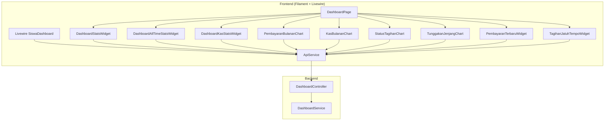
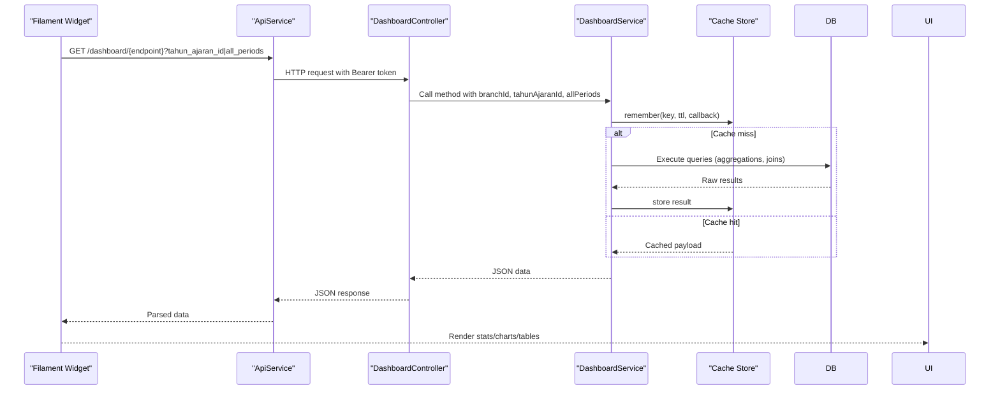
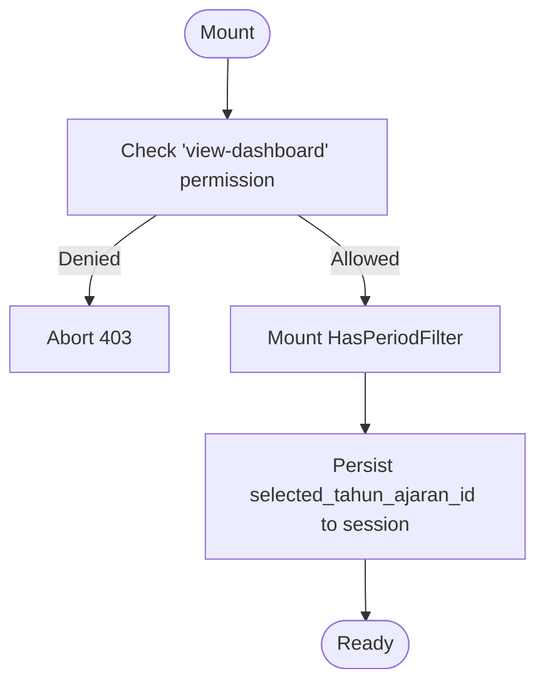
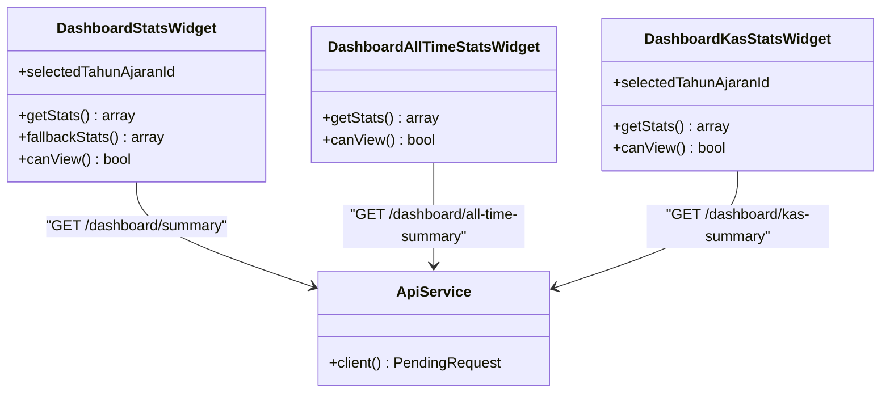
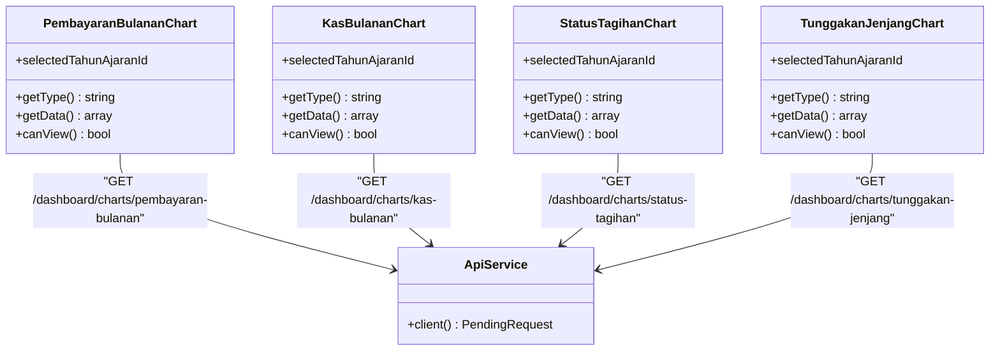
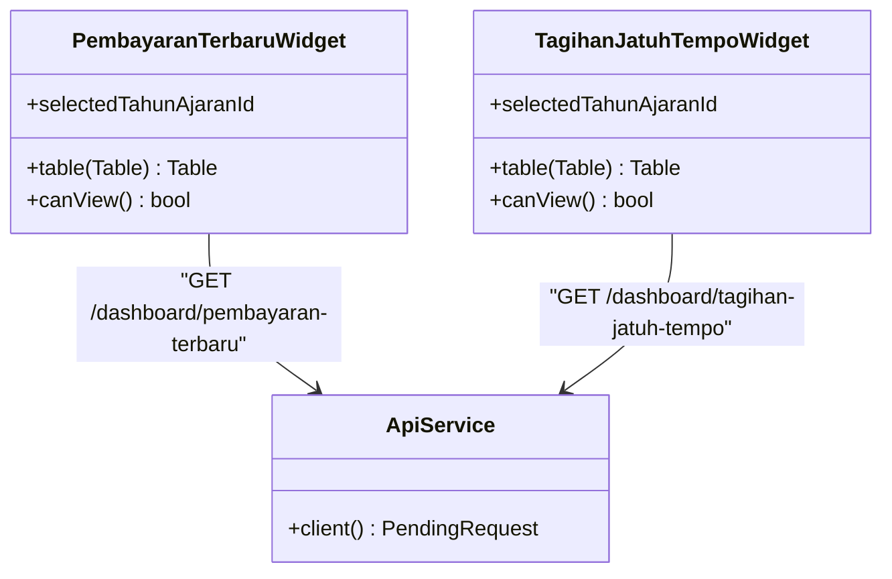
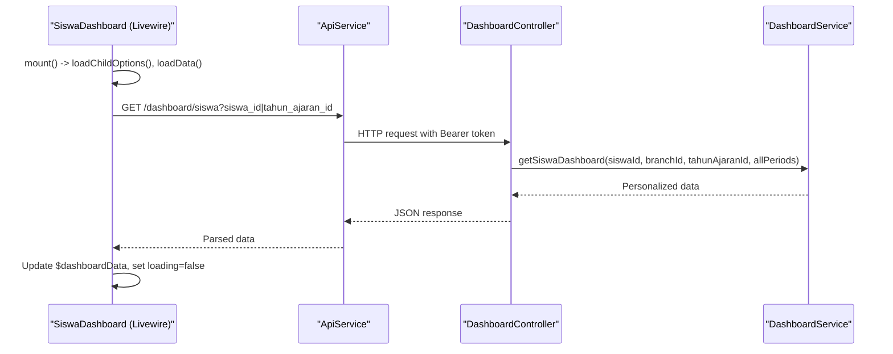
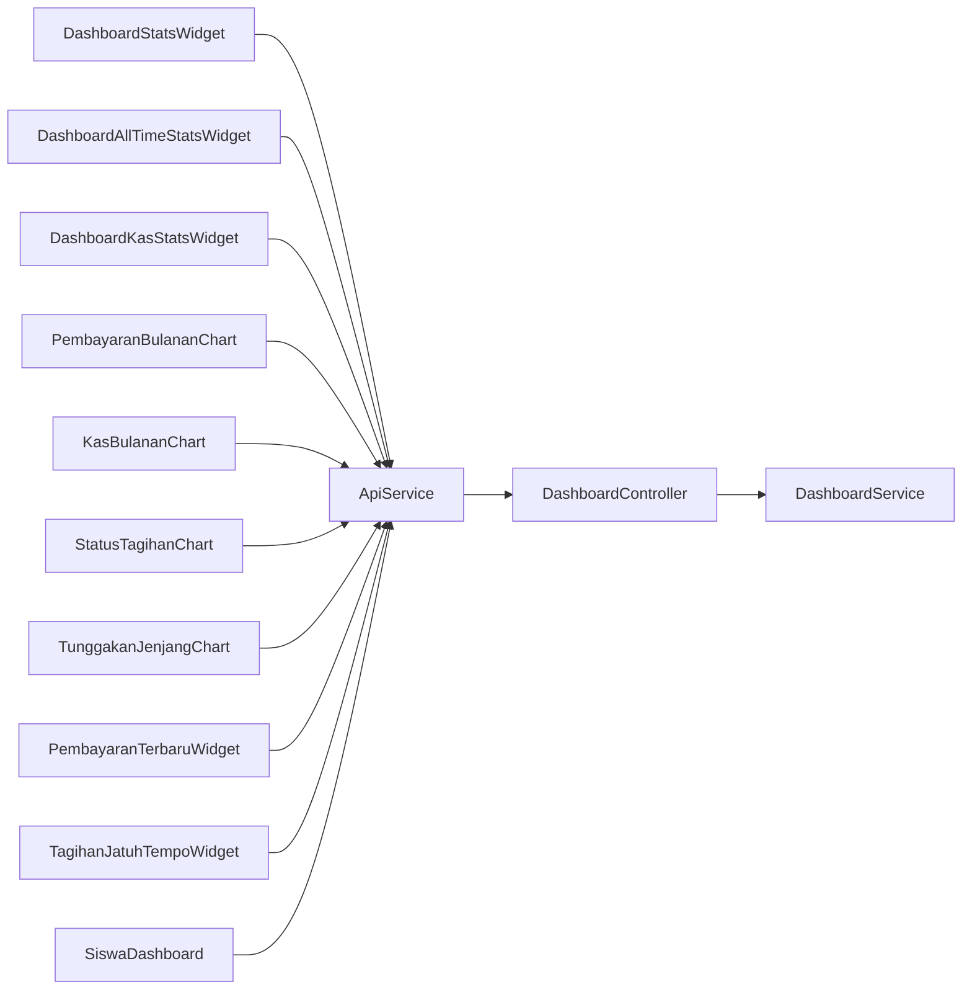

# Dashboard & Statistics Widgets

<cite>
**Referenced Files in This Document**
- [DashboardPage.php](file://frontend-v2/app/Filament/Pages/DashboardPage.php)
- [DashboardStatsWidget.php](file://frontend-v2/app/Filament/Widgets/DashboardStatsWidget.php)
- [DashboardAllTimeStatsWidget.php](file://frontend-v2/app/Filament/Widgets/DashboardAllTimeStatsWidget.php)
- [DashboardKasStatsWidget.php](file://frontend-v2/app/Filament/Widgets/DashboardKasStatsWidget.php)
- [PembayaranBulananChart.php](file://frontend-v2/app/Filament/Widgets/PembayaranBulananChart.php)
- [KasBulananChart.php](file://frontend-v2/app/Filament/Widgets/KasBulananChart.php)
- [StatusTagihanChart.php](file://frontend-v2/app/Filament/Widgets/StatusTagihanChart.php)
- [TunggakanJenjangChart.php](file://frontend-v2/app/Filament/Widgets/TunggakanJenjangChart.php)
- [PembayaranTerbaruWidget.php](file://frontend-v2/app/Filament/Widgets/PembayaranTerbaruWidget.php)
- [TagihanJatuhTempoWidget.php](file://frontend-v2/app/Filament/Widgets/TagihanJatuhTempoWidget.php)
- [SiswaDashboard.php](file://frontend-v2/app/Livewire/SiswaDashboard.php)
- [ApiService.php](file://frontend-v2/app/Services/ApiService.php)
- [DashboardController.php](file://backend/app/Http/Controllers/DashboardController.php)
- [DashboardService.php](file://backend/app/Services/DashboardService.php)
</cite>

## Table of Contents
1. Introduction
2. Project Structure
3. Core Components
4. Architecture Overview
5. Detailed Component Analysis
6. Dependency Analysis
7. Performance Considerations
8. Troubleshooting Guide
9. Conclusion

## Introduction
This document explains the dashboard and statistics widgets implemented with Filament and Livewire, including real-time data updates via API calls, chart visualizations, and performance optimization techniques. It covers:
- Stats overview widgets (period and all-time)
- Monthly charts (payments, cash flow)
- Payment status indicators (pie/doughnut)
- Student enrollment metrics and personal student dashboard
- Custom widget creation patterns
- Data caching strategies and large dataset handling
- Responsive design considerations for mobile-friendly layouts

## Project Structure
The dashboard is composed of:
- A Filament page that hosts widgets and provides period filtering
- Stats overview widgets for KPIs
- Chart widgets for monthly trends and distributions
- Table widgets for recent payments and upcoming due items
- A Livewire component for the student portal dashboard
- Backend controllers and services providing cached JSON APIs

**Diagram sources**
- [DashboardPage.php:1-62](file://frontend-v2/app/Filament/Pages/DashboardPage.php#L1-L62)
- [DashboardStatsWidget.php:1-106](file://frontend-v2/app/Filament/Widgets/DashboardStatsWidget.php#L1-L106)
- [DashboardAllTimeStatsWidget.php:1-50](file://frontend-v2/app/Filament/Widgets/DashboardAllTimeStatsWidget.php#L1-L50)
- [DashboardKasStatsWidget.php:1-57](file://frontend-v2/app/Filament/Widgets/DashboardKasStatsWidget.php#L1-L57)
- [PembayaranBulananChart.php:1-59](file://frontend-v2/app/Filament/Widgets/PembayaranBulananChart.php#L1-L59)
- [KasBulananChart.php:1-67](file://frontend-v2/app/Filament/Widgets/KasBulananChart.php#L1-L67)
- [StatusTagihanChart.php:1-57](file://frontend-v2/app/Filament/Widgets/StatusTagihanChart.php#L1-L57)
- [TunggakanJenjangChart.php:1-57](file://frontend-v2/app/Filament/Widgets/TunggakanJenjangChart.php#L1-L57)
- [PembayaranTerbaruWidget.php:1-71](file://frontend-v2/app/Filament/Widgets/PembayaranTerbaruWidget.php#L1-L71)
- [TagihanJatuhTempoWidget.php:1-70](file://frontend-v2/app/Filament/Widgets/TagihanJatuhTempoWidget.php#L1-L70)
- [SiswaDashboard.php:1-77](file://frontend-v2/app/Livewire/SiswaDashboard.php#L1-L77)
- [ApiService.php:1-25](file://frontend-v2/app/Services/ApiService.php#L1-L25)
- [DashboardController.php:1-303](file://backend/app/Http/Controllers/DashboardController.php#L1-L303)
- [DashboardService.php:1-711](file://backend/app/Services/DashboardService.php#L1-L711)

**Section sources**
- [DashboardPage.php:1-62](file://frontend-v2/app/Filament/Pages/DashboardPage.php#L1-L62)
- [ApiService.php:1-25](file://frontend-v2/app/Services/ApiService.php#L1-L25)

## Core Components
- Stats overview widgets:
  - Period-based summary (total invoices, paid, outstanding, students with invoices, students with arrears, settlement percentage)
  - All-time summary (accumulated invoices, income, expenses)
  - Cash summary (income, expenses, balance for selected period)
- Charts:
  - Monthly payments bar chart
  - Monthly cash flow line chart (income vs expense)
  - Invoice status pie chart
  - Arrears by education level doughnut chart
- Tables:
  - Recent payments table
  - Upcoming due invoices within 7 days
- Livewire student dashboard:
  - Personalized totals, invoice list, and recent payments with error handling and loading states

Key implementation notes:
- Widgets share a common pattern: read optional period filter from state, call ApiService to fetch JSON, map to Filament structures, and provide fallbacks on errors.
- The student dashboard uses Livewire to load data, handle connection errors, and update UI reactively.

**Section sources**
- [DashboardStatsWidget.php:1-106](file://frontend-v2/app/Filament/Widgets/DashboardStatsWidget.php#L1-L106)
- [DashboardAllTimeStatsWidget.php:1-50](file://frontend-v2/app/Filament/Widgets/DashboardAllTimeStatsWidget.php#L1-L50)
- [DashboardKasStatsWidget.php:1-57](file://frontend-v2/app/Filament/Widgets/DashboardKasStatsWidget.php#L1-L57)
- [PembayaranBulananChart.php:1-59](file://frontend-v2/app/Filament/Widgets/PembayaranBulananChart.php#L1-L59)
- [KasBulananChart.php:1-67](file://frontend-v2/app/Filament/Widgets/KasBulananChart.php#L1-L67)
- [StatusTagihanChart.php:1-57](file://frontend-v2/app/Filament/Widgets/StatusTagihanChart.php#L1-L57)
- [TunggakanJenjangChart.php:1-57](file://frontend-v2/app/Filament/Widgets/TunggakanJenjangChart.php#L1-L57)
- [PembayaranTerbaruWidget.php:1-71](file://frontend-v2/app/Filament/Widgets/PembayaranTerbaruWidget.php#L1-L71)
- [TagihanJatuhTempoWidget.php:1-70](file://frontend-v2/app/Filament/Widgets/TagihanJatuhTempoWidget.php#L1-L70)
- [SiswaDashboard.php:1-77](file://frontend-v2/app/Livewire/SiswaDashboard.php#L1-L77)

## Architecture Overview
End-to-end request flow from Filament widgets to backend service and cache:

**Diagram sources**
- [ApiService.php:1-25](file://frontend-v2/app/Services/ApiService.php#L1-L25)
- [DashboardController.php:1-303](file://backend/app/Http/Controllers/DashboardController.php#L1-L303)
- [DashboardService.php:1-711](file://backend/app/Services/DashboardService.php#L1-L711)

## Detailed Component Analysis

### Filament Page and Period Filter
- The dashboard page enforces permissions, mounts a period filter, and persists the selected academic year into session so widgets can use it.
- Header actions include a refresh action; navigation is hidden for this page.

**Diagram sources**
- [DashboardPage.php:1-62](file://frontend-v2/app/Filament/Pages/DashboardPage.php#L1-L62)

**Section sources**
- [DashboardPage.php:1-62](file://frontend-v2/app/Filament/Pages/DashboardPage.php#L1-L62)

### Stats Overview Widgets
- Period-based summary widget:
  - Reads optional tahun ajaran id, calls summary endpoint, maps to Stat objects, and returns fallback values on failure.
- All-time summary widget:
  - Calls all-time summary endpoint and displays accumulated figures.
- Cash summary widget:
  - Calls kas-summary endpoint and computes balance if missing.

**Diagram sources**
- [DashboardStatsWidget.php:1-106](file://frontend-v2/app/Filament/Widgets/DashboardStatsWidget.php#L1-L106)
- [DashboardAllTimeStatsWidget.php:1-50](file://frontend-v2/app/Filament/Widgets/DashboardAllTimeStatsWidget.php#L1-L50)
- [DashboardKasStatsWidget.php:1-57](file://frontend-v2/app/Filament/Widgets/DashboardKasStatsWidget.php#L1-L57)
- [ApiService.php:1-25](file://frontend-v2/app/Services/ApiService.php#L1-L25)

**Section sources**
- [DashboardStatsWidget.php:1-106](file://frontend-v2/app/Filament/Widgets/DashboardStatsWidget.php#L1-L106)
- [DashboardAllTimeStatsWidget.php:1-50](file://frontend-v2/app/Filament/Widgets/DashboardAllTimeStatsWidget.php#L1-L50)
- [DashboardKasStatsWidget.php:1-57](file://frontend-v2/app/Filament/Widgets/DashboardKasStatsWidget.php#L1-L57)

### Monthly Charts
- Monthly payments bar chart:
  - Fetches monthly totals and renders datasets with labels.
- Monthly cash flow line chart:
  - Fetches income vs expense per month and renders two series.
- Invoice status pie chart:
  - Aggregates counts by status and renders a pie dataset.
- Arrears by education level doughnut chart:
  - Aggregates total arrears per jenjang and renders a doughnut dataset.

**Diagram sources**
- [PembayaranBulananChart.php:1-59](file://frontend-v2/app/Filament/Widgets/PembayaranBulananChart.php#L1-L59)
- [KasBulananChart.php:1-67](file://frontend-v2/app/Filament/Widgets/KasBulananChart.php#L1-L67)
- [StatusTagihanChart.php:1-57](file://frontend-v2/app/Filament/Widgets/StatusTagihanChart.php#L1-L57)
- [TunggakanJenjangChart.php:1-57](file://frontend-v2/app/Filament/Widgets/TunggakanJenjangChart.php#L1-L57)
- [ApiService.php:1-25](file://frontend-v2/app/Services/ApiService.php#L1-L25)

**Section sources**
- [PembayaranBulananChart.php:1-59](file://frontend-v2/app/Filament/Widgets/PembayaranBulananChart.php#L1-L59)
- [KasBulananChart.php:1-67](file://frontend-v2/app/Filament/Widgets/KasBulananChart.php#L1-L67)
- [StatusTagihanChart.php:1-57](file://frontend-v2/app/Filament/Widgets/StatusTagihanChart.php#L1-L57)
- [TunggakanJenjangChart.php:1-57](file://frontend-v2/app/Filament/Widgets/TunggakanJenjangChart.php#L1-L57)

### Table Widgets
- Recent payments table:
  - Fetches last 5 payments and renders columns with formatting.
- Upcoming due invoices within 7 days:
  - Fetches due invoices and renders status badges.

**Diagram sources**
- [PembayaranTerbaruWidget.php:1-71](file://frontend-v2/app/Filament/Widgets/PembayaranTerbaruWidget.php#L1-L71)
- [TagihanJatuhTempoWidget.php:1-70](file://frontend-v2/app/Filament/Widgets/TagihanJatuhTempoWidget.php#L1-L70)
- [ApiService.php:1-25](file://frontend-v2/app/Services/ApiService.php#L1-L25)

**Section sources**
- [PembayaranTerbaruWidget.php:1-71](file://frontend-v2/app/Filament/Widgets/PembayaranTerbaruWidget.php#L1-L71)
- [TagihanJatuhTempoWidget.php:1-70](file://frontend-v2/app/Filament/Widgets/TagihanJatuhTempoWidget.php#L1-L70)

### Livewire Student Dashboard
- Loads child options for wali users, fetches personalized dashboard data, handles connection and unexpected errors, and toggles loading state.

**Diagram sources**
- [SiswaDashboard.php:1-77](file://frontend-v2/app/Livewire/SiswaDashboard.php#L1-L77)
- [ApiService.php:1-25](file://frontend-v2/app/Services/ApiService.php#L1-L25)
- [DashboardController.php:206-301](file://backend/app/Http/Controllers/DashboardController.php#L206-L301)
- [DashboardService.php:607-709](file://backend/app/Services/DashboardService.php#L607-L709)

**Section sources**
- [SiswaDashboard.php:1-77](file://frontend-v2/app/Livewire/SiswaDashboard.php#L1-L77)

## Dependency Analysis
- Frontend components depend on ApiService for authenticated HTTP requests.
- Widgets and Livewire components rely on consistent query parameters for period filtering.
- Backend controller methods delegate to DashboardService which centralizes caching and aggregation logic.

**Diagram sources**
- [DashboardStatsWidget.php:1-106](file://frontend-v2/app/Filament/Widgets/DashboardStatsWidget.php#L1-L106)
- [DashboardAllTimeStatsWidget.php:1-50](file://frontend-v2/app/Filament/Widgets/DashboardAllTimeStatsWidget.php#L1-L50)
- [DashboardKasStatsWidget.php:1-57](file://frontend-v2/app/Filament/Widgets/DashboardKasStatsWidget.php#L1-L57)
- [PembayaranBulananChart.php:1-59](file://frontend-v2/app/Filament/Widgets/PembayaranBulananChart.php#L1-L59)
- [KasBulananChart.php:1-67](file://frontend-v2/app/Filament/Widgets/KasBulananChart.php#L1-L67)
- [StatusTagihanChart.php:1-57](file://frontend-v2/app/Filament/Widgets/StatusTagihanChart.php#L1-L57)
- [TunggakanJenjangChart.php:1-57](file://frontend-v2/app/Filament/Widgets/TunggakanJenjangChart.php#L1-L57)
- [PembayaranTerbaruWidget.php:1-71](file://frontend-v2/app/Filament/Widgets/PembayaranTerbaruWidget.php#L1-L71)
- [TagihanJatuhTempoWidget.php:1-70](file://frontend-v2/app/Filament/Widgets/TagihanJatuhTempoWidget.php#L1-L70)
- [SiswaDashboard.php:1-77](file://frontend-v2/app/Livewire/SiswaDashboard.php#L1-L77)
- [ApiService.php:1-25](file://frontend-v2/app/Services/ApiService.php#L1-L25)
- [DashboardController.php:1-303](file://backend/app/Http/Controllers/DashboardController.php#L1-L303)
- [DashboardService.php:1-711](file://backend/app/Services/DashboardService.php#L1-L711)

**Section sources**
- [ApiService.php:1-25](file://frontend-v2/app/Services/ApiService.php#L1-L25)
- [DashboardController.php:1-303](file://backend/app/Http/Controllers/DashboardController.php#L1-L303)
- [DashboardService.php:1-711](file://backend/app/Services/DashboardService.php#L1-L711)

## Performance Considerations
- Server-side caching:
  - DashboardService caches responses with a TTL and keys scoped by branch and academic year.
  - Dedicated invalidation helpers clear specific endpoints or all dashboard caches when data changes.
- Query optimizations:
  - Aggregations are performed at the database layer using GROUP BY and SUM/COUNT.
  - Period filters are applied consistently across endpoints to avoid unnecessary scans.
- Client-side resilience:
  - Widgets return empty datasets or fallback stats on API failures.
  - Livewire component logs errors and notifies users on connection issues.
- Large dataset handling:
  - Use LIMIT clauses where applicable (e.g., top lists, recent payments).
  - Prefer aggregated views over fetching raw rows.
- Real-time updates:
  - For true real-time behavior, consider polling intervals or WebSockets; currently, widgets refresh on user interactions or page reloads.

[No sources needed since this section provides general guidance]

## Troubleshooting Guide
Common issues and resolutions:
- Permission denied on dashboard:
  - Ensure the user has the required permission; the page aborts if not present.
- Empty or zeroed stats:
  - Verify API availability and network connectivity; widgets fall back to zeros on errors.
- Incorrect period data:
  - Confirm the selected academic year is persisted in session and passed as a parameter.
- Stale cache after data changes:
  - Trigger cache invalidation for affected endpoints or wait for TTL expiry.
- Livewire connection errors:
  - Check server logs and ensure the API URL and token are configured correctly.

**Section sources**
- [DashboardPage.php:36-44](file://frontend-v2/app/Filament/Pages/DashboardPage.php#L36-L44)
- [DashboardStatsWidget.php:21-31](file://frontend-v2/app/Filament/Widgets/DashboardStatsWidget.php#L21-L31)
- [SiswaDashboard.php:43-65](file://frontend-v2/app/Livewire/SiswaDashboard.php#L43-L65)
- [DashboardService.php:60-107](file://backend/app/Services/DashboardService.php#L60-L107)

## Conclusion
The dashboard integrates Filament widgets and Livewire components with a robust backend service that emphasizes caching, consistent period filtering, and resilient client-side rendering. By following the provided patterns, you can create custom widgets, implement efficient data retrieval, and maintain responsive, mobile-friendly dashboards.

[No sources needed since this section summarizes without analyzing specific files]