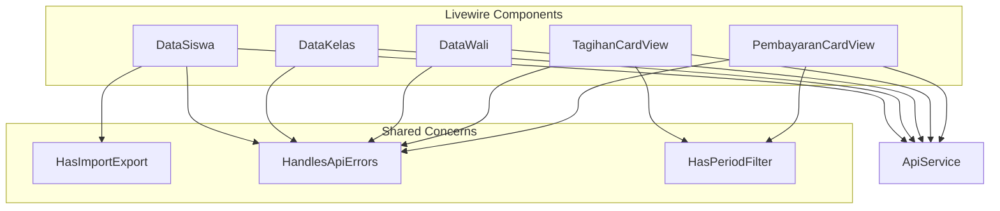
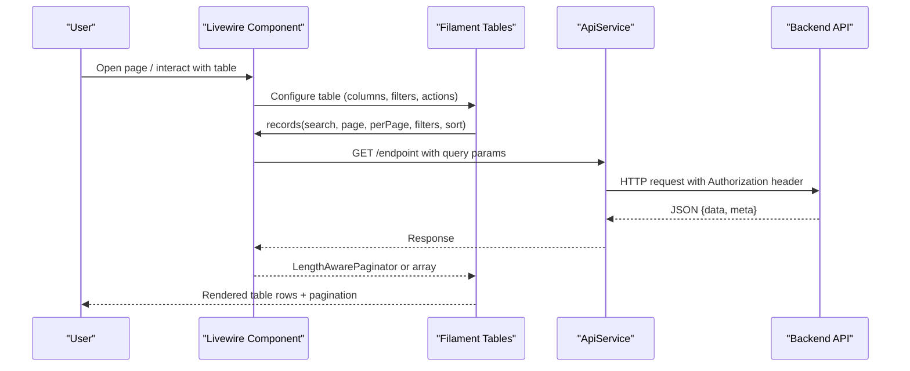
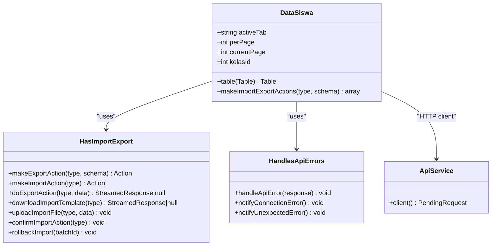
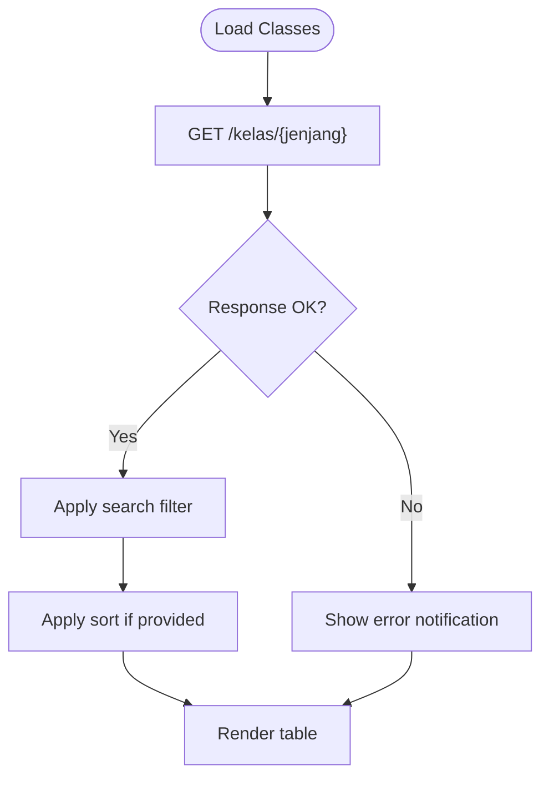
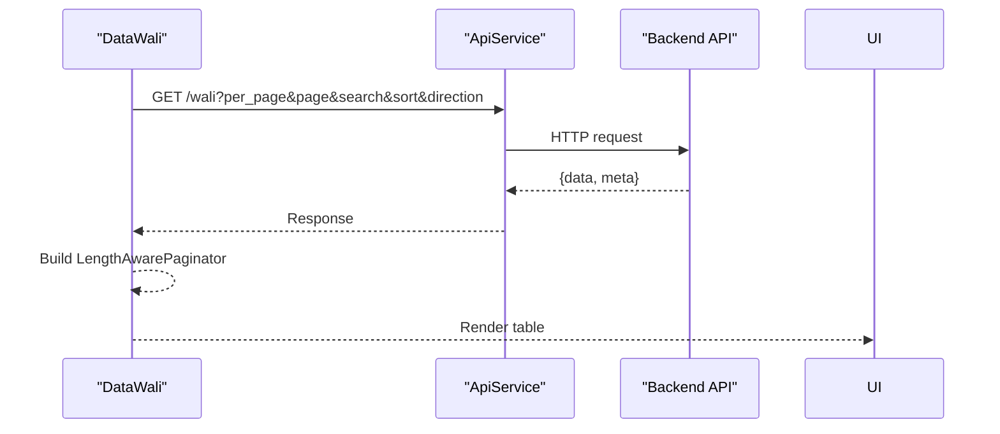
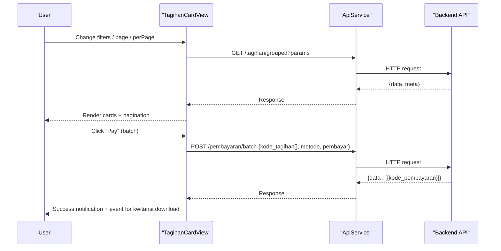
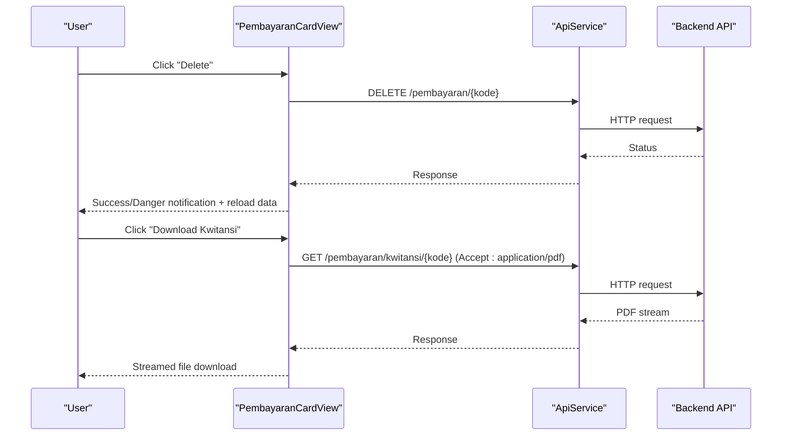
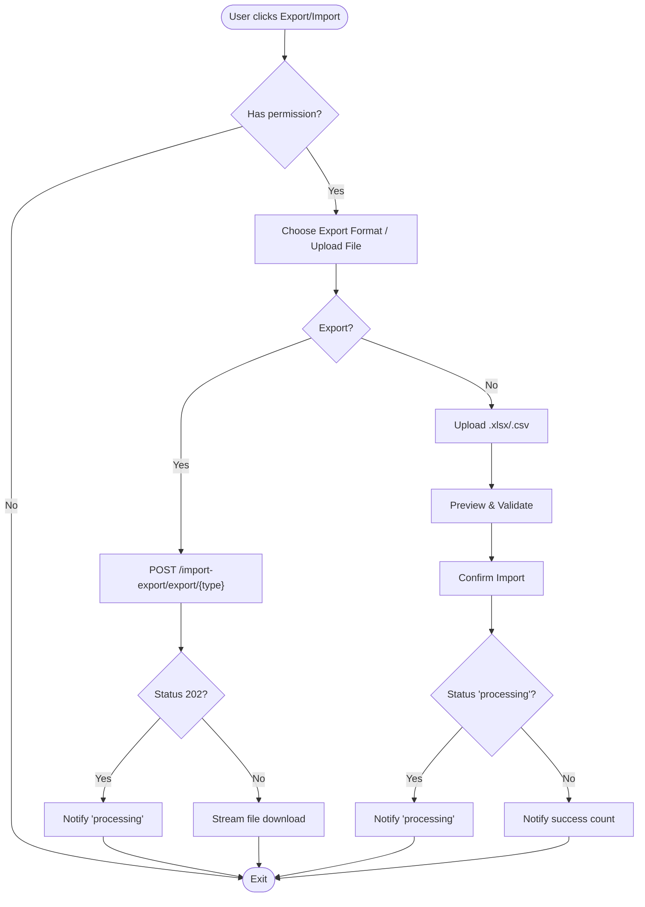
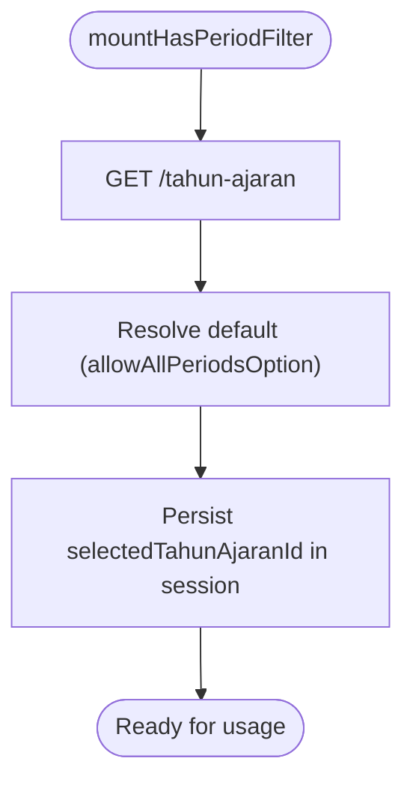
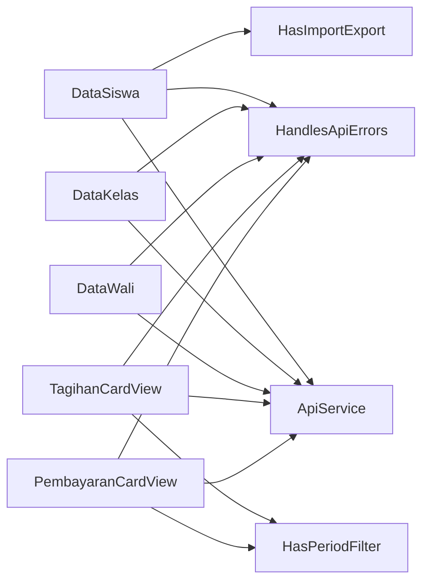

# Data Management Tables

<cite>
**Referenced Files in This Document**
- [DataSiswa.php](file://frontend-v2/app/Livewire/DataSiswa.php)
- [DataKelas.php](file://frontend-v2/app/Livewire/DataKelas.php)
- [DataWali.php](file://frontend-v2/app/Livewire/DataWali.php)
- [TagihanCardView.php](file://frontend-v2/app/Livewire/TagihanCardView.php)
- [PembayaranCardView.php](file://frontend-v2/app/Livewire/PembayaranCardView.php)
- [HasImportExport.php](file://frontend-v2/app/Livewire/Concerns/HasImportExport.php)
- [HandlesApiErrors.php](file://frontend-v2/app/Livewire/Concerns/HandlesApiErrors.php)
- [HasPeriodFilter.php](file://frontend-v2/app/Livewire/Concerns/HasPeriodFilter.php)
- [ApiService.php](file://frontend-v2/app/Services/ApiService.php)
- [livewire-tables.php](file://frontend-v2/config/livewire-tables.php)
</cite>

## Table of Contents
1. Introduction
2. Project Structure
3. Core Components
4. Architecture Overview
5. Detailed Component Analysis
6. Dependency Analysis
7. Performance Considerations
8. Troubleshooting Guide
9. Conclusion

## Introduction
This document explains how data management tables and card views are implemented using Livewire components with Filament Tables, Actions, Schemas, and a shared API client. It covers advanced filtering, sorting, pagination, bulk operations, import/export integration, error handling patterns, and API communication strategies. It also provides guidance for creating custom table columns, action buttons, modal dialogs, search functionality, column visibility toggles, export formats, performance optimization for large datasets, lazy loading techniques, and memory management.

## Project Structure
The data management features are primarily implemented in the frontend-v2 Livewire layer:
- Table-based CRUD pages (e.g., students, classes, parents) use Filament Tables with server-side pagination and remote records.
- Card view pages (e.g., invoices, payments) implement custom pagination and filters with manual API calls.
- Shared concerns provide reusable behaviors such as import/export, API error handling, and period filter management.
- A centralized API service configures HTTP requests with authentication headers and base URL.

**Diagram sources**
- [DataSiswa.php](file://frontend-v2/app/Livewire/DataSiswa.php)
- [DataKelas.php](file://frontend-v2/app/Livewire/DataKelas.php)
- [DataWali.php](file://frontend-v2/app/Livewire/DataWali.php)
- [TagihanCardView.php](file://frontend-v2/app/Livewire/TagihanCardView.php)
- [PembayaranCardView.php](file://frontend-v2/app/Livewire/PembayaranCardView.php)
- [HasImportExport.php](file://frontend-v2/app/Livewire/Concerns/HasImportExport.php)
- [HandlesApiErrors.php](file://frontend-v2/app/Livewire/Concerns/HandlesApiErrors.php)
- [HasPeriodFilter.php](file://frontend-v2/app/Livewire/Concerns/HasPeriodFilter.php)
- [ApiService.php](file://frontend-v2/app/Services/ApiService.php)

**Section sources**
- [DataSiswa.php](file://frontend-v2/app/Livewire/DataSiswa.php)
- [DataKelas.php](file://frontend-v2/app/Livewire/DataKelas.php)
- [DataWali.php](file://frontend-v2/app/Livewire/DataWali.php)
- [TagihanCardView.php](file://frontend-v2/app/Livewire/TagihanCardView.php)
- [PembayaranCardView.php](file://frontend-v2/app/Livewire/PembayaranCardView.php)
- [HasImportExport.php](file://frontend-v2/app/Livewire/Concerns/HasImportExport.php)
- [HandlesApiErrors.php](file://frontend-v2/app/Livewire/Concerns/HandlesApiErrors.php)
- [HasPeriodFilter.php](file://frontend-v2/app/Livewire/Concerns/HasPeriodFilter.php)
- [ApiService.php](file://frontend-v2/app/Services/ApiService.php)

## Core Components
- DataSiswa: Server-side paginated table with remote records, multi-select filters, sortable/searchable columns, row actions (view, update via wizard, delete), bulk delete, and integrated import/export header actions.
- DataKelas: Simple table with local search/sort over fetched data, create/update/delete row actions, and bulk delete.
- DataWali: Server-side paginated table with remote records, sortable/searchable columns, row actions (view, update, delete), bulk delete, and add action.
- TagihanCardView: Card view with search, class/status/due date filters, per-page control, manual pagination, batch payment modal, installment payment modal, PDF export, and kwitansi download.
- PembayaranCardView: Card view with search, class/method filters, per-page control, manual pagination, delete confirmation, and kwitansi download.
- HasImportExport: Reusable import/export workflow including template download, upload preview, confirm import, background processing support, rollback, and export streaming.
- HandlesApiErrors: Centralized error extraction and user-friendly notifications for connection and unexpected errors.
- HasPeriodFilter: Year-of-study selection with session persistence, active period detection, and automatic data refresh on change.
- ApiService: Pre-configured HTTP client with Authorization Bearer token and base URL.

**Section sources**
- [DataSiswa.php](file://frontend-v2/app/Livewire/DataSiswa.php)
- [DataKelas.php](file://frontend-v2/app/Livewire/DataKelas.php)
- [DataWali.php](file://frontend-v2/app/Livewire/DataWali.php)
- [TagihanCardView.php](file://frontend-v2/app/Livewire/TagihanCardView.php)
- [PembayaranCardView.php](file://frontend-v2/app/Livewire/PembayaranCardView.php)
- [HasImportExport.php](file://frontend-v2/app/Livewire/Concerns/HasImportExport.php)
- [HandlesApiErrors.php](file://frontend-v2/app/Livewire/Concerns/HandlesApiErrors.php)
- [HasPeriodFilter.php](file://frontend-v2/app/Livewire/Concerns/HasPeriodFilter.php)
- [ApiService.php](file://frontend-v2/app/Services/ApiService.php)

## Architecture Overview
The UI is composed of Livewire components that call a shared API client to fetch or mutate data. Filament Tables handle pagination, sorting, and filtering either by delegating to the backend (server-side) or by performing client-side operations after fetching all records. Import/export flows integrate with the same API endpoints and return streamed responses or async job acknowledgements.

**Diagram sources**
- [DataSiswa.php](file://frontend-v2/app/Livewire/DataSiswa.php)
- [DataWali.php](file://frontend-v2/app/Livewire/DataWali.php)
- [ApiService.php](file://frontend-v2/app/Services/ApiService.php)

## Detailed Component Analysis

### DataSiswa (Server-Side Table)
Key capabilities:
- Remote records with server-side pagination, search, filters, and sorting.
- Dynamic SelectFilter options loaded from API.
- Toggleable columns with default hidden states.
- Row actions: View (URL), Update (modal with wizard), Delete (confirmation).
- Bulk delete with success/failure counters and reset.
- Header actions: Import/Export group with permissions gating.

**Diagram sources**
- [DataSiswa.php](file://frontend-v2/app/Livewire/DataSiswa.php)
- [HasImportExport.php](file://frontend-v2/app/Livewire/Concerns/HasImportExport.php)
- [HandlesApiErrors.php](file://frontend-v2/app/Livewire/Concerns/HandlesApiErrors.php)
- [ApiService.php](file://frontend-v2/app/Services/ApiService.php)

Implementation highlights:
- Records callback builds query parameters for search, filters, sort, and pagination, then returns a paginator wrapping the response data and total count.
- Filters include dynamic class list and static enums; they map directly to API query parameters.
- Columns define searchable/sortable/toggleable behavior; some columns are conditionally visible based on active tab.
- Row actions use Filament modals and wizards; update actions submit via PUT to the API and notify users.
- Bulk actions iterate selected records, perform DELETE calls, aggregate results, and reset table state.

**Section sources**
- [DataSiswa.php](file://frontend-v2/app/Livewire/DataSiswa.php)
- [HasImportExport.php](file://frontend-v2/app/Livewire/Concerns/HasImportExport.php)
- [HandlesApiErrors.php](file://frontend-v2/app/Livewire/Concerns/HandlesApiErrors.php)
- [ApiService.php](file://frontend-v2/app/Services/ApiService.php)

### DataKelas (Client-Side Search/Sort)
Key capabilities:
- Fetches all records once and performs client-side search and sort.
- Create, update, delete row actions with modal forms.
- Bulk delete with feedback and reset.

**Diagram sources**
- [DataKelas.php](file://frontend-v2/app/Livewire/DataKelas.php)
- [HandlesApiErrors.php](file://frontend-v2/app/Livewire/Concerns/HandlesApiErrors.php)

**Section sources**
- [DataKelas.php](file://frontend-v2/app/Livewire/DataKelas.php)
- [HandlesApiErrors.php](file://frontend-v2/app/Livewire/Concerns/HandlesApiErrors.php)

### DataWali (Server-Side Table)
Key capabilities:
- Remote records with server-side pagination, search, and sorting.
- Columns with toggleable visibility.
- Row actions: View (URL), Update (modal form), Delete (confirmation).
- Bulk delete with aggregated results and reset.

**Diagram sources**
- [DataWali.php](file://frontend-v2/app/Livewire/DataWali.php)
- [ApiService.php](file://frontend-v2/app/Services/ApiService.php)

**Section sources**
- [DataWali.php](file://frontend-v2/app/Livewire/DataWali.php)
- [ApiService.php](file://frontend-v2/app/Services/ApiService.php)

### TagihanCardView (Card View with Batch Operations)
Key capabilities:
- Search, class, status, due date range filters, and per-page control.
- Manual pagination with scroll-to-top event dispatch.
- Batch payment modal with offline/online methods and payer input.
- Installment payment modal for individual tagihan.
- Export PDF with status and date range filters.
- Kwitansi download via streamed response.

**Diagram sources**
- [TagihanCardView.php](file://frontend-v2/app/Livewire/TagihanCardView.php)
- [ApiService.php](file://frontend-v2/app/Services/ApiService.php)

**Section sources**
- [TagihanCardView.php](file://frontend-v2/app/Livewire/TagihanCardView.php)
- [ApiService.php](file://frontend-v2/app/Services/ApiService.php)

### PembayaranCardView (Card View with Deletion and Kwitansi)
Key capabilities:
- Search, class/method filters, per-page control, manual pagination.
- Delete confirmation with API call and notification.
- Kwitansi download via streamed response.

**Diagram sources**
- [PembayaranCardView.php](file://frontend-v2/app/Livewire/PembayaranCardView.php)
- [ApiService.php](file://frontend-v2/app/Services/ApiService.php)

**Section sources**
- [PembayaranCardView.php](file://frontend-v2/app/Livewire/PembayaranCardView.php)
- [ApiService.php](file://frontend-v2/app/Services/ApiService.php)

### Import/Export Integration (HasImportExport)
Capabilities:
- Export action with format selection (Excel, CSV) and optional filters.
- Import flow: template download, file upload with validation preview, auto-confirm, background processing support, and rollback.
- Permission checks gate actions.
- Streaming responses for immediate downloads; async acknowledgment for long-running jobs.

**Diagram sources**
- [HasImportExport.php](file://frontend-v2/app/Livewire/Concerns/HasImportExport.php)

**Section sources**
- [HasImportExport.php](file://frontend-v2/app/Livewire/Concerns/HasImportExport.php)

### Period Filter (HasPeriodFilter)
Capabilities:
- Loads year-of-study options from API.
- Persists selection in session.
- Provides a Filament Select component and helper methods.
- Auto-refreshes data when selection changes.

**Diagram sources**
- [HasPeriodFilter.php](file://frontend-v2/app/Livewire/Concerns/HasPeriodFilter.php)

**Section sources**
- [HasPeriodFilter.php](file://frontend-v2/app/Livewire/Concerns/HasPeriodFilter.php)

## Dependency Analysis
- Livewire components depend on Filament Tables/Actions/Schemas for UI interactions.
- All components use ApiService for authenticated HTTP requests.
- Error handling is centralized via HandlesApiErrors.
- Import/export logic is encapsulated in HasImportExport trait.
- Period filter is encapsulated in HasPeriodFilter trait.

**Diagram sources**
- [DataSiswa.php](file://frontend-v2/app/Livewire/DataSiswa.php)
- [DataKelas.php](file://frontend-v2/app/Livewire/DataKelas.php)
- [DataWali.php](file://frontend-v2/app/Livewire/DataWali.php)
- [TagihanCardView.php](file://frontend-v2/app/Livewire/TagihanCardView.php)
- [PembayaranCardView.php](file://frontend-v2/app/Livewire/PembayaranCardView.php)
- [HasImportExport.php](file://frontend-v2/app/Livewire/Concerns/HasImportExport.php)
- [HandlesApiErrors.php](file://frontend-v2/app/Livewire/Concerns/HandlesApiErrors.php)
- [HasPeriodFilter.php](file://frontend-v2/app/Livewire/Concerns/HasPeriodFilter.php)
- [ApiService.php](file://frontend-v2/app/Services/ApiService.php)

**Section sources**
- [DataSiswa.php](file://frontend-v2/app/Livewire/DataSiswa.php)
- [DataKelas.php](file://frontend-v2/app/Livewire/DataKelas.php)
- [DataWali.php](file://frontend-v2/app/Livewire/DataWali.php)
- [TagihanCardView.php](file://frontend-v2/app/Livewire/TagihanCardView.php)
- [PembayaranCardView.php](file://frontend-v2/app/Livewire/PembayaranCardView.php)
- [HasImportExport.php](file://frontend-v2/app/Livewire/Concerns/HasImportExport.php)
- [HandlesApiErrors.php](file://frontend-v2/app/Livewire/Concerns/HandlesApiErrors.php)
- [HasPeriodFilter.php](file://frontend-v2/app/Livewire/Concerns/HasPeriodFilter.php)
- [ApiService.php](file://frontend-v2/app/Services/ApiService.php)

## Performance Considerations
- Prefer server-side pagination and filtering for large datasets. Use the records callback pattern to pass search, filters, sort, and pagination parameters to the backend (as seen in DataSiswa and DataWali).
- Avoid client-side sorting/search on large arrays; DataKelas demonstrates client-side operations suitable only for small datasets.
- Use deferLoading to delay initial data fetch until needed.
- Limit payload size by selecting only necessary fields on the backend and passing minimal query parameters.
- For imports/exports, leverage background processing when possible (async 202 responses) and stream files to reduce memory pressure.
- Cache dropdown options where appropriate (e.g., kelas, kategori) to avoid repeated API calls during modal rendering.
- Use toggleable columns to reduce DOM size and improve rendering speed.
- Keep perPage reasonable (e.g., 10–25) and allow users to adjust it.

[No sources needed since this section provides general guidance]

## Troubleshooting Guide
Common issues and resolutions:
- Connection errors: The system shows persistent notifications when the backend is unreachable. Ensure the API_URL is configured and the server is running.
- Unexpected errors: Generic notifications guide users to retry or contact support.
- Validation failures: Errors returned by the API are extracted and displayed as user-friendly messages.
- Import failures: Upload preview indicates valid vs invalid rows; confirm import proceeds only with valid rows. Rollback is available for failed batches.
- Export failures: If the backend rejects the request, an error notification displays details.

Operational tips:
- Always check response.ok() before consuming data.
- Wrap API calls in try/catch blocks to handle ConnectionException and generic exceptions.
- Reset table state after mutations to reflect updated data.

**Section sources**
- [HandlesApiErrors.php](file://frontend-v2/app/Livewire/Concerns/HandlesApiErrors.php)
- [HasImportExport.php](file://frontend-v2/app/Livewire/Concerns/HasImportExport.php)
- [DataSiswa.php](file://frontend-v2/app/Livewire/DataSiswa.php)
- [DataWali.php](file://frontend-v2/app/Livewire/DataWali.php)
- [TagihanCardView.php](file://frontend-v2/app/Livewire/TagihanCardView.php)
- [PembayaranCardView.php](file://frontend-v2/app/Livewire/PembayaranCardView.php)

## Conclusion
The data management tables and card views leverage Livewire and Filament to deliver robust CRUD experiences with advanced filtering, sorting, pagination, and bulk operations. Shared concerns standardize import/export workflows, error handling, and period filtering. By adopting server-side pagination, deferred loading, and streaming exports, the system remains performant even with large datasets. The consistent API communication strategy ensures secure and reliable interactions with the backend.

[No sources needed since this section summarizes without analyzing specific files]