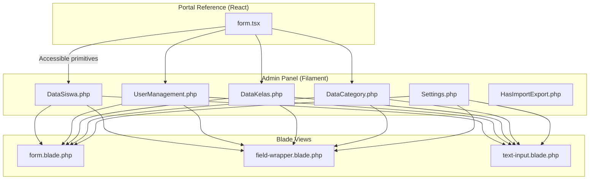
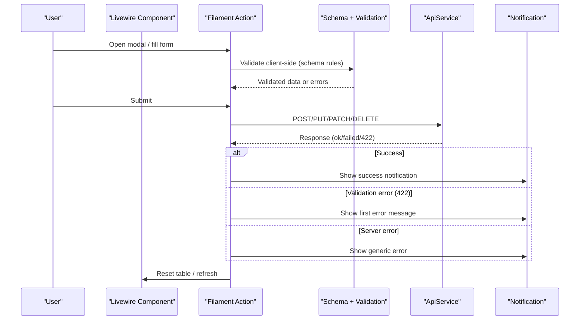
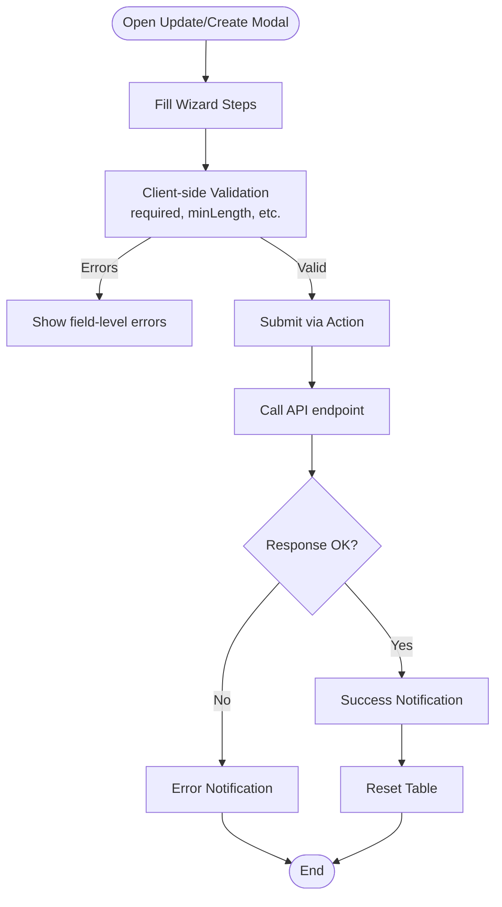
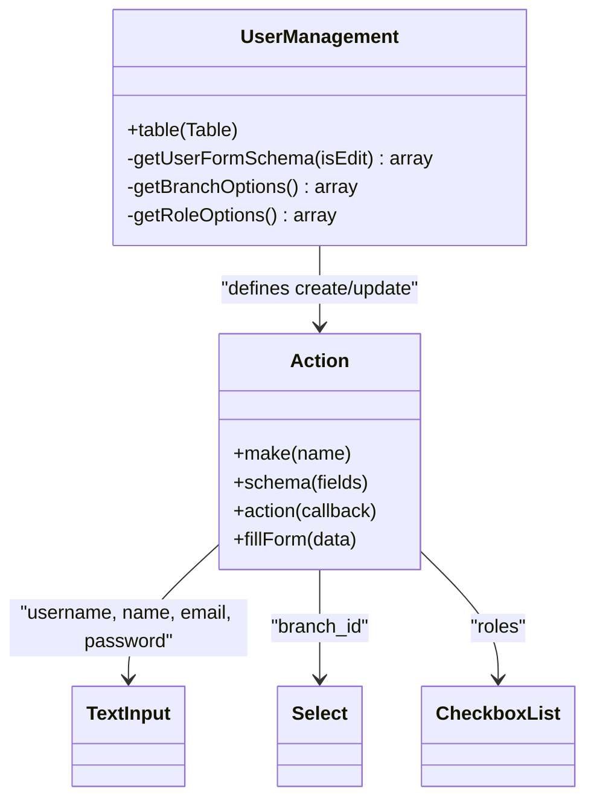
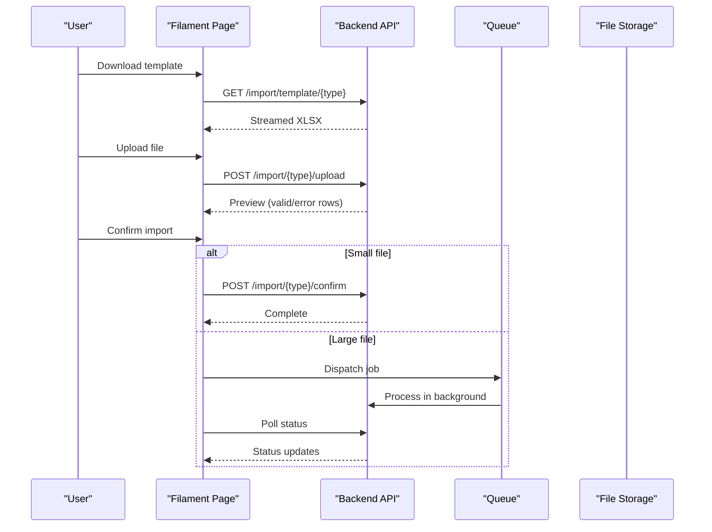
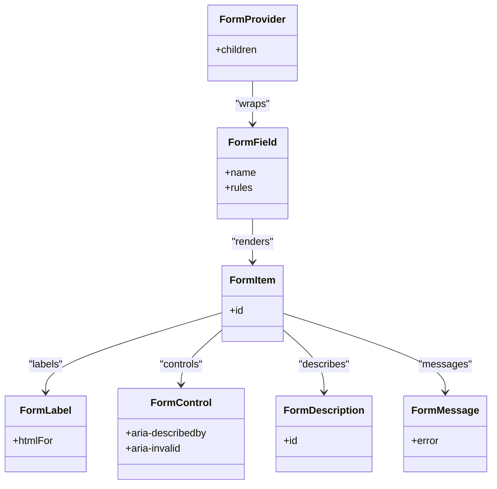
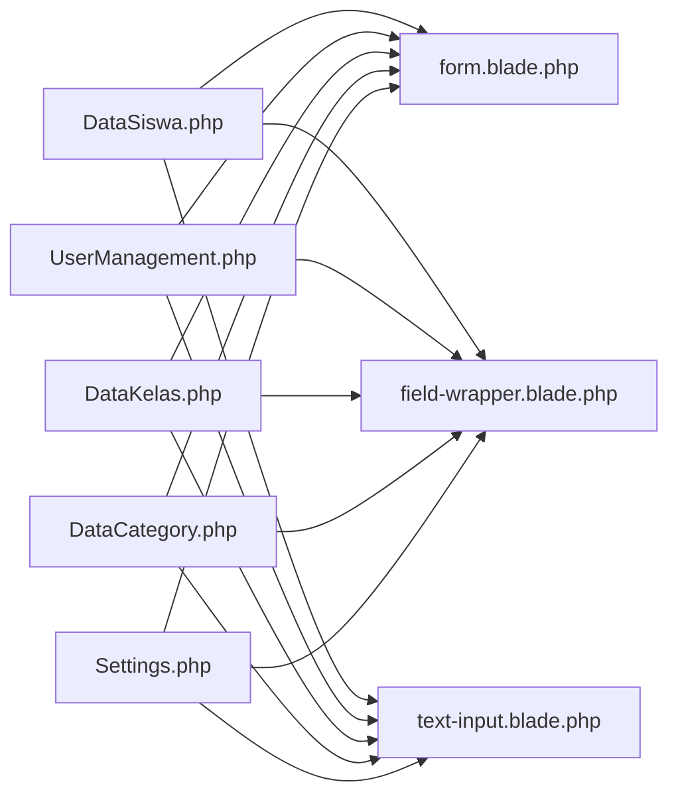

# Form Components & Validation

<cite>
**Referenced Files in This Document**
- [DataSiswa.php](file://frontend-v2/app/Livewire/DataSiswa.php)
- [UserManagement.php](file://frontend-v2/app/Livewire/UserManagement.php)
- [DataKelas.php](file://frontend-v2/app/Livewire/DataKelas.php)
- [DataCategory.php](file://frontend-v2/app/Livewire/DataCategory.php)
- [Settings.php](file://frontend-v2/app/Filament/Pages/Settings.php)
- [HasImportExport.php](file://frontend-v2/app/Livewire/Concerns/HasImportExport.php)
- [form.tsx](file://portal-reference/handayani-joyful-portal/src/components/ui/form.tsx)
- [form.blade.php](file://frontend-v2/storage/framework/views/100af255043dbb5156ec25776d0fba2a.php)
- [field-wrapper.blade.php](file://frontend-v2/storage/framework/views/d8495982784c4329e78d9270638ed5e2.php)
- [text-input.blade.php](file://frontend-v2/storage/framework/views/e784dfc3b4ea3f0b03ac4b92e027830d.php)
- [requirements.md (Frontend Polish)](file://.kiro/specs/frontend-polish-phase3-4/requirements.md)
- [design.md (Frontend Polish)](file://.kiro/specs/frontend-polish-phase3-4/design.md)
- [requirements.md (RBAC Improvement)](file://.kiro/specs/rbac-improvement/requirements.md)
- [requirements.md (Import/Export Data)](file://.kiro/specs/import-export-data/requirements.md)
- [design.md (Import/Export Data)](file://.kiro/specs/import-export-data/design.md)
</cite>

## Table of Contents
1. [Introduction](#introduction)
2. [Project Structure](#project-structure)
3. [Core Components](#core-components)
4. [Architecture Overview](#architecture-overview)
5. [Detailed Component Analysis](#detailed-component-analysis)
6. [Dependency Analysis](#dependency-analysis)
7. [Performance Considerations](#performance-considerations)
8. [Troubleshooting Guide](#troubleshooting-guide)
9. [Conclusion](#conclusion)
10. [Appendices](#appendices)

## Introduction
This document explains how forms and validation are implemented across the application, focusing on:
- Complex multi-step forms with dynamic fields and conditional logic
- Real-time validation using Filament schema rules
- File upload handling for images and media
- Reusable form components and patterns
- Accessibility and keyboard navigation support
- Submission handling, error display patterns, and user feedback

The system uses a hybrid approach:
- Filament-based admin panel (Livewire + Blade) for CRUD and wizard-style forms
- A React portal UI with accessible primitives built on Radix UI and React Hook Form

## Project Structure
Forms are primarily defined in Livewire components via Filament Actions and Schemas. The portal reference provides an accessible React form primitive set.

**Diagram sources**
- [DataSiswa.php](file://frontend-v2/app/Livewire/DataSiswa.php)
- [UserManagement.php](file://frontend-v2/app/Livewire/UserManagement.php)
- [DataKelas.php](file://frontend-v2/app/Livewire/DataKelas.php)
- [DataCategory.php](file://frontend-v2/app/Livewire/DataCategory.php)
- [Settings.php](file://frontend-v2/app/Filament/Pages/Settings.php)
- [HasImportExport.php](file://frontend-v2/app/Livewire/Concerns/HasImportExport.php)
- [form.tsx](file://portal-reference/handayani-joyful-portal/src/components/ui/form.tsx)
- [form.blade.php](file://frontend-v2/storage/framework/views/100af255043dbb5156ec25776d0fba2a.php)
- [field-wrapper.blade.php](file://frontend-v2/storage/framework/views/d8495982784c4329e78d9270638ed5e2.php)
- [text-input.blade.php](file://frontend-v2/storage/framework/views/e784dfc3b4ea3f0b03ac4b92e027830d.php)

**Section sources**
- [DataSiswa.php](file://frontend-v2/app/Livewire/DataSiswa.php)
- [UserManagement.php](file://frontend-v2/app/Livewire/UserManagement.php)
- [DataKelas.php](file://frontend-v2/app/Livewire/DataKelas.php)
- [DataCategory.php](file://frontend-v2/app/Livewire/DataCategory.php)
- [Settings.php](file://frontend-v2/app/Filament/Pages/Settings.php)
- [HasImportExport.php](file://frontend-v2/app/Livewire/Concerns/HasImportExport.php)
- [form.tsx](file://portal-reference/handayani-joyful-portal/src/components/ui/form.tsx)
- [form.blade.php](file://frontend-v2/storage/framework/views/100af255043dbb5156ec25776d0fba2a.php)
- [field-wrapper.blade.php](file://frontend-v2/storage/framework/views/d8495982784c4329e78d9270638ed5e2.php)
- [text-input.blade.php](file://frontend-v2/storage/framework/views/e784dfc3b4ea3f0b03ac4b92e027830d.php)

## Core Components
- Filament Action-based forms: All create/update actions use `Action::make(...)->schema([...])` with native components like TextInput, Select, DatePicker, Textarea, CheckboxList.
- Multi-step wizards: Complex student data entry is split into steps using Wizard and Step.
- Schema-driven validation: Rules such as required, minLength, maxLength, email, numeric, minValue are declared directly on components.
- Import/export flows: A reusable concern encapsulates template download, file upload, preview, and confirmation.
- Accessible React form primitives: Portal reference provides composable primitives with proper ARIA attributes and screen reader support.

Key implementation references:
- Multi-step student update/create: [DataSiswa.php](file://frontend-v2/app/Livewire/DataSiswa.php)
- User management form schema and validation: [UserManagement.php](file://frontend-v2/app/Livewire/UserManagement.php)
- Simple class/category forms: [DataKelas.php](file://frontend-v2/app/Livewire/DataKelas.php), [DataCategory.php](file://frontend-v2/app/Livewire/DataCategory.php)
- Settings image upload: [Settings.php](file://frontend-v2/app/Filament/Pages/Settings.php)
- Import/export flow: [HasImportExport.php](file://frontend-v2/app/Livewire/Concerns/HasImportExport.php)
- Accessible React form primitives: [form.tsx](file://portal-reference/handayani-joyful-portal/src/components/ui/form.tsx)

**Section sources**
- [DataSiswa.php](file://frontend-v2/app/Livewire/DataSiswa.php)
- [UserManagement.php](file://frontend-v2/app/Livewire/UserManagement.php)
- [DataKelas.php](file://frontend-v2/app/Livewire/DataKelas.php)
- [DataCategory.php](file://frontend-v2/app/Livewire/DataCategory.php)
- [Settings.php](file://frontend-v2/app/Filament/Pages/Settings.php)
- [HasImportExport.php](file://frontend-v2/app/Livewire/Concerns/HasImportExport.php)
- [form.tsx](file://portal-reference/handayani-joyful-portal/src/components/ui/form.tsx)

## Architecture Overview
Form lifecycle in the admin panel:
- Define schema with Filament components and validation rules
- Render modal or inline form via Action
- Submit to backend API via ApiService
- Display success/error notifications
- Reset table state after mutation

**Diagram sources**
- [DataSiswa.php](file://frontend-v2/app/Livewire/DataSiswa.php)
- [UserManagement.php](file://frontend-v2/app/Livewire/UserManagement.php)
- [DataKelas.php](file://frontend-v2/app/Livewire/DataKelas.php)
- [DataCategory.php](file://frontend-v2/app/Livewire/DataCategory.php)

## Detailed Component Analysis

### Student Management Forms (Multi-step Wizard)
- Uses Wizard with multiple Steps for student, father, mother/wali data
- Dynamic options loaded from API for classes and categories
- Validation messages customized per field
- Conditional visibility based on active tab (KB/MI/TK)

**Diagram sources**
- [DataSiswa.php](file://frontend-v2/app/Livewire/DataSiswa.php)

**Section sources**
- [DataSiswa.php](file://frontend-v2/app/Livewire/DataSiswa.php)

### User Management Forms (Schema-driven CRUD)
- Single-page form schema reused for create and edit
- Password optional on edit; username uniqueness handled by backend
- Roles selected via CheckboxList; branch via searchable Select
- Error mapping for 422 responses preserves input

**Diagram sources**
- [UserManagement.php](file://frontend-v2/app/Livewire/UserManagement.php)

**Section sources**
- [UserManagement.php](file://frontend-v2/app/Livewire/UserManagement.php)

### Class and Category Forms (Simple CRUD)
- Minimal schemas with required text inputs and numeric fields
- Consistent action pattern: open modal, validate, submit, notify, reset table

**Section sources**
- [DataKelas.php](file://frontend-v2/app/Livewire/DataKelas.php)
- [DataCategory.php](file://frontend-v2/app/Livewire/DataCategory.php)

### Settings Image Upload
- Handles temporary uploaded files and attaches them to HTTP requests
- Only processes new uploads; existing paths are preserved

**Section sources**
- [Settings.php](file://frontend-v2/app/Filament/Pages/Settings.php)

### Import/Export Flow
- Template download, upload, preview, confirm steps
- Client-side constraints for file size and type
- Queue-based processing for large datasets with polling

**Diagram sources**
- [HasImportExport.php](file://frontend-v2/app/Livewire/Concerns/HasImportExport.php)
- [design.md (Import/Export Data)](file://.kiro/specs/import-export-data/design.md)
- [requirements.md (Import/Export Data)](file://.kiro/specs/import-export-data/requirements.md)

**Section sources**
- [HasImportExport.php](file://frontend-v2/app/Livewire/Concerns/HasImportExport.php)
- [requirements.md (Import/Export Data)](file://.kiro/specs/import-export-data/requirements.md)
- [design.md (Import/Export Data)](file://.kiro/specs/import-export-data/design.md)

### Accessible React Form Primitives (Portal Reference)
- Provides composable primitives: Form, FormField, FormItem, FormLabel, FormControl, FormDescription, FormMessage
- Integrates with React Hook Form Controller and context
- Ensures ARIA attributes for accessibility and screen readers

**Diagram sources**
- [form.tsx](file://portal-reference/handayani-joyful-portal/src/components/ui/form.tsx)

**Section sources**
- [form.tsx](file://portal-reference/handayani-joyful-portal/src/components/ui/form.tsx)

## Dependency Analysis
- Livewire components depend on Filament Actions/Schemas for form rendering and validation
- Blade views render the underlying HTML and manage error states and ARIA attributes
- Portal reference demonstrates accessible primitives that can be adopted consistently

**Diagram sources**
- [DataSiswa.php](file://frontend-v2/app/Livewire/DataSiswa.php)
- [UserManagement.php](file://frontend-v2/app/Livewire/UserManagement.php)
- [DataKelas.php](file://frontend-v2/app/Livewire/DataKelas.php)
- [DataCategory.php](file://frontend-v2/app/Livewire/DataCategory.php)
- [Settings.php](file://frontend-v2/app/Filament/Pages/Settings.php)
- [form.blade.php](file://frontend-v2/storage/framework/views/100af255043dbb5156ec25776d0fba2a.php)
- [field-wrapper.blade.php](file://frontend-v2/storage/framework/views/d8495982784c4329e78d9270638ed5e2.php)
- [text-input.blade.php](file://frontend-v2/storage/framework/views/e784dfc3b4ea3f0b03ac4b92e027830d.php)

**Section sources**
- [DataSiswa.php](file://frontend-v2/app/Livewire/DataSiswa.php)
- [UserManagement.php](file://frontend-v2/app/Livewire/UserManagement.php)
- [DataKelas.php](file://frontend-v2/app/Livewire/DataKelas.php)
- [DataCategory.php](file://frontend-v2/app/Livewire/DataCategory.php)
- [Settings.php](file://frontend-v2/app/Filament/Pages/Settings.php)
- [form.blade.php](file://frontend-v2/storage/framework/views/100af255043dbb5156ec25776d0fba2a.php)
- [field-wrapper.blade.php](file://frontend-v2/storage/framework/views/d8495982784c4329e78d9270638ed5e2.php)
- [text-input.blade.php](file://frontend-v2/storage/framework/views/e784dfc3b4ea3f0b03ac4b92e027830d.php)

## Performance Considerations
- Use deferred loading for tables to reduce initial payload
- Avoid unnecessary re-renders by resetting only affected tables after mutations
- For large imports/exports, prefer queue-based processing and polling rather than synchronous generation
- Keep schema definitions concise and reuse common schemas where possible

[No sources needed since this section provides general guidance]

## Troubleshooting Guide
Common issues and resolutions:
- Connection failures: Ensure ApiService handles timeouts and displays friendly notifications
- Backend validation errors (422): Map first error to a user-facing notification while preserving form input
- Duplicate submissions: Disable submit buttons during async operations
- Missing labels or ARIA: Verify form wrappers attach correct IDs and aria attributes

Patterns used in code:
- Centralized error handling helpers
- Consistent notification usage for success and failure
- Preserving form state on validation errors

**Section sources**
- [design.md (Frontend Polish)](file://.kiro/specs/frontend-polish-phase3-4/design.md)
- [requirements.md (Frontend Polish)](file://.kiro/specs/frontend-polish-phase3-4/requirements.md)
- [requirements.md (RBAC Improvement)](file://.kiro/specs/rbac-improvement/requirements.md)

## Conclusion
The application implements robust, accessible forms through:
- Filament’s schema-driven validation and multi-step wizards
- Consistent submission and error handling patterns
- Reusable concerns for import/export workflows
- Accessible React primitives in the portal reference

Adopting these patterns ensures consistent UX, strong validation, and inclusive experiences across the platform.

[No sources needed since this section summarizes without analyzing specific files]

## Appendices

### Accessibility and Keyboard Navigation
- Full keyboard navigation and visible focus indicators
- Semantic HTML structure and logical heading hierarchy
- ARIA labels for icon-only controls and form inputs
- Screen reader announcements for field errors via live regions

**Section sources**
- [requirements.md (Frontend Polish)](file://.kiro/specs/frontend-polish-phase3-4/requirements.md)
- [field-wrapper.blade.php](file://frontend-v2/storage/framework/views/d8495982784c4329e78d9270638ed5e2.php)
- [text-input.blade.php](file://frontend-v2/storage/framework/views/e784dfc3b4ea3f0b03ac4b92e027830d.php)
- [form.tsx](file://portal-reference/handayani-joyful-portal/src/components/ui/form.tsx)

### File Upload Handling and Media Management
- Temporary file handling and attachment to HTTP requests
- Acceptable types and size limits enforced client-side
- Background processing for large jobs with progress and completion notifications

**Section sources**
- [Settings.php](file://frontend-v2/app/Filament/Pages/Settings.php)
- [requirements.md (Import/Export Data)](file://.kiro/specs/import-export-data/requirements.md)
- [design.md (Import/Export Data)](file://.kiro/specs/import-export-data/design.md)