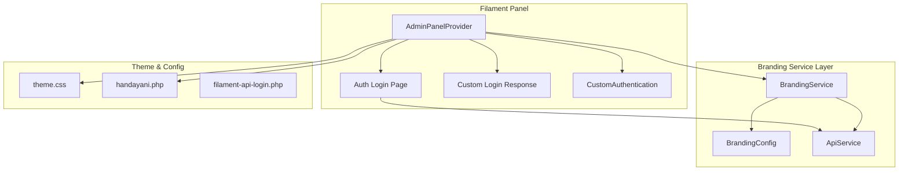
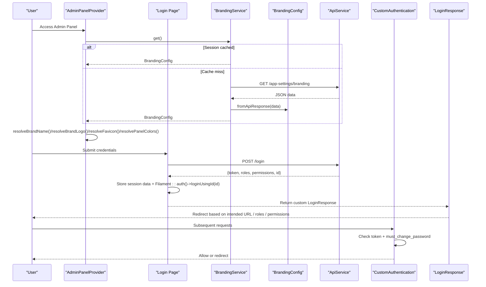
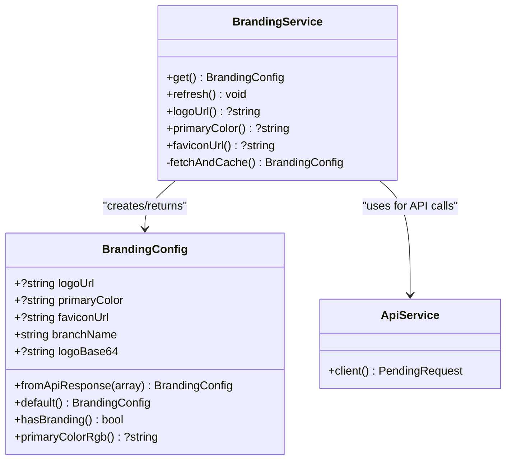
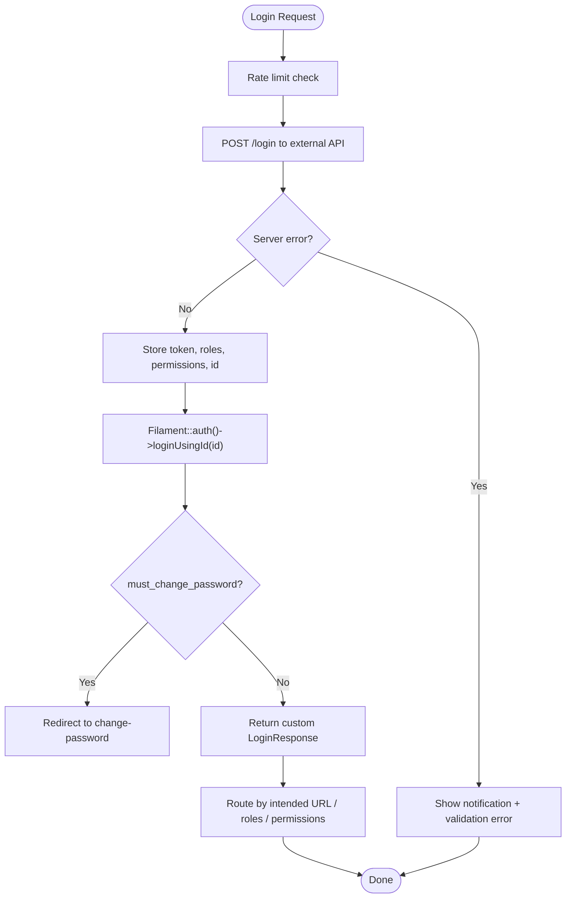
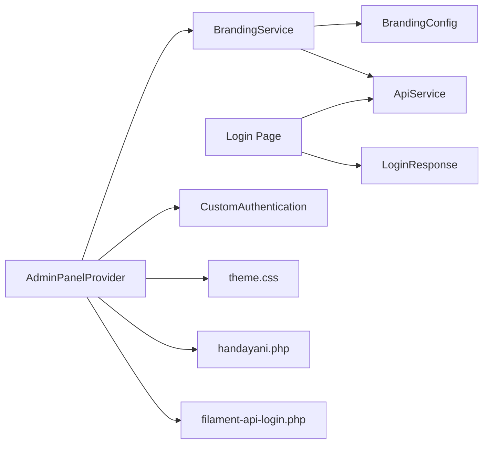

# Panel Architecture & Branding

<cite>
**Referenced Files in This Document**
- [AdminPanelProvider.php](file://frontend-v2/app/Providers/Filament/AdminPanelProvider.php)
- [Login.php](file://frontend-v2/app/Filament/Pages/Auth/Login.php)
- [LoginResponse.php](file://frontend-v2/app/Filament/Pages/Auth/LoginResponse.php)
- [CustomAuthentication.php](file://frontend-v2/app/Http/Middleware/CustomAuthentication.php)
- [BrandingService.php](file://frontend-v2/app/Services/BrandingService.php)
- [BrandingConfig.php](file://frontend-v2/app/Services/BrandingConfig.php)
- [ApiService.php](file://frontend-v2/app/Services/ApiService.php)
- [handayani.php](file://frontend-v2/config/handayani.php)
- [filament-api-login.php](file://frontend-v2/config/filament-api-login.php)
- [theme.css](file://frontend-v2/resources/css/filament/admin/theme.css)
</cite>

## Table of Contents
1. Introduction
2. Project Structure
3. Core Components
4. Architecture Overview
5. Detailed Component Analysis
6. Dependency Analysis
7. Performance Considerations
8. Troubleshooting Guide
9. Conclusion

## Introduction
This document explains the Filament admin panel architecture and branding system for the project. It covers how the panel is configured, how color schemes are registered, how custom authentication responses are implemented, and how the branding service manages logos, theme customization, and responsive design patterns. Practical guidance is provided for extending the panel with custom colors, fonts, and layout modifications, as well as maintaining consistent branding across devices.

## Project Structure
The Filament admin panel is defined by a single provider that wires up authentication pages, navigation, middleware, render hooks, and branding. The branding system is implemented via a service layer that fetches configuration from an external API and caches it per session. Authentication integrates with an external API and uses a custom response to route users based on roles and permissions. A Tailwind-based theme file provides dark mode, accessibility, responsive utilities, and print styles.

**Diagram sources**
- [AdminPanelProvider.php:53-135](file://frontend-v2/app/Providers/Filament/AdminPanelProvider.php#L53-L135)
- [Login.php:56-136](file://frontend-v2/app/Filament/Pages/Auth/Login.php#L56-L136)
- [LoginResponse.php:11-50](file://frontend-v2/app/Filament/Pages/Auth/LoginResponse.php#L11-L50)
- [CustomAuthentication.php:16-39](file://frontend-v2/app/Http/Middleware/CustomAuthentication.php#L16-L39)
- [BrandingService.php:15-90](file://frontend-v2/app/Services/BrandingService.php#L15-L90)
- [BrandingConfig.php:18-72](file://frontend-v2/app/Services/BrandingConfig.php#L18-L72)
- [ApiService.php:16-23](file://frontend-v2/app/Services/ApiService.php#L16-L23)
- [theme.css:1-452](file://frontend-v2/resources/css/filament/admin/theme.css#L1-L452)
- [handayani.php:14-52](file://frontend-v2/config/handayani.php#L14-L52)
- [filament-api-login.php:15-40](file://frontend-v2/config/filament-api-login.php#L15-L40)

**Section sources**
- [AdminPanelProvider.php:53-135](file://frontend-v2/app/Providers/Filament/AdminPanelProvider.php#L53-L135)
- [BrandingService.php:15-90](file://frontend-v2/app/Services/BrandingService.php#L15-L90)
- [BrandingConfig.php:18-72](file://frontend-v2/app/Services/BrandingConfig.php#L18-L72)
- [ApiService.php:16-23](file://frontend-v2/app/Services/ApiService.php#L16-L23)
- [theme.css:1-452](file://frontend-v2/resources/css/filament/admin/theme.css#L1-L452)
- [handayani.php:14-52](file://frontend-v2/config/handayani.php#L14-L52)
- [filament-api-login.php:15-40](file://frontend-v2/config/filament-api-login.php#L15-L40)

## Core Components
- AdminPanelProvider: Registers the default panel, login/password reset pages, SPA mode, breadcrumbs, widgets, Vite theme path, brand name/logo/favicon, dynamic colors, auth middleware, database notifications, and render hooks. It also builds permission-aware navigation groups and items.
- BrandingService: Retrieves branding config from session cache or fetches from backend API, caching results per session and falling back to defaults when unavailable. Provides convenience accessors for logo URL, primary color, and favicon URL.
- BrandingConfig: Immutable value object representing branding fields (logo URL, primary color, favicon URL, branch name). Includes helpers to detect if any custom branding is set and to convert hex color to RGB string for CSS variables.
- ApiService: Shared HTTP client factory that attaches Authorization Bearer token from session and sets base URL for all API calls.
- CustomAuthentication: Enforces authentication by checking session token, redirects unauthenticated users to login, and enforces password change flow when required. Also gates portal routes based on feature flags.
- Login page: Authenticates against an external API, stores user data in session, logs into Filament’s auth guard, and returns a custom response.
- LoginResponse: Implements Filament’s login response contract to redirect based on intended URL, role, and permissions.

**Section sources**
- [AdminPanelProvider.php:53-135](file://frontend-v2/app/Providers/Filament/AdminPanelProvider.php#L53-L135)
- [BrandingService.php:15-90](file://frontend-v2/app/Services/BrandingService.php#L15-L90)
- [BrandingConfig.php:18-72](file://frontend-v2/app/Services/BrandingConfig.php#L18-L72)
- [ApiService.php:16-23](file://frontend-v2/app/Services/ApiService.php#L16-L23)
- [CustomAuthentication.php:16-39](file://frontend-v2/app/Http/Middleware/CustomAuthentication.php#L16-L39)
- [Login.php:56-136](file://frontend-v2/app/Filament/Pages/Auth/Login.php#L56-L136)
- [LoginResponse.php:11-50](file://frontend-v2/app/Filament/Pages/Auth/LoginResponse.php#L11-L50)

## Architecture Overview
The panel provider orchestrates UI behavior and branding. During bootstrapping, it resolves brand name, logo, favicon, and colors from the branding service. The branding service pulls configuration from the backend API and caches it in the session. Authentication is handled by a custom login page that posts credentials to an external API, persists tokens and metadata in the session, and returns a custom response that routes users according to roles and permissions. A middleware enforces authentication and password change requirements. The theme file extends Filament’s defaults with WCAG-compliant contrast, responsive utilities, skeleton loaders, and print styles.

**Diagram sources**
- [AdminPanelProvider.php:103-106](file://frontend-v2/app/Providers/Filament/AdminPanelProvider.php#L103-L106)
- [BrandingService.php:15-90](file://frontend-v2/app/Services/BrandingService.php#L15-L90)
- [BrandingConfig.php:18-72](file://frontend-v2/app/Services/BrandingConfig.php#L18-L72)
- [ApiService.php:16-23](file://frontend-v2/app/Services/ApiService.php#L16-L23)
- [Login.php:56-136](file://frontend-v2/app/Filament/Pages/Auth/Login.php#L56-L136)
- [LoginResponse.php:11-50](file://frontend-v2/app/Filament/Pages/Auth/LoginResponse.php#L11-L50)
- [CustomAuthentication.php:16-39](file://frontend-v2/app/Http/Middleware/CustomAuthentication.php#L16-L39)

## Detailed Component Analysis

### Panel Provider Configuration
- Panel identity and routing: Sets default panel, root path, home URL, login/password reset pages, disables profile page, enables dark mode, SPA transitions, and breadcrumbs.
- Discovery: Auto-discovers resources, pages, and widgets under app paths.
- User menu: Customizes profile action label/icon/url and logout action which attempts remote logout, clears session, invalidates, regenerates CSRF token, and redirects to login.
- Navigation: Builds permission-aware groups and items; supports “siswa” shortcuts to portal; maps active states using original_request().
- Widgets: Registers account widget.
- Theme integration: Points to Vite theme CSS.
- Branding: Resolves brand name, logo, favicon, and colors from branding service.
- Middleware: Adds custom authentication and standard Filament/Laravel middleware stack.
- Notifications: Enables database notifications and polling; injects Livewire components via render hooks.

Practical examples:
- Extend panel colors: Provide a primary color via branding service; the provider maps it to Filament’s Color::hex.
- Change brand name/logo/favicon: Update branding configuration at runtime; the provider will reflect changes after refresh.
- Customize logout behavior: Modify the logout action closure to perform additional cleanup or analytics before redirect.

**Section sources**
- [AdminPanelProvider.php:53-135](file://frontend-v2/app/Providers/Filament/AdminPanelProvider.php#L53-L135)
- [AdminPanelProvider.php:425-477](file://frontend-v2/app/Providers/Filament/AdminPanelProvider.php#L425-L477)

### Branding Service Implementation
Responsibilities:
- Retrieve current branding configuration with fallback chain: session cache → API fetch → defaults.
- Force refresh branding from backend API.
- Convenience accessors for logo URL, primary color, and favicon URL.
- Robust error handling: logs failures and falls back to defaults.

Data model:
- BrandingConfig holds logoUrl, primaryColor, faviconUrl, branchName, and optional logoBase64.
- hasBranding indicates whether any custom branding is present.
- primaryColorRgb converts hex to RGB string suitable for CSS variables.

Integration points:
- Uses ApiService to call backend endpoint for branding settings.
- Stores BrandingConfig in session keyed by a constant key.

Practical examples:
- Add a new branding field: Extend BrandingConfig constructor and fromApiResponse, then expose a helper in BrandingService and use it in the provider or views.
- Invalidate cache: Call refresh to force re-fetch branding from API.

**Diagram sources**
- [BrandingService.php:15-90](file://frontend-v2/app/Services/BrandingService.php#L15-L90)
- [BrandingConfig.php:18-72](file://frontend-v2/app/Services/BrandingConfig.php#L18-L72)
- [ApiService.php:16-23](file://frontend-v2/app/Services/ApiService.php#L16-L23)

**Section sources**
- [BrandingService.php:15-90](file://frontend-v2/app/Services/BrandingService.php#L15-L90)
- [BrandingConfig.php:18-72](file://frontend-v2/app/Services/BrandingConfig.php#L18-L72)
- [ApiService.php:16-23](file://frontend-v2/app/Services/ApiService.php#L16-L23)

### Custom Authentication Responses
Flow:
- Login page validates input, rate-limits, posts credentials to external API, stores token and metadata in session, logs into Filament’s auth guard, and returns a custom response.
- Custom response handles intended URL redirection, role-based portal redirection, and permission-based routing to appropriate pages.
- Middleware ensures authenticated sessions, enforces password change requirement, and gates portal routes based on feature flags.

Practical examples:
- Customize post-login routing: Adjust permission-to-route mapping in the response class.
- Enforce password change: Middleware checks must_change_password flag and redirects accordingly unless already on the change-password page.
- Integrate external logout: Logout action attempts remote logout before clearing local session.

**Diagram sources**
- [Login.php:56-136](file://frontend-v2/app/Filament/Pages/Auth/Login.php#L56-L136)
- [LoginResponse.php:11-50](file://frontend-v2/app/Filament/Pages/Auth/LoginResponse.php#L11-L50)
- [CustomAuthentication.php:16-39](file://frontend-v2/app/Http/Middleware/CustomAuthentication.php#L16-L39)

**Section sources**
- [Login.php:56-136](file://frontend-v2/app/Filament/Pages/Auth/Login.php#L56-L136)
- [LoginResponse.php:11-50](file://frontend-v2/app/Filament/Pages/Auth/LoginResponse.php#L11-L50)
- [CustomAuthentication.php:16-39](file://frontend-v2/app/Http/Middleware/CustomAuthentication.php#L16-L39)

### Theme Customization and Responsive Design Patterns
The theme file extends Filament’s base theme and adds:
- Dark mode enhancements and component overrides for readability.
- WCAG AA-compliant contrast documentation and utility classes for surfaces, badges, text hierarchy, borders, inputs, tables, modals, and focus rings.
- Responsive utilities: mobile-first table overflow, stacked grids on small screens, compact pagination, touch-friendly targets.
- Skeleton loader animations and loading state indicators.
- Print styles to hide interactive elements, enforce light mode, and optimize output for paper.

Practical examples:
- Maintain consistent branding across screen sizes: Use provided utility classes like card-surface, badge-success, and focus-ring to ensure accessible and responsive UI.
- Customize button text color: Apply existing overrides or add new selectors targeting specific Filament components.
- Improve mobile experience: Leverage media queries and grid adjustments already included.

**Section sources**
- [theme.css:1-452](file://frontend-v2/resources/css/filament/admin/theme.css#L1-L452)

## Dependency Analysis
Key relationships:
- AdminPanelProvider depends on BrandingService to resolve brand assets and colors.
- BrandingService depends on ApiService for HTTP calls and BrandingConfig for data modeling.
- Login page depends on ApiService for authentication and returns a custom LoginResponse.
- CustomAuthentication middleware enforces session-based authentication and password change flows.
- Feature flags in handayani.php control SPA loading, custom navigation, portal availability, and Midtrans integration.
- filament-api-login.php provides configuration for external API login timeout and logging.

**Diagram sources**
- [AdminPanelProvider.php:53-135](file://frontend-v2/app/Providers/Filament/AdminPanelProvider.php#L53-L135)
- [BrandingService.php:15-90](file://frontend-v2/app/Services/BrandingService.php#L15-L90)
- [BrandingConfig.php:18-72](file://frontend-v2/app/Services/BrandingConfig.php#L18-L72)
- [ApiService.php:16-23](file://frontend-v2/app/Services/ApiService.php#L16-L23)
- [Login.php:56-136](file://frontend-v2/app/Filament/Pages/Auth/Login.php#L56-L136)
- [LoginResponse.php:11-50](file://frontend-v2/app/Filament/Pages/Auth/LoginResponse.php#L11-L50)
- [CustomAuthentication.php:16-39](file://frontend-v2/app/Http/Middleware/CustomAuthentication.php#L16-L39)
- [theme.css:1-452](file://frontend-v2/resources/css/filament/admin/theme.css#L1-L452)
- [handayani.php:14-52](file://frontend-v2/config/handayani.php#L14-L52)
- [filament-api-login.php:15-40](file://frontend-v2/config/filament-api-login.php#L15-L40)

**Section sources**
- [AdminPanelProvider.php:53-135](file://frontend-v2/app/Providers/Filament/AdminPanelProvider.php#L53-L135)
- [BrandingService.php:15-90](file://frontend-v2/app/Services/BrandingService.php#L15-L90)
- [BrandingConfig.php:18-72](file://frontend-v2/app/Services/BrandingConfig.php#L18-L72)
- [ApiService.php:16-23](file://frontend-v2/app/Services/ApiService.php#L16-L23)
- [Login.php:56-136](file://frontend-v2/app/Filament/Pages/Auth/Login.php#L56-L136)
- [LoginResponse.php:11-50](file://frontend-v2/app/Filament/Pages/Auth/LoginResponse.php#L11-L50)
- [CustomAuthentication.php:16-39](file://frontend-v2/app/Http/Middleware/CustomAuthentication.php#L16-L39)
- [theme.css:1-452](file://frontend-v2/resources/css/filament/admin/theme.css#L1-L452)
- [handayani.php:14-52](file://frontend-v2/config/handayani.php#L14-L52)
- [filament-api-login.php:15-40](file://frontend-v2/config/filament-api-login.php#L15-L40)

## Performance Considerations
- Branding cache: BrandingService caches BrandingConfig in session to avoid repeated API calls. Use refresh only when necessary to minimize overhead.
- API timeouts: Configure external API login timeout via configuration to balance responsiveness and reliability.
- SPA transitions: Enable SPA loading for smoother navigation; disable if network conditions are poor.
- Database notifications: Polling can be tuned or disabled if not needed to reduce server load.

[No sources needed since this section provides general guidance]

## Troubleshooting Guide
Common issues and resolutions:
- Branding not applied: Ensure branding service can reach the backend API; check logs for warnings when fetching fails. Verify that hasBranding returns true when custom values are set.
- Incorrect post-login redirect: Review LoginResponse mapping and session data (roles, permissions). Confirm intended URL handling and role-based portal redirection.
- Password change loop: Middleware enforces must_change_password; ensure the change-password route is accessible and that the flag is cleared after update.
- Portal access denied: If portal is disabled, requests to the portal path return 404; enable the feature flag in configuration.
- Logout not clearing session: Verify logout action performs session flush, invalidation, and CSRF regeneration before redirect.

**Section sources**
- [BrandingService.php:69-90](file://frontend-v2/app/Services/BrandingService.php#L69-L90)
- [LoginResponse.php:11-50](file://frontend-v2/app/Filament/Pages/Auth/LoginResponse.php#L11-L50)
- [CustomAuthentication.php:16-39](file://frontend-v2/app/Http/Middleware/CustomAuthentication.php#L16-L39)
- [AdminPanelProvider.php:76-90](file://frontend-v2/app/Providers/Filament/AdminPanelProvider.php#L76-L90)

## Conclusion
The Filament admin panel is configured through a central provider that integrates branding, authentication, navigation, and theming. The branding service abstracts API access and caching, enabling dynamic customization of logos, colors, and favicons. Custom authentication responses provide flexible routing based on roles and permissions, while middleware enforces security and UX requirements. The theme file ensures accessibility, responsiveness, and consistency across devices. By leveraging these components, teams can extend the panel with custom colors, fonts, and layouts while maintaining a cohesive brand experience.