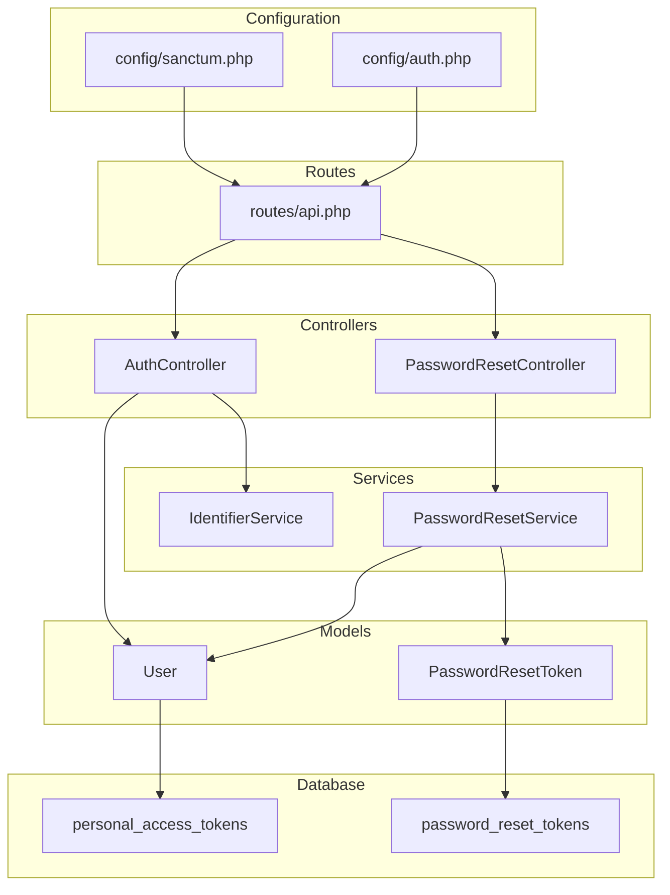
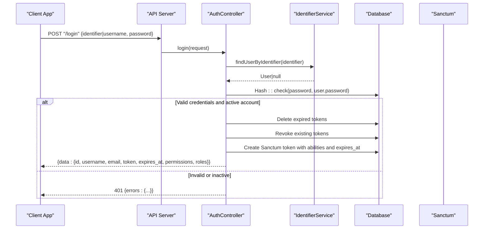
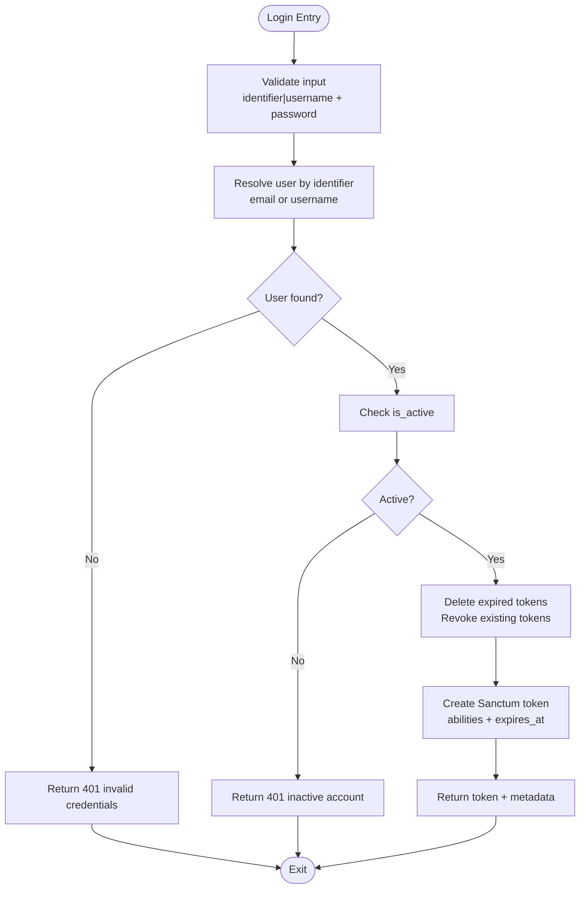
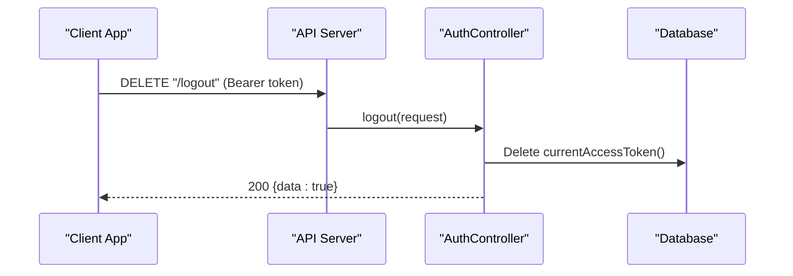
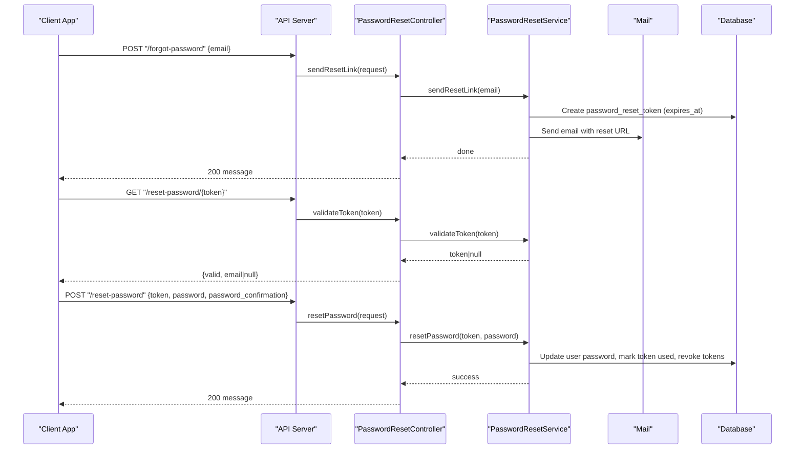
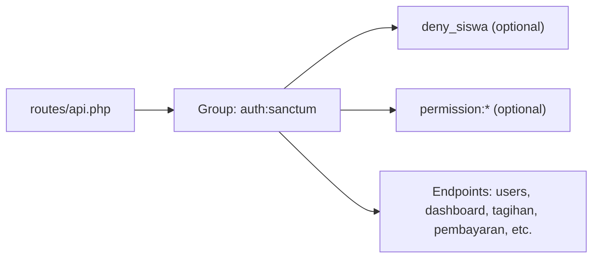
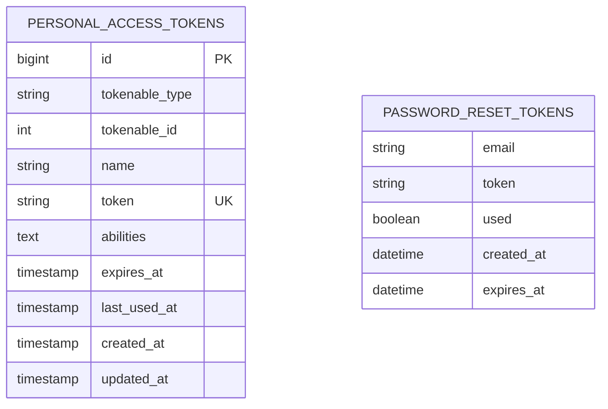
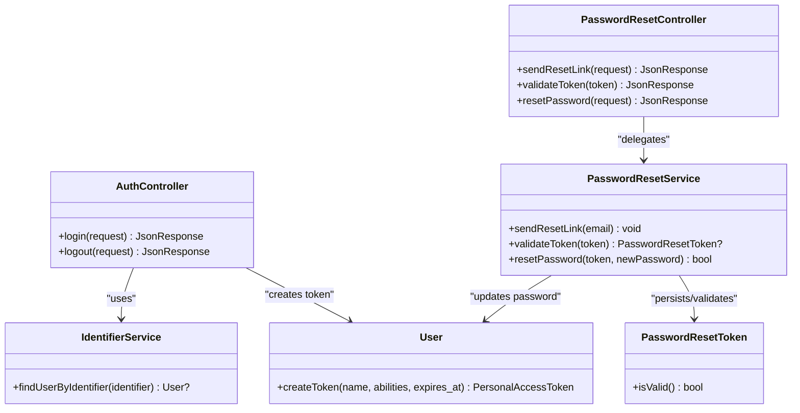

# API Authentication & Token Management

<cite>
**Referenced Files in This Document**
- [sanctum.php](file://backend/config/sanctum.php)
- [api.php](file://backend/routes/api.php)
- [AuthController.php](file://backend/app/Http/Controllers/AuthController.php)
- [PasswordResetController.php](file://backend/app/Http/Controllers/PasswordResetController.php)
- [PasswordResetService.php](file://backend/app/Services/PasswordResetService.php)
- [User.php](file://backend/app/Models/User.php)
- [PasswordResetToken.php](file://backend/app/Models/PasswordResetToken.php)
- [auth.php](file://backend/config/auth.php)
- [IdentifierService.php](file://backend/app/Services/IdentifierService.php)
- [2026_05_02_000000_create_personal_access_tokens_table.php](file://backend/database/migrations/2026_05_02_000000_create_personal_access_tokens_table.php)
- [DenySiswaRole.php](file://backend/app/Http/Middleware/DenySiswaRole.php)
</cite>

## Table of Contents
1. Introduction
2. Project Structure
3. Core Components
4. Architecture Overview
5. Detailed Component Analysis
6. Dependency Analysis
7. Performance Considerations
8. Troubleshooting Guide
9. Conclusion

## Introduction
This document explains the API authentication and token management for Handayani’s RESTful endpoints using Laravel Sanctum. It covers:
- Token-based authentication with bearer tokens
- Login/logout flows, request/response formats, and error handling
- Password reset workflow (token generation, email delivery, password update)
- Route protection via Sanctum middleware and permission checks
- Practical client integration patterns, token expiration handling, secure logout, rate limiting considerations, and troubleshooting guidance

## Project Structure
The authentication implementation spans configuration, routes, controllers, services, models, and database migrations:
- Configuration: Sanctum guard, stateful domains, expiration, token prefix, and middleware stack
- Routes: Public login/password reset endpoints; protected API routes under auth:sanctum
- Controllers: AuthController handles login/logout; PasswordResetController orchestrates reset flows
- Services: IdentifierService normalizes identifier resolution; PasswordResetService manages tokens and emails
- Models: User integrates Sanctum tokens and roles; PasswordResetToken persists reset tokens
- Database: personal_access_tokens table stores issued tokens; password_reset_tokens table stores reset tokens

**Diagram sources**
- [sanctum.php:1-85](file://backend/config/sanctum.php#L1-L85)
- [auth.php:1-116](file://backend/config/auth.php#L1-L116)
- [api.php:1-345](file://backend/routes/api.php#L1-L345)
- [AuthController.php:1-103](file://backend/app/Http/Controllers/AuthController.php#L1-L103)
- [PasswordResetController.php:1-78](file://backend/app/Http/Controllers/PasswordResetController.php#L1-L78)
- [PasswordResetService.php:1-100](file://backend/app/Services/PasswordResetService.php#L1-L100)
- [User.php:1-74](file://backend/app/Models/User.php#L1-L74)
- [PasswordResetToken.php:1-38](file://backend/app/Models/PasswordResetToken.php#L1-L38)
- [2026_05_02_000000_create_personal_access_tokens_table.php:1-34](file://backend/database/migrations/2026_05_02_000000_create_personal_access_tokens_table.php#L1-L34)

**Section sources**
- [sanctum.php:1-85](file://backend/config/sanctum.php#L1-L85)
- [auth.php:1-116](file://backend/config/auth.php#L1-L116)
- [api.php:1-345](file://backend/routes/api.php#L1-L345)

## Core Components
- Sanctum configuration: Defines guards, stateful domains, expiration minutes, token prefix, and middleware used by Sanctum.
- API routes: Public endpoints for login and password reset; protected endpoints grouped under auth:sanctum middleware.
- AuthController: Validates credentials, resolves user by identifier or username, issues a Sanctum token with abilities and expiration, and revokes current token on logout.
- PasswordResetController + PasswordResetService: Generates short-lived reset tokens, sends email links, validates tokens, updates passwords, and revokes existing tokens upon successful reset.
- User model: Integrates Sanctum HasApiTokens and Spatie Roles; exposes token creation and role-based permissions.
- PasswordResetToken model: Stores reset tokens with usage and expiry semantics.

Key behaviors:
- Login accepts either identifier or username plus password; returns a plain-text token and expiration timestamp.
- Logout deletes the current access token to immediately invalidate it.
- Password reset is anti-enumeration friendly and enforces token validity and single-use semantics.

**Section sources**
- [sanctum.php:1-85](file://backend/config/sanctum.php#L1-L85)
- [api.php:36-52](file://backend/routes/api.php#L36-L52)
- [AuthController.php:41-101](file://backend/app/Http/Controllers/AuthController.php#L41-L101)
- [PasswordResetController.php:15-76](file://backend/app/Http/Controllers/PasswordResetController.php#L15-L76)
- [PasswordResetService.php:16-98](file://backend/app/Services/PasswordResetService.php#L16-L98)
- [User.php:1-74](file://backend/app/Models/User.php#L1-L74)
- [PasswordResetToken.php:1-38](file://backend/app/Models/PasswordResetToken.php#L1-L38)

## Architecture Overview
The authentication architecture uses Sanctum’s bearer token scheme. Clients authenticate via POST /login, receive a token, and include it as Authorization: Bearer <token> in subsequent requests. Protected routes enforce auth:sanctum and optional permission middleware.

**Diagram sources**
- [api.php:36-41](file://backend/routes/api.php#L36-L41)
- [AuthController.php:41-94](file://backend/app/Http/Controllers/AuthController.php#L41-L94)
- [IdentifierService.php:24-47](file://backend/app/Services/IdentifierService.php#L24-L47)
- [User.php:1-74](file://backend/app/Models/User.php#L1-L74)
- [sanctum.php:36-50](file://backend/config/sanctum.php#L36-L50)

## Detailed Component Analysis

### Login Flow
- Input validation: Accepts either identifier or username along with password.
- Identity resolution: IdentifierService finds users by normalized email or username, enforcing active status and additional constraints for admin/operator accounts.
- Credential verification: Uses bcrypt comparison against stored hash.
- Account status: Rejects inactive accounts.
- Token issuance: Revokes previous tokens, creates a new Sanctum token with abilities derived from user roles/permissions and an expiration time configured in sanctum.expiration.
- Response: Returns user data, plain-text token, expiration timestamp, permissions, roles, and must_change_password flag.

**Diagram sources**
- [AuthController.php:41-94](file://backend/app/Http/Controllers/AuthController.php#L41-L94)
- [IdentifierService.php:24-47](file://backend/app/Services/IdentifierService.php#L24-L47)
- [sanctum.php:49-50](file://backend/config/sanctum.php#L49-L50)

**Section sources**
- [AuthController.php:41-94](file://backend/app/Http/Controllers/AuthController.php#L41-L94)
- [IdentifierService.php:24-47](file://backend/app/Services/IdentifierService.php#L24-L47)
- [sanctum.php:49-50](file://backend/config/sanctum.php#L49-L50)

### Logout Flow
- Behavior: Deletes the current access token to immediately revoke it.
- Protection: Requires a valid Sanctum token via auth:sanctum.

**Diagram sources**
- [api.php:47-48](file://backend/routes/api.php#L47-L48)
- [AuthController.php:96-101](file://backend/app/Http/Controllers/AuthController.php#L96-L101)

**Section sources**
- [api.php:47-48](file://backend/routes/api.php#L47-L48)
- [AuthController.php:96-101](file://backend/app/Http/Controllers/AuthController.php#L96-L101)

### Password Reset Workflow
- Send reset link: Validates email, generates a random token, persists it with expiry, and sends an email containing a reset URL.
- Validate token: Checks token existence, not used, and not expired.
- Reset password: Updates user password, clears must_change_password, marks token used, and revokes all existing tokens.

**Diagram sources**
- [api.php:38-41](file://backend/routes/api.php#L38-L41)
- [PasswordResetController.php:15-76](file://backend/app/Http/Controllers/PasswordResetController.php#L15-L76)
- [PasswordResetService.php:16-98](file://backend/app/Services/PasswordResetService.php#L16-L98)
- [PasswordResetToken.php:28-36](file://backend/app/Models/PasswordResetToken.php#L28-L36)

**Section sources**
- [PasswordResetController.php:15-76](file://backend/app/Http/Controllers/PasswordResetController.php#L15-L76)
- [PasswordResetService.php:16-98](file://backend/app/Services/PasswordResetService.php#L16-L98)
- [PasswordResetToken.php:1-38](file://backend/app/Models/PasswordResetToken.php#L1-L38)

### Route Protection and Middleware
- Global protection: All protected endpoints are wrapped in auth:sanctum middleware group.
- Additional controls: Some routes apply role and permission middleware (e.g., deny_siswa, permission:view-dashboard).
- Guard configuration: Sanctum uses the web guard and falls back to bearer token when no session guard authenticates.

**Diagram sources**
- [api.php:47-318](file://backend/routes/api.php#L47-L318)
- [DenySiswaRole.php:15-44](file://backend/app/Http/Middleware/DenySiswaRole.php#L15-L44)
- [sanctum.php:36-37](file://backend/config/sanctum.php#L36-L37)

**Section sources**
- [api.php:47-318](file://backend/routes/api.php#L47-L318)
- [DenySiswaRole.php:15-44](file://backend/app/Http/Middleware/DenySiswaRole.php#L15-L44)
- [sanctum.php:36-37](file://backend/config/sanctum.php#L36-L37)

### Data Models and Storage
- personal_access_tokens: Created by migration; stores token name, unique token string, abilities, expires_at, last_used_at, and timestamps.
- password_reset_tokens: Stores email, token, used flag, created_at, expires_at; includes validity helpers.

**Diagram sources**
- [2026_05_02_000000_create_personal_access_tokens_table.php:14-23](file://backend/database/migrations/2026_05_02_000000_create_personal_access_tokens_table.php#L14-L23)
- [PasswordResetToken.php:11-26](file://backend/app/Models/PasswordResetToken.php#L11-L26)

**Section sources**
- [2026_05_02_000000_create_personal_access_tokens_table.php:1-34](file://backend/database/migrations/2026_05_02_000000_create_personal_access_tokens_table.php#L1-L34)
- [PasswordResetToken.php:1-38](file://backend/app/Models/PasswordResetToken.php#L1-L38)

## Dependency Analysis
- Controllers depend on services for identity resolution and password reset logic.
- Services interact with models and external mailers.
- Models integrate Sanctum and roles, enabling token creation and ability propagation.
- Routes orchestrate controller entry points and middleware layers.

**Diagram sources**
- [AuthController.php:1-103](file://backend/app/Http/Controllers/AuthController.php#L1-L103)
- [PasswordResetController.php:1-78](file://backend/app/Http/Controllers/PasswordResetController.php#L1-L78)
- [IdentifierService.php:1-49](file://backend/app/Services/IdentifierService.php#L1-L49)
- [PasswordResetService.php:1-100](file://backend/app/Services/PasswordResetService.php#L1-L100)
- [User.php:1-74](file://backend/app/Models/User.php#L1-L74)
- [PasswordResetToken.php:1-38](file://backend/app/Models/PasswordResetToken.php#L1-L38)

**Section sources**
- [AuthController.php:1-103](file://backend/app/Http/Controllers/AuthController.php#L1-L103)
- [PasswordResetController.php:1-78](file://backend/app/Http/Controllers/PasswordResetController.php#L1-L78)
- [IdentifierService.php:1-49](file://backend/app/Services/IdentifierService.php#L1-L49)
- [PasswordResetService.php:1-100](file://backend/app/Services/PasswordResetService.php#L1-L100)
- [User.php:1-74](file://backend/app/Models/User.php#L1-L74)
- [PasswordResetToken.php:1-38](file://backend/app/Models/PasswordResetToken.php#L1-L38)

## Performance Considerations
- Token expiration: Configured via sanctum.expiration; default is 480 minutes. Adjust based on security posture and UX needs.
- Token cleanup: Login flow removes expired tokens before issuing a new one; consider periodic jobs to purge stale tokens if needed.
- Password reset tokens: Short-lived (60 minutes) and single-use; ensure background jobs do not delay email delivery excessively.
- Rate limiting: Apply server-side throttling to login and password reset endpoints to mitigate brute-force and enumeration attempts.
- Abilities payload: Token abilities reflect user permissions at creation time; refresh tokens after role/permission changes to avoid stale capabilities.

[No sources needed since this section provides general guidance]

## Troubleshooting Guide
Common issues and resolutions:
- 401 Unauthorized on protected routes:
  - Ensure Authorization header is set to Bearer token.
  - Verify token has not expired; check expires_at returned from login.
  - Confirm the route is within auth:sanctum group.
- 403 Forbidden:
  - Missing required permission or denied by deny_siswa middleware.
  - Check user roles and assigned permissions.
- Login fails with “inactive account”:
  - The user’s is_active flag is false; contact administrator.
- Password reset token invalid/expired:
  - Tokens expire after 60 minutes and are single-use; generate a new reset link.
- Email not received:
  - Verify mail configuration and queue workers; check logs for failures.
- Token not revoked on logout:
  - Ensure client calls DELETE /logout and does not reuse the token afterward.

Operational tips:
- Inspect personal_access_tokens table to verify token presence and expiration.
- Review application logs around login, token creation, and password reset events.
- For SPA cookie-based flows, confirm SANCTUM_STATEFUL_DOMAINS includes your frontend domain.

**Section sources**
- [api.php:36-52](file://backend/routes/api.php#L36-L52)
- [AuthController.php:56-70](file://backend/app/Http/Controllers/AuthController.php#L56-L70)
- [PasswordResetController.php:35-76](file://backend/app/Http/Controllers/PasswordResetController.php#L35-L76)
- [PasswordResetService.php:56-98](file://backend/app/Services/PasswordResetService.php#L56-L98)
- [sanctum.php:18-23](file://backend/config/sanctum.php#L18-L23)

## Conclusion
Handayani’s API leverages Laravel Sanctum for robust, bearer-token-based authentication. The system issues short-lived tokens with explicit expiration, supports secure logout by immediate token revocation, and implements a safe password reset flow with anti-enumeration behavior. Route protection combines Sanctum middleware with role/permission checks for defense-in-depth. Following the client integration patterns and best practices outlined here will ensure secure, reliable, and maintainable API interactions.