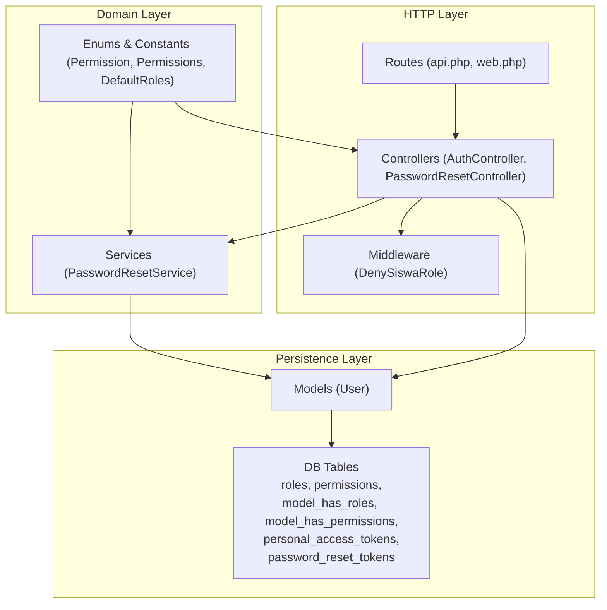
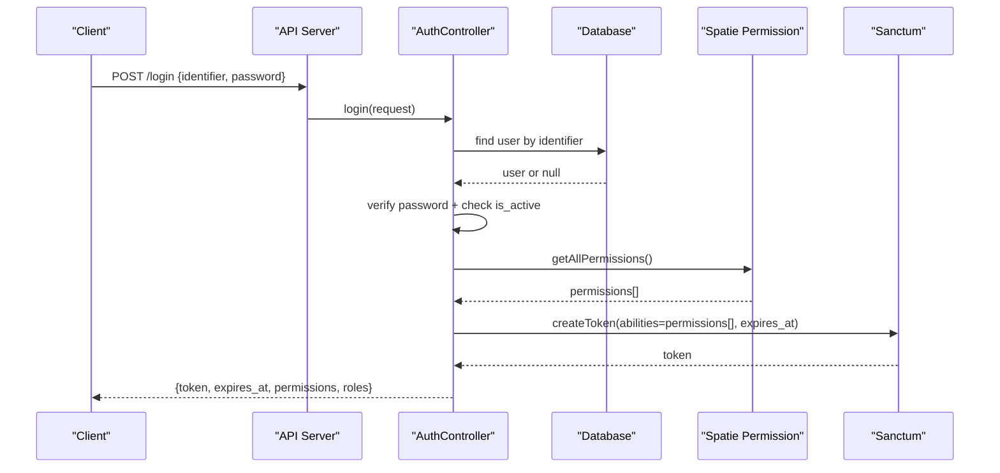
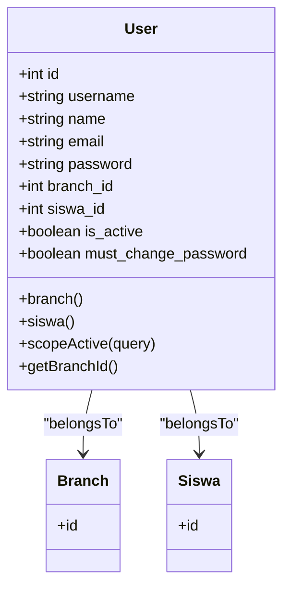
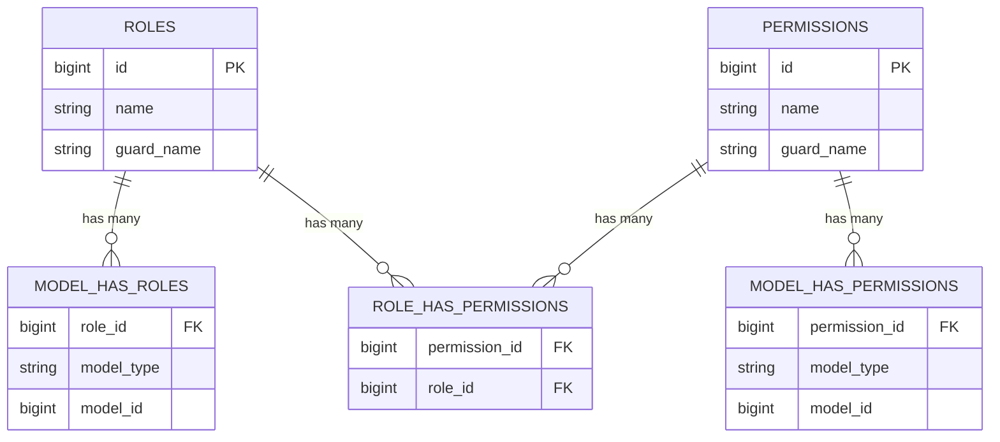
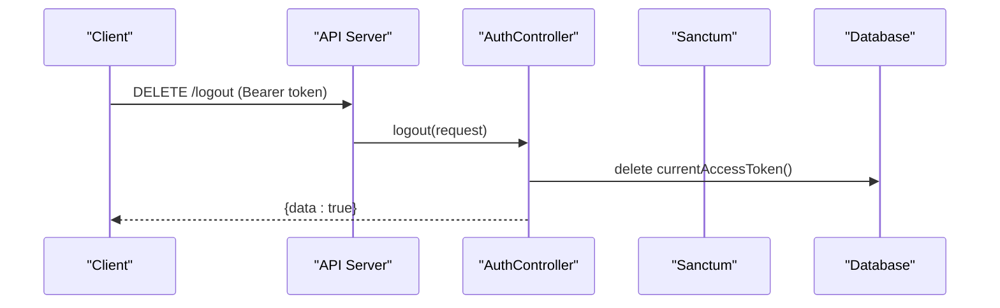
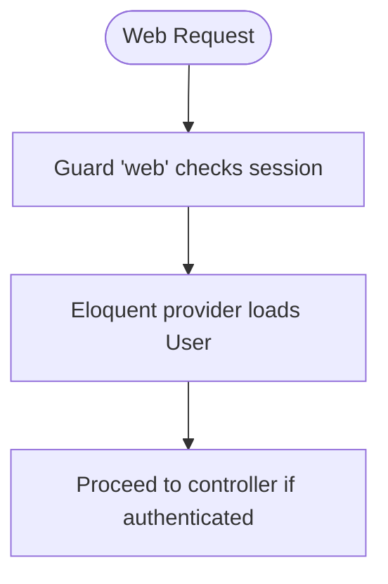
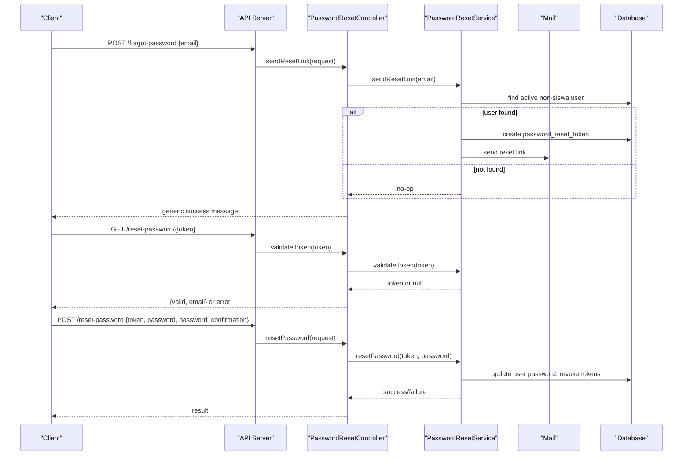
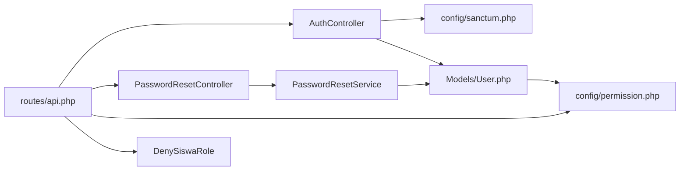

# Authentication & Authorization

<cite>
**Referenced Files in This Document**
- [User.php](file://backend/app/Models/User.php)
- [auth.php](file://backend/config/auth.php)
- [sanctum.php](file://backend/config/sanctum.php)
- [permission.php](file://backend/config/permission.php)
- [AuthController.php](file://backend/app/Http/Controllers/AuthController.php)
- [PasswordResetController.php](file://backend/app/Http/Controllers/PasswordResetController.php)
- [PasswordResetService.php](file://backend/app/Services/PasswordResetService.php)
- [DenySiswaRole.php](file://backend/app/Http/Middleware/DenySiswaRole.php)
- [api.php](file://backend/routes/api.php)
- [web.php](file://backend/routes/web.php)
- [2026_05_01_234841_create_permission_tables.php](file://backend/database/migrations/2026_05_01_234841_create_permission_tables.php)
- [2026_05_02_000000_create_personal_access_tokens_table.php](file://backend/database/migrations/2026_05_02_000000_create_personal_access_tokens_table.php)
- [2026_05_26_210001_create_password_reset_tokens_table.php](file://backend/database/migrations/2026_05_26_210001_create_password_reset_tokens_table.php)
- [Permissions.php](file://backend/app/Constant/Permissions.php)
- [Permission.php](file://backend/app/Enum/Permission.php)
- [DefaultRoles.php](file://backend/app/Enum/DefaultRoles.php)
</cite>

## Table of Contents
1. Introduction
2. Project Structure
3. Core Components
4. Architecture Overview
5. Detailed Component Analysis
6. Dependency Analysis
7. Performance Considerations
8. Troubleshooting Guide
9. Conclusion

## Introduction
This document explains the authentication and authorization system for the Handayani application. It covers:
- User model structure and branch association
- Role-based access control using Spatie Laravel Permission
- API authentication via Laravel Sanctum tokens
- Session-based authentication for web interfaces
- Password reset flow
- Multi-branch data isolation strategy
- Practical examples for custom permissions, role checks, and route protection
- Login flow, token management, and security considerations

## Project Structure
The backend implements a layered approach:
- Models define entities and relationships (e.g., User with branch_id)
- Controllers handle HTTP requests and orchestrate services
- Services encapsulate business logic (e.g., password reset)
- Middleware enforces access rules (e.g., deny siswa role)
- Routes group endpoints by guard and permission requirements
- Config files define guards, providers, Sanctum behavior, and Spatie Permission settings
- Migrations create tables for roles, permissions, personal access tokens, and password reset tokens

**Diagram sources**
- [api.php:1-345](file://backend/routes/api.php#L1-L345)
- [web.php:1-11](file://backend/routes/web.php#L1-L11)
- [AuthController.php:1-103](file://backend/app/Http/Controllers/AuthController.php#L1-L103)
- [PasswordResetController.php:1-78](file://backend/app/Http/Controllers/PasswordResetController.php#L1-L78)
- [PasswordResetService.php:1-100](file://backend/app/Services/PasswordResetService.php#L1-L100)
- [DenySiswaRole.php:1-45](file://backend/app/Http/Middleware/DenySiswaRole.php#L1-L45)
- [User.php:1-74](file://backend/app/Models/User.php#L1-L74)
- [Permission.php:1-113](file://backend/app/Enum/Permission.php#L1-L113)
- [Permissions.php:1-114](file://backend/app/Constant/Permissions.php#L1-L114)
- [DefaultRoles.php:1-12](file://backend/app/Enum/DefaultRoles.php#L1-L12)
- [2026_05_01_234841_create_permission_tables.php:1-138](file://backend/database/migrations/2026_05_01_234841_create_permission_tables.php#L1-L138)
- [2026_05_02_000000_create_personal_access_tokens_table.php:1-34](file://backend/database/migrations/2026_05_02_000000_create_personal_access_tokens_table.php#L1-L34)
- [2026_05_26_210001_create_password_reset_tokens_table.php:1-32](file://backend/database/migrations/2026_05_26_210001_create_password_reset_tokens_table.php#L1-L32)

**Section sources**
- [api.php:1-345](file://backend/routes/api.php#L1-L345)
- [web.php:1-11](file://backend/routes/web.php#L1-L11)

## Core Components
- User model:
  - Uses HasRoles (Spatie) and HasApiTokens (Sanctum)
  - Fields include username, name, email, password, branch_id, siswa_id, is_active, must_change_password
  - Relationships: belongsTo Branch, belongsTo Siswa
  - Email normalization on set; active scope; helper to get branch_id
- Guards and providers:
  - Web guard uses session driver and Eloquent provider backed by User model
- Sanctum configuration:
  - Stateful domains for SPA cookies
  - Guard list includes web
  - Token expiration minutes
  - Middleware stack for session auth and CSRF
- Spatie Permission configuration:
  - Models and table names configured
  - Cache settings enabled
  - Wildcard permissions disabled by default
- Auth controller:
  - Register, login, logout
  - Login returns Sanctum token with abilities derived from user’s permissions
  - Enforces account active status and revokes existing tokens on re-login
- Password reset:
  - Controller validates input and delegates to service
  - Service creates short-lived tokens, sends email, resets password, invalidates tokens
- Middleware:
  - DenySiswaRole blocks admin routes for users who only have the siswa role
- Enums and constants:
  - Centralized permission names and default roles for consistency

**Section sources**
- [User.php:1-74](file://backend/app/Models/User.php#L1-L74)
- [auth.php:1-116](file://backend/config/auth.php#L1-L116)
- [sanctum.php:1-85](file://backend/config/sanctum.php#L1-L85)
- [permission.php:1-220](file://backend/config/permission.php#L1-L220)
- [AuthController.php:1-103](file://backend/app/Http/Controllers/AuthController.php#L1-L103)
- [PasswordResetController.php:1-78](file://backend/app/Http/Controllers/PasswordResetController.php#L1-L78)
- [PasswordResetService.php:1-100](file://backend/app/Services/PasswordResetService.php#L1-L100)
- [DenySiswaRole.php:1-45](file://backend/app/Http/Middleware/DenySiswaRole.php#L1-L45)
- [Permission.php:1-113](file://backend/app/Enum/Permission.php#L1-L113)
- [Permissions.php:1-114](file://backend/app/Constant/Permissions.php#L1-L114)
- [DefaultRoles.php:1-12](file://backend/app/Enum/DefaultRoles.php#L1-L12)

## Architecture Overview
The system combines session-based web authentication and token-based API authentication:
- Web sessions use the default guard and cookie-based state
- API endpoints are protected by Sanctum middleware and require valid bearer tokens
- Authorization is enforced via Spatie Permission middleware at route level
- Admin routes additionally enforce DenySiswaRole as defense-in-depth

**Diagram sources**
- [api.php:36-47](file://backend/routes/api.php#L36-L47)
- [AuthController.php:41-94](file://backend/app/Http/Controllers/AuthController.php#L41-L94)
- [sanctum.php:1-85](file://backend/config/sanctum.php#L1-L85)
- [permission.php:1-220](file://backend/config/permission.php#L1-L220)

## Detailed Component Analysis

### User Model and Branch Isolation
- The User model integrates Spatie Roles and Sanctum tokens
- branch_id links each user to a specific branch
- Use the branch relationship to scope queries and enforce multi-branch data isolation in controllers/services
- Example pattern: scope all queries by current user’s branch_id unless explicitly allowed for cross-branch operations

**Diagram sources**
- [User.php:1-74](file://backend/app/Models/User.php#L1-L74)

**Section sources**
- [User.php:1-74](file://backend/app/Models/User.php#L1-L74)

### Role-Based Access Control (RBAC) with Spatie
- RBAC is implemented via Spatie Permission package
- Configuration defines models and table names; cache is enabled
- Migration creates roles, permissions, and pivot tables
- Route-level protection uses permission middleware extensively
- Default roles and centralized permission names ensure consistent usage

**Diagram sources**
- [2026_05_01_234841_create_permission_tables.php:1-138](file://backend/database/migrations/2026_05_01_234841_create_permission_tables.php#L1-L138)
- [permission.php:1-220](file://backend/config/permission.php#L1-L220)

**Section sources**
- [permission.php:1-220](file://backend/config/permission.php#L1-L220)
- [2026_05_01_234841_create_permission_tables.php:1-138](file://backend/database/migrations/2026_05_01_234841_create_permission_tables.php#L1-L138)
- [Permission.php:1-113](file://backend/app/Enum/Permission.php#L1-L113)
- [Permissions.php:1-114](file://backend/app/Constant/Permissions.php#L1-L114)
- [DefaultRoles.php:1-12](file://backend/app/Enum/DefaultRoles.php#L1-L12)

### API Authentication with Sanctum Tokens
- Login endpoint issues a Sanctum token with abilities equal to the user’s permissions
- Token expiration is configurable; defaults to 480 minutes
- Logout deletes the current access token
- All protected routes are wrapped under auth:sanctum middleware

**Diagram sources**
- [api.php:47-52](file://backend/routes/api.php#L47-L52)
- [AuthController.php:96-101](file://backend/app/Http/Controllers/AuthController.php#L96-L101)
- [sanctum.php:1-85](file://backend/config/sanctum.php#L1-L85)
- [2026_05_02_000000_create_personal_access_tokens_table.php:1-34](file://backend/database/migrations/2026_05_02_000000_create_personal_access_tokens_table.php#L1-L34)

**Section sources**
- [AuthController.php:41-101](file://backend/app/Http/Controllers/AuthController.php#L41-L101)
- [sanctum.php:1-85](file://backend/config/sanctum.php#L1-L85)
- [api.php:47-52](file://backend/routes/api.php#L47-L52)
- [2026_05_02_000000_create_personal_access_tokens_table.php:1-34](file://backend/database/migrations/2026_05_02_000000_create_personal_access_tokens_table.php#L1-L34)

### Session-Based Authentication for Web Interfaces
- The web guard uses the session driver and Eloquent provider
- Sanctum supports stateful domains for first-party SPAs via cookies
- CSRF validation is included in Sanctum middleware stack

**Diagram sources**
- [auth.php:1-116](file://backend/config/auth.php#L1-L116)
- [sanctum.php:1-85](file://backend/config/sanctum.php#L1-L85)

**Section sources**
- [auth.php:1-116](file://backend/config/auth.php#L1-L116)
- [sanctum.php:1-85](file://backend/config/sanctum.php#L1-L85)

### Password Reset Flow
- Public endpoints allow requesting a reset link, validating a token, and resetting the password
- Anti-enumeration: same response regardless of whether the email exists
- Siswa accounts cannot reset passwords via this flow
- On successful reset, all existing tokens are revoked

**Diagram sources**
- [api.php:38-41](file://backend/routes/api.php#L38-L41)
- [PasswordResetController.php:1-78](file://backend/app/Http/Controllers/PasswordResetController.php#L1-L78)
- [PasswordResetService.php:1-100](file://backend/app/Services/PasswordResetService.php#L1-L100)
- [2026_05_26_210001_create_password_reset_tokens_table.php:1-32](file://backend/database/migrations/2026_05_26_210001_create_password_reset_tokens_table.php#L1-L32)

**Section sources**
- [PasswordResetController.php:1-78](file://backend/app/Http/Controllers/PasswordResetController.php#L1-L78)
- [PasswordResetService.php:1-100](file://backend/app/Services/PasswordResetService.php#L1-L100)
- [api.php:38-41](file://backend/routes/api.php#L38-L41)
- [2026_05_26_210001_create_password_reset_tokens_table.php:1-32](file://backend/database/migrations/2026_05_26_210001_create_password_reset_tokens_table.php#L1-L32)

### Multi-Branch Data Isolation Strategy
- Users are associated with a branch via branch_id
- To isolate data per branch:
  - Scope database queries by current user’s branch_id in controllers/services
  - For read-only views, filter collections by branch before rendering
  - For write operations, validate that the target resource belongs to the user’s branch
- Cross-branch access should be explicitly allowed only for superadmin or designated roles and documented accordingly

[No sources needed since this section provides general guidance]

### Practical Examples and Best Practices
- Protecting routes:
  - Wrap endpoints in auth:sanctum and apply permission middleware per action
  - Group admin routes under deny_siswa middleware to block siswa-only accounts
- Checking permissions in code:
  - Use $user->can('permission-name') or $user->hasAnyPermission([...])
  - Derive abilities from roles when issuing tokens to align API enforcement
- Custom permissions:
  - Add new entries to the Permission enum and map them in Permissions constants
  - Seed roles and assign permissions consistently
- Extending authorization:
  - Create additional middleware for domain-specific checks (e.g., branch ownership)
  - Apply policy-like checks in services for complex scenarios

**Section sources**
- [api.php:47-318](file://backend/routes/api.php#L47-L318)
- [DenySiswaRole.php:1-45](file://backend/app/Http/Middleware/DenySiswaRole.php#L1-L45)
- [Permission.php:1-113](file://backend/app/Enum/Permission.php#L1-L113)
- [Permissions.php:1-114](file://backend/app/Constant/Permissions.php#L1-L114)

## Dependency Analysis
Key dependencies and interactions:
- AuthController depends on IdentifierService for flexible login identifiers and on Sanctum for token issuance
- PasswordResetController delegates to PasswordResetService for token lifecycle and email dispatch
- Routes declare middleware chains: auth:sanctum, permission, deny_siswa
- User model integrates Spatie Roles and Sanctum traits
- Sanctum config ties into the web guard and CSRF middleware
- Spatie Permission config controls caching and table mapping

**Diagram sources**
- [api.php:1-345](file://backend/routes/api.php#L1-L345)
- [AuthController.php:1-103](file://backend/app/Http/Controllers/AuthController.php#L1-L103)
- [PasswordResetController.php:1-78](file://backend/app/Http/Controllers/PasswordResetController.php#L1-L78)
- [PasswordResetService.php:1-100](file://backend/app/Services/PasswordResetService.php#L1-L100)
- [User.php:1-74](file://backend/app/Models/User.php#L1-L74)
- [sanctum.php:1-85](file://backend/config/sanctum.php#L1-L85)
- [permission.php:1-220](file://backend/config/permission.php#L1-L220)
- [DenySiswaRole.php:1-45](file://backend/app/Http/Middleware/DenySiswaRole.php#L1-L45)

**Section sources**
- [api.php:1-345](file://backend/routes/api.php#L1-L345)
- [AuthController.php:1-103](file://backend/app/Http/Controllers/AuthController.php#L1-L103)
- [PasswordResetController.php:1-78](file://backend/app/Http/Controllers/PasswordResetController.php#L1-L78)
- [PasswordResetService.php:1-100](file://backend/app/Services/PasswordResetService.php#L1-L100)
- [User.php:1-74](file://backend/app/Models/User.php#L1-L74)
- [sanctum.php:1-85](file://backend/config/sanctum.php#L1-L85)
- [permission.php:1-220](file://backend/config/permission.php#L1-L220)
- [DenySiswaRole.php:1-45](file://backend/app/Http/Middleware/DenySiswaRole.php#L1-L45)

## Performance Considerations
- Permission caching:
  - Spatie Permission caches permissions for 24 hours by default; consider adjusting cache store and expiration based on workload
- Token expiration:
  - Sanctum token expiration is configurable; balance security vs. UX by tuning expiration minutes
- Database scoping:
  - Always scope queries by branch_id to avoid unnecessary scans and prevent cross-branch leakage
- Token cleanup:
  - Revoke expired tokens on login and after password reset to keep storage lean

[No sources needed since this section provides general guidance]

## Troubleshooting Guide
Common issues and resolutions:
- Login fails with “username or password is wrong”:
  - Verify credentials and ensure the account is active
- “Akun tidak aktif” error:
  - Account is inactive; contact administrator to activate
- 403 Forbidden on admin routes:
  - User may only have the siswa role; DenySiswaRole blocks admin access
- Token not accepted:
  - Ensure client sends Bearer token and that Sanctum stateful domains include the frontend host if using cookies
- Password reset link not received:
  - Check mail configuration and ensure the email is registered and belongs to an active non-siswa user
- Permission denied:
  - Confirm the user has the required role/permission; verify route middleware and permission names

**Section sources**
- [AuthController.php:41-94](file://backend/app/Http/Controllers/AuthController.php#L41-L94)
- [DenySiswaRole.php:1-45](file://backend/app/Http/Middleware/DenySiswaRole.php#L1-L45)
- [PasswordResetController.php:1-78](file://backend/app/Http/Controllers/PasswordResetController.php#L1-L78)
- [PasswordResetService.php:1-100](file://backend/app/Services/PasswordResetService.php#L1-L100)
- [sanctum.php:1-85](file://backend/config/sanctum.php#L1-L85)

## Conclusion
Handayani’s authentication and authorization combine robust mechanisms:
- Session-based web auth for traditional flows
- Sanctum tokens for API clients with fine-grained abilities
- Spatie Permission for scalable RBAC with clear route-level enforcement
- Defense-in-depth via DenySiswaRole middleware
- Secure password reset with anti-enumeration and token revocation
Adhering to branch scoping and centralized permission definitions ensures maintainability and security across the system.