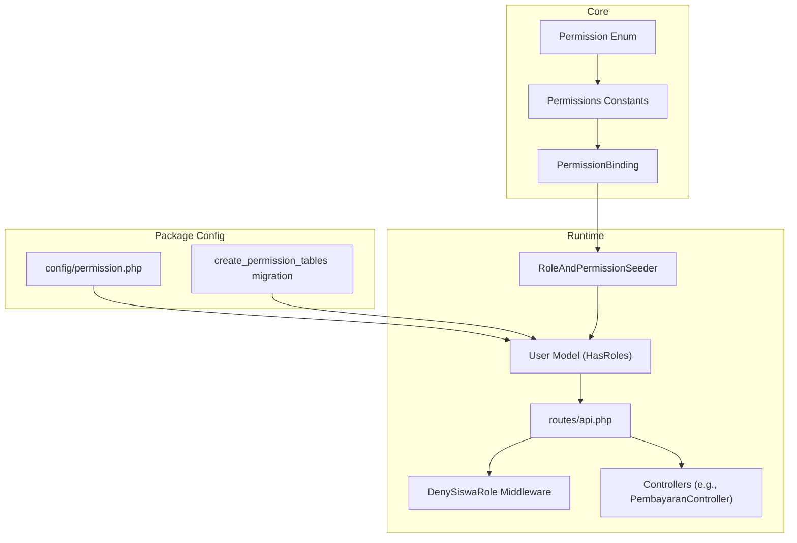
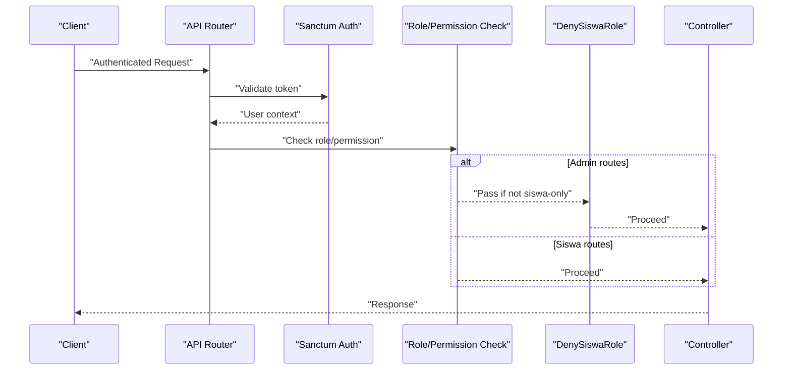
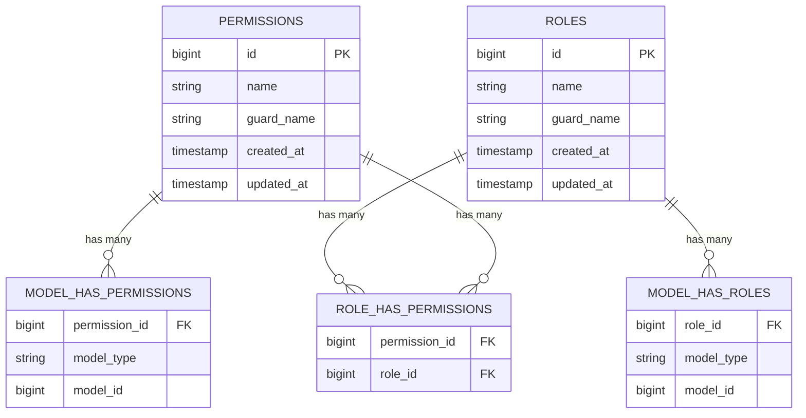
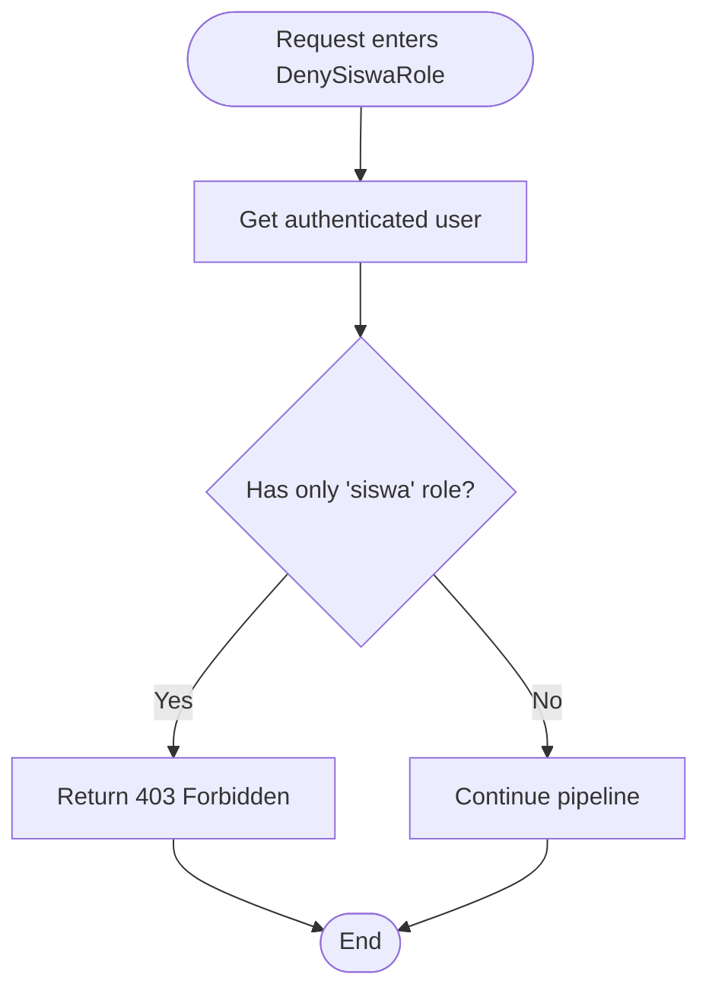
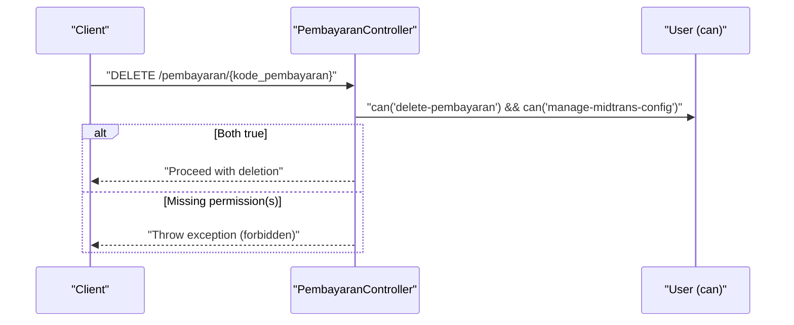
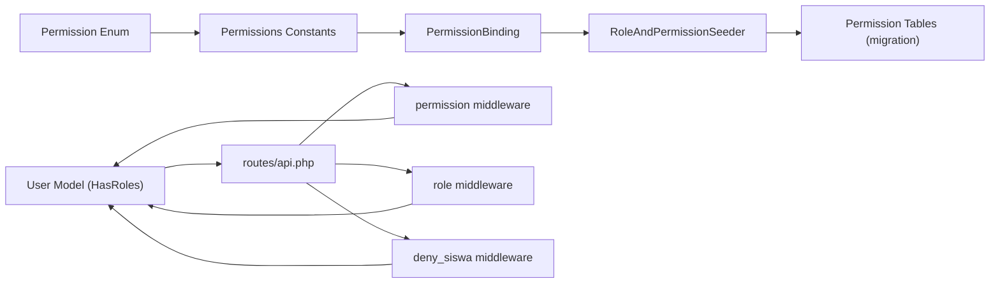

# Permission System & Access Control

<cite>
**Referenced Files in This Document**
- [Permission.php](file://backend/app/Enum/Permission.php)
- [Permissions.php](file://backend/app/Constant/Permissions.php)
- [PermissionBinding.php](file://backend/app/Constant/PermissionBinding.php)
- [DenySiswaRole.php](file://backend/app/Http/Middleware/DenySiswaRole.php)
- [api.php](file://backend/routes/api.php)
- [User.php](file://backend/app/Models/User.php)
- [permission.php](file://backend/config/permission.php)
- [2026_05_01_234841_create_permission_tables.php](file://backend/database/migrations/2026_05_01_234841_create_permission_tables.php)
- [RoleAndPermissionSeeder.php](file://backend/database/seeders/RoleAndPermissionSeeder.php)
- [PembayaranController.php](file://backend/app/Http/Controllers/PembayaranController.php)
</cite>

## Table of Contents
1. [Introduction](#introduction)
2. [Project Structure](#project-structure)
3. [Core Components](#core-components)
4. [Architecture Overview](#architecture-overview)
5. [Detailed Component Analysis](#detailed-component-analysis)
6. [Dependency Analysis](#dependency-analysis)
7. [Performance Considerations](#performance-considerations)
8. [Troubleshooting Guide](#troubleshooting-guide)
9. [Conclusion](#conclusion)
10. [Appendices](#appendices)

## Introduction
This document explains the permission system and access control mechanisms in Handayani. It covers:
- The permission hierarchy defined by the Permission enum and Permissions constants
- How granular permissions are organized for modules such as siswa, tagihan, pembayaran, and laporan
- Middleware implementation to protect routes and enforce access controls
- How to implement custom permissions, check authorization in controllers and views, and render UI conditionally
- Practical examples for creating new permissions, assigning them to roles, and implementing conditional access logic
- Security-related middleware including DenySiswaRole
- Permission caching strategies and performance optimization techniques

## Project Structure
The permission system is implemented using a combination of:
- A central Permission enum defining all permission names
- Constants that group permissions per module
- Spatie Laravel Permission package configuration and migrations
- Route-level middleware enforcing role and permission checks
- Seeders that create default roles and assign permissions
- Controllers performing additional business-specific authorization checks

**Diagram sources**
- [Permission.php:1-113](file://backend/app/Enum/Permission.php#L1-L113)
- [Permissions.php:1-114](file://backend/app/Constant/Permissions.php#L1-L114)
- [PermissionBinding.php:1-27](file://backend/app/Constant/PermissionBinding.php#L1-L27)
- [permission.php:1-220](file://backend/config/permission.php#L1-L220)
- [2026_05_01_234841_create_permission_tables.php:1-138](file://backend/database/migrations/2026_05_01_234841_create_permission_tables.php#L1-L138)
- [User.php:1-74](file://backend/app/Models/User.php#L1-L74)
- [DenySiswaRole.php:1-45](file://backend/app/Http/Middleware/DenySiswaRole.php#L1-L45)
- [api.php:1-345](file://backend/routes/api.php#L1-L345)
- [RoleAndPermissionSeeder.php:1-61](file://backend/database/seeders/RoleAndPermissionSeeder.php#L1-L61)
- [PembayaranController.php:260-270](file://backend/app/Http/Controllers/PembayaranController.php#L260-L270)

**Section sources**
- [Permission.php:1-113](file://backend/app/Enum/Permission.php#L1-L113)
- [Permissions.php:1-114](file://backend/app/Constant/Permissions.php#L1-L114)
- [PermissionBinding.php:1-27](file://backend/app/Constant/PermissionBinding.php#L1-L27)
- [permission.php:1-220](file://backend/config/permission.php#L1-L220)
- [2026_05_01_234841_create_permission_tables.php:1-138](file://backend/database/migrations/2026_05_01_234841_create_permission_tables.php#L1-L138)
- [User.php:1-74](file://backend/app/Models/User.php#L1-L74)
- [DenySiswaRole.php:1-45](file://backend/app/Http/Middleware/DenySiswaRole.php#L1-L45)
- [api.php:1-345](file://backend/routes/api.php#L1-L345)
- [RoleAndPermissionSeeder.php:1-61](file://backend/database/seeders/RoleAndPermissionSeeder.php#L1-L61)
- [PembayaranController.php:260-270](file://backend/app/Http/Controllers/PembayaranController.php#L260-L270)

## Core Components
- Permission enum: Central source of truth for all permission identifiers across modules (users, siswa, kelas, kategori, pengeluaran, pembayaran, jenis_tagihan, tagihan, laporan, roles/permissions management, tahun ajaran, kenaikan kelas, akun siswa, import/export, dashboard, approval workflow, branch, midtrans).
- Permissions constants: Grouped mappings per module for consistent usage in seeders and binding logic.
- PermissionBinding: Aggregates admin-level permissions from multiple module groups.
- Spatie Permission config and migrations: Provide tables and runtime behavior for roles, permissions, and their relationships.
- User model: Uses HasRoles trait to integrate with Spatie Permission.
- Route protection: Uses auth:sanctum, role, permission, and deny_siswa middleware on API routes.
- Seeders: Create default roles and assign permissions based on enums and bindings.
- Controller-level checks: Additional business-specific authorization guards.

**Section sources**
- [Permission.php:1-113](file://backend/app/Enum/Permission.php#L1-L113)
- [Permissions.php:1-114](file://backend/app/Constant/Permissions.php#L1-L114)
- [PermissionBinding.php:1-27](file://backend/app/Constant/PermissionBinding.php#L1-L27)
- [permission.php:1-220](file://backend/config/permission.php#L1-L220)
- [2026_05_01_234841_create_permission_tables.php:1-138](file://backend/database/migrations/2026_05_01_234841_create_permission_tables.php#L1-L138)
- [User.php:1-74](file://backend/app/Models/User.php#L1-L74)
- [api.php:1-345](file://backend/routes/api.php#L1-L345)
- [RoleAndPermissionSeeder.php:1-61](file://backend/database/seeders/RoleAndPermissionSeeder.php#L1-L61)
- [PembayaranController.php:260-270](file://backend/app/Http/Controllers/PembayaranController.php#L260-L270)

## Architecture Overview
The access control architecture combines declarative route-level enforcement with runtime checks:
- Authentication via Sanctum
- Role-based gating at route level (role:siswa)
- Permission-based gating at route level (permission:view-dashboard, etc.)
- Defense-in-depth via DenySiswaRole middleware to block siswa-only users from admin routes
- Business-specific authorization inside controllers (e.g., requiring multiple permissions for sensitive operations)

**Diagram sources**
- [api.php:47-318](file://backend/routes/api.php#L47-L318)
- [DenySiswaRole.php:1-45](file://backend/app/Http/Middleware/DenySiswaRole.php#L1-L45)
- [User.php:1-74](file://backend/app/Models/User.php#L1-L74)

## Detailed Component Analysis

### Permission Hierarchy and Module Organization
- Permission enum defines canonical permission strings used throughout the application.
- Permissions constants organize these into logical groups per module:
  - Users: view, create, read, update, delete
  - Siswa: view, create, read, update, delete
  - Kelas: view, create, read, update, delete
  - Kategori: view, create, read, update, delete
  - Pengeluaran: view, create, read, update, delete
  - Pembayaran: view, delete, print kwitansi
  - Jenis Tagihan: view, create, read, update, delete
  - Tagihan: view, create, read, update, delete
  - Laporan: view kas harian, view rekap bulanan, export laporan
  - Roles/Permissions management: view/create/update/delete roles; attach/detach roles; view/attach/detach permissions
  - Tahun Ajaran: manage
  - Kenaikan Kelas: manage
  - Akun Siswa: manage
  - Import/Export: import-data, export-data
  - Dashboard: view-dashboard, view-own-billing
  - Approval Workflow: create request, approve, disburse
  - Branch: view, create, read, update, delete
  - Midtrans: pay-online, view transactions, sync transactions, manage config

These groupings are consumed by seeders and binding logic to assign permissions to roles consistently.

**Section sources**
- [Permission.php:1-113](file://backend/app/Enum/Permission.php#L1-L113)
- [Permissions.php:1-114](file://backend/app/Constant/Permissions.php#L1-L114)
- [PermissionBinding.php:1-27](file://backend/app/Constant/PermissionBinding.php#L1-L27)

### Database Schema and Package Configuration
- Migrations create standard Spatie Permission tables: permissions, roles, model_has_permissions, model_has_roles, role_has_permissions.
- Configuration enables permission checking registration, sets cache expiration, key, and store.

**Diagram sources**
- [2026_05_01_234841_create_permission_tables.php:26-115](file://backend/database/migrations/2026_05_01_234841_create_permission_tables.php#L26-L115)
- [permission.php:196-218](file://backend/config/permission.php#L196-L218)

**Section sources**
- [2026_05_01_234841_create_permission_tables.php:1-138](file://backend/database/migrations/2026_05_01_234841_create_permission_tables.php#L1-L138)
- [permission.php:1-220](file://backend/config/permission.php#L1-L220)

### User Model Integration
- The User model uses HasRoles to enable role and permission checks via methods like can(), hasRole(), getRoleNames().

**Section sources**
- [User.php:1-74](file://backend/app/Models/User.php#L1-L74)

### Route-Level Protection and Enforcement
- All protected endpoints require Sanctum authentication.
- Role-based route: role:siswa for student-facing endpoints.
- Permission-based routes: each endpoint guarded by specific permission middleware.
- Admin panel routes are wrapped with deny_siswa middleware to prevent siswa-only users from accessing administrative functionality.

Examples include:
- Dashboard summary endpoints protected by view-dashboard
- Siswa/Wali dashboard protected by view-own-billing
- Siswa-only endpoints protected by role:siswa
- Admin user management endpoints protected by individual user permissions
- Tagihan, pembayaran, laporan, branches, import/export, and Midtrans endpoints protected accordingly

**Section sources**
- [api.php:47-318](file://backend/routes/api.php#L47-L318)

### DenySiswaRole Middleware
- Purpose: Defense-in-depth to ensure users who only have the siswa role cannot access admin routes even if permission middleware is misconfigured or missing.
- Behavior: If the authenticated user has exactly one role and it is siswa, returns 403 Forbidden; otherwise proceeds.

**Diagram sources**
- [DenySiswaRole.php:1-45](file://backend/app/Http/Middleware/DenySiswaRole.php#L1-L45)

**Section sources**
- [DenySiswaRole.php:1-45](file://backend/app/Http/Middleware/DenySiswaRole.php#L1-L45)

### Controller-Level Authorization Examples
- Some operations require multiple permissions. For example, deleting an online Midtrans payment requires both delete-pembayaran and manage-midtrans-config.

**Diagram sources**
- [PembayaranController.php:260-270](file://backend/app/Http/Controllers/PembayaranController.php#L260-L270)

**Section sources**
- [PembayaranController.php:260-270](file://backend/app/Http/Controllers/PembayaranController.php#L260-L270)

### Default Roles and Permission Assignment
- Seeders create default roles: superadmin, admin, user, siswa.
- Superadmin receives all permissions.
- Admin receives a curated set from PermissionBinding, excluding manage-midtrans-config.
- Siswa receives a minimal set: view-tagihan-siswa, view-own-billing, pay-tagihan-online, print-kwitansi.
- Cache is cleared before and after seeding to ensure consistency.

**Section sources**
- [RoleAndPermissionSeeder.php:1-61](file://backend/database/seeders/RoleAndPermissionSeeder.php#L1-L61)

## Dependency Analysis
The following diagram shows how components depend on each other:

**Diagram sources**
- [Permission.php:1-113](file://backend/app/Enum/Permission.php#L1-L113)
- [Permissions.php:1-114](file://backend/app/Constant/Permissions.php#L1-L114)
- [PermissionBinding.php:1-27](file://backend/app/Constant/PermissionBinding.php#L1-L27)
- [RoleAndPermissionSeeder.php:1-61](file://backend/database/seeders/RoleAndPermissionSeeder.php#L1-L61)
- [2026_05_01_234841_create_permission_tables.php:1-138](file://backend/database/migrations/2026_05_01_234841_create_permission_tables.php#L1-L138)
- [User.php:1-74](file://backend/app/Models/User.php#L1-L74)
- [api.php:1-345](file://backend/routes/api.php#L1-L345)
- [DenySiswaRole.php:1-45](file://backend/app/Http/Middleware/DenySiswaRole.php#L1-L45)

**Section sources**
- [Permission.php:1-113](file://backend/app/Enum/Permission.php#L1-L113)
- [Permissions.php:1-114](file://backend/app/Constant/Permissions.php#L1-L114)
- [PermissionBinding.php:1-27](file://backend/app/Constant/PermissionBinding.php#L1-L27)
- [RoleAndPermissionSeeder.php:1-61](file://backend/database/seeders/RoleAndPermissionSeeder.php#L1-L61)
- [2026_05_01_234841_create_permission_tables.php:1-138](file://backend/database/migrations/2026_05_01_234841_create_permission_tables.php#L1-L138)
- [User.php:1-74](file://backend/app/Models/User.php#L1-L74)
- [api.php:1-345](file://backend/routes/api.php#L1-L345)
- [DenySiswaRole.php:1-45](file://backend/app/Http/Middleware/DenySiswaRole.php#L1-L45)

## Performance Considerations
- Caching strategy:
  - Spatie Permission caches permissions for 24 hours by default.
  - Cache key and store are configurable.
  - Clearing cache during seeding ensures fresh state.
- Recommendations:
  - Use a persistent cache driver suitable for production (e.g., Redis or Memcached) to reduce database load.
  - Avoid frequent permission changes in hot paths; batch updates when possible.
  - Keep permission names stable to avoid cache invalidation churn.
  - Monitor cache hit rates and adjust expiration time if necessary.

**Section sources**
- [permission.php:196-218](file://backend/config/permission.php#L196-L218)
- [RoleAndPermissionSeeder.php:20-22](file://backend/database/seeders/RoleAndPermissionSeeder.php#L20-L22)
- [RoleAndPermissionSeeder.php:57-59](file://backend/database/seeders/RoleAndPermissionSeeder.php#L57-L59)

## Troubleshooting Guide
Common issues and resolutions:
- 403 Forbidden on admin routes for siswa accounts:
  - Expected due to DenySiswaRole middleware. Ensure the user has additional roles beyond siswa.
- Permission not recognized:
  - Verify the permission exists in the database and the cache is refreshed.
  - Run seeder to ensure permissions are created and assigned.
- Route still accessible without expected permission:
  - Confirm the route is within the correct middleware group and the permission name matches the enum value.
- Multiple permissions required for an operation:
  - Some controller actions enforce additional checks (e.g., delete online payments requires two permissions). Ensure the user holds all required permissions.

**Section sources**
- [DenySiswaRole.php:1-45](file://backend/app/Http/Middleware/DenySiswaRole.php#L1-L45)
- [api.php:47-318](file://backend/routes/api.php#L47-L318)
- [PembayaranController.php:260-270](file://backend/app/Http/Controllers/PembayaranController.php#L260-L270)
- [RoleAndPermissionSeeder.php:1-61](file://backend/database/seeders/RoleAndPermissionSeeder.php#L1-L61)

## Conclusion
Handayani’s permission system combines a clear, centralized definition of permissions with robust route-level enforcement and defense-in-depth safeguards. The design supports fine-grained access control across modules while maintaining performance through caching and predictable assignment via seeders. Following the patterns outlined here will help you extend permissions safely and consistently.

## Appendices

### How to Implement Custom Permissions
- Add a new case to the Permission enum with a unique string identifier.
- Optionally add a mapping entry in the appropriate Permissions constant group.
- Update PermissionBinding if the new permission should be included for admin roles.
- Assign the permission to roles in the seeder or via admin UI.
- Protect routes using the permission middleware or enforce checks in controllers/views.

**Section sources**
- [Permission.php:1-113](file://backend/app/Enum/Permission.php#L1-L113)
- [Permissions.php:1-114](file://backend/app/Constant/Permissions.php#L1-L114)
- [PermissionBinding.php:1-27](file://backend/app/Constant/PermissionBinding.php#L1-L27)
- [RoleAndPermissionSeeder.php:1-61](file://backend/database/seeders/RoleAndPermissionSeeder.php#L1-L61)
- [api.php:1-345](file://backend/routes/api.php#L1-L345)

### Checking Authorization in Controllers and Views
- In controllers: use $user->can('permission-name') or request()->user()->can(...) to gate logic.
- In Blade views: use @can('permission-name') directives to conditionally render UI elements.

[No sources needed since this section provides general guidance]

### Creating New Permissions and Assigning to Roles
- Define the permission in the enum.
- Include it in relevant constants/binding if applicable.
- Update the seeder to assign the permission to the desired roles.
- Clear cache and migrate if necessary.

**Section sources**
- [Permission.php:1-113](file://backend/app/Enum/Permission.php#L1-L113)
- [Permissions.php:1-114](file://backend/app/Constant/Permissions.php#L1-L114)
- [RoleAndPermissionSeeder.php:1-61](file://backend/database/seeders/RoleAndPermissionSeeder.php#L1-L61)

### Implementing Conditional Access Logic
- Route-level: wrap routes with permission middleware.
- Controller-level: combine multiple permission checks for sensitive operations.
- Middleware-level: apply broad restrictions (e.g., deny siswa-only users).

**Section sources**
- [api.php:47-318](file://backend/routes/api.php#L47-L318)
- [PembayaranController.php:260-270](file://backend/app/Http/Controllers/PembayaranController.php#L260-L270)
- [DenySiswaRole.php:1-45](file://backend/app/Http/Middleware/DenySiswaRole.php#L1-L45)