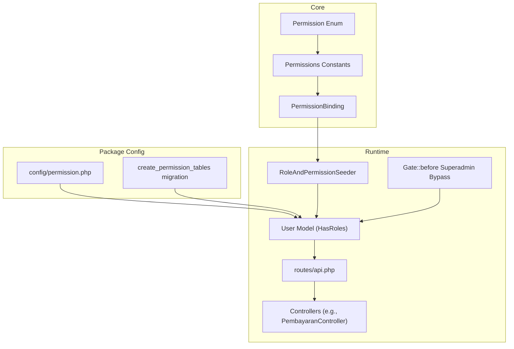
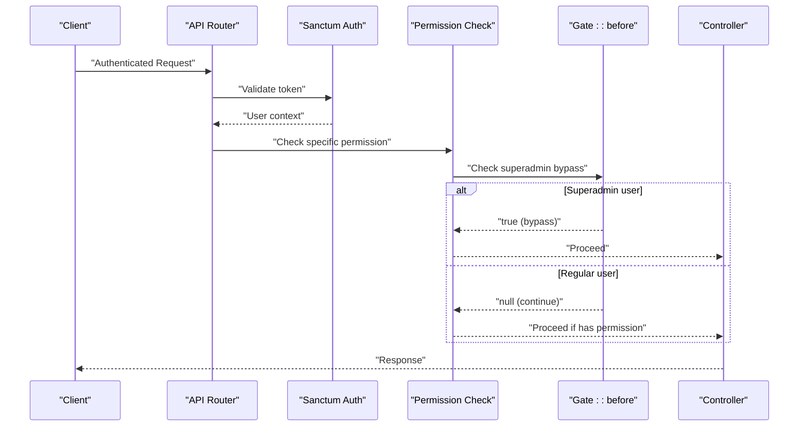
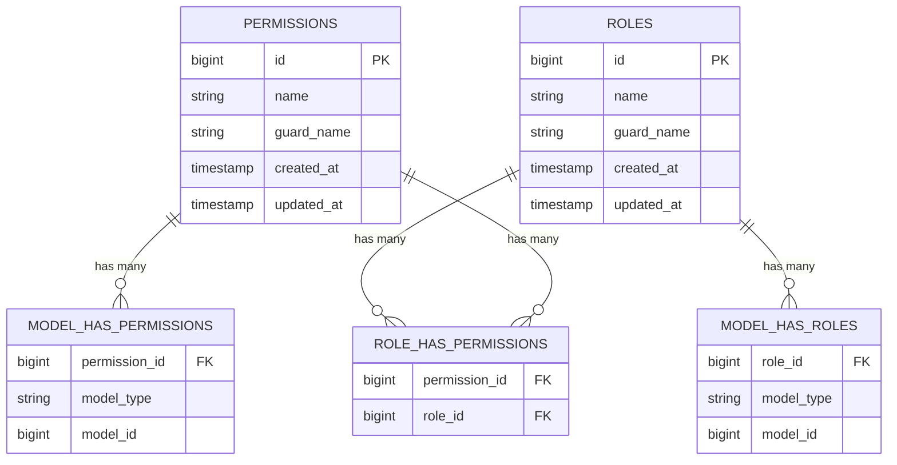
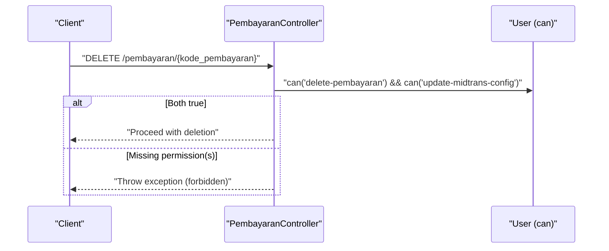
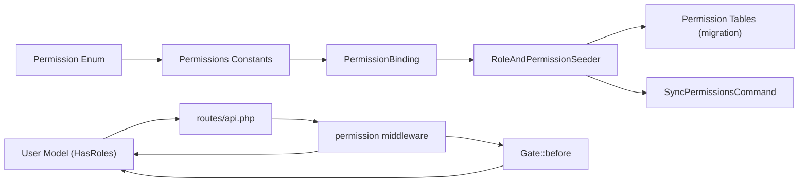

# Permission System & Access Control

<cite>
**Referenced Files in This Document**
- [Permission.php](file://backend/app/Enum/Permission.php)
- [Permissions.php](file://backend/app/Constant/Permissions.php)
- [PermissionBinding.php](file://backend/app/Constant/PermissionBinding.php)
- [api.php](file://backend/routes/api.php)
- [User.php](file://backend/app/Models/User.php)
- [permission.php](file://backend/config/permission.php)
- [2026_05_01_234841_create_permission_tables.php](file://backend/database/migrations/2026_05_01_234841_create_permission_tables.php)
- [RoleAndPermissionSeeder.php](file://backend/database/seeders/RoleAndPermissionSeeder.php)
- [PembayaranController.php](file://backend/app/Http/Controllers/PembayaranController.php)
- [AppServiceProvider.php](file://backend/app/Providers/AppServiceProvider.php)
- [SyncPermissionsCommand.php](file://backend/app/Console/Commands/SyncPermissionsCommand.php)
</cite>

## Update Summary
**Changes Made**
- Updated permission hierarchy to reflect granular CRUD operations replacing monolithic 'manage' permissions
- Added new permission categories for settings management (app settings, notification settings, notification logs)
- Removed DenySiswaRole middleware references as part of the shift to pure permission-based access control
- Updated route definitions to use permission-based access control instead of role-based middleware
- Enhanced documentation with new setting-related permissions and updated examples

## Table of Contents
1. [Introduction](#introduction)
2. [Project Structure](#project-structure)
3. [Core Components](#core-components)
4. [Architecture Overview](#architecture-overview)
5. [Detailed Component Analysis](#detailed-component-analysis)
6. [Dependency Analysis](#dependency-analysis)
7. [Performance Considerations](#performance-considerations)
8. [Troubleshooting Guide](#troubleshooting-guide)
9. [Conclusion](#conclusion)
10. [Appendices](#appendices)

## Introduction
This document explains the permission system and access control mechanisms in Handayani. The system has been overhauled to implement granular CRUD operations, replacing monolithic 'manage' permissions with fine-grained access controls. It covers:
- The permission hierarchy defined by the Permission enum and Permissions constants with granular CRUD operations
- How permissions are organized for modules such as siswa, tagihan, pembayaran, laporan, and new settings management
- Middleware implementation using Spatie Laravel Permission package for protecting routes and enforcing access controls
- How to implement custom permissions, check authorization in controllers and views, and render UI conditionally
- Practical examples for creating new permissions, assigning them to roles, and implementing conditional access logic
- Pure permission-based access control without role-specific middleware like DenySiswaRole
- Permission caching strategies and performance optimization techniques

## Project Structure
The permission system is implemented using a combination of:
- A central Permission enum defining all permission names with granular CRUD operations
- Constants that group permissions per module including new settings management categories
- Spatie Laravel Permission package configuration and migrations
- Route-level middleware enforcing permission checks using specific permission names
- Seeders that create default roles and assign permissions based on enums and bindings
- Controllers performing additional business-specific authorization checks

**Diagram sources**
- [Permission.php:1-128](file://backend/app/Enum/Permission.php#L1-L128)
- [Permissions.php:1-130](file://backend/app/Constant/Permissions.php#L1-L130)
- [PermissionBinding.php:1-28](file://backend/app/Constant/PermissionBinding.php#L1-L28)
- [permission.php:1-220](file://backend/config/permission.php#L1-L220)
- [2026_05_01_234841_create_permission_tables.php:1-138](file://backend/database/migrations/2026_05_01_234841_create_permission_tables.php#L1-L138)
- [User.php:1-74](file://backend/app/Models/User.php#L1-L74)
- [api.php:1-350](file://backend/routes/api.php#L1-L350)
- [RoleAndPermissionSeeder.php:1-61](file://backend/database/seeders/RoleAndPermissionSeeder.php#L1-L61)
- [AppServiceProvider.php:1-76](file://backend/app/Providers/AppServiceProvider.php#L1-L76)

**Section sources**
- [Permission.php:1-128](file://backend/app/Enum/Permission.php#L1-L128)
- [Permissions.php:1-130](file://backend/app/Constant/Permissions.php#L1-L130)
- [PermissionBinding.php:1-28](file://backend/app/Constant/PermissionBinding.php#L1-L28)
- [permission.php:1-220](file://backend/config/permission.php#L1-L220)
- [2026_05_01_234841_create_permission_tables.php:1-138](file://backend/database/migrations/2026_05_01_234841_create_permission_tables.php#L1-L138)
- [User.php:1-74](file://backend/app/Models/User.php#L1-L74)
- [api.php:1-350](file://backend/routes/api.php#L1-L350)
- [RoleAndPermissionSeeder.php:1-61](file://backend/database/seeders/RoleAndPermissionSeeder.php#L1-L61)
- [AppServiceProvider.php:1-76](file://backend/app/Providers/AppServiceProvider.php#L1-L76)

## Core Components
- Permission enum: Central source of truth for all permission identifiers across modules with granular CRUD operations (users, siswa, kelas, kategori, pengeluaran, pembayaran, jenis_tagihan, tagihan, laporan, roles/permissions management, tahun ajaran, kenaikan kelas, akun siswa, import/export, dashboard, approval workflow, branch, midtrans, and new settings management).
- Permissions constants: Grouped mappings per module for consistent usage in seeders and binding logic, including new settings management categories.
- PermissionBinding: Aggregates admin-level permissions from multiple module groups, now including settings permissions.
- Spatie Permission config and migrations: Provide tables and runtime behavior for roles, permissions, and their relationships.
- User model: Uses HasRoles trait to integrate with Spatie Permission.
- Route protection: Uses auth:sanctum and permission middleware on API routes with specific permission names.
- Seeders: Create default roles and assign permissions based on enums and bindings.
- Controller-level checks: Additional business-specific authorization guards.
- Gate superadmin bypass: Provides automatic access for superadmin users.

**Updated** Replaced monolithic 'manage' permissions with granular CRUD operations and added new settings management permissions.

**Section sources**
- [Permission.php:1-128](file://backend/app/Enum/Permission.php#L1-L128)
- [Permissions.php:1-130](file://backend/app/Constant/Permissions.php#L1-L130)
- [PermissionBinding.php:1-28](file://backend/app/Constant/PermissionBinding.php#L1-L28)
- [permission.php:1-220](file://backend/config/permission.php#L1-L220)
- [2026_05_01_234841_create_permission_tables.php:1-138](file://backend/database/migrations/2026_05_01_234841_create_permission_tables.php#L1-L138)
- [User.php:1-74](file://backend/app/Models/User.php#L1-L74)
- [api.php:1-350](file://backend/routes/api.php#L1-L350)
- [RoleAndPermissionSeeder.php:1-61](file://backend/database/seeders/RoleAndPermissionSeeder.php#L1-L61)
- [AppServiceProvider.php:1-76](file://backend/app/Providers/AppServiceProvider.php#L1-L76)

## Architecture Overview
The access control architecture combines declarative route-level enforcement with runtime checks:
- Authentication via Sanctum
- Permission-based gating at route level using specific permission middleware (no role-based middleware)
- Defense-in-depth via Gate::before for superadmin bypass
- Business-specific authorization inside controllers (e.g., requiring multiple permissions for sensitive operations)

**Diagram sources**
- [api.php:47-350](file://backend/routes/api.php#L47-L350)
- [User.php:1-74](file://backend/app/Models/User.php#L1-L74)
- [AppServiceProvider.php:52-57](file://backend/app/Providers/AppServiceProvider.php#L52-L57)

## Detailed Component Analysis

### Permission Hierarchy and Module Organization
- Permission enum defines canonical permission strings used throughout the application with granular CRUD operations.
- Permissions constants organize these into logical groups per module:
  - Users: view-user, create-user, read-user, update-user, delete-user
  - Siswa: view-siswa, create-siswa, read-siswa, update-siswa, delete-siswa
  - Kelas: view-kelas, create-kelas, read-kelas, update-kelas, delete-kelas
  - Kategori: view-kategori, create-kategori, read-kategori, update-kategori, delete-kategori
  - Pengeluaran: view-pengeluaran, create-pengeluaran, read-pengeluaran, update-pengeluaran, delete-pengeluaran
  - Pembayaran: view-pembayaran, create-pembayaran, delete-pembayaran, print-kwitansi
  - Jenis Tagihan: view-jenis-tagihan, create-jenis-tagihan, read-jenis-tagihan, update-jenis-tagihan, delete-jenis-tagihan
  - Tagihan: view-tagihan, create-tagihan, read-tagihan, update-tagihan, delete-tagihan
  - Laporan: view-kas-harian, view-rekap-bulanan, export-laporan
  - Roles/Permissions management: view-roles, create-role, update-role, delete-role, attach-role, detach-role, view-permissions, attach-permissions, detach-permissions
  - Tahun Ajaran: view-tahun-ajaran, create-tahun-ajaran, update-tahun-ajaran, delete-tahun-ajaran
  - Kenaikan Kelas: view-kenaikan-kelas, process-kenaikan-kelas, undo-kenaikan-kelas
  - Akun Siswa: view-akun-siswa, generate-akun-siswa, view-tagihan-siswa
  - Import/Export: import-data, export-data
  - Dashboard: view-dashboard, view-own-billing
  - Approval Workflow: create-pengeluaran-request, approve-pengeluaran, disburse-pengeluaran
  - Branch: view-branch, create-branch, read-branch, update-branch, delete-branch
  - Midtrans: pay-tagihan-online, view-midtrans-transactions, sync-midtrans-transactions, view-midtrans-config, update-midtrans-config
  - **New Settings Management**: view-app-setting, update-app-setting, view-notification-setting, update-notification-setting, view-notification-logs

These groupings are consumed by seeders and binding logic to assign permissions to roles consistently.

**Updated** Replaced monolithic manage permissions with granular CRUD operations and added comprehensive settings management permissions.

**Section sources**
- [Permission.php:1-128](file://backend/app/Enum/Permission.php#L1-L128)
- [Permissions.php:1-130](file://backend/app/Constant/Permissions.php#L1-L130)
- [PermissionBinding.php:1-28](file://backend/app/Constant/PermissionBinding.php#L1-L28)

### Database Schema and Package Configuration
- Migrations create standard Spatie Permission tables: permissions, roles, model_has_permissions, model_has_roles, role_has_permissions.
- Configuration enables permission checking registration, sets cache expiration, key, and store.

**Diagram sources**
- [2026_05_01_234841_create_permission_tables.php:26-115](file://backend/database/migrations/2026_05_01_234841_create_permission_tables.php#L26-L115)
- [permission.php:196-218](file://backend/config/permission.php#L196-L218)

**Section sources**
- [2026_05_01_234841_create_permission_tables.php:1-138](file://backend/database/migrations/2026_05_01_234841_create_permission_tables.php#L1-L138)
- [permission.php:1-220](file://backend/config/permission.php#L1-L220)

### User Model Integration
- The User model uses HasRoles to enable role and permission checks via methods like can(), hasRole(), getRoleNames().

**Section sources**
- [User.php:1-74](file://backend/app/Models/User.php#L1-L74)

### Route-Level Protection and Enforcement
- All protected endpoints require Sanctum authentication.
- **Pure permission-based routing**: Each endpoint is guarded by specific permission middleware using granular permission names.
- **No role-based middleware**: Removed role-based route protection in favor of specific permission checks.
- **Superadmin bypass**: Gate::before provides automatic access for superadmin users.

Examples include:
- Dashboard summary endpoints protected by view-dashboard
- Siswa/Wali dashboard protected by view-own-billing
- Siswa-only endpoints protected by view-tagihan-siswa permission
- Admin user management endpoints protected by individual user permissions (view-user, create-user, etc.)
- Tagihan, pembayaran, laporan, branches, import/export, and Midtrans endpoints protected accordingly
- **New settings endpoints**: Protected by view-app-setting, update-app-setting, view-notification-setting, update-notification-setting, view-notification-logs

**Updated** Completely replaced role-based middleware with permission-based access control and removed DenySiswaRole middleware.

**Section sources**
- [api.php:47-350](file://backend/routes/api.php#L47-L350)

### Controller-Level Authorization Examples
- Some operations require multiple permissions. For example, deleting an online Midtrans payment requires both delete-pembayaran and update-midtrans-config (replacing the old manage-midtrans-config).

**Updated** Changed from manage-midtrans-config to update-midtrans-config to align with granular permission structure.

**Diagram sources**
- [PembayaranController.php:260-270](file://backend/app/Http/Controllers/PembayaranController.php#L260-L270)

**Section sources**
- [PembayaranController.php:260-270](file://backend/app/Http/Controllers/PembayaranController.php#L260-L270)

### Default Roles and Permission Assignment
- Seeders create default roles: superadmin, admin, user, siswa.
- Superadmin receives all permissions.
- Admin receives a curated set from PermissionBinding, excluding update-midtrans-config (only superadmin should have it).
- Siswa receives a minimal set: view-tagihan-siswa, view-own-billing, pay-tagihan-online, print-kwitansi.
- Cache is cleared before and after seeding to ensure consistency.

**Updated** Admin permissions now exclude update-midtrans-config and include new settings permissions except for update-midtrans-config.

**Section sources**
- [RoleAndPermissionSeeder.php:1-61](file://backend/database/seeders/RoleAndPermissionSeeder.php#L1-L61)

### Superadmin Bypass Mechanism
- Gate::before provides automatic access for superadmin users to all gates and policies.
- This works alongside the explicit permission assignment to ensure superadmin never gets blocked.
- Applies to both middleware checks and policy evaluations.

**New Section** Added superadmin bypass mechanism for enhanced administrative access.

**Section sources**
- [AppServiceProvider.php:52-57](file://backend/app/Providers/AppServiceProvider.php#L52-L57)

## Dependency Analysis
The following diagram shows how components depend on each other:

**Updated** Removed DenySiswaRole dependency and added Gate superadmin bypass.

**Diagram sources**
- [Permission.php:1-128](file://backend/app/Enum/Permission.php#L1-L128)
- [Permissions.php:1-130](file://backend/app/Constant/Permissions.php#L1-L130)
- [PermissionBinding.php:1-28](file://backend/app/Constant/PermissionBinding.php#L1-L28)
- [RoleAndPermissionSeeder.php:1-61](file://backend/database/seeders/RoleAndPermissionSeeder.php#L1-L61)
- [2026_05_01_234841_create_permission_tables.php:1-138](file://backend/database/migrations/2026_05_01_234841_create_permission_tables.php#L1-L138)
- [User.php:1-74](file://backend/app/Models/User.php#L1-L74)
- [api.php:1-350](file://backend/routes/api.php#L1-L350)
- [AppServiceProvider.php:1-76](file://backend/app/Providers/AppServiceProvider.php#L1-L76)
- [SyncPermissionsCommand.php:37-68](file://backend/app/Console/Commands/SyncPermissionsCommand.php#L37-L68)

**Section sources**
- [Permission.php:1-128](file://backend/app/Enum/Permission.php#L1-L128)
- [Permissions.php:1-130](file://backend/app/Constant/Permissions.php#L1-L130)
- [PermissionBinding.php:1-28](file://backend/app/Constant/PermissionBinding.php#L1-L28)
- [RoleAndPermissionSeeder.php:1-61](file://backend/database/seeders/RoleAndPermissionSeeder.php#L1-L61)
- [2026_05_01_234841_create_permission_tables.php:1-138](file://backend/database/migrations/2026_05_01_234841_create_permission_tables.php#L1-L138)
- [User.php:1-74](file://backend/app/Models/User.php#L1-L74)
- [api.php:1-350](file://backend/routes/api.php#L1-L350)
- [AppServiceProvider.php:1-76](file://backend/app/Providers/AppServiceProvider.php#L1-L76)
- [SyncPermissionsCommand.php:37-68](file://backend/app/Console/Commands/SyncPermissionsCommand.php#L37-L68)

## Performance Considerations
- Caching strategy:
  - Spatie Permission caches permissions for 24 hours by default.
  - Cache key and store are configurable.
  - Clearing cache during seeding ensures fresh state.
- Recommendations:
  - Use a persistent cache driver suitable for production (e.g., Redis or Memcached) to reduce database load.
  - Avoid frequent permission changes in hot paths; batch updates when possible.
  - Keep permission names stable to avoid cache invalidation churn.
  - Monitor cache hit rates and adjust expiration time if necessary.
  - Leverage superadmin bypass to reduce permission checks for administrative users.

**Updated** Added recommendation for leveraging superadmin bypass for performance optimization.

**Section sources**
- [permission.php:196-218](file://backend/config/permission.php#L196-L218)
- [RoleAndPermissionSeeder.php:20-22](file://backend/database/seeders/RoleAndPermissionSeeder.php#L20-L22)
- [RoleAndPermissionSeeder.php:57-59](file://backend/database/seeders/RoleAndPermissionSeeder.php#L57-L59)
- [AppServiceProvider.php:52-57](file://backend/app/Providers/AppServiceProvider.php#L52-L57)

## Troubleshooting Guide
Common issues and resolutions:
- 403 Forbidden on admin routes:
  - Verify the user has the required specific permission (e.g., view-user, create-user).
  - Check if the user is superadmin (should have automatic access via Gate::before).
  - Ensure the permission exists in the database and the cache is refreshed.
- Permission not recognized:
  - Run seeder to ensure permissions are created and assigned.
  - Use SyncPermissionsCommand to synchronize permissions with enum definitions.
- Route still accessible without expected permission:
  - Confirm the route is within the correct middleware group and the permission name matches the enum value.
  - Verify no conflicting route definitions exist.
- Multiple permissions required for an operation:
  - Some controller actions enforce additional checks (e.g., delete online payments requires two permissions). Ensure the user holds all required permissions.
- Settings permissions not working:
  - Verify the new settings permissions (view-app-setting, update-app-setting, etc.) are properly assigned to roles.
  - Check that admin roles include the appropriate settings permissions from PermissionBinding.

**Updated** Removed DenySiswaRole troubleshooting and added new settings permission troubleshooting.

**Section sources**
- [api.php:47-350](file://backend/routes/api.php#L47-L350)
- [PembayaranController.php:260-270](file://backend/app/Http/Controllers/PembayaranController.php#L260-L270)
- [RoleAndPermissionSeeder.php:1-61](file://backend/database/seeders/RoleAndPermissionSeeder.php#L1-L61)
- [AppServiceProvider.php:52-57](file://backend/app/Providers/AppServiceProvider.php#L52-L57)

## Conclusion
Handayani's permission system has been completely overhauled to implement granular CRUD operations, replacing monolithic 'manage' permissions with fine-grained access controls. The new system uses pure permission-based access control through Spatie Laravel Permission package, eliminating role-specific middleware like DenySiswaRole. The design supports precise access control across all modules including new settings management while maintaining performance through caching and predictable assignment via seeders. The superadmin bypass mechanism ensures administrative users always have access. Following the patterns outlined here will help you extend permissions safely and consistently.

## Appendices

### How to Implement Custom Permissions
- Add a new case to the Permission enum with a unique string identifier using granular CRUD naming convention.
- Optionally add a mapping entry in the appropriate Permissions constant group.
- Update PermissionBinding if the new permission should be included for admin roles.
- Assign the permission to roles in the seeder or via admin UI.
- Protect routes using the permission middleware with the specific permission name.
- Use Gate::before superadmin bypass for administrative access.

**Updated** Updated examples to use granular permission naming and removed role-based middleware examples.

**Section sources**
- [Permission.php:1-128](file://backend/app/Enum/Permission.php#L1-L128)
- [Permissions.php:1-130](file://backend/app/Constant/Permissions.php#L1-L130)
- [PermissionBinding.php:1-28](file://backend/app/Constant/PermissionBinding.php#L1-L28)
- [RoleAndPermissionSeeder.php:1-61](file://backend/database/seeders/RoleAndPermissionSeeder.php#L1-L61)
- [api.php:1-350](file://backend/routes/api.php#L1-L350)
- [AppServiceProvider.php:52-57](file://backend/app/Providers/AppServiceProvider.php#L52-L57)

### Checking Authorization in Controllers and Views
- In controllers: use $user->can('permission-name') or request()->user()->can(...) to gate logic.
- In Blade views: use @can('permission-name') directives to conditionally render UI elements.
- For superadmin bypass: Gate::before automatically grants access to superadmin users.

**Updated** Added note about superadmin bypass functionality.

### Creating New Permissions and Assigning to Roles
- Define the permission in the enum using granular CRUD naming (view-, create-, read-, update-, delete-).
- Include it in relevant constants/binding if applicable.
- Update the seeder to assign the permission to the desired roles.
- Clear cache and migrate if necessary.
- Use SyncPermissionsCommand to synchronize permissions with enum definitions.

**Updated** Emphasized granular CRUD naming convention and added SyncPermissionsCommand usage.

**Section sources**
- [Permission.php:1-128](file://backend/app/Enum/Permission.php#L1-L128)
- [Permissions.php:1-130](file://backend/app/Constant/Permissions.php#L1-L130)
- [RoleAndPermissionSeeder.php:1-61](file://backend/database/seeders/RoleAndPermissionSeeder.php#L1-L61)
- [SyncPermissionsCommand.php:37-68](file://backend/app/Console/Commands/SyncPermissionsCommand.php#L37-L68)

### Implementing Conditional Access Logic
- Route-level: wrap routes with permission middleware using specific permission names.
- Controller-level: combine multiple permission checks for sensitive operations.
- **No role-based middleware**: All access control is now permission-based.
- **Superadmin bypass**: Automatic access for superadmin users via Gate::before.

**Updated** Removed role-based middleware examples and emphasized pure permission-based approach.

**Section sources**
- [api.php:47-350](file://backend/routes/api.php#L47-L350)
- [PembayaranController.php:260-270](file://backend/app/Http/Controllers/PembayaranController.php#L260-L270)
- [AppServiceProvider.php:52-57](file://backend/app/Providers/AppServiceProvider.php#L52-L57)

### Settings Management Permissions
New permission categories for comprehensive settings management:
- App Settings: view-app-setting, update-app-setting
- Notification Settings: view-notification-setting, update-notification-setting  
- Notification Logs: view-notification-logs

These permissions are included in admin role assignments through PermissionBinding and provide granular control over different types of system settings.

**New Section** Added comprehensive documentation for new settings management permissions.

**Section sources**
- [Permission.php:121-127](file://backend/app/Enum/Permission.php#L121-L127)
- [Permissions.php:122-128](file://backend/app/Constant/Permissions.php#L122-L128)
- [PermissionBinding.php:25](file://backend/app/Constant/PermissionBinding.php#L25)
- [api.php:213-224](file://backend/routes/api.php#L213-L224)