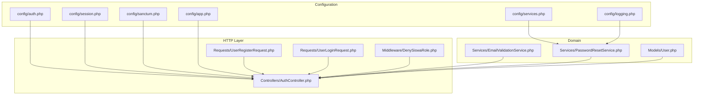
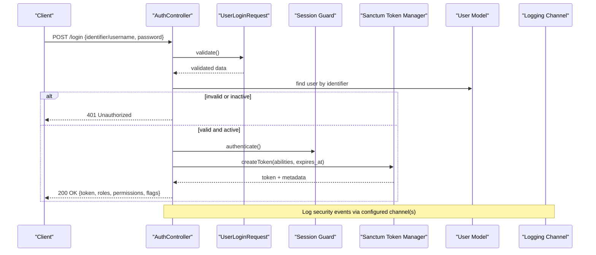
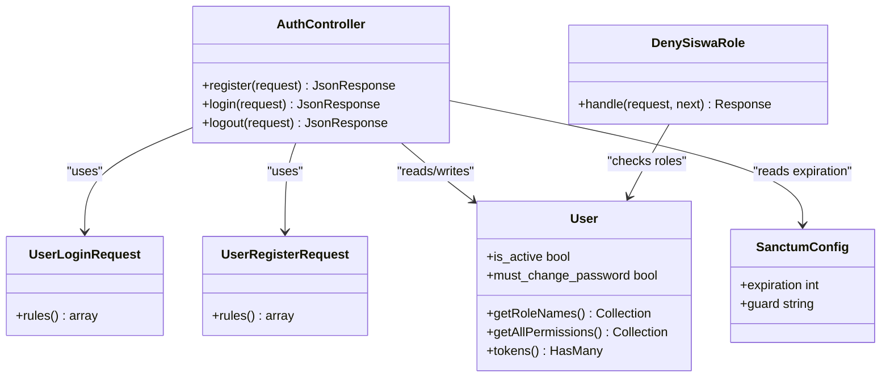
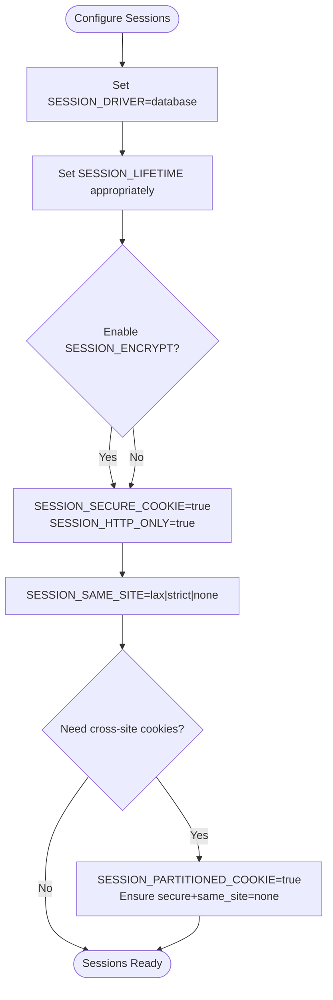
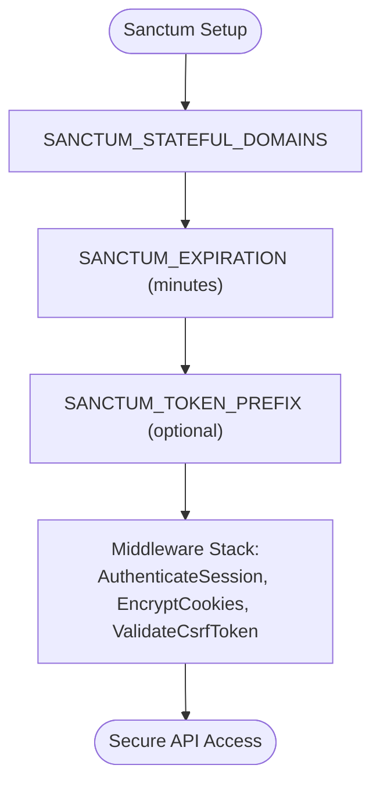
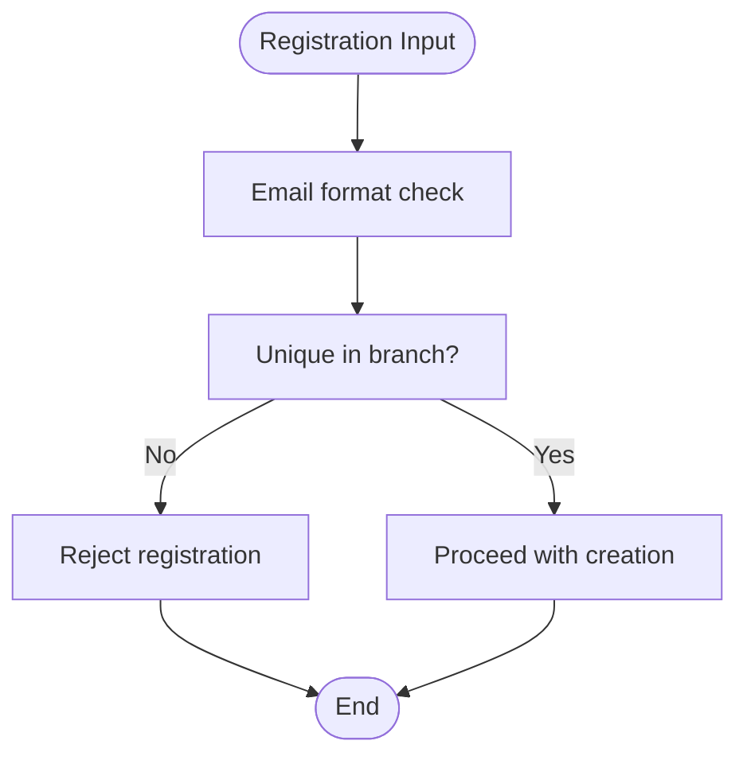
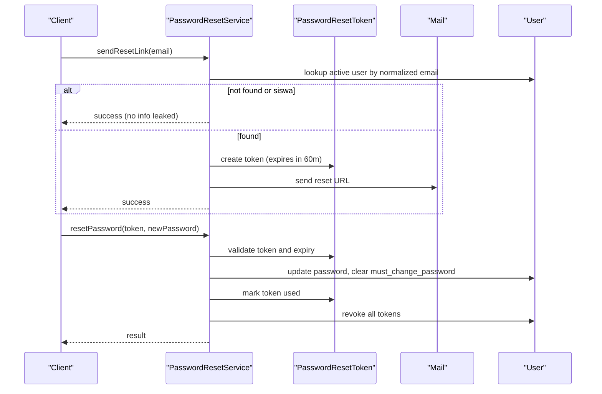
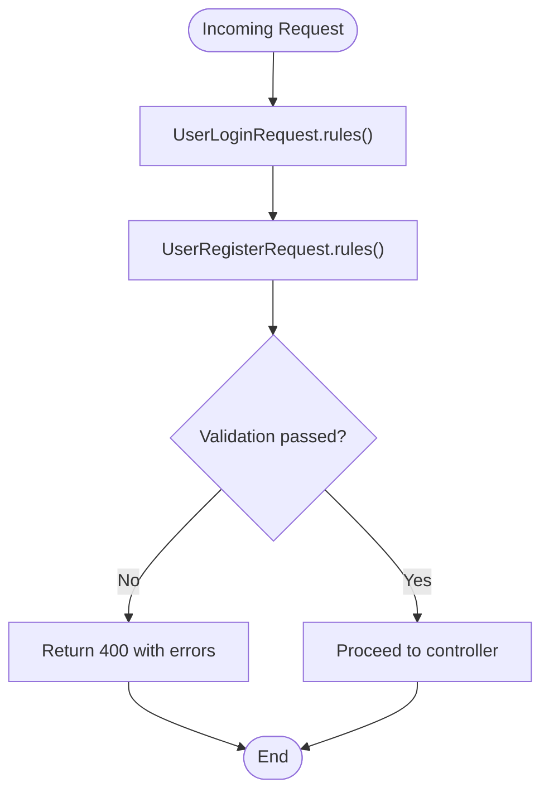
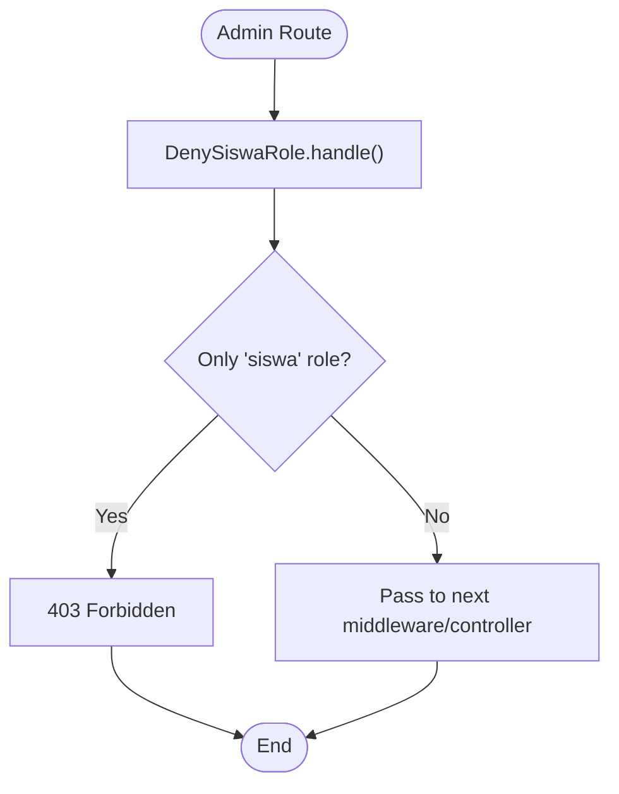
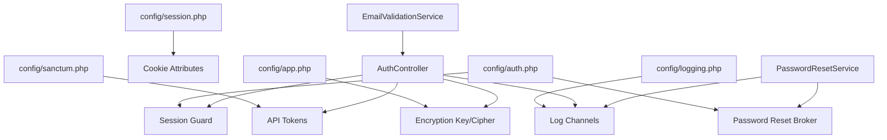

# Security Best Practices & Configuration

<cite>
**Referenced Files in This Document**
- [auth.php](file://backend/config/auth.php)
- [session.php](file://backend/config/session.php)
- [sanctum.php](file://backend/config/sanctum.php)
- [services.php](file://backend/config/services.php)
- [app.php](file://backend/config/app.php)
- [logging.php](file://backend/config/logging.php)
- [AuthController.php](file://backend/app/Http/Controllers/AuthController.php)
- [UserRegisterRequest.php](file://backend/app/Http/Requests/UserRegisterRequest.php)
- [UserLoginRequest.php](file://backend/app/Http/Requests/UserLoginRequest.php)
- [DenySiswaRole.php](file://backend/app/Http/Middleware/DenySiswaRole.php)
- [EmailValidationService.php](file://backend/app/Services/EmailValidationService.php)
- [PasswordResetService.php](file://backend/app/Services/PasswordResetService.php)
- [User.php](file://backend/app/Models/User.php)
</cite>

## Table of Contents
1. Introduction
2. Project Structure
3. Core Components
4. Architecture Overview
5. Detailed Component Analysis
6. Dependency Analysis
7. Performance Considerations
8. Troubleshooting Guide
9. Conclusion

## Introduction
This document provides comprehensive security guidance for Handayani’s authentication and authorization mechanisms, focusing on configuration options, input validation, session and token management, password handling, email validation, middleware patterns, and logging. It also includes recommendations for secure deployment, environment-specific settings, and monitoring of security-related activities.

## Project Structure
Security-relevant components are primarily located under:
- Configuration: backend/config (auth, session, sanctum, services, app, logging)
- Controllers and Requests: backend/app/Http/Controllers and backend/app/Http/Requests
- Middleware: backend/app/Http/Middleware
- Services: backend/app/Services
- Models: backend/app/Models

**Diagram sources**
- [auth.php:1-116](file://backend/config/auth.php#L1-L116)
- [session.php:1-218](file://backend/config/session.php#L1-L218)
- [sanctum.php:1-85](file://backend/config/sanctum.php#L1-L85)
- [services.php:1-39](file://backend/config/services.php#L1-L39)
- [app.php:1-127](file://backend/config/app.php#L1-L127)
- [logging.php:1-133](file://backend/config/logging.php#L1-L133)
- [AuthController.php:1-103](file://backend/app/Http/Controllers/AuthController.php#L1-L103)
- [UserRegisterRequest.php:1-52](file://backend/app/Http/Requests/UserRegisterRequest.php#L1-L52)
- [UserLoginRequest.php:1-51](file://backend/app/Http/Requests/UserLoginRequest.php#L1-L51)
- [DenySiswaRole.php:1-45](file://backend/app/Http/Middleware/DenySiswaRole.php#L1-L45)
- [EmailValidationService.php:1-48](file://backend/app/Services/EmailValidationService.php#L1-L48)
- [PasswordResetService.php:1-100](file://backend/app/Services/PasswordResetService.php#L1-L100)
- [User.php:1-74](file://backend/app/Models/User.php#L1-L74)

**Section sources**
- [auth.php:1-116](file://backend/config/auth.php#L1-L116)
- [session.php:1-218](file://backend/config/session.php#L1-L218)
- [sanctum.php:1-85](file://backend/config/sanctum.php#L1-L85)
- [services.php:1-39](file://backend/config/services.php#L1-L39)
- [app.php:1-127](file://backend/config/app.php#L1-L127)
- [logging.php:1-133](file://backend/config/logging.php#L1-L133)
- [AuthController.php:1-103](file://backend/app/Http/Controllers/AuthController.php#L1-L103)
- [UserRegisterRequest.php:1-52](file://backend/app/Http/Requests/UserRegisterRequest.php#L1-L52)
- [UserLoginRequest.php:1-51](file://backend/app/Http/Requests/UserLoginRequest.php#L1-L51)
- [DenySiswaRole.php:1-45](file://backend/app/Http/Middleware/DenySiswaRole.php#L1-L45)
- [EmailValidationService.php:1-48](file://backend/app/Services/EmailValidationService.php#L1-L48)
- [PasswordResetService.php:1-100](file://backend/app/Services/PasswordResetService.php#L1-L100)
- [User.php:1-74](file://backend/app/Models/User.php#L1-L74)

## Core Components
- Authentication guards and providers:
  - Default guard uses session driver with an Eloquent user provider backed by the User model.
  - Password reset broker configured with a dedicated table, expiration, and throttle to limit abuse.
- Session management:
  - Database-backed sessions with configurable lifetime, encryption, cookie attributes (secure, http_only, same_site), and partitioned cookies support.
- API tokens (Sanctum):
  - Stateful domains, default guard, expiration minutes, optional token prefix, and built-in middleware stack for session auth, cookie encryption, and CSRF validation.
- Third-party service credentials:
  - Centralized storage for mail and notification service keys via environment variables.
- Application encryption:
  - AES-256-CBC cipher and application key from environment; supports previous keys for rotation.
- Logging:
  - Multiple channels (single, daily, slack, papertrail, stderr, syslog, errorlog, null) with configurable levels and processors.

**Section sources**
- [auth.php:15-100](file://backend/config/auth.php#L15-L100)
- [session.php:20-216](file://backend/config/session.php#L20-L216)
- [sanctum.php:17-84](file://backend/config/sanctum.php#L17-L84)
- [services.php:16-38](file://backend/config/services.php#L16-L38)
- [app.php:96-106](file://backend/config/app.php#L96-L106)
- [logging.php:53-130](file://backend/config/logging.php#L53-L130)

## Architecture Overview
The authentication flow integrates request validation, controller logic, role-based checks, token issuance, and secure session/token lifecycle management.

**Diagram sources**
- [AuthController.php:41-94](file://backend/app/Http/Controllers/AuthController.php#L41-L94)
- [UserLoginRequest.php:24-31](file://backend/app/Http/Requests/UserLoginRequest.php#L24-L31)
- [auth.php:38-43](file://backend/config/auth.php#L38-L43)
- [sanctum.php:49-50](file://backend/config/sanctum.php#L49-L50)
- [User.php:10-42](file://backend/app/Models/User.php#L10-L42)
- [logging.php:53-130](file://backend/config/logging.php#L53-L130)

## Detailed Component Analysis

### Authentication and Authorization
- Guards and providers:
  - The web guard uses session storage and an Eloquent provider bound to the User model.
  - Password reset broker is configured with a dedicated table, short-lived tokens, and throttling to mitigate brute-force attempts.
- Role-based access control:
  - The DenySiswaRole middleware enforces defense-in-depth by blocking users who only have the siswa role from admin routes.
- Token-based API access:
  - Sanctum issues bearer tokens with abilities derived from user roles and an expiration window. Existing tokens can be revoked upon login or password reset.

**Diagram sources**
- [AuthController.php:15-103](file://backend/app/Http/Controllers/AuthController.php#L15-L103)
- [UserLoginRequest.php:24-31](file://backend/app/Http/Requests/UserLoginRequest.php#L24-L31)
- [UserRegisterRequest.php:25-32](file://backend/app/Http/Requests/UserRegisterRequest.php#L25-L32)
- [DenySiswaRole.php:22-43](file://backend/app/Http/Middleware/DenySiswaRole.php#L22-L43)
- [User.php:10-42](file://backend/app/Models/User.php#L10-L42)
- [sanctum.php:49-50](file://backend/config/sanctum.php#L49-L50)

**Section sources**
- [auth.php:38-100](file://backend/config/auth.php#L38-L100)
- [DenySiswaRole.php:15-43](file://backend/app/Http/Middleware/DenySiswaRole.php#L15-L43)
- [AuthController.php:41-94](file://backend/app/Http/Controllers/AuthController.php#L41-L94)
- [sanctum.php:49-50](file://backend/config/sanctum.php#L49-L50)
- [User.php:10-42](file://backend/app/Models/User.php#L10-L42)

### Session Management and Cookie Security
- Driver and persistence:
  - Database driver recommended for scalability and centralized cleanup.
- Lifetime and expiry:
  - Configurable lifetime and option to expire on browser close.
- Encryption and transport:
  - Optional session data encryption; enforce HTTPS-only cookies and HTTP-only access.
- Cross-site protections:
  - SameSite cookie attribute mitigates CSRF; partitioned cookies supported for cross-site contexts when secure and none are set.

**Diagram sources**
- [session.php:20-216](file://backend/config/session.php#L20-L216)

**Section sources**
- [session.php:20-216](file://backend/config/session.php#L20-L216)

### API Tokens (Sanctum) and CSRF Protection
- Stateful domains:
  - Configure SANCTUM_STATEFUL_DOMAINS for SPA cookie-based flows.
- Expiration:
  - Global expiration minutes can override per-token values; default is suitable for many use cases.
- Token prefix:
  - Use SANCTUM_TOKEN_PREFIX to aid secret scanning tools.
- Middleware stack:
  - AuthenticateSession, EncryptCookies, ValidateCsrfToken ensure secure stateful requests.

**Diagram sources**
- [sanctum.php:17-84](file://backend/config/sanctum.php#L17-L84)

**Section sources**
- [sanctum.php:17-84](file://backend/config/sanctum.php#L17-L84)

### Email Validation Service and Registration Safety
- Format validation:
  - Uses RFC 5322 basic validation to reject malformed emails early.
- Uniqueness within branch:
  - Ensures no duplicate emails per branch, preventing conflicts and improving data integrity.
- Normalization:
  - Lowercasing and trimming reduce case-sensitivity issues and whitespace anomalies.

**Diagram sources**
- [EmailValidationService.php:12-34](file://backend/app/Services/EmailValidationService.php#L12-L34)

**Section sources**
- [EmailValidationService.php:12-34](file://backend/app/Services/EmailValidationService.php#L12-L34)

### Password Handling and Reset Flow
- Hashing:
  - Passwords are hashed using the framework’s default algorithm before storage.
- Reset link anti-enumeration:
  - Reset link generation returns consistent responses regardless of whether the email exists, preventing enumeration.
- Token lifecycle:
  - Short-lived tokens with expiration; tokens marked used after successful reset; all existing tokens revoked post-reset.
- Role restrictions:
  - Siswa accounts are blocked from initiating password resets.

**Diagram sources**
- [PasswordResetService.php:16-98](file://backend/app/Services/PasswordResetService.php#L16-L98)
- [auth.php:93-100](file://backend/config/auth.php#L93-L100)

**Section sources**
- [PasswordResetService.php:16-98](file://backend/app/Services/PasswordResetService.php#L16-L98)
- [auth.php:93-100](file://backend/config/auth.php#L93-L100)

### Input Validation Strategies
- Login request:
  - Accepts either identifier or username, with password length constraints.
- Register request:
  - Enforces required fields, length limits, and validates existence of related branch.
- Custom validation failures:
  - FormRequest classes throw structured JSON errors for consistent client-side handling.

**Diagram sources**
- [UserLoginRequest.php:24-31](file://backend/app/Http/Requests/UserLoginRequest.php#L24-L31)
- [UserRegisterRequest.php:25-32](file://backend/app/Http/Requests/UserRegisterRequest.php#L25-L32)

**Section sources**
- [UserLoginRequest.php:24-31](file://backend/app/Http/Requests/UserLoginRequest.php#L24-L31)
- [UserRegisterRequest.php:25-32](file://backend/app/Http/Requests/UserRegisterRequest.php#L25-L32)

### Middleware Security Patterns
- Defense-in-depth:
  - DenySiswaRole blocks student-only accounts from admin routes even if other permission checks are misconfigured.
- Integration:
  - Apply this middleware to admin route groups to enforce strict separation between student and administrative access.

**Diagram sources**
- [DenySiswaRole.php:22-43](file://backend/app/Http/Middleware/DenySiswaRole.php#L22-L43)

**Section sources**
- [DenySiswaRole.php:15-43](file://backend/app/Http/Middleware/DenySiswaRole.php#L15-L43)

### Encryption Settings and Sensitive Data
- Application encryption:
  - AES-256-CBC cipher with APP_KEY from environment; supports APP_PREVIOUS_KEYS for safe key rotation.
- Session encryption:
  - Optional SESSION_ENCRYPT to encrypt stored session payloads.
- Secrets management:
  - Store third-party credentials (mail, notifications) in environment variables referenced by config/services.php.

**Section sources**
- [app.php:96-106](file://backend/config/app.php#L96-L106)
- [session.php:49-50](file://backend/config/session.php#L49-L50)
- [services.php:16-38](file://backend/config/services.php#L16-L38)

### Audit Logging for Security Events
- Channels:
  - Use daily or stack channels for persistent logs; configure Slack or Papertrail for alerts.
- Levels:
  - Adjust LOG_LEVEL per environment; critical for production alerting.
- Processors:
  - PsrLogMessageProcessor enables structured placeholders for better parsing.

**Section sources**
- [logging.php:53-130](file://backend/config/logging.php#L53-L130)

## Dependency Analysis
The following diagram shows how configuration files influence runtime behavior across controllers, services, and models.

**Diagram sources**
- [auth.php:15-100](file://backend/config/auth.php#L15-L100)
- [session.php:20-216](file://backend/config/session.php#L20-L216)
- [sanctum.php:17-84](file://backend/config/sanctum.php#L17-L84)
- [app.php:96-106](file://backend/config/app.php#L96-L106)
- [logging.php:53-130](file://backend/config/logging.php#L53-L130)
- [AuthController.php:41-94](file://backend/app/Http/Controllers/AuthController.php#L41-L94)
- [PasswordResetService.php:16-98](file://backend/app/Services/PasswordResetService.php#L16-L98)
- [EmailValidationService.php:12-34](file://backend/app/Services/EmailValidationService.php#L12-L34)

**Section sources**
- [auth.php:15-100](file://backend/config/auth.php#L15-L100)
- [session.php:20-216](file://backend/config/session.php#L20-L216)
- [sanctum.php:17-84](file://backend/config/sanctum.php#L17-L84)
- [app.php:96-106](file://backend/config/app.php#L96-L106)
- [logging.php:53-130](file://backend/config/logging.php#L53-L130)
- [AuthController.php:41-94](file://backend/app/Http/Controllers/AuthController.php#L41-L94)
- [PasswordResetService.php:16-98](file://backend/app/Services/PasswordResetService.php#L16-L98)
- [EmailValidationService.php:12-34](file://backend/app/Services/EmailValidationService.php#L12-L34)

## Performance Considerations
- Prefer database-backed sessions for horizontal scaling and centralized cleanup.
- Keep token expiration reasonable to balance security and performance; avoid excessively long lifetimes.
- Use log rotation (daily) and appropriate log levels to prevent disk pressure in production.
- Normalize and index email fields at the database level to improve uniqueness checks.

[No sources needed since this section provides general guidance]

## Troubleshooting Guide
- Authentication failures:
  - Verify identifiers and password policies; ensure accounts are active and not restricted by role middleware.
- Token issues:
  - Confirm SANCTUM_STATEFUL_DOMAINS matches your frontend domain; check expiration and token revocation behavior.
- Session problems:
  - Ensure SESSION_DRIVER is correctly set and the sessions table exists; verify cookie attributes (secure, http_only, same_site).
- Email validation:
  - Confirm normalization and uniqueness rules; check branch scoping for duplicates.
- Logging:
  - Inspect configured channels and levels; ensure file paths are writable and external integrations (Slack/Papertrail) are reachable.

**Section sources**
- [AuthController.php:41-94](file://backend/app/Http/Controllers/AuthController.php#L41-L94)
- [DenySiswaRole.php:22-43](file://backend/app/Http/Middleware/DenySiswaRole.php#L22-L43)
- [sanctum.php:17-84](file://backend/config/sanctum.php#L17-L84)
- [session.php:20-216](file://backend/config/session.php#L20-L216)
- [EmailValidationService.php:12-34](file://backend/app/Services/EmailValidationService.php#L12-L34)
- [logging.php:53-130](file://backend/config/logging.php#L53-L130)

## Conclusion
Handayani implements robust authentication and authorization through session guards, Sanctum tokens, role-based middleware, and strong input validation. Security is reinforced by secure session cookies, encrypted application secrets, controlled password reset flows, and flexible logging. For production, ensure environment-specific configurations are hardened, secrets are managed securely, and security events are monitored and alerted.

[No sources needed since this section summarizes without analyzing specific files]