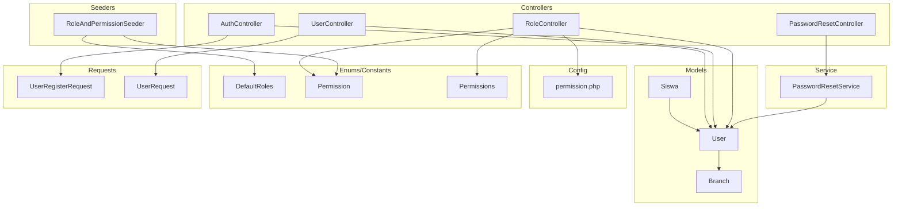
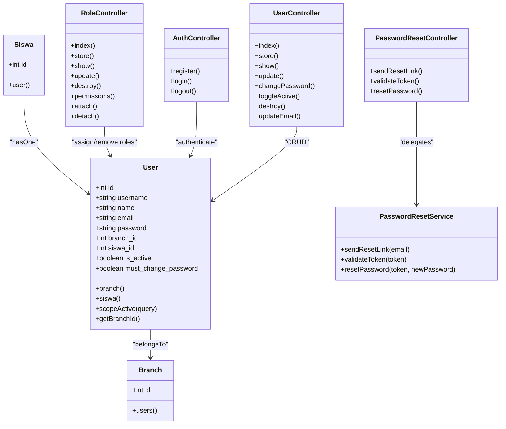
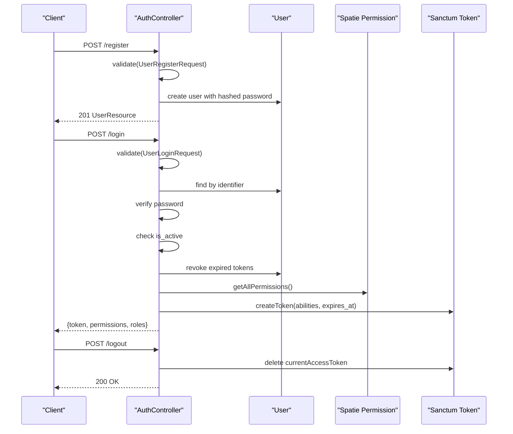
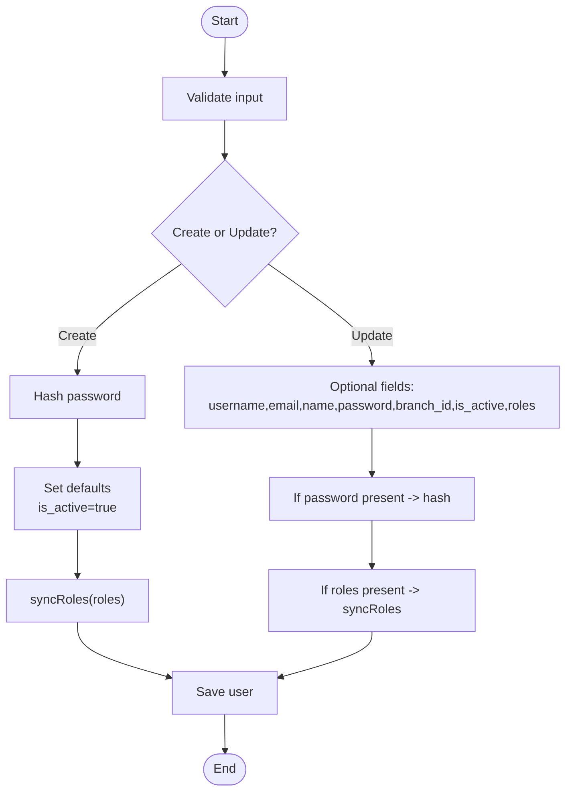
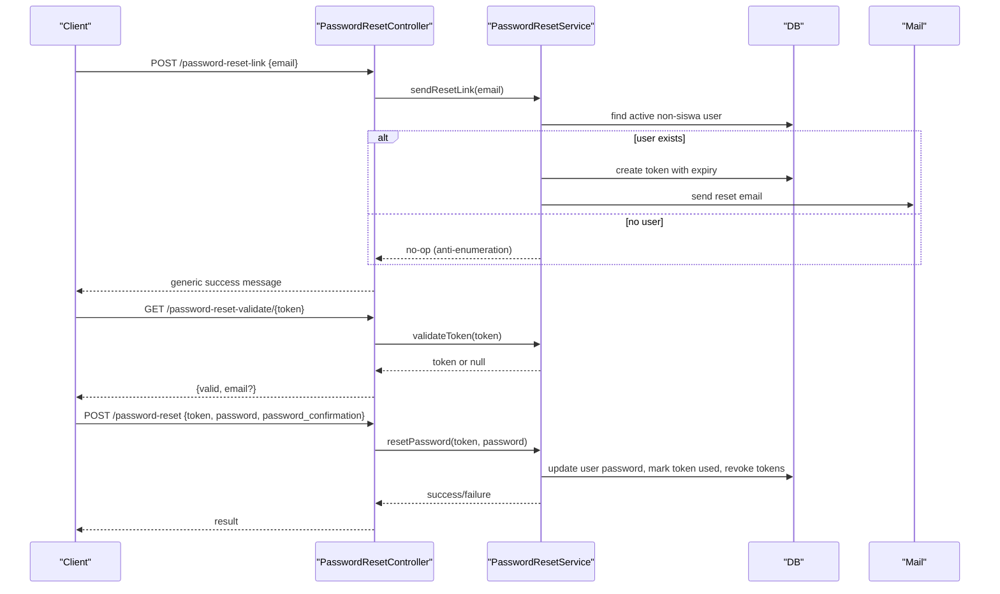
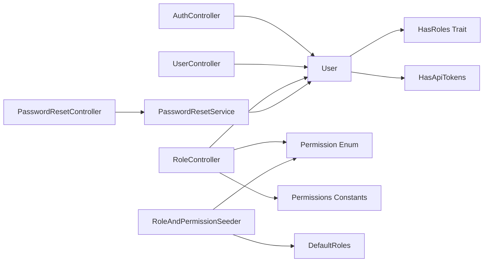

# User Management & Roles

<cite>
**Referenced Files in This Document**
- [User.php](file://backend/app/Models/User.php)
- [Branch.php](file://backend/app/Models/Branch.php)
- [Siswa.php](file://backend/app/Models/Siswa.php)
- [UserController.php](file://backend/app/Controllers/UserController.php)
- [AuthController.php](file://backend/app/Controllers/AuthController.php)
- [RoleController.php](file://backend/app/Controllers/RoleController.php)
- [PasswordResetController.php](file://backend/app/Controllers/PasswordResetController.php)
- [PasswordResetService.php](file://backend/app/Services/PasswordResetService.php)
- [permission.php](file://backend/config/permission.php)
- [DefaultRoles.php](file://backend/app/Enum/DefaultRoles.php)
- [Permission.php](file://backend/app/Enum/Permission.php)
- [Permissions.php](file://backend/app/Constant/Permissions.php)
- [RoleAndPermissionSeeder.php](file://backend/database/seeders/RoleAndPermissionSeeder.php)
- [UserRegisterRequest.php](file://backend/app/Http/Requests/UserRegisterRequest.php)
- [UserRequest.php](file://backend/app/Http/Requests/UserRequest.php)
</cite>

## Table of Contents
1. Introduction
2. Project Structure
3. Core Components
4. Architecture Overview
5. Detailed Component Analysis
6. Dependency Analysis
7. Performance Considerations
8. Troubleshooting Guide
9. Conclusion

## Introduction
This document explains the user management and role system in Handayani. It covers the User model structure, relationships with Branch and Siswa, validation rules, and the role-based access control (RBAC) implementation using Spatie Laravel Permission. It also documents default roles, user lifecycle operations (creation, activation/deactivation, password management, branch assignment), registration flow, account activation checks, password reset functionality, and practical examples for assigning roles, checking permissions, and implementing branch-level data isolation.

## Project Structure
The user and role features are implemented across models, controllers, services, configuration, enums/constants, and seeders:

- Models: User, Branch, Siswa
- Controllers: AuthController, UserController, RoleController, PasswordResetController
- Service: PasswordResetService
- Configuration: permission.php
- Enums/Constants: DefaultRoles, Permission, Permissions
- Seeders: RoleAndPermissionSeeder
- Requests: UserRegisterRequest, UserRequest

**Diagram sources**
- [User.php:1-74](file://backend/app/Models/User.php#L1-L74)
- [Branch.php:1-64](file://backend/app/Models/Branch.php#L1-L64)
- [Siswa.php:1-117](file://backend/app/Models/Siswa.php#L1-L117)
- [AuthController.php:1-103](file://backend/app/Controllers/AuthController.php#L1-L103)
- [UserController.php:1-317](file://backend/app/Controllers/UserController.php#L1-L317)
- [RoleController.php:1-458](file://backend/app/Controllers/RoleController.php#L1-L458)
- [PasswordResetController.php:1-78](file://backend/app/Controllers/PasswordResetController.php#L1-L78)
- [PasswordResetService.php:1-100](file://backend/app/Services/PasswordResetService.php#L1-L100)
- [permission.php:1-220](file://backend/config/permission.php#L1-L220)
- [DefaultRoles.php:1-12](file://backend/app/Enum/DefaultRoles.php#L1-L12)
- [Permission.php:1-113](file://backend/app/Enum/Permission.php#L1-L113)
- [Permissions.php:1-114](file://backend/app/Constant/Permissions.php#L1-L114)
- [RoleAndPermissionSeeder.php:1-61](file://backend/database/seeders/RoleAndPermissionSeeder.php#L1-L61)
- [UserRegisterRequest.php:1-52](file://backend/app/Http/Requests/UserRegisterRequest.php#L1-L52)
- [UserRequest.php:1-57](file://backend/app/Http/Requests/UserRequest.php#L1-L57)

**Section sources**
- [User.php:1-74](file://backend/app/Models/User.php#L1-L74)
- [Branch.php:1-64](file://backend/app/Models/Branch.php#L1-L64)
- [Siswa.php:1-117](file://backend/app/Models/Siswa.php#L1-L117)
- [AuthController.php:1-103](file://backend/app/Controllers/AuthController.php#L1-L103)
- [UserController.php:1-317](file://backend/app/Controllers/UserController.php#L1-L317)
- [RoleController.php:1-458](file://backend/app/Controllers/RoleController.php#L1-L458)
- [PasswordResetController.php:1-78](file://backend/app/Controllers/PasswordResetController.php#L1-L78)
- [PasswordResetService.php:1-100](file://backend/app/Services/PasswordResetService.php#L1-L100)
- [permission.php:1-220](file://backend/config/permission.php#L1-L220)
- [DefaultRoles.php:1-12](file://backend/app/Enum/DefaultRoles.php#L1-L12)
- [Permission.php:1-113](file://backend/app/Enum/Permission.php#L1-L113)
- [Permissions.php:1-114](file://backend/app/Constant/Permissions.php#L1-L114)
- [RoleAndPermissionSeeder.php:1-61](file://backend/database/seeders/RoleAndPermissionSeeder.php#L1-L61)
- [UserRegisterRequest.php:1-52](file://backend/app/Http/Requests/UserRegisterRequest.php#L1-L52)
- [UserRequest.php:1-57](file://backend/app/Http/Requests/UserRequest.php#L1-L57)

## Core Components
- User model:
  - Uses HasRoles (Spatie) and Sanctum tokens.
  - Fields include username, name, email, password, branch_id, siswa_id, is_active, must_change_password.
  - Relationships: belongsTo Branch, belongsTo Siswa; hasActive scope; email normalization setter.
- Branch model:
  - One-to-many users and other entities via branch_id.
- Siswa model:
  - One-to-one User via siswa_id.
- RBAC:
  - Spatie Permission configured via config/permission.php.
  - Default roles defined in DefaultRoles enum and seeded by RoleAndPermissionSeeder.
  - Permission names centralized in Permission enum and grouped in Permissions constants.
- Controllers:
  - AuthController: register, login (with active check and token creation including abilities), logout.
  - UserController: profile CRUD, listing with filters, role sync, password change, toggle active, delete, update email with branch-scoped uniqueness.
  - RoleController: CRUD roles, attach/detach roles to users, list permissions grouped by domain.
  - PasswordResetController + PasswordResetService: send reset link, validate token, reset password.

**Section sources**
- [User.php:1-74](file://backend/app/Models/User.php#L1-L74)
- [Branch.php:1-64](file://backend/app/Models/Branch.php#L1-L64)
- [Siswa.php:1-117](file://backend/app/Models/Siswa.php#L1-L117)
- [permission.php:1-220](file://backend/config/permission.php#L1-L220)
- [DefaultRoles.php:1-12](file://backend/app/Enum/DefaultRoles.php#L1-L12)
- [Permission.php:1-113](file://backend/app/Enum/Permission.php#L1-L113)
- [Permissions.php:1-114](file://backend/app/Constant/Permissions.php#L1-L114)
- [RoleAndPermissionSeeder.php:1-61](file://backend/database/seeders/RoleAndPermissionSeeder.php#L1-L61)
- [AuthController.php:1-103](file://backend/app/Controllers/AuthController.php#L1-L103)
- [UserController.php:1-317](file://backend/app/Controllers/UserController.php#L1-L317)
- [RoleController.php:1-458](file://backend/app/Controllers/RoleController.php#L1-L458)
- [PasswordResetController.php:1-78](file://backend/app/Controllers/PasswordResetController.php#L1-L78)
- [PasswordResetService.php:1-100](file://backend/app/Services/PasswordResetService.php#L1-L100)

## Architecture Overview
The RBAC architecture integrates Spatie Permission with Eloquent models and controllers. Roles and permissions are created and managed through dedicated endpoints and seeders. Authentication uses Sanctum tokens enriched with abilities derived from user roles.

**Diagram sources**
- [User.php:1-74](file://backend/app/Models/User.php#L1-L74)
- [Branch.php:1-64](file://backend/app/Models/Branch.php#L1-L64)
- [Siswa.php:1-117](file://backend/app/Models/Siswa.php#L1-L117)
- [RoleController.php:1-458](file://backend/app/Controllers/RoleController.php#L1-L458)
- [AuthController.php:1-103](file://backend/app/Controllers/AuthController.php#L1-L103)
- [UserController.php:1-317](file://backend/app/Controllers/UserController.php#L1-L317)
- [PasswordResetController.php:1-78](file://backend/app/Controllers/PasswordResetController.php#L1-L78)
- [PasswordResetService.php:1-100](file://backend/app/Services/PasswordResetService.php#L1-L100)

## Detailed Component Analysis

### User Model and Relationships
- Attributes and casts:
  - Integers: id, branch_id, siswa_id
  - Booleans: is_active, must_change_password
- Relationships:
  - branch(): belongsTo Branch
  - siswa(): belongsTo Siswa
- Behavior:
  - setEmailAttribute normalizes email to lowercase trimmed value
  - scopeActive filters active users
  - getBranchId accessor returns branch_id
- Integration:
  - Uses Spatie HasRoles trait for RBAC
  - Uses Sanctum HasApiTokens for API authentication

Practical usage patterns:
- Assigning roles: use syncRoles or assignRole/removeRole on a User instance
- Checking permissions: use can('permission-name') or getAllPermissions()->pluck('name')
- Branch isolation: filter queries by where('branch_id', $user->branch_id)

**Section sources**
- [User.php:1-74](file://backend/app/Models/User.php#L1-L74)

### Branch and Siswa Relationships
- Branch:
  - users(): hasMany(User::class, 'branch_id')
  - siswas(): hasMany(Siswa::class, 'branch_id')
- Siswa:
  - user(): hasOne(User::class, 'siswa_id')

These relationships enable:
- Listing users per branch
- Linking student accounts to Siswa records
- Enforcing branch-scoped uniqueness for emails during updates

**Section sources**
- [Branch.php:1-64](file://backend/app/Models/Branch.php#L1-L64)
- [Siswa.php:1-117](file://backend/app/Models/Siswa.php#L1-L117)

### Role-Based Access Control (RBAC)
- Configuration:
  - Spatie Permission tables and models configured in permission.php
- Default roles:
  - superadmin, admin, user, siswa defined in DefaultRoles enum
- Permissions:
  - Centralized in Permission enum and grouped in Permissions constants
- Seeding:
  - RoleAndPermissionSeeder creates all permissions and assigns them to roles:
    - superadmin gets all permissions
    - admin gets a curated subset excluding manage-midtrans-config
    - siswa gets view-tagihan-siswa, view-own-billing, pay-tagihan-online, print-kwitansi

Practical examples:
- Create role with permissions via RoleController@store
- Attach/detach roles to users via RoleController@attach/@detach
- List available permissions grouped by domain via RoleController@permissions

**Section sources**
- [permission.php:1-220](file://backend/config/permission.php#L1-L220)
- [DefaultRoles.php:1-12](file://backend/app/Enum/DefaultRoles.php#L1-L12)
- [Permission.php:1-113](file://backend/app/Enum/Permission.php#L1-L113)
- [Permissions.php:1-114](file://backend/app/Constant/Permissions.php#L1-L114)
- [RoleAndPermissionSeeder.php:1-61](file://backend/database/seeders/RoleAndPermissionSeeder.php#L1-L61)
- [RoleController.php:1-458](file://backend/app/Controllers/RoleController.php#L1-L458)

### Authentication Flow (Login, Register, Logout)
- Registration:
  - Validates username, password, branch_id
  - Creates user with hashed password
- Login:
  - Accepts identifier or username
  - Checks account is active
  - Revokes expired tokens and forces re-login if needed
  - Builds abilities from user roles and creates Sanctum token with expiration
- Logout:
  - Deletes current access token

**Diagram sources**
- [AuthController.php:1-103](file://backend/app/Controllers/AuthController.php#L1-L103)
- [UserRegisterRequest.php:1-52](file://backend/app/Http/Requests/UserRegisterRequest.php#L1-L52)

**Section sources**
- [AuthController.php:1-103](file://backend/app/Controllers/AuthController.php#L1-L103)
- [UserRegisterRequest.php:1-52](file://backend/app/Http/Requests/UserRegisterRequest.php#L1-L52)

### User Lifecycle Operations (CRUD, Activation, Password, Branch Assignment)
- Create user:
  - Validates fields and ensures unique username/email within branch
  - Hashes password, sets defaults, syncs roles
- Update user:
  - Partial updates supported; optional fields include username, email, name, password, branch_id, is_active, roles
- Toggle active:
  - Flips is_active; if deactivated, revokes all tokens
- Delete user:
  - Revokes tokens, removes roles, deletes record
- Change password:
  - Requires current password; resets must_change_password flag
- Update email:
  - Requires current password; enforces branch-scoped uniqueness

**Diagram sources**
- [UserController.php:1-317](file://backend/app/Controllers/UserController.php#L1-L317)
- [UserRequest.php:1-57](file://backend/app/Http/Requests/UserRequest.php#L1-L57)

**Section sources**
- [UserController.php:1-317](file://backend/app/Controllers/UserController.php#L1-L317)
- [UserRequest.php:1-57](file://backend/app/Http/Requests/UserRequest.php#L1-L57)

### Password Reset Flow
- Send reset link:
  - Validates email
  - Anti-enumeration response regardless of existence
  - Skips siswa role users
  - Generates token, stores it with expiry, sends email
- Validate token:
  - Returns validity and associated email if valid
- Reset password:
  - Validates token and new password confirmation
  - Updates password, clears must_change_password, marks token used, revokes existing tokens

**Diagram sources**
- [PasswordResetController.php:1-78](file://backend/app/Controllers/PasswordResetController.php#L1-L78)
- [PasswordResetService.php:1-100](file://backend/app/Services/PasswordResetService.php#L1-L100)

**Section sources**
- [PasswordResetController.php:1-78](file://backend/app/Controllers/PasswordResetController.php#L1-L78)
- [PasswordResetService.php:1-100](file://backend/app/Services/PasswordResetService.php#L1-L100)

### Practical Examples and Best Practices
- Assigning roles to users:
  - Use RoleController@attach to assign a role by name to a user
  - Use RoleController@detach to remove a role
  - When creating/updating users, pass roles array to syncRoles
- Checking permissions:
  - In controllers or services, use $user->can('permission-name') or collect abilities from getAllPermissions()
- Implementing branch-level data isolation:
  - Filter queries by branch_id based on authenticated user’s branch
  - Example pattern: where('branch_id', auth()->user()->branch_id)
  - For email uniqueness, enforce Rule::unique(...)->where(branch_id) as done in update flows

[No sources needed since this section provides general guidance]

## Dependency Analysis
Key dependencies and interactions:
- User depends on Spatie HasRoles and Sanctum HasApiTokens
- Controllers depend on Request classes for validation
- RoleController depends on Permission enum and Permissions constants for grouping and labeling
- Seeder depends on DefaultRoles and Permission enum to bootstrap roles and permissions
- PasswordResetService depends on User and PasswordResetToken models and Mail

**Diagram sources**
- [User.php:1-74](file://backend/app/Models/User.php#L1-L74)
- [AuthController.php:1-103](file://backend/app/Controllers/AuthController.php#L1-L103)
- [UserController.php:1-317](file://backend/app/Controllers/UserController.php#L1-L317)
- [RoleController.php:1-458](file://backend/app/Controllers/RoleController.php#L1-L458)
- [Permission.php:1-113](file://backend/app/Enum/Permission.php#L1-L113)
- [Permissions.php:1-114](file://backend/app/Constant/Permissions.php#L1-L114)
- [DefaultRoles.php:1-12](file://backend/app/Enum/DefaultRoles.php#L1-L12)
- [RoleAndPermissionSeeder.php:1-61](file://backend/database/seeders/RoleAndPermissionSeeder.php#L1-L61)
- [PasswordResetController.php:1-78](file://backend/app/Controllers/PasswordResetController.php#L1-L78)
- [PasswordResetService.php:1-100](file://backend/app/Services/PasswordResetService.php#L1-L100)

**Section sources**
- [User.php:1-74](file://backend/app/Models/User.php#L1-L74)
- [AuthController.php:1-103](file://backend/app/Controllers/AuthController.php#L1-L103)
- [UserController.php:1-317](file://backend/app/Controllers/UserController.php#L1-L317)
- [RoleController.php:1-458](file://backend/app/Controllers/RoleController.php#L1-L458)
- [Permission.php:1-113](file://backend/app/Enum/Permission.php#L1-L113)
- [Permissions.php:1-114](file://backend/app/Constant/Permissions.php#L1-L114)
- [DefaultRoles.php:1-12](file://backend/app/Enum/DefaultRoles.php#L1-L12)
- [RoleAndPermissionSeeder.php:1-61](file://backend/database/seeders/RoleAndPermissionSeeder.php#L1-L61)
- [PasswordResetController.php:1-78](file://backend/app/Controllers/PasswordResetController.php#L1-L78)
- [PasswordResetService.php:1-100](file://backend/app/Services/PasswordResetService.php#L1-L100)

## Performance Considerations
- Permission caching:
  - Spatie Permission caches permissions for 24 hours by default; ensure cache store is configured appropriately
- Token management:
  - Revoke expired tokens on login and when deactivating users to prevent stale sessions
- Query optimization:
  - Use eager loading for branch and roles when listing users to reduce N+1 queries
- Validation efficiency:
  - Use FormRequest classes to centralize validation and avoid repeated logic in controllers

[No sources needed since this section provides general guidance]

## Troubleshooting Guide
Common issues and resolutions:
- Login fails due to inactive account:
  - Ensure user.is_active is true before attempting login
- Email uniqueness errors:
  - Uniqueness is scoped to branch_id; confirm branch_id context when updating email
- Role not found or invalid:
  - Verify role names exist in the database; RoleController validates role existence before attaching
- Permission mismatch:
  - Check that required permissions are assigned to the user’s roles; use RoleController@permissions to inspect available permissions
- Password reset not working:
  - Confirm token is valid and not expired; siswa role users are intentionally excluded from password reset links

**Section sources**
- [AuthController.php:1-103](file://backend/app/Controllers/AuthController.php#L1-L103)
- [UserController.php:1-317](file://backend/app/Controllers/UserController.php#L1-L317)
- [RoleController.php:1-458](file://backend/app/Controllers/RoleController.php#L1-L458)
- [PasswordResetService.php:1-100](file://backend/app/Services/PasswordResetService.php#L1-L100)

## Conclusion
Handayani’s user management and RBAC system combines Eloquent models, Spatie Permission, and Sanctum to provide secure, scalable access control. The design supports multi-branch operations, clear role definitions, robust authentication flows, and comprehensive password reset capabilities. By following the documented patterns for role assignment, permission checks, and branch isolation, developers can extend user capabilities safely and consistently.