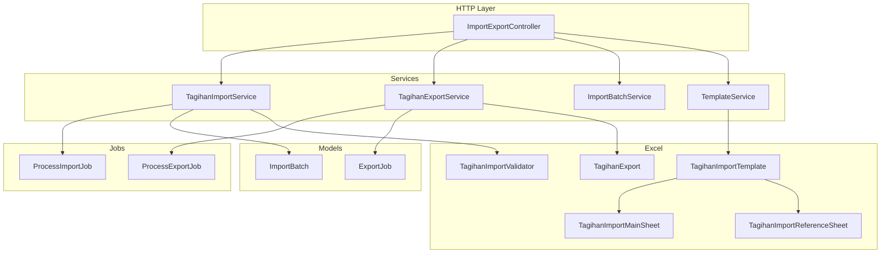
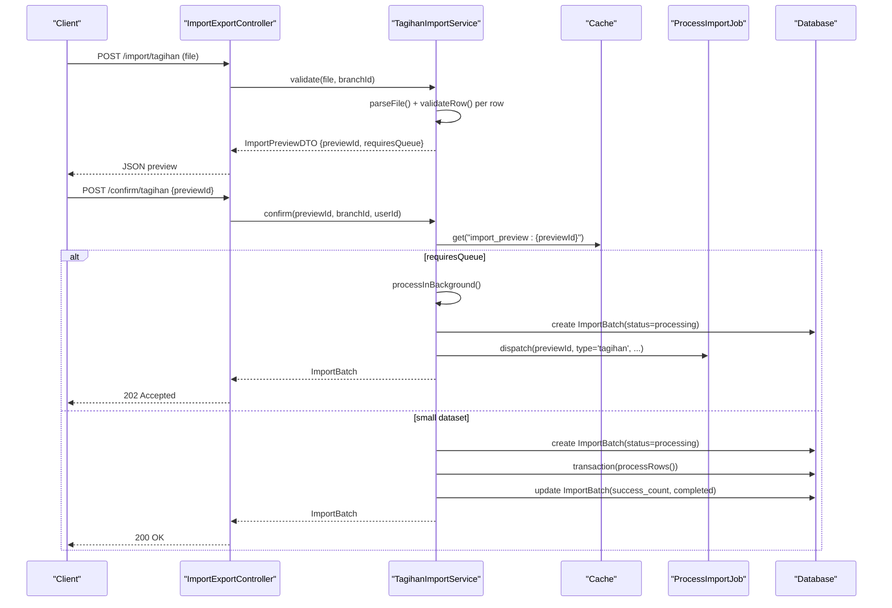
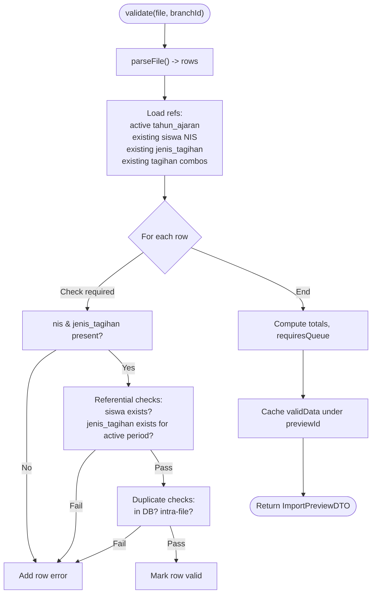
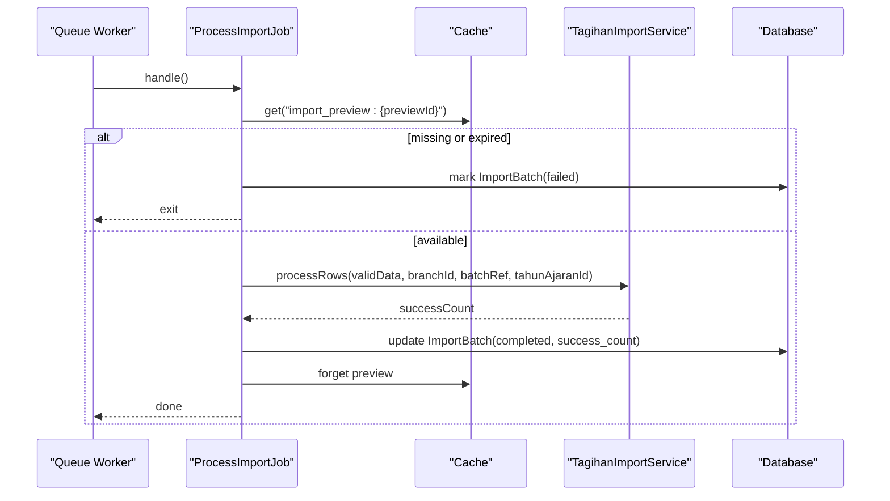
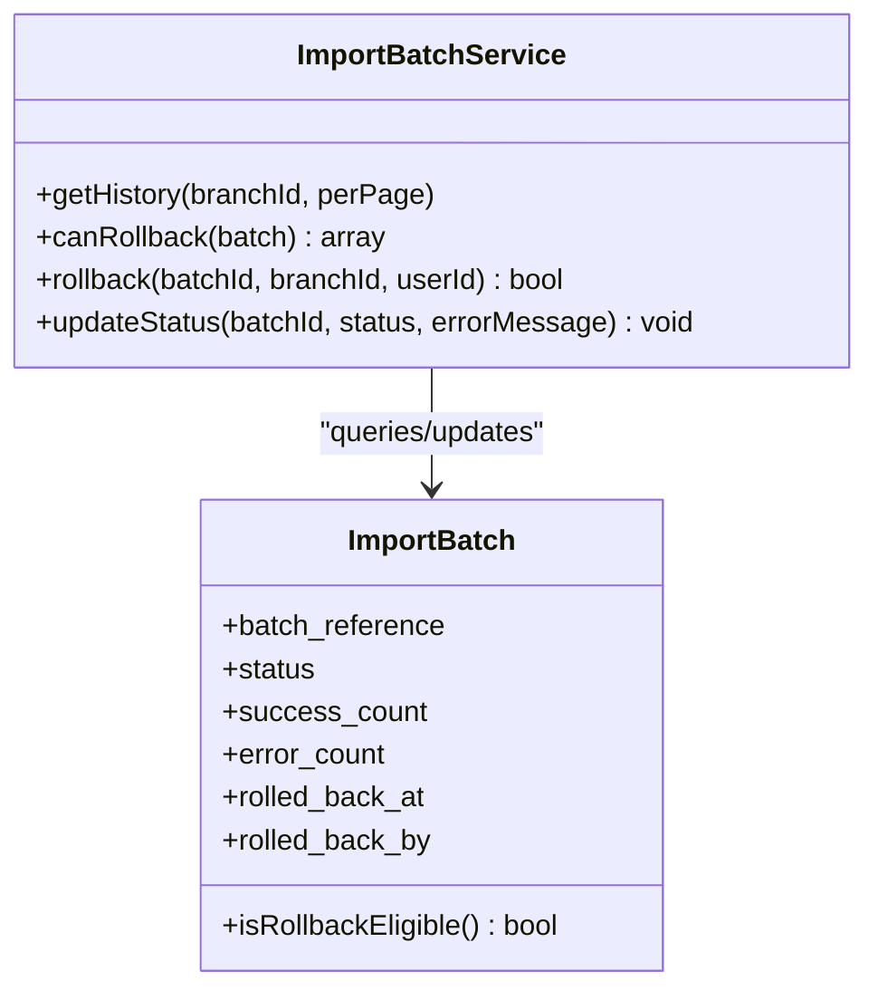
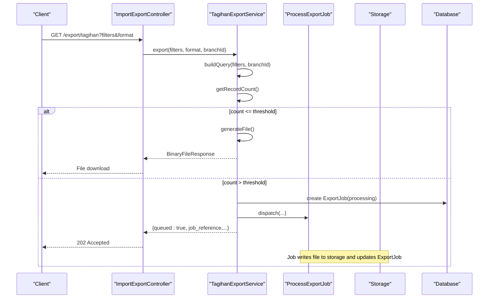
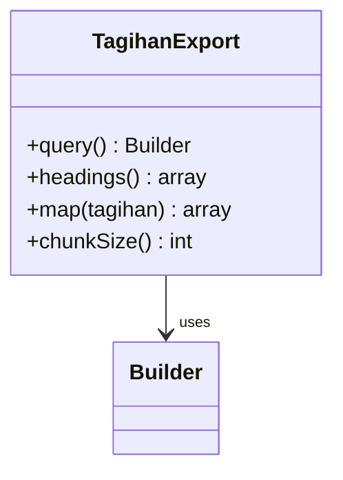
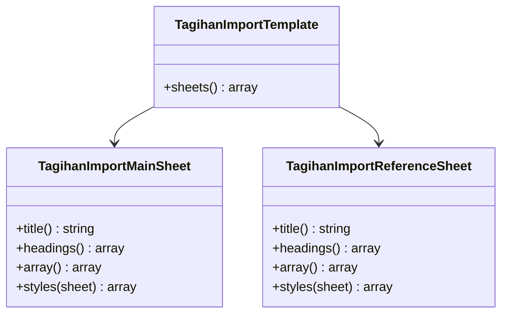
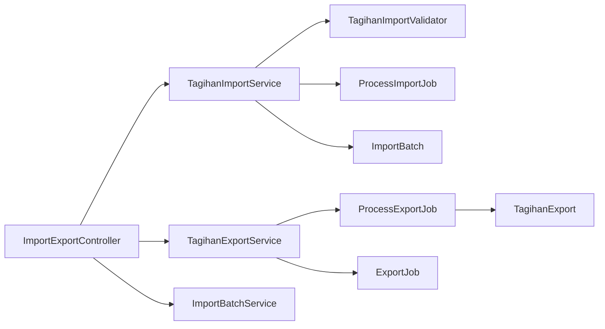

# Batch Invoice Operations

<cite>
**Referenced Files in This Document**
- [TagihanImportService.php](file://backend/app/Services/ImportExport/TagihanImportService.php)
- [TagihanExportService.php](file://backend/app/Services/ImportExport/TagihanExportService.php)
- [TagihanImportValidator.php](file://backend/app/Imports/TagihanImportValidator.php)
- [TagihanExport.php](file://backend/app/Exports/TagihanExport.php)
- [TagihanImportTemplate.php](file://backend/app/Exports/TagihanImportTemplate.php)
- [TagihanImportMainSheet.php](file://backend/app/Exports/TagihanImportMainSheet.php)
- [TagihanImportReferenceSheet.php](file://backend/app/Exports/TagihanImportReferenceSheet.php)
- [ProcessImportJob.php](file://backend/app/Jobs/ProcessImportJob.php)
- [ProcessExportJob.php](file://backend/app/Jobs/ProcessExportJob.php)
- [ImportBatch.php](file://backend/app/Models/ImportBatch.php)
- [ExportJob.php](file://backend/app/Models/ExportJob.php)
- [ImportBatchService.php](file://backend/app/Services/ImportExport/ImportBatchService.php)
- [TemplateService.php](file://backend/app/Services/ImportExport/TemplateService.php)
- [ImportExportController.php](file://backend/app/Http/Controllers/ImportExportController.php)
- [ImportPreviewDTO.php](file://backend/app/DTOs/ImportExport/ImportPreviewDTO.php)
</cite>

## Table of Contents
1. [Introduction](#introduction)
2. [Project Structure](#project-structure)
3. [Core Components](#core-components)
4. [Architecture Overview](#architecture-overview)
5. [Detailed Component Analysis](#detailed-component-analysis)
6. [Dependency Analysis](#dependency-analysis)
7. [Performance Considerations](#performance-considerations)
8. [Troubleshooting Guide](#troubleshooting-guide)
9. [Conclusion](#conclusion)
10. [Appendices](#appendices)

## Introduction
This document explains batch invoice operations in the Handayani billing system, focusing on import and export capabilities for mass invoice creation and data management. It details how TagihanImportService validates and processes bulk invoice imports, including validation rules, error handling, and rollback mechanisms. It also documents export functionality for invoice data extraction and reporting, background job processing, and best practices for performance and memory efficiency when handling large datasets.

## Project Structure
The batch invoice feature spans services, jobs, models, controllers, exports, imports, and DTOs:
- Services orchestrate import/export logic and batch lifecycle
- Jobs handle asynchronous processing for large datasets
- Models track import batches and export jobs
- Controllers expose HTTP endpoints for upload, confirm, template download, history, rollback, and status polling
- Exports define file structure and mapping for downloads
- Imports normalize uploaded files into structured rows
- DTOs encapsulate preview results

**Diagram sources**
- [ImportExportController.php](file://backend/app/Http/Controllers/ImportExportController.php)
- [TagihanImportService.php](file://backend/app/Services/ImportExport/TagihanImportService.php)
- [TagihanExportService.php](file://backend/app/Services/ImportExport/TagihanExportService.php)
- [ImportBatchService.php](file://backend/app/Services/ImportExport/ImportBatchService.php)
- [TemplateService.php](file://backend/app/Services/ImportExport/TemplateService.php)
- [ProcessImportJob.php](file://backend/app/Jobs/ProcessImportJob.php)
- [ProcessExportJob.php](file://backend/app/Jobs/ProcessExportJob.php)
- [ImportBatch.php](file://backend/app/Models/ImportBatch.php)
- [ExportJob.php](file://backend/app/Models/ExportJob.php)
- [TagihanImportValidator.php](file://backend/app/Imports/TagihanImportValidator.php)
- [TagihanExport.php](file://backend/app/Exports/TagihanExport.php)
- [TagihanImportTemplate.php](file://backend/app/Exports/TagihanImportTemplate.php)
- [TagihanImportMainSheet.php](file://backend/app/Exports/TagihanImportMainSheet.php)
- [TagihanImportReferenceSheet.php](file://backend/app/Exports/TagihanImportReferenceSheet.php)

**Section sources**
- [ImportExportController.php](file://backend/app/Http/Controllers/ImportExportController.php)
- [TagihanImportService.php](file://backend/app/Services/ImportExport/TagihanImportService.php)
- [TagihanExportService.php](file://backend/app/Services/ImportExport/TagihanExportService.php)
- [ImportBatchService.php](file://backend/app/Services/ImportExport/ImportBatchService.php)
- [TemplateService.php](file://backend/app/Services/ImportExport/TemplateService.php)
- [ProcessImportJob.php](file://backend/app/Jobs/ProcessImportJob.php)
- [ProcessExportJob.php](file://backend/app/Jobs/ProcessExportJob.php)
- [ImportBatch.php](file://backend/app/Models/ImportBatch.php)
- [ExportJob.php](file://backend/app/Models/ExportJob.php)
- [TagihanImportValidator.php](file://backend/app/Imports/TagihanImportValidator.php)
- [TagihanExport.php](file://backend/app/Exports/TagihanExport.php)
- [TagihanImportTemplate.php](file://backend/app/Exports/TagihanImportTemplate.php)
- [TagihanImportMainSheet.php](file://backend/app/Exports/TagihanImportMainSheet.php)
- [TagihanImportReferenceSheet.php](file://backend/app/Exports/TagihanImportReferenceSheet.php)

## Core Components
- TagihanImportService: Validates uploaded Excel files, builds a preview with row-level errors, caches valid data, and either synchronously or asynchronously creates invoices. It enforces duplicate checks (existing DB and intra-file), required fields, and active academic period constraints.
- TagihanExportService: Builds filtered queries for tagihan records, decides sync vs async export based on record count threshold, and returns either a direct file response or a queued job reference.
- ImportBatchService: Provides import history, rollback eligibility checks, and rollback execution within transactions.
- ProcessImportJob / ProcessExportJob: Queue workers that perform long-running import/export tasks, update statuses, and handle failures.
- ImportBatch / ExportJob: Persisted records tracking batch progress, outcomes, and downloadable artifacts.
- TemplateService and related templates: Provide ready-to-fill Excel templates with dropdown validations and reference sheets.

**Section sources**
- [TagihanImportService.php](file://backend/app/Services/ImportExport/TagihanImportService.php)
- [TagihanExportService.php](file://backend/app/Services/ImportExport/TagihanExportService.php)
- [ImportBatchService.php](file://backend/app/Services/ImportExport/ImportBatchService.php)
- [ProcessImportJob.php](file://backend/app/Jobs/ProcessImportJob.php)
- [ProcessExportJob.php](file://backend/app/Jobs/ProcessExportJob.php)
- [ImportBatch.php](file://backend/app/Models/ImportBatch.php)
- [ExportJob.php](file://backend/app/Models/ExportJob.php)
- [TemplateService.php](file://backend/app/Services/ImportExport/TemplateService.php)
- [TagihanImportTemplate.php](file://backend/app/Exports/TagihanImportTemplate.php)
- [TagihanImportMainSheet.php](file://backend/app/Exports/TagihanImportMainSheet.php)
- [TagihanImportReferenceSheet.php](file://backend/app/Exports/TagihanImportReferenceSheet.php)

## Architecture Overview
The import flow supports two modes:
- Small files (≤500 rows): synchronous confirmation and immediate processing
- Large files (>500 rows): asynchronous processing via queue

The export flow similarly switches to background jobs when the dataset exceeds a threshold.

**Diagram sources**
- [ImportExportController.php](file://backend/app/Http/Controllers/ImportExportController.php)
- [TagihanImportService.php](file://backend/app/Services/ImportExport/TagihanImportService.php)
- [ProcessImportJob.php](file://backend/app/Jobs/ProcessImportJob.php)
- [ImportBatch.php](file://backend/app/Models/ImportBatch.php)

## Detailed Component Analysis

### TagihanImportService
Responsibilities:
- Parse uploaded Excel using TagihanImportValidator
- Validate each row against business rules:
  - Required fields: NIS, Jenis Tagihan
  - NIS must exist in Siswa for the branch
  - Jenis Tagihan must exist for the active academic period
  - Duplicate detection: existing DB combinations and intra-file duplicates
  - Active academic period must be configured
- Build a preview with row-level errors and cache valid data
- Confirm import:
  - For ≤500 rows: synchronous transactional insert
  - For >500 rows: dispatch ProcessImportJob for background processing
- Generate unique kode_tagihan per new invoice and persist with batch_reference

Validation rules summary:
- Required columns: nis, jenis_tagihan
- Referential integrity: siswa.nis exists; jenis_tagihan.nama exists for active tahun_ajaran
- Uniqueness: no duplicate (nis, jenis_tagihan) in DB or within the same file
- Operational constraint: active academic period must be set

Error handling and rollback:
- Validation errors are returned in preview without side effects
- On confirm failure, ImportBatch is marked failed with error_message
- Rollback is supported via ImportBatchService if eligible

**Diagram sources**
- [TagihanImportService.php](file://backend/app/Services/ImportExport/TagihanImportService.php)
- [TagihanImportValidator.php](file://backend/app/Imports/TagihanImportValidator.php)

**Section sources**
- [TagihanImportService.php](file://backend/app/Services/ImportExport/TagihanImportService.php)
- [TagihanImportValidator.php](file://backend/app/Imports/TagihanImportValidator.php)

### Background Import Processing (ProcessImportJob)
- Retrieves cached preview data and validates prerequisites (active period)
- Delegates to service-specific processRows implementation
- Updates ImportBatch to completed or failed and clears cache

**Diagram sources**
- [ProcessImportJob.php](file://backend/app/Jobs/ProcessImportJob.php)
- [TagihanImportService.php](file://backend/app/Services/ImportExport/TagihanImportService.php)
- [ImportBatch.php](file://backend/app/Models/ImportBatch.php)

**Section sources**
- [ProcessImportJob.php](file://backend/app/Jobs/ProcessImportJob.php)
- [TagihanImportService.php](file://backend/app/Services/ImportExport/TagihanImportService.php)
- [ImportBatch.php](file://backend/app/Models/ImportBatch.php)

### Import History and Rollback (ImportBatchService)
- History listing paginated by branch
- Rollback eligibility:
  - Status must be completed
  - Must be within 48 hours
  - No dependent records (e.g., payments for imported invoices)
- Rollback deletes imported records and marks batch as rolled_back

**Diagram sources**
- [ImportBatchService.php](file://backend/app/Services/ImportExport/ImportBatchService.php)
- [ImportBatch.php](file://backend/app/Models/ImportBatch.php)

**Section sources**
- [ImportBatchService.php](file://backend/app/Services/ImportExport/ImportBatchService.php)
- [ImportBatch.php](file://backend/app/Models/ImportBatch.php)

### Export Flow (TagihanExportService and ProcessExportJob)
- Determines whether to export synchronously or dispatch a background job based on record count threshold
- Synchronous path returns a BinaryFileResponse directly
- Asynchronous path creates an ExportJob record, dispatches ProcessExportJob, and returns job reference for polling

**Diagram sources**
- [TagihanExportService.php](file://backend/app/Services/ImportExport/TagihanExportService.php)
- [ProcessExportJob.php](file://backend/app/Jobs/ProcessExportJob.php)
- [ExportJob.php](file://backend/app/Models/ExportJob.php)

**Section sources**
- [TagihanExportService.php](file://backend/app/Services/ImportExport/TagihanExportService.php)
- [ProcessExportJob.php](file://backend/app/Jobs/ProcessExportJob.php)
- [ExportJob.php](file://backend/app/Models/ExportJob.php)

### Export Mapping and Chunking (TagihanExport)
- Defines headings and maps tagihan records to flat rows
- Includes related student info, class resolution, and payment summaries
- Uses chunked reading to reduce memory pressure during export

**Diagram sources**
- [TagihanExport.php](file://backend/app/Exports/TagihanExport.php)

**Section sources**
- [TagihanExport.php](file://backend/app/Exports/TagihanExport.php)

### Import Templates (TagihanImportTemplate and Sheets)
- Multi-sheet template:
  - Data Import sheet with example row and dropdown validation for jenis_tagihan
  - Reference sheet listing available jenis_tagihan names for the active period
- Generated via TemplateService

**Diagram sources**
- [TagihanImportTemplate.php](file://backend/app/Exports/TagihanImportTemplate.php)
- [TagihanImportMainSheet.php](file://backend/app/Exports/TagihanImportMainSheet.php)
- [TagihanImportReferenceSheet.php](file://backend/app/Exports/TagihanImportReferenceSheet.php)
- [TemplateService.php](file://backend/app/Services/ImportExport/TemplateService.php)

**Section sources**
- [TagihanImportTemplate.php](file://backend/app/Exports/TagihanImportTemplate.php)
- [TagihanImportMainSheet.php](file://backend/app/Exports/TagihanImportMainSheet.php)
- [TagihanImportReferenceSheet.php](file://backend/app/Exports/TagihanImportReferenceSheet.php)
- [TemplateService.php](file://backend/app/Services/ImportExport/TemplateService.php)

### Controller Endpoints and DTOs
- ImportExportController exposes:
  - Upload and confirm for tagihan imports
  - Export endpoints for tagihan and other entities
  - Template downloads
  - Import history and rollback
  - Job status polling for both import and export
- ImportPreviewDTO encapsulates preview results for consistent responses

**Section sources**
- [ImportExportController.php](file://backend/app/Http/Controllers/ImportExportController.php)
- [ImportPreviewDTO.php](file://backend/app/DTOs/ImportExport/ImportPreviewDTO.php)

## Dependency Analysis
Key relationships:
- ImportExportController depends on services for orchestration
- TagihanImportService depends on TagihanImportValidator, database models, and cache
- ProcessImportJob depends on TagihanImportService and ImportBatch model
- TagihanExportService depends on TagihanExport and ExportJob model
- ProcessExportJob depends on TagihanExport and Storage
- ImportBatchService depends on ImportBatch and domain models for dependency checks

**Diagram sources**
- [ImportExportController.php](file://backend/app/Http/Controllers/ImportExportController.php)
- [TagihanImportService.php](file://backend/app/Services/ImportExport/TagihanImportService.php)
- [TagihanExportService.php](file://backend/app/Services/ImportExport/TagihanExportService.php)
- [ImportBatchService.php](file://backend/app/Services/ImportExport/ImportBatchService.php)
- [ProcessImportJob.php](file://backend/app/Jobs/ProcessImportJob.php)
- [ProcessExportJob.php](file://backend/app/Jobs/ProcessExportJob.php)
- [TagihanImportValidator.php](file://backend/app/Imports/TagihanImportValidator.php)
- [TagihanExport.php](file://backend/app/Exports/TagihanExport.php)
- [ImportBatch.php](file://backend/app/Models/ImportBatch.php)
- [ExportJob.php](file://backend/app/Models/ExportJob.php)

**Section sources**
- [ImportExportController.php](file://backend/app/Http/Controllers/ImportExportController.php)
- [TagihanImportService.php](file://backend/app/Services/ImportExport/TagihanImportService.php)
- [TagihanExportService.php](file://backend/app/Services/ImportExport/TagihanExportService.php)
- [ImportBatchService.php](file://backend/app/Services/ImportExport/ImportBatchService.php)
- [ProcessImportJob.php](file://backend/app/Jobs/ProcessImportJob.php)
- [ProcessExportJob.php](file://backend/app/Jobs/ProcessExportJob.php)
- [TagihanImportValidator.php](file://backend/app/Imports/TagihanImportValidator.php)
- [TagihanExport.php](file://backend/app/Exports/TagihanExport.php)
- [ImportBatch.php](file://backend/app/Models/ImportBatch.php)
- [ExportJob.php](file://backend/app/Models/ExportJob.php)

## Performance Considerations
- Threshold-based routing:
  - Imports: files exceeding 500 rows are processed asynchronously to avoid request timeouts and high memory usage
  - Exports: datasets exceeding 1000 records are exported via background jobs
- Chunked export:
  - TagihanExport uses chunk size 500 to stream rows efficiently
- Transactional inserts:
  - Import rows are inserted within a single transaction to ensure consistency and simplify rollback
- Cache TTL:
  - Preview data is cached for a limited time to prevent unbounded growth
- Queue resilience:
  - Jobs have retry counts and timeouts to handle transient failures
- Query optimization:
  - Export query builder applies filters early and joins only when needed

[No sources needed since this section provides general guidance]

## Troubleshooting Guide
Common issues and resolutions:
- Preview session expired:
  - The preview cache may have been cleared or timed out; re-upload the file
- Missing active academic period:
  - Configure the active period for the branch before importing
- Invalid NIS or Jenis Tagihan:
  - Ensure referenced students and charge types exist for the selected period
- Duplicate entries:
  - Remove duplicates from the file or resolve conflicts with existing records
- Rollback not allowed:
  - Only completed imports within 48 hours can be rolled back
  - Records with dependencies (e.g., payments) cannot be rolled back
- Job status polling:
  - Use the provided job status endpoint to monitor progress and retrieve download links for completed exports

**Section sources**
- [TagihanImportService.php](file://backend/app/Services/ImportExport/TagihanImportService.php)
- [ImportBatchService.php](file://backend/app/Services/ImportExport/ImportBatchService.php)
- [ImportExportController.php](file://backend/app/Http/Controllers/ImportExportController.php)

## Conclusion
The batch invoice operations provide robust, scalable tools for mass invoice creation and reporting. Validation ensures data quality, while background jobs and chunked exports handle large volumes efficiently. Rollback mechanisms offer safety nets for recent imports, and comprehensive status monitoring supports operational visibility.

[No sources needed since this section summarizes without analyzing specific files]

## Appendices

### Practical Examples

- Preparing import templates:
  - Download the official template via the template endpoint
  - Fill NIS and Jenis Tagihan columns; use the dropdown in the template to select valid charge types
  - Keep one invoice per row; avoid blank rows

- Handling large datasets:
  - For imports >500 rows, expect asynchronous processing; poll job status using the returned batch reference
  - For exports >1000 records, the system will queue the export; poll using the returned job reference

- Monitoring batch job progress:
  - Use the job status endpoint with either the import batch reference or export job reference
  - For completed exports, a signed download URL is provided

- Best practices:
  - Validate your dataset locally before uploading
  - Avoid duplicates in both the file and existing database
  - Ensure the active academic period is configured
  - Schedule large imports/exports during off-peak hours

**Section sources**
- [TemplateService.php](file://backend/app/Services/ImportExport/TemplateService.php)
- [TagihanImportTemplate.php](file://backend/app/Exports/TagihanImportTemplate.php)
- [TagihanImportMainSheet.php](file://backend/app/Exports/TagihanImportMainSheet.php)
- [TagihanImportReferenceSheet.php](file://backend/app/Exports/TagihanImportReferenceSheet.php)
- [ImportExportController.php](file://backend/app/Http/Controllers/ImportExportController.php)
- [TagihanImportService.php](file://backend/app/Services/ImportExport/TagihanImportService.php)
- [TagihanExportService.php](file://backend/app/Services/ImportExport/TagihanExportService.php)