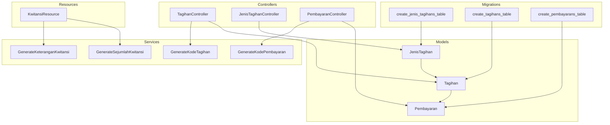
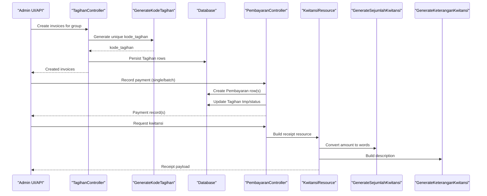
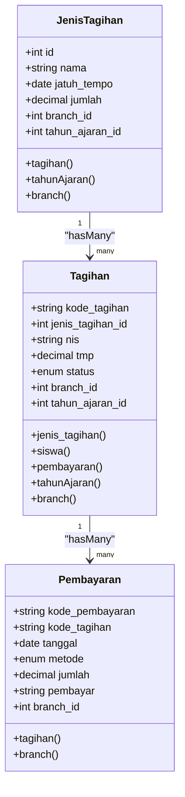
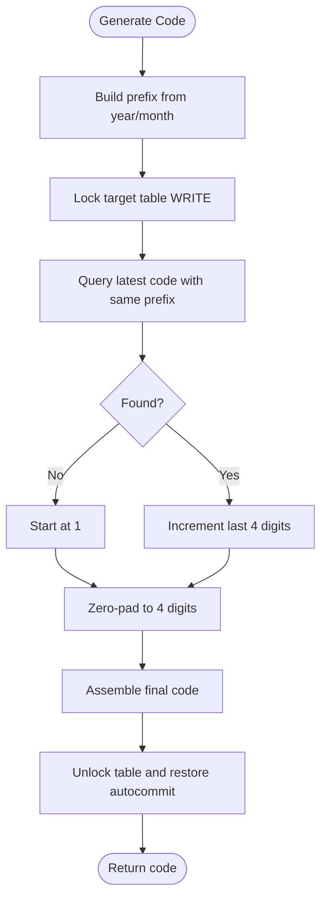
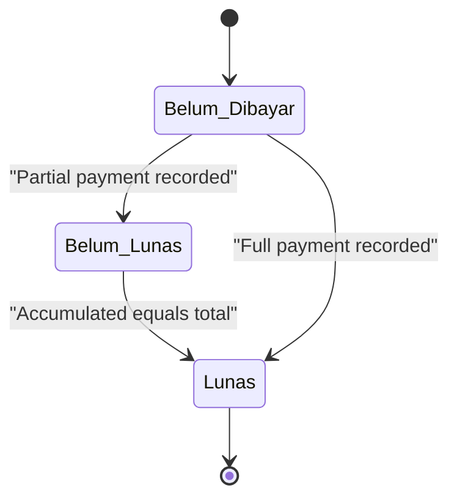
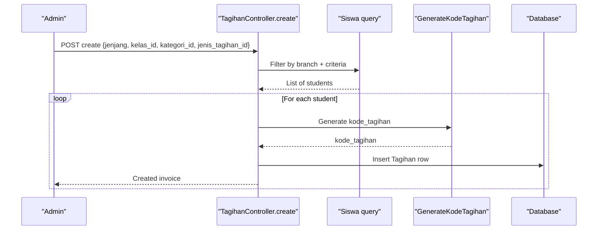
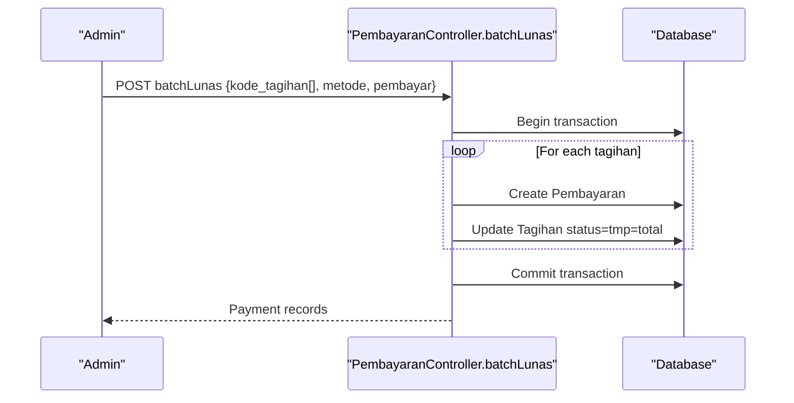
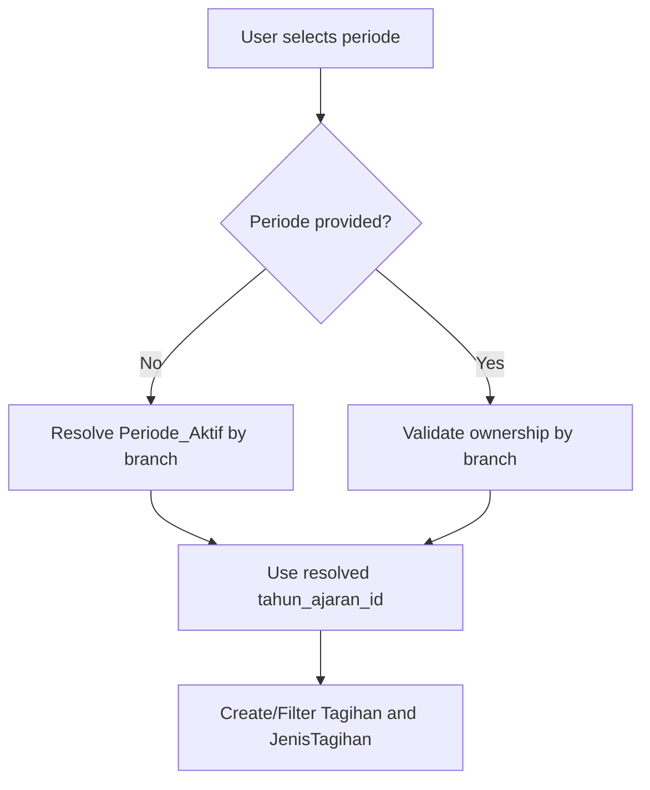
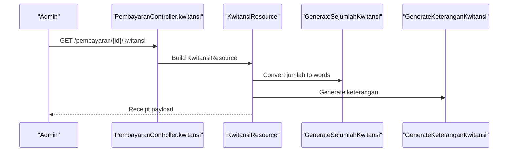
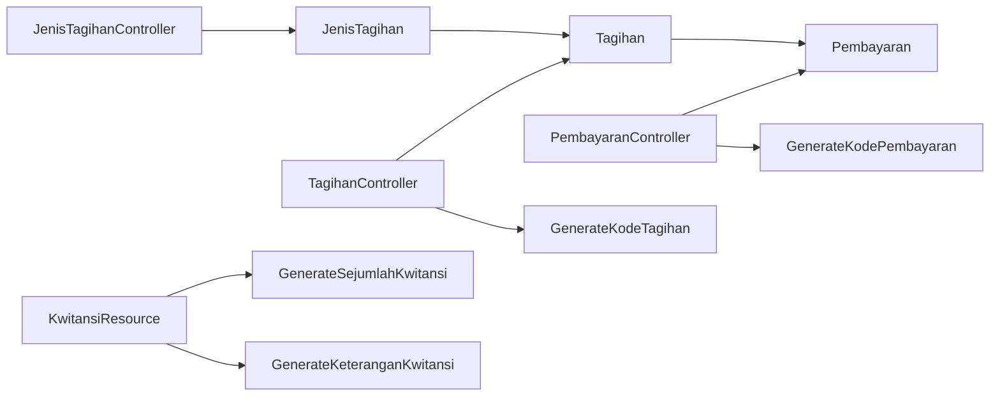

# Billing & Invoice Management

<cite>
**Referenced Files in This Document**
- [Tagihan.php](file://backend/app/Models/Tagihan.php)
- [JenisTagihan.php](file://backend/app/Models/JenisTagihan.php)
- [Pembayaran.php](file://backend/app/Models/Pembayaran.php)
- [TagihanController.php](file://backend/app/Http/Controllers/TagihanController.php)
- [JenisTagihanController.php](file://backend/app/Http/Controllers/JenisTagihanController.php)
- [PembayaranController.php](file://backend/app/Http/Controllers/PembayaranController.php)
- [GenerateKodeTagihan.php](file://backend/app/Services/GenerateKodeTagihan.php)
- [GenerateKodePembayaran.php](file://backend/app/Services/GenerateKodePembayaran.php)
- [GenerateSejumlahKwitansi.php](file://backend/app/Services/GenerateSejumlahKwitansi.php)
- [GenerateKeteranganKwitansi.php](file://backend/app/Services/GenerateKeteranganKwitansi.php)
- [KwitansiResource.php](file://backend/app/Http/Resources/KwitansiResource.php)
- [2025_11_14_093831_create_jenis_tagihans_table.php](file://backend/database/migrations/2025_11_14_093831_create_jenis_tagihans_table.php)
- [2025_11_14_094745_create_tagihans_table.php](file://backend/database/migrations/2025_11_14_094745_create_tagihans_table.php)
- [2025_11_14_102319_create_pembayarans_table.php](file://backend/database/migrations/2025_11_14_102319_create_pembayarans_table.php)
</cite>

## Table of Contents
1. Introduction
2. Project Structure
3. Core Components
4. Architecture Overview
5. Detailed Component Analysis
6. Dependency Analysis
7. Performance Considerations
8. Troubleshooting Guide
9. Conclusion

## Introduction
This document explains the billing and invoice management system in Handayani, focusing on:
- Tagihan (invoice) model structure and lifecycle
- JenisTagihan (payment type) configuration and scoping by academic year and branch
- Automated invoice generation for student groups
- Invoice coding system and status tracking
- Batch operations for mass invoice creation and payments
- Integration with student data and academic years
- Receipt generation (kwitansi) and customization options
- Reconciliation processes and guidelines to extend billing functionality

## Project Structure
The billing domain is implemented across models, controllers, services, resources, and database migrations:
- Models define entities and relationships (Tagihan, JenisTagihan, Pembayaran)
- Controllers expose API endpoints for CRUD, batch operations, and views
- Services generate unique codes and receipt content
- Resources format responses including receipt details
- Migrations define schema evolution and constraints

**Diagram sources**
- [Tagihan.php:1-60](file://backend/app/Models/Tagihan.php#L1-L60)
- [JenisTagihan.php:1-48](file://backend/app/Models/JenisTagihan.php#L1-L48)
- [Pembayaran.php:1-53](file://backend/app/Models/Pembayaran.php#L1-L53)
- [TagihanController.php:1-567](file://backend/app/Http/Controllers/TagihanController.php#L1-L567)
- [JenisTagihanController.php:1-179](file://backend/app/Http/Controllers/JenisTagihanController.php#L1-L179)
- [PembayaranController.php:1-496](file://backend/app/Http/Controllers/PembayaranController.php#L1-L496)
- [GenerateKodeTagihan.php:1-46](file://backend/app/Services/GenerateKodeTagihan.php#L1-L46)
- [GenerateKodePembayaran.php:1-48](file://backend/app/Services/GenerateKodePembayaran.php#L1-L48)
- [GenerateSejumlahKwitansi.php:1-96](file://backend/app/Services/GenerateSejumlahKwitansi.php#L1-L96)
- [GenerateKeteranganKwitansi.php:1-35](file://backend/app/Services/GenerateKeteranganKwitansi.php#L1-L35)
- [KwitansiResource.php:1-31](file://backend/app/Http/Resources/KwitansiResource.php#L1-L31)
- [2025_11_14_093831_create_jenis_tagihans_table.php:1-31](file://backend/database/migrations/2025_11_14_093831_create_jenis_tagihans_table.php#L1-L31)
- [2025_11_14_094745_create_tagihans_table.php:1-33](file://backend/database/migrations/2025_11_14_094745_create_tagihans_table.php#L1-L33)
- [2025_11_14_102319_create_pembayarans_table.php:1-34](file://backend/database/migrations/2025_11_14_102319_create_pembayarans_table.php#L1-L34)

**Section sources**
- [Tagihan.php:1-60](file://backend/app/Models/Tagihan.php#L1-L60)
- [JenisTagihan.php:1-48](file://backend/app/Models/JenisTagihan.php#L1-L48)
- [Pembayaran.php:1-53](file://backend/app/Models/Pembayaran.php#L1-L53)
- [TagihanController.php:1-567](file://backend/app/Http/Controllers/TagihanController.php#L1-L567)
- [JenisTagihanController.php:1-179](file://backend/app/Http/Controllers/JenisTagihanController.php#L1-L179)
- [PembayaranController.php:1-496](file://backend/app/Http/Controllers/PembayaranController.php#L1-L496)
- [GenerateKodeTagihan.php:1-46](file://backend/app/Services/GenerateKodeTagihan.php#L1-L46)
- [GenerateKodePembayaran.php:1-48](file://backend/app/Services/GenerateKodePembayaran.php#L1-L48)
- [GenerateSejumlahKwitansi.php:1-96](file://backend/app/Services/GenerateSejumlahKwitansi.php#L1-L96)
- [GenerateKeteranganKwitansi.php:1-35](file://backend/app/Services/GenerateKeteranganKwitansi.php#L1-L35)
- [KwitansiResource.php:1-31](file://backend/app/Http/Resources/KwitansiResource.php#L1-L31)
- [2025_11_14_093831_create_jenis_tagihans_table.php:1-31](file://backend/database/migrations/2025_11_14_093831_create_jenis_tagihans_table.php#L1-L31)
- [2025_11_14_094745_create_tagihans_table.php:1-33](file://backend/database/migrations/2025_11_14_094745_create_tagihans_table.php#L1-L33)
- [2025_11_14_102319_create_pembayarans_table.php:1-34](file://backend/database/migrations/2025_11_14_102319_create_pembayarans_table.php#L1-L34)

## Core Components
- Tagihan (Invoice): Represents an individual invoice per student for a payment type. It tracks total amount due via related JenisTagihan, accumulated paid amount (tmp), and current status.
- JenisTagihan (Payment Type): Defines a chargeable item (e.g., tuition, activity fee) with a fixed amount and due date, scoped to a branch and academic year.
- Pembayaran (Payment): Records each payment against an invoice, including method, amount, payer name, and date.

Key behaviors:
- Status transitions are driven by accumulated payments vs. total amount.
- Invoices are created in bulk for selected student groups.
- Payments can be recorded individually or in batches.
- Receipts (kwitansi) are generated from payment records with Indonesian text formatting.

**Section sources**
- [Tagihan.php:1-60](file://backend/app/Models/Tagihan.php#L1-L60)
- [JenisTagihan.php:1-48](file://backend/app/Models/JenisTagihan.php#L1-L48)
- [Pembayaran.php:1-53](file://backend/app/Models/Pembayaran.php#L1-L53)

## Architecture Overview
The billing flow spans controllers orchestrating business logic, services generating identifiers and receipts, and models persisting state.

**Diagram sources**
- [TagihanController.php:220-275](file://backend/app/Http/Controllers/TagihanController.php#L220-L275)
- [GenerateKodeTagihan.php:1-46](file://backend/app/Services/GenerateKodeTagihan.php#L1-L46)
- [PembayaranController.php:170-241](file://backend/app/Http/Controllers/PembayaranController.php#L170-L241)
- [KwitansiResource.php:1-31](file://backend/app/Http/Resources/KwitansiResource.php#L1-L31)
- [GenerateSejumlahKwitansi.php:1-96](file://backend/app/Services/GenerateSejumlahKwitansi.php#L1-L96)
- [GenerateKeteranganKwitansi.php:1-35](file://backend/app/Services/GenerateKeteranganKwitansi.php#L1-L35)

## Detailed Component Analysis

### Data Model Relationships

**Diagram sources**
- [JenisTagihan.php:1-48](file://backend/app/Models/JenisTagihan.php#L1-L48)
- [Tagihan.php:1-60](file://backend/app/Models/Tagihan.php#L1-L60)
- [Pembayaran.php:1-53](file://backend/app/Models/Pembayaran.php#L1-L53)

**Section sources**
- [JenisTagihan.php:1-48](file://backend/app/Models/JenisTagihan.php#L1-L48)
- [Tagihan.php:1-60](file://backend/app/Models/Tagihan.php#L1-L60)
- [Pembayaran.php:1-53](file://backend/app/Models/Pembayaran.php#L1-L53)

### Invoice Coding System
- Kode tagihan: Generated with a time-based prefix and sequential number; thread-safe via table lock.
- Kode pembayaran: Similar approach for payment receipts.

**Diagram sources**
- [GenerateKodeTagihan.php:1-46](file://backend/app/Services/GenerateKodeTagihan.php#L1-L46)
- [GenerateKodePembayaran.php:1-48](file://backend/app/Services/GenerateKodePembayaran.php#L1-L48)

**Section sources**
- [GenerateKodeTagihan.php:1-46](file://backend/app/Services/GenerateKodeTagihan.php#L1-L46)
- [GenerateKodePembayaran.php:1-48](file://backend/app/Services/GenerateKodePembayaran.php#L1-L48)

### Invoice Lifecycle and Status Tracking
- Initial status: Belum Dibayar (unpaid).
- Partial payments update tmp and set status to Belum Lunas if not fully paid.
- Full payment sets status to Lunas and updates tmp to total amount.
- Deletion guards prevent removing invoices with existing payments.

**Diagram sources**
- [TagihanController.php:322-357](file://backend/app/Http/Controllers/TagihanController.php#L322-L357)
- [PembayaranController.php:302-397](file://backend/app/Http/Controllers/PembayaranController.php#L302-L397)

**Section sources**
- [TagihanController.php:322-357](file://backend/app/Http/Controllers/TagihanController.php#L322-L357)
- [PembayaranController.php:302-397](file://backend/app/Http/Controllers/PembayaranController.php#L302-L397)

### Automated Invoice Generation for Student Groups
- Bulk creation endpoint accepts filters (jenjang, kelas_id, kategori_id) to select students within a branch.
- For each matched student, a new Tagihan is created with a unique code and assigned to the active academic year (or explicitly provided).
- Notifications are dispatched upon creation.

**Diagram sources**
- [TagihanController.php:220-275](file://backend/app/Http/Controllers/TagihanController.php#L220-L275)
- [GenerateKodeTagihan.php:1-46](file://backend/app/Services/GenerateKodeTagihan.php#L1-L46)

**Section sources**
- [TagihanController.php:220-275](file://backend/app/Http/Controllers/TagihanController.php#L220-L275)

### Batch Operations for Mass Invoice Creation and Payments
- Mass invoice creation: Use the create endpoint with group filters to generate invoices for many students at once.
- Batch payment: Endpoint creates multiple Pembayaran records and updates corresponding Tagihan statuses atomically within a transaction.

**Diagram sources**
- [PembayaranController.php:170-241](file://backend/app/Http/Controllers/PembayaranController.php#L170-L241)

**Section sources**
- [PembayaranController.php:170-241](file://backend/app/Http/Controllers/PembayaranController.php#L170-L241)

### Integration with Student Data and Academic Years
- Invoices are linked to students via NIS and scoped by branch.
- Academic year scoping ensures invoices and payment types belong to a specific period; controllers auto-resolve active period when not provided.

**Diagram sources**
- [TagihanController.php:220-275](file://backend/app/Http/Controllers/TagihanController.php#L220-L275)
- [JenisTagihanController.php:40-78](file://backend/app/Http/Controllers/JenisTagihanController.php#L40-L78)

**Section sources**
- [TagihanController.php:220-275](file://backend/app/Http/Controllers/TagihanController.php#L220-L275)
- [JenisTagihanController.php:40-78](file://backend/app/Http/Controllers/JenisTagihanController.php#L40-L78)

### Receipt Generation (Kwitansi) and Customization
- Kwitansi resource builds receipt data including:
  - Amount in Indonesian words
  - Description combining payment type, student name, and month/year
  - Application settings for branding/layout context
- Customization points:
  - Number-to-words conversion service
  - Description generator service
  - Resource transformation to include additional fields or layout hints

**Diagram sources**
- [PembayaranController.php:400-410](file://backend/app/Http/Controllers/PembayaranController.php#L400-L410)
- [KwitansiResource.php:1-31](file://backend/app/Http/Resources/KwitansiResource.php#L1-L31)
- [GenerateSejumlahKwitansi.php:1-96](file://backend/app/Services/GenerateSejumlahKwitansi.php#L1-L96)
- [GenerateKeteranganKwitansi.php:1-35](file://backend/app/Services/GenerateKeteranganKwitansi.php#L1-L35)

**Section sources**
- [PembayaranController.php:400-410](file://backend/app/Http/Controllers/PembayaranController.php#L400-L410)
- [KwitansiResource.php:1-31](file://backend/app/Http/Resources/KwitansiResource.php#L1-L31)
- [GenerateSejumlahKwitansi.php:1-96](file://backend/app/Services/GenerateSejumlahKwitansi.php#L1-L96)
- [GenerateKeteranganKwitansi.php:1-35](file://backend/app/Services/GenerateKeteranganKwitansi.php#L1-L35)

### Practical Examples

- Creating custom payment types:
  - Use JenisTagihanController to add a new type with nama, jatuh_tempo, jumlah, and assign it to a branch and academic year.
  - Reference: [JenisTagihanController.create:40-78](file://backend/app/Http/Controllers/JenisTagihanController.php#L40-L78)

- Generating invoices for specific student groups:
  - Call TagihanController.create with filters such as jenjang, kelas_id, kategori_id to target a subset of students within a branch.
  - Reference: [TagihanController.create:220-275](file://backend/app/Http/Controllers/TagihanController.php#L220-L275)

- Managing invoice lifecycles:
  - Record partial/full payments using PembayaranController.bayar or lunas; status updates are automatic based on accumulated amounts.
  - Delete invoices only if no payments exist.
  - References:
    - [PembayaranController.bayar:343-397](file://backend/app/Http/Controllers/PembayaranController.php#L343-L397)
    - [PembayaranController.lunas:302-340](file://backend/app/Http/Controllers/PembayaranController.php#L302-L340)
    - [TagihanController.delete:295-319](file://backend/app/Http/Controllers/TagihanController.php#L295-L319)

**Section sources**
- [JenisTagihanController.php:40-78](file://backend/app/Http/Controllers/JenisTagihanController.php#L40-L78)
- [TagihanController.php:220-275](file://backend/app/Http/Controllers/TagihanController.php#L220-L275)
- [PembayaranController.php:302-397](file://backend/app/Http/Controllers/PembayaranController.php#L302-L397)
- [TagihanController.php:295-319](file://backend/app/Http/Controllers/TagihanController.php#L295-L319)

## Dependency Analysis

**Diagram sources**
- [JenisTagihanController.php:1-179](file://backend/app/Http/Controllers/JenisTagihanController.php#L1-L179)
- [TagihanController.php:1-567](file://backend/app/Http/Controllers/TagihanController.php#L1-L567)
- [PembayaranController.php:1-496](file://backend/app/Http/Controllers/PembayaranController.php#L1-L496)
- [JenisTagihan.php:1-48](file://backend/app/Models/JenisTagihan.php#L1-L48)
- [Tagihan.php:1-60](file://backend/app/Models/Tagihan.php#L1-L60)
- [Pembayaran.php:1-53](file://backend/app/Models/Pembayaran.php#L1-L53)
- [GenerateKodeTagihan.php:1-46](file://backend/app/Services/GenerateKodeTagihan.php#L1-L46)
- [GenerateKodePembayaran.php:1-48](file://backend/app/Services/GenerateKodePembayaran.php#L1-L48)
- [KwitansiResource.php:1-31](file://backend/app/Http/Resources/KwitansiResource.php#L1-L31)
- [GenerateSejumlahKwitansi.php:1-96](file://backend/app/Services/GenerateSejumlahKwitansi.php#L1-L96)
- [GenerateKeteranganKwitansi.php:1-35](file://backend/app/Services/GenerateKeteranganKwitansi.php#L1-L35)

**Section sources**
- [JenisTagihanController.php:1-179](file://backend/app/Http/Controllers/JenisTagihanController.php#L1-L179)
- [TagihanController.php:1-567](file://backend/app/Http/Controllers/TagihanController.php#L1-L567)
- [PembayaranController.php:1-496](file://backend/app/Http/Controllers/PembayaranController.php#L1-L496)
- [JenisTagihan.php:1-48](file://backend/app/Models/JenisTagihan.php#L1-L48)
- [Tagihan.php:1-60](file://backend/app/Models/Tagihan.php#L1-L60)
- [Pembayaran.php:1-53](file://backend/app/Models/Pembayaran.php#L1-L53)
- [GenerateKodeTagihan.php:1-46](file://backend/app/Services/GenerateKodeTagihan.php#L1-L46)
- [GenerateKodePembayaran.php:1-48](file://backend/app/Services/GenerateKodePembayaran.php#L1-L48)
- [KwitansiResource.php:1-31](file://backend/app/Http/Resources/KwitansiResource.php#L1-L31)
- [GenerateSejumlahKwitansi.php:1-96](file://backend/app/Services/GenerateSejumlahKwitansi.php#L1-L96)
- [GenerateKeteranganKwitansi.php:1-35](file://backend/app/Services/GenerateKeteranganKwitansi.php#L1-L35)

## Performance Considerations
- Unique code generation uses explicit table locks to avoid collisions under concurrency; ensure database engine supports LOCK TABLES and that autocommit toggling does not interfere with application transactions.
- Batch payment operations wrap multiple inserts and updates in a single transaction to maintain consistency and reduce round-trips.
- Grouped queries use eager loading and selective columns to minimize payload size and improve response times.

[No sources needed since this section provides general guidance]

## Troubleshooting Guide
Common issues and resolutions:
- Cannot delete invoice: If any Pembayaran exists, deletion is blocked to preserve auditability. Remove payments first or adjust workflow permissions.
  - Reference: [TagihanController.delete:295-319](file://backend/app/Http/Controllers/TagihanController.php#L295-L319)
- Overpayment validation: Payment amount must not exceed remaining balance; controller enforces checks before recording.
  - Reference: [PembayaranController.bayar:343-397](file://backend/app/Http/Controllers/PembayaranController.php#L343-L397)
- Online payment deletion restrictions: Deleting online_midtrans payments requires specific permissions; otherwise, an exception is raised.
  - Reference: [PembayaranController.delete:244-299](file://backend/app/Http/Controllers/PembayaranController.php#L244-L299)
- Academic year scoping errors: Ensure Periode_Aktif is configured for the branch or provide a valid tahun_ajaran_id owned by the user’s branch.
  - References:
    - [TagihanController.create:220-275](file://backend/app/Http/Controllers/TagihanController.php#L220-L275)
    - [JenisTagihanController.create:40-78](file://backend/app/Http/Controllers/JenisTagihanController.php#L40-L78)

**Section sources**
- [TagihanController.php:295-319](file://backend/app/Http/Controllers/TagihanController.php#L295-L319)
- [PembayaranController.php:244-397](file://backend/app/Http/Controllers/PembayaranController.php#L244-L397)
- [JenisTagihanController.php:40-78](file://backend/app/Http/Controllers/JenisTagihanController.php#L40-L78)

## Conclusion
Handayani’s billing system provides a robust foundation for managing invoices and payments:
- Clear separation of concerns between models, controllers, services, and resources
- Safe and deterministic invoice/payment code generation
- Flexible grouping and scoping by academic year and branch
- Comprehensive receipt generation with localization support
- Strong safeguards around deletions and overpayments

To extend functionality:
- Add new payment types via JenisTagihan
- Introduce new invoice categories by extending Tagihan filters and exports
- Customize receipt content through services and resources
- Implement additional reconciliation reports by leveraging existing grouped queries and export utilities

[No sources needed since this section summarizes without analyzing specific files]