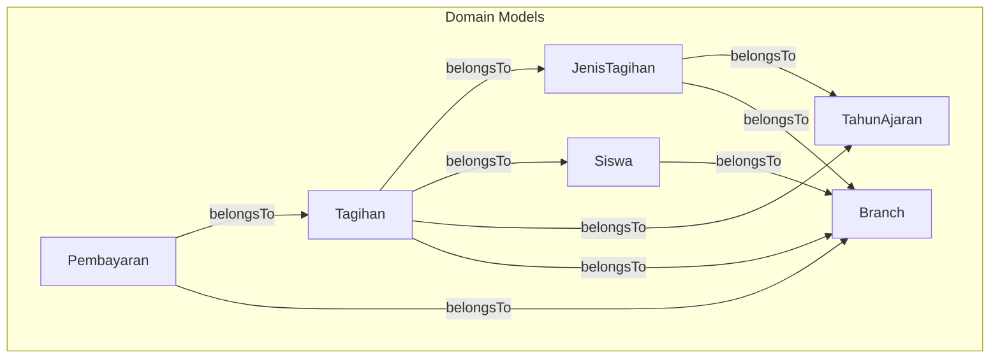
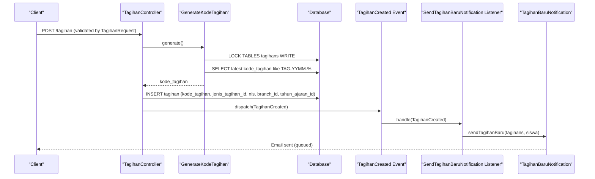
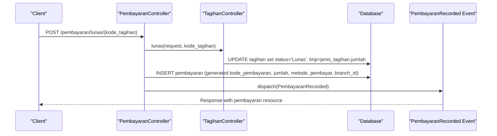
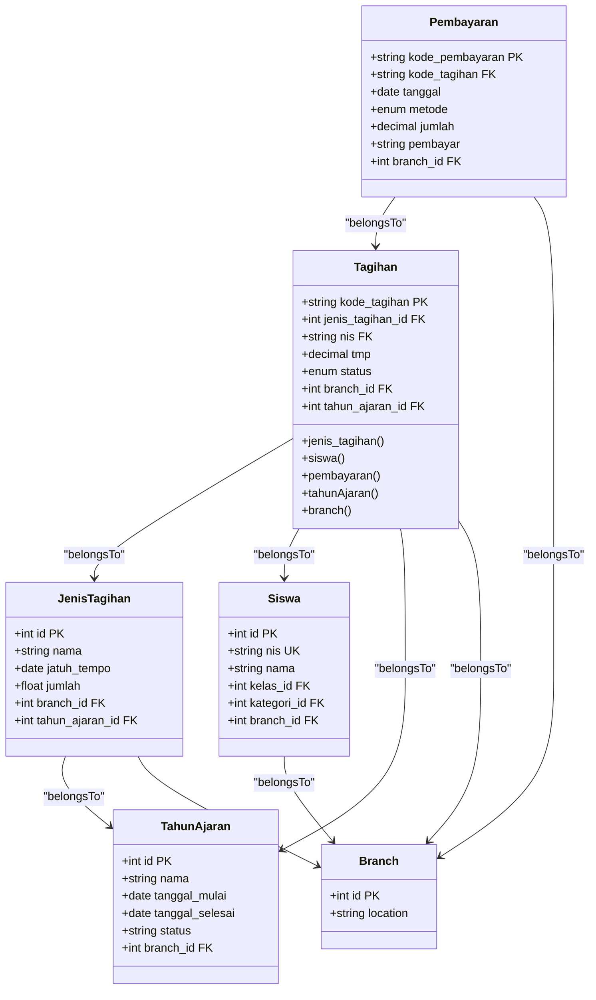
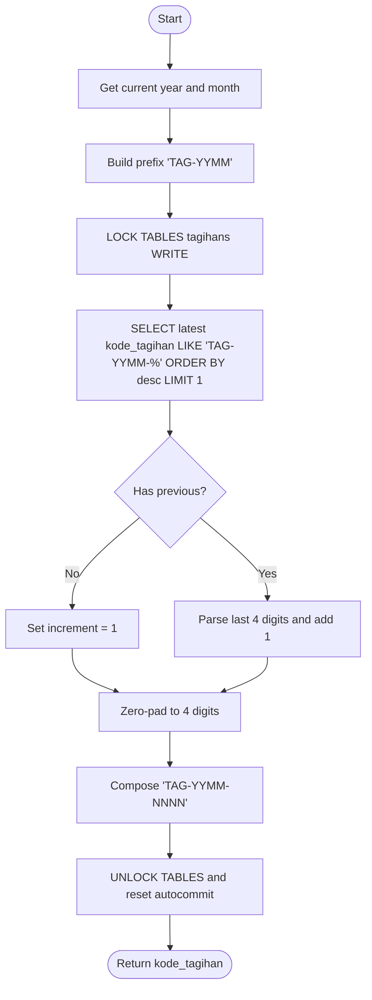
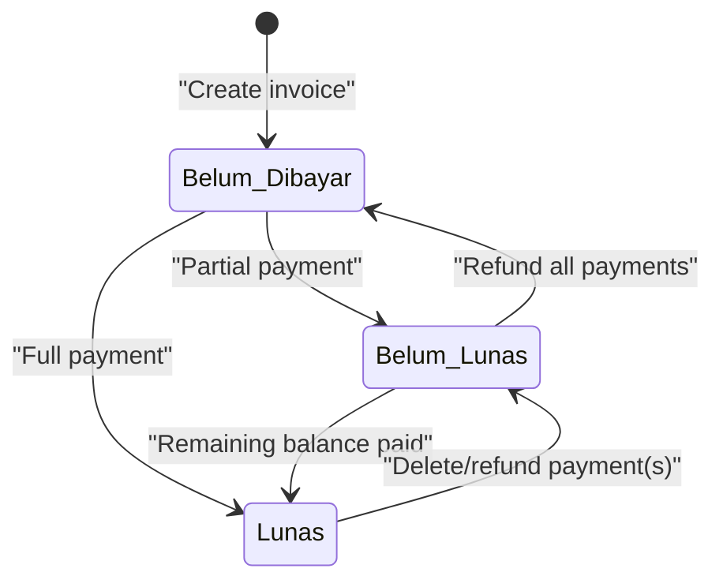
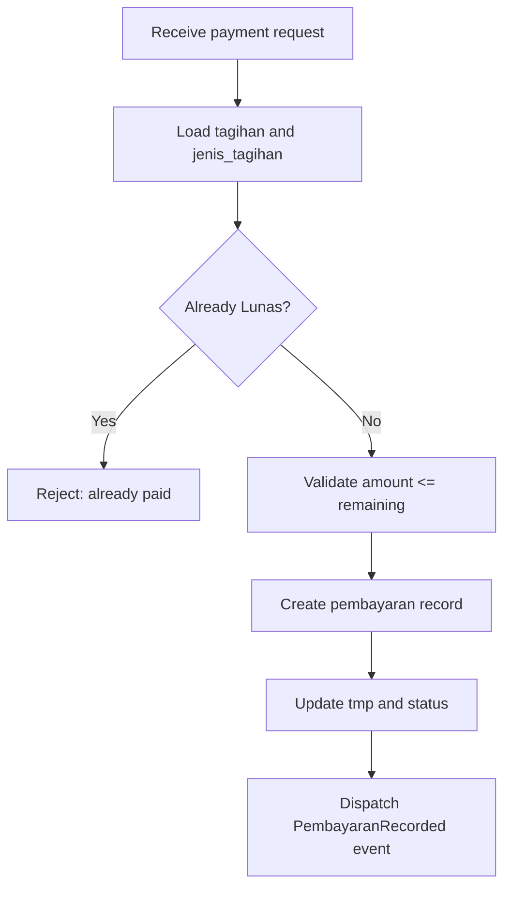
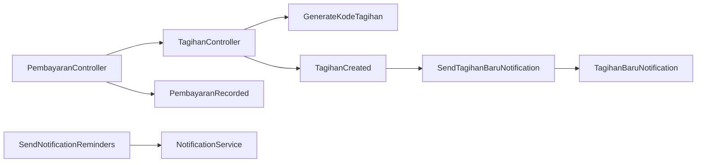

# Invoice Generation & Lifecycle

<cite>
**Referenced Files in This Document**
- [Tagihan.php](file://backend/app/Models/Tagihan.php)
- [JenisTagihan.php](file://backend/app/Models/JenisTagihan.php)
- [Siswa.php](file://backend/app/Models/Siswa.php)
- [TahunAjaran.php](file://backend/app/Models/TahunAjaran.php)
- [Branch.php](file://backend/app/Models/Branch.php)
- [Pembayaran.php](file://backend/app/Models/Pembayaran.php)
- [2025_11_14_094745_create_tagihans_table.php](file://backend/database/migrations/2025_11_14_094745_create_tagihans_table.php)
- [2025_11_14_102319_create_pembayarans_table.php](file://backend/database/migrations/2025_11_14_102319_create_pembayarans_table.php)
- [GenerateKodeTagihan.php](file://backend/app/Services/GenerateKodeTagihan.php)
- [TagihanController.php](file://backend/app/Http/Controllers/TagihanController.php)
- [PembayaranController.php](file://backend/app/Http/Controllers/PembayaranController.php)
- [TagihanRequest.php](file://backend/app/Http/Requests/TagihanRequest.php)
- [TagihanCreated.php](file://backend/app/Events/TagihanCreated.php)
- [SendTagihanBaruNotification.php](file://backend/app/Listeners/SendTagihanBaruNotification.php)
- [TagihanBaruNotification.php](file://backend/app/Notifications/TagihanBaruNotification.php)
- [ReminderJatuhTempoNotification.php](file://backend/app/Notifications/ReminderJatuhTempoNotification.php)
- [SendNotificationReminders.php](file://backend/app/Console/Commands/SendNotificationReminders.php)
</cite>

## Table of Contents
1. Introduction
2. Project Structure
3. Core Components
4. Architecture Overview
5. Detailed Component Analysis
6. Dependency Analysis
7. Performance Considerations
8. Troubleshooting Guide
9. Conclusion

## Introduction
This document explains invoice (Tagihan) generation and lifecycle management in the Handayani system. It covers the Tagihan model structure, primary key strategy using kode_tagihan, status tracking, automated invoice creation, code generation patterns, validation rules, lifecycle states and transitions, relationships with Siswa, JenisTagihan, TahunAjaran, and Branch, as well as practical examples for creating invoices programmatically, querying by criteria, managing statuses, reconciliation processes, and guidelines for extending functionality.

## Project Structure
The invoice domain spans models, controllers, services, events/listeners/notifications, migrations, and requests. The core entities are:
- Tagihan (invoice)
- Pembayaran (payment)
- JenisTagihan (invoice type)
- Siswa (student)
- TahunAjaran (academic year)
- Branch

**Diagram sources**
- [Tagihan.php](file://backend/app/Models/Tagihan.php)
- [Pembayaran.php](file://backend/app/Models/Pembayaran.php)
- [JenisTagihan.php](file://backend/app/Models/JenisTagihan.php)
- [Siswa.php](file://backend/app/Models/Siswa.php)
- [TahunAjaran.php](file://backend/app/Models/TahunAjaran.php)
- [Branch.php](file://backend/app/Models/Branch.php)

**Section sources**
- [Tagihan.php](file://backend/app/Models/Tagihan.php)
- [Pembayaran.php](file://backend/app/Models/Pembayaran.php)
- [JenisTagihan.php](file://backend/app/Models/JenisTagihan.php)
- [Siswa.php](file://backend/app/Models/Siswa.php)
- [TahunAjaran.php](file://backend/app/Models/TahunAjaran.php)
- [Branch.php](file://backend/app/Models/Branch.php)

## Core Components
- Tagihan model:
  - Primary key is kode_tagihan (string), non-auto-incrementing.
  - Status enum values: Lunas, Belum Lunas, Belum Dibayar.
  - Tracks partial payments via tmp (accumulated paid amount).
  - Relationships to JenisTagihan, Siswa, TahunAjaran, Branch, and many-to-many Pembayaran.
- Pembayaran model:
  - Records each payment against a tagihan; includes method, date, payer, amount, branch.
- JenisTagihan model:
  - Defines invoice type, due date, total amount, and belongs to academic year and branch.
- Siswa model:
  - Student entity linked to invoices via NIS.
- TahunAjaran model:
  - Academic year with active period helper used for default scoping.
- Branch model:
  - Multi-tenant isolation boundary for users, students, invoices, and payments.

Key behaviors:
- Invoice creation validates request inputs, resolves active academic year if not provided, generates unique kode_tagihan per month/year, and dispatches a new invoice notification event.
- Payment flows update accumulated amount (tmp) and status accordingly, ensuring totals do not exceed invoice amount.
- Deletion prevention ensures invoices with payments cannot be deleted.

**Section sources**
- [Tagihan.php](file://backend/app/Models/Tagihan.php)
- [Pembayaran.php](file://backend/app/Models/Pembayaran.php)
- [JenisTagihan.php](file://backend/app/Models/JenisTagihan.php)
- [Siswa.php](file://backend/app/Models/Siswa.php)
- [TahunAjaran.php](file://backend/app/Models/TahunAjaran.php)
- [Branch.php](file://backend/app/Models/Branch.php)
- [TagihanController.php](file://backend/app/Http/Controllers/TagihanController.php)
- [PembayaranController.php](file://backend/app/Http/Controllers/PembayaranController.php)

## Architecture Overview
End-to-end flows for invoice creation and payment:

**Diagram sources**
- [TagihanController.php](file://backend/app/Http/Controllers/TagihanController.php)
- [GenerateKodeTagihan.php](file://backend/app/Services/GenerateKodeTagihan.php)
- [TagihanCreated.php](file://backend/app/Events/TagihanCreated.php)
- [SendTagihanBaruNotification.php](file://backend/app/Listeners/SendTagihanBaruNotification.php)
- [TagihanBaruNotification.php](file://backend/app/Notifications/TagihanBaruNotification.php)

Payment flow (single):

**Diagram sources**
- [PembayaranController.php](file://backend/app/Http/Controllers/PembayaranController.php)
- [TagihanController.php](file://backend/app/Http/Controllers/TagihanController.php)

## Detailed Component Analysis

### Tagihan Model and Database Schema
- Primary key strategy:
  - kode_tagihan is the primary key and is generated by service GenerateKodeTagihan.
  - Non-incrementing string key avoids collisions across branches and periods.
- Status field:
  - Enum values: Lunas, Belum Lunas, Belum Dibayar.
- Partial payments:
  - tmp accumulates paid amounts; status transitions depend on comparison between tmp and jenis_tagihan.jumlah.
- Relationships:
  - belongsTo JenisTagihan, Siswa, TahunAjaran, Branch.
  - hasMany Pembayaran.

**Diagram sources**
- [Tagihan.php](file://backend/app/Models/Tagihan.php)
- [JenisTagihan.php](file://backend/app/Models/JenisTagihan.php)
- [Siswa.php](file://backend/app/Models/Siswa.php)
- [TahunAjaran.php](file://backend/app/Models/TahunAjaran.php)
- [Branch.php](file://backend/app/Models/Branch.php)
- [Pembayaran.php](file://backend/app/Models/Pembayaran.php)

**Section sources**
- [Tagihan.php](file://backend/app/Models/Tagihan.php)
- [2025_11_14_094745_create_tagihans_table.php](file://backend/database/migrations/2025_11_14_094745_create_tagihans_table.php)
- [2025_11_14_102319_create_pembayarans_table.php](file://backend/database/migrations/2025_11_14_102319_create_pembayarans_table.php)

### Code Generation Pattern for kode_tagihan
- Format: TAG-YYMM-NNNN where YYMM is current year-month and NNNN is a zero-padded sequence.
- Concurrency safety:
  - Uses table-level write lock around selection and generation to avoid duplicate codes under concurrent writes.
- Sequence resolution:
  - Finds the latest matching prefix and increments last four digits.

**Diagram sources**
- [GenerateKodeTagihan.php](file://backend/app/Services/GenerateKodeTagihan.php)

**Section sources**
- [GenerateKodeTagihan.php](file://backend/app/Services/GenerateKodeTagihan.php)

### Validation Rules for Creating Invoices
- Required fields:
  - jenis_tagihan_id must exist in jenis_tagihans.
  - jenjang must be one of MI, KB, TK.
  - kelas_id must exist in kelas.
  - kategori_id must exist in kategoris.
- Additional server-side validations:
  - Resolves tahun_ajaran_id from request or defaults to active period for the user’s branch.
  - Ensures student records exist for the given filters within the same branch.

**Section sources**
- [TagihanRequest.php](file://backend/app/Http/Requests/TagihanRequest.php)
- [TagihanController.php](file://backend/app/Http/Controllers/TagihanController.php)

### Automated Invoice Creation Process
- Controller action:
  - Validates input via TagihanRequest.
  - Resolves tahun_ajaran_id (active period if not provided).
  - Finds eligible students based on kelas, jenjang, kategori, and branch.
  - For each student:
    - Generates kode_tagihan.
    - Creates Tagihan record.
    - Dispatches TagihanCreated event to trigger notifications.

Practical example (programmatic creation):
- Call the create endpoint with validated payload including jenis_tagihan_id, jenjang, kelas_id, kategori_id. Optionally provide tahun_ajaran_id; otherwise it will be auto-assigned from the active period for the authenticated user’s branch.

**Section sources**
- [TagihanController.php](file://backend/app/Http/Controllers/TagihanController.php)
- [TagihanCreated.php](file://backend/app/Events/TagihanCreated.php)
- [SendTagihanBaruNotification.php](file://backend/app/Listeners/SendTagihanBaruNotification.php)
- [TagihanBaruNotification.php](file://backend/app/Notifications/TagihanBaruNotification.php)

### Invoice Lifecycle States and Transitions
- States:
  - Belum Dibayar (unpaid)
  - Belum Lunas (partially paid)
  - Lunas (fully paid)
- Transitions:
  - Create: status starts as Belum Dibayar.
  - Partial payment:
    - Accumulate tmp; if tmp equals jenis_tagihan.jumlah then status becomes Lunas, else Belum Lunas.
  - Full payment:
    - Set tmp to jenis_tagihan.jumlah and status to Lunas.
  - Refund/Deletion of payment:
    - Adjust tmp downward; recompute status based on tmp vs. jumlah.
  - Overdue:
    - Not a persisted state; determined by comparing jatuh_tempo with current date when status != Lunas.

**Diagram sources**
- [TagihanController.php](file://backend/app/Http/Controllers/TagihanController.php)
- [PembayaranController.php](file://backend/app/Http/Controllers/PembayaranController.php)

**Section sources**
- [TagihanController.php](file://backend/app/Http/Controllers/TagihanController.php)
- [PembayaranController.php](file://backend/app/Http/Controllers/PembayaranController.php)

### Relationships Between Invoices and Related Entities
- Siswa:
  - One-to-many from Siswa to Tagihan via NIS.
- JenisTagihan:
  - One-to-many from JenisTagihan to Tagihan; defines due date and total amount.
- TahunAjaran:
  - Used to scope invoices and types to an academic year; active period resolved automatically.
- Branch:
  - Isolates data per branch for users, students, invoices, and payments.

**Section sources**
- [Tagihan.php](file://backend/app/Models/Tagihan.php)
- [JenisTagihan.php](file://backend/app/Models/JenisTagihan.php)
- [Siswa.php](file://backend/app/Models/Siswa.php)
- [TahunAjaran.php](file://backend/app/Models/TahunAjaran.php)
- [Branch.php](file://backend/app/Models/Branch.php)

### Practical Examples

#### Creating Invoices Programmatically
- Use the create endpoint with validated fields. The controller will:
  - Resolve tahun_ajaran_id if omitted.
  - Find students by kelas, jenjang, kategori within the user’s branch.
  - Generate kode_tagihan and persist invoices.
  - Emit TagihanCreated event for notifications.

**Section sources**
- [TagihanController.php](file://backend/app/Http/Controllers/TagihanController.php)
- [TagihanRequest.php](file://backend/app/Http/Requests/TagihanRequest.php)

#### Querying Invoices by Criteria
- List invoices with filters:
  - Search by kode_tagihan, student name, or NIS.
  - Filter by jenjang, status, and academic year.
  - Sort by kode_tagihan, nis, status, tmp, created_at.
- Grouped view:
  - Returns students with their invoices grouped, supporting search, jenjang, status, and due date range filters.

**Section sources**
- [TagihanController.php](file://backend/app/Http/Controllers/TagihanController.php)

#### Managing Invoice Statuses
- Mark fully paid:
  - Endpoint updates status to Lunas and sets tmp to jenis_tagihan.jumlah.
- Partial payment:
  - Adds amount to tmp; recalculates status based on remaining balance.
- Delete payment:
  - Reverses payment amount from tmp and recomputes status.

**Section sources**
- [TagihanController.php](file://backend/app/Http/Controllers/TagihanController.php)
- [PembayaranController.php](file://backend/app/Http/Controllers/PembayaranController.php)

### Invoice Reconciliation Processes
- Reconciliation logic:
  - Compare accumulated tmp with jenis_tagihan.jumlah to determine final status.
  - Ensure no overpayment beyond invoice amount.
  - Prevent deletion of invoices that have associated payments.
- Batch operations:
  - Batch mark multiple invoices as paid atomically within a transaction.

**Diagram sources**
- [PembayaranController.php](file://backend/app/Http/Controllers/PembayaranController.php)
- [TagihanController.php](file://backend/app/Http/Controllers/TagihanController.php)

**Section sources**
- [PembayaranController.php](file://backend/app/Http/Controllers/PembayaranController.php)
- [TagihanController.php](file://backend/app/Http/Controllers/TagihanController.php)

### Notifications and Reminders
- New invoice notification:
  - On TagihanCreated event, listener sends email via notification service.
- Due date reminders and overdue alerts:
  - Console command triggers reminder and overdue processing through NotificationService.

**Section sources**
- [TagihanCreated.php](file://backend/app/Events/TagihanCreated.php)
- [SendTagihanBaruNotification.php](file://backend/app/Listeners/SendTagihanBaruNotification.php)
- [TagihanBaruNotification.php](file://backend/app/Notifications/TagihanBaruNotification.php)
- [ReminderJatuhTempoNotification.php](file://backend/app/Notifications/ReminderJatuhTempoNotification.php)
- [SendNotificationReminders.php](file://backend/app/Console/Commands/SendNotificationReminders.php)

### Guidelines for Extending Invoice Functionality
- Adding new statuses:
  - Update database enum and model casts if needed.
  - Extend transition guards in controllers to enforce valid moves.
- New code generation schemes:
  - Implement a new generator service following the locking pattern to ensure uniqueness.
- Additional audit trails:
  - Introduce log entries on status changes and payment adjustments.
- Enhanced reporting:
  - Add export endpoints similar to existing PDF export, filtering by academic year, branch, and status.

[No sources needed since this section provides general guidance]

## Dependency Analysis
High-level dependencies among components:

**Diagram sources**
- [TagihanController.php](file://backend/app/Http/Controllers/TagihanController.php)
- [GenerateKodeTagihan.php](file://backend/app/Services/GenerateKodeTagihan.php)
- [TagihanCreated.php](file://backend/app/Events/TagihanCreated.php)
- [SendTagihanBaruNotification.php](file://backend/app/Listeners/SendTagihanBaruNotification.php)
- [TagihanBaruNotification.php](file://backend/app/Notifications/TagihanBaruNotification.php)
- [PembayaranController.php](file://backend/app/Http/Controllers/PembayaranController.php)
- [SendNotificationReminders.php](file://backend/app/Console/Commands/SendNotificationReminders.php)

**Section sources**
- [TagihanController.php](file://backend/app/Http/Controllers/TagihanController.php)
- [PembayaranController.php](file://backend/app/Http/Controllers/PembayaranController.php)
- [GenerateKodeTagihan.php](file://backend/app/Services/GenerateKodeTagihan.php)
- [TagihanCreated.php](file://backend/app/Events/TagihanCreated.php)
- [SendTagihanBaruNotification.php](file://backend/app/Listeners/SendTagihanBaruNotification.php)
- [TagihanBaruNotification.php](file://backend/app/Notifications/TagihanBaruNotification.php)
- [SendNotificationReminders.php](file://backend/app/Console/Commands/SendNotificationReminders.php)

## Performance Considerations
- Avoid N+1 queries by eager loading relationships in list endpoints.
- Use pagination at appropriate levels (e.g., siswa-level grouping).
- Keep table locks minimal; only around code generation to prevent duplicates.
- Prefer selective column projection to reduce payload size.
- Offload notifications to queues to keep API responses fast.

[No sources needed since this section provides general guidance]

## Troubleshooting Guide
Common issues and resolutions:
- Duplicate kode_tagihan:
  - Ensure table locks are applied during generation and that concurrent workers use the same locking strategy.
- Overpayment errors:
  - Validate accumulated tmp plus new payment does not exceed jenis_tagihan.jumlah before updating.
- Cannot delete invoice:
  - If any pembayaran exists, deletion is blocked; remove or adjust payments first.
- Missing active academic year:
  - When creating invoices without explicit tahun_ajaran_id, ensure an active period exists for the user’s branch.

**Section sources**
- [GenerateKodeTagihan.php](file://backend/app/Services/GenerateKodeTagihan.php)
- [TagihanController.php](file://backend/app/Http/Controllers/TagihanController.php)
- [PembayaranController.php](file://backend/app/Http/Controllers/PembayaranController.php)

## Conclusion
The Handayani system implements a robust invoice lifecycle with clear state transitions, safe code generation, and strong multi-tenant isolation. Payments reconcile accurately against invoice totals, and notifications keep stakeholders informed. The design supports extension points for additional statuses, reporting, and auditability while maintaining performance and correctness.