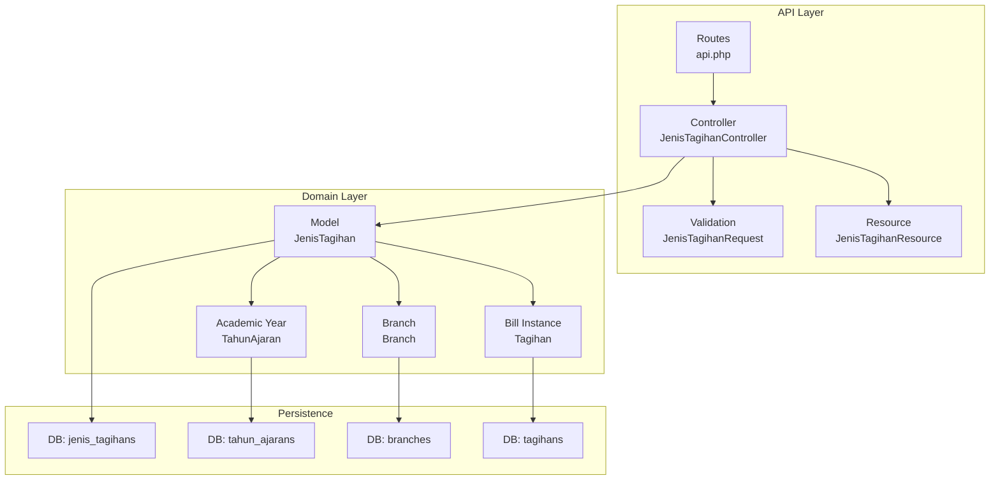
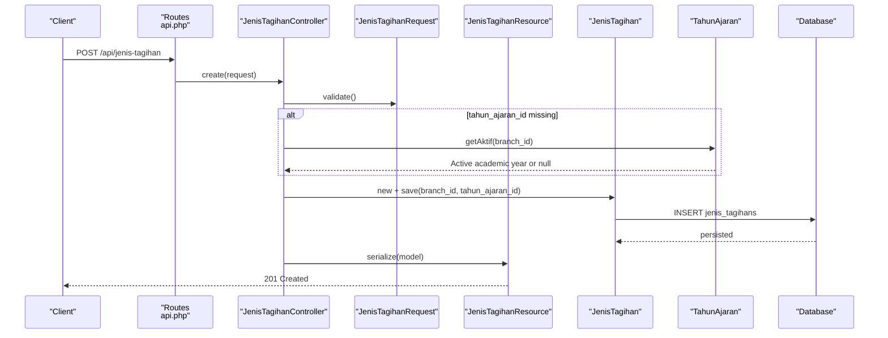
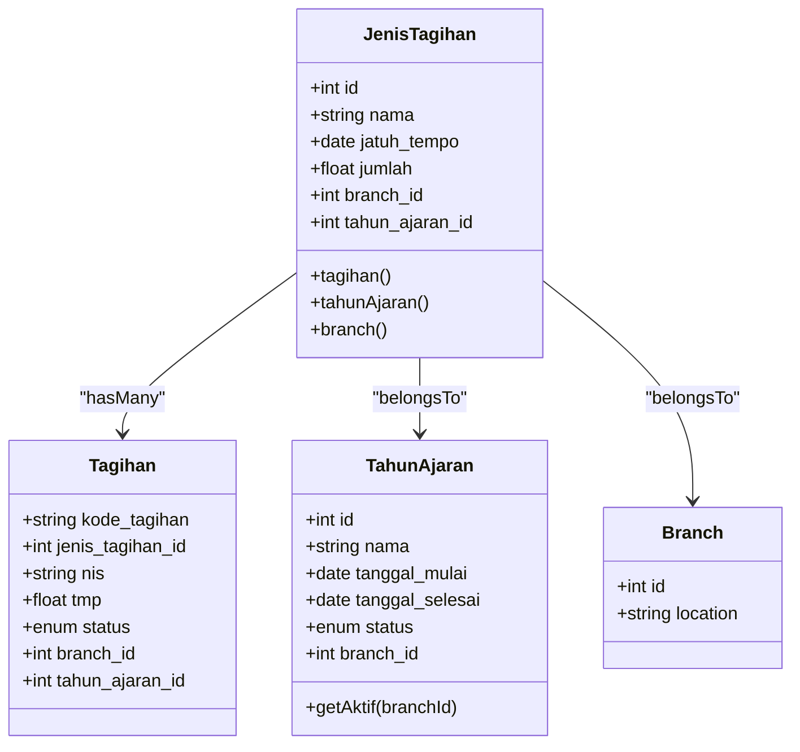
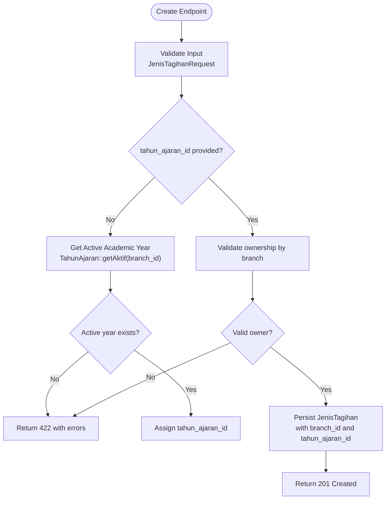
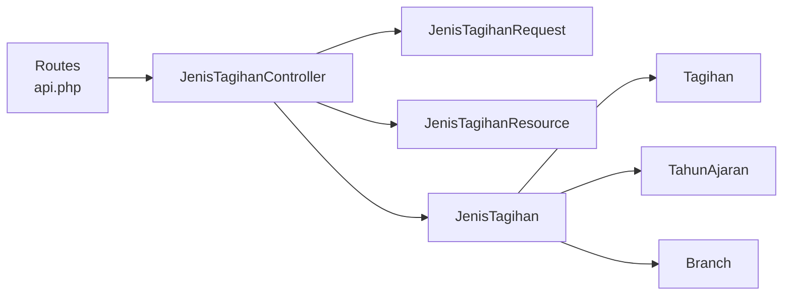

# Payment Type Configuration

<cite>
**Referenced Files in This Document**
- [JenisTagihan.php](file://backend/app/Models/JenisTagihan.php)
- [JenisTagihanController.php](file://backend/app/Http/Controllers/JenisTagihanController.php)
- [JenisTagihanRequest.php](file://backend/app/Http/Requests/JenisTagihanRequest.php)
- [JenisTagihanResource.php](file://backend/app/Http/Resources/JenisTagihanResource.php)
- [api.php](file://backend/routes/api.php)
- [jenis-tagihan-api.json](file://backend/docs/jenis-tagihan-api.json)
- [2025_11_14_093831_create_jenis_tagihans_table.php](file://backend/database/migrations/2025_11_14_093831_create_jenis_tagihans_table.php)
- [2026_05_25_100100_add_tahun_ajaran_id_to_tagihans_and_jenis_tagihans.php](file://backend/database/migrations/2026_05_25_100100_add_tahun_ajaran_id_to_tagihans_and_jenis_tagihans.php)
- [2026_05_25_100400_make_jenis_tagihans_tahun_ajaran_id_not_null.php](file://backend/database/migrations/2026_05_25_100400_make_jenis_tagihans_tahun_ajaran_id_not_null.php)
- [2025_11_14_094745_create_tagihans_table.php](file://backend/database/migrations/2025_11_14_094745_create_tagihans_table.php)
- [2026_05_25_100000_create_tahun_ajarans_table.php](file://backend/database/migrations/2026_05_25_100000_create_tahun_ajarans_table.php)
- [TahunAjaran.php](file://backend/app/Models/TahunAjaran.php)
- [Branch.php](file://backend/app/Models/Branch.php)
- [Tagihan.php](file://backend/app/Models/Tagihan.php)
</cite>

## Table of Contents
1. [Introduction](#introduction)
2. [Project Structure](#project-structure)
3. [Core Components](#core-components)
4. [Architecture Overview](#architecture-overview)
5. [Detailed Component Analysis](#detailed-component-analysis)
6. [Dependency Analysis](#dependency-analysis)
7. [Performance Considerations](#performance-considerations)
8. [Troubleshooting Guide](#troubleshooting-guide)
9. [Conclusion](#conclusion)
10. [Appendices](#appendices)

## Introduction
This document explains how payment types are configured and used in the Handayani billing system. It focuses on the JenisTagihan model, which defines bill categories such as tuition fees or activity fees, and documents its configuration options including amount calculation fields, due date rules, and scoping by academic year and branch. It also covers API endpoints for managing payment types and provides guidance for implementing recurring payments and conditional rules using existing structures.

## Project Structure
The payment type feature is implemented with a standard Laravel MVC pattern:
- Model: JenisTagihan
- Controller: JenisTagihanController
- Request validation: JenisTagihanRequest
- Resource serialization: JenisTagihanResource
- Routes: api.php
- OpenAPI documentation: jenis-tagihan-api.json
- Database migrations for schema evolution (including academic year linkage)

**Diagram sources**
- [api.php:187-194](file://backend/routes/api.php#L187-L194)
- [JenisTagihanController.php:15-179](file://backend/app/Http/Controllers/JenisTagihanController.php#L15-L179)
- [JenisTagihanRequest.php:1-55](file://backend/app/Http/Requests/JenisTagihanRequest.php#L1-L55)
- [JenisTagihanResource.php:1-26](file://backend/app/Http/Resources/JenisTagihanResource.php#L1-L26)
- [JenisTagihan.php:1-48](file://backend/app/Models/JenisTagihan.php#L1-L48)
- [TahunAjaran.php:1-65](file://backend/app/Models/TahunAjaran.php#L1-L65)
- [Branch.php:1-64](file://backend/app/Models/Branch.php#L1-L64)
- [Tagihan.php:1-60](file://backend/app/Models/Tagihan.php#L1-L60)
- [2025_11_14_093831_create_jenis_tagihans_table.php:1-31](file://backend/database/migrations/2025_11_14_093831_create_jenis_tagihans_table.php#L1-L31)
- [2026_05_25_100100_add_tahun_ajaran_id_to_tagihans_and_jenis_tagihans.php:1-45](file://backend/database/migrations/2026_05_25_100100_add_tahun_ajaran_id_to_tagihans_and_jenis_tagihans.php#L1-L45)
- [2026_05_25_100000_create_tahun_ajarans_table.php:1-38](file://backend/database/migrations/2026_05_25_100000_create_tahun_ajarans_table.php#L1-L38)

**Section sources**
- [api.php:187-194](file://backend/routes/api.php#L187-L194)
- [JenisTagihanController.php:15-179](file://backend/app/Http/Controllers/JenisTagihanController.php#L15-L179)
- [JenisTagihanRequest.php:1-55](file://backend/app/Http/Requests/JenisTagihanRequest.php#L1-L55)
- [JenisTagihanResource.php:1-26](file://backend/app/Http/Resources/JenisTagihanResource.php#L1-L26)
- [JenisTagihan.php:1-48](file://backend/app/Models/JenisTagihan.php#L1-L48)
- [TahunAjaran.php:1-65](file://backend/app/Models/TahunAjaran.php#L1-L65)
- [Branch.php:1-64](file://backend/app/Models/Branch.php#L1-L64)
- [Tagihan.php:1-60](file://backend/app/Models/Tagihan.php#L1-L60)
- [2025_11_14_093831_create_jenis_tagihans_table.php:1-31](file://backend/database/migrations/2025_11_14_093831_create_jenis_tagihans_table.php#L1-L31)
- [2026_05_25_100100_add_tahun_ajaran_id_to_tagihans_and_jenis_tagihans.php:1-45](file://backend/database/migrations/2026_05_25_100100_add_tahun_ajaran_id_to_tagihans_and_jenis_tagihans.php#L1-L45)
- [2026_05_25_100000_create_tahun_ajarans_table.php:1-38](file://backend/database/migrations/2026_05_25_100000_create_tahun_ajarans_table.php#L1-L38)

## Core Components
- JenisTagihan model
  - Represents a payment type definition (e.g., tuition fee, activity fee).
  - Fields include name, due date, amount, and scoping to branch and academic year.
  - Relationships: has many Tagihan instances; belongs to TahunAjaran and Branch.
- JenisTagihanController
  - Exposes CRUD operations for payment types.
  - Enforces branch scoping and integrates with active academic year resolution.
- JenisTagihanRequest
  - Validates input fields for create/update operations.
- JenisTagihanResource
  - Serializes model data into API responses.
- Academic year integration
  - JenisTagihan links to TahunAjaran to scope definitions per academic period.
  - The controller auto-resolves the active academic year when not provided.
- Branch scoping
  - All operations are scoped to the authenticated user’s branch.

Key behaviors:
- Amount field is numeric and cast to float.
- Due date is validated as Y-m-d format.
- Deletion is blocked if referenced by any Tagihan record.

**Section sources**
- [JenisTagihan.php:1-48](file://backend/app/Models/JenisTagihan.php#L1-L48)
- [JenisTagihanController.php:15-179](file://backend/app/Http/Controllers/JenisTagihanController.php#L15-L179)
- [JenisTagihanRequest.php:1-55](file://backend/app/Http/Requests/JenisTagihanRequest.php#L1-L55)
- [JenisTagihanResource.php:1-26](file://backend/app/Http/Resources/JenisTagihanResource.php#L1-L26)
- [TahunAjaran.php:1-65](file://backend/app/Models/TahunAjaran.php#L1-L65)
- [Branch.php:1-64](file://backend/app/Models/Branch.php#L1-L64)
- [Tagihan.php:1-60](file://backend/app/Models/Tagihan.php#L1-L60)

## Architecture Overview
Payment type configuration flows through the API layer into domain logic and persistence, with academic year and branch context enforced at the controller level.

**Diagram sources**
- [api.php:187-194](file://backend/routes/api.php#L187-L194)
- [JenisTagihanController.php:40-78](file://backend/app/Http/Controllers/JenisTagihanController.php#L40-L78)
- [JenisTagihanRequest.php:24-31](file://backend/app/Http/Requests/JenisTagihanRequest.php#L24-L31)
- [JenisTagihanResource.php:15-24](file://backend/app/Http/Resources/JenisTagihanResource.php#L15-L24)
- [JenisTagihan.php:18-32](file://backend/app/Models/JenisTagihan.php#L18-L32)
- [TahunAjaran.php:38-43](file://backend/app/Models/TahunAjaran.php#L38-L43)
- [2025_11_14_093831_create_jenis_tagihans_table.php:14-20](file://backend/database/migrations/2025_11_14_093831_create_jenis_tagihans_table.php#L14-L20)

## Detailed Component Analysis

### JenisTagihan Model
- Purpose: Defines reusable payment categories with fixed attributes like name, due date, and amount.
- Data structure:
  - Primary key: id
  - Attributes: nama, jatuh_tempo, jumlah, branch_id, tahun_ajaran_id
  - Casts: jumlah as float, branch_id as int
- Relationships:
  - tagihan(): one-to-many to Tagihan
  - tahunAjaran(): belongs to TahunAjaran
  - branch(): belongs to Branch
- Constraints and behavior:
  - Jumlah is numeric with up to two decimal places via request validation.
  - Jatuh tempo is a date string in Y-m-d format.
  - Scoping: branch_id and tahun_ajaran_id ensure multi-branch and multi-period isolation.

**Diagram sources**
- [JenisTagihan.php:1-48](file://backend/app/Models/JenisTagihan.php#L1-L48)
- [Tagihan.php:1-60](file://backend/app/Models/Tagihan.php#L1-L60)
- [TahunAjaran.php:1-65](file://backend/app/Models/TahunAjaran.php#L1-L65)
- [Branch.php:1-64](file://backend/app/Models/Branch.php#L1-L64)

**Section sources**
- [JenisTagihan.php:1-48](file://backend/app/Models/JenisTagihan.php#L1-L48)
- [Tagihan.php:1-60](file://backend/app/Models/Tagihan.php#L1-L60)
- [TahunAjaran.php:1-65](file://backend/app/Models/TahunAjaran.php#L1-L65)
- [Branch.php:1-64](file://backend/app/Models/Branch.php#L1-L64)

### JenisTagihanController
Responsibilities:
- List, create, read, update, delete payment types.
- Enforce branch scoping for all queries and writes.
- Resolve academic year filter for listing and auto-assign active academic year for creation.

Key logic highlights:
- Listing supports optional filtering by academic year or returning all periods.
- Creation validates that the selected or resolved academic year belongs to the user’s branch.
- Deletion returns conflict error if the payment type is referenced by any Tagihan.

**Diagram sources**
- [JenisTagihanController.php:40-78](file://backend/app/Http/Controllers/JenisTagihanController.php#L40-L78)
- [JenisTagihanRequest.php:24-31](file://backend/app/Http/Requests/JenisTagihanRequest.php#L24-L31)
- [TahunAjaran.php:38-43](file://backend/app/Models/TahunAjaran.php#L38-L43)

**Section sources**
- [JenisTagihanController.php:15-179](file://backend/app/Http/Controllers/JenisTagihanController.php#L15-L179)

### JenisTagihanRequest
Validation rules:
- nama: required, string, length constraints
- jatuh_tempo: required, date, Y-m-d format
- jumlah: required, numeric, constrained to max 10 digits before decimal and up to 2 decimals

Behavior:
- Trims nama during preparation.
- Returns structured validation errors on failure.

**Section sources**
- [JenisTagihanRequest.php:17-31](file://backend/app/Http/Requests/JenisTagihanRequest.php#L17-L31)

### JenisTagihanResource
Serialization:
- Outputs id, nama, jatuh_tempo, jumlah, branch_id.

Note:
- Does not include tahun_ajaran_id in response payload.

**Section sources**
- [JenisTagihanResource.php:15-24](file://backend/app/Http/Resources/JenisTagihanResource.php#L15-L24)

### API Endpoints
Endpoints under auth:sanctum middleware with permission checks:
- GET /api/jenis-tagihan
  - Lists payment types filtered by branch and optionally by academic year.
  - Supports all_periods flag or tahun_ajaran_id=0 to return all periods.
- POST /api/jenis-tagihan
  - Creates a new payment type; auto-assigns active academic year if not provided.
- GET /api/jenis-tagihan/{id}
  - Retrieves a single payment type.
- PUT /api/jenis-tagihan/{id}
  - Updates an existing payment type.
- DELETE /api/jenis-tagihan/{id}
  - Deletes a payment type; fails if referenced by Tagihan records.

OpenAPI reference:
- Full specification available in backend/docs/jenis-tagihan-api.json.

**Section sources**
- [api.php:187-194](file://backend/routes/api.php#L187-L194)
- [jenis-tagihan-api.json:1-383](file://backend/docs/jenis-tagihan-api.json#L1-L383)

### Database Schema Evolution
- Initial table: jenis_tagihans with id, nama, jatuh_tempo, jumlah, timestamps.
- Added academic year linkage:
  - tahun_ajaran_id added to both tagihans and jenis_tagihans with foreign keys and indexes.
  - Later made tahun_ajaran_id NOT NULL for jenis_tagihans.
- Academic year table: tahun_ajarans with unique constraint per branch and index for active lookup.

Implications:
- Payment types are scoped to a specific academic year and branch.
- Deleting a payment type is restricted if it is referenced by any Tagihan.

**Section sources**
- [2025_11_14_093831_create_jenis_tagihans_table.php:14-20](file://backend/database/migrations/2025_11_14_093831_create_jenis_tagihans_table.php#L14-L20)
- [2026_05_25_100100_add_tahun_ajaran_id_to_tagihans_and_jenis_tagihans.php:14-24](file://backend/database/migrations/2026_05_25_100100_add_tahun_ajaran_id_to_tagihans_and_jenis_tagihans.php#L14-L24)
- [2026_05_25_100400_make_jenis_tagihans_tahun_ajaran_id_not_null.php:14-16](file://backend/database/migrations/2026_05_25_100400_make_jenis_tagihans_tahun_ajaran_id_not_null.php#L14-L16)
- [2026_05_25_100000_create_tahun_ajarans_table.php:14-27](file://backend/database/migrations/2026_05_25_100000_create_tahun_ajarans_table.php#L14-L27)
- [2025_11_14_094745_create_tagihans_table.php:14-22](file://backend/database/migrations/2025_11_14_094745_create_tagihans_table.php#L14-L22)

## Dependency Analysis
Relationships between core components:
- Controller depends on Request validation and Resource serialization.
- Model relationships connect payment types to bills, academic years, and branches.
- Routes enforce authentication and permissions.

**Diagram sources**
- [JenisTagihanController.php:15-179](file://backend/app/Http/Controllers/JenisTagihanController.php#L15-L179)
- [JenisTagihanRequest.php:1-55](file://backend/app/Http/Requests/JenisTagihanRequest.php#L1-L55)
- [JenisTagihanResource.php:1-26](file://backend/app/Http/Resources/JenisTagihanResource.php#L1-L26)
- [JenisTagihan.php:1-48](file://backend/app/Models/JenisTagihan.php#L1-L48)
- [Tagihan.php:1-60](file://backend/app/Models/Tagihan.php#L1-L60)
- [TahunAjaran.php:1-65](file://backend/app/Models/TahunAjaran.php#L1-L65)
- [Branch.php:1-64](file://backend/app/Models/Branch.php#L1-L64)
- [api.php:187-194](file://backend/routes/api.php#L187-L194)

**Section sources**
- [JenisTagihanController.php:15-179](file://backend/app/Http/Controllers/JenisTagihanController.php#L15-L179)
- [JenisTagihan.php:1-48](file://backend/app/Models/JenisTagihan.php#L1-L48)
- [api.php:187-194](file://backend/routes/api.php#L187-L194)

## Performance Considerations
- Use academic year filters when listing payment types to reduce result sets.
- Ensure indexes exist on tahun_ajaran_id and branch_id for efficient scoping.
- Avoid unnecessary eager loading unless you need related data in responses.

[No sources needed since this section provides general guidance]

## Troubleshooting Guide
Common issues and resolutions:
- Validation failures
  - Missing or invalid fields will return 400 with detailed errors.
  - Ensure nama meets length constraints, jatuh_tempo uses Y-m-d, and jumlah matches numeric pattern.
- Unauthorized access
  - Requests must include Authorization header; otherwise, expect 401.
- Academic year not set
  - Creating a payment type without an active academic year returns 422 with guidance to configure the active period first.
- Delete conflicts
  - Attempting to delete a payment type referenced by Tagihan returns 409.

Operational tips:
- When creating payment types, omit tahun_ajaran_id to auto-assign the active period for the current branch.
- For listing across multiple periods, use all_periods or tahun_ajaran_id=0.

**Section sources**
- [JenisTagihanRequest.php:48-53](file://backend/app/Http/Requests/JenisTagihanRequest.php#L48-L53)
- [JenisTagihanController.php:40-78](file://backend/app/Http/Controllers/JenisTagihanController.php#L40-L78)
- [JenisTagihanController.php:119-139](file://backend/app/Http/Controllers/JenisTagihanController.php#L119-L139)

## Conclusion
JenisTagihan provides a robust foundation for defining and managing payment types within the Handayani billing system. With built-in support for branch and academic year scoping, strict validation, and clear API contracts, it enables consistent billing configurations. Recurring payments and conditional rules can be implemented by combining payment type definitions with Tagihan generation workflows and academic year management.

[No sources needed since this section summarizes without analyzing specific files]

## Appendices

### Practical Examples

- Create a custom payment type
  - Use POST /api/jenis-tagihan with nama, jatuh_tempo, and jumlah.
  - If tahun_ajaran_id is omitted, the system assigns the active academic year for the user’s branch.
  - Reference: [JenisTagihanController create flow:40-78](file://backend/app/Http/Controllers/JenisTagihanController.php#L40-L78), [Validation rules:24-31](file://backend/app/Http/Requests/JenisTagihanRequest.php#L24-L31)

- Set up recurring monthly tuition
  - Define a base payment type for tuition with a fixed amount and due date rule.
  - Generate Tagihan records per student per month referencing the same JenisTagihan.
  - Reference: [Tagihan model relationship:36-39](file://backend/app/Models/Tagihan.php#L36-L39), [JenisTagihan to Tagihan relation:34-37](file://backend/app/Models/JenisTagihan.php#L34-L37)

- Configure conditional payment rules
  - Use academic year scoping to define different amounts or due dates per year.
  - Apply branch-specific payment types by ensuring each JenisTagihan is linked to the correct branch.
  - Reference: [Academic year linkage migration:20-24](file://backend/database/migrations/2026_05_25_100100_add_tahun_ajaran_id_to_tagihans_and_jenis_tagihans.php#L20-L24), [Branch scoping in controller:29-36](file://backend/app/Http/Controllers/JenisTagihanController.php#L29-L36)

- Manage payment types via API
  - List: GET /api/jenis-tagihan?all_periods=1 or ?tahun_ajaran_id={id}
  - Create: POST /api/jenis-tagihan
  - Read: GET /api/jenis-tagihan/{id}
  - Update: PUT /api/jenis-tagihan/{id}
  - Delete: DELETE /api/jenis-tagihan/{id}
  - Reference: [Routes:187-194](file://backend/routes/api.php#L187-L194), [OpenAPI spec:1-383](file://backend/docs/jenis-tagihan-api.json#L1-L383)