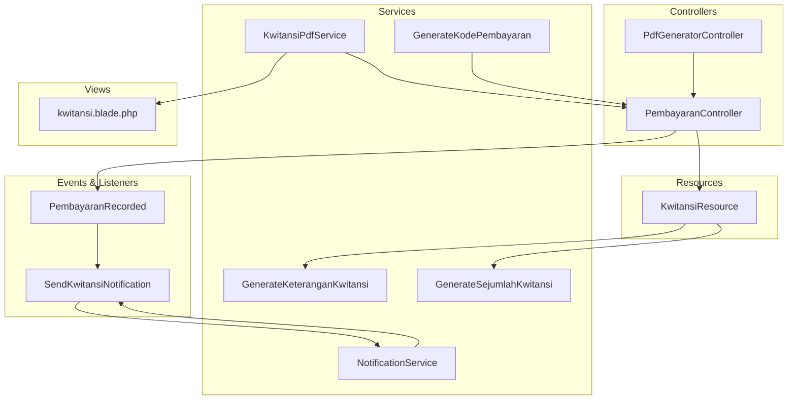
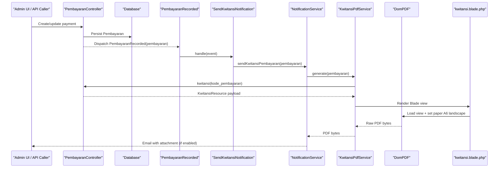
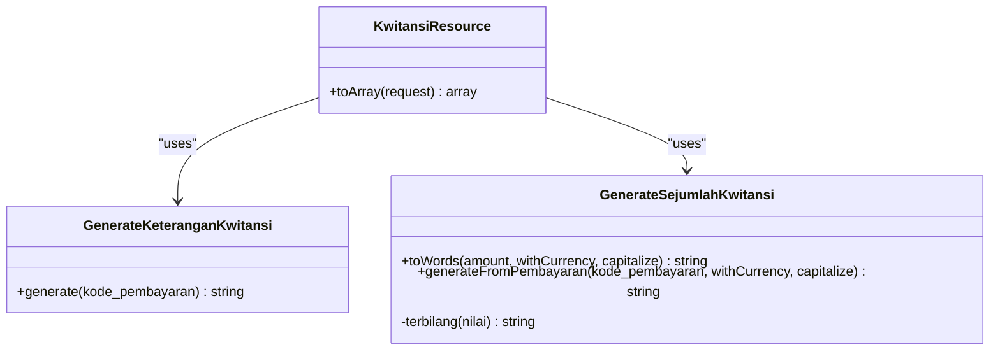
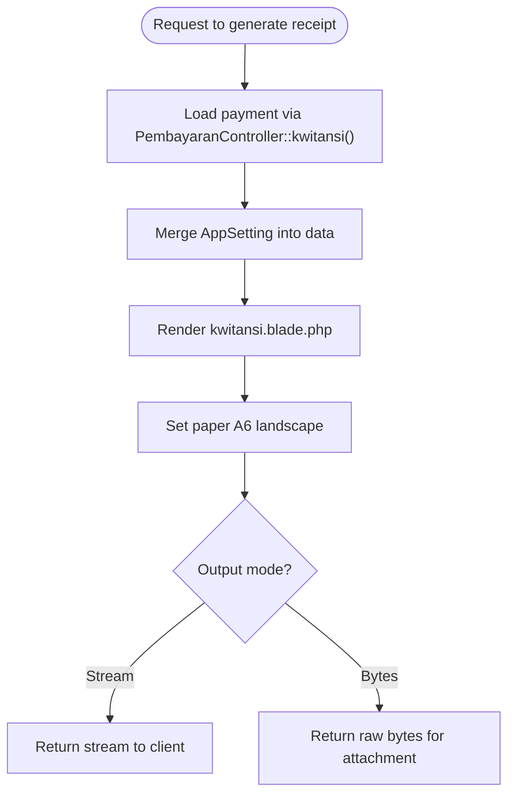
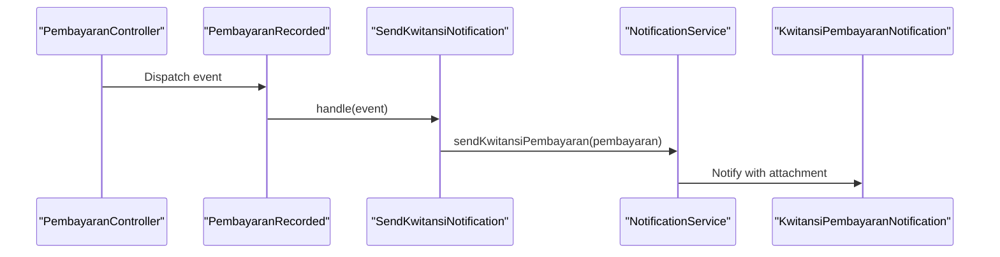
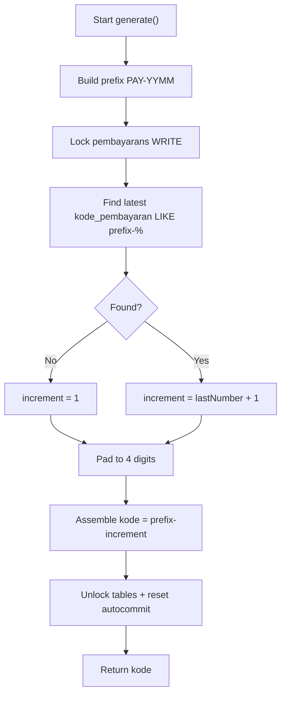
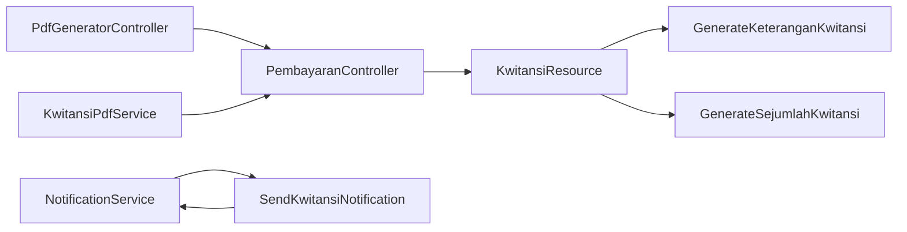

# Receipt Management (Kwitansi)

<cite>
**Referenced Files in This Document**
- [GenerateKeteranganKwitansi.php](file://backend/app/Services/GenerateKeteranganKwitansi.php)
- [GenerateSejumlahKwitansi.php](file://backend/app/Services/GenerateSejumlahKwitansi.php)
- [KwitansiResource.php](file://backend/app/Http/Resources/KwitansiResource.php)
- [PembayaranController.php](file://backend/app/Http/Controllers/PembayaranController.php)
- [PdfGeneratorController.php](file://backend/app/Http/Controllers/PdfGeneratorController.php)
- [KwitansiPdfService.php](file://backend/app/Services/Notifications/KwitansiPdfService.php)
- [kwitansi.blade.php](file://backend/resources/views/kwitansi.blade.php)
- [PembayaranRecorded.php](file://backend/app/Events/PembayaranRecorded.php)
- [SendKwitansiNotification.php](file://backend/app/Listeners/SendKwitansiNotification.php)
- [NotificationService.php](file://backend/app/Services/Notifications/NotificationService.php)
- [GenerateKodePembayaran.php](file://backend/app/Services/GenerateKodePembayaran.php)
- [PembayaranTest.php](file://backend/tests/Feature/PembayaranTest.php)
</cite>

## Table of Contents
1. [Introduction](#introduction)
2. [Project Structure](#project-structure)
3. [Core Components](#core-components)
4. [Architecture Overview](#architecture-overview)
5. [Detailed Component Analysis](#detailed-component-analysis)
6. [Dependency Analysis](#dependency-analysis)
7. [Performance Considerations](#performance-considerations)
8. [Troubleshooting Guide](#troubleshooting-guide)
9. [Conclusion](#conclusion)
10. [Appendices](#appendices)

## Introduction
This document explains the receipt (kwitansi) management in the Handayani system. It covers:
- Individual and bulk receipt generation services
- The receipt template system and PDF generation process
- Customization options for branding and content
- Relationship between receipts and payments, including automatic receipt generation upon payment completion
- Receipt numbering, archival policies, and retrieval mechanisms
- Practical examples for custom formats, external printing integration, corrections/reprints
- Security features and audit trail requirements

## Project Structure
Receipt-related functionality spans controllers, services, resources, views, events/listeners, and notification services.

**Diagram sources**
- [PembayaranController.php](file://backend/app/Http/Controllers/PembayaranController.php)
- [PdfGeneratorController.php](file://backend/app/Http/Controllers/PdfGeneratorController.php)
- [KwitansiResource.php](file://backend/app/Http/Resources/KwitansiResource.php)
- [GenerateKeteranganKwitansi.php](file://backend/app/Services/GenerateKeteranganKwitansi.php)
- [GenerateSejumlahKwitansi.php](file://backend/app/Services/GenerateSejumlahKwitansi.php)
- [GenerateKodePembayaran.php](file://backend/app/Services/GenerateKodePembayaran.php)
- [KwitansiPdfService.php](file://backend/app/Services/Notifications/KwitansiPdfService.php)
- [kwitansi.blade.php](file://backend/resources/views/kwitansi.blade.php)
- [PembayaranRecorded.php](file://backend/app/Events/PembayaranRecorded.php)
- [SendKwitansiNotification.php](file://backend/app/Listeners/SendKwitansiNotification.php)
- [NotificationService.php](file://backend/app/Services/Notifications/NotificationService.php)

**Section sources**
- [PembayaranController.php](file://backend/app/Http/Controllers/PembayaranController.php)
- [PdfGeneratorController.php](file://backend/app/Http/Controllers/PdfGeneratorController.php)
- [KwitansiResource.php](file://backend/app/Http/Resources/KwitansiResource.php)
- [GenerateKeteranganKwitansi.php](file://backend/app/Services/GenerateKeteranganKwitansi.php)
- [GenerateSejumlahKwitansi.php](file://backend/app/Services/GenerateSejumlahKwitansi.php)
- [GenerateKodePembayaran.php](file://backend/app/Services/GenerateKodePembayaran.php)
- [KwitansiPdfService.php](file://backend/app/Services/Notifications/KwitansiPdfService.php)
- [kwitansi.blade.php](file://backend/resources/views/kwitansi.blade.php)
- [PembayaranRecorded.php](file://backend/app/Events/PembayaranRecorded.php)
- [SendKwitansiNotification.php](file://backend/app/Listeners/SendKwitansiNotification.php)
- [NotificationService.php](file://backend/app/Services/Notifications/NotificationService.php)

## Core Components
- GenerateKeteranganKwitansi: Builds a human-readable description for a receipt by combining charge type, student name, and localized month/year from due date.
- GenerateSejumlahKwitansi: Converts numeric amounts into Indonesian words (“terbilang”), with optional currency suffix and capitalization; also provides a convenience method to convert a payment amount directly.
- KwitansiResource: Normalizes payment data for rendering, merging app settings and composing “untuk” and “sejumlah” via the two services above.
- PdfGeneratorController: Exposes an endpoint that streams a receipt PDF using the same data pipeline as admin endpoints.
- KwitansiPdfService: Reuses the controller’s resource logic to generate identical PDFs for email attachments.
- Event-driven automation: PembayaranRecorded event triggers SendKwitansiNotification listener, which uses NotificationService to send kwitansi emails with attached PDFs.
- Receipt numbering: GenerateKodePembayaran produces unique, monotonically increasing codes per month-year prefix with table locking to avoid collisions.

**Section sources**
- [GenerateKeteranganKwitansi.php](file://backend/app/Services/GenerateKeteranganKwitansi.php)
- [GenerateSejumlahKwitansi.php](file://backend/app/Services/GenerateSejumlahKwitansi.php)
- [KwitansiResource.php](file://backend/app/Http/Resources/KwitansiResource.php)
- [PdfGeneratorController.php](file://backend/app/Http/Controllers/PdfGeneratorController.php)
- [KwitansiPdfService.php](file://backend/app/Services/Notifications/KwitansiPdfService.php)
- [PembayaranRecorded.php](file://backend/app/Events/PembayaranRecorded.php)
- [SendKwitansiNotification.php](file://backend/app/Listeners/SendKwitansiNotification.php)
- [NotificationService.php](file://backend/app/Services/Notifications/NotificationService.php)
- [GenerateKodePembayaran.php](file://backend/app/Services/GenerateKodePembayaran.php)

## Architecture Overview
The receipt flow integrates payment recording, data normalization, PDF generation, and notification delivery.

**Diagram sources**
- [PembayaranController.php](file://backend/app/Http/Controllers/PembayaranController.php)
- [PembayaranRecorded.php](file://backend/app/Events/PembayaranRecorded.php)
- [SendKwitansiNotification.php](file://backend/app/Listeners/SendKwitansiNotification.php)
- [NotificationService.php](file://backend/app/Services/Notifications/NotificationService.php)
- [KwitansiPdfService.php](file://backend/app/Services/Notifications/KwitansiPdfService.php)
- [kwitansi.blade.php](file://backend/resources/views/kwitansi.blade.php)

## Detailed Component Analysis

### Receipt Generation Services
- GenerateKeteranganKwitansi::generate(kode_pembayaran)
  - Loads payment with tagihan.jenis_tagihan and tagihan.siswa
  - Composes keterangan from charge name, student name, and localized month/year
- GenerateSejumlahKwitansi
  - toWords(amount, withCurrency, capitalize): converts number to Indonesian words, supports rupiah/sen and title casing
  - generateFromPembayaran(kode_pembayaran, ...): convenience wrapper over toWords using payment amount

**Diagram sources**
- [GenerateKeteranganKwitansi.php](file://backend/app/Services/GenerateKeteranganKwitansi.php)
- [GenerateSejumlahKwitansi.php](file://backend/app/Services/GenerateSejumlahKwitansi.php)
- [KwitansiResource.php](file://backend/app/Http/Resources/KwitansiResource.php)

**Section sources**
- [GenerateKeteranganKwitansi.php](file://backend/app/Services/GenerateKeteranganKwitansi.php)
- [GenerateSejumlahKwitansi.php](file://backend/app/Services/GenerateSejumlahKwitansi.php)
- [KwitansiResource.php](file://backend/app/Http/Resources/KwitansiResource.php)

### Template System and PDF Generation
- Blade template kwitansi.blade.php defines layout, fields, watermark, signature blocks, and A6 landscape page size.
- PdfGeneratorController::get(kode_pembayaran)
  - Calls PembayaranController::kwitansi() to get normalized data
  - Resolves logo path from storage or fallback
  - Streams PDF via DomPDF
- KwitansiPdfService::generate(pembayaran)
  - Reuses PembayaranController::kwitansi() to ensure identical payload
  - Merges AppSetting values into data
  - Renders kwitansi.blade.php and returns raw PDF bytes for email attachment

**Diagram sources**
- [PdfGeneratorController.php](file://backend/app/Http/Controllers/PdfGeneratorController.php)
- [KwitansiPdfService.php](file://backend/app/Services/Notifications/KwitansiPdfService.php)
- [kwitansi.blade.php](file://backend/resources/views/kwitansi.blade.php)

**Section sources**
- [PdfGeneratorController.php](file://backend/app/Http/Controllers/PdfGeneratorController.php)
- [KwitansiPdfService.php](file://backend/app/Services/Notifications/KwitansiPdfService.php)
- [kwitansi.blade.php](file://backend/resources/views/kwitansi.blade.php)

### Automatic Receipt Generation on Payment Completion
- Controllers create Pembayaran records and dispatch PembayaranRecorded event.
- SendKwitansiNotification listens and calls NotificationService::sendKwitansiPembayaran().
- NotificationService checks branch settings, recipient resolution, opt-out, email validation, rate limiting, then sends KwitansiPembayaranNotification with attached PDF generated by KwitansiPdfService.

**Diagram sources**
- [PembayaranController.php](file://backend/app/Http/Controllers/PembayaranController.php)
- [PembayaranRecorded.php](file://backend/app/Events/PembayaranRecorded.php)
- [SendKwitansiNotification.php](file://backend/app/Listeners/SendKwitansiNotification.php)
- [NotificationService.php](file://backend/app/Services/Notifications/NotificationService.php)

**Section sources**
- [PembayaranController.php](file://backend/app/Http/Controllers/PembayaranController.php)
- [PembayaranRecorded.php](file://backend/app/Events/PembayaranRecorded.php)
- [SendKwitansiNotification.php](file://backend/app/Listeners/SendKwitansiNotification.php)
- [NotificationService.php](file://backend/app/Services/Notifications/NotificationService.php)

### Receipt Numbering System
- GenerateKodePembayaran::generate()
  - Prefix based on current year-month (e.g., PAY-YYMM)
  - Locks pembayarans table to prevent race conditions
  - Finds latest code with same prefix and increments last four digits
  - Returns zero-padded sequential code

**Diagram sources**
- [GenerateKodePembayaran.php](file://backend/app/Services/GenerateKodePembayaran.php)

**Section sources**
- [GenerateKodePembayaran.php](file://backend/app/Services/GenerateKodePembayaran.php)

### Retrieval Mechanisms and API Endpoints
- GET api/pembayaran/kwitansi/{kode_pembayaran}: Returns JSON payload for a receipt via PembayaranController::kwitansi() and KwitansiResource.
- GET pdf generator endpoint streams PDF for direct download.
- Tests verify both installment and full-payment receipts return success.

**Section sources**
- [PembayaranController.php](file://backend/app/Http/Controllers/PembayaranController.php)
- [PembayaranTest.php](file://backend/tests/Feature/PembayaranTest.php)

## Dependency Analysis
Key relationships:
- PembayaranController orchestrates payment creation and exposes receipt data.
- KwitansiResource composes receipt data using GenerateKeteranganKwitansi and GenerateSejumlahKwitansi.
- PdfGeneratorController and KwitansiPdfService depend on PembayaranController::kwitansi() to keep PDF payloads consistent.
- Event-driven notifications rely on NotificationService for filtering, rate limiting, and logging.

**Diagram sources**
- [PembayaranController.php](file://backend/app/Http/Controllers/PembayaranController.php)
- [KwitansiResource.php](file://backend/app/Http/Resources/KwitansiResource.php)
- [GenerateKeteranganKwitansi.php](file://backend/app/Services/GenerateKeteranganKwitansi.php)
- [GenerateSejumlahKwitansi.php](file://backend/app/Services/GenerateSejumlahKwitansi.php)
- [PdfGeneratorController.php](file://backend/app/Http/Controllers/PdfGeneratorController.php)
- [KwitansiPdfService.php](file://backend/app/Services/Notifications/KwitansiPdfService.php)
- [NotificationService.php](file://backend/app/Services/Notifications/NotificationService.php)
- [SendKwitansiNotification.php](file://backend/app/Listeners/SendKwitansiNotification.php)

**Section sources**
- [PembayaranController.php](file://backend/app/Http/Controllers/PembayaranController.php)
- [KwitansiResource.php](file://backend/app/Http/Resources/KwitansiResource.php)
- [GenerateKeteranganKwitansi.php](file://backend/app/Services/GenerateKeteranganKwitansi.php)
- [GenerateSejumlahKwitansi.php](file://backend/app/Services/GenerateSejumlahKwitansi.php)
- [PdfGeneratorController.php](file://backend/app/Http/Controllers/PdfGeneratorController.php)
- [KwitansiPdfService.php](file://backend/app/Services/Notifications/KwitansiPdfService.php)
- [NotificationService.php](file://backend/app/Services/Notifications/NotificationService.php)
- [SendKwitansiNotification.php](file://backend/app/Listeners/SendKwitansiNotification.php)

## Performance Considerations
- Table-level write lock during receipt code generation prevents duplicates but may serialize writes under high concurrency. Consider database-native sequences or UUIDs if contention becomes a bottleneck.
- PDF generation is CPU-intensive; prefer background jobs for bulk operations and cache rendered PDFs when appropriate.
- NotificationService applies rate limiting per branch; ensure queue workers are running to avoid backlogs.

[No sources needed since this section provides general guidance]

## Troubleshooting Guide
- Missing school information: If AppSetting is not configured, PDF generation will fail early with a clear error message.
- Opt-outs and invalid emails: Notifications are skipped and logged with reasons such as opted_out or invalid_email.
- Rate limiting: Excess notifications are throttled per branch; check logs for rate_limited skips.
- Duplicate handling: Midtrans duplicate notifications do not create duplicate payments; only one PembayaranRecorded event is dispatched per final payment.
- Retry failed notifications: Use NotificationService retryFailed to re-dispatch previously failed entries.

**Section sources**
- [PdfGeneratorController.php](file://backend/app/Http/Controllers/PdfGeneratorController.php)
- [NotificationService.php](file://backend/app/Services/Notifications/NotificationService.php)

## Conclusion
The receipt system in Handayani provides robust, consistent receipt generation for individual and bulk payments, with a unified template and PDF pipeline. Automatic notifications attach identical PDFs to emails, while strict numbering and event-driven flows ensure reliability and auditability. Extensibility points exist for customization and external integrations.

[No sources needed since this section summarizes without analyzing specific files]

## Appendices

### Practical Examples

- Generating a custom receipt format
  - Modify kwitansi.blade.php to add new fields or sections.
  - Extend KwitansiResource to include additional computed fields via existing services or new ones.
  - Ensure PdfGeneratorController and KwitansiPdfService receive the updated view data.

- Integrating with external printing systems
  - Use PdfGeneratorController to stream PDFs and forward them to your print service.
  - Alternatively, use KwitansiPdfService to obtain raw PDF bytes for programmatic upload/printing.

- Handling corrections or reprints
  - For reprint: call the receipt PDF endpoint again with the same kode_pembayaran.
  - For correction: adjust underlying payment data through payment controllers, then regenerate the receipt as needed.

- Bulk receipt creation
  - Use batch payment endpoints to create multiple Pembayaran records atomically; each triggers automatic receipt notifications.

**Section sources**
- [PdfGeneratorController.php](file://backend/app/Http/Controllers/PdfGeneratorController.php)
- [KwitansiPdfService.php](file://backend/app/Services/Notifications/KwitansiPdfService.php)
- [PembayaranController.php](file://backend/app/Http/Controllers/PembayaranController.php)

### Security Features and Audit Trail Requirements
- Access control: All receipt endpoints require authentication; non-admin users see only their own data where applicable.
- Permission enforcement: Certain mutations (e.g., deleting online payments) require specific permissions.
- Audit trails:
  - Notification logs record every attempt (sent, skipped, failed) with reasons and timestamps.
  - Midtrans transaction logs capture communication details with sensitive data masked.
  - Approval workflows maintain immutable logs for related processes.

**Section sources**
- [PembayaranController.php](file://backend/app/Http/Controllers/PembayaranController.php)
- [NotificationService.php](file://backend/app/Services/Notifications/NotificationService.php)