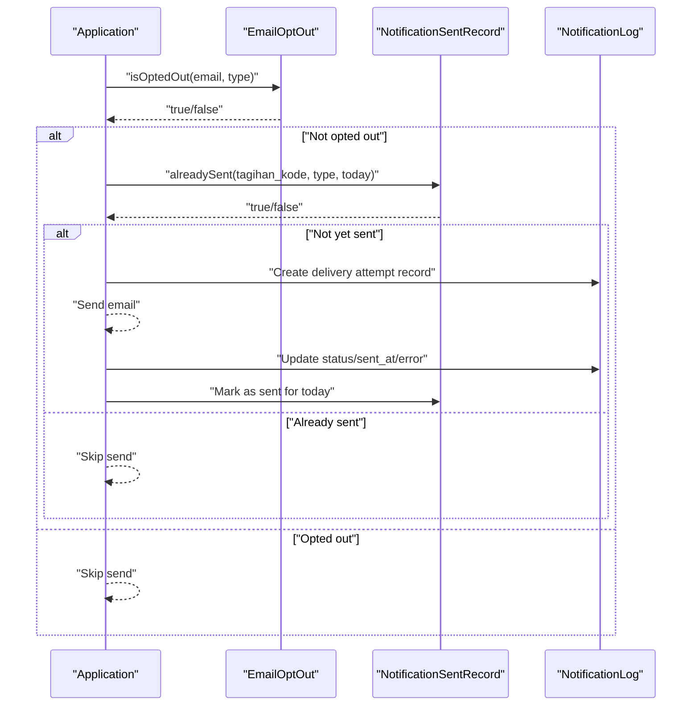
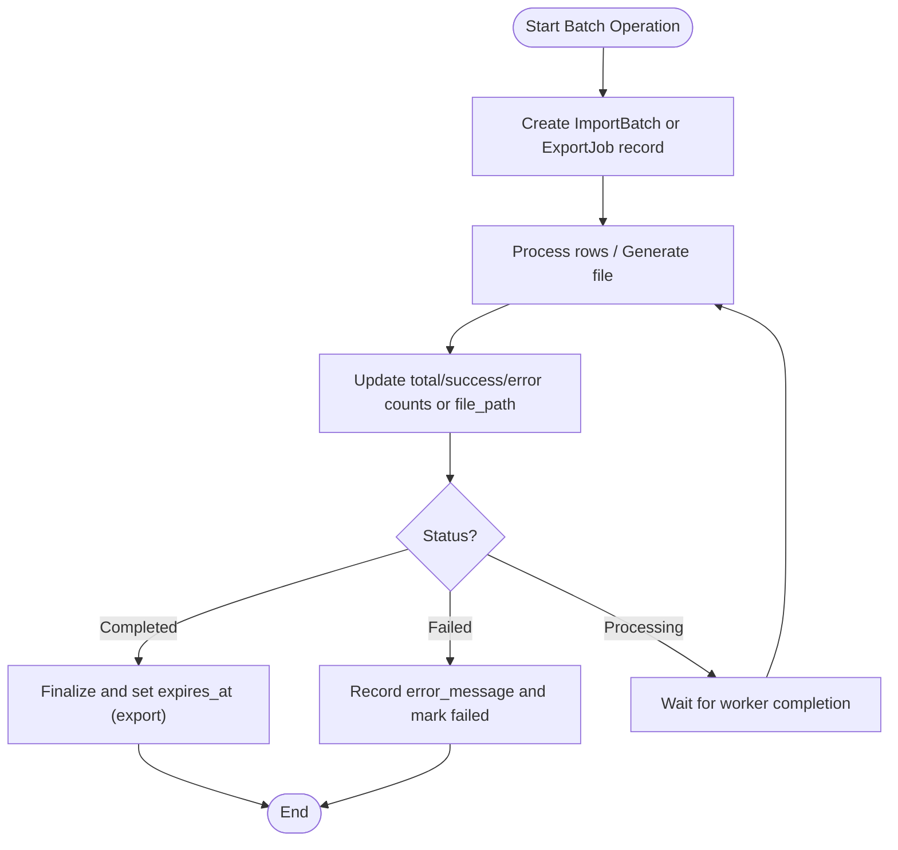
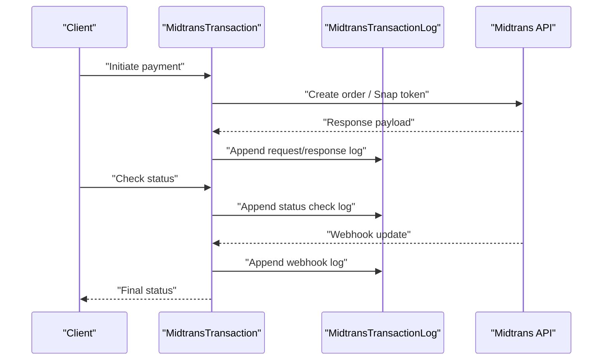
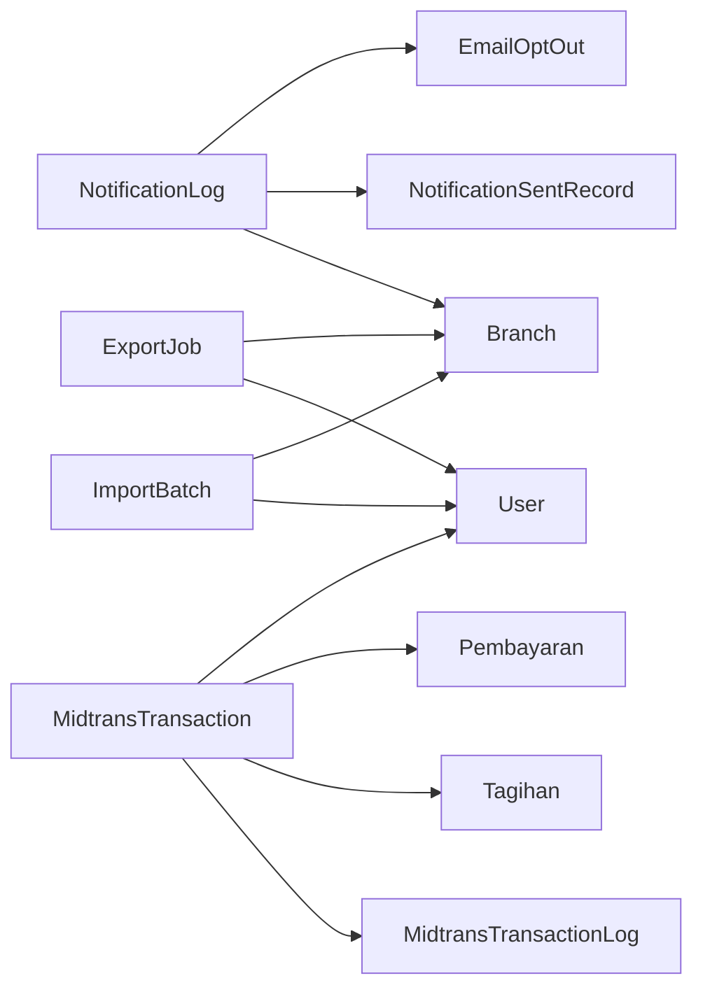
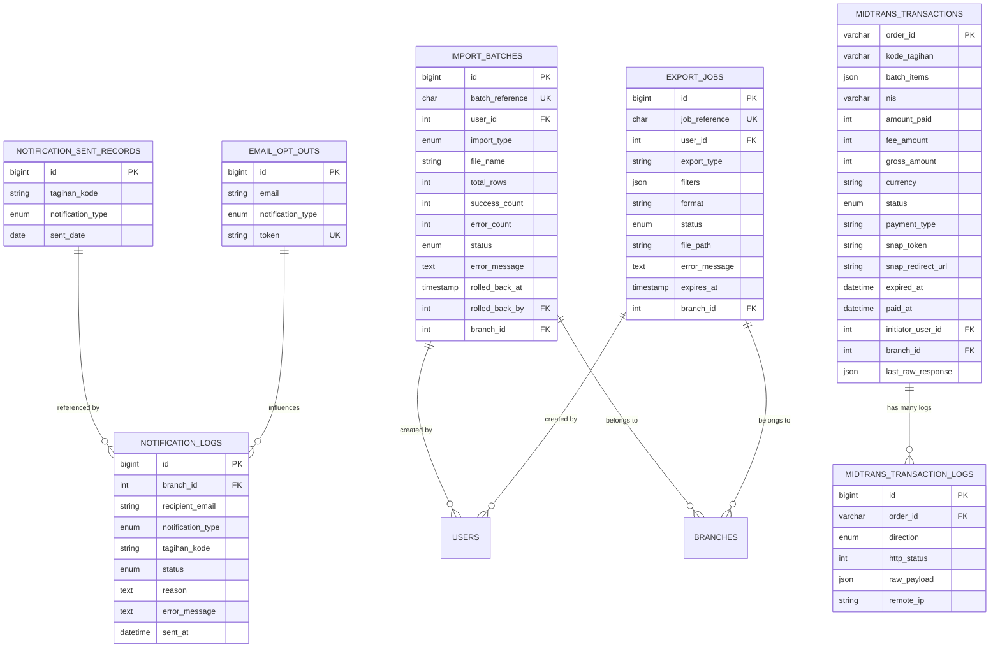

# Audit & Logging Tables

<cite>
**Referenced Files in This Document**
- [NotificationLog.php](file://backend/app/Models/NotificationLog.php)
- [NotificationSentRecord.php](file://backend/app/Models/NotificationSentRecord.php)
- [EmailOptOut.php](file://backend/app/Models/EmailOptOut.php)
- [MidtransTransaction.php](file://backend/app/Models/MidtransTransaction.php)
- [MidtransTransactionLog.php](file://backend/app/Models/MidtransTransactionLog.php)
- [ImportBatch.php](file://backend/app/Models/ImportBatch.php)
- [ExportJob.php](file://backend/app/Models/ExportJob.php)
- [2026_05_27_100400_create_notification_sent_records_table.php](file://backend/database/migrations/2026_05_27_100400_create_notification_sent_records_table.php)
- [2026_05_27_100300_create_email_opt_outs_table.php](file://backend/database/migrations/2026_05_27_100300_create_email_opt_outs_table.php)
- [2026_05_28_100000_create_import_batches_table.php](file://backend/database/migrations/2026_05_28_100000_create_import_batches_table.php)
- [2026_05_28_100100_create_export_jobs_table.php](file://backend/database/migrations/2026_05_28_100100_create_export_jobs_table.php)
- [2026_06_22_000001_create_midtrans_transactions_table.php](file://backend/database/migrations/2026_06_22_000001_create_midtrans_transactions_table.php)
- [2026_06_22_000002_create_midtrans_transaction_logs_table.php](file://backend/database/migrations/2026_06_22_000002_create_midtrans_transaction_logs_table.php)
- [MidtransPruneLogsCommand.php](file://backend/app/Console/Commands/MidtransPruneLogsCommand.php)
</cite>

## Table of Contents
1. [Introduction](#introduction)
2. [Project Structure](#project-structure)
3. [Core Components](#core-components)
4. [Architecture Overview](#architecture-overview)
5. [Detailed Component Analysis](#detailed-component-analysis)
6. [Dependency Analysis](#dependency-analysis)
7. [Performance Considerations](#performance-considerations)
8. [Troubleshooting Guide](#troubleshooting-guide)
9. [Conclusion](#conclusion)
10. [Appendices](#appendices)

## Introduction
This document explains the audit trail and logging tables that track system activities across notifications, imports/exports, and payment gateway interactions. It focuses on:
- Notification sent records for email delivery tracking
- Email opt-out management for compliance
- Import/export job tracking for batch operations
- Midtrans transaction logs for payment reconciliation

It also provides guidance on querying audit trails, implementing custom logging, and managing log retention policies to optimize performance.

## Project Structure
The audit and logging capabilities are implemented via Eloquent models backed by database migrations. The key components include:
- Notification audit: notification_logs, notification_sent_records, email_opt_outs
- Import/export audit: import_batches, export_jobs
- Payment audit: midtrans_transactions, midtrans_transaction_logs

```mermaid
graph TB
subgraph "Notifications"
NL["notification_logs"]
NSR["notification_sent_records"]
EO["email_opt_outs"]
end
subgraph "Imports / Exports"
IB["import_batches"]
EJ["export_jobs"]
end
subgraph "Payments (Midtrans)"
MTX["midtrans_transactions"]
MTL["midtrans_transaction_logs"]
end
NL --> NSR
EO -.-> NL
IB -.-> "user_id -> users"
EJ -.-> "user_id -> users"
MTX --> MTL
```

[No sources needed since this diagram shows conceptual structure]

## Core Components
- NotificationLog: Tracks per-email delivery attempts, status, and error details. Useful for debugging failed sends and auditing branch-level activity.
- NotificationSentRecord: Deduplicates notifications per tagihan and date to prevent duplicate reminders or receipts.
- EmailOptOut: Stores unsubscribe preferences with a secure tokenized URL; supports both specific and global opt-outs.
- ImportBatch: Tracks batch imports with counts, statuses, rollback metadata, and branch scoping.
- ExportJob: Tracks export jobs, filters, file paths, expiration, and signed download URLs.
- MidtransTransaction: Central record for each payment order, including amounts, currency, status, and linkage to invoices/payments.
- MidtransTransactionLog: Immutable append-only log of HTTP requests/responses and remote IPs for each transaction.

**Section sources**
- [NotificationLog.php:1-32](file://backend/app/Models/NotificationLog.php#L1-L32)
- [NotificationSentRecord.php:1-36](file://backend/app/Models/NotificationSentRecord.php#L1-L36)
- [EmailOptOut.php:1-42](file://backend/app/Models/EmailOptOut.php#L1-L42)
- [ImportBatch.php:1-62](file://backend/app/Models/ImportBatch.php#L1-L62)
- [ExportJob.php:1-58](file://backend/app/Models/ExportJob.php#L1-58)
- [MidtransTransaction.php:1-85](file://backend/app/Models/MidtransTransaction.php#L1-L85)
- [MidtransTransactionLog.php:1-35](file://backend/app/Models/MidtransTransactionLog.php#L1-L35)

## Architecture Overview
The audit architecture is table-driven and model-backed. Each domain area has dedicated tables and models that capture essential fields, relationships, and helper methods to support operational queries and compliance reporting.

```mermaid
classDiagram
class NotificationLog {
+branch_id
+recipient_email
+notification_type
+tagihan_kode
+status
+reason
+error_message
+sent_at
}
class NotificationSentRecord {
+tagihan_kode
+notification_type
+sent_date
+alreadySent(tagihanKode, notificationType, date) bool
}
class EmailOptOut {
+email
+notification_type
+token
+isOptedOut(email, notificationType) bool
+generateUnsubscribeUrl(email, notificationType) string
}
class ImportBatch {
+batch_reference
+user_id
+import_type
+file_name
+total_rows
+success_count
+error_count
+status
+error_message
+rolled_back_at
+rolled_back_by
+branch_id
+isRollbackEligible() bool
}
class ExportJob {
+job_reference
+user_id
+export_type
+filters
+format
+status
+file_path
+error_message
+expires_at
+branch_id
+getSignedUrl() string?
}
class MidtransTransaction {
+order_id
+kode_tagihan
+batch_items
+nis
+amount_paid
+fee_amount
+gross_amount
+currency
+status
+payment_type
+snap_token
+snap_redirect_url
+expired_at
+paid_at
+initiator_user_id
+branch_id
+last_raw_response
+isBatch() bool
+scopePendingInFlight(query)
}
class MidtransTransactionLog {
+order_id
+direction
+http_status
+raw_payload
+remote_ip
}
NotificationLog --> "belongsTo Branch"
ImportBatch --> "belongsTo User"
ImportBatch --> "belongsTo Branch"
ExportJob --> "belongsTo User"
ExportJob --> "belongsTo Branch"
MidtransTransaction --> "hasMany MidtransTransactionLog"
MidtransTransaction --> "belongsTo Tagihan"
MidtransTransaction --> "hasOne Pembayaran"
MidtransTransaction --> "belongsTo User"
```

**Diagram sources**
- [NotificationLog.php:1-32](file://backend/app/Models/NotificationLog.php#L1-L32)
- [NotificationSentRecord.php:1-36](file://backend/app/Models/NotificationSentRecord.php#L1-L36)
- [EmailOptOut.php:1-42](file://backend/app/Models/EmailOptOut.php#L1-L42)
- [ImportBatch.php:1-62](file://backend/app/Models/ImportBatch.php#L1-L62)
- [ExportJob.php:1-58](file://backend/app/Models/ExportJob.php#L1-58)
- [MidtransTransaction.php:1-85](file://backend/app/Models/MidtransTransaction.php#L1-L85)
- [MidtransTransactionLog.php:1-35](file://backend/app/Models/MidtransTransactionLog.php#L1-L35)

## Detailed Component Analysis

### Notifications Audit
Purpose:
- Track delivery outcomes and errors for emails
- Prevent duplicate notifications per invoice and date
- Enforce unsubscribe preferences for compliance

Key tables and models:
- notification_logs (NotificationLog): per-attempt delivery audit
- notification_sent_records (NotificationSentRecord): deduplication guard
- email_opt_outs (EmailOptOut): unsubscribe registry with tokenized links

Operational notes:
- Use alreadySent() to avoid re-sending the same notification type for the same invoice on the same day.
- Use isOptedOut() before sending to honor user preferences.
- Use generateUnsubscribeUrl() to create safe unsubscribe links.



**Diagram sources**
- [EmailOptOut.php:1-42](file://backend/app/Models/EmailOptOut.php#L1-L42)
- [NotificationSentRecord.php:1-36](file://backend/app/Models/NotificationSentRecord.php#L1-L36)
- [NotificationLog.php:1-32](file://backend/app/Models/NotificationLog.php#L1-L32)

**Section sources**
- [NotificationLog.php:1-32](file://backend/app/Models/NotificationLog.php#L1-L32)
- [NotificationSentRecord.php:1-36](file://backend/app/Models/NotificationSentRecord.php#L1-L36)
- [EmailOptOut.php:1-42](file://backend/app/Models/EmailOptOut.php#L1-L42)
- [2026_05_27_100400_create_notification_sent_records_table.php:1-33](file://backend/database/migrations/2026_05_27_100400_create_notification_sent_records_table.php#L1-L33)
- [2026_05_27_100300_create_email_opt_outs_table.php:1-33](file://backend/database/migrations/2026_05_27_100300_create_email_opt_outs_table.php#L1-L33)

### Import/Export Audit
Purpose:
- Provide full lifecycle visibility for batch imports and exports
- Support rollback eligibility checks and signed downloads

Key tables and models:
- import_batches (ImportBatch): tracks rows processed, success/error counts, rollbacks, and branch context
- export_jobs (ExportJob): tracks filters, format, completion, expiration, and signed URL generation

Operational notes:
- Use isRollbackEligible() to enforce time-bounded rollback windows.
- Use getSignedUrl() to securely serve completed exports only while valid.



**Diagram sources**
- [ImportBatch.php:1-62](file://backend/app/Models/ImportBatch.php#L1-L62)
- [ExportJob.php:1-58](file://backend/app/Models/ExportJob.php#L1-58)

**Section sources**
- [ImportBatch.php:1-62](file://backend/app/Models/ImportBatch.php#L1-L62)
- [ExportJob.php:1-58](file://backend/app/Models/ExportJob.php#L1-58)
- [2026_05_28_100000_create_import_batches_table.php:1-43](file://backend/database/migrations/2026_05_28_100000_create_import_batches_table.php#L1-L43)
- [2026_05_28_100100_create_export_jobs_table.php:1-40](file://backend/database/migrations/2026_05_28_100100_create_export_jobs_table.php#L1-L40)

### Midtrans Transaction Audit
Purpose:
- Maintain an immutable ledger of payment gateway interactions
- Enable reconciliation between internal state and external responses

Key tables and models:
- midtrans_transactions (MidtransTransaction): core payment order record with amounts, status, and timestamps
- midtrans_transaction_logs (MidtransTransactionLog): append-only HTTP request/response logs per transaction

Operational notes:
- Use scopePendingInFlight() to find pending transactions not yet expired.
- Use isBatch() to identify multi-invoice payments.
- Logs are immutable (no updated_at) to preserve evidence.



**Diagram sources**
- [MidtransTransaction.php:1-85](file://backend/app/Models/MidtransTransaction.php#L1-L85)
- [MidtransTransactionLog.php:1-35](file://backend/app/Models/MidtransTransactionLog.php#L1-L35)

**Section sources**
- [MidtransTransaction.php:1-85](file://backend/app/Models/MidtransTransaction.php#L1-L85)
- [MidtransTransactionLog.php:1-35](file://backend/app/Models/MidtransTransactionLog.php#L1-L35)
- [2026_06_22_000001_create_midtrans_transactions_table.php](file://backend/database/migrations/2026_06_22_000001_create_midtrans_transactions_table.php)
- [2026_06_22_000002_create_midtrans_transaction_logs_table.php](file://backend/database/migrations/2026_06_22_000002_create_midtrans_transaction_logs_table.php)

## Dependency Analysis
- Models depend on their corresponding migrations for schema definitions.
- Notification flow depends on EmailOptOut and NotificationSentRecord to enforce compliance and deduplication.
- Import/Export flows depend on user and branch relations for access control and reporting.
- MidtransTransaction depends on MidtransTransactionLog for auditability and on business entities (Tagihan, Pembayaran, User) for traceability.



**Diagram sources**
- [NotificationLog.php:1-32](file://backend/app/Models/NotificationLog.php#L1-L32)
- [NotificationSentRecord.php:1-36](file://backend/app/Models/NotificationSentRecord.php#L1-L36)
- [EmailOptOut.php:1-42](file://backend/app/Models/EmailOptOut.php#L1-L42)
- [ImportBatch.php:1-62](file://backend/app/Models/ImportBatch.php#L1-L62)
- [ExportJob.php:1-58](file://backend/app/Models/ExportJob.php#L1-58)
- [MidtransTransaction.php:1-85](file://backend/app/Models/MidtransTransaction.php#L1-L85)
- [MidtransTransactionLog.php:1-35](file://backend/app/Models/MidtransTransactionLog.php#L1-L35)

**Section sources**
- [NotificationLog.php:1-32](file://backend/app/Models/NotificationLog.php#L1-L32)
- [ImportBatch.php:1-62](file://backend/app/Models/ImportBatch.php#L1-L62)
- [ExportJob.php:1-58](file://backend/app/Models/ExportJob.php#L1-58)
- [MidtransTransaction.php:1-85](file://backend/app/Models/MidtransTransaction.php#L1-L85)
- [MidtransTransactionLog.php:1-35](file://backend/app/Models/MidtransTransactionLog.php#L1-L35)

## Performance Considerations
- Indexing:
  - import_batches includes a composite index on (branch_id, created_at) to speed up history queries.
  - export_jobs includes an index on (branch_id, status) to filter active jobs efficiently.
- Immutability:
  - midtrans_transaction_logs disables updates to ensure append-only behavior, reducing write overhead and preserving integrity.
- Deduplication:
  - notification_sent_records uses a unique constraint on (tagihan_kode, notification_type, sent_date) to prevent duplicates at the DB level.
- Retention:
  - A console command exists to prune Midtrans logs, enabling periodic cleanup of large log tables.

Recommendations:
- Add indexes on frequently filtered columns such as recipient_email, status, and sent_at in notification_logs if not present.
- Partition very large log tables by date ranges when volumes grow significantly.
- Archive old export files and clear expired signed URLs after expiration.

**Section sources**
- [2026_05_28_100000_create_import_batches_table.php:1-43](file://backend/database/migrations/2026_05_28_100000_create_import_batches_table.php#L1-L43)
- [2026_05_28_100100_create_export_jobs_table.php:1-40](file://backend/database/migrations/2026_05_28_100100_create_export_jobs_table.php#L1-L40)
- [MidtransTransactionLog.php:1-35](file://backend/app/Models/MidtransTransactionLog.php#L1-L35)
- [2026_05_27_100400_create_notification_sent_records_table.php:1-33](file://backend/database/migrations/2026_05_27_100400_create_notification_sent_records_table.php#L1-L33)
- [MidtransPruneLogsCommand.php](file://backend/app/Console/Commands/MidtransPruneLogsCommand.php)

## Troubleshooting Guide
Common issues and how to investigate using audit tables:
- Failed email deliveries:
  - Check notification_logs for error_message and status; correlate with recipient_email and notification_type.
  - Verify opt-out status via email_opt_outs and ensure deduplication via notification_sent_records.
- Duplicate notifications:
  - Confirm whether a record exists in notification_sent_records for the same tagihan_kode, notification_type, and sent_date.
- Import failures:
  - Inspect import_batches.error_message and counts (total_rows vs success_count + error_count).
  - Use rolled_back_at and rolled_back_by to understand rollback actions.
- Export availability:
  - Ensure export_jobs.status is completed and file_path is set; use getSignedUrl() respecting expires_at.
- Payment discrepancies:
  - Review midtrans_transaction_logs for raw_payload and http_status; compare with midtrans_transactions.last_raw_response and status transitions.

Query examples (conceptual):
- Find all failed notification attempts for a branch in the last 7 days.
- List opted-out emails for a specific notification type.
- Show import batches with high error rates within a date range.
- Retrieve signed download URLs for completed exports not yet expired.
- Reconcile pending Midtrans transactions that have not expired.

**Section sources**
- [NotificationLog.php:1-32](file://backend/app/Models/NotificationLog.php#L1-L32)
- [EmailOptOut.php:1-42](file://backend/app/Models/EmailOptOut.php#L1-L42)
- [NotificationSentRecord.php:1-36](file://backend/app/Models/NotificationSentRecord.php#L1-L36)
- [ImportBatch.php:1-62](file://backend/app/Models/ImportBatch.php#L1-L62)
- [ExportJob.php:1-58](file://backend/app/Models/ExportJob.php#L1-58)
- [MidtransTransaction.php:1-85](file://backend/app/Models/MidtransTransaction.php#L1-L85)
- [MidtransTransactionLog.php:1-35](file://backend/app/Models/MidtransTransactionLog.php#L1-L35)

## Conclusion
These audit and logging tables provide comprehensive visibility into notifications, data operations, and payments. They enable effective debugging, compliance reporting, and monitoring. By leveraging built-in helpers, constraints, and indexes—and by applying sensible retention policies—you can maintain reliable, performant, and compliant systems.

## Appendices

### Data Model Reference


**Diagram sources**
- [2026_05_27_100400_create_notification_sent_records_table.php:1-33](file://backend/database/migrations/2026_05_27_100400_create_notification_sent_records_table.php#L1-L33)
- [2026_05_27_100300_create_email_opt_outs_table.php:1-33](file://backend/database/migrations/2026_05_27_100300_create_email_opt_outs_table.php#L1-L33)
- [2026_05_28_100000_create_import_batches_table.php:1-43](file://backend/database/migrations/2026_05_28_100000_create_import_batches_table.php#L1-L43)
- [2026_05_28_100100_create_export_jobs_table.php:1-40](file://backend/database/migrations/2026_05_28_100100_create_export_jobs_table.php#L1-L40)
- [2026_06_22_000001_create_midtrans_transactions_table.php](file://backend/database/migrations/2026_06_22_000001_create_midtrans_transactions_table.php)
- [2026_06_22_000002_create_midtrans_transaction_logs_table.php](file://backend/database/migrations/2026_06_22_000002_create_midtrans_transaction_logs_table.php)