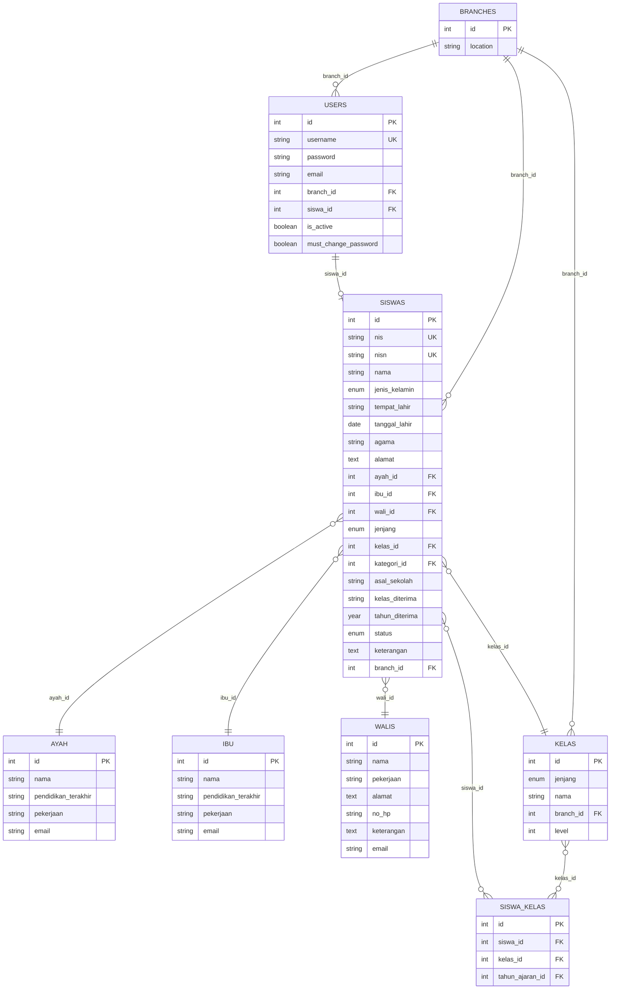
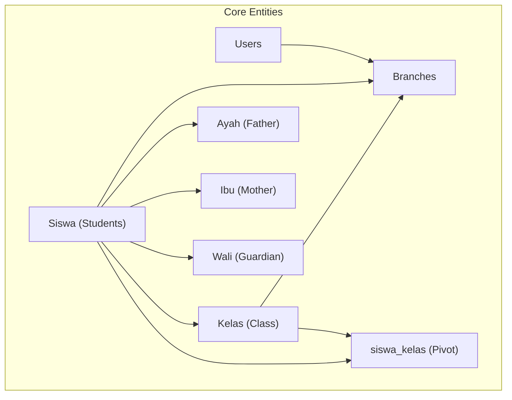
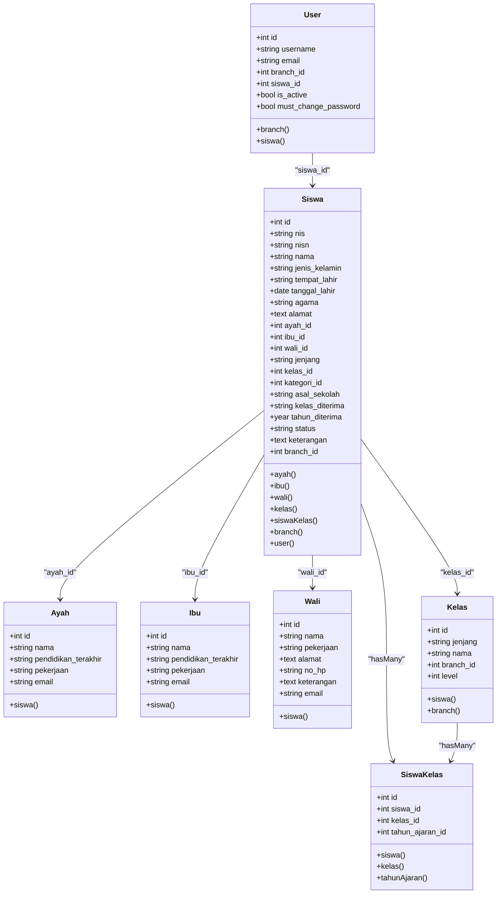

# Core Entities & Relationships

<cite>
**Referenced Files in This Document**
- [User.php](file://backend/app/Models/User.php)
- [Siswa.php](file://backend/app/Models/Siswa.php)
- [Ayah.php](file://backend/app/Models/Ayah.php)
- [Ibu.php](file://backend/app/Models/Ibu.php)
- [Wali.php](file://backend/app/Models/Wali.php)
- [Kelas.php](file://backend/app/Models/Kelas.php)
- [SiswaKelas.php](file://backend/app/Models/SiswaKelas.php)
- [2025_11_06_103229_create_users_table.php](file://backend/database/migrations/2025_11_06_103229_create_users_table.php)
- [2025_11_07_170206_create_ayahs_table.php](file://backend/database/migrations/2025_11_07_170206_create_ayahs_table.php)
- [2025_11_07_170456_create_ibus_table.php](file://backend/database/migrations/2025_11_07_170456_create_ibus_table.php)
- [2025_11_08_085831_create_walis_table.php](file://backend/database/migrations/2025_11_08_085831_create_walis_table.php)
- [2025_11_08_090937_create_siswas_table.php](file://backend/database/migrations/2025_11_08_090937_create_siswas_table.php)
- [2025_11_08_084002_create_kelas_table.php](file://backend/database/migrations/2025_11_08_084002_create_kelas_table.php)
- [2026_05_25_100200_create_siswa_kelas_table.php](file://backend/database/migrations/2026_05_25_100200_create_siswa_kelas_table.php)
- [2025_12_28_120848_alter_users_new_column_branch_id.php](file://backend/database/migrations/2025_12_28_120848_alter_users_new_column_branch_id.php)
- [2026_05_26_200000_add_siswa_id_is_active_must_change_password_to_users_table.php](file://backend/database/migrations/2026_05_26_200000_add_siswa_id_is_active_must_change_password_to_users_table.php)
- [2026_05_26_210000_add_email_column_to_users_table.php](file://backend/database/migrations/2026_05_26_210000_add_email_column_to_users_table.php)
- [2026_05_26_100000_add_level_column_to_kelas_table.php](file://backend/database/migrations/2026_05_26_100000_add_level_column_to_kelas_table.php)
- [2026_05_27_100000_add_email_to_parent_tables.php](file://backend/database/migrations/2026_05_27_100000_add_email_to_parent_tables.php)
</cite>

## Table of Contents
1. Introduction
2. Project Structure
3. Core Components
4. Architecture Overview
5. Detailed Component Analysis
6. Dependency Analysis
7. Performance Considerations
8. Troubleshooting Guide
9. Conclusion

## Introduction
This document provides comprehensive data model documentation for the core entities in the Handayani system: Users, Students (Siswa), Parents (Ayah/Ibu), Guardians (Wali), and Classes (Kelas). It details field definitions, data types, constraints, relationships, and database-level validation rules. It also explains the complex family relationship structure where students can have multiple parents and guardians, and how class assignments are modeled through the siswa_kelas pivot table. Finally, it includes practical Eloquent relationship examples, common query patterns, data access strategies, and multi-branch support integration with user permissions.

## Project Structure
The core data models and their migrations are implemented under backend/app/Models and backend/database/migrations. The following diagram maps the primary entities and their direct relationships as defined by Eloquent and database constraints.

**Diagram sources**
- [2025_11_06_103229_create_users_table.php:1-32](file://backend/database/migrations/2025_11_06_103229_create_users_table.php#L1-L32)
- [2025_11_07_170206_create_ayahs_table.php:1-31](file://backend/database/migrations/2025_11_07_170206_create_ayahs_table.php#L1-L31)
- [2025_11_07_170456_create_ibus_table.php:1-31](file://backend/database/migrations/2025_11_07_170456_create_ibus_table.php#L1-L31)
- [2025_11_08_085831_create_walis_table.php:1-33](file://backend/database/migrations/2025_11_08_085831_create_walis_table.php#L1-L33)
- [2025_11_08_090937_create_siswas_table.php:1-47](file://backend/database/migrations/2025_11_08_090937_create_siswas_table.php#L1-L47)
- [2025_11_08_084002_create_kelas_table.php:1-30](file://backend/database/migrations/2025_11_08_084002_create_kelas_table.php#L1-L30)
- [2026_05_25_100200_create_siswa_kelas_table.php:1-34](file://backend/database/migrations/2026_05_25_100200_create_siswa_kelas_table.php#L1-L34)
- [2025_12_28_120848_alter_users_new_column_branch_id.php:1-97](file://backend/database/migrations/2025_12_28_120848_alter_users_new_column_branch_id.php#L1-L97)
- [2026_05_26_200000_add_siswa_id_is_active_must_change_password_to_users_table.php:1-42](file://backend/database/migrations/2026_05_26_200000_add_siswa_id_is_active_must_change_password_to_users_table.php#L1-L42)
- [2026_05_26_210000_add_email_column_to_users_table.php:1-33](file://backend/database/migrations/2026_05_26_210000_add_email_column_to_users_table.php#L1-L33)
- [2026_05_26_100000_add_level_column_to_kelas_table.php:1-35](file://backend/database/migrations/2026_05_26_100000_add_level_column_to_kelas_table.php#L1-L35)
- [2026_05_27_100000_add_email_to_parent_tables.php:1-45](file://backend/database/migrations/2026_05_27_100000_add_email_to_parent_tables.php#L1-L45)

**Section sources**
- [User.php:1-74](file://backend/app/Models/User.php#L1-L74)
- [Siswa.php:1-117](file://backend/app/Models/Siswa.php#L1-L117)
- [Ayah.php:1-33](file://backend/app/Models/Ayah.php#L1-L33)
- [Ibu.php:1-33](file://backend/app/Models/Ibu.php#L1-L33)
- [Wali.php:1-37](file://backend/app/Models/Wali.php#L1-L37)
- [Kelas.php:1-41](file://backend/app/Models/Kelas.php#L1-L41)
- [SiswaKelas.php:1-48](file://backend/app/Models/SiswaKelas.php#L1-L48)

## Core Components
This section summarizes each core entity’s fields, types, constraints, and relationships.

- Users
  - Primary key: id (auto-increment integer)
  - Unique indexes: username; composite unique on (email, branch_id) to allow per-branch email uniqueness when email is non-null
  - Foreign keys: branch_id references branches.id; siswa_id references siswas.id with null-on-delete
  - Boolean flags: is_active (default true), must_change_password (default false)
  - Email normalization: setter normalizes to lowercase and trims
  - Branch association: belongsTo(Branch)
  - Student association: belongsTo(Siswa) via siswa_id

- Students (Siswa)
  - Primary key: id (auto-increment integer)
  - Unique indexes: nis, nisn
  - Enumerations: jenis_kelamin (Laki-laki, Perempuan), jenjang (TK, MI, KB), status (Aktif, Lulus, Pindah, Keluar)
  - Foreign keys: ayah_id -> ayah.id; ibu_id -> ibu.id; wali_id -> walis.id; kelas_id -> kelas.id; kategori_id -> kategoris.id; branch_id -> branches.id
  - Parent relationships: belongsTo(Ayah), belongsTo(Ibu), belongsTo(Wali)
  - Class relationship: belongsTo(Kelas)
  - Pivot relationship: hasMany(SiswaKelas) for historical/current class assignments
  - Branch association: belongsTo(Branch)
  - User account linkage: hasOne(User) via siswa_id

- Parents (Ayah/Ibu)
  - Primary key: id (auto-increment integer)
  - Fields: nama, pendidikan_terakhir, pekerjaan, email
  - Relationship: hasMany(Siswa)

- Guardians (Wali)
  - Primary key: id (auto-increment integer)
  - Fields: nama, pekerjaan, alamat, no_hp, keterangan, email
  - Relationship: hasMany(Siswa) via wali_id

- Classes (Kelas)
  - Primary key: id (auto-increment integer)
  - Enumerations: jenjang (MI, TK, KB)
  - Unique index: (jenjang, branch_id, level) allowing multiple NULL levels but enforcing uniqueness for non-NULL levels within a branch and jenjang
  - Branch association: belongsTo(Branch)
  - Student relationship: hasMany(Siswa)

- Class Assignments (siswa_kelas pivot)
  - Primary key: id (auto-increment integer)
  - Foreign keys: siswa_id -> siswas.id; kelas_id -> kelas.id; tahun_ajaran_id -> tahun_ajarans.id
  - Constraint: unique(siswa_id, tahun_ajaran_id) ensures one class per student per academic period
  - Relationships: belongsTo(Siswa), belongsTo(Kelas), belongsTo(TahunAjaran)

**Section sources**
- [2025_11_06_103229_create_users_table.php:1-32](file://backend/database/migrations/2025_11_06_103229_create_users_table.php#L1-L32)
- [2025_11_07_170206_create_ayahs_table.php:1-31](file://backend/database/migrations/2025_11_07_170206_create_ayahs_table.php#L1-L31)
- [2025_11_07_170456_create_ibus_table.php:1-31](file://backend/database/migrations/2025_11_07_170456_create_ibus_table.php#L1-L31)
- [2025_11_08_085831_create_walis_table.php:1-33](file://backend/database/migrations/2025_11_08_085831_create_walis_table.php#L1-L33)
- [2025_11_08_090937_create_siswas_table.php:1-47](file://backend/database/migrations/2025_11_08_090937_create_siswas_table.php#L1-L47)
- [2025_11_08_084002_create_kelas_table.php:1-30](file://backend/database/migrations/2025_11_08_084002_create_kelas_table.php#L1-L30)
- [2026_05_25_100200_create_siswa_kelas_table.php:1-34](file://backend/database/migrations/2026_05_25_100200_create_siswa_kelas_table.php#L1-L34)
- [2025_12_28_120848_alter_users_new_column_branch_id.php:1-97](file://backend/database/migrations/2025_12_28_120848_alter_users_new_column_branch_id.php#L1-L97)
- [2026_05_26_200000_add_siswa_id_is_active_must_change_password_to_users_table.php:1-42](file://backend/database/migrations/2026_05_26_200000_add_siswa_id_is_active_must_change_password_to_users_table.php#L1-L42)
- [2026_05_26_210000_add_email_column_to_users_table.php:1-33](file://backend/database/migrations/2026_05_26_210000_add_email_column_to_users_table.php#L1-L33)
- [2026_05_26_100000_add_level_column_to_kelas_table.php:1-35](file://backend/database/migrations/2026_05_26_100000_add_level_column_to_kelas_table.php#L1-L35)
- [2026_05_27_100000_add_email_to_parent_tables.php:1-45](file://backend/database/migrations/2026_05_27_100000_add_email_to_parent_tables.php#L1-L45)
- [User.php:1-74](file://backend/app/Models/User.php#L1-L74)
- [Siswa.php:1-117](file://backend/app/Models/Siswa.php#L1-L117)
- [Ayah.php:1-33](file://backend/app/Models/Ayah.php#L1-L33)
- [Ibu.php:1-33](file://backend/app/Models/Ibu.php#L1-L33)
- [Wali.php:1-37](file://backend/app/Models/Wali.php#L1-L37)
- [Kelas.php:1-41](file://backend/app/Models/Kelas.php#L1-L41)
- [SiswaKelas.php:1-48](file://backend/app/Models/SiswaKelas.php#L1-L48)

## Architecture Overview
The data architecture supports multi-branch operations and flexible family structures:
- Multi-branch support: users, siswas, and kelas reference branches.id, enabling branch-scoped data isolation and permission enforcement.
- Family relationships: students link to ayah, ibu, and walis via nullable foreign keys, allowing multiple parents/guardians across records.
- Class assignment history: siswa_kelas tracks which class a student was assigned to during an academic period, with a unique constraint ensuring one class per student per period.

**Diagram sources**
- [2025_12_28_120848_alter_users_new_column_branch_id.php:1-97](file://backend/database/migrations/2025_12_28_120848_alter_users_new_column_branch_id.php#L1-L97)
- [2025_11_08_090937_create_siswas_table.php:1-47](file://backend/database/migrations/2025_11_08_090937_create_siswas_table.php#L1-L47)
- [2025_11_08_084002_create_kelas_table.php:1-30](file://backend/database/migrations/2025_11_08_084002_create_kelas_table.php#L1-L30)
- [2026_05_25_100200_create_siswa_kelas_table.php:1-34](file://backend/database/migrations/2026_05_25_100200_create_siswa_kelas_table.php#L1-L34)

## Detailed Component Analysis

### Users
- Purpose: System authentication and authorization with optional linkage to a student account and branch scoping.
- Key fields:
  - username (unique)
  - email (nullable; unique per branch via composite index)
  - branch_id (foreign key to branches)
  - siswa_id (foreign key to siswas; null-on-delete)
  - is_active (boolean default true)
  - must_change_password (boolean default false)
- Constraints:
  - Unique username
  - Composite unique (email, branch_id) allows duplicate emails across branches while preventing duplicates within a branch when email is present
  - Foreign keys enforce referential integrity
- Eloquent relationships:
  - branch(): belongsTo(Branch)
  - siswa(): belongsTo(Siswa)
- Validation behaviors:
  - Email setter normalizes to lowercase and trims whitespace

Common queries:
- Active users in a branch: scopeActive() combined with branch filtering
- Resolve user’s branch context: getBranchId()

**Section sources**
- [User.php:1-74](file://backend/app/Models/User.php#L1-L74)
- [2025_11_06_103229_create_users_table.php:1-32](file://backend/database/migrations/2025_11_06_103229_create_users_table.php#L1-L32)
- [2025_12_28_120848_alter_users_new_column_branch_id.php:1-97](file://backend/database/migrations/2025_12_28_120848_alter_users_new_column_branch_id.php#L1-L97)
- [2026_05_26_200000_add_siswa_id_is_active_must_change_password_to_users_table.php:1-42](file://backend/database/migrations/2026_05_26_200000_add_siswa_id_is_active_must_change_password_to_users_table.php#L1-L42)
- [2026_05_26_210000_add_email_column_to_users_table.php:1-33](file://backend/database/migrations/2026_05_26_210000_add_email_column_to_users_table.php#L1-L33)

### Students (Siswa)
- Purpose: Core student profile with personal, academic, and family information.
- Key fields:
  - nis (unique), nisn (unique)
  - Personal info: nama, jenis_kelamin, tempat_lahir, tanggal_lahir, agama, alamat
  - Family links: ayah_id, ibu_id, wali_id
  - Academic: jenjang, kelas_id, kategori_id, asal_sekolah, kelas_diterima, tahun_diterima, status, keterangan
  - Branch: branch_id
- Constraints:
  - Unique nis and nisn
  - Enumerations restrict values
  - Foreign keys to ayah, ibu, walis, kelas, kategoris, branches
- Eloquent relationships:
  - ayah(), ibu(), wali(): belongsTo(...)
  - kelas(): belongsTo(Kelas)
  - siswaKelas(): hasMany(SiswaKelas)
  - branch(): belongsTo(Branch)
  - user(): hasOne(User) via siswa_id
- Payment aggregation helper:
  - pembayaranForGroupedView(): joins tagihans and jenis_tagihans filtered by nis and optional filters

Common queries:
- Get student with parent and guardian: eager load ayah, ibu, wali
- Retrieve current class: use kelas_id or latest siswa_kelas record
- Filter by branch: where('branch_id', $branchId)

**Section sources**
- [Siswa.php:1-117](file://backend/app/Models/Siswa.php#L1-L117)
- [2025_11_08_090937_create_siswas_table.php:1-47](file://backend/database/migrations/2025_11_08_090937_create_siswas_table.php#L1-L47)
- [2025_12_28_120848_alter_users_new_column_branch_id.php:1-97](file://backend/database/migrations/2025_12_28_120848_alter_users_new_column_branch_id.php#L1-L97)

### Parents (Ayah/Ibu)
- Purpose: Store father and mother profiles linked to students.
- Key fields:
  - nama, pendidikan_terakhir, pekerjaan, email
- Relationships:
  - hasMany(Siswa) from siswa.ayah_id / siswa.ibu_id

Common queries:
- Find all children of a father: ayah->siswa
- Find all children of a mother: ibu->siswa

**Section sources**
- [Ayah.php:1-33](file://backend/app/Models/Ayah.php#L1-L33)
- [Ibu.php:1-33](file://backend/app/Models/Ibu.php#L1-L33)
- [2025_11_07_170206_create_ayahs_table.php:1-31](file://backend/database/migrations/2025_11_07_170206_create_ayahs_table.php#L1-L31)
- [2025_11_07_170456_create_ibus_table.php:1-31](file://backend/database/migrations/2025_11_07_170456_create_ibus_table.php#L1-L31)
- [2026_05_27_100000_add_email_to_parent_tables.php:1-45](file://backend/database/migrations/2026_05_27_100000_add_email_to_parent_tables.php#L1-L45)

### Guardians (Wali)
- Purpose: Store guardian profiles linked to students.
- Key fields:
  - nama, pekerjaan, alamat, no_hp, keterangan, email
- Relationships:
  - hasMany(Siswa) via siswa.wali_id

Common queries:
- Find all students under a guardian: wali->siswa

**Section sources**
- [Wali.php:1-37](file://backend/app/Models/Wali.php#L1-L37)
- [2025_11_08_085831_create_walis_table.php:1-33](file://backend/database/migrations/2025_11_08_085831_create_walis_table.php#L1-L33)
- [2026_05_27_100000_add_email_to_parent_tables.php:1-45](file://backend/database/migrations/2026_05_27_100000_add_email_to_parent_tables.php#L1-L45)

### Classes (Kelas)
- Purpose: Define classes with jenjang and optional level, scoped by branch.
- Key fields:
  - jenjang (enum), nama, branch_id, level (integer)
- Constraints:
  - Unique (jenjang, branch_id, level) enforces uniqueness for non-NULL levels within a branch and jenjang
- Relationships:
  - hasMany(Siswa) via siswa.kelas_id
  - belongsTo(Branch)

Common queries:
- List classes by jenjang and branch
- Ensure unique level assignment per jenjang and branch

**Section sources**
- [Kelas.php:1-41](file://backend/app/Models/Kelas.php#L1-L41)
- [2025_11_08_084002_create_kelas_table.php:1-30](file://backend/database/migrations/2025_11_08_084002_create_kelas_table.php#L1-L30)
- [2026_05_26_100000_add_level_column_to_kelas_table.php:1-35](file://backend/database/migrations/2026_05_26_100000_add_level_column_to_kelas_table.php#L1-L35)
- [2025_12_28_120848_alter_users_new_column_branch_id.php:1-97](file://backend/database/migrations/2025_12_28_120848_alter_users_new_column_branch_id.php#L1-L97)

### Class Assignments (siswa_kelas)
- Purpose: Track student-class assignments per academic period.
- Key fields:
  - siswa_id, kelas_id, tahun_ajaran_id
- Constraints:
  - Unique(siswa_id, tahun_ajaran_id) ensures one class per student per period
- Relationships:
  - belongsTo(Siswa), belongsTo(Kelas), belongsTo(TahunAjaran)

Common queries:
- Current class for a student: latest siswa_kelas by tahun_ajaran_id
- Historical classes: all siswa_kelas for a student ordered by tahun_ajaran_id

**Section sources**
- [SiswaKelas.php:1-48](file://backend/app/Models/SiswaKelas.php#L1-L48)
- [2026_05_25_100200_create_siswa_kelas_table.php:1-34](file://backend/database/migrations/2026_05_25_100200_create_siswa_kelas_table.php#L1-L34)

## Dependency Analysis
The following dependency graph shows how core entities relate at the database and Eloquent layers.

**Diagram sources**
- [User.php:1-74](file://backend/app/Models/User.php#L1-L74)
- [Siswa.php:1-117](file://backend/app/Models/Siswa.php#L1-L117)
- [Ayah.php:1-33](file://backend/app/Models/Ayah.php#L1-L33)
- [Ibu.php:1-33](file://backend/app/Models/Ibu.php#L1-L33)
- [Wali.php:1-37](file://backend/app/Models/Wali.php#L1-L37)
- [Kelas.php:1-41](file://backend/app/Models/Kelas.php#L1-L41)
- [SiswaKelas.php:1-48](file://backend/app/Models/SiswaKelas.php#L1-L48)

**Section sources**
- [User.php:1-74](file://backend/app/Models/User.php#L1-L74)
- [Siswa.php:1-117](file://backend/app/Models/Siswa.php#L1-L117)
- [Ayah.php:1-33](file://backend/app/Models/Ayah.php#L1-L33)
- [Ibu.php:1-33](file://backend/app/Models/Ibu.php#L1-L33)
- [Wali.php:1-37](file://backend/app/Models/Wali.php#L1-L37)
- [Kelas.php:1-41](file://backend/app/Models/Kelas.php#L1-L41)
- [SiswaKelas.php:1-48](file://backend/app/Models/SiswaKelas.php#L1-L48)

## Performance Considerations
- Use eager loading to avoid N+1 queries when retrieving students with parents/guardians and classes (e.g., with(['ayah','ibu','wali','kelas'])).
- Leverage unique indexes (nis, nisn, (email, branch_id), (jenjang, branch_id, level)) to speed up lookups and enforce data integrity.
- For class assignment history, filter siswa_kelas by tahun_ajaran_id to minimize result sets and ensure accurate current-period queries.
- Normalize email inputs at the application layer to reduce case-sensitivity issues and improve index utilization.

[No sources needed since this section provides general guidance]

## Troubleshooting Guide
- Duplicate username or email per branch:
  - Check unique constraints on username and composite (email, branch_id)
  - Validate input before insert/update
- Invalid foreign key references:
  - Ensure referenced ayah/ibu/wali/kelas/branches exist before assigning IDs
  - Handle onDelete cascade behavior appropriately
- Class assignment conflicts:
  - Enforce unique(siswa_id, tahun_ajaran_id) to prevent multiple classes per student per period
- Status and enumeration mismatches:
  - Validate enums (jenis_kelamin, jenjang, status) at the application layer to match database constraints

**Section sources**
- [2025_11_06_103229_create_users_table.php:1-32](file://backend/database/migrations/2025_11_06_103229_create_users_table.php#L1-L32)
- [2026_05_26_210000_add_email_column_to_users_table.php:1-33](file://backend/database/migrations/2026_05_26_210000_add_email_column_to_users_table.php#L1-L33)
- [2025_11_08_090937_create_siswas_table.php:1-47](file://backend/database/migrations/2025_11_08_090937_create_siswas_table.php#L1-L47)
- [2026_05_25_100200_create_siswa_kelas_table.php:1-34](file://backend/database/migrations/2026_05_25_100200_create_siswa_kelas_table.php#L1-L34)

## Conclusion
The Handayani system’s core data model centers around Users, Students, Parents, Guardians, and Classes, with robust constraints and relationships that support multi-branch operations and flexible family structures. The siswa_kelas pivot table enables precise tracking of class assignments over time. Database-level validations (unique indexes, foreign keys, enumerations) complement application-layer logic to maintain data integrity and performance.

[No sources needed since this section summarizes without analyzing specific files]