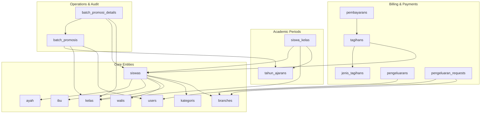
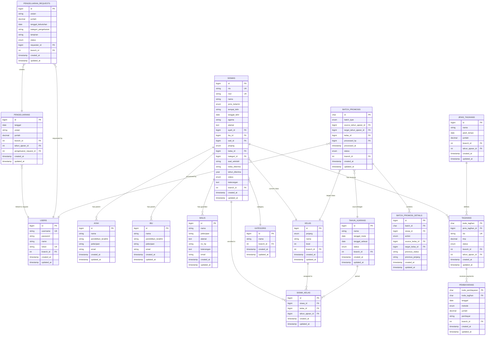
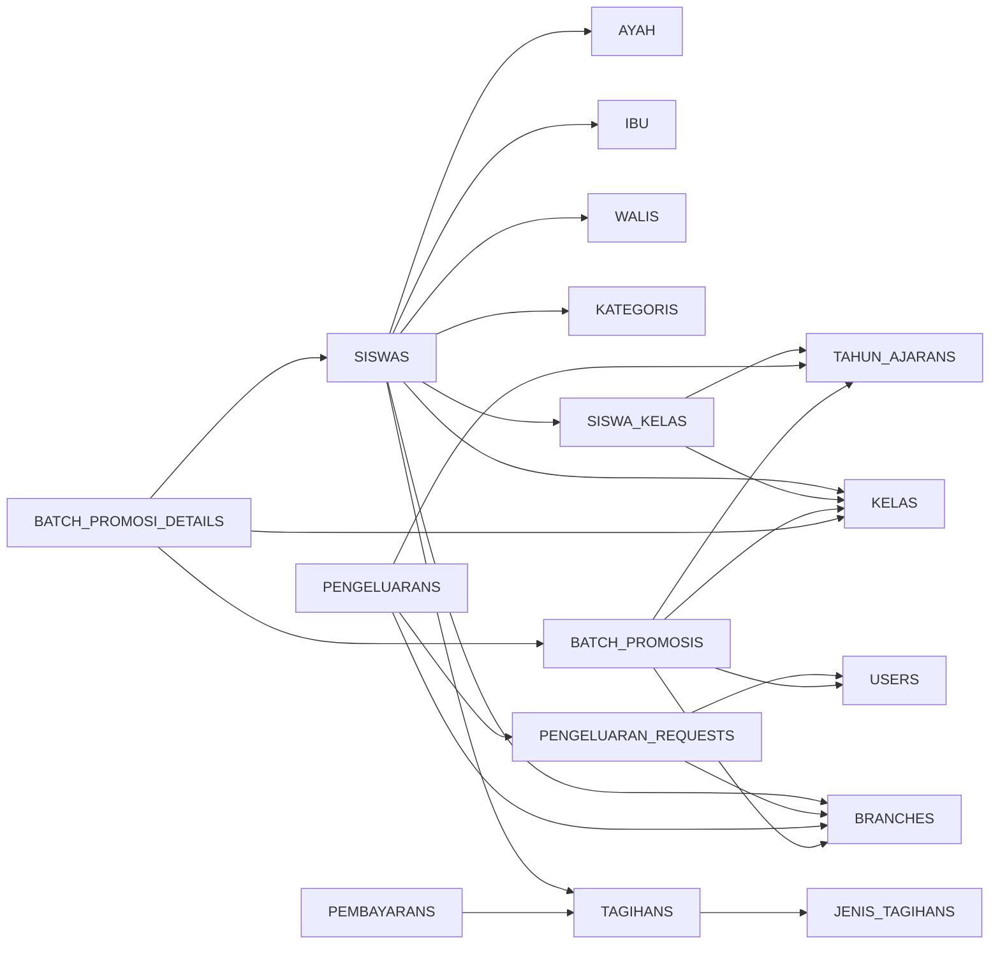

# Database Schema Design

<cite>
**Referenced Files in This Document**
- [2025_11_06_103229_create_users_table.php](file://backend/database/migrations/2025_11_06_103229_create_users_table.php)
- [2025_11_07_170206_create_ayahs_table.php](file://backend/database/migrations/2025_11_07_170206_create_ayahs_table.php)
- [2025_11_07_170456_create_ibus_table.php](file://backend/database/migrations/2025_11_07_170456_create_ibus_table.php)
- [2025_11_08_085831_create_walis_table.php](file://backend/database/migrations/2025_11_08_085831_create_walis_table.php)
- [2025_11_08_090937_create_siswas_table.php](file://backend/database/migrations/2025_11_08_090937_create_siswas_table.php)
- [2025_11_08_083401_create_kategoris_table.php](file://backend/database/migrations/2025_11_08_083401_create_kategoris_table.php)
- [2025_11_08_084002_create_kelas_table.php](file://backend/database/migrations/2025_11_08_084002_create_kelas_table.php)
- [2025_11_14_093831_create_jenis_tagihans_table.php](file://backend/database/migrations/2025_11_14_093831_create_jenis_tagihans_table.php)
- [2025_11_14_094745_create_tagihans_table.php](file://backend/database/migrations/2025_11_14_094745_create_tagihans_table.php)
- [2025_11_14_102319_create_pembayarans_table.php](file://backend/database/migrations/2025_11_14_102319_create_pembayarans_table.php)
- [2026_05_25_100000_create_tahun_ajarans_table.php](file://backend/database/migrations/2026_05_25_100000_create_tahun_ajarans_table.php)
- [2026_05_25_100200_create_siswa_kelas_table.php](file://backend/database/migrations/2026_05_25_100200_create_siswa_kelas_table.php)
- [2026_05_25_100500_create_batch_promosis_table.php](file://backend/database/migrations/2026_05_25_100500_create_batch_promosis_table.php)
- [2026_05_25_100600_create_batch_promosi_details_table.php](file://backend/database/migrations/2026_05_25_100600_create_batch_promosi_details_table.php)
- [2026_05_26_220000_create_pengeluaran_requests_table.php](file://backend/database/migrations/2026_05_26_220000_create_pengeluaran_requests_table.php)
- [DatabaseSeeder.php](file://backend/database/seeders/DatabaseSeeder.php)
- [Pengeluaran.php](file://backend/app/Models/Pengeluaran.php)
- [PengeluaranRequest.php](file://backend/app/Models/PengeluaranRequest.php)
</cite>

## Update Summary
**Changes Made**
- Updated Data Seeding Procedures section to document multi-branch global counters for NIS numbers, tagihan codes, and payment codes
- Added Enhanced Financial Safeguards section documenting the 70% expenditure limit rule
- Updated Pengeluaran (Expenditure) model documentation to include financial safeguards
- Enhanced branch-specific administrator handling in seeding procedures

## Table of Contents
1. Introduction
2. Project Structure
3. Core Components
4. Architecture Overview
5. Detailed Component Analysis
6. Dependency Analysis
7. Performance Considerations
8. Troubleshooting Guide
9. Conclusion
10. Appendices

## Introduction
This document provides comprehensive database schema documentation for the Handayani system, focusing on core entities such as Users, Students, Parents (Ayah/Ibu), Guardians (Wali), Invoices (Tagihan), and Payments (Pembayaran). It details entity relationships, field definitions, data types, constraints, indexes, primary and foreign key relationships, validation rules enforced at the database level, and practical examples including common queries and Eloquent relationship patterns. It also covers migration strategy, version management, data seeding procedures with multi-branch support, enhanced financial safeguards, performance optimization, backup strategies, maintenance procedures, and data retention/archival policies for compliance.

## Project Structure
The database schema is defined using Laravel migrations under backend/database/migrations. The project uses a relational model with clear separation between student master data, academic periods, billing/invoicing, payments, and administrative features like branches and approval workflows. Multi-branch scenarios are supported through global counters and branch-scoped administrators.



[No sources needed since this diagram shows conceptual workflow, not actual code structure]

## Core Components
This section summarizes the core tables and their roles:
- users: System users with authentication and role attributes, now with branch_id for multi-branch support.
- siswas: Student master records with personal and enrollment information.
- ayah, ibu: Parent profiles linked to students.
- walis: Guardian profiles linked to students.
- kelas, kategoris: Class and category reference data with branch isolation.
- tahun_ajarans: Academic year/period per branch.
- siswa_kelas: Many-to-many mapping of students to classes within an academic period.
- jenis_tagihans: Invoice type definitions (e.g., tuition, fees) with branch and academic year context.
- tagihans: Per-student invoices referencing invoice types and students with unique global codes.
- pembayarans: Payment records linked to invoices with unique global codes.
- pengeluarans: Expenditure records with financial safeguards preventing negative balances.
- pengeluaran_requests: Expenditure request workflow entries with branch isolation.
- batch_promosis, batch_promosi_details: Batch promotion/graduation operations and audit details.

Key business constraints visible at the database level include unique identifiers (e.g., NIS/NISN), referential integrity via foreign keys, enumerated status fields that constrain allowed values, and enhanced financial safeguards limiting expenditures to prevent negative balances.

**Section sources**
- [2025_11_06_103229_create_users_table.php:1-32](file://backend/database/migrations/2025_11_06_103229_create_users_table.php#L1-L32)
- [2025_11_08_090937_create_siswas_table.php:1-47](file://backend/database/migrations/2025_11_08_090937_create_siswas_table.php#L1-L47)
- [2025_11_07_170206_create_ayahs_table.php:1-31](file://backend/database/migrations/2025_11_07_170206_create_ayahs_table.php#L1-L31)
- [2025_11_07_170456_create_ibus_table.php:1-31](file://backend/database/migrations/2025_11_07_170456_create_ibus_table.php#L1-L31)
- [2025_11_08_085831_create_walis_table.php:1-33](file://backend/database/migrations/2025_11_08_085831_create_walis_table.php#L1-L33)
- [2025_11_08_084002_create_kelas_table.php:1-30](file://backend/database/migrations/2025_11_08_084002_create_kelas_table.php#L1-L30)
- [2025_11_08_083401_create_kategoris_table.php:1-29](file://backend/database/migrations/2025_11_08_083401_create_kategoris_table.php#L1-L29)
- [2026_05_25_100000_create_tahun_ajarans_table.php:1-38](file://backend/database/migrations/2026_05_25_100000_create_tahun_ajarans_table.php#L1-L38)
- [2026_05_25_100200_create_siswa_kelas_table.php:1-34](file://backend/database/migrations/2026_05_25_100200_create_siswa_kelas_table.php#L1-L34)
- [2025_11_14_093831_create_jenis_tagihans_table.php:1-31](file://backend/database/migrations/2025_11_14_093831_create_jenis_tagihans_table.php#L1-L31)
- [2025_11_14_094745_create_tagihans_table.php:1-33](file://backend/database/migrations/2025_11_14_094745_create_tagihans_table.php#L1-L33)
- [2025_11_14_102319_create_pembayarans_table.php:1-34](file://backend/database/migrations/2025_11_14_102319_create_pembayarans_table.php#L1-L34)
- [2026_05_25_100500_create_batch_promosis_table.php:1-46](file://backend/database/migrations/2026_05_25_100500_create_batch_promosis_table.php#L1-L46)
- [2026_05_25_100600_create_batch_promosi_details_table.php:1-42](file://backend/database/migrations/2026_05_25_100600_create_batch_promosi_details_table.php#L1-L42)
- [2026_05_26_220000_create_pengeluaran_requests_table.php:1-33](file://backend/database/migrations/2026_05_26_220000_create_pengeluaran_requests_table.php#L1-L33)

## Architecture Overview
The database architecture centers around student lifecycle and financial operations with enhanced multi-branch support and financial safeguards:
- Student master data references parents/guardians and class/category with branch isolation.
- Academic periods (tahun_ajarans) govern class assignments through siswa_kelas with branch context.
- Billing (jenis_tagihans -> tagihans) ties invoices to students; payments (pembayarans) settle invoices with global unique codes.
- Financial operations include expenditures with safeguards preventing negative balances and expenditure requests with workflow states.
- Operational tables support batch promotions and expenditure requests with auditability and branch isolation.



**Diagram sources**
- [2025_11_06_103229_create_users_table.php:1-32](file://backend/database/migrations/2025_11_06_103229_create_users_table.php#L1-L32)
- [2025_11_08_090937_create_siswas_table.php:1-47](file://backend/database/migrations/2025_11_08_090937_create_siswas_table.php#L1-L47)
- [2025_11_07_170206_create_ayahs_table.php:1-31](file://backend/database/migrations/2025_11_07_170206_create_ayahs_table.php#L1-L31)
- [2025_11_07_170456_create_ibus_table.php:1-31](file://backend/database/migrations/2025_11_07_170456_create_ibus_table.php#L1-L31)
- [2025_11_08_085831_create_walis_table.php:1-33](file://backend/database/migrations/2025_11_08_085831_create_walis_table.php#L1-L33)
- [2025_11_08_084002_create_kelas_table.php:1-30](file://backend/database/migrations/2025_11_08_084002_create_kelas_table.php#L1-L30)
- [2025_11_08_083401_create_kategoris_table.php:1-29](file://backend/database/migrations/2025_11_08_083401_create_kategoris_table.php#L1-L29)
- [2026_05_25_100000_create_tahun_ajarans_table.php:1-38](file://backend/database/migrations/2026_05_25_100000_create_tahun_ajarans_table.php#L1-L38)
- [2026_05_25_100200_create_siswa_kelas_table.php:1-34](file://backend/database/migrations/2026_05_25_100200_create_siswa_kelas_table.php#L1-L34)
- [2025_11_14_093831_create_jenis_tagihans_table.php:1-31](file://backend/database/migrations/2025_11_14_093831_create_jenis_tagihans_table.php#L1-L31)
- [2025_11_14_094745_create_tagihans_table.php:1-33](file://backend/database/migrations/2025_11_14_094745_create_tagihans_table.php#L1-L33)
- [2025_11_14_102319_create_pembayarans_table.php:1-34](file://backend/database/migrations/2025_11_14_102319_create_pembayarans_table.php#L1-L34)
- [2026_05_25_100500_create_batch_promosis_table.php:1-46](file://backend/database/migrations/2026_05_25_100500_create_batch_promosis_table.php#L1-L46)
- [2026_05_25_100600_create_batch_promosi_details_table.php:1-42](file://backend/database/migrations/2026_05_25_100600_create_batch_promosi_details_table.php#L1-L42)
- [2026_05_26_220000_create_pengeluaran_requests_table.php:1-33](file://backend/database/migrations/2026_05_26_220000_create_pengeluaran_requests_table.php#L1-L33)

## Detailed Component Analysis

### Users
- Purpose: Authentication and authorization base table with multi-branch support.
- Primary Key: id (auto-increment).
- Unique Constraints: username, token.
- Notable Fields: role, password, name, branch_id for branch isolation.
- Indexes: Unique indexes on username and token.
- Business Rules: Username must be unique; token optional but unique if provided; branch_id enables branch-scoped access control.

Common Queries
- Find user by username: SELECT * FROM users WHERE username = ?;
- Validate token: SELECT id FROM users WHERE token = ? AND token IS NOT NULL;
- Get branch users: SELECT * FROM users WHERE branch_id = ?;

Eloquent Relationships
- User hasMany Siswa (if implemented via foreign key on users.id referenced by other models).
- User hasMany PengeluaranRequests (requester_id).
- User belongsTo Branch (branch_id).

Data Validation Rules
- Enforced via unique constraints on username and token.

Indexes
- Unique index on username.
- Unique index on token.

**Section sources**
- [2025_11_06_103229_create_users_table.php:1-32](file://backend/database/migrations/2025_11_06_103229_create_users_table.php#L1-L32)

### Students (siswas)
- Purpose: Master record for each student with branch isolation.
- Primary Key: id.
- Unique Constraints: nis, nisn.
- Foreign Keys: ayah_id -> ayah.id, ibu_id -> ibu.id, wali_id -> walis.id, kelas_id -> kelas.id, kategori_id -> kategoris.id, branch_id -> branches.id.
- Enumerations: jenis_kelamin, jenjang, status.
- Timestamps: created_at, updated_at.

Business Constraints
- NIS/NISN uniqueness ensures identity integrity across all branches.
- Status restricted to predefined values.
- Referential integrity enforced for parents/guardian/class/category/branch.

Common Queries
- Active students in a class: SELECT * FROM siswas WHERE kelas_id = ? AND status = 'Aktif';
- Student by NIS: SELECT * FROM siswas WHERE nis = ?;
- Branch-specific students: SELECT * FROM siswas WHERE branch_id = ?;

Eloquent Relationships
- Siswa belongsTo Ayah, Ibu, Wali, Kelas, Kategori, Branch.
- Siswa hasMany Tagihan.
- Siswa hasMany Pembayaran via Tagihan.

Indexes
- Unique indexes on nis and nisn.

**Section sources**
- [2025_11_08_090937_create_siswas_table.php:1-47](file://backend/database/migrations/2025_11_08_090937_create_siswas_table.php#L1-L47)

### Parents (ayah, ibu)
- Purpose: Store parent profiles with contact information.
- Primary Key: id.
- Fields: nama, pendidikan_terakhir, pekerjaan, email.
- Timestamps: created_at, updated_at.

Business Constraints
- Optional fields allow flexible parent data capture.
- Email addresses support notification delivery.

Common Queries
- List all fathers: SELECT * FROM ayah;
- Parent by ID: SELECT * FROM ibu WHERE id = ?;

Eloquent Relationships
- Siswa belongsTo Ayah and Ibu.

**Section sources**
- [2025_11_07_170206_create_ayahs_table.php:1-31](file://backend/database/migrations/2025_11_07_170206_create_ayahs_table.php#L1-L31)
- [2025_11_07_170456_create_ibus_table.php:1-31](file://backend/database/migrations/2025_11_07_170456_create_ibus_table.php#L1-L31)

### Guardians (walis)
- Purpose: Guardian profile with contact info and email support.
- Primary Key: id.
- Fields: nama, pekerjaan, alamat, no_hp, keterangan, email.
- Timestamps: created_at, updated_at.

Business Constraints
- Required fields ensure basic contact information.
- Email addresses enable notification delivery.

Common Queries
- Get guardian by phone: SELECT * FROM walis WHERE no_hp = ?;

Eloquent Relationships
- Siswa belongsTo Wali.

**Section sources**
- [2025_11_08_085831_create_walis_table.php:1-33](file://backend/database/migrations/2025_11_08_085831_create_walis_table.php#L1-L33)

### Classes and Categories (kelas, kategoris)
- Purpose: Reference data for student classification and grouping with branch isolation.
- Primary Keys: id.
- Fields: kelas.jenjang, kelas.nama, kelas.level, kelas.branch_id; kategoris.nama, kategoris.branch_id.
- Timestamps: created_at, updated_at.

Business Constraints
- Jenjang enumeration restricts class levels.
- Branch isolation ensures data separation across locations.

Common Queries
- List classes by jenjang: SELECT * FROM kelas WHERE jenjang = ?;
- Category lookup: SELECT * FROM kategoris WHERE nama = ?;
- Branch-specific classes: SELECT * FROM kelas WHERE branch_id = ?;

Eloquent Relationships
- Siswa belongsTo Kelas, Kategori, Branch.

**Section sources**
- [2025_11_08_084002_create_kelas_table.php:1-30](file://backend/database/migrations/2025_11_08_084002_create_kelas_table.php#L1-L30)
- [2025_11_08_083401_create_kategoris_table.php:1-29](file://backend/database/migrations/2025_11_08_083401_create_kategoris_table.php#L1-L29)

### Academic Periods and Enrollment (tahun_ajarans, siswa_kelas)
- Purpose: Define academic years per branch and map students to classes within those periods.
- Primary Keys: id (tahun_ajarans), id (siswa_kelas).
- Unique Constraints: (nama, branch_id) on tahun_ajarans; (siswa_id, tahun_ajaran_id) on siswa_kelas.
- Foreign Keys: siswa_kelas.siswa_id -> siswas.id; siswa_kelas.kelas_id -> kelas.id; siswa_kelas.tahun_ajaran_id -> tahun_ajarans.id.
- Indexes: (branch_id, status) on tahun_ajarans; (siswa_id, tahun_ajaran_id) unique.

Business Constraints
- One class per student per academic period.
- One academic period name per branch.
- Branch isolation ensures data separation.

Common Queries
- Current class for student in period: SELECT kelas_id FROM siswa_kelas WHERE siswa_id = ? AND tahun_ajaran_id = ?;
- Active periods per branch: SELECT * FROM tahun_ajarans WHERE branch_id = ? AND status = 'Aktif';

Eloquent Relationships
- Siswa hasMany SiswaKelas.
- Kelas hasMany SiswaKelas.
- TahunAjaran hasMany SiswaKelas.

**Section sources**
- [2026_05_25_100000_create_tahun_ajarans_table.php:1-38](file://backend/database/migrations/2026_05_25_100000_create_tahun_ajarans_table.php#L1-L38)
- [2026_05_25_100200_create_siswa_kelas_table.php:1-34](file://backend/database/migrations/2026_05_25_100200_create_siswa_kelas_table.php#L1-L34)

### Invoices and Payments (jenis_tagihans, tagihans, pembayarans)
- Purpose: Define invoice types, create per-student invoices, and record payments with global unique codes.
- Primary Keys: id (jenis_tagihans), kode_tagihan (tagihans), kode_pembayaran (pembayarans).
- Foreign Keys: tagihans.jenis_tagihan_id -> jenis_tagihans.id; tagihans.nis -> siswas.nis; pembayarans.kode_tagihan -> tagihans.kode_tagihan.
- Enumerations: tagihans.status, pembayarans.metode.
- Indexes: kode_pembayaran indexed; kode_tagihan indexed; tanggal indexed; nis unique on tagihans.

Business Constraints
- Each invoice tied to one student and one invoice type.
- Payment method constrained to offline or online_midtrans.
- Status transitions governed by application logic; DB enforces allowed values.
- Global unique codes prevent conflicts across branches.

Common Queries
- Unpaid invoices for student: SELECT * FROM tagihans WHERE nis = ? AND status != 'Lunas';
- Payments for invoice: SELECT * FROM pembayarans WHERE kode_tagihan = ?;
- Branch-specific transactions: SELECT * FROM tagihans WHERE branch_id = ?;

Eloquent Relationships
- JenisTagihan hasMany Tagihan.
- Siswa hasMany Tagihan.
- Tagihan hasMany Pembayaran.

**Section sources**
- [2025_11_14_093831_create_jenis_tagihans_table.php:1-31](file://backend/database/migrations/2025_11_14_093831_create_jenis_tagihans_table.php#L1-L31)
- [2025_11_14_094745_create_tagihans_table.php:1-33](file://backend/database/migrations/2025_11_14_094745_create_tagihans_table.php#L1-L33)
- [2025_11_14_102319_create_pembayarans_table.php:1-34](file://backend/database/migrations/2025_11_14_102319_create_pembayarans_table.php#L1-L34)

### Expenditures and Requests (pengeluarans, pengeluaran_requests)
- Purpose: Track expenditures with financial safeguards and manage expenditure request workflows.
- Primary Keys: id (both tables).
- Foreign Keys: pengeluaran.pengeluaran_request_id -> pengeluaran_requests.id; pengeluaran_request.requester_id -> users.id; both have branch_id for isolation.
- Enumerations: pengeluaran_requests.status (draft, submitted, approved, rejected, disbursed).
- Indexes: (branch_id, status), requester_id on pengeluaran_requests.

Business Constraints
- Workflow states enforce progression from draft to disbursed.
- Branch-scoped requests and expenditures.
- **Enhanced Financial Safeguard**: Expenditures limited to prevent negative balances through application-level validation.
- Requester can only modify their own draft/rejected requests.

Common Queries
- Pending requests per branch: SELECT * FROM pengeluaran_requests WHERE branch_id = ? AND status IN ('submitted', 'approved');
- Total expenditures by branch: SELECT SUM(jumlah) FROM pengeluarans WHERE branch_id = ?;

Eloquent Relationships
- PengeluaranRequest belongsTo User (requester), Branch.
- Pengeluaran belongsTo PengeluaranRequest, Branch, TahunAjaran.
- PengeluaranRequest hasOne Pengeluaran.

**Section sources**
- [2026_05_26_220000_create_pengeluaran_requests_table.php:1-33](file://backend/database/migrations/2026_05_26_220000_create_pengeluaran_requests_table.php#L1-L33)
- [Pengeluaran.php:1-81](file://backend/app/Models/Pengeluaran.php#L1-L81)
- [PengeluaranRequest.php:1-63](file://backend/app/Models/PengeluaranRequest.php#L1-L63)

### Batch Promotions and Details (batch_promosis, batch_promosi_details)
- Purpose: Record batch promotion/graduation operations and detailed actions per student.
- Primary Keys: id (char UUID) on batch_promosis; id on batch_promosi_details.
- Foreign Keys: batch_promosis.source_tahun_ajaran_id, target_tahun_ajaran_id, kelas_id, processed_by, branch_id; batch_promosi_details.batch_id, siswa_id, source_kelas_id, target_kelas_id.
- Enumerations: batch_type, status; action.
- Indexes: (branch_id, status), (branch_id, processed_at) on batch_promosis; batch_id, siswa_id on details.

Business Constraints
- Tracks source/target academic periods and target class.
- Maintains audit trail with previous state snapshots.
- Branch isolation ensures operational data separation.

Common Queries
- Completed batches per branch: SELECT * FROM batch_promosis WHERE branch_id = ? AND status = 'completed';
- Details for batch: SELECT * FROM batch_promosi_details WHERE batch_id = ?;

Eloquent Relationships
- BatchPromosis hasMany BatchPromosiDetails.
- BatchPromosis belongsTo TahunAjaran (source/target), Kelas, User, Branch.
- BatchPromosiDetails belongsTo Siswa, Kelas.

**Section sources**
- [2026_05_25_100500_create_batch_promosis_table.php:1-46](file://backend/database/migrations/2026_05_25_100500_create_batch_promosis_table.php#L1-L46)
- [2026_05_25_100600_create_batch_promosi_details_table.php:1-42](file://backend/database/migrations/2026_05_25_100600_create_batch_promosi_details_table.php#L1-L42)

## Enhanced Financial Safeguards

### Expenditure Limit Protection
The system implements financial safeguards to prevent negative balances by limiting total expenditures to 70% of total income. This protection is enforced during data seeding and should be applied consistently across all expenditure creation operations.

**Financial Calculation Logic**
- Maximum allowable expenditure = Total Income × 0.70
- Expenditure creation is blocked if it would exceed this threshold
- Real-time balance calculation prevents overspending

**Implementation Examples**
```php
// Example of expenditure limit check
$totalIncome = Pembayaran::where('branch_id', $branchId)->sum('jumlah');
$maxExpenditure = $totalIncome * 0.70;
$currentExpenditure = Pengeluaran::where('branch_id', $branchId)->sum('jumlah');

if (($currentExpenditure + $newAmount) > $maxExpenditure) {
    throw new Exception('Expenditure exceeds 70% of total income limit');
}
```

**Branch-Specific Enforcement**
- Financial limits are calculated per branch independently
- Each branch maintains its own income/expenditure balance
- Cross-branch financial operations are prevented

**Section sources**
- [DatabaseSeeder.php:418-447](file://backend/database/seeders/DatabaseSeeder.php#L418-L447)
- [Pengeluaran.php:1-81](file://backend/app/Models/Pengeluaran.php#L1-L81)

## Dependency Analysis
The following dependency graph highlights direct foreign key relationships across core tables with enhanced multi-branch support:



**Diagram sources**
- [2025_11_08_090937_create_siswas_table.php:1-47](file://backend/database/migrations/2025_11_08_090937_create_siswas_table.php#L1-L47)
- [2025_11_07_170206_create_ayahs_table.php:1-31](file://backend/database/migrations/2025_11_07_170206_create_ayahs_table.php#L1-L31)
- [2025_11_07_170456_create_ibus_table.php:1-31](file://backend/database/migrations/2025_11_07_170456_create_ibus_table.php#L1-L31)
- [2025_11_08_085831_create_walis_table.php:1-33](file://backend/database/migrations/2025_11_08_085831_create_walis_table.php#L1-L33)
- [2025_11_08_084002_create_kelas_table.php:1-30](file://backend/database/migrations/2025_11_08_084002_create_kelas_table.php#L1-L30)
- [2025_11_08_083401_create_kategoris_table.php:1-29](file://backend/database/migrations/2025_11_08_083401_create_kategoris_table.php#L1-L29)
- [2026_05_25_100000_create_tahun_ajarans_table.php:1-38](file://backend/database/migrations/2026_05_25_100000_create_tahun_ajarans_table.php#L1-L38)
- [2026_05_25_100200_create_siswa_kelas_table.php:1-34](file://backend/database/migrations/2026_05_25_100200_create_siswa_kelas_table.php#L1-L34)
- [2025_11_14_093831_create_jenis_tagihans_table.php:1-31](file://backend/database/migrations/2025_11_14_093831_create_jenis_tagihans_table.php#L1-L31)
- [2025_11_14_094745_create_tagihans_table.php:1-33](file://backend/database/migrations/2025_11_14_094745_create_tagihans_table.php#L1-L33)
- [2025_11_14_102319_create_pembayarans_table.php:1-34](file://backend/database/migrations/2025_11_14_102319_create_pembayarans_table.php#L1-L34)
- [2026_05_25_100500_create_batch_promosis_table.php:1-46](file://backend/database/migrations/2026_05_25_100500_create_batch_promosis_table.php#L1-L46)
- [2026_05_25_100600_create_batch_promosi_details_table.php:1-42](file://backend/database/migrations/2026_05_25_100600_create_batch_promosi_details_table.php#L1-L42)
- [2026_05_26_220000_create_pengeluaran_requests_table.php:1-33](file://backend/database/migrations/2026_05_26_220000_create_pengeluaran_requests_table.php#L1-L33)

**Section sources**
- [2025_11_08_090937_create_siswas_table.php:1-47](file://backend/database/migrations/2025_11_08_090937_create_siswas_table.php#L1-L47)
- [2025_11_14_094745_create_tagihans_table.php:1-33](file://backend/database/migrations/2025_11_14_094745_create_tagihans_table.php#L1-L33)
- [2025_11_14_102319_create_pembayarans_table.php:1-34](file://backend/database/migrations/2025_11_14_102319_create_pembayarans_table.php#L1-L34)

## Performance Considerations
- Indexing Strategy
  - Ensure frequent filter columns are indexed: tagihans.nis, pembayarans.kode_tagihan, pembayarans.tanggal, siswa_kelas.siswa_id, siswa_kelas.tahun_ajaran_id, tahun_ajarans.branch_id/status, batch_promosis.branch_id/status and processed_at, pengeluaran_requests.branch_id/status.
  - Composite indexes for multi-column filters (e.g., branch_id + status, branch_id + tanggal).
- Query Optimization
  - Use selective joins and avoid selecting unnecessary columns.
  - Prefer exact matches on enums and unique identifiers (nis, kode_tagihan).
  - Leverage branch isolation for faster scoped queries.
- Data Volume Management
  - Partition large tables (e.g., pembayarans, tagihans, pengeluarans) by date ranges and branch_id if growth is significant.
  - Archive historical payment/invoice/expenditure data to cold storage while maintaining referential links.
- Concurrency and Locking
  - Apply transactions for payment recording and expenditure creation to prevent race conditions when updating invoice statuses and checking financial limits.
- Monitoring
  - Track slow queries and adjust indexes accordingly.
  - Monitor replication lag if using read replicas for reporting.
  - Monitor financial safeguard violations and alert on near-limit situations.

[No sources needed since this section provides general guidance]

## Troubleshooting Guide
- Constraint Violations
  - Duplicate NIS/NISN: Check unique constraints on siswas.nis and siswas.nisn before insert/update.
  - Orphaned Records: Ensure foreign key cascades are configured appropriately; verify deletion order for dependent tables.
  - Branch Isolation Issues: Verify branch_id consistency across related records.
- Status Transitions
  - Validate application-level state machines against DB enum constraints to avoid invalid updates.
  - Check expenditure request workflow states (draft → submitted → approved → disbursed/rejected).
- Payment Reconciliation
  - Cross-check pembayarans.kode_tagihan with tagihans.kode_tagihan; use indexes to speed up lookups.
  - Verify global unique code generation doesn't conflict across branches.
- Batch Operations
  - Inspect batch_promosis.status and batch_promosi_details.action for failed steps; rollback or reprocess as needed.
- Financial Safeguards
  - Monitor expenditure limits (70% of income rule) and handle overflow scenarios gracefully.
  - Validate real-time balance calculations during expenditure creation.

**Section sources**
- [2025_11_08_090937_create_siswas_table.php:1-47](file://backend/database/migrations/2025_11_08_090937_create_siswas_table.php#L1-L47)
- [2025_11_14_102319_create_pembayarans_table.php:1-34](file://backend/database/migrations/2025_11_14_102319_create_pembayarans_table.php#L1-L34)
- [2026_05_25_100500_create_batch_promosis_table.php:1-46](file://backend/database/migrations/2026_05_25_100500_create_batch_promosis_table.php#L1-L46)
- [DatabaseSeeder.php:418-447](file://backend/database/seeders/DatabaseSeeder.php#L418-L447)

## Conclusion
The Handayani database schema provides a robust foundation for managing student data, academic periods, invoicing, and payments with strong referential integrity, clear enumerations, and enhanced multi-branch support. The implementation includes global unique counters for NIS numbers, tagihan codes, and payment codes to prevent conflicts across branches, along with financial safeguards limiting expenditures to prevent negative balances. Proper indexing, transactional handling, and branch isolation will ensure performance and consistency. Operational tables support auditability and workflow tracking with enhanced security measures. Adhering to the outlined maintenance and archival practices will help maintain compliance and scalability.

[No sources needed since this section summarizes without analyzing specific files]

## Appendices

### Migration Strategy and Version Management
- Migrations are timestamp-prefixed for ordering and executed sequentially.
- Use Laravel's migration commands to apply changes across environments consistently.
- For destructive changes, prefer additive migrations (add columns/indexes) and backfill data where necessary.
- Multi-branch support requires careful consideration of existing data and branch_id population.

**Section sources**
- [2025_11_06_103229_create_users_table.php:1-32](file://backend/database/migrations/2025_11_06_103229_create_users_table.php#L1-L32)
- [2026_05_25_100000_create_tahun_ajarans_table.php:1-38](file://backend/database/migrations/2026_05_25_100000_create_tahun_ajarans_table.php#L1-L38)

### Data Seeding Procedures
- Seeders populate reference data (e.g., categories, classes, users, sample students/invoices/payments) with multi-branch support.
- **Global Counters Implementation**: 
  - NIS counter (`$this->nisCounter`) ensures unique student IDs across all branches
  - Tagihan counter (`$this->tagihanCounter`) generates unique invoice codes globally
  - Pembayaran counter (`$this->pembayaranCounter`) creates unique payment codes across branches
- **Multi-Branch Setup**: Creates multiple branches with isolated administrators and data
- **Financial Safeguards**: Expenditures limited to 70% of total income to prevent negative balances
- **Branch-Specific Administrators**: Each branch gets dedicated admin accounts with proper permissions
- Use factories to generate realistic datasets for testing.
- Ensure seeders respect unique constraints and foreign key dependencies.

**Updated** Enhanced with multi-branch global counters and financial safeguards

**Section sources**
- [DatabaseSeeder.php:176-477](file://backend/database/seeders/DatabaseSeeder.php#L176-L477)
- [2025_11_08_083401_create_kategoris_table.php:1-29](file://backend/database/migrations/2025_11_08_083401_create_kategoris_table.php#L1-L29)
- [2025_11_08_084002_create_kelas_table.php:1-30](file://backend/database/migrations/2025_11_08_084002_create_kelas_table.php#L1-L30)

### Common Eloquent Relationship Patterns
- Siswa relationships:
  - belongsTo Ayah, Ibu, Wali, Kelas, Kategori, Branch.
  - hasMany Tagihan.
  - hasMany Pembayaran via Tagihan.
- Tagihan relationships:
  - belongsTo JenisTagihan, Siswa, Branch, TahunAjaran.
  - hasMany Pembayaran.
- Pembayaran relationships:
  - belongsTo Tagihan, Branch.
- SiswaKelas relationships:
  - belongsTo Siswa, Kelas, TahunAjaran.
- BatchPromosis relationships:
  - belongsTo TahunAjaran (source/target), Kelas, User, Branch.
  - hasMany BatchPromosiDetails.
- BatchPromosiDetails relationships:
  - belongsTo BatchPromosis, Siswa, Kelas.
- PengeluaranRequest relationships:
  - belongsTo User (requester), Branch.
  - hasOne Pengeluaran.
- Pengeluaran relationships:
  - belongsTo PengeluaranRequest, Branch, TahunAjaran.

[No sources needed since this section provides general guidance]

### Backup Strategies and Maintenance Procedures
- Backups
  - Schedule regular full backups and incremental backups for transaction logs.
  - Test restore procedures periodically.
  - Include branch-specific data isolation in backup strategies.
- Maintenance
  - Optimize tables and rebuild indexes periodically.
  - Purge old logs and temporary data.
  - Monitor financial safeguard thresholds and alert on near-limit situations.
- Compliance
  - Retain financial records per policy; archive inactive records.
  - Maintain audit trails for critical operations (payments, promotions, expenditure approvals).
  - Ensure branch data isolation compliance during maintenance operations.

[No sources needed since this section provides general guidance]

### Data Retention Policies and Archival Rules
- Financial Records
  - Keep invoices and payments indefinitely or per legal requirements; archive inactive records.
  - Maintain expenditure records with financial safeguard audit trails.
- Student Records
  - Retain active and graduated student records; consider anonymization for long-term archives.
  - Preserve branch-specific student data isolation.
- Audit Logs
  - Retain operational logs for a defined period; purge after compliance window.
  - Include expenditure request workflow history and approval chains.
- Branch Data
  - Implement branch-specific retention policies where required.
  - Ensure cross-branch data separation during archival processes.

[No sources needed since this section provides general guidance]