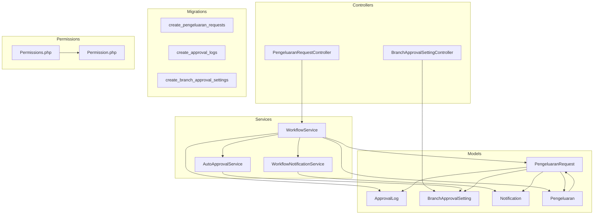
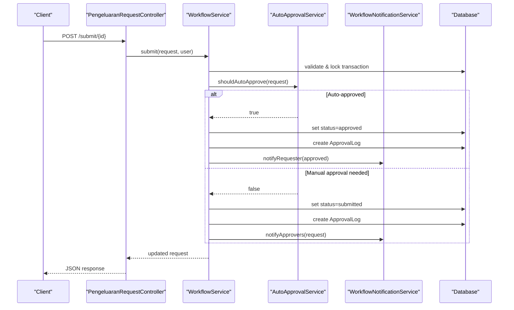
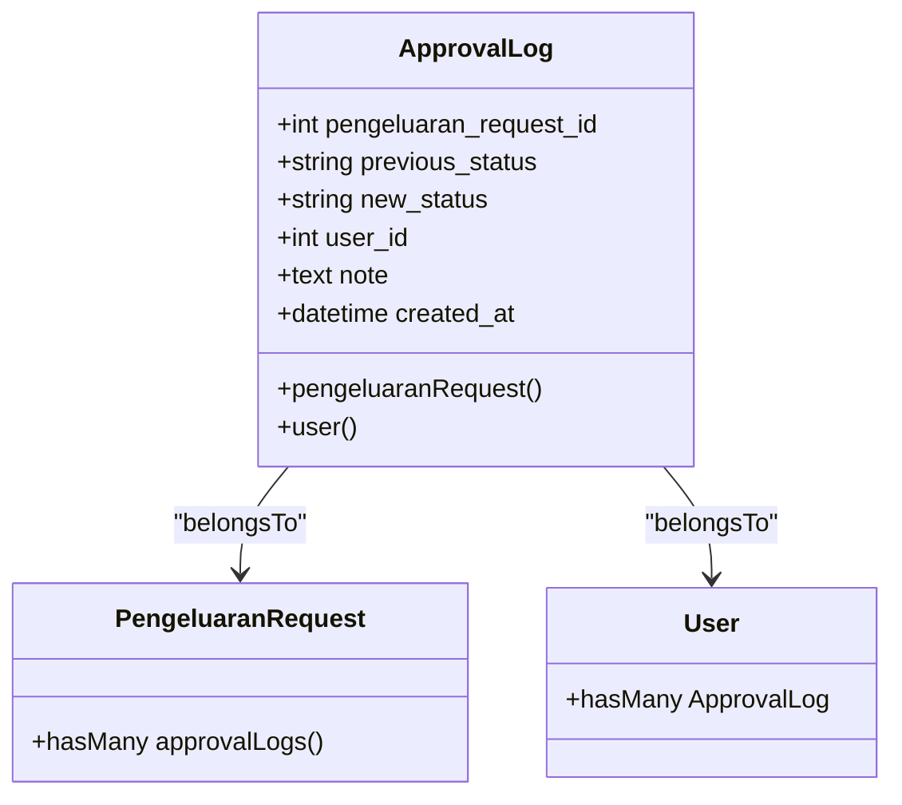
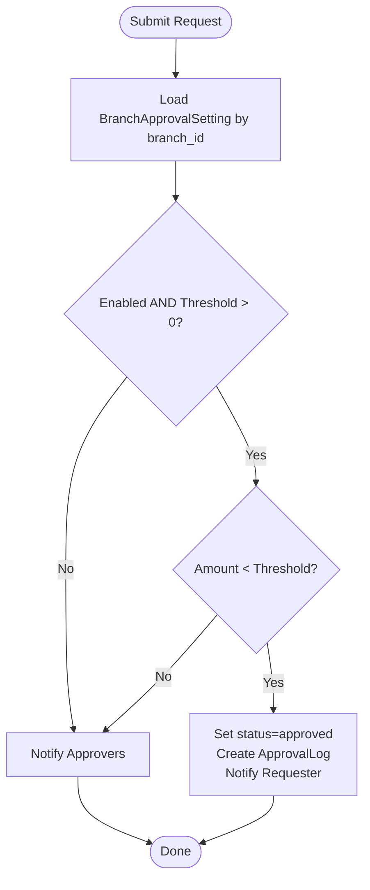
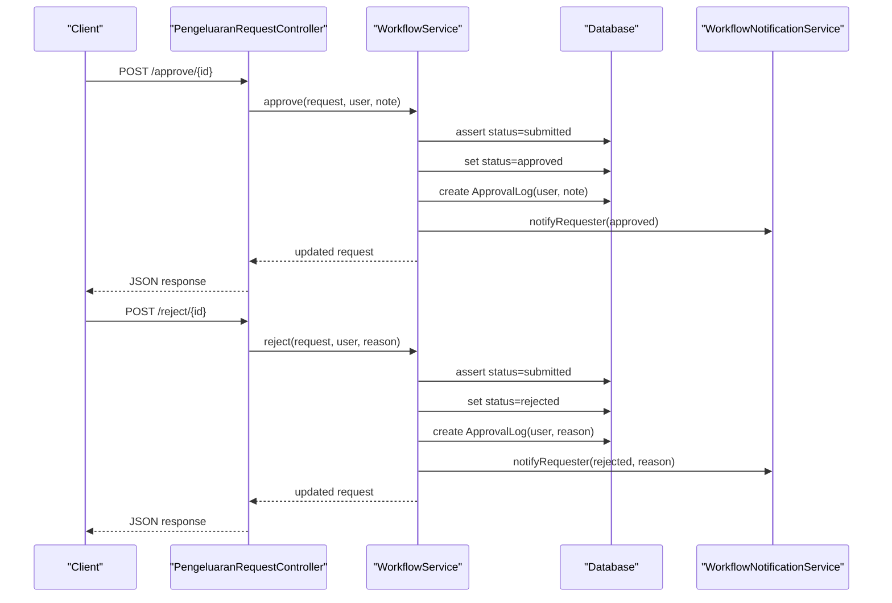
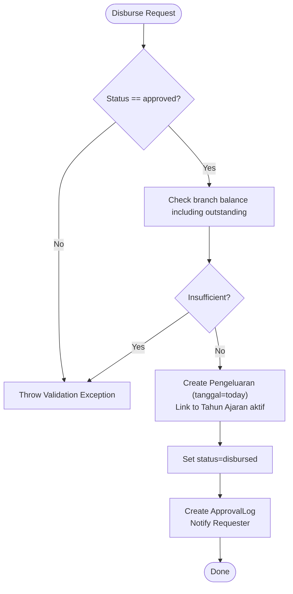
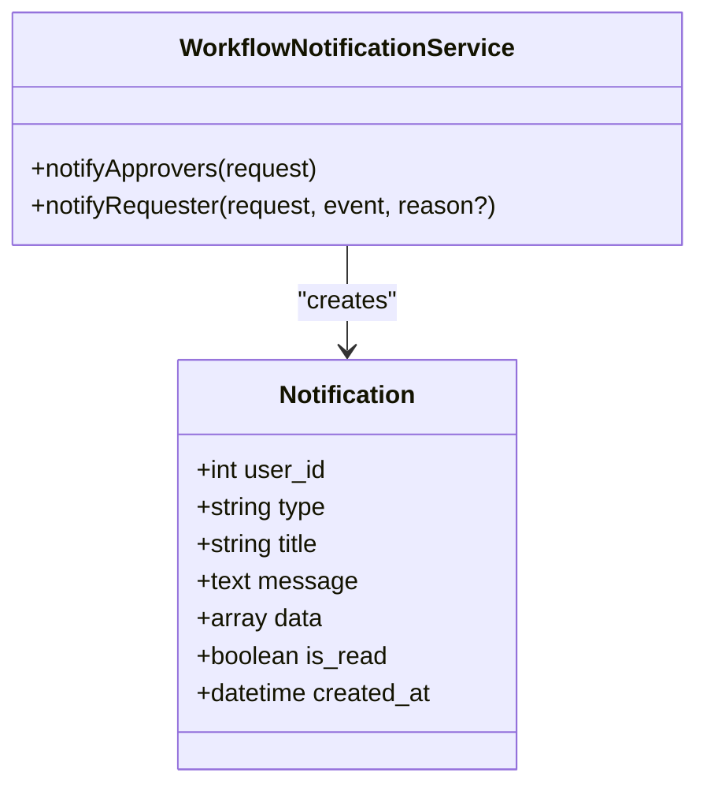
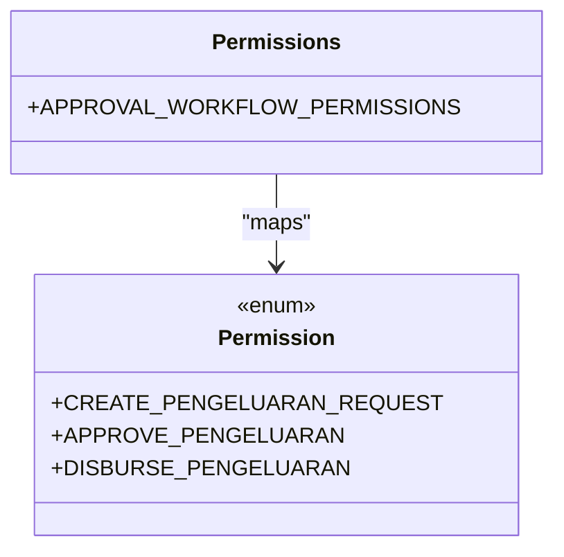
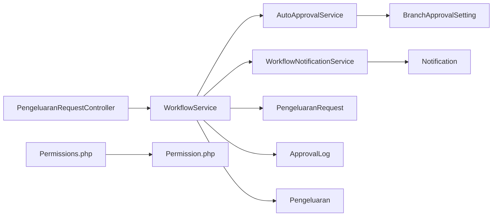

# Approval Workflow

<cite>
**Referenced Files in This Document**
- [ApprovalLog.php](file://backend/app/Models/ApprovalLog.php)
- [BranchApprovalSetting.php](file://backend/app/Models/BranchApprovalSetting.php)
- [PengeluaranRequest.php](file://backend/app/Models/PengeluaranRequest.php)
- [Pengeluaran.php](file://backend/app/Models/Pengeluaran.php)
- [Notification.php](file://backend/app/Models/Notification.php)
- [AutoApprovalService.php](file://backend/app/Services/AutoApprovalService.php)
- [WorkflowService.php](file://backend/app/Services/WorkflowService.php)
- [WorkflowNotificationService.php](file://backend/app/Services/WorkflowNotificationService.php)
- [BranchApprovalSettingController.php](file://backend/app/Http/Controllers/BranchApprovalSettingController.php)
- [PengeluaranRequestController.php](file://backend/app/Http/Controllers/PengeluaranRequestController.php)
- [2026_05_26_220000_create_pengeluaran_requests_table.php](file://backend/database/migrations/2026_05_26_220000_create_pengeluaran_requests_table.php)
- [2026_05_26_220001_create_approval_logs_table.php](file://backend/database/migrations/2026_05_26_220001_create_approval_logs_table.php)
- [2026_05_26_220002_create_branch_approval_settings_table.php](file://backend/database/migrations/2026_05_26_220002_create_branch_approval_settings_table.php)
- [Permissions.php](file://backend/app/Constant/Permissions.php)
- [Permission.php](file://backend/app/Enum/Permission.php)
</cite>

## Table of Contents
1. Introduction
2. Project Structure
3. Core Components
4. Architecture Overview
5. Detailed Component Analysis
6. Dependency Analysis
7. Performance Considerations
8. Troubleshooting Guide
9. Conclusion

## Introduction
This document describes the expense approval workflow system for managing Pengeluaran (expense) requests across branches. It covers:
- Data model and audit trail via ApprovalLog
- Branch-scoped approval settings and automatic approval thresholds
- Manual approval and rejection workflows
- Disbursement process that creates a final Pengeluaran record
- Notifications to approvers and requesters
- Permission-based access control and branch isolation
- Compliance and auditability through immutable logs

The system supports a simple two-stage flow: submit → approve/reject, with optional auto-approval based on branch configuration. After approval, the requester can disburse the amount, which records an actual expense entry.

## Project Structure
The approval workflow spans models, services, controllers, migrations, and permission constants. The key areas are:
- Models: PengeluaranRequest, ApprovalLog, BranchApprovalSetting, Notification, Pengeluaran
- Services: WorkflowService, AutoApprovalService, WorkflowNotificationService
- Controllers: PengeluaranRequestController, BranchApprovalSettingController
- Migrations: tables for requests, approval logs, and branch settings
- Permissions: constants and enums defining create, approve, and disburse permissions

**Diagram sources**
- [PengeluaranRequest.php](file://backend/app/Models/PengeluaranRequest.php)
- [ApprovalLog.php](file://backend/app/Models/ApprovalLog.php)
- [BranchApprovalSetting.php](file://backend/app/Models/BranchApprovalSetting.php)
- [Notification.php](file://backend/app/Models/Notification.php)
- [Pengeluaran.php](file://backend/app/Models/Pengeluaran.php)
- [WorkflowService.php](file://backend/app/Services/WorkflowService.php)
- [AutoApprovalService.php](file://backend/app/Services/AutoApprovalService.php)
- [WorkflowNotificationService.php](file://backend/app/Services/WorkflowNotificationService.php)
- [PengeluaranRequestController.php](file://backend/app/Http/Controllers/PengeluaranRequestController.php)
- [BranchApprovalSettingController.php](file://backend/app/Http/Controllers/BranchApprovalSettingController.php)
- [2026_05_26_220000_create_pengeluaran_requests_table.php](file://backend/database/migrations/2026_05_26_220000_create_pengeluaran_requests_table.php)
- [2026_05_26_220001_create_approval_logs_table.php](file://backend/database/migrations/2026_05_26_220001_create_approval_logs_table.php)
- [2026_05_26_220002_create_branch_approval_settings_table.php](file://backend/database/migrations/2026_05_26_220002_create_branch_approval_settings_table.php)
- [Permissions.php](file://backend/app/Constant/Permissions.php)
- [Permission.php](file://backend/app/Enum/Permission.php)

**Section sources**
- [PengeluaranRequest.php](file://backend/app/Models/PengeluaranRequest.php)
- [ApprovalLog.php](file://backend/app/Models/ApprovalLog.php)
- [BranchApprovalSetting.php](file://backend/app/Models/BranchApprovalSetting.php)
- [Notification.php](file://backend/app/Models/Notification.php)
- [Pengeluaran.php](file://backend/app/Models/Pengeluaran.php)
- [WorkflowService.php](file://backend/app/Services/WorkflowService.php)
- [AutoApprovalService.php](file://backend/app/Services/AutoApprovalService.php)
- [WorkflowNotificationService.php](file://backend/app/Services/WorkflowNotificationService.php)
- [PengeluaranRequestController.php](file://backend/app/Http/Controllers/PengeluaranRequestController.php)
- [BranchApprovalSettingController.php](file://backend/app/Http/Controllers/BranchApprovalSettingController.php)
- [2026_05_26_220000_create_pengeluaran_requests_table.php](file://backend/database/migrations/2026_05_26_220000_create_pengeluaran_requests_table.php)
- [2026_05_26_220001_create_approval_logs_table.php](file://backend/database/migrations/2026_05_26_220001_create_approval_logs_table.php)
- [2026_05_26_220002_create_branch_approval_settings_table.php](file://backend/database/migrations/2026_05_26_220002_create_branch_approval_settings_table.php)
- [Permissions.php](file://backend/app/Constant/Permissions.php)
- [Permission.php](file://backend/app/Enum/Permission.php)

## Core Components
- PengeluaranRequest: Represents an expense request with fields for description, amount, required date, category, attachment, status, requester, and branch. Statuses include draft, submitted, approved, rejected, disbursed. Provides helpers for editability and deletability.
- ApprovalLog: Immutable audit log capturing previous_status, new_status, user_id, note, and timestamp for each state change.
- BranchApprovalSetting: Per-branch configuration enabling auto-approval below a threshold.
- WorkflowService: Orchestrates lifecycle operations (create, update, submit, approve, reject, disburse), enforces transitions, writes logs, sends notifications, and ensures sufficient branch balance before submit/disburse.
- AutoApprovalService: Determines if a request qualifies for auto-approval based on branch settings and processes it atomically.
- WorkflowNotificationService: Creates in-app notifications for approvers and requesters upon workflow events.
- Controllers: Expose API endpoints for CRUD, submission, approval, rejection, disbursement, and branch approval settings management.

Key behaviors:
- Submit validates mandatory fields and checks available branch balance; transitions to submitted and either auto-approves or notifies approvers.
- Approve requires submitted status; records approver identity and optional note; notifies requester.
- Reject requires non-empty reason; records reason; notifies requester.
- Disburse creates a Pengeluaran record tied to the active academic year and marks the request as disbursed; notifies requester.

**Section sources**
- [PengeluaranRequest.php](file://backend/app/Models/PengeluaranRequest.php)
- [ApprovalLog.php](file://backend/app/Models/ApprovalLog.php)
- [BranchApprovalSetting.php](file://backend/app/Models/BranchApprovalSetting.php)
- [WorkflowService.php](file://backend/app/Services/WorkflowService.php)
- [AutoApprovalService.php](file://backend/app/Services/AutoApprovalService.php)
- [WorkflowNotificationService.php](file://backend/app/Services/WorkflowNotificationService.php)
- [PengeluaranRequestController.php](file://backend/app/Http/Controllers/PengeluaranRequestController.php)
- [BranchApprovalSettingController.php](file://backend/app/Http/Controllers/BranchApprovalSettingController.php)

## Architecture Overview
The workflow is implemented as a service-oriented layer behind REST-like controllers. State transitions are guarded by validation and wrapped in database transactions to ensure consistency. Notifications are created in-app and targeted by branch and permission.

**Diagram sources**
- [PengeluaranRequestController.php](file://backend/app/Http/Controllers/PengeluaranRequestController.php)
- [WorkflowService.php](file://backend/app/Services/WorkflowService.php)
- [AutoApprovalService.php](file://backend/app/Services/AutoApprovalService.php)
- [WorkflowNotificationService.php](file://backend/app/Services/WorkflowNotificationService.php)

## Detailed Component Analysis

### ApprovalLog Model and Audit Trail
- Purpose: Immutable history of every status transition for a request.
- Fields: pengeluaran_request_id, previous_status, new_status, user_id, note, created_at.
- Relationships: belongsTo PengeluaranRequest and User.
- Indexing: Composite index on (pengeluaran_request_id, created_at) for efficient timeline queries.
- Usage: Created by WorkflowService::createLog and AutoApprovalService::processAutoApproval.

**Diagram sources**
- [ApprovalLog.php](file://backend/app/Models/ApprovalLog.php)
- [PengeluaranRequest.php](file://backend/app/Models/PengeluaranRequest.php)

**Section sources**
- [ApprovalLog.php](file://backend/app/Models/ApprovalLog.php)
- [2026_05_26_220001_create_approval_logs_table.php](file://backend/database/migrations/2026_05_26_220001_create_approval_logs_table.php)

### Branch Approval Settings and Auto-Approval
- Configuration per branch: enable flag and numeric threshold.
- Decision logic: auto-approve when enabled, threshold > 0, and request amount < threshold.
- Processing: sets status to approved, logs the action, and notifies the requester.

**Diagram sources**
- [AutoApprovalService.php](file://backend/app/Services/AutoApprovalService.php)
- [BranchApprovalSetting.php](file://backend/app/Models/BranchApprovalSetting.php)
- [WorkflowService.php](file://backend/app/Services/WorkflowService.php)

**Section sources**
- [BranchApprovalSetting.php](file://backend/app/Models/BranchApprovalSetting.php)
- [AutoApprovalService.php](file://backend/app/Services/AutoApprovalService.php)
- [2026_05_26_220002_create_branch_approval_settings_table.php](file://backend/database/migrations/2026_05_26_220002_create_branch_approval_settings_table.php)

### Workflow Service: Manual Approval and Rejection
- Approve: Requires submitted status; sets approved; logs approver and optional note; notifies requester.
- Reject: Requires submitted status and non-empty reason; sets rejected; logs reason; notifies requester.
- Editability: Only draft or rejected states allow edits; deletion allowed only in draft.

**Diagram sources**
- [PengeluaranRequestController.php](file://backend/app/Http/Controllers/PengeluaranRequestController.php)
- [WorkflowService.php](file://backend/app/Services/WorkflowService.php)
- [WorkflowNotificationService.php](file://backend/app/Services/WorkflowNotificationService.php)

**Section sources**
- [WorkflowService.php](file://backend/app/Services/WorkflowService.php)
- [PengeluaranRequestController.php](file://backend/app/Http/Controllers/PengeluaranRequestController.php)

### Disbursement Process
- Precondition: status must be approved.
- Balance check: ensures branch has sufficient funds considering realized expenses and outstanding requests.
- Outcome: creates a Pengeluaran record linked to the active academic year, updates request status to disbursed, logs the event, and notifies requester.

**Diagram sources**
- [WorkflowService.php](file://backend/app/Services/WorkflowService.php)
- [Pengeluaran.php](file://backend/app/Models/Pengeluaran.php)

**Section sources**
- [WorkflowService.php](file://backend/app/Services/WorkflowService.php)
- [Pengeluaran.php](file://backend/app/Models/Pengeluaran.php)

### Notification System
- Approvers notification: targets all active users in the same branch with approve-pengeluaran permission, excluding the requester.
- Requester notification: informs about approved, rejected (with reason), and disbursed events.
- Storage: Notification model persists type, title, message, data payload, read status, and timestamp.

**Diagram sources**
- [WorkflowNotificationService.php](file://backend/app/Services/WorkflowNotificationService.php)
- [Notification.php](file://backend/app/Models/Notification.php)

**Section sources**
- [WorkflowNotificationService.php](file://backend/app/Services/WorkflowNotificationService.php)
- [Notification.php](file://backend/app/Models/Notification.php)

### Permission and Access Control
- Permissions: create-pengeluaran-request, approve-pengeluaran, disburse-pengeluaran defined in enum and mapped in constants.
- Scope: Branch isolation enforced in controllers; approvers selected by branch and permission.
- Enforcement: Controllers gate actions by branch ownership and role-based permissions.

**Diagram sources**
- [Permission.php](file://backend/app/Enum/Permission.php)
- [Permissions.php](file://backend/app/Constant/Permissions.php)

**Section sources**
- [Permission.php](file://backend/app/Enum/Permission.php)
- [Permissions.php](file://backend/app/Constant/Permissions.php)

### API Endpoints and Controllers
- PengeluaranRequestController:
  - List and detail with branch scoping and approval history
  - Create/update/delete with editability rules
  - Submit, approve, reject, disburse delegating to WorkflowService
- BranchApprovalSettingController:
  - Show/update auto-approval settings scoped to authenticated user’s branch

**Section sources**
- [PengeluaranRequestController.php](file://backend/app/Http/Controllers/PengeluaranRequestController.php)
- [BranchApprovalSettingController.php](file://backend/app/Http/Controllers/BranchApprovalSettingController.php)

## Dependency Analysis
- WorkflowService depends on AutoApprovalService and WorkflowNotificationService.
- AutoApprovalService reads BranchApprovalSetting and writes ApprovalLog.
- WorkflowNotificationService writes Notification records.
- Controllers depend on services and models for persistence and business logic.
- Permission constants define the policy surface used by middleware and UI visibility.

**Diagram sources**
- [PengeluaranRequestController.php](file://backend/app/Http/Controllers/PengeluaranRequestController.php)
- [WorkflowService.php](file://backend/app/Services/WorkflowService.php)
- [AutoApprovalService.php](file://backend/app/Services/AutoApprovalService.php)
- [WorkflowNotificationService.php](file://backend/app/Services/WorkflowNotificationService.php)
- [BranchApprovalSetting.php](file://backend/app/Models/BranchApprovalSetting.php)
- [Notification.php](file://backend/app/Models/Notification.php)
- [PengeluaranRequest.php](file://backend/app/Models/PengeluaranRequest.php)
- [ApprovalLog.php](file://backend/app/Models/ApprovalLog.php)
- [Pengeluaran.php](file://backend/app/Models/Pengeluaran.php)
- [Permissions.php](file://backend/app/Constant/Permissions.php)
- [Permission.php](file://backend/app/Enum/Permission.php)

**Section sources**
- [WorkflowService.php](file://backend/app/Services/WorkflowService.php)
- [AutoApprovalService.php](file://backend/app/Services/AutoApprovalService.php)
- [WorkflowNotificationService.php](file://backend/app/Services/WorkflowNotificationService.php)
- [Permissions.php](file://backend/app/Constant/Permissions.php)
- [Permission.php](file://backend/app/Enum/Permission.php)

## Performance Considerations
- Transactional integrity: All state transitions are wrapped in DB transactions to prevent partial updates.
- Balance checks: Summation queries over payments and existing requests are performed within transactions to avoid race conditions during concurrent submissions or disbursements.
- Indexing:
  - pengeluarans: composite index on (branch_id, status) and index on requester_id for efficient listing and filtering.
  - approval_logs: composite index on (pengeluaran_request_id, created_at) for fast timeline retrieval.
- Eager loading: Detail endpoints load requester and approval logs with user details to reduce N+1 queries.

[No sources needed since this section provides general guidance]

## Troubleshooting Guide
Common issues and resolutions:
- Invalid state transition errors: Ensure the request is in the expected state before calling approve/reject/disburse.
- Missing rejection reason: Reject requires a non-empty reason string.
- Insufficient balance: Submit and disburse enforce branch balance checks; verify incoming payments and outstanding requests.
- Cross-branch access: Requests are scoped to the authenticated user’s branch; confirm branch assignment.
- File upload constraints: Attachments must be PDF/JPG/PNG and under the size limit.

Operational tips:
- Use the approval history endpoint to trace who approved/rejected and when.
- Verify branch approval settings if auto-approval behavior seems unexpected.
- Confirm approver permissions and branch membership for notification targeting.

**Section sources**
- [WorkflowService.php](file://backend/app/Services/WorkflowService.php)
- [PengeluaranRequestController.php](file://backend/app/Http/Controllers/PengeluaranRequestController.php)
- [AutoApprovalService.php](file://backend/app/Services/AutoApprovalService.php)

## Conclusion
The expense approval workflow provides a clear, auditable path from request creation to disbursement, with branch-scoped controls and optional auto-approval. Approval decisions are recorded immutably, notifications keep stakeholders informed, and permission-based access ensures compliance. The design balances simplicity with robustness, using transactions and indexes to maintain data integrity and performance.

[No sources needed since this section summarizes without analyzing specific files]