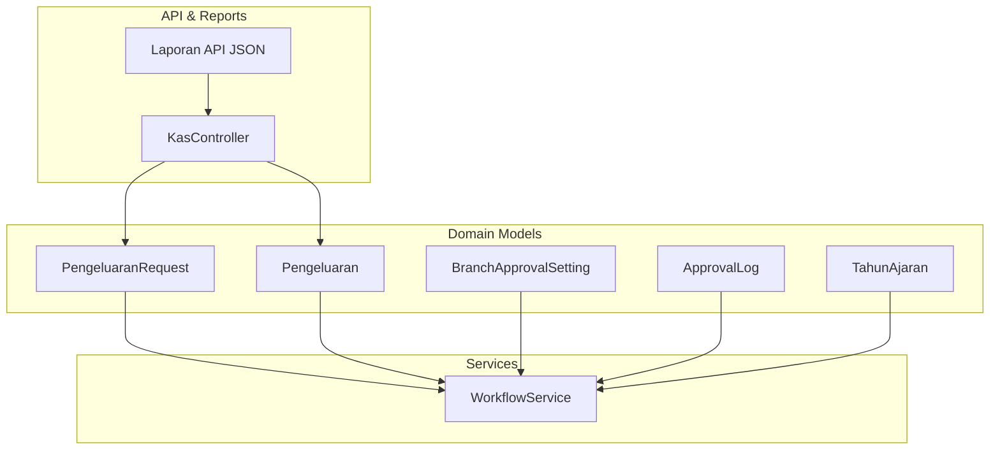
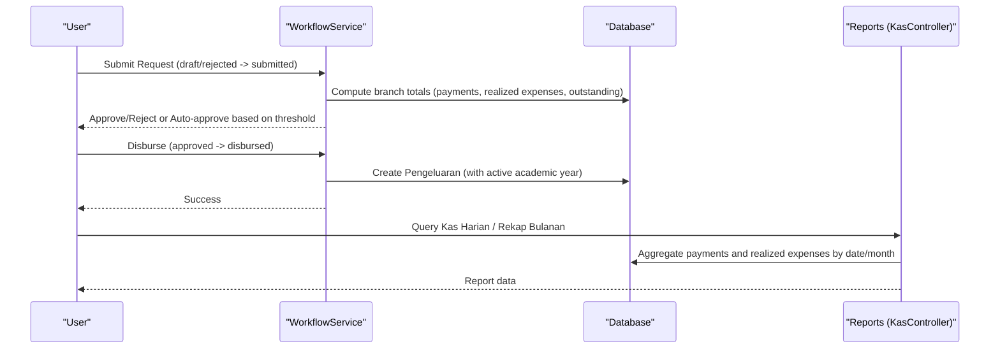
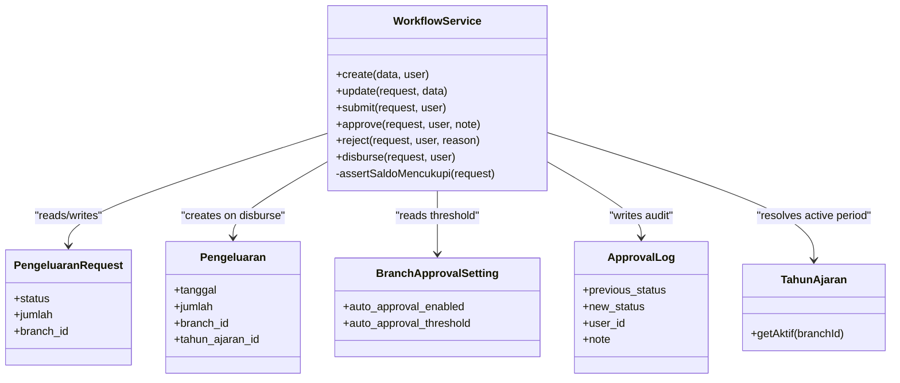
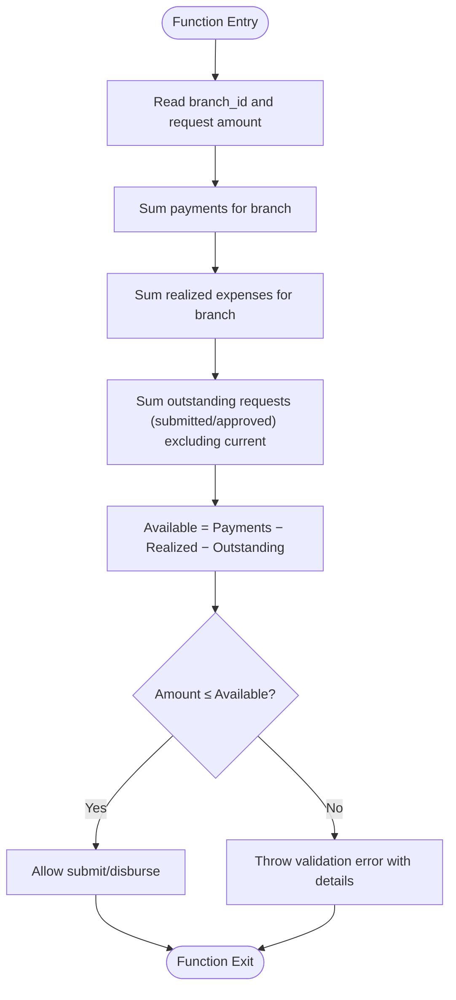
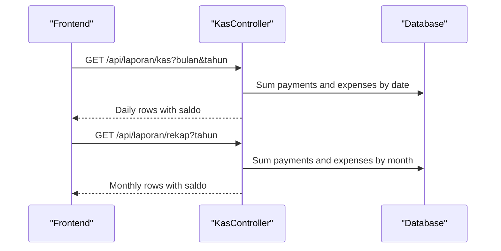
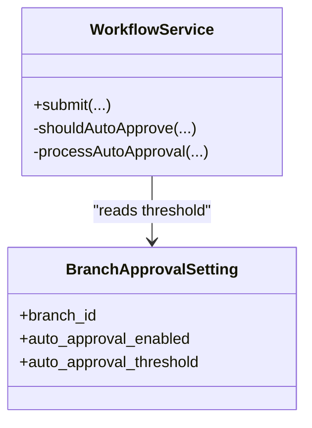
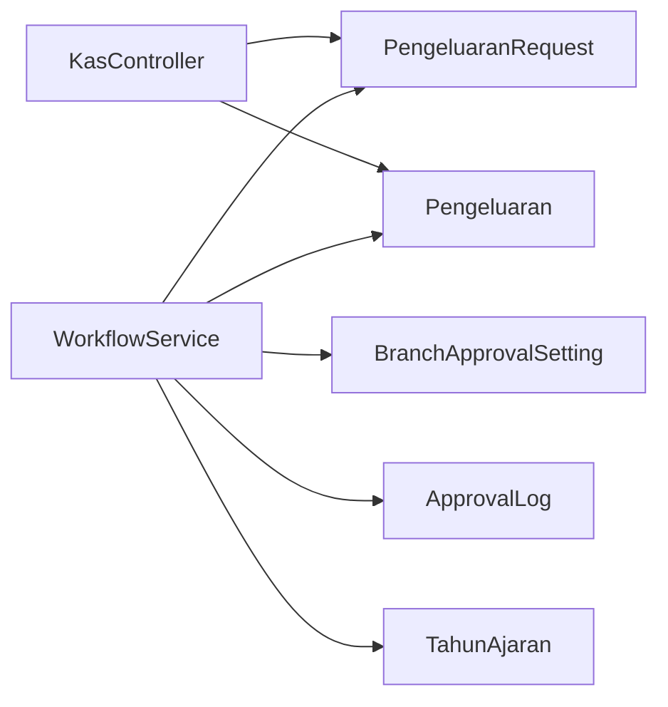

# Budget Controls

<cite>
**Referenced Files in This Document**
- [WorkflowService.php](file://backend/app/Services/WorkflowService.php)
- [PengeluaranRequest.php](file://backend/app/Models/PengeluaranRequest.php)
- [Pengeluaran.php](file://backend/app/Models/Pengeluaran.php)
- [BranchApprovalSetting.php](file://backend/app/Models/BranchApprovalSetting.php)
- [ApprovalLog.php](file://backend/app/Models/ApprovalLog.php)
- [TahunAjaran.php](file://backend/app/Models/TahunAjaran.php)
- [KasController.php](file://backend/app/Http/Controllers/KasController.php)
- [Laporan API JSON](file://backend/docs/laporan-api.json)
- [Approval Workflow Requirements](file://.kiro/specs/approval-workflow-pengeluaran/requirements.md)
- [Approval Workflow Design](file://.kiro/specs/approval-workflow-pengeluaran/design.md)
</cite>

## Table of Contents
1. [Introduction](#introduction)
2. [Project Structure](#project-structure)
3. [Core Components](#core-components)
4. [Architecture Overview](#architecture-overview)
5. [Detailed Component Analysis](#detailed-component-analysis)
6. [Dependency Analysis](#dependency-analysis)
7. [Performance Considerations](#performance-considerations)
8. [Troubleshooting Guide](#troubleshooting-guide)
9. [Conclusion](#conclusion)
10. [Appendices](#appendices)

## Introduction
This document explains the budget control mechanisms implemented for the expense tracking system. It focuses on how budgets are managed per branch and academic year, including allocation concepts, monitoring, constraint enforcement, overspending prevention, and reporting. The system enforces a cash-based budget policy at the branch level: an expense request can be submitted or disbursed only if the branch’s available balance (total payments minus realized expenses and outstanding requests) is sufficient. Academic year scoping ensures that finalized expenses are recorded against the active period for accurate financial reporting.

Key capabilities covered:
- Branch-scoped budget checks before submitting or disbursing expenses
- Academic year linkage to finalized expenses
- Approval workflow with audit trail and notifications
- Kas (cash) daily and monthly reports reflecting actual balances
- Auto-approval thresholds configurable per branch

[No sources needed since this section provides general guidance]

## Project Structure
The budget controls span models, services, controllers, and documentation specs:
- Models define entities for requests, approvals, settings, and periods
- Services implement business logic and constraints
- Controllers expose APIs and reports
- Specs define requirements and design decisions



**Diagram sources**
- [WorkflowService.php](file://backend/app/Services/WorkflowService.php)
- [PengeluaranRequest.php](file://backend/app/Models/PengeluaranRequest.php)
- [Pengeluaran.php](file://backend/app/Models/Pengeluaran.php)
- [BranchApprovalSetting.php](file://backend/app/Models/BranchApprovalSetting.php)
- [ApprovalLog.php](file://backend/app/Models/ApprovalLog.php)
- [TahunAjaran.php](file://backend/app/Models/TahunAjaran.php)
- [KasController.php](file://backend/app/Http/Controllers/KasController.php)
- [Laporan API JSON](file://backend/docs/laporan-api.json)

**Section sources**
- [WorkflowService.php](file://backend/app/Services/WorkflowService.php)
- [PengeluaranRequest.php](file://backend/app/Models/PengeluaranRequest.php)
- [Pengeluaran.php](file://backend/app/Models/Pengeluaran.php)
- [BranchApprovalSetting.php](file://backend/app/Models/BranchApprovalSetting.php)
- [ApprovalLog.php](file://backend/app/Models/ApprovalLog.php)
- [TahunAjaran.php](file://backend/app/Models/TahunAjaran.php)
- [KasController.php](file://backend/app/Http/Controllers/KasController.php)
- [Laporan API JSON](file://backend/docs/laporan-api.json)

## Core Components
- PengeluaranRequest: Represents an expense request with status transitions and branch isolation.
- Pengeluaran: Finalized expense record linked to a branch and optionally to an academic year.
- BranchApprovalSetting: Per-branch auto-approval configuration (threshold and enable flag).
- ApprovalLog: Immutable audit trail for each status change.
- TahunAjaran: Active academic year used when recording final expenses.
- WorkflowService: Orchestrates state transitions, budget checks, notifications, and creation of final expenses.
- KasController: Provides kas harian and rekap bulanan reports based on realized transactions.

Budget control highlights:
- Constraint enforcement occurs during submit and disburse via assertSaldoMencukupi.
- Available balance = total branch payments − total realized expenses − outstanding requests.
- Finalized expenses are tied to the active academic year for reporting accuracy.

**Section sources**
- [WorkflowService.php](file://backend/app/Services/WorkflowService.php)
- [PengeluaranRequest.php](file://backend/app/Models/PengeluaranRequest.php)
- [Pengeluaran.php](file://backend/app/Models/Pengeluaran.php)
- [BranchApprovalSetting.php](file://backend/app/Models/BranchApprovalSetting.php)
- [ApprovalLog.php](file://backend/app/Models/ApprovalLog.php)
- [TahunAjaran.php](file://backend/app/Models/TahunAjaran.php)
- [KasController.php](file://backend/app/Http/Controllers/KasController.php)

## Architecture Overview
The budget control architecture integrates approval workflows with real-time balance checks and period-aware reporting.



**Diagram sources**
- [WorkflowService.php](file://backend/app/Services/WorkflowService.php)
- [KasController.php](file://backend/app/Http/Controllers/KasController.php)

**Section sources**
- [WorkflowService.php](file://backend/app/Services/WorkflowService.php)
- [KasController.php](file://backend/app/Http/Controllers/KasController.php)

## Detailed Component Analysis

### WorkflowService: Budget Enforcement and State Transitions
WorkflowService centralizes all budget-related logic:
- Submit: Validates preconditions, performs budget check, transitions to submitted, logs audit, triggers auto-approval or notifies approvers.
- Approve/Reject: Enforces valid transitions, records audit log, notifies requester.
- Disburse: Performs another budget check, creates a finalized Pengeluaran record tied to the active academic year, updates status to disbursed, logs audit, and notifies requester.
- assertSaldoMencukupi: Computes available balance per branch and prevents overspending.



**Diagram sources**
- [WorkflowService.php](file://backend/app/Services/WorkflowService.php)
- [PengeluaranRequest.php](file://backend/app/Models/PengeluaranRequest.php)
- [Pengeluaran.php](file://backend/app/Models/Pengeluaran.php)
- [BranchApprovalSetting.php](file://backend/app/Models/BranchApprovalSetting.php)
- [ApprovalLog.php](file://backend/app/Models/ApprovalLog.php)
- [TahunAjaran.php](file://backend/app/Models/TahunAjaran.php)

**Section sources**
- [WorkflowService.php](file://backend/app/Services/WorkflowService.php)
- [PengeluaranRequest.php](file://backend/app/Models/PengeluaranRequest.php)
- [Pengeluaran.php](file://backend/app/Models/Pengeluaran.php)
- [BranchApprovalSetting.php](file://backend/app/Models/BranchApprovalSetting.php)
- [ApprovalLog.php](file://backend/app/Models/ApprovalLog.php)
- [TahunAjaran.php](file://backend/app/Models/TahunAjaran.php)

### Budget Constraint Algorithm: Overspending Prevention
The core budget check computes available balance and blocks actions that would cause negative balance.



**Diagram sources**
- [WorkflowService.php](file://backend/app/Services/WorkflowService.php)

**Section sources**
- [WorkflowService.php](file://backend/app/Services/WorkflowService.php)

### Academic Year Integration for Expense Recording
Finalized expenses are recorded with the active academic year for the branch, ensuring period-aligned reporting.

```mermaid
sequenceDiagram
participant WS as "WorkflowService"
participant TA as "TahunAjaran"
participant DB as "Database"
WS->>TA : getAktif(branch_id)
TA-->>WS : Active period (or null)
WS->>DB : Create Pengeluaran with tahun_ajaran_id
Note over WS,DB : Disbursement date becomes tanggal; period aligns to active year
```

**Diagram sources**
- [WorkflowService.php](file://backend/app/Services/WorkflowService.php)
- [TahunAjaran.php](file://backend/app/Models/TahunAjaran.php)

**Section sources**
- [WorkflowService.php](file://backend/app/Services/WorkflowService.php)
- [TahunAjaran.php](file://backend/app/Models/TahunAjaran.php)

### Reporting: Kas Harian and Rekap Bulanan
Reports aggregate realized transactions (pembayaran and pengeluarans) per branch to show running balances.

- Kas Harian: Daily totals and running balance up to each date within a month.
- Rekap Bulanan: Monthly totals and running balance up to the end of each month within a year.



**Diagram sources**
- [KasController.php](file://backend/app/Http/Controllers/KasController.php)
- [Laporan API JSON](file://backend/docs/laporan-api.json)

**Section sources**
- [KasController.php](file://backend/app/Http/Controllers/KasController.php)
- [Laporan API JSON](file://backend/docs/laporan-api.json)

### Approval Settings and Auto-Approval Threshold
Per-branch auto-approval settings allow small expenses to bypass manual review.



**Diagram sources**
- [BranchApprovalSetting.php](file://backend/app/Models/BranchApprovalSetting.php)
- [WorkflowService.php](file://backend/app/Services/WorkflowService.php)

**Section sources**
- [BranchApprovalSetting.php](file://backend/app/Models/BranchApprovalSetting.php)
- [WorkflowService.php](file://backend/app/Services/WorkflowService.php)

## Dependency Analysis
Budget controls depend on several components:
- WorkflowService depends on models for requests, expenses, approvals, settings, and periods.
- KasController depends on payment and expense models to compute balances.
- Specifications define constraints and behaviors that guide implementation.



**Diagram sources**
- [WorkflowService.php](file://backend/app/Services/WorkflowService.php)
- [KasController.php](file://backend/app/Http/Controllers/KasController.php)
- [PengeluaranRequest.php](file://backend/app/Models/PengeluaranRequest.php)
- [Pengeluaran.php](file://backend/app/Models/Pengeluaran.php)
- [BranchApprovalSetting.php](file://backend/app/Models/BranchApprovalSetting.php)
- [ApprovalLog.php](file://backend/app/Models/ApprovalLog.php)
- [TahunAjaran.php](file://backend/app/Models/TahunAjaran.php)

**Section sources**
- [WorkflowService.php](file://backend/app/Services/WorkflowService.php)
- [KasController.php](file://backend/app/Http/Controllers/KasController.php)
- [PengeluaranRequest.php](file://backend/app/Models/PengeluaranRequest.php)
- [Pengeluaran.php](file://backend/app/Models/Pengeluaran.php)
- [BranchApprovalSetting.php](file://backend/app/Models/BranchApprovalSetting.php)
- [ApprovalLog.php](file://backend/app/Models/ApprovalLog.php)
- [TahunAjaran.php](file://backend/app/Models/TahunAjaran.php)

## Performance Considerations
- Balance computation aggregates across multiple tables; ensure appropriate indexes on branch_id, tanggal, and status fields to speed up queries.
- Running balance calculations in reports perform cumulative sums; consider caching or materialized views for large datasets.
- Transactional operations around submit/disburse prevent race conditions but may increase lock contention under high concurrency; monitor database performance.

[No sources needed since this section provides general guidance]

## Troubleshooting Guide
Common issues and resolutions:
- Overspending errors: Occur when available balance is insufficient. Review branch payments, realized expenses, and outstanding requests.
- Invalid state transitions: Ensure requests are in correct statuses before approve/reject/disburse actions.
- Missing academic year linkage: Verify active academic year exists for the branch; otherwise, finalize expenses without period association.
- Report discrepancies: Confirm that only finalized expenses (pengeluarans) are included in kas reports and that dates match disbursement dates.

**Section sources**
- [WorkflowService.php](file://backend/app/Services/WorkflowService.php)
- [KasController.php](file://backend/app/Http/Controllers/KasController.php)

## Conclusion
The system implements robust budget controls centered on branch-level cash availability and academic year alignment. By enforcing balance checks at submission and disbursement, maintaining an immutable audit trail, and providing clear kas reports, it prevents overspending and supports accurate financial oversight. Auto-approval thresholds streamline low-risk expenses while preserving governance.

[No sources needed since this section summarizes without analyzing specific files]

## Appendices

### Examples: Setting Up Budget Controls
- Configure per-branch auto-approval threshold using BranchApprovalSetting.
- Ensure an active academic year exists for the branch to link finalized expenses.
- Use the approval workflow endpoints to create, submit, approve, reject, and disburse requests.

**Section sources**
- [BranchApprovalSetting.php](file://backend/app/Models/BranchApprovalSetting.php)
- [TahunAjaran.php](file://backend/app/Models/TahunAjaran.php)
- [WorkflowService.php](file://backend/app/Services/WorkflowService.php)

### Examples: Monitoring Budget Utilization
- Query kas harian to see daily inflows/outflows and running balance.
- Query rekap bulanan to observe monthly trends and cumulative balances.
- Inspect outstanding requests to anticipate future balance impacts.

**Section sources**
- [KasController.php](file://backend/app/Http/Controllers/KasController.php)
- [Laporan API JSON](file://backend/docs/laporan-api.json)
- [WorkflowService.php](file://backend/app/Services/WorkflowService.php)

### Examples: Generating Budget Reports
- Use kas harian endpoint with bulan and tahun parameters.
- Use rekap bulanan endpoint with tahun parameter.
- Validate responses and handle empty datasets gracefully.

**Section sources**
- [KasController.php](file://backend/app/Http/Controllers/KasController.php)
- [Laporan API JSON](file://backend/docs/laporan-api.json)

### Policy Notes: Adjustments, Carry-Over, and Integrations
- Budget adjustments: Modify branch payments or realize additional income to increase available balance; adjust outstanding requests by resubmitting or rejecting.
- Carry-over policies: Not explicitly enforced by code; rely on academic year scoping and report analysis to plan carry-over strategies.
- Integration with financial planning tools: Export kas reports and reconcile with external systems using the provided API endpoints.

**Section sources**
- [WorkflowService.php](file://backend/app/Services/WorkflowService.php)
- [KasController.php](file://backend/app/Http/Controllers/KasController.php)
- [Approval Workflow Requirements](file://.kiro/specs/approval-workflow-pengeluaran/requirements.md)
- [Approval Workflow Design](file://.kiro/specs/approval-workflow-pengeluaran/design.md)