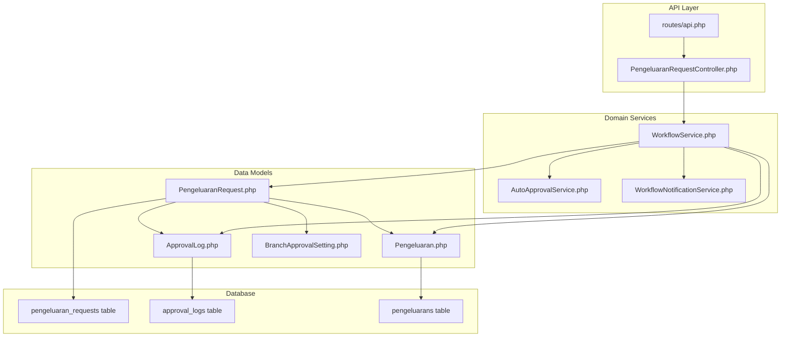
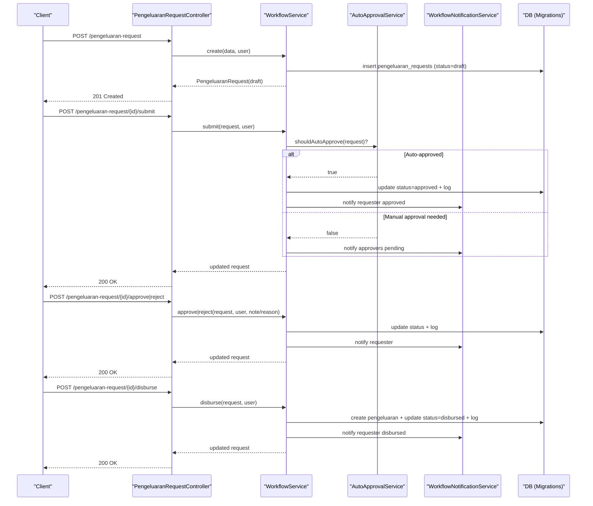
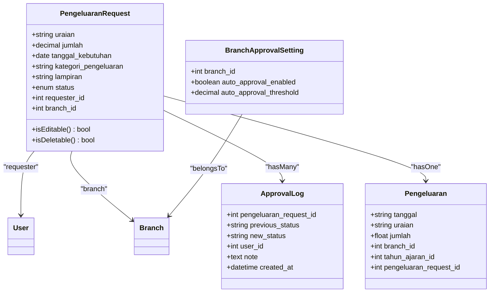
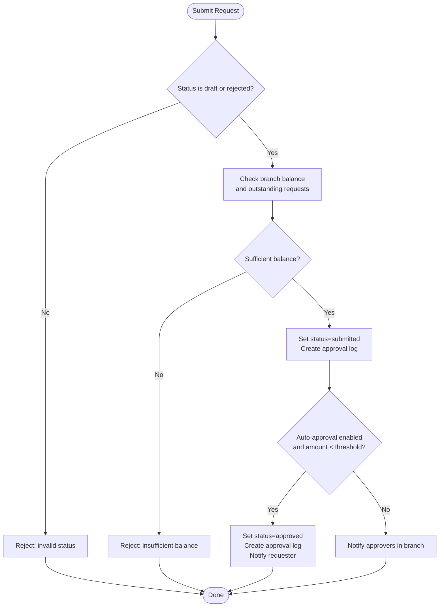
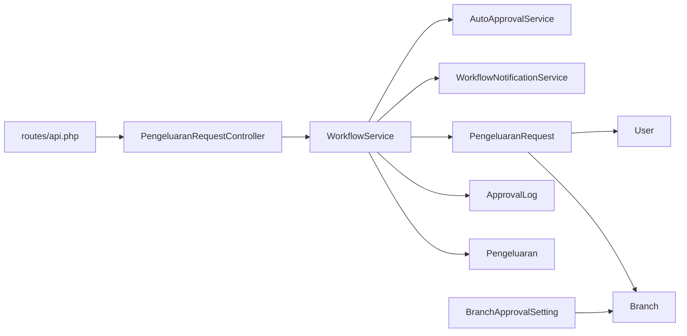

# Expense Requests

<cite>
**Referenced Files in This Document**
- [PengeluaranRequest.php](file://backend/app/Models/PengeluaranRequest.php)
- [ApprovalLog.php](file://backend/app/Models/ApprovalLog.php)
- [Pengeluaran.php](file://backend/app/Models/Pengeluaran.php)
- [BranchApprovalSetting.php](file://backend/app/Models/BranchApprovalSetting.php)
- [WorkflowService.php](file://backend/app/Services/WorkflowService.php)
- [AutoApprovalService.php](file://backend/app/Services/AutoApprovalService.php)
- [WorkflowNotificationService.php](file://backend/app/Services/WorkflowNotificationService.php)
- [PengeluaranRequestController.php](file://backend/app/Http/Controllers/PengeluaranRequestController.php)
- [api.php](file://backend/routes/api.php)
- [2026_05_26_220000_create_pengeluaran_requests_table.php](file://backend/database/migrations/2026_05_26_220000_create_pengeluaran_requests_table.php)
- [2026_05_26_220001_create_approval_logs_table.php](file://backend/database/migrations/2026_05_26_220001_create_approval_logs_table.php)
- [2026_05_26_220004_add_pengeluaran_request_id_to_pengeluarans_table.php](file://backend/database/migrations/2026_05_26_220004_add_pengeluaran_request_id_to_pengeluarans_table.php)
</cite>

## Table of Contents
1. Introduction
2. Project Structure
3. Core Components
4. Architecture Overview
5. Detailed Component Analysis
6. Dependency Analysis
7. Performance Considerations
8. Troubleshooting Guide
9. Conclusion

## Introduction
This document explains the expense request system (PengeluaranRequest). It covers the data model, request submission workflow, validation rules, relationships with users and branches, permissions, branch-level isolation, and integration with the approval workflow including auto-approval and disbursement into actual expenses.

## Project Structure
The expense request feature spans models, services, controller, routes, and database migrations:
- Model layer defines the request entity, approval logs, and linkage to actual expenses and settings.
- Services encapsulate workflow logic: creation, update, submit, approve, reject, disburse, notifications, and auto-approval.
- Controller exposes REST endpoints with permission checks and branch scoping.
- Routes register API endpoints under a dedicated prefix.
- Migrations define the schema for requests, logs, and linking to existing expense records.

**Diagram sources**
- [api.php:264-281](file://backend/routes/api.php#L264-L281)
- [PengeluaranRequestController.php:1-212](file://backend/app/Http/Controllers/PengeluaranRequestController.php#L1-L212)
- [WorkflowService.php:1-222](file://backend/app/Services/WorkflowService.php#L1-L222)
- [AutoApprovalService.php:1-44](file://backend/app/Services/AutoApprovalService.php#L1-L44)
- [WorkflowNotificationService.php:1-66](file://backend/app/Services/WorkflowNotificationService.php#L1-L66)
- [PengeluaranRequest.php:1-63](file://backend/app/Models/PengeluaranRequest.php#L1-L63)
- [ApprovalLog.php:1-37](file://backend/app/Models/ApprovalLog.php#L1-L37)
- [Pengeluaran.php:1-81](file://backend/app/Models/Pengeluaran.php#L1-L81)
- [BranchApprovalSetting.php:1-29](file://backend/app/Models/BranchApprovalSetting.php#L1-L29)
- [2026_05_26_220000_create_pengeluaran_requests_table.php:1-33](file://backend/database/migrations/2026_05_26_220000_create_pengeluaran_requests_table.php#L1-L33)
- [2026_05_26_220001_create_approval_logs_table.php:1-29](file://backend/database/migrations/2026_05_26_220001_create_approval_logs_table.php#L1-L29)
- [2026_05_26_220004_add_pengeluaran_request_id_to_pengeluarans_table.php:1-28](file://backend/database/migrations/2026_05_26_220004_add_pengeluaran_request_id_to_pengeluarans_table.php#L1-L28)

**Section sources**
- [api.php:264-281](file://backend/routes/api.php#L264-L281)
- [PengeluaranRequestController.php:1-212](file://backend/app/Http/Controllers/PengeluaranRequestController.php#L1-L212)
- [WorkflowService.php:1-222](file://backend/app/Services/WorkflowService.php#L1-L222)
- [AutoApprovalService.php:1-44](file://backend/app/Services/AutoApprovalService.php#L1-L44)
- [WorkflowNotificationService.php:1-66](file://backend/app/Services/WorkflowNotificationService.php#L1-L66)
- [PengeluaranRequest.php:1-63](file://backend/app/Models/PengeluaranRequest.php#L1-L63)
- [ApprovalLog.php:1-37](file://backend/app/Models/ApprovalLog.php#L1-L37)
- [Pengeluaran.php:1-81](file://backend/app/Models/Pengeluaran.php#L1-L81)
- [BranchApprovalSetting.php:1-29](file://backend/app/Models/BranchApprovalSetting.php#L1-L29)
- [2026_05_26_220000_create_pengeluaran_requests_table.php:1-33](file://backend/database/migrations/2026_05_26_220000_create_pengeluaran_requests_table.php#L1-L33)
- [2026_05_26_220001_create_approval_logs_table.php:1-29](file://backend/database/migrations/2026_05_26_220001_create_approval_logs_table.php#L1-L29)
- [2026_05_26_220004_add_pengeluaran_request_id_to_pengeluarans_table.php:1-28](file://backend/database/migrations/2026_05_26_220004_add_pengeluaran_request_id_to_pengeluarans_table.php#L1-L28)

## Core Components
- PengeluaranRequest model
  - Fields: description (uraian), amount (jumlah), need date (tanggal_kebutuhan), optional category (kategori_pengeluaran), optional attachment (lampiran), status enum, requester_id, branch_id.
  - Statuses: draft, submitted, approved, rejected, disbursed.
  - Relationships: belongsTo User (requester), belongsTo Branch, hasMany ApprovalLog, hasOne Pengeluaran.
  - Helpers: isEditable() allows editing when draft or rejected; isDeletable() allows deletion only when draft.
- ApprovalLog model
  - Tracks previous_status, new_status, user_id, note, created_at.
- Pengeluaran model
  - Represents realized expense; linked back to its originating request via pengeluaran_request_id.
- BranchApprovalSetting model
  - Controls auto-approval per branch: enabled flag and threshold amount.

Key behaviors:
- Creation sets status to draft and binds to current user’s branch.
- Submit transitions to submitted, optionally auto-approves if below threshold, otherwise notifies approvers.
- Approve/reject transitions from submitted with audit logging and notifications.
- Disburse creates an actual expense record and transitions to disbursed.

**Section sources**
- [PengeluaranRequest.php:1-63](file://backend/app/Models/PengeluaranRequest.php#L1-L63)
- [ApprovalLog.php:1-37](file://backend/app/Models/ApprovalLog.php#L1-L37)
- [Pengeluaran.php:1-81](file://backend/app/Models/Pengeluaran.php#L1-L81)
- [BranchApprovalSetting.php:1-29](file://backend/app/Models/BranchApprovalSetting.php#L1-L29)
- [2026_05_26_220000_create_pengeluaran_requests_table.php:1-33](file://backend/database/migrations/2026_05_26_220000_create_pengeluaran_requests_table.php#L1-L33)
- [2026_05_26_220001_create_approval_logs_table.php:1-29](file://backend/database/migrations/2026_05_26_220001_create_approval_logs_table.php#L1-L29)
- [2026_05_26_220004_add_pengeluaran_request_id_to_pengeluarans_table.php:1-28](file://backend/database/migrations/2026_05_26_220004_add_pengeluaran_request_id_to_pengeluarans_table.php#L1-L28)

## Architecture Overview
The expense request flow is orchestrated by the controller delegating to WorkflowService, which uses AutoApprovalService and WorkflowNotificationService. Data persists through Eloquent models backed by migrations.

**Diagram sources**
- [api.php:264-281](file://backend/routes/api.php#L264-L281)
- [PengeluaranRequestController.php:82-210](file://backend/app/Http/Controllers/PengeluaranRequestController.php#L82-L210)
- [WorkflowService.php:19-160](file://backend/app/Services/WorkflowService.php#L19-L160)
- [AutoApprovalService.php:12-42](file://backend/app/Services/AutoApprovalService.php#L12-L42)
- [WorkflowNotificationService.php:14-64](file://backend/app/Services/WorkflowNotificationService.php#L14-L64)
- [2026_05_26_220000_create_pengeluaran_requests_table.php:11-25](file://backend/database/migrations/2026_05_26_220000_create_pengeluaran_requests_table.php#L11-L25)
- [2026_05_26_220001_create_approval_logs_table.php:11-21](file://backend/database/migrations/2026_05_26_220001_create_approval_logs_table.php#L11-L21)
- [2026_05_26_220004_add_pengeluaran_request_id_to_pengeluarans_table.php:11-17](file://backend/database/migrations/2026_05_26_220004_add_pengeluaran_request_id_to_pengeluarans_table.php#L11-L17)

## Detailed Component Analysis

### Data Model and Relationships

**Diagram sources**
- [PengeluaranRequest.php:1-63](file://backend/app/Models/PengeluaranRequest.php#L1-L63)
- [ApprovalLog.php:1-37](file://backend/app/Models/ApprovalLog.php#L1-L37)
- [Pengeluaran.php:1-81](file://backend/app/Models/Pengeluaran.php#L1-L81)
- [BranchApprovalSetting.php:1-29](file://backend/app/Models/BranchApprovalSetting.php#L1-L29)
- [2026_05_26_220000_create_pengeluaran_requests_table.php:11-25](file://backend/database/migrations/2026_05_26_220000_create_pengeluaran_requests_table.php#L11-L25)
- [2026_05_26_220001_create_approval_logs_table.php:11-21](file://backend/database/migrations/2026_05_26_220001_create_approval_logs_table.php#L11-L21)
- [2026_05_26_220004_add_pengeluaran_request_id_to_pengeluarans_table.php:11-17](file://backend/database/migrations/2026_05_26_220004_add_pengeluaran_request_id_to_pengeluarans_table.php#L11-L17)

**Section sources**
- [PengeluaranRequest.php:1-63](file://backend/app/Models/PengeluaranRequest.php#L1-L63)
- [ApprovalLog.php:1-37](file://backend/app/Models/ApprovalLog.php#L1-L37)
- [Pengeluaran.php:1-81](file://backend/app/Models/Pengeluaran.php#L1-L81)
- [BranchApprovalSetting.php:1-29](file://backend/app/Models/BranchApprovalSetting.php#L1-L29)
- [2026_05_26_220000_create_pengeluaran_requests_table.php:11-25](file://backend/database/migrations/2026_05_26_220000_create_pengeluaran_requests_table.php#L11-L25)
- [2026_05_26_220001_create_approval_logs_table.php:11-21](file://backend/database/migrations/2026_05_26_220001_create_approval_logs_table.php#L11-L21)
- [2026_05_26_220004_add_pengeluaran_request_id_to_pengeluarans_table.php:11-17](file://backend/database/migrations/2026_05_26_220004_add_pengeluaran_request_id_to_pengeluarans_table.php#L11-L17)

### Request Submission Workflow

**Diagram sources**
- [WorkflowService.php:52-79](file://backend/app/Services/WorkflowService.php#L52-L79)
- [AutoApprovalService.php:12-42](file://backend/app/Services/AutoApprovalService.php#L12-L42)
- [WorkflowNotificationService.php:14-35](file://backend/app/Services/WorkflowNotificationService.php#L14-L35)

**Section sources**
- [WorkflowService.php:52-79](file://backend/app/Services/WorkflowService.php#L52-L79)
- [AutoApprovalService.php:12-42](file://backend/app/Services/AutoApprovalService.php#L12-L42)
- [WorkflowNotificationService.php:14-35](file://backend/app/Services/WorkflowNotificationService.php#L14-L35)

### Approval and Rejection Logic
- Approve: allowed only from submitted; updates status to approved, logs action, notifies requester.
- Reject: allowed only from submitted; requires reason; updates status to rejected, logs action, notifies requester.

**Section sources**
- [WorkflowService.php:81-123](file://backend/app/Services/WorkflowService.php#L81-L123)

### Disbursement and Integration with Expenses
- Disburse: allowed only from approved; validates sufficient balance; resolves active academic year; creates Pengeluaran record linked to the request; updates status to disbursed; logs action; notifies requester.

**Section sources**
- [WorkflowService.php:125-160](file://backend/app/Services/WorkflowService.php#L125-L160)
- [Pengeluaran.php:14-48](file://backend/app/Models/Pengeluaran.php#L14-L48)
- [2026_05_26_220004_add_pengeluaran_request_id_to_pengeluarans_table.php:11-17](file://backend/database/migrations/2026_05_26_220004_add_pengeluaran_request_id_to_pengeluarans_table.php#L11-L17)

### Validation Rules
- Store (create):
  - uraian: required string, max length
  - jumlah: required numeric, minimum value
  - tanggal_kebutuhan: required date
  - kategori_pengeluaran: optional string
  - lampiran: optional file, size and MIME constraints
- Update:
  - same fields but marked sometimes (optional)
- Reject:
  - reason: required string, max length

**Section sources**
- [PengeluaranRequestController.php:82-99](file://backend/app/Http/Controllers/PengeluaranRequestController.php#L82-L99)
- [PengeluaranRequestController.php:101-128](file://backend/app/Http/Controllers/PengeluaranRequestController.php#L101-L128)
- [PengeluaranRequestController.php:179-192](file://backend/app/Http/Controllers/PengeluaranRequestController.php#L179-L192)

### Permissions and Access Control
- Create/update/submit/delete require create-pengeluaran-request permission.
- Approve/reject require approve-pengeluaran permission.
- Disburse requires disburse-pengeluaran permission.
- All endpoints are within auth:sanctum group.

**Section sources**
- [api.php:264-281](file://backend/routes/api.php#L264-L281)

### Branch-Level Isolation
- Listing filters by requester’s branch_id; draft requests visible only to their requester.
- Show/update/destroy/submit/approve/reject/disburse enforce branch_id match on the target request.
- Auto-approval thresholds and approver discovery are scoped to the same branch.

**Section sources**
- [PengeluaranRequestController.php:21-80](file://backend/app/Http/Controllers/PengeluaranRequestController.php#L21-L80)
- [PengeluaranRequestController.php:101-210](file://backend/app/Http/Controllers/PengeluaranRequestController.php#L101-L210)
- [WorkflowNotificationService.php:14-35](file://backend/app/Services/WorkflowNotificationService.php#L14-L35)
- [AutoApprovalService.php:12-23](file://backend/app/Services/AutoApprovalService.php#L12-L23)

### Example Workflows

- Creating an expense request
  - Endpoint: POST /pengeluaran-request
  - Required payload includes description, amount, need date; optional category and attachment.
  - Result: request created with status draft, bound to requester and branch.

- Handling different request types
  - The model supports an optional category field; business logic does not differentiate behavior by category at this time.

- Managing lifecycle states
  - Draft → Submitted (submit)
  - Submitted → Approved (approve) or Rejected (reject)
  - Approved → Disbursed (disburse)
  - Rejected → can be edited and resubmitted

- Auto-approval example
  - If branch auto-approval is enabled and amount is below threshold, submit automatically approves and notifies requester.

- Disbursement example
  - From approved state, disburse creates a Pengeluaran record and marks the request disbursed.

[No sources needed since this section provides usage examples without analyzing specific files]

## Dependency Analysis

**Diagram sources**
- [api.php:264-281](file://backend/routes/api.php#L264-L281)
- [PengeluaranRequestController.php:1-212](file://backend/app/Http/Controllers/PengeluaranRequestController.php#L1-L212)
- [WorkflowService.php:1-222](file://backend/app/Services/WorkflowService.php#L1-L222)
- [AutoApprovalService.php:1-44](file://backend/app/Services/AutoApprovalService.php#L1-L44)
- [WorkflowNotificationService.php:1-66](file://backend/app/Services/WorkflowNotificationService.php#L1-L66)
- [PengeluaranRequest.php:1-63](file://backend/app/Models/PengeluaranRequest.php#L1-L63)
- [ApprovalLog.php:1-37](file://backend/app/Models/ApprovalLog.php#L1-L37)
- [Pengeluaran.php:1-81](file://backend/app/Models/Pengeluaran.php#L1-L81)
- [BranchApprovalSetting.php:1-29](file://backend/app/Models/BranchApprovalSetting.php#L1-L29)

**Section sources**
- [api.php:264-281](file://backend/routes/api.php#L264-L281)
- [PengeluaranRequestController.php:1-212](file://backend/app/Http/Controllers/PengeluaranRequestController.php#L1-L212)
- [WorkflowService.php:1-222](file://backend/app/Services/WorkflowService.php#L1-L222)
- [AutoApprovalService.php:1-44](file://backend/app/Services/AutoApprovalService.php#L1-L44)
- [WorkflowNotificationService.php:1-66](file://backend/app/Services/WorkflowNotificationService.php#L1-L66)
- [PengeluaranRequest.php:1-63](file://backend/app/Models/PengeluaranRequest.php#L1-L63)
- [ApprovalLog.php:1-37](file://backend/app/Models/ApprovalLog.php#L1-L37)
- [Pengeluaran.php:1-81](file://backend/app/Models/Pengeluaran.php#L1-L81)
- [BranchApprovalSetting.php:1-29](file://backend/app/Models/BranchApprovalSetting.php#L1-L29)

## Performance Considerations
- Balance checks aggregate payments and outstanding requests; consider indexing and caching strategies for high-volume branches.
- Paginated listing with sorting and filtering reduces payload size.
- Use transactions around submit/approve/reject/disburse to ensure consistency and prevent race conditions during balance checks.

[No sources needed since this section provides general guidance]

## Troubleshooting Guide
Common issues and resolutions:
- Insufficient balance on submit or disburse
  - Cause: total incoming payments minus realized expenses and outstanding requests is less than requested amount.
  - Resolution: reduce amount, wait for additional payments, or adjust outstanding requests.
- Invalid status transition
  - Cause: attempting submit/approve/reject/disburse from wrong status.
  - Resolution: follow lifecycle: draft→submitted→approved→disbursed; rejected can be edited and resubmitted.
- Permission denied
  - Cause: missing required permission for endpoint.
  - Resolution: assign appropriate permission (create, approve, disburse).
- Branch mismatch
  - Cause: accessing a request outside your branch.
  - Resolution: ensure you operate within your branch context.
- Missing rejection reason
  - Cause: rejecting without providing a reason.
  - Resolution: include a non-empty reason string.

**Section sources**
- [WorkflowService.php:186-220](file://backend/app/Services/WorkflowService.php#L186-L220)
- [WorkflowService.php:52-123](file://backend/app/Services/WorkflowService.php#L52-L123)
- [PengeluaranRequestController.php:179-192](file://backend/app/Http/Controllers/PengeluaranRequestController.php#L179-L192)
- [api.php:264-281](file://backend/routes/api.php#L264-L281)

## Conclusion
The expense request system provides a robust, branch-scoped workflow with clear state transitions, audit trails, and optional auto-approval based on configurable thresholds. It integrates seamlessly with the existing expense ledger by creating Pengeluaran records upon disbursement, while enforcing permissions and protecting against overdrawn balances.