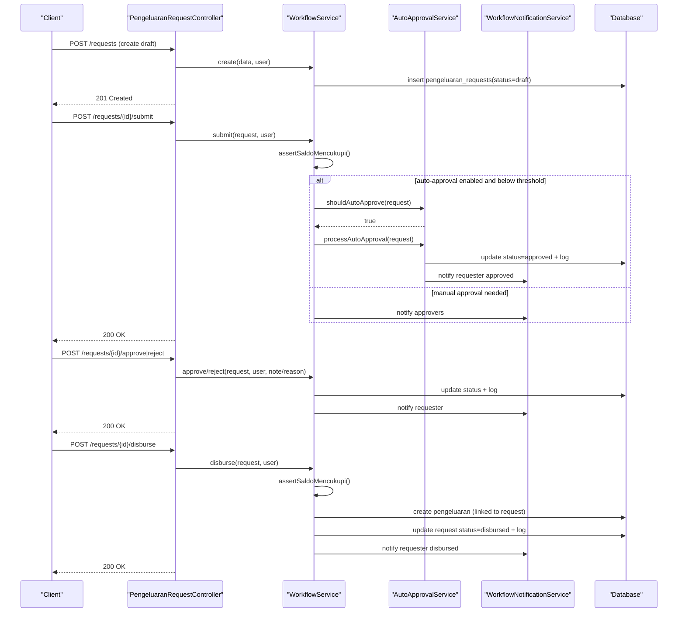
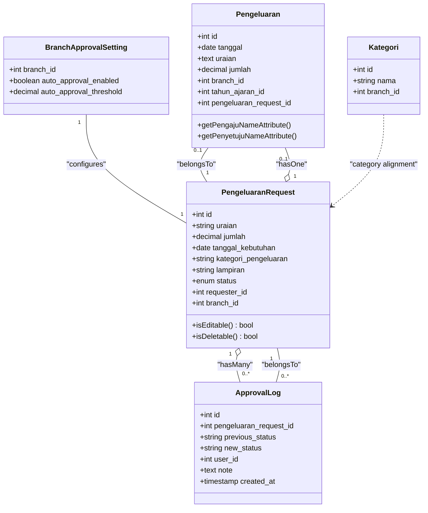
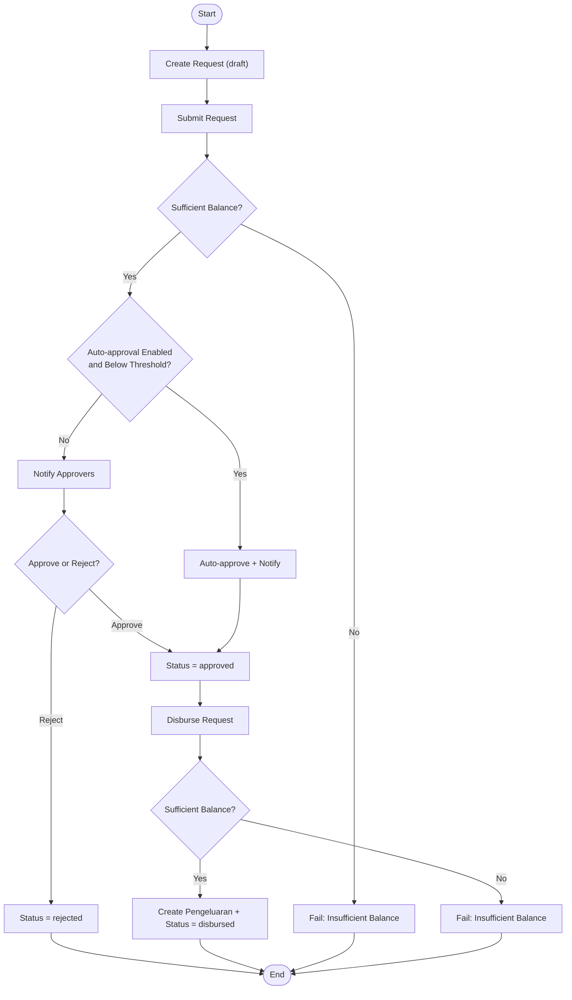
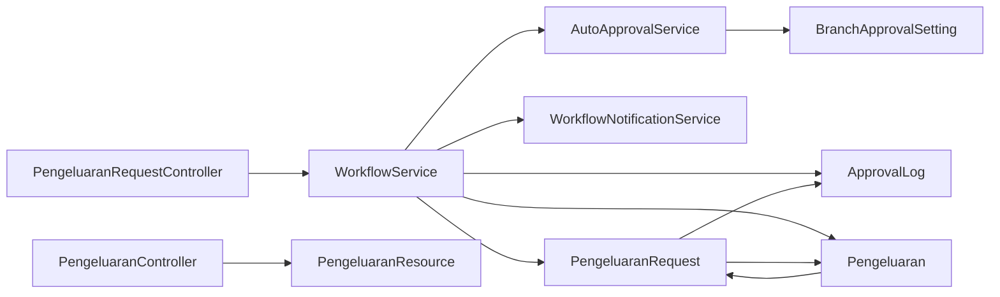

# Expense Tracking (Pengeluaran)

<cite>
**Referenced Files in This Document**
- [Pengeluaran.php](file://backend/app/Models/Pengeluaran.php)
- [PengeluaranRequest.php](file://backend/app/Models/PengeluaranRequest.php)
- [ApprovalLog.php](file://backend/app/Models/ApprovalLog.php)
- [BranchApprovalSetting.php](file://backend/app/Models/BranchApprovalSetting.php)
- [Kategori.php](file://backend/app/Models/Kategori.php)
- [PengeluaranController.php](file://backend/app/Http/Controllers/PengeluaranController.php)
- [PengeluaranRequestController.php](file://backend/app/Http/Controllers/PengeluaranRequestController.php)
- [WorkflowService.php](file://backend/app/Services/WorkflowService.php)
- [AutoApprovalService.php](file://backend/app/Services/AutoApprovalService.php)
- [WorkflowNotificationService.php](file://backend/app/Services/WorkflowNotificationService.php)
- [2025_11_19_155333_create_pengeluarans_table.php](file://backend/database/migrations/2025_11_19_155333_create_pengeluarans_table.php)
- [2026_05_26_220000_create_pengeluaran_requests_table.php](file://backend/database/migrations/2026_05_26_220000_create_pengeluaran_requests_table.php)
- [2026_05_26_220001_create_approval_logs_table.php](file://backend/database/migrations/2026_05_26_220001_create_approval_logs_table.php)
- [2026_05_26_220004_add_pengeluaran_request_id_to_pengeluarans_table.php](file://backend/database/migrations/2026_05_26_220004_add_pengeluaran_request_id_to_pengeluarans_table.php)
- [PengeluaranResource.php](file://backend/app/Http/Resources/PengeluaranResource.php)
</cite>

## Table of Contents
1. Introduction
2. Project Structure
3. Core Components
4. Architecture Overview
5. Detailed Component Analysis
6. Dependency Analysis
7. Performance Considerations
8. Troubleshooting Guide
9. Conclusion

## Introduction
This document explains the expense tracking system centered on the Pengeluaran model and its request-driven approval workflow. It covers:
- The Pengeluaran data model, including categories, amounts, branch and academic year scoping, and linkage to requests.
- Multi-level authorization via pengeluaran_requests and approval_logs.
- The end-to-end lifecycle from submission through approval to final recording as an expense.
- Budget constraints enforced at submit and disburse steps.
- Audit requirements for financial accountability.
- Integration points with reporting and categorization.

## Project Structure
The expense domain spans models, controllers, services, resources, and database migrations:
- Models define entities and relationships.
- Controllers expose API endpoints for listing, creating, updating, deleting expenses and managing requests.
- Services encapsulate workflow logic, budget checks, auto-approval, and notifications.
- Resources normalize responses for clients.
- Migrations define schema evolution for expenses, requests, and approvals.

```mermaid
graph TB
subgraph "API Layer"
PC["PengeluaranController"]
PRc["PengeluaranRequestController"]
end
subgraph "Domain Models"
P["Pengeluaran"]
PR["PengeluaranRequest"]
AL["ApprovalLog"]
BAS["BranchApprovalSetting"]
K["Kategori"]
end
subgraph "Services"
WS["WorkflowService"]
AAS["AutoApprovalService"]
WNS["WorkflowNotificationService"]
end
subgraph "Resources"
PRs["PengeluaranResource"]
end
subgraph "Database"
M1["pengeluarans"]
M2["pengeluaran_requests"]
M3["approval_logs"]
end
PC --> PRs
PRc --> WS
WS --> AAS
WS --> WNS
WS --> PR
WS --> AL
WS --> P
AAS --> BAS
P --> PR
PR --> AL
PR --> P
PR --> K
M1 < --> P
M2 < --> PR
M3 < --> AL
```

**Diagram sources**
- [PengeluaranController.php:1-156](file://backend/app/Http/Controllers/PengeluaranController.php#L1-L156)
- [PengeluaranRequestController.php:1-212](file://backend/app/Http/Controllers/PengeluaranRequestController.php#L1-L212)
- [WorkflowService.php:1-222](file://backend/app/Services/WorkflowService.php#L1-L222)
- [AutoApprovalService.php:1-44](file://backend/app/Services/AutoApprovalService.php#L1-L44)
- [WorkflowNotificationService.php:1-66](file://backend/app/Services/WorkflowNotificationService.php#L1-L66)
- [Pengeluaran.php:1-81](file://backend/app/Models/Pengeluaran.php#L1-L81)
- [PengeluaranRequest.php:1-63](file://backend/app/Models/PengeluaranRequest.php#L1-L63)
- [ApprovalLog.php:1-37](file://backend/app/Models/ApprovalLog.php#L1-L37)
- [BranchApprovalSetting.php:1-29](file://backend/app/Models/BranchApprovalSetting.php#L1-L29)
- [Kategori.php:1-34](file://backend/app/Models/Kategori.php#L1-L34)
- [PengeluaranResource.php:1-32](file://backend/app/Http/Resources/PengeluaranResource.php#L1-L32)
- [2025_11_19_155333_create_pengeluarans_table.php:1-31](file://backend/database/migrations/2025_11_19_155333_create_pengeluarans_table.php#L1-L31)
- [2026_05_26_220000_create_pengeluaran_requests_table.php:1-33](file://backend/database/migrations/2026_05_26_220000_create_pengeluaran_requests_table.php#L1-L33)
- [2026_05_26_220001_create_approval_logs_table.php:1-29](file://backend/database/migrations/2026_05_26_220001_create_approval_logs_table.php#L1-L29)
- [2026_05_26_220004_add_pengeluaran_request_id_to_pengeluarans_table.php](file://backend/database/migrations/2026_05_26_220004_add_pengeluaran_request_id_to_pengeluarans_table.php)

**Section sources**
- [PengeluaranController.php:1-156](file://backend/app/Http/Controllers/PengeluaranController.php#L1-L156)
- [PengeluaranRequestController.php:1-212](file://backend/app/Http/Controllers/PengeluaranRequestController.php#L1-L212)
- [WorkflowService.php:1-222](file://backend/app/Services/WorkflowService.php#L1-L222)
- [AutoApprovalService.php:1-44](file://backend/app/Services/AutoApprovalService.php#L1-L44)
- [WorkflowNotificationService.php:1-66](file://backend/app/Services/WorkflowNotificationService.php#L1-L66)
- [Pengeluaran.php:1-81](file://backend/app/Models/Pengeluaran.php#L1-L81)
- [PengeluaranRequest.php:1-63](file://backend/app/Models/PengeluaranRequest.php#L1-L63)
- [ApprovalLog.php:1-37](file://backend/app/Models/ApprovalLog.php#L1-L37)
- [BranchApprovalSetting.php:1-29](file://backend/app/Models/BranchApprovalSetting.php#L1-L29)
- [Kategori.php:1-34](file://backend/app/Models/Kategori.php#L1-L34)
- [PengeluaranResource.php:1-32](file://backend/app/Http/Resources/PengeluaranResource.php#L1-L32)
- [2025_11_19_155333_create_pengeluarans_table.php:1-31](file://backend/database/migrations/2025_11_19_155333_create_pengeluarans_table.php#L1-L31)
- [2026_05_26_220000_create_pengeluaran_requests_table.php:1-33](file://backend/database/migrations/2026_05_26_220000_create_pengeluaran_requests_table.php#L1-L33)
- [2026_05_26_220001_create_approval_logs_table.php:1-29](file://backend/database/migrations/2026_05_26_220001_create_approval_logs_table.php#L1-L29)
- [2026_05_26_220004_add_pengeluaran_request_id_to_pengeluarans_table.php](file://backend/database/migrations/2026_05_26_220004_add_pengeluaran_request_id_to_pengeluarans_table.php)

## Core Components
- Pengeluaran: Final recorded expense with date, description, amount, branch, academic year, and optional link to a request. Provides helper attributes to show who submitted and who approved based on the latest approval log.
- PengeluaranRequest: Request entity capturing description, amount, need date, category text, attachment, status, requester, and branch. Tracks editability/deletability by status and exposes approval logs and linked expense.
- ApprovalLog: Immutable audit trail of status transitions per request, linking to the user who performed the action.
- BranchApprovalSetting: Configures whether small-value requests are auto-approved and the threshold.
- Kategori: Category reference used across modules; expense requests carry a free-form category string but can be aligned with Kategoris for reporting.

Key behaviors:
- Budget enforcement at submit and disburse prevents negative branch balance by considering realized expenses and outstanding requests.
- Auto-approval bypasses manual approval when configured and below threshold.
- Notifications inform approvers and requesters about state changes.

**Section sources**
- [Pengeluaran.php:1-81](file://backend/app/Models/Pengeluaran.php#L1-L81)
- [PengeluaranRequest.php:1-63](file://backend/app/Models/PengeluaranRequest.php#L1-L63)
- [ApprovalLog.php:1-37](file://backend/app/Models/ApprovalLog.php#L1-L37)
- [BranchApprovalSetting.php:1-29](file://backend/app/Models/BranchApprovalSetting.php#L1-L29)
- [Kategori.php:1-34](file://backend/app/Models/Kategori.php#L1-L34)
- [WorkflowService.php:1-222](file://backend/app/Services/WorkflowService.php#L1-L222)
- [AutoApprovalService.php:1-44](file://backend/app/Services/AutoApprovalService.php#L1-L44)
- [WorkflowNotificationService.php:1-66](file://backend/app/Services/WorkflowNotificationService.php#L1-L66)

## Architecture Overview
The expense flow is request-driven with strong auditability and budget controls:
- Clients interact with controllers for listing and CRUD on expenses and requests.
- WorkflowService orchestrates state transitions, budget checks, logging, and notifications.
- AutoApprovalService may shortcut approval for low-value requests.
- ApprovalLog records every transition for audit.
- Pengeluaran is created only upon successful disbursement.



**Diagram sources**
- [PengeluaranRequestController.php:82-212](file://backend/app/Http/Controllers/PengeluaranRequestController.php#L82-L212)
- [WorkflowService.php:52-160](file://backend/app/Services/WorkflowService.php#L52-L160)
- [AutoApprovalService.php:12-42](file://backend/app/Services/AutoApprovalService.php#L12-L42)
- [WorkflowNotificationService.php:14-64](file://backend/app/Services/WorkflowNotificationService.php#L14-L64)
- [2026_05_26_220000_create_pengeluaran_requests_table.php:11-25](file://backend/database/migrations/2026_05_26_220000_create_pengeluaran_requests_table.php#L11-L25)
- [2026_05_26_220001_create_approval_logs_table.php:11-21](file://backend/database/migrations/2026_05_26_220001_create_approval_logs_table.php#L11-L21)
- [2025_11_19_155333_create_pengeluarans_table.php:14-20](file://backend/database/migrations/2025_11_19_155333_create_pengeluarans_table.php#L14-L20)
- [2026_05_26_220004_add_pengeluaran_request_id_to_pengeluarans_table.php](file://backend/database/migrations/2026_05_26_220004_add_pengeluaran_request_id_to_pengeluarans_table.php)

## Detailed Component Analysis

### Data Model Relationships


**Diagram sources**
- [Pengeluaran.php:1-81](file://backend/app/Models/Pengeluaran.php#L1-L81)
- [PengeluaranRequest.php:1-63](file://backend/app/Models/PengeluaranRequest.php#L1-L63)
- [ApprovalLog.php:1-37](file://backend/app/Models/ApprovalLog.php#L1-L37)
- [BranchApprovalSetting.php:1-29](file://backend/app/Models/BranchApprovalSetting.php#L1-L29)
- [Kategori.php:1-34](file://backend/app/Models/Kategori.php#L1-L34)

**Section sources**
- [Pengeluaran.php:1-81](file://backend/app/Models/Pengeluaran.php#L1-L81)
- [PengeluaranRequest.php:1-63](file://backend/app/Models/PengeluaranRequest.php#L1-L63)
- [ApprovalLog.php:1-37](file://backend/app/Models/ApprovalLog.php#L1-L37)
- [BranchApprovalSetting.php:1-29](file://backend/app/Models/BranchApprovalSetting.php#L1-L29)
- [Kategori.php:1-34](file://backend/app/Models/Kategori.php#L1-L34)

### Expense Lifecycle and Authorization
- Draft creation: Requests start as draft and are visible only to their requester.
- Submission: Transitions to submitted; triggers either auto-approval or notifies approvers.
- Approval/Rejection: Manual approval moves to approved; rejection returns to rejected.
- Disbursement: Converts approved request into a final Pengeluaran record and sets status to disbursed.

Budget constraint logic:
- At submit and disburse, the system ensures that the branch’s available balance (total payments minus realized expenses minus outstanding requests) is sufficient. If not, the operation fails with a validation error.

Audit trail:
- Every status change is recorded in approval_logs with previous/new status, actor user, note, and timestamp.



**Diagram sources**
- [WorkflowService.php:52-160](file://backend/app/Services/WorkflowService.php#L52-L160)
- [AutoApprovalService.php:12-42](file://backend/app/Services/AutoApprovalService.php#L12-L42)
- [WorkflowNotificationService.php:14-64](file://backend/app/Services/WorkflowNotificationService.php#L14-L64)
- [2026_05_26_220000_create_pengeluaran_requests_table.php:11-25](file://backend/database/migrations/2026_05_26_220000_create_pengeluaran_requests_table.php#L11-L25)
- [2026_05_26_220001_create_approval_logs_table.php:11-21](file://backend/database/migrations/2026_05_26_220001_create_approval_logs_table.php#L11-L21)
- [2025_11_19_155333_create_pengeluarans_table.php:14-20](file://backend/database/migrations/2025_11_19_155333_create_pengeluarans_table.php#L14-L20)
- [2026_05_26_220004_add_pengeluaran_request_id_to_pengeluarans_table.php](file://backend/database/migrations/2026_05_26_220004_add_pengeluaran_request_id_to_pengeluarans_table.php)

**Section sources**
- [WorkflowService.php:52-160](file://backend/app/Services/WorkflowService.php#L52-L160)
- [AutoApprovalService.php:12-42](file://backend/app/Services/AutoApprovalService.php#L12-L42)
- [WorkflowNotificationService.php:14-64](file://backend/app/Services/WorkflowNotificationService.php#L14-L64)

### API Endpoints and Usage Examples
- List expenses: Supports filtering by date range, academic year period, sorting, and pagination. Returns formatted resource with optional academic year details.
- Create/Update/Delete expenses: Direct entry for finalized expenses; updates are allowed if authorized.
- Manage requests: Create, update (only in draft/rejected), submit, approve, reject, and disburse.

Examples:
- Expense categorization: Use kategori_pengeluaran on requests to align with Kategoris for reporting.
- Approval chain management: Configure BranchApprovalSetting to enable auto-approval thresholds; otherwise, users with approve-pengeluaran permission receive notifications.
- Financial reporting integration: Expenses are tagged with branch and academic year, enabling period-based reports.

**Section sources**
- [PengeluaranController.php:25-156](file://backend/app/Http/Controllers/PengeluaranController.php#L25-L156)
- [PengeluaranRequestController.php:21-212](file://backend/app/Http/Controllers/PengeluaranRequestController.php#L21-L212)
- [PengeluaranResource.php:16-30](file://backend/app/Http/Resources/PengeluaranResource.php#L16-L30)

### Database Schema Highlights
- pengeluarans: Stores finalized expenses with date, description, amount, timestamps, and later extended with branch, academic year, and request linkage.
- pengeluaran_requests: Captures request metadata, status enum, requester, and branch.
- approval_logs: Immutable audit entries for each status transition.

Indexes:
- Branch and status on requests for efficient queries.
- Requester index for visibility rules.
- Date index on expenses for time-range filters.

**Section sources**
- [2025_11_19_155333_create_pengeluarans_table.php:14-20](file://backend/database/migrations/2025_11_19_155333_create_pengeluarans_table.php#L14-L20)
- [2026_05_26_220000_create_pengeluaran_requests_table.php:11-25](file://backend/database/migrations/2026_05_26_220000_create_pengeluaran_requests_table.php#L11-L25)
- [2026_05_26_220001_create_approval_logs_table.php:11-21](file://backend/database/migrations/2026_05_26_220001_create_approval_logs_table.php#L11-L21)
- [2026_05_26_220004_add_pengeluaran_request_id_to_pengeluarans_table.php](file://backend/database/migrations/2026_05_26_220004_add_pengeluaran_request_id_to_pengeluarans_table.php)

## Dependency Analysis
- Controllers depend on services for business logic.
- WorkflowService depends on AutoApprovalService and WorkflowNotificationService.
- Models define relationships and helper attributes.
- Resources format output for clients.



**Diagram sources**
- [PengeluaranRequestController.php:1-212](file://backend/app/Http/Controllers/PengeluaranRequestController.php#L1-L212)
- [PengeluaranController.php:1-156](file://backend/app/Http/Controllers/PengeluaranController.php#L1-L156)
- [WorkflowService.php:1-222](file://backend/app/Services/WorkflowService.php#L1-L222)
- [AutoApprovalService.php:1-44](file://backend/app/Services/AutoApprovalService.php#L1-L44)
- [WorkflowNotificationService.php:1-66](file://backend/app/Services/WorkflowNotificationService.php#L1-L66)
- [Pengeluaran.php:1-81](file://backend/app/Models/Pengeluaran.php#L1-L81)
- [PengeluaranRequest.php:1-63](file://backend/app/Models/PengeluaranRequest.php#L1-L63)
- [ApprovalLog.php:1-37](file://backend/app/Models/ApprovalLog.php#L1-L37)
- [BranchApprovalSetting.php:1-29](file://backend/app/Models/BranchApprovalSetting.php#L1-L29)
- [PengeluaranResource.php:1-32](file://backend/app/Http/Resources/PengeluaranResource.php#L1-L32)

**Section sources**
- [PengeluaranRequestController.php:1-212](file://backend/app/Http/Controllers/PengeluaranRequestController.php#L1-L212)
- [PengeluaranController.php:1-156](file://backend/app/Http/Controllers/PengeluaranController.php#L1-L156)
- [WorkflowService.php:1-222](file://backend/app/Services/WorkflowService.php#L1-L222)
- [AutoApprovalService.php:1-44](file://backend/app/Services/AutoApprovalService.php#L1-L44)
- [WorkflowNotificationService.php:1-66](file://backend/app/Services/WorkflowNotificationService.php#L1-L66)
- [Pengeluaran.php:1-81](file://backend/app/Models/Pengeluaran.php#L1-L81)
- [PengeluaranRequest.php:1-63](file://backend/app/Models/PengeluaranRequest.php#L1-L63)
- [ApprovalLog.php:1-37](file://backend/app/Models/ApprovalLog.php#L1-L37)
- [BranchApprovalSetting.php:1-29](file://backend/app/Models/BranchApprovalSetting.php#L1-L29)
- [PengeluaranResource.php:1-32](file://backend/app/Http/Resources/PengeluaranResource.php#L1-L32)

## Performance Considerations
- Query efficiency:
  - Requests list uses indexes on branch_id/status and requester_id.
  - Expenses list supports date range and academic year filters; ensure appropriate indexes exist on tanggal and tahun_ajaran_id.
- Budget checks:
  - assertSaldoMencukupi aggregates payments and outstanding requests; consider caching or materialized summaries for high-volume branches.
- Transactions:
  - Critical operations run within transactions to maintain consistency and prevent race conditions during concurrent submissions/disbursements.

[No sources needed since this section provides general guidance]

## Troubleshooting Guide
Common issues and resolutions:
- Insufficient balance errors: Occur when total requested plus outstanding exceeds available funds. Review branch income vs. realized and pending expenses.
- Approval not triggered: Verify BranchApprovalSetting configuration and threshold values. Ensure approvers have required permissions and are active.
- Missing approval history: Confirm approval_logs entries exist for each status change; check user associations and notes.
- Expense not linked to request: Ensure disbursement path was executed; verify pengeluaran_request_id presence on the expense record.

Operational tips:
- Use request filters (status, date ranges, academic year) to isolate problematic items.
- Validate attachments and file sizes before submission.
- Keep approval reasons documented for audit compliance.

**Section sources**
- [WorkflowService.php:186-220](file://backend/app/Services/WorkflowService.php#L186-L220)
- [AutoApprovalService.php:12-42](file://backend/app/Services/AutoApprovalService.php#L12-L42)
- [WorkflowNotificationService.php:14-64](file://backend/app/Services/WorkflowNotificationService.php#L14-L64)
- [PengeluaranRequestController.php:82-212](file://backend/app/Http/Controllers/PengeluaranRequestController.php#L82-L212)

## Conclusion
The expense tracking system enforces robust controls over spending through a request-driven workflow, comprehensive audit trails, and budget safeguards. By leveraging approval settings, notification mechanisms, and clear data modeling, it supports accurate financial reporting and accountability while remaining flexible for operational needs.

[No sources needed since this section summarizes without analyzing specific files]