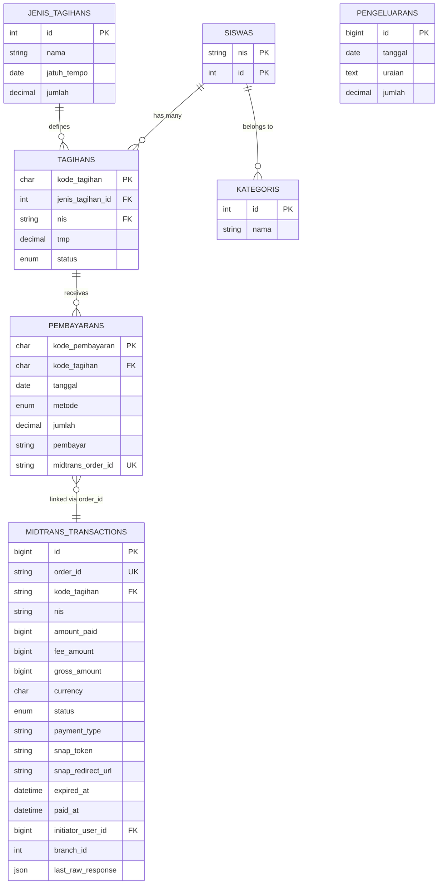
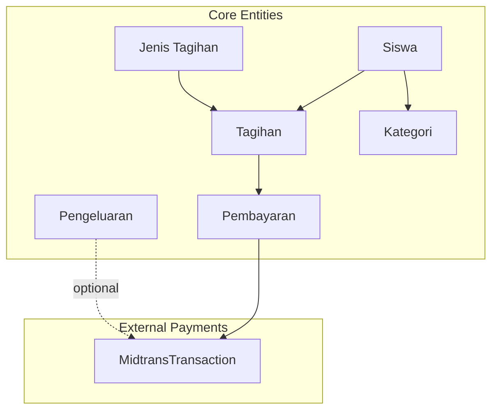
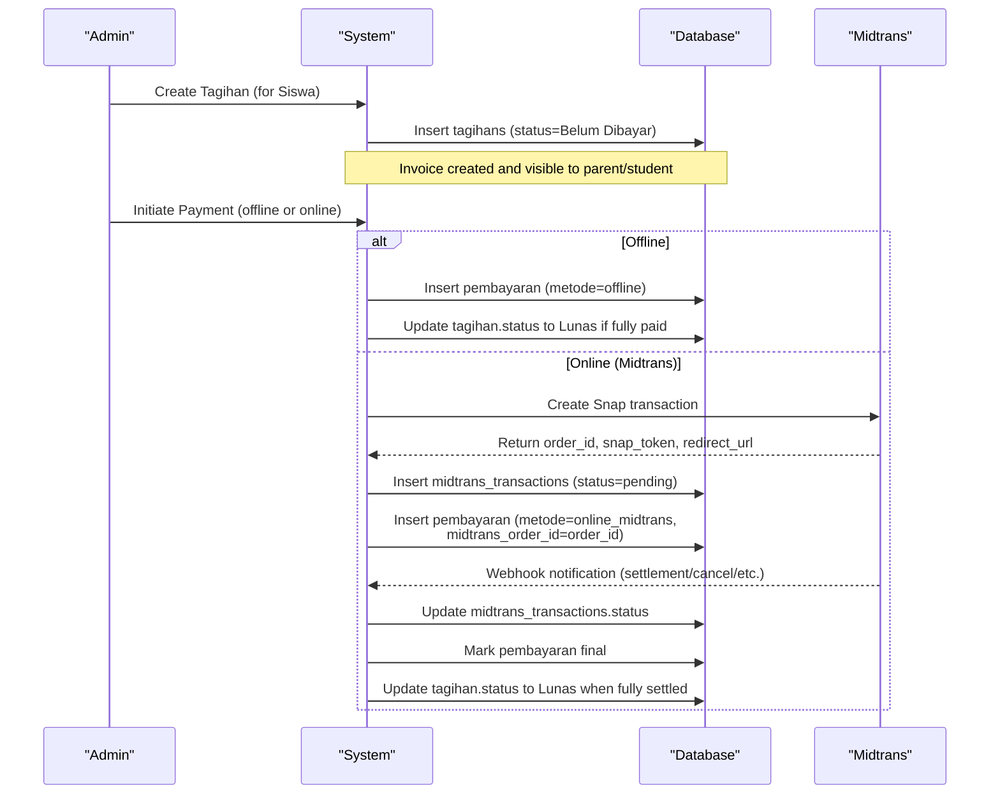
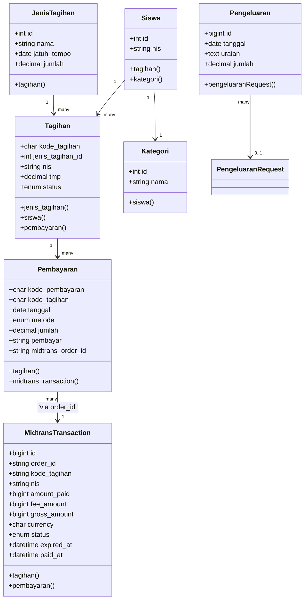
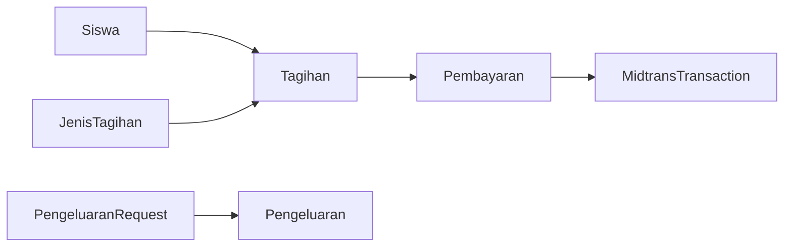

# Financial Data Models

<cite>
**Referenced Files in This Document**
- [Tagihan.php](file://backend/app/Models/Tagihan.php)
- [Pembayaran.php](file://backend/app/Models/Pembayaran.php)
- [JenisTagihan.php](file://backend/app/Models/JenisTagihan.php)
- [Kategori.php](file://backend/app/Models/Kategori.php)
- [Pengeluaran.php](file://backend/app/Models/Pengeluaran.php)
- [Siswa.php](file://backend/app/Models/Siswa.php)
- [MidtransTransaction.php](file://backend/app/Models/MidtransTransaction.php)
- [PengeluaranRequest.php](file://backend/app/Models/PengeluaranRequest.php)
- [2025_11_14_093831_create_jenis_tagihans_table.php](file://backend/database/migrations/2025_11_14_093831_create_jenis_tagihans_table.php)
- [2025_11_14_094745_create_tagihans_table.php](file://backend/database/migrations/2025_11_14_094745_create_tagihans_table.php)
- [2025_11_14_102319_create_pembayarans_table.php](file://backend/database/migrations/2025_11_14_102319_create_pembayarans_table.php)
- [2026_06_22_000001_create_midtrans_transactions_table.php](file://backend/database/migrations/2026_06_22_000001_create_midtrans_transactions_table.php)
- [2026_06_22_000003_add_midtrans_columns_to_pembayarans_table.php](file://backend/database/migrations/2026_06_22_000003_add_midtrans_columns_to_pembayarans_table.php)
</cite>

## Table of Contents
1. Introduction
2. Project Structure
3. Core Components
4. Architecture Overview
5. Detailed Component Analysis
6. Dependency Analysis
7. Performance Considerations
8. Troubleshooting Guide
9. Conclusion

## Introduction
This document describes the financial data models and transaction lifecycle for invoices (Tagihan), payments (Pembayaran), payment categories (Kategori), invoice types (Jenis Tagihan), and expenses (Pengeluaran). It explains how students relate to billing obligations, how payment status is tracked, and how Midtrans transactions integrate with internal records. It also covers monetary fields, currency handling, date/time semantics, approval workflows for expenses, and reporting patterns supported by these models.

## Project Structure
The financial domain is implemented as Eloquent models backed by database migrations. The core entities are:
- Jenis Tagihan (Invoice Type): template for recurring or standard charges
- Tagihan (Invoice): student-specific billing obligation derived from an invoice type
- Pembayaran (Payment): settlement record against one or more invoices
- Kategori (Category): classification used for students and potentially other domains
- Pengeluaran (Expense): recorded outflows, optionally linked to an approval request
- MidtransTransaction: external payment gateway state and metadata

**Diagram sources**
- [2025_11_14_093831_create_jenis_tagihans_table.php:1-31](file://backend/database/migrations/2025_11_14_093831_create_jenis_tagihans_table.php#L1-L31)
- [2025_11_14_094745_create_tagihans_table.php:1-33](file://backend/database/migrations/2025_11_14_094745_create_tagihans_table.php#L1-L33)
- [2025_11_14_102319_create_pembayarans_table.php:1-34](file://backend/database/migrations/2025_11_14_102319_create_pembayarans_table.php#L1-L34)
- [2026_06_22_000001_create_midtrans_transactions_table.php:1-71](file://backend/database/migrations/2026_06_22_000001_create_midtrans_transactions_table.php#L1-L71)
- [2026_06_22_000003_add_midtrans_columns_to_pembayarans_table.php:1-37](file://backend/database/migrations/2026_06_22_000003_add_midtrans_columns_to_pembayarans_table.php#L1-L37)

**Section sources**
- [Tagihan.php:1-60](file://backend/app/Models/Tagihan.php#L1-L60)
- [Pembayaran.php:1-53](file://backend/app/Models/Pembayaran.php#L1-L53)
- [JenisTagihan.php:1-48](file://backend/app/Models/JenisTagihan.php#L1-L48)
- [Kategori.php:1-34](file://backend/app/Models/Kategori.php#L1-L34)
- [Pengeluaran.php:1-81](file://backend/app/Models/Pengeluaran.php#L1-L81)
- [Siswa.php:1-117](file://backend/app/Models/Siswa.php#L1-L117)
- [MidtransTransaction.php:1-85](file://backend/app/Models/MidtransTransaction.php#L1-L85)

## Core Components
- Invoice Type (Jenis Tagihan)
  - Purpose: Defines a charge template including name, due date, and default amount.
  - Key fields: id, nama, jatuh_tempo, jumlah.
  - Monetary field: jumlah is decimal(12,2).
  - Time field: jatuh_tempo is a date.
  - Relationships: has many Tagihan; belongs to academic year and branch.

- Invoice (Tagihan)
  - Purpose: A specific billing obligation for a student based on an invoice type.
  - Key fields: kode_tagihan (primary key), jenis_tagihan_id, nis, tmp, status.
  - Monetary field: tmp is decimal(12,2).
  - Status values: Lunas, Belum Lunas, Belum Dibayar.
  - Relationships: belongs to Jenis Tagihan and Siswa; has many Pembayaran.

- Payment (Pembayaran)
  - Purpose: Records a payment applied to an invoice.
  - Key fields: kode_pembayaran (primary key), kode_tagihan, tanggal, metode, jumlah, pembayar.
  - Monetary field: jumlah is decimal(12,2).
  - Time field: tanggal is a date.
  - Method: offline or online_midtrans.
  - Integration: optional link to Midtrans via midtrans_order_id.

- Category (Kategori)
  - Purpose: Classification entity used by students and other modules.
  - Key fields: id, nama.
  - Relationship: Siswa belongs to Kategori.

- Expense (Pengeluaran)
  - Purpose: Records school expenditures.
  - Key fields: id, tanggal, uraian, jumlah.
  - Monetary field: jumlah is decimal(12,2).
  - Time field: tanggal is a date.
  - Optional workflow linkage: pengeluaran_request_id links to an approval request.

- Student (Siswa)
  - Purpose: Entity that owns invoices and receives payments.
  - Key identifier: nis (string).
  - Relationship: has many Tagihan; belongs to Kategori.

- Midtrans Transaction (MidtransTransaction)
  - Purpose: External payment gateway state and metadata.
  - Key fields: order_id (unique), kode_tagihan, nis, amount_paid, fee_amount, gross_amount, currency, status, payment_type, snap_token, snap_redirect_url, expired_at, paid_at, initiator_user_id, branch_id, last_raw_response.
  - Monetary fields: integer cents (amount_paid, fee_amount, gross_amount).
  - Currency: fixed to IDR by default.
  - Time fields: expired_at, paid_at are datetimes.
  - Relationships: belongs to Tagihan; has one Pembayaran via order_id; has many logs.

**Section sources**
- [JenisTagihan.php:1-48](file://backend/app/Models/JenisTagihan.php#L1-L48)
- [2025_11_14_093831_create_jenis_tagihans_table.php:1-31](file://backend/database/migrations/2025_11_14_093831_create_jenis_tagihans_table.php#L1-L31)
- [Tagihan.php:1-60](file://backend/app/Models/Tagihan.php#L1-L60)
- [2025_11_14_094745_create_tagihans_table.php:1-33](file://backend/database/migrations/2025_11_14_094745_create_tagihans_table.php#L1-L33)
- [Pembayaran.php:1-53](file://backend/app/Models/Pembayaran.php#L1-L53)
- [2025_11_14_102319_create_pembayarans_table.php:1-34](file://backend/database/migrations/2025_11_14_102319_create_pembayarans_table.php#L1-L34)
- [2026_06_22_000003_add_midtrans_columns_to_pembayarans_table.php:1-37](file://backend/database/migrations/2026_06_22_000003_add_midtrans_columns_to_pembayarans_table.php#L1-L37)
- [Kategori.php:1-34](file://backend/app/Models/Kategori.php#L1-L34)
- [Pengeluaran.php:1-81](file://backend/app/Models/Pengeluaran.php#L1-L81)
- [Siswa.php:1-117](file://backend/app/Models/Siswa.php#L1-L117)
- [MidtransTransaction.php:1-85](file://backend/app/Models/MidtransTransaction.php#L1-L85)
- [2026_06_22_000001_create_midtrans_transactions_table.php:1-71](file://backend/database/migrations/2026_06_22_000001_create_midtrans_transactions_table.php#L1-L71)

## Architecture Overview
The financial system centers on invoices created per student and payments applied to those invoices. Online payments flow through Midtrans, where external states are mirrored internally and reconciled back to payments and invoices.

**Diagram sources**
- [Tagihan.php:1-60](file://backend/app/Models/Tagihan.php#L1-L60)
- [Pembayaran.php:1-53](file://backend/app/Models/Pembayaran.php#L1-L53)
- [JenisTagihan.php:1-48](file://backend/app/Models/JenisTagihan.php#L1-L48)
- [Kategori.php:1-34](file://backend/app/Models/Kategori.php#L1-L34)
- [Pengeluaran.php:1-81](file://backend/app/Models/Pengeluaran.php#L1-L81)
- [Siswa.php:1-117](file://backend/app/Models/Siswa.php#L1-L117)
- [MidtransTransaction.php:1-85](file://backend/app/Models/MidtransTransaction.php#L1-L85)

## Detailed Component Analysis

### Invoice Lifecycle: From Creation to Payment Completion
This sequence shows how an invoice transitions from creation to being fully paid, including online payments via Midtrans.

**Diagram sources**
- [Tagihan.php:1-60](file://backend/app/Models/Tagihan.php#L1-L60)
- [Pembayaran.php:1-53](file://backend/app/Models/Pembayaran.php#L1-L53)
- [MidtransTransaction.php:1-85](file://backend/app/Models/MidtransTransaction.php#L1-L85)
- [2025_11_14_094745_create_tagihans_table.php:1-33](file://backend/database/migrations/2025_11_14_094745_create_tagihans_table.php#L1-L33)
- [2025_11_14_102319_create_pembayarans_table.php:1-34](file://backend/database/migrations/2025_11_14_102319_create_pembayarans_table.php#L1-L34)
- [2026_06_22_000001_create_midtrans_transactions_table.php:1-71](file://backend/database/migrations/2026_06_22_000001_create_midtrans_transactions_table.php#L1-L71)
- [2026_06_22_000003_add_midtrans_columns_to_pembayarans_table.php:1-37](file://backend/database/migrations/2026_06_22_000003_add_midtrans_columns_to_pembayarans_table.php#L1-L37)

### Expense Approval Workflow
Expenses can be created directly or via a request-based workflow. When linked to a request, the latest approved log determines the approver.

```mermaid
flowchart TD
Start(["Create Expense"]) --> CheckReq{"Has pengeluaran_request_id?"}
CheckReq --> |No| DirectEntry["Direct entry<br/>no approval required"]
CheckReq --> |Yes| LoadReq["Load request and approvalLogs"]
LoadReq --> FindApprove{"Find latest log with new_status='approved'"}
FindApprove --> |Found| SetPenyetuju["Set penyetuju from requester user"]
FindApprove --> |Not Found| NoApprover["penyetuju remains null"]
DirectEntry --> End(["Persist expense"])
SetPenyetuju --> End
NoApprover --> End
```

**Diagram sources**
- [Pengeluaran.php:1-81](file://backend/app/Models/Pengeluaran.php#L1-L81)
- [PengeluaranRequest.php:1-63](file://backend/app/Models/PengeluaranRequest.php#L1-L63)

**Section sources**
- [Pengeluaran.php:1-81](file://backend/app/Models/Pengeluaran.php#L1-L81)
- [PengeluaranRequest.php:1-63](file://backend/app/Models/PengeluaranRequest.php#L1-L63)

### Class Model Relationships

**Diagram sources**
- [Siswa.php:1-117](file://backend/app/Models/Siswa.php#L1-L117)
- [JenisTagihan.php:1-48](file://backend/app/Models/JenisTagihan.php#L1-L48)
- [Tagihan.php:1-60](file://backend/app/Models/Tagihan.php#L1-L60)
- [Pembayaran.php:1-53](file://backend/app/Models/Pembayaran.php#L1-L53)
- [MidtransTransaction.php:1-85](file://backend/app/Models/MidtransTransaction.php#L1-L85)
- [Kategori.php:1-34](file://backend/app/Models/Kategori.php#L1-L34)
- [Pengeluaran.php:1-81](file://backend/app/Models/Pengeluaran.php#L1-L81)

## Dependency Analysis
- Invoices depend on:
  - Jenis Tagihan (template)
  - Siswa (obligation owner)
- Payments depend on:
  - Tagihan (target invoice)
  - Optionally MidtransTransaction (external reference)
- MidtransTransaction depends on:
  - Tagihan (reconciliation target)
  - User (initiator)
- Expenses may depend on:
  - PengeluaranRequest (approval workflow)
  - Branch/Tahun Ajaran (contextual filters)

**Diagram sources**
- [Tagihan.php:1-60](file://backend/app/Models/Tagihan.php#L1-L60)
- [Pembayaran.php:1-53](file://backend/app/Models/Pembayaran.php#L1-L53)
- [MidtransTransaction.php:1-85](file://backend/app/Models/MidtransTransaction.php#L1-L85)
- [Pengeluaran.php:1-81](file://backend/app/Models/Pengeluaran.php#L1-L81)
- [PengeluaranRequest.php:1-63](file://backend/app/Models/PengeluaranRequest.php#L1-L63)

**Section sources**
- [Tagihan.php:1-60](file://backend/app/Models/Tagihan.php#L1-L60)
- [Pembayaran.php:1-53](file://backend/app/Models/Pembayaran.php#L1-L53)
- [MidtransTransaction.php:1-85](file://backend/app/Models/MidtransTransaction.php#L1-L85)
- [Pengeluaran.php:1-81](file://backend/app/Models/Pengeluaran.php#L1-L81)
- [PengeluaranRequest.php:1-63](file://backend/app/Models/PengeluaranRequest.php#L1-L63)

## Performance Considerations
- Indexing
  - Pembayaran.tanggal and Pembayaran.kode_tagihan are indexed for fast lookups and reconciliation.
  - MidtransTransaction uses composite indexes on (kode_tagihan, status) and (status, expired_at) to optimize queries for pending/in-flight transactions and per-invoice status scans.
- Monetary precision
  - Internal ledger amounts use decimal(12,2) to avoid floating-point rounding issues.
  - Midtrans amounts are stored as integers representing cents; ensure consistent conversion at boundaries.
- Query patterns
  - Use scope filters like pending in-flight transactions to limit scan size.
  - Prefer joins over N+1 calls when generating reports across Tagihan and Pembayaran.

[No sources needed since this section provides general guidance]

## Troubleshooting Guide
- Reconciling online payments
  - Verify midtrans_order_id uniqueness and mapping between Pembayaran and MidtransTransaction.
  - Check MidtransTransaction.status transitions and timestamps (expired_at, paid_at) to diagnose timing issues.
- Partial or multiple settlements
  - Confirm whether a MidtransTransaction represents batch items and ensure all related Tagihan entries are updated accordingly.
- Status inconsistencies
  - Ensure Tagihan.status reflects actual sum of Pembayaran.jumlah versus outstanding balance.
- Expense approvals
  - If penyetuju is null despite an approved request, verify the latest approval log with new_status='approved'.

**Section sources**
- [Pembayaran.php:1-53](file://backend/app/Models/Pembayaran.php#L1-L53)
- [MidtransTransaction.php:1-85](file://backend/app/Models/MidtransTransaction.php#L1-L85)
- [2026_06_22_000003_add_midtrans_columns_to_pembayarans_table.php:1-37](file://backend/database/migrations/2026_06_22_000003_add_midtrans_columns_to_pembayarans_table.php#L1-L37)
- [Pengeluaran.php:1-81](file://backend/app/Models/Pengeluaran.php#L1-L81)

## Conclusion
The financial data model cleanly separates templates (Jenis Tagihan), obligations (Tagihan), settlements (Pembayaran), and external payment states (MidtransTransaction). Students are the owners of invoices, while categories classify students and support reporting. Expenses can be direct or workflow-driven, with clear attribution of requester and approver. The design supports robust reporting, auditability, and integration with Midtrans while maintaining data integrity through precise monetary fields and well-defined statuses.