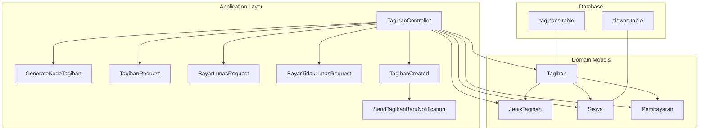
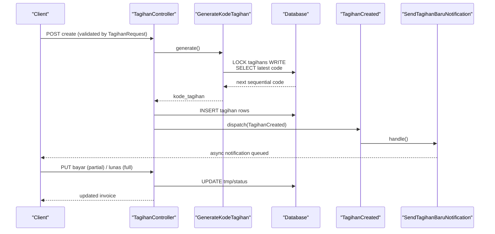
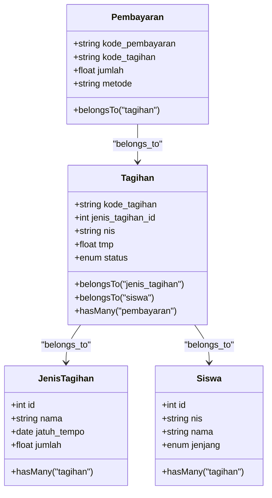
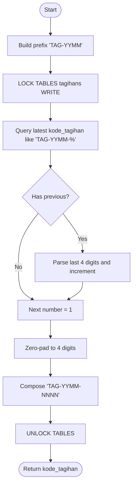
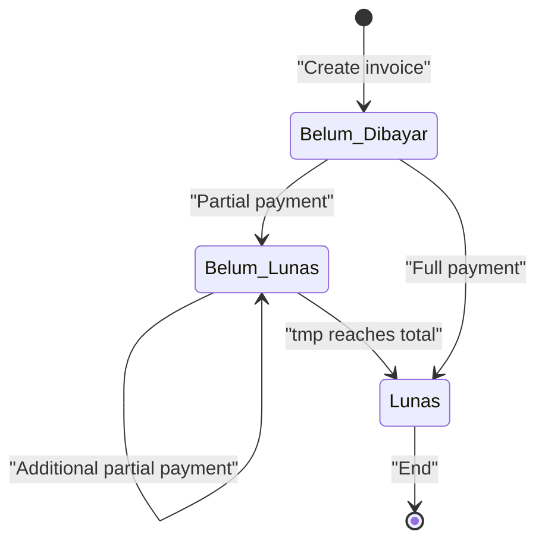
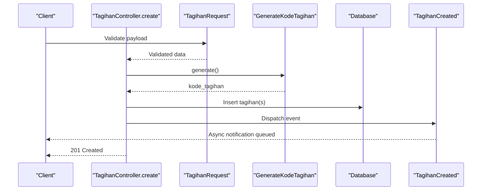
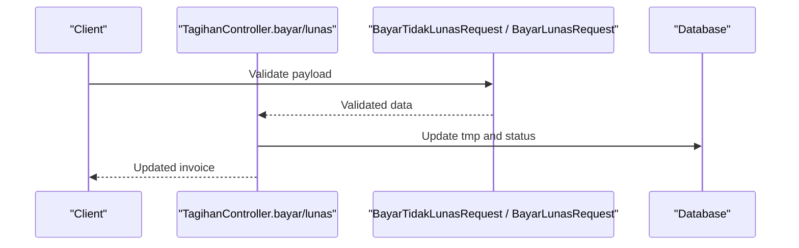
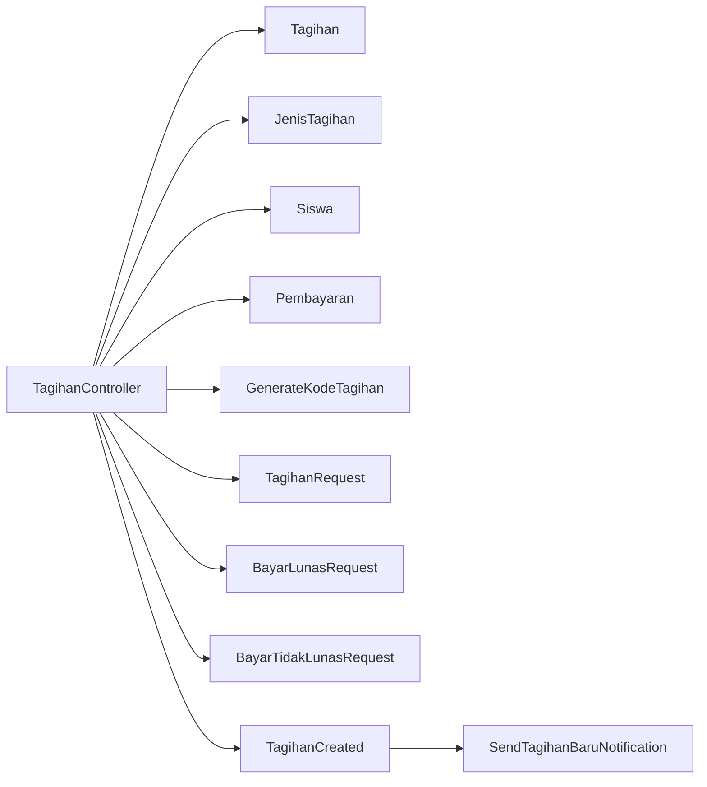

# Invoice Management (Tagihan)

<cite>
**Referenced Files in This Document**
- [Tagihan.php](file://backend/app/Models/Tagihan.php)
- [JenisTagihan.php](file://backend/app/Models/JenisTagihan.php)
- [Siswa.php](file://backend/app/Models/Siswa.php)
- [Pembayaran.php](file://backend/app/Models/Pembayaran.php)
- [2025_11_14_094745_create_tagihans_table.php](file://backend/database/migrations/2025_11_14_094745_create_tagihans_table.php)
- [2025_11_08_090937_create_siswas_table.php](file://backend/database/migrations/2025_11_08_090937_create_siswas_table.php)
- [GenerateKodeTagihan.php](file://backend/app/Services/GenerateKodeTagihan.php)
- [TagihanController.php](file://backend/app/Http/Controllers/TagihanController.php)
- [TagihanRequest.php](file://backend/app/Http/Requests/TagihanRequest.php)
- [BayarLunasRequest.php](file://backend/app/Http/Requests/BayarLunasRequest.php)
- [BayarTidakLunasRequest.php](file://backend/app/Http/Requests/BayarTidakLunasRequest.php)
- [TagihanCreated.php](file://backend/app/Events/TagihanCreated.php)
- [SendTagihanBaruNotification.php](file://backend/app/Listeners/SendTagihanBaruNotification.php)
</cite>

## Table of Contents
1. Introduction
2. Project Structure
3. Core Components
4. Architecture Overview
5. Detailed Component Analysis
6. Dependency Analysis
7. Performance Considerations
8. Troubleshooting Guide
9. Conclusion

## Introduction
This document explains the invoice management system centered on the Tagihan model. It covers the data model, relationships with students and payment types, monetary tracking, status lifecycle, code generation, validation rules, business constraints, queries, and integration points across the billing workflow.

## Project Structure
The invoice domain is implemented as a Laravel application module with:
- Eloquent models for invoices, payment types, students, and payments
- A service for generating unique invoice codes
- HTTP controllers handling CRUD, listing, filtering, and payment updates
- Request validators enforcing input rules
- Events and listeners to trigger notifications when invoices are created

**Diagram sources**
- [Tagihan.php](file://backend/app/Models/Tagihan.php)
- [JenisTagihan.php](file://backend/app/Models/JenisTagihan.php)
- [Siswa.php](file://backend/app/Models/Siswa.php)
- [Pembayaran.php](file://backend/app/Models/Pembayaran.php)
- [TagihanController.php](file://backend/app/Http/Controllers/TagihanController.php)
- [GenerateKodeTagihan.php](file://backend/app/Services/GenerateKodeTagihan.php)
- [TagihanRequest.php](file://backend/app/Http/Requests/TagihanRequest.php)
- [BayarLunasRequest.php](file://backend/app/Http/Requests/BayarLunasRequest.php)
- [BayarTidakLunasRequest.php](file://backend/app/Http/Requests/BayarTidakLunasRequest.php)
- [TagihanCreated.php](file://backend/app/Events/TagihanCreated.php)
- [SendTagihanBaruNotification.php](file://backend/app/Listeners/SendTagihanBaruNotification.php)
- [2025_11_14_094745_create_tagihans_table.php](file://backend/database/migrations/2025_11_14_094745_create_tagihans_table.php)
- [2025_11_08_090937_create_siswas_table.php](file://backend/database/migrations/2025_11_08_090937_create_siswas_table.php)

**Section sources**
- [Tagihan.php](file://backend/app/Models/Tagihan.php)
- [JenisTagihan.php](file://backend/app/Models/JenisTagihan.php)
- [Siswa.php](file://backend/app/Models/Siswa.php)
- [Pembayaran.php](file://backend/app/Models/Pembayaran.php)
- [TagihanController.php](file://backend/app/Http/Controllers/TagihanController.php)
- [GenerateKodeTagihan.php](file://backend/app/Services/GenerateKodeTagihan.php)
- [TagihanRequest.php](file://backend/app/Http/Requests/TagihanRequest.php)
- [BayarLunasRequest.php](file://backend/app/Http/Requests/BayarLunasRequest.php)
- [BayarTidakLunasRequest.php](file://backend/app/Http/Requests/BayarTidakLunasRequest.php)
- [TagihanCreated.php](file://backend/app/Events/TagihanCreated.php)
- [SendTagihanBaruNotification.php](file://backend/app/Listeners/SendTagihanBaruNotification.php)
- [2025_11_14_094745_create_tagihans_table.php](file://backend/database/migrations/2025_11_14_094745_create_tagihans_table.php)
- [2025_11_08_090937_create_siswas_table.php](file://backend/database/migrations/2025_11_08_090937_create_siswas_table.php)

## Core Components
- Tagihan model
  - Primary key: kode_tagihan (string, non-auto-increment)
  - Foreign keys: jenis_tagihan_id → JenisTagihan.id; nis → Siswa.nis
  - Monetary field: tmp (decimal), tracks cumulative paid amount
  - Status enum: Lunas, Belum Lunas, Belum Dibayar
  - Relationships: belongsTo JenisTagihan, belongsTo Siswa, hasMany Pembayaran
- JenisTagihan model
  - Defines charge type, due date, and total amount (jumlah)
  - One-to-many relationship with Tagihan
- Siswa model
  - Student record referenced by Tagihan via nis
  - Provides helper methods for grouped payment views
- Pembayaran model
  - Payment records linked to Tagihan via kode_tagihan
  - Tracks payment method, payer, amount, and optional Midtrans order id

Key behaviors:
- Invoice creation validates student eligibility based on class, level, and category
- Invoice code generation uses a thread-safe sequence per month
- Partial or full payments update tmp and status accordingly
- Deletion is blocked if any payment exists

**Section sources**
- [Tagihan.php](file://backend/app/Models/Tagihan.php)
- [JenisTagihan.php](file://backend/app/Models/JenisTagihan.php)
- [Siswa.php](file://backend/app/Models/Siswa.php)
- [Pembayaran.php](file://backend/app/Models/Pembayaran.php)
- [2025_11_14_094745_create_tagihans_table.php](file://backend/database/migrations/2025_11_14_094745_create_tagihans_table.php)

## Architecture Overview
The invoice lifecycle spans controller actions, services, events, and database tables. The following diagram maps the main flows from creation to payment completion.

**Diagram sources**
- [TagihanController.php](file://backend/app/Http/Controllers/TagihanController.php)
- [GenerateKodeTagihan.php](file://backend/app/Services/GenerateKodeTagihan.php)
- [TagihanCreated.php](file://backend/app/Events/TagihanCreated.php)
- [SendTagihanBaruNotification.php](file://backend/app/Listeners/SendTagihanBaruNotification.php)

## Detailed Component Analysis

### Data Model and Relationships

**Diagram sources**
- [Tagihan.php](file://backend/app/Models/Tagihan.php)
- [JenisTagihan.php](file://backend/app/Models/JenisTagihan.php)
- [Siswa.php](file://backend/app/Models/Siswa.php)
- [Pembayaran.php](file://backend/app/Models/Pembayaran.php)

**Section sources**
- [Tagihan.php](file://backend/app/Models/Tagihan.php)
- [JenisTagihan.php](file://backend/app/Models/JenisTagihan.php)
- [Siswa.php](file://backend/app/Models/Siswa.php)
- [Pembayaran.php](file://backend/app/Models/Pembayaran.php)

### Invoice Code Generation Service
- Generates a unique code per month using a prefix TAG-YYMM followed by a zero-padded 4-digit sequence
- Uses explicit table lock to ensure uniqueness under concurrency
- Returns the generated code for use during invoice creation

**Diagram sources**
- [GenerateKodeTagihan.php](file://backend/app/Services/GenerateKodeTagihan.php)

**Section sources**
- [GenerateKodeTagihan.php](file://backend/app/Services/GenerateKodeTagihan.php)

### Validation Rules and Business Constraints
- Creation request (TagihanRequest)
  - Requires jenis_tagihan_id, kelas_id, kategori_id, and jenjang
  - Ensures referenced entities exist
- Full payment (BayarLunasRequest)
  - Requires metode and pembayar
- Partial payment (BayarTidakLunasRequest)
  - Requires numeric jumlah within allowed precision, metode, and pembayar
- Controller-level constraints
  - Year-period ownership checks for tahun_ajaran_id
  - Student existence and branch scoping
  - Prevent deletion if any pembayaran exists
  - Enforce partial payment not exceeding total amount

**Section sources**
- [TagihanRequest.php](file://backend/app/Http/Requests/TagihanRequest.php)
- [BayarLunasRequest.php](file://backend/app/Http/Requests/BayarLunasRequest.php)
- [BayarTidakLunasRequest.php](file://backend/app/Http/Requests/BayarTidakLunasRequest.php)
- [TagihanController.php](file://backend/app/Http/Controllers/TagihanController.php)

### Invoice Lifecycle and Status Transitions
- Initial state: Belum Dibayar upon creation
- Partial payment:
  - Updates tmp by adding the payment amount
  - Sets status to Belum Lunas if tmp < total, otherwise Lunas
- Full payment:
  - Sets tmp to total amount and status to Lunas
- Deletion:
  - Blocked if any pembayaran exists

**Diagram sources**
- [TagihanController.php](file://backend/app/Http/Controllers/TagihanController.php)
- [2025_11_14_094745_create_tagihans_table.php](file://backend/database/migrations/2025_11_14_094745_create_tagihans_table.php)

**Section sources**
- [TagihanController.php](file://backend/app/Http/Controllers/TagihanController.php)
- [2025_11_14_094745_create_tagihans_table.php](file://backend/database/migrations/2025_11_14_094745_create_tagihans_table.php)

### API Workflows

#### Create Invoice

**Diagram sources**
- [TagihanController.php](file://backend/app/Http/Controllers/TagihanController.php)
- [TagihanRequest.php](file://backend/app/Http/Requests/TagihanRequest.php)
- [GenerateKodeTagihan.php](file://backend/app/Services/GenerateKodeTagihan.php)
- [TagihanCreated.php](file://backend/app/Events/TagihanCreated.php)

#### Record Payment (Partial or Full)

**Diagram sources**
- [TagihanController.php](file://backend/app/Http/Controllers/TagihanController.php)
- [BayarTidakLunasRequest.php](file://backend/app/Http/Requests/BayarTidakLunasRequest.php)
- [BayarLunasRequest.php](file://backend/app/Http/Requests/BayarLunasRequest.php)

### Example Queries and Filtering
- List invoices with filters: search by code/name/NIS, level, status, year period, sorting
- Grouped view by student with sibling support and filters
- Export PDF with multiple filters including status array and due date range

Example query patterns:
- Filter by status: where('status', 'Belum Lunas')
- Search by NIS or name: where('nis','like','%...%') or join with siswa.nama
- Grouped by student: query Siswa then eager-load scoped tagihan relations
- Export with status array: whereIn('status', $statuses)

**Section sources**
- [TagihanController.php](file://backend/app/Http/Controllers/TagihanController.php)

### Integration with Student Records
- Invoices link to students via nis foreign key
- Non-admin users can only access their own student’s invoices
- SiswaView endpoint supports viewing siblings’ invoices after authorization checks

**Section sources**
- [TagihanController.php](file://backend/app/Http/Controllers/TagihanController.php)
- [Siswa.php](file://backend/app/Models/Siswa.php)
- [2025_11_08_090937_create_siswas_table.php](file://backend/database/migrations/2025_11_08_090937_create_siswas_table.php)

### Relationship Between Invoices and Payment Types
- Each invoice references a JenisTagihan that defines the charge type, due date, and total amount
- Controllers load jenis_tagihan details for display and calculations
- Total amount comparison drives status transitions during payments

**Section sources**
- [Tagihan.php](file://backend/app/Models/Tagihan.php)
- [JenisTagihan.php](file://backend/app/Models/JenisTagihan.php)
- [TagihanController.php](file://backend/app/Http/Controllers/TagihanController.php)

## Dependency Analysis

**Diagram sources**
- [TagihanController.php](file://backend/app/Http/Controllers/TagihanController.php)
- [Tagihan.php](file://backend/app/Models/Tagihan.php)
- [JenisTagihan.php](file://backend/app/Models/JenisTagihan.php)
- [Siswa.php](file://backend/app/Models/Siswa.php)
- [Pembayaran.php](file://backend/app/Models/Pembayaran.php)
- [GenerateKodeTagihan.php](file://backend/app/Services/GenerateKodeTagihan.php)
- [TagihanRequest.php](file://backend/app/Http/Requests/TagihanRequest.php)
- [BayarLunasRequest.php](file://backend/app/Http/Requests/BayarLunasRequest.php)
- [BayarTidakLunasRequest.php](file://backend/app/Http/Requests/BayarTidakLunasRequest.php)
- [TagihanCreated.php](file://backend/app/Events/TagihanCreated.php)
- [SendTagihanBaruNotification.php](file://backend/app/Listeners/SendTagihanBaruNotification.php)

**Section sources**
- [TagihanController.php](file://backend/app/Http/Controllers/TagihanController.php)

## Performance Considerations
- Use pagination and selective column projection in list endpoints to reduce payload size
- Eager-load only required relations to avoid N+1 queries
- Leverage indexes on frequently filtered columns such as status, nis, and tahun_ajaran_id
- Keep table locks minimal; GenerateKodeTagihan already scopes locking to a single statement window

[No sources needed since this section provides general guidance]

## Troubleshooting Guide
Common issues and resolutions:
- Invoice not found: Ensure kode_tagihan exists before operations
- Cannot delete invoice: Deletion is blocked if any pembayaran exists; remove payments first
- Invalid year period: tahun_ajaran_id must belong to the user’s branch; verify ownership
- Overpayment attempt: Partial payment amount cannot exceed total amount; validate against JenisTagihan.jumlah
- Concurrency conflicts: Code generation uses table locks; retry on contention if necessary

**Section sources**
- [TagihanController.php](file://backend/app/Http/Controllers/TagihanController.php)
- [GenerateKodeTagihan.php](file://backend/app/Services/GenerateKodeTagihan.php)

## Conclusion
The Tagihan-based invoice system provides a robust foundation for school billing. It enforces clear data integrity through foreign keys and enums, ensures safe code generation under concurrency, and implements a well-defined payment lifecycle with strong validation and business constraints. The design integrates smoothly with student records and supports flexible querying, reporting, and notifications.