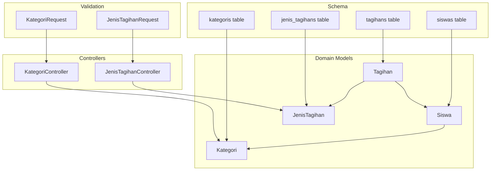
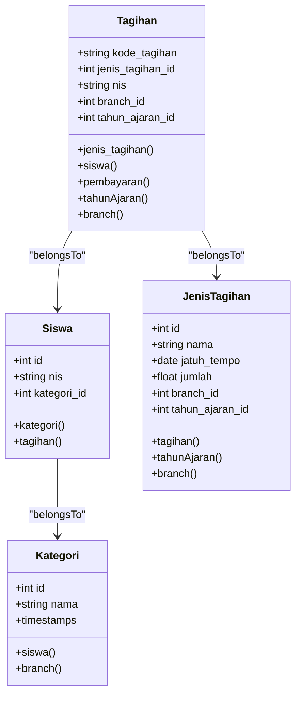
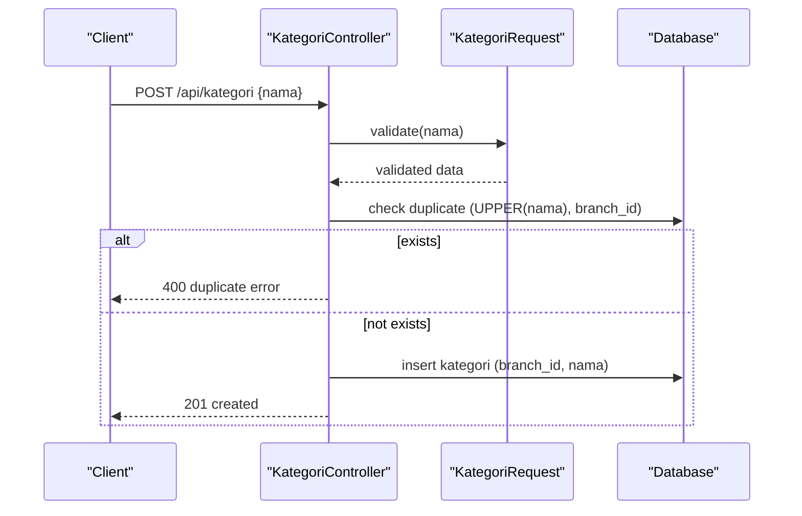
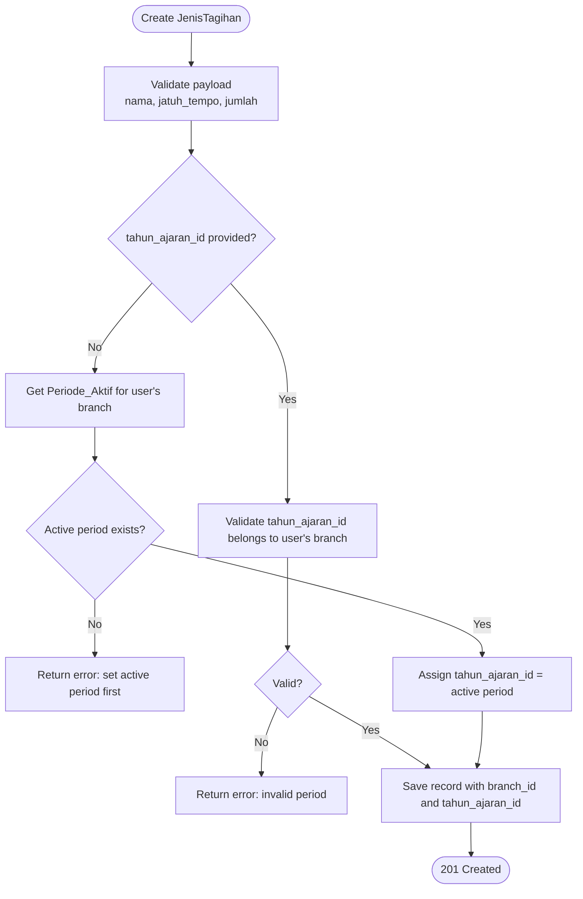
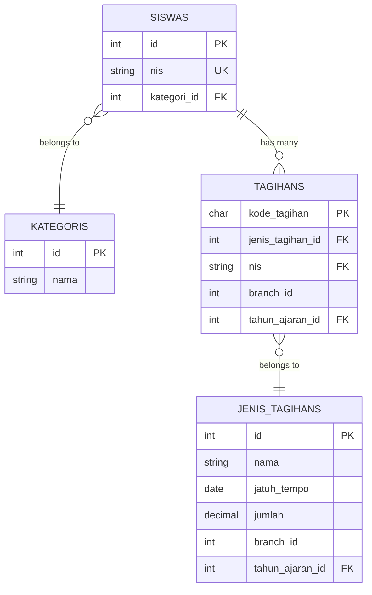

# Payment Categories & Types

<cite>
**Referenced Files in This Document**
- [Kategori.php](file://backend/app/Models/Kategori.php)
- [JenisTagihan.php](file://backend/app/Models/JenisTagihan.php)
- [Siswa.php](file://backend/app/Models/Siswa.php)
- [Tagihan.php](file://backend/app/Models/Tagihan.php)
- [2025_11_08_083401_create_kategoris_table.php](file://backend/database/migrations/2025_11_08_083401_create_kategoris_table.php)
- [2025_11_14_093831_create_jenis_tagihans_table.php](file://backend/database/migrations/2025_11_14_093831_create_jenis_tagihans_table.php)
- [2025_11_14_094745_create_tagihans_table.php](file://backend/database/migrations/2025_11_14_094745_create_tagihans_table.php)
- [2026_05_25_100100_add_tahun_ajaran_id_to_tagihans_and_jenis_tagihans.php](file://backend/database/migrations/2026_05_25_100100_add_tahun_ajaran_id_to_tagihans_and_jenis_tagihans.php)
- [2025_11_08_090937_create_siswas_table.php](file://backend/database/migrations/2025_11_08_090937_create_siswas_table.php)
- [KategoriController.php](file://backend/app/Http/Controllers/KategoriController.php)
- [JenisTagihanController.php](file://backend/app/Http/Controllers/JenisTagihanController.php)
- [KategoriRequest.php](file://backend/app/Http/Requests/KategoriRequest.php)
- [JenisTagihanRequest.php](file://backend/app/Http/Requests/JenisTagihanRequest.php)
- [kategori-api.json](file://backend/docs/kategori-api.json)
- [jenis-tagihan-api.json](file://backend/docs/jenis-tagihan-api.json)
</cite>

## Table of Contents
1. [Introduction](#introduction)
2. [Project Structure](#project-structure)
3. [Core Components](#core-components)
4. [Architecture Overview](#architecture-overview)
5. [Detailed Component Analysis](#detailed-component-analysis)
6. [Dependency Analysis](#dependency-analysis)
7. [Performance Considerations](#performance-considerations)
8. [Troubleshooting Guide](#troubleshooting-guide)
9. [Conclusion](#conclusion)
10. [Appendices](#appendices)

## Introduction
This document explains the payment categorization system centered on two core models: Kategori (Category) and Jenis Tagihan (Invoice Type). It details their fields, validation rules, relationships, and how they support billing automation and reporting. The documentation also clarifies that there is no hierarchical inheritance between categories; instead, categories are flat labels attached to students, while invoice types define recurring or one-off charges with due dates and amounts. Together, these models enable structured billing cycles, multi-period scoping via academic years, and financial reporting by category and type.

## Project Structure
The relevant backend components for this domain include:
- Models: Kategori, JenisTagihan, Siswa, Tagihan
- Controllers: KategoriController, JenisTagihanController
- Request Validators: KategoriRequest, JenisTagihanRequest
- Migrations: schema definitions for kategoris, jenis_tagihans, tagihans, siswas, and academic year linkage
- API Docs: OpenAPI specs for kategori and jenis-tagihan endpoints

**Diagram sources**
- [Kategori.php:1-34](file://backend/app/Models/Kategori.php#L1-L34)
- [JenisTagihan.php:1-48](file://backend/app/Models/JenisTagihan.php#L1-L48)
- [Siswa.php:1-117](file://backend/app/Models/Siswa.php#L1-L117)
- [Tagihan.php:1-60](file://backend/app/Models/Tagihan.php#L1-L60)
- [KategoriController.php:1-121](file://backend/app/Http/Controllers/KategoriController.php#L1-L121)
- [JenisTagihanController.php:1-179](file://backend/app/Http/Controllers/JenisTagihanController.php#L1-L179)
- [KategoriRequest.php:1-62](file://backend/app/Http/Requests/KategoriRequest.php#L1-L62)
- [JenisTagihanRequest.php:1-55](file://backend/app/Http/Requests/JenisTagihanRequest.php#L1-L55)
- [2025_11_08_083401_create_kategoris_table.php:1-29](file://backend/database/migrations/2025_11_08_083401_create_kategoris_table.php#L1-L29)
- [2025_11_14_093831_create_jenis_tagihans_table.php:1-31](file://backend/database/migrations/2025_11_14_093831_create_jenis_tagihans_table.php#L1-L31)
- [2025_11_14_094745_create_tagihans_table.php:1-33](file://backend/database/migrations/2025_11_14_094745_create_tagihans_table.php#L1-L33)
- [2025_11_08_090937_create_siswas_table.php:1-47](file://backend/database/migrations/2025_11_08_090937_create_siswas_table.php#L1-L47)

**Section sources**
- [Kategori.php:1-34](file://backend/app/Models/Kategori.php#L1-L34)
- [JenisTagihan.php:1-48](file://backend/app/Models/JenisTagihan.php#L1-L48)
- [Siswa.php:1-117](file://backend/app/Models/Siswa.php#L1-L117)
- [Tagihan.php:1-60](file://backend/app/Models/Tagihan.php#L1-L60)
- [KategoriController.php:1-121](file://backend/app/Http/Controllers/KategoriController.php#L1-L121)
- [JenisTagihanController.php:1-179](file://backend/app/Http/Controllers/JenisTagihanController.php#L1-L179)
- [KategoriRequest.php:1-62](file://backend/app/Http/Requests/KategoriRequest.php#L1-L62)
- [JenisTagihanRequest.php:1-55](file://backend/app/Http/Requests/JenisTagihanRequest.php#L1-L55)
- [2025_11_08_083401_create_kategoris_table.php:1-29](file://backend/database/migrations/2025_11_08_083401_create_kategoris_table.php#L1-L29)
- [2025_11_14_093831_create_jenis_tagihans_table.php:1-31](file://backend/database/migrations/2025_11_14_093831_create_jenis_tagihans_table.php#L1-L31)
- [2025_11_14_094745_create_tagihans_table.php:1-33](file://backend/database/migrations/2025_11_14_094745_create_tagihans_table.php#L1-L33)
- [2025_11_08_090937_create_siswas_table.php:1-47](file://backend/database/migrations/2025_11_08_090937_create_siswas_table.php#L1-L47)

## Core Components
- Kategori (Category)
  - Purpose: Flat label used to group students for reporting and segmentation.
  - Key fields: id, nama, timestamps.
  - Relationships: Many-to-one with Siswa; belongs to Branch.
  - Validation: Name required, trimmed and uppercased before save; duplicate names within a branch are rejected.
  - Deletion guard: Cannot delete if any student references it.

- Jenis Tagihan (Invoice Type)
  - Purpose: Defines charge templates with name, due date, amount, and optional academic year scoping.
  - Key fields: id, nama, jatuh_tempo, jumlah, branch_id, tahun_ajaran_id, timestamps.
  - Relationships: One-to-many with Tagihan; belongs to TahunAjaran and Branch.
  - Validation: Name length constraints; date format Y-m-d; numeric amount with max digits and decimals.
  - Academic year behavior: If not provided during creation, auto-assigned from active period of user’s branch; list endpoint filters by active period unless explicitly overridden.

- Siswa (Student)
  - Relationship to Kategori: Each student has a kategori_id foreign key.
  - Used as the anchor for generating Tagihan records per invoice type.

- Tagihan (Invoice)
  - Relationship to Jenis Tagihan: Each invoice references a specific invoice type.
  - Relationship to Siswa: Each invoice is tied to a student via nis.
  - Supports status tracking and payments.

**Section sources**
- [Kategori.php:1-34](file://backend/app/Models/Kategori.php#L1-L34)
- [JenisTagihan.php:1-48](file://backend/app/Models/JenisTagihan.php#L1-L48)
- [Siswa.php:1-117](file://backend/app/Models/Siswa.php#L1-L117)
- [Tagihan.php:1-60](file://backend/app/Models/Tagihan.php#L1-L60)
- [KategoriController.php:1-121](file://backend/app/Http/Controllers/KategoriController.php#L1-L121)
- [JenisTagihanController.php:1-179](file://backend/app/Http/Controllers/JenisTagihanController.php#L1-L179)
- [KategoriRequest.php:1-62](file://backend/app/Http/Requests/KategoriRequest.php#L1-L62)
- [JenisTagihanRequest.php:1-55](file://backend/app/Http/Requests/JenisTagihanRequest.php#L1-L55)
- [2025_11_08_090937_create_siswas_table.php:1-47](file://backend/database/migrations/2025_11_08_090937_create_siswas_table.php#L1-L47)
- [2025_11_14_094745_create_tagihans_table.php:1-33](file://backend/database/migrations/2025_11_14_094745_create_tagihans_table.php#L1-L33)
- [2026_05_25_100100_add_tahun_ajaran_id_to_tagihans_and_jenis_tagihans.php:1-45](file://backend/database/migrations/2026_05_25_100100_add_tahun_ajaran_id_to_tagihans_and_jenis_tagihans.php#L1-L45)

## Architecture Overview
The system separates “who pays” (students grouped by categories) from “what is billed” (invoice types). Invoice types drive automated billing cycles through due dates and amounts, while categories provide a stable grouping for reporting and analytics.

**Diagram sources**
- [Kategori.php:1-34](file://backend/app/Models/Kategori.php#L1-L34)
- [Siswa.php:1-117](file://backend/app/Models/Siswa.php#L1-L117)
- [JenisTagihan.php:1-48](file://backend/app/Models/JenisTagihan.php#L1-L48)
- [Tagihan.php:1-60](file://backend/app/Models/Tagihan.php#L1-L60)

## Detailed Component Analysis

### Kategori Model and API
- Fields and storage
  - Table: kategoris
  - Columns: id (PK), nama (string, required), timestamps
- Relationships
  - Siswa.kategori_id -> Kategoris.id
  - Kategori.branch_id -> Branches.id (model-level relation)
- Validation and business rules
  - Name normalization: trimmed and uppercased
  - Duplicate check scoped by authenticated user’s branch
  - Delete protection when referenced by students
- API behaviors
  - List returns an array (possibly empty)
  - Create returns 201 with resource
  - Update enforces uniqueness
  - Delete returns success or error if in use

**Diagram sources**
- [KategoriController.php:23-44](file://backend/app/Http/Controllers/KategoriController.php#L23-L44)
- [KategoriRequest.php:24-43](file://backend/app/Http/Requests/KategoriRequest.php#L24-L43)
- [2025_11_08_083401_create_kategoris_table.php:14-18](file://backend/database/migrations/2025_11_08_083401_create_kategoris_table.php#L14-L18)

**Section sources**
- [Kategori.php:1-34](file://backend/app/Models/Kategori.php#L1-L34)
- [KategoriController.php:1-121](file://backend/app/Http/Controllers/KategoriController.php#L1-L121)
- [KategoriRequest.php:1-62](file://backend/app/Http/Requests/KategoriRequest.php#L1-L62)
- [2025_11_08_083401_create_kategoris_table.php:1-29](file://backend/database/migrations/2025_11_08_083401_create_kategoris_table.php#L1-L29)
- [2025_11_08_090937_create_siswas_table.php:29-29](file://backend/database/migrations/2025_11_08_090937_create_siswas_table.php#L29-L29)
- [kategori-api.json:1-560](file://backend/docs/kategori-api.json#L1-L560)

### Jenis Tagihan Model and API
- Fields and storage
  - Table: jenis_tagihans
  - Columns: id (PK), nama (string), jatuh_tempo (date), jumlah (decimal), branch_id, tahun_ajaran_id, timestamps
- Relationships
  - Tagihan.jenis_tagihan_id -> JenisTagihan.id
  - JenisTagihan.tahun_ajaran_id -> TahunAjaran.id
  - JenisTagihan.branch_id -> Branches.id
- Validation and business rules
  - Name length constraints
  - Date format Y-m-d
  - Amount numeric with digit limits
  - Auto-assign tahun_ajaran_id from active period if omitted
  - Filter list by active period unless explicitly overridden
- API behaviors
  - List supports filtering by tahun_ajaran_id or all periods
  - Create validates and assigns tahun_ajaran_id
  - Update and delete follow standard CRUD semantics with constraint checks

**Diagram sources**
- [JenisTagihanController.php:39-78](file://backend/app/Http/Controllers/JenisTagihanController.php#L39-L78)
- [JenisTagihanRequest.php:24-31](file://backend/app/Http/Requests/JenisTagihanRequest.php#L24-L31)
- [2025_11_14_093831_create_jenis_tagihans_table.php:14-20](file://backend/database/migrations/2025_11_14_093831_create_jenis_tagihans_table.php#L14-L20)
- [2026_05_25_100100_add_tahun_ajaran_id_to_tagihans_and_jenis_tagihans.php:20-24](file://backend/database/migrations/2026_05_25_100100_add_tahun_ajaran_id_to_tagihans_and_jenis_tagihans.php#L20-L24)

**Section sources**
- [JenisTagihan.php:1-48](file://backend/app/Models/JenisTagihan.php#L1-L48)
- [JenisTagihanController.php:1-179](file://backend/app/Http/Controllers/JenisTagihanController.php#L1-L179)
- [JenisTagihanRequest.php:1-55](file://backend/app/Http/Requests/JenisTagihanRequest.php#L1-L55)
- [2025_11_14_093831_create_jenis_tagihans_table.php:1-31](file://backend/database/migrations/2025_11_14_093831_create_jenis_tagihans_table.php#L1-L31)
- [2026_05_25_100100_add_tahun_ajaran_id_to_tagihans_and_jenis_tagihans.php:1-45](file://backend/database/migrations/2026_05_25_100100_add_tahun_ajaran_id_to_tagihans_and_jenis_tagihans.php#L1-L45)
- [jenis-tagihan-api.json:1-383](file://backend/docs/jenis-tagihan-api.json#L1-L383)

### Category Setup Example
- Create a category named “BERSAUDARA” for a branch.
- Assign the category to students via siswa.kategori_id.
- Use the category in reports to segment revenue and outstanding balances by student groups.

[No sources needed since this section provides conceptual setup guidance]

### Invoice Type Configuration Example
- Define invoice types such as monthly tuition with fixed due dates and amounts.
- Optionally scope each type to an academic year; if omitted, the system auto-assigns the active period for the user’s branch.
- Generate invoices (Tagihan) for students based on selected invoice types.

**Section sources**
- [JenisTagihanController.php:39-78](file://backend/app/Http/Controllers/JenisTagihanController.php#L39-L78)
- [JenisTagihan.php:1-48](file://backend/app/Models/JenisTagihan.php#L1-L48)
- [2025_11_14_093831_create_jenis_tagihans_table.php:14-20](file://backend/database/migrations/2025_11_14_093831_create_jenis_tagihans_table.php#L14-L20)

### How These Models Support Automated Billing Cycles
- Invoice types encapsulate recurring billing parameters (due date, amount).
- Tagihan records link a student to an invoice type, enabling batch generation across students.
- Academic year scoping ensures billing templates are versioned per period.
- Status tracking on Tagihan drives reminders and collection workflows.

**Section sources**
- [Tagihan.php:1-60](file://backend/app/Models/Tagihan.php#L1-L60)
- [JenisTagihan.php:1-48](file://backend/app/Models/JenisTagihan.php#L1-L48)
- [2025_11_14_094745_create_tagihans_table.php:14-22](file://backend/database/migrations/2025_11_14_094745_create_tagihans_table.php#L14-L22)
- [2026_05_25_100100_add_tahun_ajaran_id_to_tagihans_and_jenis_tagihans.php:14-18](file://backend/database/migrations/2026_05_25_100100_add_tahun_ajaran_id_to_tagihans_and_jenis_tagihans.php#L14-L18)

### Relationship Between Categories and Financial Reporting Structures
- Categories provide a stable dimension for grouping students and aggregating financial metrics (e.g., total receivables by category).
- While categories do not inherit hierarchically, they can be combined with other dimensions (jenjang, kelas, branch, academic year) for multi-axis reporting.
- Invoice types contribute line-item detail for revenue recognition and cash flow analysis.

[No sources needed since this section provides conceptual reporting guidance]

## Dependency Analysis
The following diagram shows model-level dependencies and key database constraints that enforce referential integrity and scoping.

**Diagram sources**
- [2025_11_08_090937_create_siswas_table.php:14-36](file://backend/database/migrations/2025_11_08_090937_create_siswas_table.php#L14-L36)
- [2025_11_08_083401_create_kategoris_table.php:14-18](file://backend/database/migrations/2025_11_08_083401_create_kategoris_table.php#L14-L18)
- [2025_11_14_093831_create_jenis_tagihans_table.php:14-20](file://backend/database/migrations/2025_11_14_093831_create_jenis_tagihans_table.php#L14-L20)
- [2025_11_14_094745_create_tagihans_table.php:14-22](file://backend/database/migrations/2025_11_14_094745_create_tagihans_table.php#L14-L22)
- [2026_05_25_100100_add_tahun_ajaran_id_to_tagihans_and_jenis_tagihans.php:14-24](file://backend/database/migrations/2026_05_25_100100_add_tahun_ajaran_id_to_tagihans_and_jenis_tagihans.php#L14-L24)

**Section sources**
- [2025_11_08_090937_create_siswas_table.php:1-47](file://backend/database/migrations/2025_11_08_090937_create_siswas_table.php#L1-L47)
- [2025_11_08_083401_create_kategoris_table.php:1-29](file://backend/database/migrations/2025_11_08_083401_create_kategoris_table.php#L1-L29)
- [2025_11_14_093831_create_jenis_tagihans_table.php:1-31](file://backend/database/migrations/2025_11_14_093831_create_jenis_tagihans_table.php#L1-L31)
- [2025_11_14_094745_create_tagihans_table.php:1-33](file://backend/database/migrations/2025_11_14_094745_create_tagihans_table.php#L1-L33)
- [2026_05_25_100100_add_tahun_ajaran_id_to_tagihans_and_jenis_tagihans.php:1-45](file://backend/database/migrations/2026_05_25_100100_add_tahun_ajaran_id_to_tagihans_and_jenis_tagihans.php#L1-L45)

## Performance Considerations
- Indexing
  - Ensure indexes exist on foreign keys: siswa.kategori_id, tagihans.jenis_tagihan_id, tagihans.nis, tagihans.tahun_ajaran_id, jenis_tagihans.tahun_ajaran_id.
- Query patterns
  - Prefer filtering by branch_id and tahun_ajaran_id early in queries to reduce result sets.
  - Avoid N+1 queries when listing tagihan with related jenis_tagihan and siswa; eager-load relations where appropriate.
- Normalization
  - Keep kategori names normalized (uppercased) to avoid redundant lookups and ensure consistent joins.

[No sources needed since this section provides general guidance]

## Troubleshooting Guide
- Kategori deletion blocked
  - Symptom: Deleting a category fails because it is still used by students.
  - Resolution: Reassign or remove students referencing the category before deletion.
- Duplicate category name
  - Symptom: Creating or updating a category returns a duplicate error.
  - Resolution: Use a unique name within the same branch; names are compared case-insensitively after normalization.
- Jenis Tagihan creation without active period
  - Symptom: Creation fails if no active academic period exists for the user’s branch and none was provided.
  - Resolution: Set an active period for the branch or pass a valid tahun_ajaran_id belonging to the user’s branch.
- Invalid amount format
  - Symptom: Validation rejects jumlah outside allowed digit and decimal constraints.
  - Resolution: Provide a numeric value within the allowed range and precision.

**Section sources**
- [KategoriController.php:94-119](file://backend/app/Http/Controllers/KategoriController.php#L94-L119)
- [KategoriRequest.php:24-43](file://backend/app/Http/Requests/KategoriRequest.php#L24-L43)
- [JenisTagihanController.php:39-78](file://backend/app/Http/Controllers/JenisTagihanController.php#L39-L78)
- [JenisTagihanRequest.php:24-31](file://backend/app/Http/Requests/JenisTagihanRequest.php#L24-L31)

## Conclusion
Kategori and Jenis Tagihan form the backbone of the payment categorization system. Categories offer a flat, non-hierarchical grouping for students, while invoice types define charge templates with due dates and amounts, optionally scoped to academic years. Together, they enable robust billing automation, clear reporting structures, and maintainable data governance across branches and periods.

[No sources needed since this section summarizes without analyzing specific files]

## Appendices

### Field Definitions Summary
- Kategori
  - id: integer primary key
  - nama: string, required, normalized to uppercase
  - timestamps: created_at, updated_at
- Jenis Tagihan
  - id: integer primary key
  - nama: string, required, length-constrained
  - jatuh_tempo: date, required, format Y-m-d
  - jumlah: decimal, required, numeric with digit/decimal limits
  - branch_id: integer, scoping
  - tahun_ajaran_id: integer, scoping to academic year
  - timestamps: created_at, updated_at
- Siswa
  - kategori_id: integer foreign key to kategoris
- Tagihan
  - jenis_tagihan_id: integer foreign key to jenis_tagihans
  - nis: string foreign key to siswas.nis
  - branch_id: integer, scoping
  - tahun_ajaran_id: integer, scoping to academic year

**Section sources**
- [Kategori.php:1-34](file://backend/app/Models/Kategori.php#L1-L34)
- [JenisTagihan.php:1-48](file://backend/app/Models/JenisTagihan.php#L1-L48)
- [Siswa.php:1-117](file://backend/app/Models/Siswa.php#L1-L117)
- [Tagihan.php:1-60](file://backend/app/Models/Tagihan.php#L1-L60)
- [2025_11_08_083401_create_kategoris_table.php:14-18](file://backend/database/migrations/2025_11_08_083401_create_kategoris_table.php#L14-L18)
- [2025_11_14_093831_create_jenis_tagihans_table.php:14-20](file://backend/database/migrations/2025_11_14_093831_create_jenis_tagihans_table.php#L14-L20)
- [2025_11_14_094745_create_tagihans_table.php:14-22](file://backend/database/migrations/2025_11_14_094745_create_tagihans_table.php#L14-L22)
- [2025_11_08_090937_create_siswas_table.php:29-29](file://backend/database/migrations/2025_11_08_090937_create_siswas_table.php#L29-L29)
- [2026_05_25_100100_add_tahun_ajaran_id_to_tagihans_and_jenis_tagihans.php:14-24](file://backend/database/migrations/2026_05_25_100100_add_tahun_ajaran_id_to_tagihans_and_jenis_tagihans.php#L14-L24)