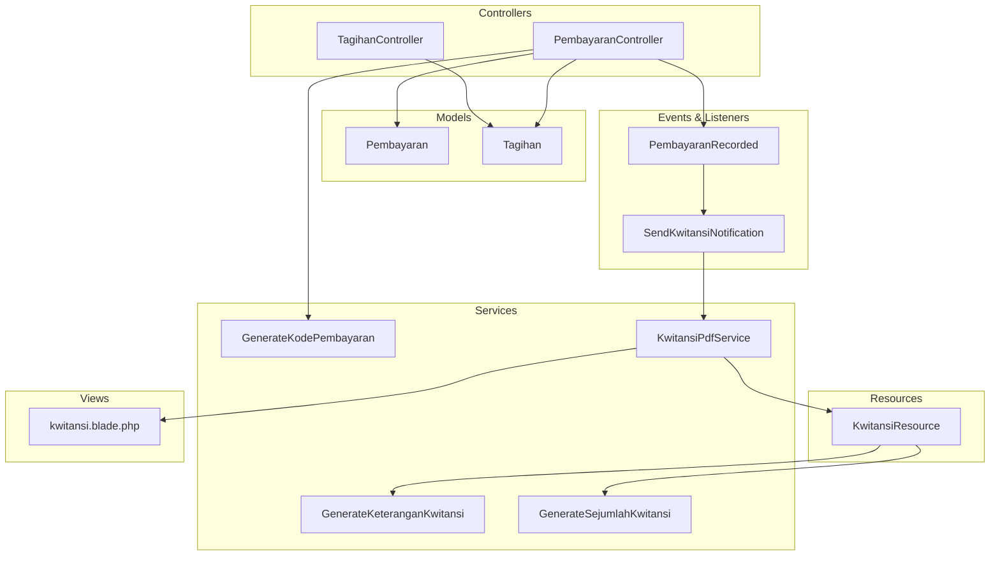
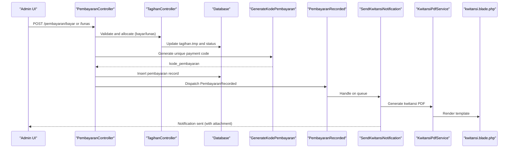
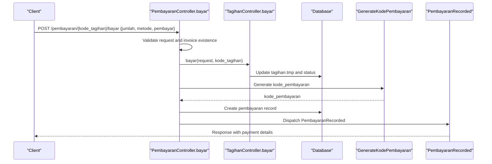
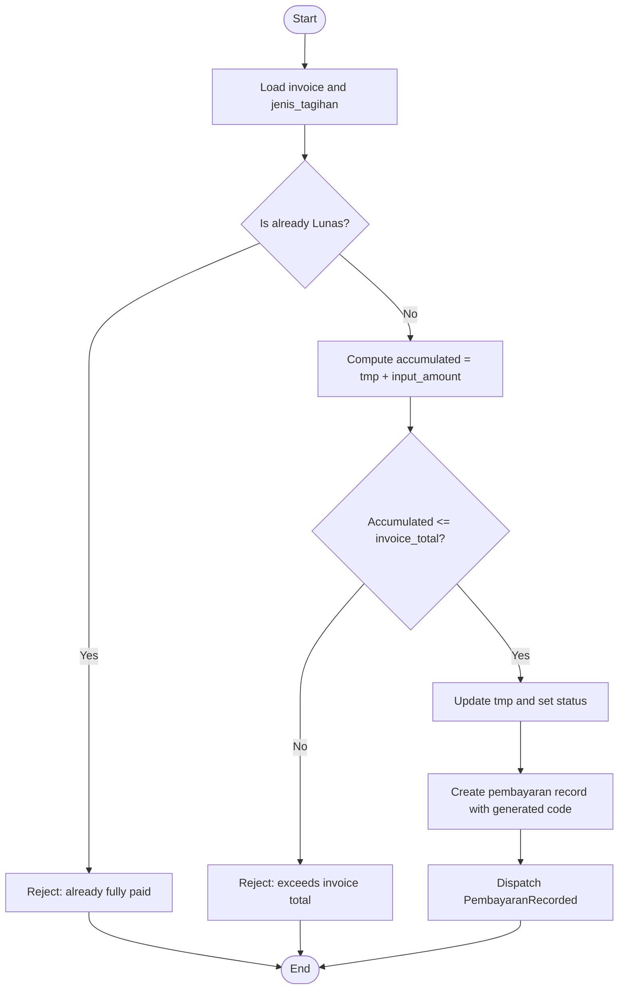
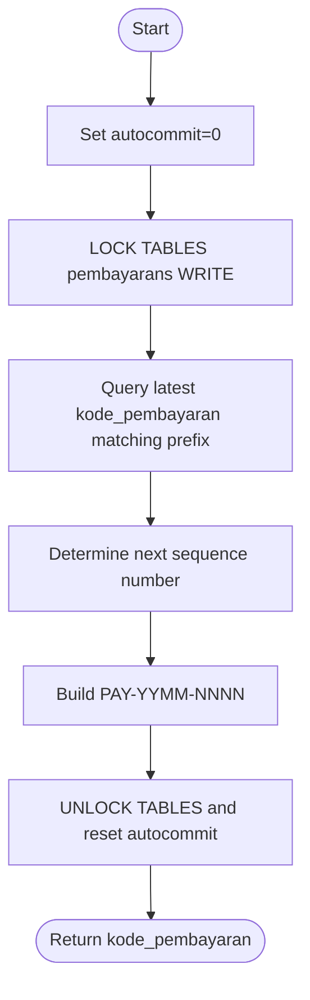
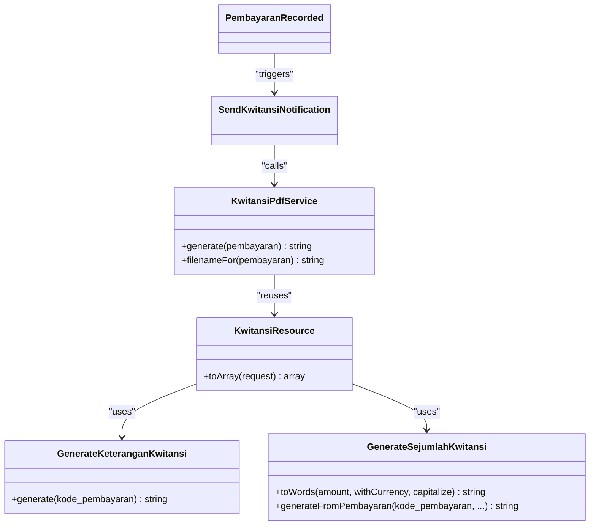
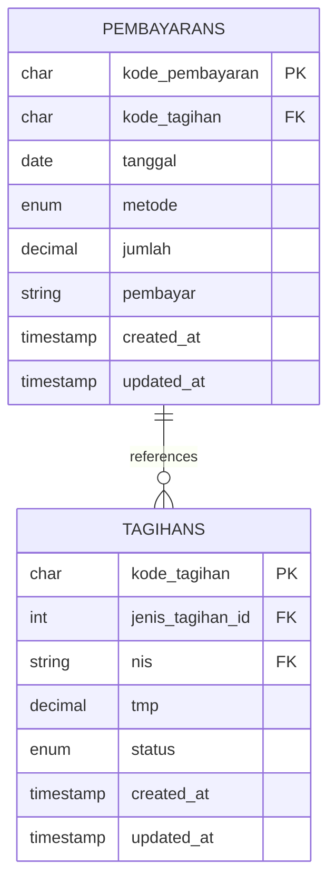
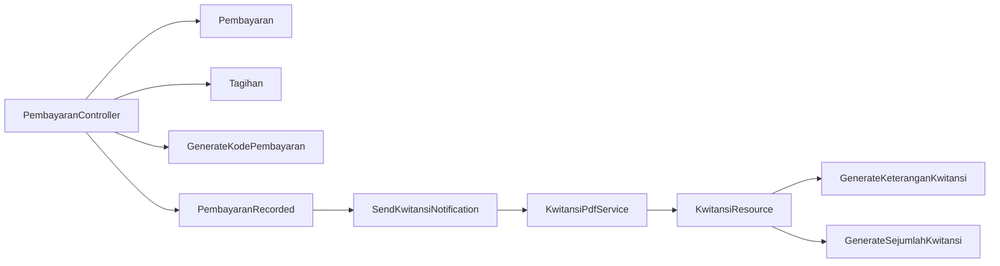

# Offline Payments

<cite>
**Referenced Files in This Document**
- [PembayaranController.php](file://backend/app/Http/Controllers/PembayaranController.php)
- [TagihanController.php](file://backend/app/Http/Controllers/TagihanController.php)
- [Pembayaran.php](file://backend/app/Models/Pembayaran.php)
- [Tagihan.php](file://backend/app/Models/Tagihan.php)
- [GenerateKodePembayaran.php](file://backend/app/Services/GenerateKodePembayaran.php)
- [GenerateKeteranganKwitansi.php](file://backend/app/Services/GenerateKeteranganKwitansi.php)
- [GenerateSejumlahKwitansi.php](file://backend/app/Services/GenerateSejumlahKwitansi.php)
- [KwitansiPdfService.php](file://backend/app/Services/Notifications/KwitansiPdfService.php)
- [KwitansiResource.php](file://backend/app/Http/Resources/KwitansiResource.php)
- [SendKwitansiNotification.php](file://backend/app/Listeners/SendKwitansiNotification.php)
- [PembayaranRecorded.php](file://backend/app/Events/PembayaranRecorded.php)
- [2025_11_14_102319_create_pembayarans_table.php](file://backend/database/migrations/2025_11_14_102319_create_pembayarans_table.php)
- [2025_11_14_094745_create_tagihans_table.php](file://backend/database/migrations/2025_11_14_094745_create_tagihans_table.php)
- [kwitansi.blade.php](file://backend/resources/views/kwitansi.blade.php)
</cite>

## Table of Contents
1. Introduction
2. Project Structure
3. Core Components
4. Architecture Overview
5. Detailed Component Analysis
6. Dependency Analysis
7. Performance Considerations
8. Troubleshooting Guide
9. Conclusion

## Introduction
This document explains the offline payment processing workflows for manual payments, cash transactions, bank transfers, and other non-digital methods. It covers:
- Payment validation and amount verification against invoice totals
- Partial payment allocation logic
- Unique payment code generation and audit trail maintenance
- Receipt (receipt/kwitansi) generation and email notification
- Approval workflows for large transactions and supervisor authorization requirements
- Financial reporting integration points

The system supports both full and partial payments, with clear status transitions and safeguards to prevent overpayment.

## Project Structure
Offline payments are implemented primarily through controllers, models, services, events/listeners, resources, and views:
- Controllers handle API endpoints for recording payments, listing, grouping, and receipt retrieval
- Models represent invoices (Tagihan) and payments (Pembayaran)
- Services generate unique payment codes and receipt content
- Events and listeners dispatch notifications after successful payment recording
- Resources format data for receipts and PDFs
- Views render printable receipts

**Diagram sources**
- [PembayaranController.php](file://backend/app/Http/Controllers/PembayaranController.php)
- [TagihanController.php](file://backend/app/Http/Controllers/TagihanController.php)
- [Pembayaran.php](file://backend/app/Models/Pembayaran.php)
- [Tagihan.php](file://backend/app/Models/Tagihan.php)
- [GenerateKodePembayaran.php](file://backend/app/Services/GenerateKodePembayaran.php)
- [GenerateKeteranganKwitansi.php](file://backend/app/Services/GenerateKeteranganKwitansi.php)
- [GenerateSejumlahKwitansi.php](file://backend/app/Services/GenerateSejumlahKwitansi.php)
- [KwitansiPdfService.php](file://backend/app/Services/Notifications/KwitansiPdfService.php)
- [KwitansiResource.php](file://backend/app/Http/Resources/KwitansiResource.php)
- [SendKwitansiNotification.php](file://backend/app/Listeners/SendKwitansiNotification.php)
- [PembayaranRecorded.php](file://backend/app/Events/PembayaranRecorded.php)
- [kwitansi.blade.php](file://backend/resources/views/kwitansi.blade.php)

**Section sources**
- [PembayaranController.php](file://backend/app/Http/Controllers/PembayaranController.php)
- [TagihanController.php](file://backend/app/Http/Controllers/TagihanController.php)
- [Pembayaran.php](file://backend/app/Models/Pembayaran.php)
- [Tagihan.php](file://backend/app/Models/Tagihan.php)
- [GenerateKodePembayaran.php](file://backend/app/Services/GenerateKodePembayaran.php)
- [GenerateKeteranganKwitansi.php](file://backend/app/Services/GenerateKeteranganKwitansi.php)
- [GenerateSejumlahKwitansi.php](file://backend/app/Services/GenerateSejumlahKwitansi.php)
- [KwitansiPdfService.php](file://backend/app/Services/Notifications/KwitansiPdfService.php)
- [KwitansiResource.php](file://backend/app/Http/Resources/KwitansiResource.php)
- [SendKwitansiNotification.php](file://backend/app/Listeners/SendKwitansiNotification.php)
- [PembayaranRecorded.php](file://backend/app/Events/PembayaranRecorded.php)
- [kwitansi.blade.php](file://backend/resources/views/kwitansi.blade.php)

## Core Components
- Pembayaran model: stores each payment record with a unique code, invoice reference, date, method, amount, payer name, and branch context.
- Tagihan model: represents an invoice line item per student, tracking cumulative paid amount (tmp) and overall status.
- GenerateKodePembayaran service: generates unique payment codes with table locking to avoid collisions.
- KwitansiResource and related services: build receipt payload and text descriptions; PdfService renders PDF.
- Event-driven notifications: after recording a payment, an event is dispatched and a listener sends a kwitansi notification.

Key responsibilities:
- Validation and allocation: ensure partial/full payments do not exceed invoice total; update tmp and status accordingly.
- Code generation: thread-safe unique identifiers for payments.
- Audit trail: persisted records with timestamps and method classification (offline vs online).
- Receipt generation: consistent data via resource layer and PDF rendering.

**Section sources**
- [Pembayaran.php](file://backend/app/Models/Pembayaran.php)
- [Tagihan.php](file://backend/app/Models/Tagihan.php)
- [GenerateKodePembayaran.php](file://backend/app/Services/GenerateKodePembayaran.php)
- [KwitansiResource.php](file://backend/app/Http/Resources/KwitansiResource.php)
- [KwitansiPdfService.php](file://backend/app/Services/Notifications/KwitansiPdfService.php)
- [PembayaranRecorded.php](file://backend/app/Events/PembayaranRecorded.php)
- [SendKwitansiNotification.php](file://backend/app/Listeners/SendKwitansiNotification.php)

## Architecture Overview
The offline payment flow involves controller orchestration, model updates, code generation, event dispatching, and receipt generation.

**Diagram sources**
- [PembayaranController.php](file://backend/app/Http/Controllers/PembayaranController.php)
- [TagihanController.php](file://backend/app/Http/Controllers/TagihanController.php)
- [GenerateKodePembayaran.php](file://backend/app/Services/GenerateKodePembayaran.php)
- [PembayaranRecorded.php](file://backend/app/Events/PembayaranRecorded.php)
- [SendKwitansiNotification.php](file://backend/app/Listeners/SendKwitansiNotification.php)
- [KwitansiPdfService.php](file://backend/app/Services/Notifications/KwitansiPdfService.php)
- [kwitansi.blade.php](file://backend/resources/views/kwitansi.blade.php)

## Detailed Component Analysis

### Payment Recording Endpoints
- Full payment (lunas): marks invoice fully paid, sets status to Lunas, records payment with calculated amount equal to remaining balance or full amount depending on current status.
- Partial payment (bayar): validates that accumulated payments do not exceed invoice total; updates tmp and status to Belum Lunas if still unpaid.
- Batch full payment (batchLunas): processes multiple invoices atomically within a transaction, generating one payment per invoice and marking them all Lunas.

Validation rules enforced:
- Invoice must exist and belong to the user’s branch.
- Cannot pay a fully paid invoice again.
- Accumulated amount cannot exceed invoice total.
- For deletion, online Midtrans payments require additional permissions.

Audit trail:
- Each payment persists with timestamp, method (offline/online_midtrans), payer, and branch context.
- Deletion path recalculates tmp and status to maintain consistency.

Receipt retrieval:
- Endpoint returns structured receipt data via KwitansiResource for printing or further processing.

**Section sources**
- [PembayaranController.php](file://backend/app/Http/Controllers/PembayaranController.php)
- [TagihanController.php](file://backend/app/Http/Controllers/TagihanController.php)
- [Pembayaran.php](file://backend/app/Models/Pembayaran.php)
- [Tagihan.php](file://backend/app/Models/Tagihan.php)

#### Sequence Diagram: Partial Payment Flow

**Diagram sources**
- [PembayaranController.php](file://backend/app/Http/Controllers/PembayaranController.php)
- [TagihanController.php](file://backend/app/Http/Controllers/TagihanController.php)
- [GenerateKodePembayaran.php](file://backend/app/Services/GenerateKodePembayaran.php)
- [PembayaranRecorded.php](file://backend/app/Events/PembayaranRecorded.php)

### Amount Verification and Allocation Logic
- The system tracks cumulative paid amount in tagihan.tmp.
- For partial payments, it ensures tmp + new_amount <= invoice total.
- Status transitions:
  - If tmp equals invoice total -> Lunas
  - Else if tmp > 0 -> Belum Lunas
  - Else -> Belum Dibayar
- Full payment endpoint computes final amount based on current status and sets tmp to invoice total.

**Diagram sources**
- [TagihanController.php](file://backend/app/Http/Controllers/TagihanController.php)
- [PembayaranController.php](file://backend/app/Http/Controllers/PembayaranController.php)

**Section sources**
- [TagihanController.php](file://backend/app/Http/Controllers/TagihanController.php)
- [PembayaranController.php](file://backend/app/Http/Controllers/PembayaranController.php)

### Payment Code Generation Service
- Generates a unique identifier with year-month prefix and sequential counter.
- Uses explicit table lock to prevent race conditions during concurrent generation.
- Ensures uniqueness across branches by combining prefix and sequence.

**Diagram sources**
- [GenerateKodePembayaran.php](file://backend/app/Services/GenerateKodePembayaran.php)

**Section sources**
- [GenerateKodePembayaran.php](file://backend/app/Services/GenerateKodePembayaran.php)

### Receipt Generation and Email Notification
- KwitansiResource builds receipt payload including setting info, payer, amount, purpose description, and spelled-out amount.
- KwitansiPdfService reuses the same resource data to render a consistent PDF using the shared view.
- After recording a payment, PembayaranRecorded event triggers SendKwitansiNotification which uses KwitansiPdfService to attach the PDF to the notification.

**Diagram sources**
- [KwitansiResource.php](file://backend/app/Http/Resources/KwitansiResource.php)
- [GenerateKeteranganKwitansi.php](file://backend/app/Services/GenerateKeteranganKwitansi.php)
- [GenerateSejumlahKwitansi.php](file://backend/app/Services/GenerateSejumlahKwitansi.php)
- [KwitansiPdfService.php](file://backend/app/Services/Notifications/KwitansiPdfService.php)
- [PembayaranRecorded.php](file://backend/app/Events/PembayaranRecorded.php)
- [SendKwitansiNotification.php](file://backend/app/Listeners/SendKwitansiNotification.php)

**Section sources**
- [KwitansiResource.php](file://backend/app/Http/Resources/KwitansiResource.php)
- [GenerateKeteranganKwitansi.php](file://backend/app/Services/GenerateKeteranganKwitansi.php)
- [GenerateSejumlahKwitansi.php](file://backend/app/Services/GenerateSejumlahKwitansi.php)
- [KwitansiPdfService.php](file://backend/app/Services/Notifications/KwitansiPdfService.php)
- [PembayaranRecorded.php](file://backend/app/Events/PembayaranRecorded.php)
- [SendKwitansiNotification.php](file://backend/app/Listeners/SendKwitansiNotification.php)

### Data Model and Schema
- Pembayaran: primary key is a string code; includes foreign key to Tagihan, date, method enum, amount, payer, timestamps.
- Tagihan: primary key is a string code; includes foreign keys to JenisTagihan and Siswa; tracks tmp and status.

**Diagram sources**
- [2025_11_14_102319_create_pembayarans_table.php](file://backend/database/migrations/2025_11_14_102319_create_pembayarans_table.php)
- [2025_11_14_094745_create_tagihans_table.php](file://backend/database/migrations/2025_11_14_094745_create_tagihans_table.php)

**Section sources**
- [2025_11_14_102319_create_pembayarans_table.php](file://backend/database/migrations/2025_11_14_102319_create_pembayarans_table.php)
- [2025_11_14_094745_create_tagihans_table.php](file://backend/database/migrations/2025_11_14_094745_create_tagihans_table.php)
- [Pembayaran.php](file://backend/app/Models/Pembayaran.php)
- [Tagihan.php](file://backend/app/Models/Tagihan.php)

### Approval Workflows and Supervisor Authorization
- The repository includes approval-related models and migrations for expenditure requests and logs. However, there is no explicit implementation of approval workflows for large offline payments in the analyzed payment controllers and services.
- Recommendation: Introduce a threshold-based approval step before creating Pembayaran records for high-value amounts, requiring supervisor authorization and logging via existing approval infrastructure.

[No sources needed since this section provides general guidance]

### Financial Reporting Integration
- The system provides export capabilities for various reports (e.g., daily cash, monthly recap, payment exports). These can be used to reconcile offline payments and integrate with financial reporting.
- Use exported datasets to match bank statements and internal cash registers.

[No sources needed since this section provides general guidance]

## Dependency Analysis
- Controllers depend on models for persistence and on services for code generation and receipt formatting.
- Event-listener pattern decouples notification from core payment recording.
- Resource layer centralizes receipt data structure, ensuring consistency between admin UI and email attachments.

**Diagram sources**
- [PembayaranController.php](file://backend/app/Http/Controllers/PembayaranController.php)
- [Pembayaran.php](file://backend/app/Models/Pembayaran.php)
- [Tagihan.php](file://backend/app/Models/Tagihan.php)
- [GenerateKodePembayaran.php](file://backend/app/Services/GenerateKodePembayaran.php)
- [PembayaranRecorded.php](file://backend/app/Events/PembayaranRecorded.php)
- [SendKwitansiNotification.php](file://backend/app/Listeners/SendKwitansiNotification.php)
- [KwitansiPdfService.php](file://backend/app/Services/Notifications/KwitansiPdfService.php)
- [KwitansiResource.php](file://backend/app/Http/Resources/KwitansiResource.php)
- [GenerateKeteranganKwitansi.php](file://backend/app/Services/GenerateKeteranganKwitansi.php)
- [GenerateSejumlahKwitansi.php](file://backend/app/Services/GenerateSejumlahKwitansi.php)

**Section sources**
- [PembayaranController.php](file://backend/app/Http/Controllers/PembayaranController.php)
- [Pembayaran.php](file://backend/app/Models/Pembayaran.php)
- [Tagihan.php](file://backend/app/Models/Tagihan.php)
- [GenerateKodePembayaran.php](file://backend/app/Services/GenerateKodePembayaran.php)
- [PembayaranRecorded.php](file://backend/app/Events/PembayaranRecorded.php)
- [SendKwitansiNotification.php](file://backend/app/Listeners/SendKwitansiNotification.php)
- [KwitansiPdfService.php](file://backend/app/Services/Notifications/KwitansiPdfService.php)
- [KwitansiResource.php](file://backend/app/Http/Resources/KwitansiResource.php)
- [GenerateKeteranganKwitansi.php](file://backend/app/Services/GenerateKeteranganKwitansi.php)
- [GenerateSejumlahKwitansi.php](file://backend/app/Services/GenerateSejumlahKwitansi.php)

## Performance Considerations
- Table-level locking during payment code generation prevents race conditions but may introduce contention under high concurrency. Consider optimizing with database sequences or application-level atomic increments if necessary.
- Eager loading relationships in list endpoints reduces N+1 queries and improves performance.
- Pagination parameters cap result sizes to avoid heavy payloads.

[No sources needed since this section provides general guidance]

## Troubleshooting Guide
Common issues and resolutions:
- Overpayment errors: Ensure accumulated payments do not exceed invoice total; verify tmp and invoice total values.
- Already paid invoices: Prevent duplicate full payments; check invoice status before attempting lunas.
- Online payment deletion restrictions: Deleting online Midtrans payments requires specific permissions; confirm user roles and permissions.
- Receipt generation failures: Verify that AppSetting configuration exists and that the shared view is available.

**Section sources**
- [PembayaranController.php](file://backend/app/Http/Controllers/PembayaranController.php)
- [TagihanController.php](file://backend/app/Http/Controllers/TagihanController.php)
- [KwitansiPdfService.php](file://backend/app/Services/Notifications/KwitansiPdfService.php)

## Conclusion
The offline payment workflow provides robust validation, safe allocation, unique code generation, and consistent receipt generation. While approval workflows for large transactions are not explicitly implemented in the payment controllers, the system’s structure allows straightforward extension. Export capabilities support reconciliation and financial reporting integration.

[No sources needed since this section summarizes without analyzing specific files]